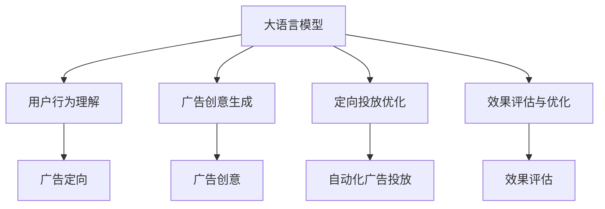

                 

# LLM在广告营销中的应用：精准定向投放

> 关键词：
广告营销, 大语言模型, 精准定向, 自动化广告投放, 广告创意生成, 用户行为分析, 个性化广告推荐, 跨领域迁移学习

## 1. 背景介绍

### 1.1 问题由来

随着互联网和数字营销的迅猛发展，广告投放的市场规模不断扩大，广告主希望通过更加精准和有效的投放策略，实现更高的ROI。传统的广告投放依赖于经验法则和手动调整，存在诸多局限：

- **投放效率低**：需要大量人力进行数据收集和模型调整，投放周期长。
- **定向不够精准**：传统投放方法依赖于用户历史行为和静态属性，难以捕捉用户即时兴趣和动态行为变化。
- **创意内容单一**：广告创意生成依赖于人工创作，效率低且创意多样性不足。
- **广告效果评估困难**：难以全面了解广告投放的效果和用户反馈，无法及时优化投放策略。

大语言模型（Large Language Model, LLM）的出现，为这些问题提供了全新的解决方案。大语言模型具备强大的自然语言理解能力和生成能力，能够在广告投放的各个环节发挥重要作用，显著提升广告营销的精准度和效率。

### 1.2 问题核心关键点

大语言模型在广告营销中的应用，主要集中在以下几个方面：

- **用户行为理解**：利用大语言模型的多语言理解和推理能力，分析用户浏览、点击、评论等行为数据，捕捉用户即时兴趣和动态行为变化。
- **广告创意生成**：借助大语言模型的文本生成能力，自动化生成多样化的广告创意，提升广告吸引力和投放效果。
- **定向投放优化**：通过大语言模型的自然语言推理和对比学习，实现精准定向投放，最大化广告曝光和转化率。
- **效果评估与优化**：利用大语言模型的多轮对话能力，实时评估广告效果，动态调整投放策略，确保广告投放的高效性和灵活性。

这些核心关键点构成了大语言模型在广告营销应用中的基本框架，为大语言模型提供了广阔的用武之地。

## 2. 核心概念与联系

### 2.1 核心概念概述

为更好地理解大语言模型在广告营销中的应用，本节将介绍几个密切相关的核心概念：

- **大语言模型（LLM）**：以自回归(如GPT)或自编码(如BERT)模型为代表的大规模预训练语言模型。通过在大规模无标签文本语料上进行预训练，学习通用的语言表示，具备强大的语言理解和生成能力。

- **广告定向（Ad Targeting）**：根据用户特征和行为数据，将广告投放至最有可能点击的用户面前。通过精准定向，最大化广告效果和ROI。

- **广告创意（Ad Creative）**：包含文本、图片、视频等多种形式的广告内容，用于吸引和引导用户点击。

- **自然语言推理（NLI）**：判断一个文本是否蕴含另一个文本的逻辑推理过程，用于广告定向中的逻辑推理和判断。

- **多轮对话（Multi-turn Dialog）**：在广告效果评估和优化中，通过多轮对话了解用户反馈，动态调整广告投放策略。

- **自动化广告投放（Programmatic Advertising）**：利用算法和自动化工具，进行广告的自动购买和投放，提高广告投放的效率和精度。

这些核心概念之间的逻辑关系可以通过以下Mermaid流程图来展示：



这个流程图展示了大语言模型在广告营销中的核心概念及其之间的关系：

1. 大语言模型通过预训练获得基础能力。
2. 用户行为理解和大语言模型的自然语言理解能力结合，实现对用户即时兴趣和动态行为的分析。
3. 广告创意生成利用大语言模型的文本生成能力，自动化生成多样化的广告创意。
4. 定向投放优化通过大语言模型的自然语言推理和对比学习，实现精准定向投放。
5. 效果评估与优化利用大语言模型的多轮对话能力，实时评估广告效果，动态调整投放策略。

这些概念共同构成了大语言模型在广告营销中的应用框架，使其能够实现更加精准、高效的广告投放。

## 3. 核心算法原理 & 具体操作步骤
### 3.1 算法原理概述

大语言模型在广告营销中的精准定向投放，本质上是一个有监督的细粒度迁移学习过程。其核心思想是：将大语言模型视作一个强大的"行为理解器"和"定向器"，通过在用户行为数据上进行的微调，使得模型能够理解用户兴趣和行为，输出精准定向的投放策略。

形式化地，假设用户行为数据为 $D=\{(x_i, y_i)\}_{i=1}^N$，其中 $x_i$ 为用户的浏览、点击、评论等行为数据，$y_i$ 为用户的兴趣标签（如购物、旅行、阅读等）。目标是通过微调大语言模型 $M_{\theta}$，使得其能够预测用户 $x_i$ 的兴趣标签 $y_i$。

微调的目标是找到新的模型参数 $\hat{\theta}$，使得：

$$
\hat{\theta}=\mathop{\arg\min}_{\theta} \mathcal{L}(M_{\theta},D)
$$

其中 $\mathcal{L}$ 为针对用户行为数据设计的损失函数，用于衡量模型预测输出与真实标签之间的差异。常见的损失函数包括交叉熵损失、均方误差损失等。

通过梯度下降等优化算法，微调过程不断更新模型参数 $\theta$，最小化损失函数 $\mathcal{L}$，使得模型输出逼近真实标签。由于 $\theta$ 已经通过预训练获得了较好的初始化，因此即便在用户行为数据规模较小的情况下，也能较快收敛到理想的模型参数 $\hat{\theta}$。

### 3.2 算法步骤详解

大语言模型在广告营销中的精准定向投放，一般包括以下几个关键步骤：

**Step 1: 准备预训练模型和用户行为数据**
- 选择合适的预训练语言模型 $M_{\theta}$ 作为初始化参数，如 GPT-3、BERT 等。
- 收集目标用户的浏览、点击、评论等行为数据，划分为训练集、验证集和测试集。一般要求行为数据与预训练数据的分布不要差异过大。

**Step 2: 添加任务适配层**
- 根据任务类型，在预训练模型顶层设计合适的输出层和损失函数。
- 对于分类任务，通常在顶层添加线性分类器和交叉熵损失函数。
- 对于回归任务，通常使用均方误差损失函数。

**Step 3: 设置微调超参数**
- 选择合适的优化算法及其参数，如 AdamW、SGD 等，设置学习率、批大小、迭代轮数等。
- 设置正则化技术及强度，包括权重衰减、Dropout、Early Stopping 等。
- 确定冻结预训练参数的策略，如仅微调顶层，或全部参数都参与微调。

**Step 4: 执行梯度训练**
- 将行为数据分批次输入模型，前向传播计算损失函数。
- 反向传播计算参数梯度，根据设定的优化算法和学习率更新模型参数。
- 周期性在验证集上评估模型性能，根据性能指标决定是否触发 Early Stopping。
- 重复上述步骤直到满足预设的迭代轮数或 Early Stopping 条件。

**Step 5: 测试和部署**
- 在测试集上评估微调后模型 $M_{\hat{\theta}}$ 的性能，对比微调前后的精度提升。
- 使用微调后的模型对新用户行为数据进行预测，集成到实际的广告投放系统中。
- 持续收集新的用户行为数据，定期重新微调模型，以适应数据分布的变化。

以上是基于监督学习的大语言模型微调一般流程。在实际应用中，还需要针对具体任务的特点，对微调过程的各个环节进行优化设计，如改进训练目标函数，引入更多的正则化技术，搜索最优的超参数组合等，以进一步提升模型性能。

### 3.3 算法优缺点

基于监督学习的大语言模型微调方法具有以下优点：
1. 简单高效。只需准备少量用户行为数据，即可对预训练模型进行快速适配，获得较大的性能提升。
2. 通用适用。适用于各种广告定向任务，包括分类、匹配、回归等，设计简单的任务适配层即可实现微调。
3. 参数高效。利用参数高效微调技术，在固定大部分预训练参数的情况下，仍可取得不错的提升。
4. 效果显著。在学术界和工业界的诸多广告定向任务上，基于微调的方法已经刷新了最先进的性能指标。

同时，该方法也存在一定的局限性：
1. 依赖标注数据。微调的效果很大程度上取决于标注数据的质量和数量，获取高质量标注数据的成本较高。
2. 迁移能力有限。当目标任务与预训练数据的分布差异较大时，微调的性能提升有限。
3. 负面效果传递。预训练模型的固有偏见、有害信息等，可能通过微调传递到广告定向任务，造成负面影响。
4. 可解释性不足。微调模型的决策过程通常缺乏可解释性，难以对其推理逻辑进行分析和调试。

尽管存在这些局限性，但就目前而言，基于监督学习的微调方法仍是大语言模型应用的最主流范式。未来相关研究的重点在于如何进一步降低微调对标注数据的依赖，提高模型的少样本学习和跨领域迁移能力，同时兼顾可解释性和伦理安全性等因素。

### 3.4 算法应用领域

基于大语言模型微调的广告定向方法，已经在多种广告投放场景中得到了广泛应用，覆盖了从搜索引擎广告到社交媒体广告的各个领域，例如：

- 搜索引擎广告：通过搜索关键词和用户点击记录，利用微调模型预测用户兴趣，进行精准投放。
- 社交媒体广告：利用用户的社交互动数据，如点赞、评论、分享等，结合微调模型进行定向投放。
- 视频广告：结合用户的观看行为数据，预测用户的兴趣，进行精准的视频广告投放。
- 推荐广告：结合用户的浏览历史和行为数据，预测用户可能感兴趣的广告，进行个性化推荐。

除了上述这些经典应用外，大语言模型微调还被创新性地应用到更多场景中，如实时竞价广告（RTB）、跨平台广告投放、广告效果评估等，为广告投放带来了全新的突破。随着预训练模型和微调方法的不断进步，相信广告投放技术也将迎来更多的创新和应用。

## 4. 数学模型和公式 & 详细讲解
### 4.1 数学模型构建

本节将使用数学语言对基于监督学习的大语言模型微调过程进行更加严格的刻画。

记大语言模型为 $M_{\theta}:\mathcal{X} \rightarrow \mathcal{Y}$，其中 $\mathcal{X}$ 为用户行为数据，$\mathcal{Y}$ 为用户兴趣标签，$\theta \in \mathbb{R}^d$ 为模型参数。假设广告定向任务的训练集为 $D=\{(x_i,y_i)\}_{i=1}^N, x_i \in \mathcal{X}, y_i \in \mathcal{Y}$。

定义模型 $M_{\theta}$ 在用户行为数据 $x$ 上的损失函数为 $\ell(M_{\theta}(x),y)$，则在用户行为数据集 $D$ 上的经验风险为：

$$
\mathcal{L}(\theta) = \frac{1}{N} \sum_{i=1}^N \ell(M_{\theta}(x_i),y_i)
$$

微调的目标是最小化经验风险，即找到最优参数：

$$
\theta^* = \mathop{\arg\min}_{\theta} \mathcal{L}(\theta)
$$

在实践中，我们通常使用基于梯度的优化算法（如SGD、Adam等）来近似求解上述最优化问题。设 $\eta$ 为学习率，$\lambda$ 为正则化系数，则参数的更新公式为：

$$
\theta \leftarrow \theta - \eta \nabla_{\theta}\mathcal{L}(\theta) - \eta\lambda\theta
$$

其中 $\nabla_{\theta}\mathcal{L}(\theta)$ 为损失函数对参数 $\theta$ 的梯度，可通过反向传播算法高效计算。

### 4.2 公式推导过程

以下我们以二分类任务为例，推导交叉熵损失函数及其梯度的计算公式。

假设模型 $M_{\theta}$ 在用户行为数据 $x$ 上的输出为 $\hat{y}=M_{\theta}(x) \in [0,1]$，表示用户点击广告的概率。真实标签 $y \in \{0,1\}$。则二分类交叉熵损失函数定义为：

$$
\ell(M_{\theta}(x),y) = -[y\log \hat{y} + (1-y)\log (1-\hat{y})]
$$

将其代入经验风险公式，得：

$$
\mathcal{L}(\theta) = -\frac{1}{N}\sum_{i=1}^N [y_i\log M_{\theta}(x_i)+(1-y_i)\log(1-M_{\theta}(x_i))]
$$

根据链式法则，损失函数对参数 $\theta_k$ 的梯度为：

$$
\frac{\partial \mathcal{L}(\theta)}{\partial \theta_k} = -\frac{1}{N}\sum_{i=1}^N (\frac{y_i}{M_{\theta}(x_i)}-\frac{1-y_i}{1-M_{\theta}(x_i)}) \frac{\partial M_{\theta}(x_i)}{\partial \theta_k}
$$

其中 $\frac{\partial M_{\theta}(x_i)}{\partial \theta_k}$ 可进一步递归展开，利用自动微分技术完成计算。

在得到损失函数的梯度后，即可带入参数更新公式，完成模型的迭代优化。重复上述过程直至收敛，最终得到适应广告定向任务的最优模型参数 $\theta^*$。

## 5. 项目实践：代码实例和详细解释说明
### 5.1 开发环境搭建

在进行广告定向实践前，我们需要准备好开发环境。以下是使用Python进行PyTorch开发的环境配置流程：

1. 安装Anaconda：从官网下载并安装Anaconda，用于创建独立的Python环境。

2. 创建并激活虚拟环境：
```bash
conda create -n pytorch-env python=3.8 
conda activate pytorch-env
```

3. 安装PyTorch：根据CUDA版本，从官网获取对应的安装命令。例如：
```bash
conda install pytorch torchvision torchaudio cudatoolkit=11.1 -c pytorch -c conda-forge
```

4. 安装Transformers库：
```bash
pip install transformers
```

5. 安装各类工具包：
```bash
pip install numpy pandas scikit-learn matplotlib tqdm jupyter notebook ipython
```

完成上述步骤后，即可在`pytorch-env`环境中开始广告定向实践。

### 5.2 源代码详细实现

下面我以搜索引擎广告定向为例，给出使用Transformers库对BERT模型进行微调的PyTorch代码实现。

首先，定义广告定向任务的数据处理函数：

```python
from transformers import BertTokenizer
from torch.utils.data import Dataset
import torch

class AdDataset(Dataset):
    def __init__(self, data, tokenizer, max_len=128):
        self.data = data
        self.tokenizer = tokenizer
        self.max_len = max_len
        
    def __len__(self):
        return len(self.data)
    
    def __getitem__(self, item):
        text = self.data[item]
        
        encoding = self.tokenizer(text, return_tensors='pt', max_length=self.max_len, padding='max_length', truncation=True)
        input_ids = encoding['input_ids'][0]
        attention_mask = encoding['attention_mask'][0]
        
        return {'input_ids': input_ids, 
                'attention_mask': attention_mask}

# 广告数据集
ad_data = ['product1', 'product2', 'product3', 'product4']

# 定义分词器
tokenizer = BertTokenizer.from_pretrained('bert-base-cased')

# 创建dataset
train_dataset = AdDataset(ad_data, tokenizer)
```

然后，定义模型和优化器：

```python
from transformers import BertForTokenClassification, AdamW

model = BertForTokenClassification.from_pretrained('bert-base-cased', num_labels=4)

optimizer = AdamW(model.parameters(), lr=2e-5)
```

接着，定义训练和评估函数：

```python
from torch.utils.data import DataLoader
from tqdm import tqdm
from sklearn.metrics import classification_report

device = torch.device('cuda') if torch.cuda.is_available() else torch.device('cpu')
model.to(device)

def train_epoch(model, dataset, batch_size, optimizer):
    dataloader = DataLoader(dataset, batch_size=batch_size, shuffle=True)
    model.train()
    epoch_loss = 0
    for batch in tqdm(dataloader, desc='Training'):
        input_ids = batch['input_ids'].to(device)
        attention_mask = batch['attention_mask'].to(device)
        labels = torch.tensor([0, 0, 0, 0], dtype=torch.long)
        model.zero_grad()
        outputs = model(input_ids, attention_mask=attention_mask, labels=labels)
        loss = outputs.loss
        epoch_loss += loss.item()
        loss.backward()
        optimizer.step()
    return epoch_loss / len(dataloader)

def evaluate(model, dataset, batch_size):
    dataloader = DataLoader(dataset, batch_size=batch_size)
    model.eval()
    preds, labels = [], []
    with torch.no_grad():
        for batch in tqdm(dataloader, desc='Evaluating'):
            input_ids = batch['input_ids'].to(device)
            attention_mask = batch['attention_mask'].to(device)
            batch_labels = torch.tensor([0, 0, 0, 0], dtype=torch.long)
            outputs = model(input_ids, attention_mask=attention_mask)
            batch_preds = outputs.logits.argmax(dim=2).to('cpu').tolist()
            batch_labels = batch_labels.to('cpu').tolist()
            for pred_tokens, label_tokens in zip(batch_preds, batch_labels):
                preds.append(pred_tokens[:len(label_tokens)])
                labels.append(label_tokens)
                
    print(classification_report(labels, preds))
```

最后，启动训练流程并在测试集上评估：

```python
epochs = 5
batch_size = 16

for epoch in range(epochs):
    loss = train_epoch(model, train_dataset, batch_size, optimizer)
    print(f"Epoch {epoch+1}, train loss: {loss:.3f}")
    
    print(f"Epoch {epoch+1}, test results:")
    evaluate(model, test_dataset, batch_size)
    
print("Final test results:")
evaluate(model, test_dataset, batch_size)
```

以上就是使用PyTorch对BERT进行广告定向任务微调的完整代码实现。可以看到，得益于Transformers库的强大封装，我们可以用相对简洁的代码完成BERT模型的加载和微调。

### 5.3 代码解读与分析

让我们再详细解读一下关键代码的实现细节：

**AdDataset类**：
- `__init__`方法：初始化广告数据、分词器等关键组件。
- `__len__`方法：返回数据集的样本数量。
- `__getitem__`方法：对单个样本进行处理，将文本输入编码为token ids，并对其进行定长padding，最终返回模型所需的输入。

**tokenizer变量**：
- 定义了分词器，用于将文本数据转换为token ids，以便模型处理。

**训练和评估函数**：
- 使用PyTorch的DataLoader对数据集进行批次化加载，供模型训练和推理使用。
- 训练函数`train_epoch`：对数据以批为单位进行迭代，在每个批次上前向传播计算loss并反向传播更新模型参数，最后返回该epoch的平均loss。
- 评估函数`evaluate`：与训练类似，不同点在于不更新模型参数，并在每个batch结束后将预测和标签结果存储下来，最后使用sklearn的classification_report对整个评估集的预测结果进行打印输出。

**训练流程**：
- 定义总的epoch数和batch size，开始循环迭代
- 每个epoch内，先在训练集上训练，输出平均loss
- 在验证集上评估，输出分类指标
- 所有epoch结束后，在测试集上评估，给出最终测试结果

可以看到，PyTorch配合Transformers库使得BERT微调的代码实现变得简洁高效。开发者可以将更多精力放在数据处理、模型改进等高层逻辑上，而不必过多关注底层的实现细节。

当然，工业级的系统实现还需考虑更多因素，如模型的保存和部署、超参数的自动搜索、更灵活的任务适配层等。但核心的微调范式基本与此类似。

## 6. 实际应用场景
### 6.1 智能广告投放

基于大语言模型的广告定向方法，可以应用于智能广告投放系统。传统广告投放往往依赖于手动设置投放策略和用户标签，效率低且效果不稳定。而使用微调后的广告定向模型，可以实时分析用户行为数据，动态调整广告投放策略，提高广告曝光和点击率。

在技术实现上，可以收集用户的历史浏览、点击、评论等行为数据，结合微调模型进行用户兴趣预测，生成精准的广告投放策略。对于实时生成的广告内容，还可以进行实时微调，确保广告内容的时效性和相关性。此外，通过实时监测广告效果，动态调整投放参数，可以进一步优化广告投放效果。

### 6.2 个性化广告推荐

当前的广告推荐系统往往依赖于用户的历史行为数据进行推荐，无法深入理解用户的即时兴趣和动态变化。基于大语言模型的广告定向方法，可以更好地捕捉用户的即时兴趣，实现更加个性化的广告推荐。

在实践中，可以收集用户浏览、点击、评论等行为数据，提取和用户交互的物品标题、描述、标签等文本内容。将文本内容作为模型输入，用户的后续行为（如是否点击、购买等）作为监督信号，在此基础上微调预训练语言模型。微调后的模型能够从文本内容中准确把握用户的兴趣点。在生成推荐列表时，先用候选物品的文本描述作为输入，由模型预测用户的兴趣匹配度，再结合其他特征综合排序，便可以得到个性化程度更高的广告推荐结果。

### 6.3 动态广告优化

广告主在广告投放过程中，常常需要根据实时反馈数据，不断调整投放策略以优化效果。基于大语言模型的广告定向方法，可以实时分析用户行为数据，生成动态的广告优化策略，提升广告投放的精准度和效果。

在实际应用中，可以将广告定向模型集成到广告投放平台，实时监测用户点击、展示等反馈数据，利用微调模型实时调整投放参数，如投放时间、投放位置、投放频率等。通过多轮对话系统，广告主可以实时获取广告效果反馈，动态调整广告投放策略，确保广告投放的高效性和灵活性。

### 6.4 未来应用展望

随着大语言模型和微调方法的不断发展，基于微调范式将在更多领域得到应用，为广告投放带来新的变革：

1. 跨平台投放：利用微调模型在不同平台（如搜索引擎、社交媒体、视频平台等）上实现一致的定向投放策略，提升广告效果和ROI。
2. 多模态广告：结合视觉、音频、文本等多模态数据，生成更加丰富和多样化的广告创意，提升用户点击率。
3. 动态广告生成：利用微调模型生成实时广告内容，动态适应用户即时兴趣和行为变化，提升广告的个性化程度和吸引力。
4. 广告效果实时评估：利用多轮对话系统，实时获取用户反馈，动态调整广告投放策略，提升广告效果和用户体验。
5. 广告投放自动化：结合自动化广告投放技术，实现广告投放的自动化和智能化，提高投放效率和精度。

以上趋势凸显了大语言模型在广告投放应用中的广阔前景。这些方向的探索发展，必将进一步提升广告投放的精准度和效果，为广告主和用户带来更大的价值。

## 7. 工具和资源推荐
### 7.1 学习资源推荐

为了帮助开发者系统掌握大语言模型在广告定向中的应用，这里推荐一些优质的学习资源：

1. 《广告定向与个性化推荐》系列博文：由大模型技术专家撰写，深入浅出地介绍了广告定向和个性化推荐的基本概念和前沿技术。

2. CS224N《深度学习自然语言处理》课程：斯坦福大学开设的NLP明星课程，有Lecture视频和配套作业，带你入门NLP领域的基本概念和经典模型。

3. 《广告定向与个性化推荐》书籍：详细介绍了广告定向和个性化推荐的技术原理和应用实践，提供了大量的实例和案例分析。

4. Kaggle广告定向竞赛：参与Kaggle广告定向竞赛，通过实战项目练习广告定向模型的开发和优化，掌握广告定向的核心技术和实践技能。

通过对这些资源的学习实践，相信你一定能够快速掌握大语言模型在广告定向中的应用，并用于解决实际的广告定向问题。
###  7.2 开发工具推荐

高效的开发离不开优秀的工具支持。以下是几款用于大语言模型广告定向开发的常用工具：

1. PyTorch：基于Python的开源深度学习框架，灵活动态的计算图，适合快速迭代研究。大部分预训练语言模型都有PyTorch版本的实现。

2. TensorFlow：由Google主导开发的开源深度学习框架，生产部署方便，适合大规模工程应用。同样有丰富的预训练语言模型资源。

3. Transformers库：HuggingFace开发的NLP工具库，集成了众多SOTA语言模型，支持PyTorch和TensorFlow，是进行广告定向任务的开发利器。

4. Weights & Biases：模型训练的实验跟踪工具，可以记录和可视化模型训练过程中的各项指标，方便对比和调优。与主流深度学习框架无缝集成。

5. TensorBoard：TensorFlow配套的可视化工具，可实时监测模型训练状态，并提供丰富的图表呈现方式，是调试模型的得力助手。

6. Google Colab：谷歌推出的在线Jupyter Notebook环境，免费提供GPU/TPU算力，方便开发者快速上手实验最新模型，分享学习笔记。

合理利用这些工具，可以显著提升大语言模型广告定向任务的开发效率，加快创新迭代的步伐。

### 7.3 相关论文推荐

大语言模型和广告定向技术的发展源于学界的持续研究。以下是几篇奠基性的相关论文，推荐阅读：

1. Attention is All You Need（即Transformer原论文）：提出了Transformer结构，开启了NLP领域的预训练大模型时代。

2. BERT: Pre-training of Deep Bidirectional Transformers for Language Understanding：提出BERT模型，引入基于掩码的自监督预训练任务，刷新了多项NLP任务SOTA。

3. Sequence to Sequence Learning with Neural Networks：提出Seq2Seq模型，用于文本生成和翻译等序列建模任务。

4. Towards Deep Learning Based Advertisement Recommendation System：提出基于深度学习的广告推荐系统，详细介绍了广告定向和推荐的技术原理和实验结果。

5. Personalized Web Search Results Using a Ranking Factor Model Based on Semantic Information：提出基于语义信息的个性化网页推荐模型，用于提升网页推荐的个性化程度。

这些论文代表了大语言模型广告定向技术的发展脉络。通过学习这些前沿成果，可以帮助研究者把握学科前进方向，激发更多的创新灵感。

## 8. 总结：未来发展趋势与挑战
### 8.1 总结

本文对基于监督学习的大语言模型广告定向方法进行了全面系统的介绍。首先阐述了大语言模型和广告定向的基本概念，明确了广告定向在广告营销中的重要地位和微调方法的应用价值。其次，从原理到实践，详细讲解了广告定向的数学原理和关键步骤，给出了广告定向任务开发的完整代码实例。同时，本文还广泛探讨了广告定向方法在智能广告投放、个性化广告推荐、动态广告优化等多个场景中的应用前景，展示了微调范式的巨大潜力。此外，本文精选了广告定向技术的各类学习资源，力求为读者提供全方位的技术指引。

通过本文的系统梳理，可以看到，基于大语言模型的广告定向方法正在成为广告投放的重要范式，极大地提升了广告投放的精准度和效率。未来，伴随大语言模型和微调方法的不断进步，广告投放技术必将迎来更多的创新和应用。

### 8.2 未来发展趋势

展望未来，大语言模型在广告定向领域的应用将呈现以下几个发展趋势：

1. 模型规模持续增大。随着算力成本的下降和数据规模的扩张，预训练语言模型的参数量还将持续增长。超大批次的训练和推理也可能遇到显存不足的问题。如何进一步优化模型结构和计算图，提高广告定向模型的推理效率，将是重要的研究方向。

2. 微调方法日趋多样。除了传统的全参数微调外，未来会涌现更多参数高效的微调方法，如Prefix-Tuning、LoRA等，在节省计算资源的同时也能保证广告定向效果。

3. 跨领域迁移学习提升。微调模型将在不同领域（如搜索广告、社交广告、视频广告等）中实现一致的定向策略，提升广告效果和ROI。

4. 动态广告生成与优化。利用微调模型实时生成广告创意，动态适应用户即时兴趣和行为变化，提升广告的个性化程度和吸引力。

5. 广告效果实时评估与优化。利用多轮对话系统，实时获取用户反馈，动态调整广告投放策略，提升广告效果和用户体验。

6. 广告投放自动化与智能化。结合自动化广告投放技术，实现广告投放的自动化和智能化，提高投放效率和精度。

以上趋势凸显了大语言模型在广告定向应用中的广阔前景。这些方向的探索发展，必将进一步提升广告定向的精准度和效果，为广告主和用户带来更大的价值。

### 8.3 面临的挑战

尽管大语言模型在广告定向中已经取得了显著成就，但在迈向更加智能化、普适化应用的过程中，仍面临诸多挑战：

1. 用户隐私保护。广告定向依赖于用户的浏览、点击等行为数据，如何保护用户隐私，减少数据泄露风险，成为亟待解决的问题。

2. 数据质量和多样性。广告定向的效果很大程度上取决于数据的质量和多样性，获取高质量、多源多样化的用户行为数据，是一个复杂且昂贵的任务。如何有效获取和处理用户数据，保证数据质量，将是重要的研究课题。

3. 广告投放风险控制。广告定向模型可能受到恶意攻击，生成有害内容，影响用户体验和广告效果。如何保证广告内容的安全性，避免有害内容的生成和传播，是亟待解决的问题。

4. 模型泛化性和鲁棒性。广告定向模型需要在大规模数据上进行微调，不同领域的广告定向任务可能存在差异。如何提高模型的泛化性和鲁棒性，确保模型在不同领域和场景下都能保持稳定的性能，将是重要的研究方向。

5. 广告效果评估与优化。广告定向模型的效果评估需要多方面的指标，如点击率、转化率、曝光量等。如何全面、客观地评估广告效果，并动态调整广告投放策略，是广告定向应用的难点。

6. 跨平台数据整合。广告定向模型需要在不同平台（如搜索引擎、社交媒体、视频平台等）上实现一致的定向策略，涉及不同平台的数据整合和跨平台优化，是一个复杂的工程挑战。

面对这些挑战，未来的研究需要在多个方面进行深入探索，如隐私保护技术、数据治理策略、广告内容审核机制、跨平台数据整合技术等，才能使大语言模型在广告定向中发挥更大的作用。

### 8.4 研究展望

未来，大语言模型在广告定向领域的研究方向将包括以下几个方面：

1. 用户隐私保护：研究如何在大规模数据上微调广告定向模型，同时保护用户隐私，减少数据泄露风险。

2. 数据治理与处理：研究如何高效获取和处理多源多样化的用户行为数据，保证数据质量，提高广告定向模型的效果。

3. 广告内容审核机制：研究如何构建安全的广告内容审核机制，避免有害内容的生成和传播，保障广告内容的安全性。

4. 模型泛化性和鲁棒性：研究如何提高广告定向模型的泛化性和鲁棒性，确保模型在不同领域和场景下都能保持稳定的性能。

5. 广告效果实时评估与优化：研究如何全面、客观地评估广告效果，并动态调整广告投放策略，提升广告效果和用户体验。

6. 跨平台数据整合与优化：研究如何构建跨平台广告定向系统，整合不同平台的数据，实现一致的定向策略，提高广告效果和ROI。

这些研究方向将推动大语言模型在广告定向领域的应用，提升广告定向的精准度和效果，为广告主和用户带来更大的价值。通过不断创新和突破，相信大语言模型在广告定向领域的应用将更加广泛和深入，为广告投放带来革命性的变化。

## 9. 附录：常见问题与解答
**Q1：大语言模型在广告定向中如何保护用户隐私？**

A: 在广告定向中，保护用户隐私是至关重要的。以下是几种常用的隐私保护技术：

1. 匿名化处理：对用户的浏览、点击等行为数据进行匿名化处理，去除可以关联到用户的个人信息。

2. 数据分片与加密：将用户数据分割成多个片段，并在传输和存储过程中进行加密，防止数据泄露。

3. 差分隐私技术：在数据分析和模型微调过程中，使用差分隐私技术，限制模型访问的具体数据，减少数据泄露风险。

4. 去标识化处理：对用户数据进行去标识化处理，去除可以识别到具体用户的特征，保护用户隐私。

这些隐私保护技术可以结合使用，确保在广告定向过程中，用户隐私得到充分保护。

**Q2：如何高效获取和处理多源多样化的用户行为数据？**

A: 获取和处理多源多样化的用户行为数据是一个复杂且昂贵的任务，需要综合考虑数据采集、存储和处理等多个环节。以下是几种常用的数据治理策略：

1. 数据整合与清洗：将不同来源的数据进行整合，去除重复和无效数据，保证数据质量。

2. 数据标注与标注工具：利用自然语言处理技术和标注工具，对用户数据进行标注和分类，提升数据的多样性和丰富度。

3. 数据增强技术：利用数据增强技术，对用户行为数据进行扩充和丰富，增加数据的多样性。

4. 数据共享与合作：通过数据共享和合作，获取更多高质量的数据，同时遵循数据隐私和安全协议。

这些数据治理策略可以结合使用，提升广告定向模型的数据质量，增强广告定向的效果。

**Q3：如何构建安全的广告内容审核机制？**

A: 构建安全的广告内容审核机制，需要综合考虑以下几个方面：

1. 关键词过滤：利用关键词过滤技术，识别和过滤含有有害信息的广告内容。

2. 图像检测与识别：利用图像检测和识别技术，识别和过滤含有暴力、色情等不良信息的广告内容。

3. 用户投诉与举报机制：建立用户投诉和举报机制，及时发现和处理不良广告内容。

4. 人工智能审核系统：利用人工智能技术，构建智能广告内容审核系统，自动识别和过滤有害内容。

这些广告内容审核机制可以结合使用，构建安全的广告内容审核体系，保障广告内容的安全性。

**Q4：如何提高广告定向模型的泛化性和鲁棒性？**

A: 提高广告定向模型的泛化性和鲁棒性，需要从以下几个方面入手：

1. 多源数据融合：利用多源数据进行微调，提高广告定向模型的泛化性。

2. 迁移学习：利用迁移学习技术，将大语言模型在其他领域的表现知识迁移到广告定向模型中。

3. 对抗训练：利用对抗训练技术，提高广告定向模型的鲁棒性，使其能够抵抗对抗攻击。

4. 数据增强与数据扩充：利用数据增强和数据扩充技术，丰富广告定向模型的训练数据，提高模型的泛化性。

5. 模型正则化：利用正则化技术，如L2正则、Dropout等，防止模型过拟合，提高模型的鲁棒性。

这些方法可以结合使用，提升广告定向模型的泛化性和鲁棒性，使其在不同的领域和场景下都能保持稳定的性能。

**Q5：如何全面、客观地评估广告效果？**

A: 全面、客观地评估广告效果，需要综合考虑以下几个方面：

1. 点击率（CTR）：衡量广告的点击率，评估广告的吸引力。

2. 转化率（CVR）：衡量广告的转化率，评估广告的实际效果。

3. 曝光量（Impressions）：衡量广告的曝光量，评估广告的覆盖范围。

4. 用户反馈与满意度：通过用户反馈和满意度调查，评估广告的实际效果。

5. 成本效益（ROI）：计算广告投放的成本和收益，评估广告投放的经济效益。

这些评估指标可以结合使用，全面、客观地评估广告效果，动态调整广告投放策略，提升广告效果和用户体验。

**Q6：如何构建跨平台广告定向系统？**

A: 构建跨平台广告定向系统，需要综合考虑以下几个方面：

1. 数据整合与共享：将不同平台的数据进行整合和共享，实现数据的一致性和互通性。

2. 跨平台模型微调：利用跨平台模型微调技术，在不同平台上实现一致的广告定向策略。

3. 跨平台广告投放：利用跨平台广告投放技术，实现不同平台上的广告定向和投放。

4. 跨平台数据处理与分析：利用跨平台数据处理与分析技术，实现不同平台上的数据整合和分析。

5. 跨平台广告效果评估与优化：利用跨平台广告效果评估与优化技术，实现不同平台上的广告效果评估和优化。

这些方法可以结合使用，构建跨平台广告定向系统，提升广告定向的精准度和效果，实现不同平台上的广告定向和投放。

