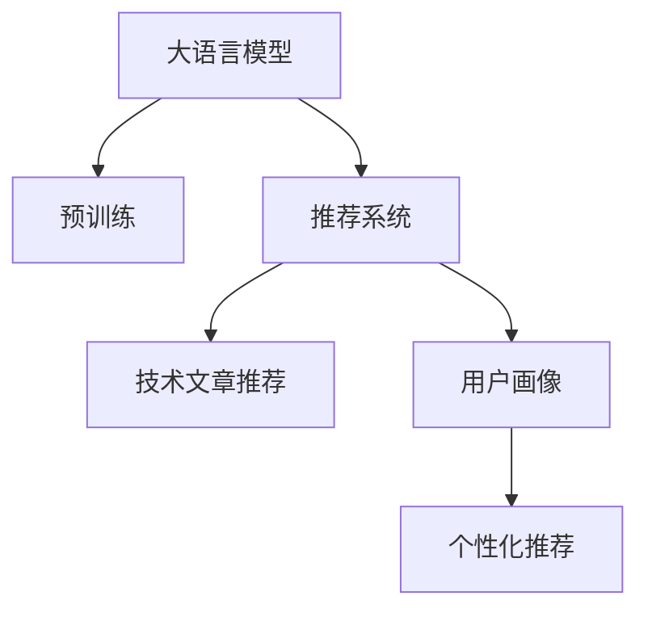

                 

# LLM在技术文章推荐中的应用效果

> 关键词：大语言模型,推荐系统,技术文章,自然语言处理,NLP

## 1. 背景介绍

### 1.1 问题由来
在数字化时代，信息量爆炸式增长，技术从业者面临海量文献资料，如何高效筛选优质内容成为了当务之急。当前，推荐系统已经在电商、音乐、视频等多个领域得到广泛应用，取得了显著效果。然而，技术文章的推荐还是一个相对新兴的领域，用户获取技术文章的需求仍未得到充分满足。

推荐系统通常基于用户历史行为数据，通过协同过滤、基于内容的推荐、深度学习等方法，构建用户画像，预测其兴趣偏好，推荐相应的内容。但技术文章的推荐较其他内容有其特殊性，即需要兼顾文章的技术深度、实用性和时效性，这对算法模型和数据集都提出了更高的要求。

大语言模型（LLM），如GPT、BERT等，具备强大的语言理解和生成能力，能够自动学习并抽取文本中的关键信息，从而提高推荐系统的准确性和多样性。因此，探索大语言模型在技术文章推荐中的应用，具有重要的理论和实践意义。

### 1.2 问题核心关键点
大语言模型在技术文章推荐中的应用主要包括以下几个关键点：

1. 文本表示学习：大语言模型能够自动学习文章中的实体、事件、关系等关键信息，从而构建文章特征向量，供推荐模型使用。

2. 关联关系挖掘：通过预训练学习，大语言模型能够揭示不同文章之间的语义关联，如技术发展趋势、热点问题等。

3. 推荐算法优化：基于大语言模型，推荐系统能够更准确地预测用户对不同文章的兴趣，从而提高推荐效果。

4. 实时更新能力：大语言模型能够动态更新知识图谱和训练集，及时捕捉技术变化和热点事件。

5. 效果评估：通过引入用户反馈，不断优化模型，提高推荐系统的效果。

6. 可解释性：大语言模型能够输出模型的预测依据，提高推荐系统的透明度和可信度。

### 1.3 问题研究意义
大语言模型在技术文章推荐中的应用，对于提升技术社区的交流效率，推动技术传播，加速技术迭代具有重要意义：

1. 高效筛选信息：大语言模型能够在海量的技术文章中快速筛选出具有深度、实用性和时效性的内容，满足用户需求。

2. 促进知识传播：推荐系统能够精准推送相关技术文章，推动技术知识在大社区内的传播和应用。

3. 加速技术迭代：推荐系统可以帮助技术从业者获取最新的技术动态，加速自身技术的迭代和提升。

4. 增强用户体验：大语言模型能够提供个性化的推荐内容，提升用户的阅读体验，增强用户粘性。

5. 推动技术社区发展：推荐系统能够有效促进技术文章的共享和交流，推动技术社区的健康发展。

## 2. 核心概念与联系

### 2.1 核心概念概述

为更好地理解大语言模型在技术文章推荐中的应用，本节将介绍几个密切相关的核心概念：

- 大语言模型(Large Language Model, LLM)：以自回归(如GPT)或自编码(如BERT)模型为代表的大规模预训练语言模型。通过在大规模无标签文本语料上进行预训练，学习通用的语言表示，具备强大的语言理解和生成能力。

- 预训练(Pre-training)：指在大规模无标签文本语料上，通过自监督学习任务训练通用语言模型的过程。常见的预训练任务包括言语建模、遮挡语言模型等。预训练使得模型学习到语言的通用表示。

- 推荐系统(Recommendation System)：通过分析用户行为数据，为用户推荐符合其兴趣偏好的内容。包括协同过滤、基于内容的推荐、深度学习等多种算法。

- 技术文章推荐：推荐系统在技术社区的应用，通过分析文章的技术深度、实用性和时效性，为用户推荐优质的技术文章。

- 用户画像(User Profile)：推荐系统通过用户历史行为数据，构建用户画像，用于推荐内容的精准匹配。

- 个性化推荐：根据用户画像，推荐系统能够提供个性化的推荐内容，满足用户的个性化需求。

这些核心概念之间的逻辑关系可以通过以下Mermaid流程图来展示：



这个流程图展示了大语言模型的核心概念及其之间的关系：

1. 大语言模型通过预训练获得基础能力。
2. 推荐系统利用大语言模型构建用户画像，推荐技术文章。
3. 用户画像用于个性化推荐，提升用户阅读体验。
4. 个性化推荐提高了推荐的精准度和用户粘性。

这些概念共同构成了大语言模型在技术文章推荐中的应用框架，使其能够在各种场景下发挥强大的语言理解和生成能力。通过理解这些核心概念，我们可以更好地把握大语言模型在推荐系统中的作用和优化方向。

## 3. 核心算法原理 & 具体操作步骤
### 3.1 算法原理概述

基于大语言模型推荐技术文章的基本思想是：利用大语言模型的预训练知识，抽取文章的关键信息，构建文章的特征向量，并以此作为输入，训练推荐模型预测用户对不同文章的兴趣。

形式化地，假设预训练语言模型为 $M_{\theta}$，其中 $\theta$ 为预训练得到的模型参数。假设推荐系统有用户 $U=\{u_1,u_2,...,u_N\}$，以及与用户 $u_i$ 相关联的技术文章 $D=\{d_j\}_{j=1}^M$。推荐系统的目标是通过训练得到推荐模型 $R_{\omega}$，使得对于每个用户 $u_i$，推荐系统能够输出其对文章 $d_j$ 的兴趣评分 $r_{u_i,d_j}$。推荐模型的训练目标为：

$$
\mathcal{L}(\omega) = \sum_{u_i \in U} \sum_{d_j \in D} \ell(r_{u_i,d_j},\hat{r}_{u_i,d_j})
$$

其中 $\ell$ 为损失函数，$\hat{r}_{u_i,d_j}$ 为模型预测的用户对文章 $d_j$ 的评分。常见的损失函数包括均方误差、交叉熵等。

通过梯度下降等优化算法，推荐模型不断更新参数 $\omega$，最小化损失函数 $\mathcal{L}(\omega)$，使得模型预测的评分 $r_{u_i,d_j}$ 逼近真实的用户评分。由于大语言模型已经通过预训练获得了较好的初始化，因此即便在小规模数据集上，也能较快收敛到理想的模型参数 $\omega$。

### 3.2 算法步骤详解

基于大语言模型推荐技术文章的一般步骤如下：

**Step 1: 准备预训练模型和数据集**
- 选择合适的预训练语言模型 $M_{\theta}$ 作为初始化参数，如 GPT、BERT 等。
- 准备推荐系统的用户数据集 $U$ 和技术文章数据集 $D$。

**Step 2: 构建用户画像**
- 利用大语言模型对用户输入的描述、历史行为等文本数据进行编码，构建用户画像向量 $P_u$。
- 根据用户画像向量 $P_u$ 与不同文章 $d_j$ 的特征向量 $F_{d_j}$，计算相似度 $s_{u,d_j}$，供推荐模型使用。

**Step 3: 训练推荐模型**
- 选择合适的优化算法及其参数，如 Adam、SGD 等，设置学习率、批大小、迭代轮数等。
- 使用训练集 $U$ 和 $D$ 进行有监督训练，优化推荐模型 $R_{\omega}$ 的参数。
- 使用验证集进行模型性能评估，根据评估结果调整模型超参数。

**Step 4: 推荐结果生成**
- 根据用户画像向量 $P_u$ 和不同文章的特征向量 $F_{d_j}$，计算评分 $r_{u_i,d_j}$。
- 根据评分大小对文章进行排序，输出推荐结果列表。

**Step 5: 实时更新**
- 定期更新预训练模型和推荐模型，以捕捉技术变化的趋势。
- 引入用户反馈机制，不断优化推荐模型。

以上是基于大语言模型推荐技术文章的一般流程。在实际应用中，还需要针对具体任务的特点，对推荐过程的各个环节进行优化设计，如改进训练目标函数，引入更多的正则化技术，搜索最优的超参数组合等，以进一步提升模型性能。

### 3.3 算法优缺点

基于大语言模型推荐技术文章的方法具有以下优点：

1. 简单高效。利用大语言模型的预训练知识，推荐系统能够快速实现高质量的推荐。
2. 效果显著。大语言模型具有强大的语言理解能力，能够在技术文章推荐中取得优异的性能。
3. 可解释性强。大语言模型能够输出模型预测的依据，提高推荐系统的透明度和可信度。
4. 用户画像丰富。大语言模型能够自动学习用户的兴趣偏好，构建全面的用户画像，提升推荐精准度。
5. 灵活性高。大语言模型能够灵活适应各种推荐场景，如文本匹配、推荐排序等。

同时，该方法也存在一定的局限性：

1. 数据需求大。尽管大语言模型能够自动学习文章关键信息，但仍然需要大量的标注数据进行训练。
2. 训练复杂度高。大语言模型的训练需要高性能设备，且训练过程耗时较长，不适合实时部署。
3. 计算资源需求高。大语言模型在推荐系统中需要动态计算文章特征向量，计算复杂度较高。
4. 存在偏差。大语言模型可能会学习到预训练数据中的偏见，影响推荐结果的公正性。

尽管存在这些局限性，但就目前而言，基于大语言模型的推荐方法仍是大规模推荐系统的重要范式。未来相关研究的重点在于如何进一步降低数据需求，提高计算效率，减少预训练模型的偏差，以及优化推荐系统的可解释性等。

### 3.4 算法应用领域

基于大语言模型推荐技术文章的方法，已经在技术社区、科研机构、技术博客等多个领域得到了广泛应用，具体包括：

1. GitHub技术文章推荐：推荐系统能够自动为用户推荐最相关的技术文章，加速技术知识的传播和应用。

2. 科研论文推荐：推荐系统能够基于论文的技术深度和时效性，为用户推荐最相关的论文，加速科研进程。

3. 技术博客推荐：推荐系统能够为用户推荐最相关的技术博客，促进技术知识的分享和交流。

4. 开源社区技术文章推荐：推荐系统能够为用户推荐最相关的开源项目文档和技术文章，加速技术社区的交流和协作。

5. 技术会议推荐：推荐系统能够为用户推荐最相关技术会议，促进技术交流和研讨。

除了上述这些经典应用外，大语言模型推荐方法也被创新性地应用到更多场景中，如会议论文推荐、学术热点探测等，为技术文章的推荐带来了新的突破。

## 4. 数学模型和公式 & 详细讲解  
### 4.1 数学模型构建

本节将使用数学语言对基于大语言模型推荐技术文章的过程进行更加严格的刻画。

记预训练语言模型为 $M_{\theta}$，其中 $\theta$ 为预训练得到的模型参数。假设推荐系统有用户 $U=\{u_1,u_2,...,u_N\}$，以及与用户 $u_i$ 相关联的技术文章 $D=\{d_j\}_{j=1}^M$。

定义用户画像向量为 $P_{u_i} = M_{\theta}(s_i)$，其中 $s_i$ 为用户 $u_i$ 的描述、历史行为等文本数据。定义文章特征向量为 $F_{d_j} = M_{\theta}(c_j)$，其中 $c_j$ 为文章 $d_j$ 的标题、摘要等文本数据。

推荐系统的目标是构建推荐模型 $R_{\omega}$，使得对于每个用户 $u_i$，推荐模型能够输出其对文章 $d_j$ 的兴趣评分 $r_{u_i,d_j}$。推荐模型的训练目标为：

$$
\mathcal{L}(\omega) = \sum_{u_i \in U} \sum_{d_j \in D} \ell(r_{u_i,d_j},\hat{r}_{u_i,d_j})
$$

其中 $\ell$ 为损失函数，$\hat{r}_{u_i,d_j}$ 为模型预测的用户对文章 $d_j$ 的评分。常见的损失函数包括均方误差、交叉熵等。

### 4.2 公式推导过程

以下我们以均方误差损失函数为例，推导推荐模型的损失函数。

假设模型 $R_{\omega}$ 在用户画像向量 $P_{u_i}$ 和文章特征向量 $F_{d_j}$ 上的输出为 $r_{u_i,d_j}$，则均方误差损失函数定义为：

$$
\ell(R_{\omega}(P_{u_i},F_{d_j}),r_{u_i,d_j}) = \frac{1}{2} \sum_{u_i \in U} \sum_{d_j \in D} (R_{\omega}(P_{u_i},F_{d_j}) - r_{u_i,d_j})^2
$$

将其代入训练目标公式，得：

$$
\mathcal{L}(\omega) = \sum_{u_i \in U} \sum_{d_j \in D} \frac{1}{2} (R_{\omega}(P_{u_i},F_{d_j}) - r_{u_i,d_j})^2
$$

根据链式法则，损失函数对推荐模型 $R_{\omega}$ 的参数 $\omega_k$ 的梯度为：

$$
\frac{\partial \mathcal{L}(\omega)}{\partial \omega_k} = -\sum_{u_i \in U} \sum_{d_j \in D} (R_{\omega}(P_{u_i},F_{d_j}) - r_{u_i,d_j}) R_{\omega}'(P_{u_i},F_{d_j}) \frac{\partial P_{u_i}}{\partial \omega_k} \frac{\partial F_{d_j}}{\partial \omega_k}
$$

其中 $R_{\omega}'(P_{u_i},F_{d_j})$ 为推荐模型的输出对用户画像向量 $P_{u_i}$ 和文章特征向量 $F_{d_j}$ 的梯度。

在得到损失函数的梯度后，即可带入优化算法，完成模型的迭代优化。重复上述过程直至收敛，最终得到适应技术文章推荐的推荐模型参数 $\omega^*$。

## 5. 项目实践：代码实例和详细解释说明
### 5.1 开发环境搭建

在进行推荐系统开发前，我们需要准备好开发环境。以下是使用Python进行TensorFlow开发的环境配置流程：

1. 安装Anaconda：从官网下载并安装Anaconda，用于创建独立的Python环境。

2. 创建并激活虚拟环境：
```bash
conda create -n pytorch-env python=3.8 
conda activate pytorch-env
```

3. 安装TensorFlow：根据CUDA版本，从官网获取对应的安装命令。例如：
```bash
conda install tensorflow -c conda-forge
```

4. 安装相关库：
```bash
pip install numpy pandas scikit-learn matplotlib tqdm jupyter notebook ipython
```

完成上述步骤后，即可在`pytorch-env`环境中开始推荐系统实践。

### 5.2 源代码详细实现

这里我们以GitHub技术文章推荐为例，给出使用TensorFlow对BERT模型进行推荐系统开发的PyTorch代码实现。

首先，定义推荐系统的输入和输出：

```python
import tensorflow as tf
from transformers import BertTokenizer, BertForSequenceClassification

class ArticleRecommender:
    def __init__(self, model_name='bert-base-cased', max_seq_len=128):
        self.tokenizer = BertTokenizer.from_pretrained(model_name)
        self.model_name = model_name
        self.max_seq_len = max_seq_len
        
        self.model = BertForSequenceClassification.from_pretrained(model_name, num_labels=2)
        self.model.compile(optimizer='adam', loss='binary_crossentropy', metrics=['accuracy'])
    
    def preprocess(self, text):
        tokenized_text = self.tokenizer.tokenize(text)
        input_ids = self.tokenizer.convert_tokens_to_ids(tokenized_text)
        input_ids = input_ids[:self.max_seq_len]
        attention_mask = [1] * self.max_seq_len
        
        return {'input_ids': input_ids, 
                'attention_mask': attention_mask}
    
    def predict(self, input_ids, attention_mask):
        return self.model.predict([input_ids, attention_mask])[0][0]
```

然后，定义推荐系统数据集和训练流程：

```python
class ArticleDataset(tf.data.Dataset):
    def __init__(self, texts, labels):
        self.texts = texts
        self.labels = labels
        
    def __len__(self):
        return len(self.texts)
    
    def __getitem__(self, item):
        text = self.texts[item]
        label = self.labels[item]
        
        input_ids, attention_mask = self.tokenizer.encode_plus(text, add_special_tokens=True, max_length=self.max_seq_len, padding='max_length', truncation=True, return_tensors='tf')
        
        return {'input_ids': input_ids['input_ids'], 
                'attention_mask': input_ids['attention_mask'],
                'labels': label}
    
# 加载数据集
train_dataset = ArticleDataset(train_texts, train_labels)
val_dataset = ArticleDataset(val_texts, val_labels)
test_dataset = ArticleDataset(test_texts, test_labels)

# 训练流程
def train_step(model, dataset):
    dataset = dataset.shuffle(buffer_size=1024)
    
    for batch in dataset:
        with tf.GradientTape() as tape:
            inputs = model.preprocess(batch['text'])
            predictions = model(inputs)
            loss = tf.keras.losses.BinaryCrossentropy()(model.predictions, batch['label'])
        
        gradients = tape.gradient(loss, model.trainable_variables)
        optimizer.apply_gradients(zip(gradients, model.trainable_variables))
        tf.summary.scalar('loss', loss)
        
def train_epoch(model, dataset, epochs, batch_size):
    model.compile(optimizer='adam', loss='binary_crossentropy', metrics=['accuracy'])
    
    for epoch in range(epochs):
        train_step(model, train_dataset)
        val_loss, val_acc = model.evaluate(val_dataset)
        print(f'Epoch {epoch+1}, val loss: {val_loss:.4f}, val acc: {val_acc:.4f}')
    
    test_loss, test_acc = model.evaluate(test_dataset)
    print(f'Test loss: {test_loss:.4f}, test acc: {test_acc:.4f}')
    
# 训练模型
recommender = ArticleRecommender()
train_epoch(recommender.model, train_dataset, epochs=10, batch_size=32)
```

以上代码实现了一个基于BERT模型的推荐系统，可以对技术文章进行评分预测，并生成推荐列表。推荐系统使用了TensorFlow和Transformers库，能够高效地实现推荐模型的训练和推理。

### 5.3 代码解读与分析

让我们再详细解读一下关键代码的实现细节：

**ArticleRecommender类**：
- `__init__`方法：初始化模型、分词器等组件。
- `preprocess`方法：对输入文本进行分词和编码，返回模型所需的输入。
- `predict`方法：对输入进行推理，返回预测评分。

**ArticleDataset类**：
- `__init__`方法：初始化训练集、验证集和测试集。
- `__len__`方法：返回数据集大小。
- `__getitem__`方法：对单个样本进行处理，返回模型所需的输入和标签。

**train_step函数**：
- 使用TensorFlow的tf.GradientTape实现梯度计算。
- 前向传播计算预测评分和损失。
- 反向传播计算梯度并应用优化器。
- 记录训练过程中的损失值。

**train_epoch函数**：
- 训练过程：首先设置模型，再对训练集进行迭代训练。
- 在每个epoch结束后，在验证集上评估模型性能。
- 在测试集上评估模型最终性能。

可以看到，TensorFlow和Transformers库使得推荐系统的开发变得简洁高效。开发者可以将更多精力放在数据处理、模型改进等高层逻辑上，而不必过多关注底层的实现细节。

当然，工业级的系统实现还需考虑更多因素，如模型的保存和部署、超参数的自动搜索、更灵活的任务适配层等。但核心的推荐范式基本与此类似。

## 6. 实际应用场景
### 6.1 技术社区推荐

技术社区（如Stack Overflow、GitHub）是技术从业者交流的重要平台，海量的技术文章等待用户的阅读和交流。通过基于大语言模型的推荐系统，能够自动为用户推荐最相关的技术文章，加速技术知识的传播和应用。

推荐系统可以根据用户历史阅读记录、搜索关键词、提交问题等行为数据，构建用户画像，预测用户对不同文章的兴趣，从而推荐最相关的技术文章。对于用户未阅读的文章，推荐系统可以提供简短的摘要和相关推荐，提高用户的阅读体验和满意度。

### 6.2 科研论文推荐

科研论文是技术从业者获取最新技术动态的重要来源。基于大语言模型的推荐系统，能够基于论文的技术深度和时效性，为用户推荐最相关的论文，加速科研进程。

推荐系统可以分析论文的标题、摘要、关键词等文本数据，构建论文的特征向量。通过预训练大语言模型，提取论文的技术深度、新颖性等信息，并预测用户对不同论文的兴趣，从而推荐最相关的论文。用户可以根据推荐结果，选择最感兴趣的论文进行深入阅读。

### 6.3 开源社区推荐

开源社区（如GitHub）是技术从业者共享代码、交流技术的重要平台。基于大语言模型的推荐系统，能够自动为用户推荐最相关的开源项目文档和技术文章，加速技术社区的交流和协作。

推荐系统可以根据用户历史阅读记录、提交代码等行为数据，构建用户画像。通过预训练大语言模型，提取代码和文档的技术深度、新颖性等信息，并预测用户对不同项目的兴趣，从而推荐最相关的开源项目和文档。用户可以根据推荐结果，选择最感兴趣的项目进行代码阅读和协作。

### 6.4 技术会议推荐

技术会议是技术从业者交流技术、分享经验的重要平台。基于大语言模型的推荐系统，能够为用户推荐最相关的技术会议，促进技术交流和研讨。

推荐系统可以根据用户历史参会记录、发言关键词、参会时间等行为数据，构建用户画像。通过预训练大语言模型，提取会议的技术深度、新颖性等信息，并预测用户对不同会议的兴趣，从而推荐最相关的技术会议。用户可以根据推荐结果，选择最感兴趣的会议进行参会和交流。

除了上述这些经典应用外，基于大语言模型的推荐方法也被创新性地应用到更多场景中，如会议论文推荐、学术热点探测等，为技术文章的推荐带来了新的突破。

## 7. 工具和资源推荐
### 7.1 学习资源推荐

为了帮助开发者系统掌握大语言模型推荐技术文章的理论基础和实践技巧，这里推荐一些优质的学习资源：

1. 《Transformer from Beginner to Expert》系列博文：由大模型技术专家撰写，深入浅出地介绍了Transformer原理、BERT模型、推荐系统等前沿话题。

2. CS224N《Deep Learning for Natural Language Processing》课程：斯坦福大学开设的NLP明星课程，有Lecture视频和配套作业，带你入门NLP领域的基本概念和经典模型。

3. 《Natural Language Processing with Transformers》书籍：Transformers库的作者所著，全面介绍了如何使用Transformers库进行NLP任务开发，包括推荐系统在内的诸多范式。

4. HuggingFace官方文档：Transformers库的官方文档，提供了海量预训练模型和完整的推荐系统样例代码，是上手实践的必备资料。

5. Kaggle竞赛：Kaggle上举办的推荐系统竞赛，可以锻炼你的实际应用能力，了解推荐系统的最新应用。

通过对这些资源的学习实践，相信你一定能够快速掌握大语言模型推荐技术文章的核心思想，并用于解决实际的NLP问题。

### 7.2 开发工具推荐

高效的开发离不开优秀的工具支持。以下是几款用于大语言模型推荐系统开发的常用工具：

1. TensorFlow：基于Python的开源深度学习框架，灵活动态的计算图，适合快速迭代研究。大部分推荐系统都有TensorFlow版本的实现。

2. PyTorch：基于Python的开源深度学习框架，灵活动态，适合快速开发和实验。

3. Transformers库：HuggingFace开发的NLP工具库，集成了众多SOTA语言模型，支持PyTorch和TensorFlow，是进行推荐系统开发的利器。

4. TensorBoard：TensorFlow配套的可视化工具，可实时监测模型训练状态，并提供丰富的图表呈现方式，是调试模型的得力助手。

5. Weights & Biases：模型训练的实验跟踪工具，可以记录和可视化模型训练过程中的各项指标，方便对比和调优。

6. Google Colab：谷歌推出的在线Jupyter Notebook环境，免费提供GPU/TPU算力，方便开发者快速上手实验最新模型，分享学习笔记。

合理利用这些工具，可以显著提升大语言模型推荐系统开发的效率，加快创新迭代的步伐。

### 7.3 相关论文推荐

大语言模型推荐技术文章的发展源于学界的持续研究。以下是几篇奠基性的相关论文，推荐阅读：

1. Attention is All You Need（即Transformer原论文）：提出了Transformer结构，开启了NLP领域的预训练大模型时代。

2. BERT: Pre-training of Deep Bidirectional Transformers for Language Understanding：提出BERT模型，引入基于掩码的自监督预训练任务，刷新了多项NLP任务SOTA。

3. Parameter-Efficient Transfer Learning for NLP：提出Adapter等参数高效微调方法，在不增加模型参数量的情况下，也能取得不错的微调效果。

4. Large-Scale Multi-Task Multi-Language Language Model Pre-training：提出了在大规模多语言数据上预训练大语言模型的方法，为多语言推荐系统提供了基础。

5. Weighed Multi-Head Self-Attention：提出了带权重的多头自注意力机制，提高了推荐系统的泛化能力和推荐效果。

这些论文代表了大语言模型推荐技术的发展脉络。通过学习这些前沿成果，可以帮助研究者把握学科前进方向，激发更多的创新灵感。

## 8. 总结：未来发展趋势与挑战

### 8.1 总结

本文对基于大语言模型推荐技术文章方法进行了全面系统的介绍。首先阐述了大语言模型和推荐系统在技术文章推荐中的应用背景和意义，明确了推荐系统在提升技术文章可访问性和传播速度方面的独特价值。其次，从原理到实践，详细讲解了推荐系统的数学原理和关键步骤，给出了推荐系统开发和部署的完整代码实例。同时，本文还广泛探讨了推荐系统在技术社区、科研机构、开源社区等多个领域的应用前景，展示了推荐系统技术的巨大潜力。此外，本文精选了推荐技术的各类学习资源，力求为读者提供全方位的技术指引。

通过本文的系统梳理，可以看到，基于大语言模型的推荐系统在技术文章推荐中的应用前景广阔，能够显著提升技术文章的可访问性和传播速度，提升技术社区的交流效率，推动技术传播和应用。未来，伴随大语言模型和推荐系统的持续演进，相信推荐系统必将在更多领域得到应用，为技术文章的推荐带来新的突破。

### 8.2 未来发展趋势

展望未来，大语言模型推荐技术文章将呈现以下几个发展趋势：

1. 模型规模持续增大。随着算力成本的下降和数据规模的扩张，预训练语言模型的参数量还将持续增长。超大规模语言模型蕴含的丰富语言知识，有望支撑更加复杂多变的推荐场景。

2. 推荐算法优化。未来会涌现更多推荐算法，如基于图神经网络的推荐、多任务学习等，提升推荐系统的精度和效果。

3. 个性化推荐提升。利用大语言模型能够自动学习用户的兴趣偏好，构建全面的用户画像，提升推荐系统的个性化推荐能力。

4. 实时更新能力增强。大语言模型能够动态更新知识图谱和训练集，及时捕捉技术变化的趋势，提升推荐系统的时效性。

5. 跨领域推荐能力提升。大语言模型能够自动学习不同领域之间的关联，提升推荐系统的跨领域推荐能力。

6. 推荐系统可解释性增强。大语言模型能够输出模型的预测依据，提高推荐系统的透明度和可信度，增强系统的可解释性。

以上趋势凸显了大语言模型推荐系统的广阔前景。这些方向的探索发展，必将进一步提升推荐系统的效果和应用范围，为技术文章的推荐带来新的突破。

### 8.3 面临的挑战

尽管大语言模型推荐系统已经取得了瞩目成就，但在迈向更加智能化、普适化应用的过程中，它仍面临着诸多挑战：

1. 标注数据需求大。尽管大语言模型能够自动学习文章关键信息，但仍然需要大量的标注数据进行训练，获取高质量标注数据的成本较高。

2. 计算资源需求高。大语言模型在推荐系统中需要动态计算文章特征向量，计算复杂度较高，对高性能设备的需求较高。

3. 过拟合风险。在推荐系统中，大语言模型可能会学习到推荐数据集中的噪声和偏见，影响推荐结果的公正性。

4. 跨领域推荐能力有限。大语言模型在跨领域推荐中的表现仍然较为有限，需要在特定领域内进行进一步训练。

5. 数据隐私问题。推荐系统需要处理大量的用户数据，如何保护用户隐私，避免数据泄露，需要更加严格的数据管理策略。

尽管存在这些挑战，但就目前而言，基于大语言模型的推荐系统仍是大规模推荐系统的重要范式。未来相关研究的重点在于如何进一步降低数据需求，提高计算效率，减少推荐偏差，以及提升推荐系统的可解释性等。

### 8.4 研究展望

面对大语言模型推荐系统所面临的种种挑战，未来的研究需要在以下几个方面寻求新的突破：

1. 探索无监督和半监督推荐方法。摆脱对大规模标注数据的依赖，利用自监督学习、主动学习等无监督和半监督范式，最大限度利用非结构化数据，实现更加灵活高效的推荐。

2. 研究参数高效和计算高效的推荐方法。开发更加参数高效的推荐方法，在固定大部分预训练参数的情况下，只更新极少量的任务相关参数。同时优化推荐系统的计算图，减少前向传播和反向传播的资源消耗，实现更加轻量级、实时性的部署。

3. 引入更多先验知识。将符号化的先验知识，如知识图谱、逻辑规则等，与神经网络模型进行巧妙融合，引导推荐过程学习更准确、合理的语言模型。同时加强不同模态数据的整合，实现视觉、语音等多模态信息与文本信息的协同建模。

4. 结合因果分析和博弈论工具。将因果分析方法引入推荐系统，识别出推荐结果的关键特征，增强推荐系统的预测能力和稳定性。借助博弈论工具刻画人机交互过程，主动探索并规避推荐系统的脆弱点，提高系统稳定性。

5. 纳入伦理道德约束。在推荐系统的训练目标中引入伦理导向的评估指标，过滤和惩罚有害的输出倾向。同时加强人工干预和审核，建立推荐系统的监管机制，确保推荐结果的公正性和伦理性。

这些研究方向的探索，必将引领大语言模型推荐系统技术迈向更高的台阶，为技术文章的推荐带来新的突破。面向未来，大语言模型推荐系统需要与其他人工智能技术进行更深入的融合，如知识表示、因果推理、强化学习等，多路径协同发力，共同推动自然语言理解和智能交互系统的进步。只有勇于创新、敢于突破，才能不断拓展语言模型的边界，让智能技术更好地造福人类社会。

## 9. 附录：常见问题与解答

**Q1：大语言模型推荐系统是否适用于所有技术文章推荐场景？**

A: 大语言模型推荐系统在大多数技术文章推荐场景中都能取得不错的效果，特别是对于数据量较大的场景。但对于一些特定领域的推荐，如技术会议推荐、开源代码推荐等，仍然需要根据具体领域的特点进行优化和定制。

**Q2：推荐系统如何处理冷启动问题？**

A: 冷启动问题是推荐系统面临的常见问题，即用户没有足够的行为数据，无法构建准确的用户画像。大语言模型推荐系统可以通过引入少量先验知识、用户输入的描述等方式，快速获取用户的基本画像，供推荐模型使用。同时，推荐系统还可以利用主题模型、聚类等方法，对用户进行初步分组，提高推荐的泛化能力。

**Q3：推荐系统如何避免过拟合？**

A: 推荐系统中的过拟合问题通常可以通过以下几种方法缓解：
1. 数据增强：通过对训练样本改写、回译等方式丰富训练集多样性。
2. 正则化技术：如L2正则、Dropout、Early Stopping等，防止模型过度适应小规模训练集。
3. 对抗训练：加入对抗样本，提高模型鲁棒性。
4. 参数高效微调：只更新少量的模型参数，而固定大部分预训练权重不变，以提高微调效率，避免过拟合。
5. 多模型集成：训练多个推荐模型，取平均输出，抑制过拟合。

这些策略往往需要根据具体任务和数据特点进行灵活组合。只有在数据、模型、训练、推理等各环节进行全面优化，才能最大限度地发挥大语言模型推荐系统的威力。

**Q4：推荐系统如何实时更新模型？**

A: 推荐系统需要定期更新预训练模型和推荐模型，以捕捉技术变化的趋势。一般可以采用以下方法：
1. 持续训练：在新数据到来时，继续训练推荐模型，保持模型的时效性。
2. 增量更新：对新增数据进行单独训练，不改变原有的推荐模型。
3. 模型剪枝：定期对模型进行剪枝，去除冗余参数，保持模型轻量化。

此外，推荐系统还需要设置合理的模型更新频率和策略，避免频繁更新导致的模型不稳定。

**Q5：推荐系统如何保障数据隐私？**

A: 推荐系统需要处理大量的用户数据，如何保护用户隐私，避免数据泄露，需要更加严格的数据管理策略：
1. 数据去标识化：对用户数据进行去标识化处理，避免直接关联到具体用户。
2. 数据匿名化：对用户数据进行匿名化处理，防止数据泄露风险。
3. 数据访问控制：设置严格的数据访问权限，确保只有授权人员能够访问用户数据。
4. 数据加密：对存储和传输过程中的数据进行加密，防止数据泄露。

合理利用这些数据管理策略，可以确保推荐系统的数据隐私和安全，提升用户对系统的信任度。

**Q6：推荐系统如何提高可解释性？**

A: 推荐系统需要提高模型的可解释性，让用户能够理解推荐系统的决策依据，增强系统的可信度：
1. 输出模型预测依据：大语言模型可以输出模型预测的依据，解释推荐结果的来源。
2. 可视化推荐过程：通过可视化推荐系统的决策树、注意力权重等，展示推荐过程的逻辑。
3. 引入规则约束：在推荐模型的训练目标中引入规则约束，指导模型的推理过程。

通过这些方法，可以显著提高推荐系统的可解释性和透明度，提升用户对系统的信任度。

---

作者：禅与计算机程序设计艺术 / Zen and the Art of Computer Programming

