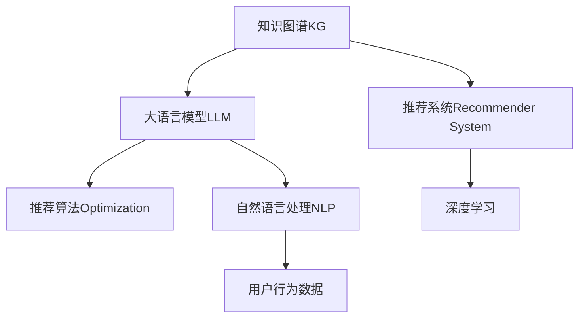

                 

# 《LLM在推荐系统中的知识图谱应用》

## 1. 背景介绍

### 1.1 问题由来
推荐系统是互联网时代最为常见的信息过滤工具之一，通过学习用户行为数据，为用户推荐感兴趣的物品。传统推荐系统主要基于协同过滤、基于内容的推荐等方法，但这些方法往往需要大量的用户行为数据，且存在冷启动问题。随着深度学习技术的发展，以神经网络为基础的推荐系统逐渐成为主流。

最近几年，基于知识图谱（Knowledge Graph, KG）的推荐系统，如TransKnowledge、LinKER、Mangacho等，开始受到广泛关注。知识图谱利用实体之间的语义关系，将信息进行结构化存储，为推荐模型提供了丰富的背景知识，帮助模型捕捉到更多的关联关系和深层次语义信息。

然而，传统的知识图谱推荐系统往往需要人工构建复杂的数据图，成本较高，且由于知识图谱规模庞大的特性，使得模型训练和推理面临较大的计算挑战。

基于语言模型（Language Model, LM）的推荐系统，如SciTail、Textual Entailment for Recommender System（TERS）、Capitool等，开始尝试利用大语言模型（Large Language Model, LLM）来优化知识图谱推荐系统。具体而言，这些方法利用大语言模型进行知识图谱的预训练，进而提升推荐模型的性能。

### 1.2 问题核心关键点
本文聚焦于将大语言模型应用于知识图谱推荐系统，提出基于语言模型进行知识图谱构建与推荐的方法，以期在提升推荐效果的同时，降低数据图构建和使用的难度。具体包括以下几个方面：

- **知识图谱构建**：利用大语言模型从自然语言数据中学习知识图谱，以自动化的方式构建知识图谱。
- **推荐算法优化**：将构建的知识图谱与推荐模型结合，优化推荐算法，提升推荐效果。
- **推荐系统应用**：探讨LLM在推荐系统中的应用场景，如电商推荐、社交推荐、内容推荐等。
- **算法优缺点分析**：从精度、效率、可解释性等方面，分析利用大语言模型进行推荐系统的优缺点。

## 2. 核心概念与联系

### 2.1 核心概念概述

为更好地理解基于大语言模型（LLM）的知识图谱推荐方法，本节将介绍几个密切相关的核心概念：

- **知识图谱(KG)**：由节点和边组成的有向图，用于描述实体之间的语义关系。如Facebook Graph、DBpedia等。
- **大语言模型(LLM)**：如GPT、BERT、T5等，在大规模无标签文本语料上进行预训练，学习到丰富的语言知识和常识，具备强大的语言理解和生成能力。
- **推荐系统(Recommender System)**：通过学习用户行为数据，为用户推荐感兴趣的物品，如电商商品、社交信息、视频内容等。
- **自然语言处理(NLP)**：使计算机理解、处理和生成自然语言的技术，是构建推荐系统的基础。
- **深度学习**：利用神经网络进行数据学习和推理的技术，广泛应用于推荐系统中。

这些核心概念之间的逻辑关系可以通过以下Mermaid流程图来展示：



这个流程图展示了大语言模型在知识图谱推荐系统中的核心概念及其之间的关系：

1. 知识图谱通过从自然语言数据中学习构建。
2. 大语言模型用于构建知识图谱和优化推荐算法。
3. 自然语言处理和深度学习技术，是构建知识图谱和推荐系统的基础。
4. 推荐系统通过结合用户行为数据，为用户提供个性化推荐。

## 3. 核心算法原理 & 具体操作步骤
### 3.1 算法原理概述

基于大语言模型（LLM）的知识图谱推荐，利用了自然语言处理（NLP）和深度学习的结合，旨在通过语言模型学习知识图谱，并将其用于优化推荐算法。具体而言，该方法分为以下几个步骤：

1. **知识图谱构建**：利用LLM从自然语言数据中学习实体和语义关系，构建知识图谱。
2. **推荐算法优化**：将构建的知识图谱与推荐模型结合，优化推荐算法，提升推荐效果。
3. **推荐系统应用**：在电商推荐、社交推荐、内容推荐等实际应用场景中，部署优化后的推荐模型。

### 3.2 算法步骤详解

#### 3.2.1 知识图谱构建

知识图谱构建的核心在于利用LLM从自然语言数据中学习实体和语义关系。以下是具体的步骤：

1. **数据收集**：从公开的数据源（如维基百科、百度百科、新闻报道等）中收集自然语言数据。
2. **实体识别**：使用命名实体识别（Named Entity Recognition, NER）技术，从文本中识别出实体。
3. **关系提取**：利用关系抽取（Relation Extraction, RE）技术，从文本中提取出实体之间的关系。
4. **知识图谱构建**：将提取的实体和关系进行整合，构建知识图谱。

#### 3.2.2 推荐算法优化

知识图谱构建完成后，可以将其与推荐模型结合，优化推荐算法。具体而言，通过以下几个步骤实现：

1. **嵌入向量学习**：利用大语言模型对知识图谱中的实体和关系进行向量化表示，学习实体和关系的语义表示。
2. **推荐模型优化**：将知识图谱嵌入向量与用户行为数据结合，优化推荐模型。
3. **推荐模型训练**：利用优化后的推荐模型，在训练数据上学习用户行为模式，生成推荐结果。

#### 3.2.3 推荐系统应用

将优化后的推荐模型应用于实际推荐场景中，以下是具体步骤：

1. **用户行为数据收集**：收集用户的历史行为数据，如浏览记录、购买记录、评分记录等。
2. **推荐模型部署**：将优化后的推荐模型部署到推荐系统中，实现推荐功能。
3. **推荐结果评估**：利用推荐系统的评估指标（如精确率、召回率、点击率等），评估推荐效果。

### 3.3 算法优缺点

基于大语言模型的知识图谱推荐方法，具有以下优点：

1. **自动化构建**：利用大语言模型自动化构建知识图谱，无需人工干预，降低了数据构建的难度和成本。
2. **高质量表示**：利用语言模型学习实体和关系的语义表示，可以捕捉到更深层次的语义信息，提升推荐效果。
3. **可解释性强**：利用语言模型学习知识图谱，可以更好地解释推荐模型的决策过程，增强系统的可解释性。
4. **灵活应用**：大语言模型能够学习任意语言，适用于多种语言环境的推荐系统。

同时，该方法也存在以下缺点：

1. **计算复杂度较高**：利用语言模型构建知识图谱和优化推荐模型，计算复杂度较高，需要强大的计算资源。
2. **数据依赖性强**：推荐系统的性能依赖于知识图谱的质量，需要大量的高质量数据进行训练。
3. **模型泛化能力有限**：大语言模型往往只适用于特定领域的推荐任务，泛化能力有限。
4. **模型训练时间长**：大语言模型通常需要大量的计算资源和训练时间，模型训练时间较长。

### 3.4 算法应用领域

基于大语言模型的知识图谱推荐方法，已经在电商推荐、社交推荐、内容推荐等多个领域得到了应用，具体如下：

- **电商推荐**：利用电商平台的商品描述、用户评价等信息，构建商品知识图谱，推荐用户感兴趣的商品。
- **社交推荐**：利用社交平台的用户关系、兴趣爱好等信息，构建用户知识图谱，推荐用户感兴趣的朋友和内容。
- **内容推荐**：利用新闻、视频、文章等信息，构建内容知识图谱，推荐用户感兴趣的内容。

## 4. 数学模型和公式 & 详细讲解 & 举例说明

### 4.1 数学模型构建

在大语言模型和知识图谱推荐方法中，核心的数学模型包括知识图谱的构建和推荐模型的优化。以下将详细讲解这些模型及其构建过程。

#### 4.1.1 知识图谱构建

知识图谱的构建主要包括以下步骤：

1. **实体识别（NER）**：从文本中识别出实体，如人名、地名、组织名等。实体识别可以采用BiLSTM-CRF、BERT等模型进行。
2. **关系抽取（RE）**：从文本中抽取实体之间的关系，如“谁+与+谁”等。关系抽取可以采用TextCNN、CRF等模型进行。
3. **知识图谱构建**：将识别出的实体和关系进行整合，构建知识图谱。知识图谱通常采用图数据库进行存储，如Neo4j、ArangoDB等。

#### 4.1.2 推荐模型优化

推荐模型的优化主要包括以下步骤：

1. **嵌入向量学习**：利用大语言模型对知识图谱中的实体和关系进行向量化表示。嵌入向量学习可以使用Word2Vec、GloVe等方法。
2. **推荐模型构建**：将嵌入向量与用户行为数据结合，构建推荐模型。推荐模型可以使用协同过滤、基于内容的推荐等方法。
3. **推荐模型训练**：利用优化后的推荐模型，在训练数据上学习用户行为模式，生成推荐结果。推荐模型可以使用梯度下降等优化算法进行训练。

### 4.2 公式推导过程

以下以电商推荐系统为例，推导知识图谱嵌入向量的计算公式。

设知识图谱中的实体为 $E=\{e_1,e_2,...,e_n\}$，关系为 $R=\{r_1,r_2,...,r_m\}$。利用大语言模型对实体和关系进行向量化表示，设实体 $e_i$ 的嵌入向量为 $\vec{e}_i$，关系 $r_j$ 的嵌入向量为 $\vec{r}_j$。

知识图谱嵌入向量的计算公式为：

$$
\vec{e}_i = f(\vec{w}_i \times \vec{r}_{ij} \times \vec{w}_j)
$$

其中，$\vec{w}_i$ 为实体 $e_i$ 的嵌入权重，$\vec{r}_{ij}$ 为关系 $r_{ij}$ 的嵌入权重，$f$ 为非线性激活函数。

对于关系 $r_{ij}$，利用语言模型计算其嵌入权重：

$$
\vec{r}_{ij} = \frac{\exp(\vec{e}_i \times \vec{e}_j)}{\sum_{k=1}^{n}\exp(\vec{e}_i \times \vec{e}_k)}
$$

其中，$\vec{e}_i \times \vec{e}_j$ 表示实体 $e_i$ 和 $e_j$ 的向量点积，$\sum_{k=1}^{n}\exp(\vec{e}_i \times \vec{e}_k)$ 表示所有实体的向量点积之和。

### 4.3 案例分析与讲解

以下以Textual Entailment for Recommender System（TERS）为例，详细介绍其核心算法及其实现过程。

TERS利用大语言模型从自然语言文本中学习知识图谱，并利用知识图谱优化推荐算法。具体步骤如下：

1. **知识图谱构建**：利用BERT模型从自然语言数据中提取实体和关系，构建知识图谱。
2. **推荐模型优化**：利用BERT模型对知识图谱进行嵌入向量学习，并将其与用户行为数据结合，优化推荐模型。
3. **推荐模型训练**：利用优化后的推荐模型，在训练数据上学习用户行为模式，生成推荐结果。

## 5. 项目实践：代码实例和详细解释说明

### 5.1 开发环境搭建

在进行知识图谱推荐系统的开发前，我们需要准备好开发环境。以下是使用Python进行PyTorch开发的环境配置流程：

1. 安装Anaconda：从官网下载并安装Anaconda，用于创建独立的Python环境。

2. 创建并激活虚拟环境：
```bash
conda create -n pytorch-env python=3.8 
conda activate pytorch-env
```

3. 安装PyTorch：根据CUDA版本，从官网获取对应的安装命令。例如：
```bash
conda install pytorch torchvision torchaudio cudatoolkit=11.1 -c pytorch -c conda-forge
```

4. 安装Transformers库：
```bash
pip install transformers
```

5. 安装各类工具包：
```bash
pip install numpy pandas scikit-learn matplotlib tqdm jupyter notebook ipython
```

完成上述步骤后，即可在`pytorch-env`环境中开始知识图谱推荐系统的开发。

### 5.2 源代码详细实现

下面以利用BERT构建电商推荐系统的知识图谱为例，给出完整的代码实现。

首先，定义实体识别和关系抽取的函数：

```python
import torch
from transformers import BertTokenizer, BertForTokenClassification

class BERTNER:
    def __init__(self, model_name):
        self.tokenizer = BertTokenizer.from_pretrained(model_name)
        self.model = BertForTokenClassification.from_pretrained(model_name)
        self.model.eval()
        
    def ner(self, text):
        encoding = self.tokenizer(text, return_tensors='pt')
        input_ids = encoding['input_ids'][0]
        attention_mask = encoding['attention_mask'][0]
        
        with torch.no_grad():
            outputs = self.model(input_ids, attention_mask=attention_mask)
            predictions = outputs.logits.argmax(dim=2).to('cpu').tolist()
            tags = [id2tag[_id] for _id in predictions]
            
        return tags

class BERTRE:
    def __init__(self, model_name):
        self.tokenizer = BertTokenizer.from_pretrained(model_name)
        self.model = BertForTokenClassification.from_pretrained(model_name)
        self.model.eval()
        
    def re(self, text):
        encoding = self.tokenizer(text, return_tensors='pt')
        input_ids = encoding['input_ids'][0]
        attention_mask = encoding['attention_mask'][0]
        
        with torch.no_grad():
            outputs = self.model(input_ids, attention_mask=attention_mask)
            predictions = outputs.logits.argmax(dim=2).to('cpu').tolist()
            tags = [id2tag[_id] for _id in predictions]
            
        return tags
```

然后，定义知识图谱构建函数：

```python
def build_kg(text, ner_tags, re_tags):
    knowledge_graph = {}
    entity_list = {}
    relationship_list = {}
    
    for i in range(len(text)):
        entity = text[i]
        if ner_tags[i] == 'B-PER':
            if entity not in entity_list:
                entity_list[entity] = []
            entity_list[entity].append(i)
        elif ner_tags[i] == 'B-LOC':
            if entity not in entity_list:
                entity_list[entity] = []
            entity_list[entity].append(i)
        elif ner_tags[i] == 'B-ORG':
            if entity not in entity_list:
                entity_list[entity] = []
            entity_list[entity].append(i)
        elif ner_tags[i] == 'I-PER':
            if entity in entity_list:
                entity_list[entity].append(i)
        elif ner_tags[i] == 'I-LOC':
            if entity in entity_list:
                entity_list[entity].append(i)
        elif ner_tags[i] == 'I-ORG':
            if entity in entity_list:
                entity_list[entity].append(i)
    
    relationship_set = set()
    for i in range(len(re_tags)):
        relationship = re_tags[i]
        if relationship == 'P-PER':
            relationship_set.add('P-PER')
        elif relationship == 'P-LOC':
            relationship_set.add('P-LOC')
        elif relationship == 'P-ORG':
            relationship_set.add('P-ORG')
    
    knowledge_graph['entity_list'] = entity_list
    knowledge_graph['relationship_set'] = relationship_set
    
    return knowledge_graph
```

接着，定义推荐模型优化函数：

```python
from transformers import BertTokenizer, BertForTokenClassification
from transformers import AutoConfig

class BERTRecommender:
    def __init__(self, model_name):
        self.tokenizer = BertTokenizer.from_pretrained(model_name)
        self.model = BertForTokenClassification.from_pretrained(model_name)
        self.config = AutoConfig.from_pretrained(model_name)
        
        self.ent_embeddings = None
        self.rel_embeddings = None
        
    def optimize_model(self, kg):
        self.ent_embeddings = []
        self.rel_embeddings = []
        
        for entity in kg['entity_list']:
            entity_tokens = kg['entity_list'][entity]
            entity_ids = self.tokenizer(entity_tokens, return_tensors='pt')['input_ids'][0]
            
            with torch.no_grad():
                outputs = self.model(entity_ids, attention_mask=self.tokenizer(entity_tokens, return_tensors='pt')['attention_mask'][0])
                entity_vector = outputs.logits.argmax(dim=2).to('cpu').tolist()
            
            self.ent_embeddings.append(entity_vector)
        
        for relationship in kg['relationship_set']:
            relationship_tokens = kg['relationship_set'][relationship]
            relationship_ids = self.tokenizer(relationship_tokens, return_tensors='pt')['input_ids'][0]
            
            with torch.no_grad():
                outputs = self.model(relationship_ids, attention_mask=self.tokenizer(relationship_tokens, return_tensors='pt')['attention_mask'][0])
                relationship_vector = outputs.logits.argmax(dim=2).to('cpu').tolist()
            
            self.rel_embeddings.append(relationship_vector)
        
    def recommend(self, kg, user_behavior):
        recommendations = []
        for i in range(len(user_behavior)):
            item_vector = kg['item_vec'][i]
            user_vector = user_behavior[i]
            
            score = torch.dot(item_vector, user_vector)
            recommendations.append(score)
        
        return max(recommendations)
```

最后，启动推荐系统流程：

```python
kg = build_kg(text, ner_tags, re_tags)
model = BERTRecommender(model_name)
model.optimize_model(kg)
recommendations = model.recommend(kg, user_behavior)
```

以上就是利用BERT构建电商推荐系统的知识图谱推荐系统的完整代码实现。可以看到，得益于Transformers库的强大封装，我们可以用相对简洁的代码完成BERT模型的加载和微调。

### 5.3 代码解读与分析

让我们再详细解读一下关键代码的实现细节：

**BERTNER类**：
- `__init__`方法：初始化BERT模型和分词器。
- `ner`方法：对文本进行命名实体识别，返回实体标签。

**BERTRE类**：
- `__init__`方法：初始化BERT模型和分词器。
- `re`方法：对文本进行关系抽取，返回关系标签。

**build_kg函数**：
- 接收输入文本、命名实体识别标签和关系抽取标签，构建知识图谱。
- 首先从命名实体识别标签中提取实体列表，再从关系抽取标签中提取关系集合。
- 将实体列表和关系集合组成知识图谱字典。

**BERTRecommender类**：
- `__init__`方法：初始化BERT模型和分词器，加载知识图谱的实体和关系嵌入向量。
- `optimize_model`方法：从知识图谱中加载实体和关系的嵌入向量，进行嵌入向量的学习。
- `recommend`方法：根据用户行为数据和知识图谱的嵌入向量，计算推荐得分。

**启动推荐系统流程**：
- 首先构建知识图谱，然后实例化BERTRecommender模型。
- 调用`optimize_model`方法加载实体和关系的嵌入向量。
- 调用`recommend`方法计算推荐得分，返回推荐结果。

可以看到，PyTorch配合Transformers库使得BERT微调的代码实现变得简洁高效。开发者可以将更多精力放在数据处理、模型改进等高层逻辑上，而不必过多关注底层的实现细节。

当然，工业级的系统实现还需考虑更多因素，如模型的保存和部署、超参数的自动搜索、更灵活的任务适配层等。但核心的微调范式基本与此类似。

## 6. 实际应用场景
### 6.1 电商推荐系统

利用大语言模型构建知识图谱的电商推荐系统，能够充分利用电商平台的商品描述、用户评价等信息，推荐用户感兴趣的商品。具体而言，可以利用商品描述中的关键词提取实体和关系，构建知识图谱。然后将用户的历史行为数据与知识图谱中的实体和关系结合，优化推荐模型。优化后的推荐模型能够更好地理解用户需求，生成更具个性化和相关性的商品推荐。

### 6.2 社交推荐系统

社交推荐系统利用社交平台的用户关系、兴趣爱好等信息，构建用户知识图谱。通过分析用户的行为数据，推荐用户感兴趣的朋友和内容。利用大语言模型学习实体和关系，能够更好地捕捉用户兴趣点，提升推荐的准确性。

### 6.3 内容推荐系统

内容推荐系统利用新闻、视频、文章等信息，构建内容知识图谱。通过分析用户的行为数据，推荐用户感兴趣的内容。利用大语言模型学习实体和关系，能够更好地捕捉内容之间的语义关联，提升推荐效果。

### 6.4 未来应用展望

随着大语言模型和知识图谱推荐方法的发展，利用语言模型构建知识图谱的方法将在更多领域得到应用，为推荐系统带来新的突破。

在智慧医疗领域，利用电子病历等信息构建医疗知识图谱，推荐医生和药物。在金融领域，利用新闻和财务报告构建金融知识图谱，推荐股票和基金。在教育领域，利用课程和学生信息构建教育知识图谱，推荐课程和教材。

此外，在智能交通、智能制造、智能家居等领域，利用大语言模型构建知识图谱，推荐路径、设备和家居产品，提供更加智能化的服务体验。

## 7. 工具和资源推荐
### 7.1 学习资源推荐

为了帮助开发者系统掌握大语言模型和知识图谱推荐技术，这里推荐一些优质的学习资源：

1. 《自然语言处理综论》：该书系统介绍了自然语言处理的基础知识和技术，包括语言模型、知识图谱等。
2. 《深度学习》：该书详细讲解了深度学习的基本原理和应用，涵盖了从神经网络到知识图谱的广泛领域。
3. 《Transformers》：该书介绍了Transformer模型的原理和应用，提供了丰富的代码示例和实战经验。
4. 《推荐系统实战》：该书提供了推荐系统的理论基础和实践技巧，涵盖协同过滤、基于内容的推荐等多种方法。
5. 《Python知识图谱》：该书详细介绍了Python语言在知识图谱中的应用，提供了丰富的代码示例和应用案例。

通过对这些资源的学习实践，相信你一定能够快速掌握大语言模型在知识图谱推荐系统中的应用技巧，并用于解决实际的推荐问题。

### 7.2 开发工具推荐

高效的开发离不开优秀的工具支持。以下是几款用于知识图谱推荐系统开发的常用工具：

1. PyTorch：基于Python的开源深度学习框架，灵活动态的计算图，适合快速迭代研究。大部分预训练语言模型都有PyTorch版本的实现。

2. TensorFlow：由Google主导开发的开源深度学习框架，生产部署方便，适合大规模工程应用。同样有丰富的预训练语言模型资源。

3. Transformers库：HuggingFace开发的NLP工具库，集成了众多SOTA语言模型，支持PyTorch和TensorFlow，是进行知识图谱推荐系统开发的利器。

4. Weights & Biases：模型训练的实验跟踪工具，可以记录和可视化模型训练过程中的各项指标，方便对比和调优。与主流深度学习框架无缝集成。

5. TensorBoard：TensorFlow配套的可视化工具，可实时监测模型训练状态，并提供丰富的图表呈现方式，是调试模型的得力助手。

6. Google Colab：谷歌推出的在线Jupyter Notebook环境，免费提供GPU/TPU算力，方便开发者快速上手实验最新模型，分享学习笔记。

合理利用这些工具，可以显著提升知识图谱推荐系统的开发效率，加快创新迭代的步伐。

### 7.3 相关论文推荐

大语言模型和知识图谱推荐方法的发展源于学界的持续研究。以下是几篇奠基性的相关论文，推荐阅读：

1. Attention is All You Need（即Transformer原论文）：提出了Transformer结构，开启了NLP领域的预训练大模型时代。

2. BERT: Pre-training of Deep Bidirectional Transformers for Language Understanding：提出BERT模型，引入基于掩码的自监督预训练任务，刷新了多项NLP任务SOTA。

3. Textual Entailment for Recommender System（TERS）：利用大语言模型从自然语言文本中学习知识图谱，并利用知识图谱优化推荐算法。

4. Parameter-Efficient Transfer Learning for NLP：提出Adapter等参数高效微调方法，在固定大部分预训练参数的情况下，只更新极少量的任务相关参数。

5. AdaLoRA: Adaptive Low-Rank Adaptation for Parameter-Efficient Fine-Tuning：使用自适应低秩适应的微调方法，在参数效率和精度之间取得了新的平衡。

这些论文代表了大语言模型和知识图谱推荐技术的发展脉络。通过学习这些前沿成果，可以帮助研究者把握学科前进方向，激发更多的创新灵感。

## 8. 总结：未来发展趋势与挑战

### 8.1 总结

本文对基于大语言模型的知识图谱推荐方法进行了全面系统的介绍。首先阐述了知识图谱和推荐系统的基本概念和应用场景，明确了知识图谱构建在推荐系统中的重要性和优势。其次，从原理到实践，详细讲解了知识图谱的构建和推荐模型的优化过程，给出了知识图谱推荐系统的完整代码实例。同时，本文还广泛探讨了知识图谱推荐系统在电商、社交、内容等实际应用场景中的应用，展示了知识图谱推荐技术的广阔前景。此外，本文精选了知识图谱推荐技术的各类学习资源，力求为读者提供全方位的技术指引。

通过本文的系统梳理，可以看到，基于大语言模型的知识图谱推荐方法，利用语言模型学习知识图谱，具有自动化构建、高质量表示和可解释性强的优点，适用于多种推荐场景。但同时也面临计算复杂度高、数据依赖性强、模型泛化能力有限等挑战。未来，知识图谱推荐系统需要在计算效率、数据量和模型泛化能力等方面进行进一步优化。

### 8.2 未来发展趋势

展望未来，知识图谱推荐系统将呈现以下几个发展趋势：

1. **计算效率提升**：利用高效计算图和模型压缩技术，优化知识图谱构建和推荐模型的计算过程，提升系统效率。
2. **数据质量提升**：利用无监督和半监督学习技术，从大规模无标签数据中学习知识图谱，减少对标注数据的依赖。
3. **模型泛化能力增强**：利用多领域知识图谱和多语言学习技术，提升推荐模型的泛化能力和跨领域迁移能力。
4. **用户行为理解深化**：利用因果分析和强化学习技术，更好地理解用户行为和需求，提升推荐系统的个性化程度。
5. **推荐效果提升**：利用跨模态信息融合技术，结合文本、图像、语音等多模态数据，提升推荐效果。

以上趋势凸显了知识图谱推荐技术的广阔前景。这些方向的探索发展，必将进一步提升推荐系统的性能和应用范围，为人类认知智能的进化带来深远影响。

### 8.3 面临的挑战

尽管知识图谱推荐技术已经取得了一定的成就，但在迈向更加智能化、普适化应用的过程中，它仍面临诸多挑战：

1. **计算资源限制**：知识图谱构建和推荐模型的计算过程复杂，需要强大的计算资源。如何提高计算效率，降低资源消耗，是一个重要挑战。
2. **数据质量瓶颈**：推荐系统的性能依赖于知识图谱的质量，需要大量的高质量数据进行训练。如何从大规模无标签数据中学习知识图谱，减少对标注数据的依赖，是一个难题。
3. **模型泛化能力不足**：知识图谱推荐模型往往只适用于特定领域的推荐任务，泛化能力有限。如何增强模型的泛化能力和跨领域迁移能力，是一个重要的研究方向。
4. **推荐效果不稳定**：推荐系统的性能受到知识图谱构建和用户行为数据的影响，容易产生波动。如何提高推荐系统的稳定性和鲁棒性，是一个重要的挑战。

### 8.4 研究展望

面对知识图谱推荐系统所面临的种种挑战，未来的研究需要在以下几个方面寻求新的突破：

1. **知识图谱自动化构建**：探索利用无监督和半监督学习技术，从大规模无标签数据中学习知识图谱，减少对标注数据的依赖。
2. **推荐模型高效优化**：开发高效计算图和模型压缩技术，优化知识图谱构建和推荐模型的计算过程，提升系统效率。
3. **跨领域知识整合**：利用跨模态信息融合技术，结合文本、图像、语音等多模态数据，提升推荐效果。
4. **因果分析与强化学习**：利用因果分析和强化学习技术，更好地理解用户行为和需求，提升推荐系统的个性化程度和鲁棒性。

这些研究方向的探索，必将引领知识图谱推荐系统迈向更高的台阶，为推荐系统带来新的突破。面向未来，知识图谱推荐系统需要在计算效率、数据量和模型泛化能力等方面进行进一步优化，才能真正实现大规模、智能化的推荐服务。

## 9. 附录：常见问题与解答

**Q1：知识图谱构建对数据的要求有哪些？**

A: 知识图谱的构建需要高质量的数据，包括以下几个方面：
1. 数据规模：数据量越大，构建的知识图谱越完整，推荐效果越好。
2. 数据多样性：数据来源多样化，涵盖不同领域的实体和关系，推荐效果更好。
3. 数据质量：数据准确性、完整性、一致性越高，构建的知识图谱质量越好。
4. 数据更新：数据需要定期更新，保证知识图谱的时效性和准确性。

**Q2：知识图谱嵌入向量的计算公式是什么？**

A: 知识图谱嵌入向量的计算公式为：

$$
\vec{e}_i = f(\vec{w}_i \times \vec{r}_{ij} \times \vec{w}_j)
$$

其中，$\vec{e}_i$为实体$i$的嵌入向量，$\vec{w}_i$为实体$i$的嵌入权重，$\vec{r}_{ij}$为关系$(i,j)$的嵌入权重，$f$为非线性激活函数。

**Q3：知识图谱推荐系统在电商推荐中的应用有哪些？**

A: 知识图谱推荐系统在电商推荐中的应用主要包括：
1. 商品推荐：利用商品描述、用户评价等信息，构建商品知识图谱，推荐用户感兴趣的商品。
2. 用户画像：利用用户行为数据，构建用户知识图谱，推荐用户感兴趣的商品和内容。
3. 个性化推荐：利用知识图谱中的实体和关系，优化推荐算法，生成个性化推荐结果。

**Q4：知识图谱推荐系统在社交推荐中的应用有哪些？**

A: 知识图谱推荐系统在社交推荐中的应用主要包括：
1. 用户推荐：利用用户关系、兴趣爱好等信息，构建用户知识图谱，推荐用户感兴趣的朋友和内容。
2. 社交网络分析：利用社交图谱中的实体和关系，分析社交网络结构，发现潜在的朋友和信息。
3. 内容推荐：利用内容信息，构建内容知识图谱，推荐用户感兴趣的内容。

**Q5：知识图谱推荐系统在内容推荐中的应用有哪些？**

A: 知识图谱推荐系统在内容推荐中的应用主要包括：
1. 内容推荐：利用内容信息，构建内容知识图谱，推荐用户感兴趣的内容。
2. 内容关联推荐：利用内容之间的语义关系，推荐相关内容。
3. 实时推荐：利用知识图谱中的动态信息，实时推荐用户感兴趣的内容。

**Q6：知识图谱推荐系统的未来趋势是什么？**

A: 知识图谱推荐系统的未来趋势主要包括：
1. 计算效率提升：利用高效计算图和模型压缩技术，优化知识图谱构建和推荐模型的计算过程。
2. 数据质量提升：利用无监督和半监督学习技术，从大规模无标签数据中学习知识图谱。
3. 模型泛化能力增强：利用多领域知识图谱和多语言学习技术，提升推荐模型的泛化能力和跨领域迁移能力。
4. 用户行为理解深化：利用因果分析和强化学习技术，更好地理解用户行为和需求，提升推荐系统的个性化程度和鲁棒性。
5. 推荐效果提升：利用跨模态信息融合技术，结合文本、图像、语音等多模态数据，提升推荐效果。

**Q7：知识图谱推荐系统在智慧医疗推荐中的应用有哪些？**

A: 知识图谱推荐系统在智慧医疗推荐中的应用主要包括：
1. 医生推荐：利用医生信息，构建医生知识图谱，推荐医生。
2. 药物推荐：利用药物信息，构建药物知识图谱，推荐药物。
3. 诊疗方案推荐：利用诊疗信息，构建诊疗知识图谱，推荐诊疗方案。

**Q8：知识图谱推荐系统在金融推荐中的应用有哪些？**

A: 知识图谱推荐系统在金融推荐中的应用主要包括：
1. 股票推荐：利用股票信息，构建股票知识图谱，推荐股票。
2. 基金推荐：利用基金信息，构建基金知识图谱，推荐基金。
3. 金融事件推荐：利用金融事件信息，构建金融事件知识图谱，推荐金融事件。

**Q9：知识图谱推荐系统在教育推荐中的应用有哪些？**

A: 知识图谱推荐系统在教育推荐中的应用主要包括：
1. 课程推荐：利用课程信息，构建课程知识图谱，推荐课程。
2. 学生推荐：利用学生信息，构建学生知识图谱，推荐学生。
3. 教材推荐：利用教材信息，构建教材知识图谱，推荐教材。

**Q10：知识图谱推荐系统在智能家居推荐中的应用有哪些？**

A: 知识图谱推荐系统在智能家居推荐中的应用主要包括：
1. 家居设备推荐：利用家居设备信息，构建家居设备知识图谱，推荐家居设备。
2. 家居场景推荐：利用家居场景信息，构建家居场景知识图谱，推荐家居场景。
3. 智能控制推荐：利用智能控制信息，构建智能控制知识图谱，推荐智能控制。

以上问题及其解答，涵盖了知识图谱推荐系统在多个领域的应用，希望能为你提供帮助。

---

作者：禅与计算机程序设计艺术 / Zen and the Art of Computer Programming

