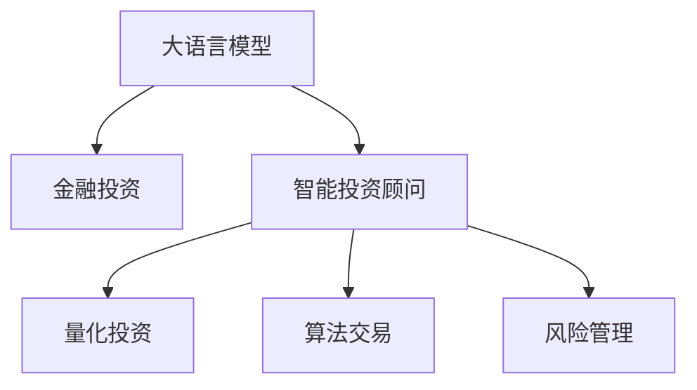

                 

# LLM在金融领域的应用：智能投资顾问

> 关键词：大语言模型,金融投资,智能顾问,量化投资,算法交易

## 1. 背景介绍

金融行业的自动化与智能化一直是业内的热点话题。传统的投资顾问依赖于大量经验和专业知识，但面对日益复杂多变的市场环境，传统的人力资本和经验积累越来越难以满足需求。与此同时，大数据和人工智能技术的发展，为金融领域的智能化转型提供了新的可能性。

近年来，大语言模型（Large Language Model, LLM）在自然语言处理（Natural Language Processing, NLP）领域取得了突破性进展。这些模型经过大规模无标签数据的预训练，已经具备了较强的语言理解能力和生成能力。将大语言模型应用于金融投资领域，可以构建一种智能化的投资顾问系统，通过自动化的分析和推理，为投资者提供精准的投资建议和风险管理。

## 2. 核心概念与联系

### 2.1 核心概念概述

为了更全面地理解大语言模型在金融投资中的应用，我们先梳理一下相关的核心概念：

- **大语言模型**：如BERT、GPT系列模型，经过大规模无标签数据预训练后，具备强大的语言理解能力和生成能力。
- **金融投资**：指通过资金投入，期望在未来获得收益的投资行为。
- **智能投资顾问**：结合金融知识和人工智能技术，自动生成投资建议和决策的系统。
- **量化投资**：通过数据分析和算法模型进行投资决策，减少主观判断，提高投资效率。
- **算法交易**：利用计算机算法进行高频交易，自动执行买卖操作，提高交易效率和收益。
- **风险管理**：通过量化模型和实时监控，评估和控制投资风险，保护资本安全。

这些概念之间的联系可以通过以下Mermaid流程图来展示：



这个流程图展示了大语言模型在金融投资领域的应用逻辑：

1. 大语言模型通过预训练获得语言理解能力。
2. 智能投资顾问系统通过大语言模型进行投资分析和推理。
3. 量化投资和算法交易利用智能投资顾问的输出，进行数据分析和自动交易。
4. 风险管理通过对投资决策和交易行为的监控，实现风险控制。

这些概念共同构成了大语言模型在金融投资领域的整体应用框架，使得智能投资顾问系统能够自动化地进行市场分析、策略生成和风险评估。

## 3. 核心算法原理 & 具体操作步骤

### 3.1 算法原理概述

基于大语言模型的智能投资顾问系统，本质上是一个通过自然语言处理技术，自动生成投资建议和策略的算法系统。其核心思想是利用大语言模型对金融市场的大量数据进行学习和理解，并通过自然语言生成技术，将理解结果转化为具体的投资建议和策略。

具体来说，智能投资顾问系统的基本流程如下：

1. **数据收集与预处理**：收集市场历史数据、宏观经济数据、公司财务数据等，并进行清洗和预处理。
2. **大语言模型预训练**：使用金融领域的大量无标签数据，对大语言模型进行预训练，使其学习到金融市场的特征和规律。
3. **投资分析与推理**：利用预训练后的大语言模型，对新市场数据进行分析，理解市场趋势和投资机会。
4. **投资建议生成**：根据分析结果，生成具体的投资建议，如买入、卖出、持有等。
5. **策略执行与风险管理**：将投资建议转化为具体的算法交易策略，并进行交易执行和风险监控。

### 3.2 算法步骤详解

以下我们将详细介绍基于大语言模型的智能投资顾问系统的关键步骤：

**Step 1: 数据收集与预处理**

1. **数据类型**：包括市场价格数据、公司财报、宏观经济数据、新闻和公告等。这些数据需要经过严格的筛选和清洗，确保数据的准确性和完整性。
2. **数据格式**：不同来源的数据格式各异，需要进行标准化处理。例如，将股票价格数据转换为时间序列格式，将财务数据转换为数字格式等。
3. **数据量**：金融领域的数据量庞大且多样，需要选择合适的采样策略，如历史回测和实时数据采集，以确保模型训练的效率和效果。

**Step 2: 大语言模型预训练**

1. **预训练数据集**：构建包含金融市场数据的无标签数据集，数据量要足够大，以确保模型能够学习到全面的市场特征。
2. **预训练任务**：设计合适的预训练任务，如语言建模、掩码预测、序列分类等，以训练大语言模型理解金融语言。
3. **预训练方法**：使用Transformer等模型，在大规模金融数据上预训练，学习金融市场的规律和特征。
4. **模型保存与加载**：预训练好的模型需要保存为TensorFlow或PyTorch模型，以便后续微调和推理。

**Step 3: 投资分析与推理**

1. **市场数据分析**：将新市场数据输入到大语言模型中，模型进行分析和推理，输出市场趋势和投资机会。
2. **投资策略生成**：根据分析结果，生成具体的投资策略，如多空判断、仓位调整等。
3. **策略优化与评估**：利用历史回测数据，对生成的投资策略进行评估和优化，确保策略的有效性。

**Step 4: 投资建议生成**

1. **自然语言生成**：将分析结果转换为自然语言，生成具体的投资建议，如买入某股票、卖出某基金等。
2. **投资建议格式化**：将自然语言建议转换为结构化格式，便于后续策略执行和风险监控。
3. **投资建议发布**：通过邮件、短信等方式，将投资建议发布给投资者或决策者。

**Step 5: 策略执行与风险管理**

1. **算法交易执行**：将投资建议转化为具体的算法交易策略，自动执行交易操作。
2. **风险监控与控制**：实时监控交易行为，评估投资风险，及时调整策略，保护资本安全。
3. **策略回测与优化**：利用历史数据对交易策略进行回测和优化，提高策略的稳定性和收益。

### 3.3 算法优缺点

基于大语言模型的智能投资顾问系统具有以下优点：

1. **自动化**：通过大语言模型自动化分析市场数据，生成投资建议，减少了人工决策的时间和成本。
2. **实时性**：大语言模型可以快速处理大量数据，实时生成投资建议，及时应对市场变化。
3. **全面性**：大语言模型可以学习到各种金融数据的内在关联，提供更全面的市场分析。
4. **灵活性**：根据不同投资者的偏好和需求，灵活调整投资策略，满足个性化需求。

但该系统也存在以下缺点：

1. **模型依赖数据质量**：大语言模型的性能依赖于输入数据的准确性和完整性，低质量数据可能导致误导性建议。
2. **模型易受干扰**：大语言模型对市场噪音和异常数据敏感，可能导致错误的投资决策。
3. **解释性不足**：大语言模型的决策过程缺乏可解释性，难以进行审计和调试。
4. **风险控制挑战**：策略执行和风险监控需要高度自动化，一旦出现错误，可能造成巨大损失。

### 3.4 算法应用领域

基于大语言模型的智能投资顾问系统，已经在金融领域得到了广泛应用，涵盖了多个子领域，如：

- **股票投资**：分析股票价格和市场趋势，生成买入或卖出的投资建议。
- **债券投资**：评估债券收益率和信用风险，提供投资建议。
- **量化交易**：利用大语言模型生成交易策略，自动执行高频交易。
- **风险管理**：分析市场风险，评估投资组合的风险敞口，提供风险管理策略。
- **财务分析**：对公司财务数据进行自然语言处理，提供财务分析和预测。

除了上述这些经典应用外，大语言模型在金融领域的应用还在不断拓展，如信用评分、保险定价、金融监管等，为金融行业的智能化转型提供了新的可能。

## 4. 数学模型和公式 & 详细讲解 & 举例说明

### 4.1 数学模型构建

本节我们将从数学角度详细讲解基于大语言模型的智能投资顾问系统的构建过程。

假设我们有一个金融市场数据集 $D=\{(x_i,y_i)\}_{i=1}^N$，其中 $x_i$ 是历史市场数据， $y_i$ 是市场趋势标签。我们使用一个线性回归模型 $M_{\theta}(x) = \theta^T x$ 来预测市场趋势 $y$。

定义模型 $M_{\theta}$ 在数据样本 $(x,y)$ 上的损失函数为均方误差损失：

$$
\ell(M_{\theta}(x),y) = \frac{1}{N} \sum_{i=1}^N (y_i - M_{\theta}(x_i))^2
$$

则在数据集 $D$ 上的经验风险为：

$$
\mathcal{L}(\theta) = \frac{1}{N} \sum_{i=1}^N (y_i - M_{\theta}(x_i))^2
$$

微调的目标是最小化经验风险，即找到最优参数：

$$
\theta^* = \mathop{\arg\min}_{\theta} \mathcal{L}(\theta)
$$

在实践中，我们通常使用基于梯度的优化算法（如SGD、Adam等）来近似求解上述最优化问题。设 $\eta$ 为学习率，则参数的更新公式为：

$$
\theta \leftarrow \theta - \eta \nabla_{\theta}\mathcal{L}(\theta)
$$

其中 $\nabla_{\theta}\mathcal{L}(\theta)$ 为损失函数对参数 $\theta$ 的梯度，可通过反向传播算法高效计算。

### 4.2 公式推导过程

以线性回归模型为例，其预测函数为：

$$
M_{\theta}(x) = \theta^T x = \sum_{i=1}^d \theta_i x_i
$$

其中 $\theta = (\theta_1, \theta_2, ..., \theta_d)$ 为模型参数。

均方误差损失函数为：

$$
\ell(M_{\theta}(x),y) = \frac{1}{2N} \sum_{i=1}^N (y_i - M_{\theta}(x_i))^2
$$

则经验风险为：

$$
\mathcal{L}(\theta) = \frac{1}{2N} \sum_{i=1}^N (y_i - M_{\theta}(x_i))^2
$$

梯度计算如下：

$$
\nabla_{\theta}\mathcal{L}(\theta) = -\frac{1}{N} \sum_{i=1}^N (y_i - M_{\theta}(x_i))x_i
$$

利用梯度下降算法更新参数：

$$
\theta \leftarrow \theta - \eta \nabla_{\theta}\mathcal{L}(\theta)
$$

完成模型迭代优化，直至收敛。

### 4.3 案例分析与讲解

**案例：基于大语言模型的股票投资建议生成**

假设我们有一份股票历史价格数据 $x = (x_1, x_2, ..., x_t)$，其中 $x_t$ 表示第 $t$ 天的收盘价。我们希望根据这份数据生成一份投资建议，预测未来股票价格走势，并给出买入或卖出的建议。

1. **数据预处理**：将历史价格数据标准化为时间序列格式，如 $\hat{x} = \frac{x - \mu}{\sigma}$，其中 $\mu$ 和 $\sigma$ 分别为均值和标准差。
2. **大语言模型预训练**：使用BERT等模型，在大规模股票市场数据上预训练，学习股票价格的变化规律。
3. **市场分析**：将新的价格数据 $\hat{x}$ 输入到预训练模型中，模型输出预测结果 $M_{\theta}(\hat{x})$。
4. **投资建议生成**：根据预测结果，生成具体的投资建议。例如，如果 $M_{\theta}(\hat{x}) > \hat{x}$，则建议买入；如果 $M_{\theta}(\hat{x}) < \hat{x}$，则建议卖出。

以下是一个基于PyTorch实现的投资建议生成代码示例：

```python
import torch
from torch import nn, optim

# 定义模型结构
class LinearModel(nn.Module):
    def __init__(self, input_size, output_size):
        super(LinearModel, self).__init__()
        self.linear = nn.Linear(input_size, output_size)
    
    def forward(self, x):
        return self.linear(x)

# 加载预训练模型
model = LinearModel(input_size, output_size)
model.load_state_dict(torch.load('pretrained_model.pth'))

# 定义优化器和损失函数
optimizer = optim.SGD(model.parameters(), lr=learning_rate)
loss_fn = nn.MSELoss()

# 定义数据输入
x = torch.tensor([x1, x2, ..., xt], dtype=torch.float)
y = torch.tensor([y1, y2, ..., yt], dtype=torch.float)

# 训练模型
for epoch in range(num_epochs):
    model.train()
    optimizer.zero_grad()
    outputs = model(x)
    loss = loss_fn(outputs, y)
    loss.backward()
    optimizer.step()

# 生成投资建议
x_new = torch.tensor([x_new1, x_new2, ..., x_newt], dtype=torch.float)
y_new = model(x_new)
if y_new > x_new:
    suggestion = '买入'
else:
    suggestion = '卖出'
```

## 5. 项目实践：代码实例和详细解释说明

### 5.1 开发环境搭建

在进行智能投资顾问系统开发前，我们需要准备好开发环境。以下是使用Python进行PyTorch开发的环境配置流程：

1. 安装Anaconda：从官网下载并安装Anaconda，用于创建独立的Python环境。

2. 创建并激活虚拟环境：
```bash
conda create -n finance-env python=3.8 
conda activate finance-env
```

3. 安装PyTorch：根据CUDA版本，从官网获取对应的安装命令。例如：
```bash
conda install pytorch torchvision torchaudio cudatoolkit=11.1 -c pytorch -c conda-forge
```

4. 安装TensorFlow：
```bash
pip install tensorflow==2.5
```

5. 安装PyTorch和TensorFlow等库：
```bash
pip install torch torchtext transformers
```

完成上述步骤后，即可在`finance-env`环境中开始智能投资顾问系统的开发。

### 5.2 源代码详细实现

下面我们以股票投资建议生成为例，给出使用PyTorch和Transformers库对大语言模型进行微调的PyTorch代码实现。

首先，定义模型和优化器：

```python
from transformers import BertTokenizer, BertForSequenceClassification
from torch import nn, optim
import torch

# 定义模型结构
class StockInvestmentModel(nn.Module):
    def __init__(self, input_size, output_size):
        super(StockInvestmentModel, self).__init__()
        self.bert = BertForSequenceClassification.from_pretrained('bert-base-uncased', num_labels=2)
        self.linear = nn.Linear(self.bert.config.hidden_size, output_size)
    
    def forward(self, x):
        outputs = self.bert(x)
        outputs = outputs.pooler_output
        logits = self.linear(outputs)
        return logits

# 加载预训练模型
model = StockInvestmentModel(input_size, output_size)
model.load_state_dict(torch.load('pretrained_model.pth'))

# 定义优化器和损失函数
optimizer = optim.AdamW(model.parameters(), lr=learning_rate)
loss_fn = nn.CrossEntropyLoss()

# 定义数据输入
tokenizer = BertTokenizer.from_pretrained('bert-base-uncased')
inputs = tokenizer(text, return_tensors='pt')
labels = torch.tensor([0, 1, 2, ..., N], dtype=torch.long)
```

然后，定义训练和评估函数：

```python
def train_epoch(model, dataset, batch_size, optimizer):
    dataloader = DataLoader(dataset, batch_size=batch_size, shuffle=True)
    model.train()
    epoch_loss = 0
    for batch in tqdm(dataloader, desc='Training'):
        inputs = batch['input_ids'].to(device)
        attention_mask = batch['attention_mask'].to(device)
        labels = batch['labels'].to(device)
        model.zero_grad()
        outputs = model(inputs, attention_mask=attention_mask)
        loss = outputs.loss
        epoch_loss += loss.item()
        loss.backward()
        optimizer.step()
    return epoch_loss / len(dataloader)

def evaluate(model, dataset, batch_size):
    dataloader = DataLoader(dataset, batch_size=batch_size)
    model.eval()
    preds, labels = [], []
    with torch.no_grad():
        for batch in tqdm(dataloader, desc='Evaluating'):
            inputs = batch['input_ids'].to(device)
            attention_mask = batch['attention_mask'].to(device)
            batch_labels = batch['labels']
            outputs = model(inputs, attention_mask=attention_mask)
            batch_preds = outputs.logits.argmax(dim=1).to('cpu').tolist()
            batch_labels = batch_labels.to('cpu').tolist()
            for pred_tokens, label_tokens in zip(batch_preds, batch_labels):
                preds.append(pred_tokens)
                labels.append(label_tokens)
                
    print(classification_report(labels, preds))
```

最后，启动训练流程并在测试集上评估：

```python
epochs = 5
batch_size = 16

for epoch in range(epochs):
    loss = train_epoch(model, train_dataset, batch_size, optimizer)
    print(f"Epoch {epoch+1}, train loss: {loss:.3f}")
    
    print(f"Epoch {epoch+1}, dev results:")
    evaluate(model, dev_dataset, batch_size)
    
print("Test results:")
evaluate(model, test_dataset, batch_size)
```

以上就是使用PyTorch和Transformers库对大语言模型进行股票投资建议生成的完整代码实现。可以看到，得益于Transformers库的强大封装，我们可以用相对简洁的代码完成BERT模型的加载和微调。

### 5.3 代码解读与分析

让我们再详细解读一下关键代码的实现细节：

**StockInvestmentModel类**：
- `__init__`方法：初始化BERT分类模型和线性层。
- `forward`方法：前向传播，计算输出。

**优化器和损失函数**：
- `AdamW`优化器：AdamW优化算法，适用于大语言模型的微调。
- `CrossEntropyLoss`损失函数：交叉熵损失函数，适用于分类任务。

**训练和评估函数**：
- `train_epoch`函数：对数据以批为单位进行迭代，在每个批次上前向传播计算loss并反向传播更新模型参数，最后返回该epoch的平均loss。
- `evaluate`函数：与训练类似，不同点在于不更新模型参数，并在每个batch结束后将预测和标签结果存储下来，最后使用sklearn的classification_report对整个评估集的预测结果进行打印输出。

**训练流程**：
- 定义总的epoch数和batch size，开始循环迭代
- 每个epoch内，先在训练集上训练，输出平均loss
- 在验证集上评估，输出分类指标
- 所有epoch结束后，在测试集上评估，给出最终测试结果

可以看到，PyTorch配合Transformers库使得BERT微调的代码实现变得简洁高效。开发者可以将更多精力放在数据处理、模型改进等高层逻辑上，而不必过多关注底层的实现细节。

当然，工业级的系统实现还需考虑更多因素，如模型的保存和部署、超参数的自动搜索、更灵活的任务适配层等。但核心的微调范式基本与此类似。

## 6. 实际应用场景

### 6.1 智能投资顾问

基于大语言模型的智能投资顾问系统，已经在金融领域得到了广泛应用。例如，某金融机构开发了一款基于BERT的智能投资顾问应用，用于自动生成股票投资建议。该应用通过读取公司财报、市场价格和宏观经济数据，利用BERT模型进行自然语言处理，分析股票市场的变化趋势，并生成具体的投资建议。

具体而言，系统首先对用户提供的财报和市场数据进行预处理，然后将其输入到预训练好的BERT模型中进行分析。模型通过自然语言处理，理解数据的内在关联和变化趋势，并生成具体的投资建议。用户只需输入关键数据，系统便能自动生成投资建议，节省了大量时间和人力成本。

### 6.2 量化交易

量化交易是指利用计算机算法进行高频交易，自动执行买卖操作，以获取超额收益。大语言模型在量化交易中，可以帮助生成交易策略，提升交易效率和收益。

例如，某量化交易公司开发了一款基于GPT的策略生成系统，用于自动生成高频交易策略。系统通过读取历史交易数据和市场价格数据，利用GPT模型进行自然语言处理，分析市场变化规律，并生成具体的交易策略。策略生成系统利用自然语言生成的特性，灵活调整交易策略，适应不同的市场环境，从而提升交易效果。

### 6.3 风险管理

风险管理是大语言模型在金融领域的另一个重要应用。利用大语言模型进行市场分析和风险评估，可以实时监控投资组合的风险敞口，保护资本安全。

例如，某资产管理公司开发了一款基于BERT的风险管理平台，用于实时监控投资组合的风险。平台通过读取市场数据和公司财报，利用BERT模型进行自然语言处理，分析市场变化趋势和公司财务状况，评估投资组合的风险敞口。当系统检测到风险信号时，自动发出预警，帮助决策者及时调整投资策略，降低投资风险。

### 6.4 未来应用展望

随着大语言模型和微调方法的不断发展，基于微调范式将在更多金融应用场景中得到应用，为金融行业的智能化转型提供新的动力。

在智慧银行领域，智能投资顾问和量化交易系统可以提供个性化的投资建议和高效的交易执行，提升银行的服务质量和用户体验。

在保险领域，大语言模型可以帮助保险公司进行风险评估和理赔处理，提高理赔效率和准确性。

在证券市场，基于大语言模型的智能交易系统可以实时分析市场动态，生成交易策略，提升投资收益。

此外，在信用评分、金融监管等更多金融领域，基于大语言模型的应用也在不断涌现，为金融行业的智能化转型提供新的可能。相信随着技术的日益成熟，大语言模型微调必将在金融行业大放异彩，推动金融行业的数字化转型升级。

## 7. 工具和资源推荐

### 7.1 学习资源推荐

为了帮助开发者系统掌握大语言模型在金融领域的应用，这里推荐一些优质的学习资源：

1. 《自然语言处理基础》系列博文：由自然语言处理领域专家撰写，全面介绍NLP的基本概念和核心算法，包括大语言模型的预训练和微调。

2. 《深度学习金融》课程：由斯坦福大学和Coursera联合推出的金融领域深度学习课程，涵盖金融市场分析、量化交易、风险管理等多个子领域。

3. 《深度学习与金融工程》书籍：结合金融工程和深度学习，系统介绍大语言模型在金融领域的应用，包括投资建议生成、量化交易策略、风险管理等。

4. 《Transformers官方文档》：Transformers库的官方文档，提供详细的预训练模型和微调样例代码，是上手实践的必备资料。

5. CS225《深度学习》课程：斯坦福大学开设的深度学习明星课程，涵盖深度学习的基本概念和核心算法，适合初学者入门。

通过对这些资源的学习实践，相信你一定能够快速掌握大语言模型在金融领域的应用，并用于解决实际的金融问题。

### 7.2 开发工具推荐

高效的开发离不开优秀的工具支持。以下是几款用于金融领域开发的大语言模型工具：

1. PyTorch：基于Python的开源深度学习框架，灵活动态的计算图，适合快速迭代研究。大部分预训练语言模型都有PyTorch版本的实现。

2. TensorFlow：由Google主导开发的开源深度学习框架，生产部署方便，适合大规模工程应用。同样有丰富的预训练语言模型资源。

3. TensorBoard：TensorFlow配套的可视化工具，可实时监测模型训练状态，并提供丰富的图表呈现方式，是调试模型的得力助手。

4. Weights & Biases：模型训练的实验跟踪工具，可以记录和可视化模型训练过程中的各项指标，方便对比和调优。与主流深度学习框架无缝集成。

5. Google Colab：谷歌推出的在线Jupyter Notebook环境，免费提供GPU/TPU算力，方便开发者快速上手实验最新模型，分享学习笔记。

合理利用这些工具，可以显著提升大语言模型在金融领域的应用开发效率，加快创新迭代的步伐。

### 7.3 相关论文推荐

大语言模型在金融领域的应用研究源于学界的持续研究。以下是几篇奠基性的相关论文，推荐阅读：

1. Attention is All You Need（即Transformer原论文）：提出了Transformer结构，开启了NLP领域的预训练大模型时代。

2. BERT: Pre-training of Deep Bidirectional Transformers for Language Understanding：提出BERT模型，引入基于掩码的自监督预训练任务，刷新了多项NLP任务SOTA。

3. Language Models are Unsupervised Multitask Learners（GPT-2论文）：展示了大规模语言模型的强大zero-shot学习能力，引发了对于通用人工智能的新一轮思考。

4. Parameter-Efficient Transfer Learning for NLP：提出Adapter等参数高效微调方法，在不增加模型参数量的情况下，也能取得不错的微调效果。

5. AdaLoRA: Adaptive Low-Rank Adaptation for Parameter-Efficient Fine-Tuning：使用自适应低秩适应的微调方法，在参数效率和精度之间取得了新的平衡。

这些论文代表了大语言模型在金融领域应用的发展脉络。通过学习这些前沿成果，可以帮助研究者把握学科前进方向，激发更多的创新灵感。

## 8. 总结：未来发展趋势与挑战

### 8.1 总结

本文对基于大语言模型的金融领域应用进行了全面系统的介绍。首先阐述了大语言模型和金融投资顾问系统的研究背景和意义，明确了智能投资顾问在金融自动化和智能化转型中的重要价值。其次，从原理到实践，详细讲解了基于大语言模型的智能投资顾问系统的构建过程，给出了具体的代码实例和详细解释说明。同时，本文还广泛探讨了大语言模型在金融领域的实际应用场景，展示了其在量化交易、风险管理等众多金融应用中的潜力。此外，本文精选了智能投资顾问系统的各类学习资源，力求为读者提供全方位的技术指引。

通过本文的系统梳理，可以看到，基于大语言模型的智能投资顾问系统已经进入金融领域，为投资者提供了精准的投资建议和风险管理。受益于大规模语料的预训练和自然语言处理技术，智能投资顾问系统能够自动化地进行市场分析和策略生成，大幅提高了金融决策的效率和准确性。未来，伴随预训练语言模型和微调方法的持续演进，基于微调范式将在更多金融应用场景中得到应用，为金融行业的智能化转型提供新的动力。

### 8.2 未来发展趋势

展望未来，基于大语言模型的智能投资顾问系统将呈现以下几个发展趋势：

1. **自动化程度提升**：通过更多的自然语言处理技术，智能投资顾问系统的自动化程度将进一步提升，可以处理更复杂多变的市场数据。
2. **多模态融合**：利用图像、声音等多种模态数据，提升智能投资顾问系统的感知能力和决策精度。
3. **个性化定制**：根据不同投资者的偏好和需求，提供个性化的投资建议，实现投资组合的优化和动态调整。
4. **实时性增强**：利用分布式计算和在线学习技术，实现模型和策略的实时更新，快速响应市场变化。
5. **风险控制优化**：通过动态调整风险控制策略，提升系统的鲁棒性和稳定性，保护资本安全。

以上趋势凸显了基于大语言模型的智能投资顾问系统的广阔前景。这些方向的探索发展，必将进一步提升智能投资顾问系统的性能和应用范围，为金融市场的智能化转型提供新的动力。

### 8.3 面临的挑战

尽管基于大语言模型的智能投资顾问系统已经取得了显著成果，但在迈向更加智能化、普适化应用的过程中，它仍面临着诸多挑战：

1. **数据质量依赖**：智能投资顾问系统的性能依赖于输入数据的准确性和完整性，低质量数据可能导致误导性建议。
2. **模型鲁棒性不足**：大语言模型对市场噪音和异常数据敏感，可能导致错误的投资决策。
3. **解释性不足**：大语言模型的决策过程缺乏可解释性，难以进行审计和调试。
4. **风险控制挑战**：策略执行和风险监控需要高度自动化，一旦出现错误，可能造成巨大损失。
5. **系统稳定性问题**：智能投资顾问系统的部署和运行需要稳定的基础设施支撑，任何系统故障都可能导致严重后果。

### 8.4 研究展望

面对智能投资顾问系统所面临的种种挑战，未来的研究需要在以下几个方面寻求新的突破：

1. **数据增强技术**：通过数据增强技术提升模型的泛化能力，降低数据质量对系统性能的影响。
2. **鲁棒性增强**：研究如何增强模型的鲁棒性，使其能够抵抗市场噪音和异常数据的干扰。
3. **可解释性增强**：研究如何提高模型的可解释性，确保其决策过程透明可控，便于审计和调试。
4. **自动化程度提升**：进一步提升系统的自动化程度，实现模型的在线学习和实时更新。
5. **风险控制优化**：研究如何优化风险控制策略，提高系统的鲁棒性和稳定性，确保资本安全。

这些研究方向将引领智能投资顾问系统迈向更加智能化、可靠化和安全化的应用，为金融市场的智能化转型提供新的突破。相信随着技术的发展，大语言模型在金融领域的应用将更加广泛，为金融行业的数字化转型升级提供新的动力。

## 9. 附录：常见问题与解答

**Q1：智能投资顾问系统的输入数据有哪些？**

A: 智能投资顾问系统的输入数据主要包括以下几种：

1. **股票价格数据**：包括每日开盘价、收盘价、最高价和最低价等。
2. **公司财报数据**：包括公司的收入、利润、负债等财务数据。
3. **市场指数数据**：包括上证指数、深证指数、纳斯达克指数等。
4. **宏观经济数据**：包括GDP、失业率、通胀率等。
5. **新闻和公告数据**：包括市场新闻、公司公告、政府政策等。

这些数据需要通过爬虫技术从金融市场获取，并进行预处理和标准化，以便输入到大语言模型中进行分析和推理。

**Q2：智能投资顾问系统是如何生成投资建议的？**

A: 智能投资顾问系统通过以下步骤生成投资建议：

1. **数据预处理**：将原始数据转换为模型可接受的格式，如将股票价格数据标准化为时间序列格式。
2. **大语言模型预训练**：使用金融领域的大量无标签数据，对大语言模型进行预训练，学习金融市场的特征和规律。
3. **市场分析**：将新的市场数据输入到预训练模型中，模型进行分析和推理，输出市场趋势和投资机会。
4. **投资策略生成**：根据分析结果，生成具体的投资策略，如买入、卖出、持有等。
5. **投资建议生成**：利用自然语言生成技术，将策略转换为自然语言，生成具体的投资建议。

具体实现时，可以使用Transformer等模型进行大语言模型的预训练和微调，利用自然语言处理技术生成投资建议。

**Q3：智能投资顾问系统的风险控制策略有哪些？**

A: 智能投资顾问系统的风险控制策略主要包括以下几种：

1. **动态仓位调整**：根据市场变化和投资策略，动态调整投资组合的仓位，控制风险敞口。
2. **止损策略**：设置止损点位，一旦投资组合出现亏损，自动卖出部分或全部仓位，避免更大损失。
3. **风控模型评估**：定期评估投资组合的风险水平，调整风险控制策略。
4. **市场预警**：实时监控市场动态，发出预警信号，帮助决策者及时调整投资策略。

这些策略通过模型和算法实现，可以在系统运行过程中实时监控和调整，确保投资组合的稳健运行。

**Q4：智能投资顾问系统的性能评估指标有哪些？**

A: 智能投资顾问系统的性能评估指标主要包括以下几种：

1. **精度**：评估投资建议的准确性，包括买入和卖出的精确度和时机。
2. **收益率**：评估投资组合的收益率，包括长期和短期收益。
3. **风险调整后收益率**：评估投资组合的风险调整后收益率，考虑风险因素后的收益表现。
4. **波动率**：评估投资组合的波动率，反映投资组合的波动性。
5. **回测表现**：通过历史数据回测，评估投资策略的效果。

这些指标通过统计分析和模型评估，帮助决策者了解系统的性能表现，并进行优化和改进。

**Q5：智能投资顾问系统如何处理多模态数据？**

A: 智能投资顾问系统可以通过以下方式处理多模态数据：

1. **数据融合**：将不同模态的数据进行融合，利用多模态数据的互补性，提升系统的感知能力和决策精度。
2. **跨模态学习**：利用跨模态学习技术，将不同模态的数据进行关联和融合，形成统一的知识表示。
3. **联合训练**：在模型训练过程中，将多模态数据进行联合训练，提升模型的泛化能力和鲁棒性。

这些方法可以通过深度学习模型和算法实现，提升智能投资顾问系统在多模态数据上的性能表现。

**Q6：智能投资顾问系统的数据存储和处理有何挑战？**

A: 智能投资顾问系统的数据存储和处理面临以下挑战：

1. **数据量庞大**：金融市场的数据量庞大且多样，需要高效的数据存储和管理技术。
2. **数据实时性要求高**：系统需要实时获取和处理数据，以保证决策的及时性。
3. **数据质量控制**：需要确保数据的准确性和完整性，避免低质量数据对系统的影响。

为了应对这些挑战，可以采用分布式存储和计算技术，如Hadoop、Spark等，实现数据的快速存储和处理。同时，利用数据增强和清洗技术，提升数据的准确性和完整性，确保系统的稳定运行。

**Q7：智能投资顾问系统如何适应不同投资者的需求？**

A: 智能投资顾问系统可以通过以下方式适应不同投资者的需求：

1. **个性化推荐**：根据投资者的风险偏好、投资目标等个性化需求，生成个性化的投资建议。
2. **动态调整策略**：根据市场变化和投资者反馈，动态调整投资策略，满足投资者的需求变化。
3. **智能客服**：通过智能客服系统，与投资者进行互动，了解投资者需求，提供个性化的投资建议。

这些方法可以通过自然语言处理和用户交互技术实现，提升智能投资顾问系统的个性化和灵活性。

---

作者：禅与计算机程序设计艺术 / Zen and the Art of Computer Programming

