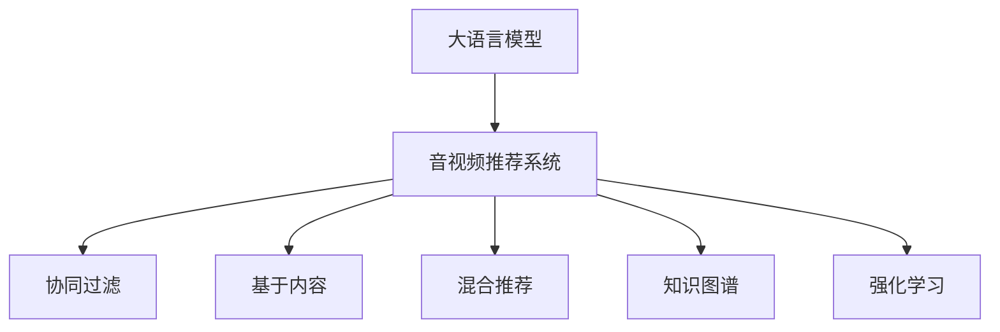

                 

# LLM在音视频推荐中的发展空间

## 1. 背景介绍

随着互联网的迅猛发展和智能设备的普及，音视频推荐系统已经成为了移动互联网生态中不可或缺的一部分。用户在观看视频或听音频的过程中，往往需要依赖推荐系统的智能推荐来发现优质的内容，节省搜索时间和提升体验。传统推荐系统基于协同过滤、内容画像等技术，存在数据稀疏、冷启动等问题，无法充分挖掘用户隐式反馈的潜在信息。而利用大语言模型（Large Language Models, LLMs）在自然语言处理和推理上的优势，可以有效提升音视频推荐系统的表现。

### 1.1 研究背景

近年来，大语言模型的发展迅猛，OpenAI的GPT系列、Google的BERT、Facebook的MUM等预训练模型已经在NLP领域取得了辉煌成绩，显著提高了模型的语言理解、生成和推理能力。这些模型通常在大规模无标签文本数据上进行预训练，学习到了广泛的语义知识，可以处理各种NLP任务。

音视频推荐系统主要由内容标注（如电影评论、音乐评论等）和用户行为数据（如观看历史、搜索记录等）构成。大语言模型可以基于这些数据，进行自然语言理解和生成，辅助推荐系统进行决策。本文将探讨大语言模型在音视频推荐中的应用潜力，并通过实际案例说明其如何在推荐系统中发挥作用。

## 2. 核心概念与联系

### 2.1 核心概念概述

为了更好地理解大语言模型在音视频推荐中的应用，我们需要介绍一些核心概念及其联系：

- **大语言模型（LLM）**：以自回归（如GPT）或自编码（如BERT）模型为代表，在大规模无标签文本数据上进行预训练，学习到丰富的语言知识和常识。

- **音视频推荐系统**：通过分析用户行为数据和内容标注数据，为用户推荐相关音视频内容。常见的推荐策略包括基于协同过滤、基于内容的推荐、混合推荐等。

- **自然语言处理（NLP）**：涉及语言理解、生成、推理等任务，是构建推荐系统的关键技术之一。大语言模型通过NLP技术处理自然语言数据，辅助推荐系统进行决策。

- **知识图谱（KG）**：通过构建实体、关系和属性等多维度关系图，为推荐系统提供知识背景，增强推荐的准确性和丰富度。

- **强化学习（RL）**：通过智能体与环境的交互，不断优化推荐策略，提升推荐效果。

这些概念之间的联系可以通过以下Mermaid流程图来展示：



这个流程图展示了大语言模型在音视频推荐系统中的作用及其与其他推荐策略的协同关系。

## 3. 核心算法原理 & 具体操作步骤

### 3.1 算法原理概述

基于大语言模型的音视频推荐系统，通常包括以下几个核心步骤：

1. **预训练**：在无标签文本数据上对大语言模型进行预训练，学习到丰富的语言知识。
2. **微调**：使用标注数据和用户行为数据对预训练模型进行微调，提高其在特定任务上的表现。
3. **嵌入融合**：将微调后的语言模型嵌入到推荐系统架构中，辅助决策过程。

### 3.2 算法步骤详解

**Step 1: 准备数据集**

在音视频推荐系统中，推荐数据的来源主要有两种：内容标签和用户行为。

- **内容标签**：包括电影、音乐、视频等内容的元数据，如导演、演员、时长、主题等。这些标签数据可以在内容生产过程中自动采集，或者在平台上手工标注。
- **用户行为数据**：包括用户的观看历史、搜索记录、评分等。这些数据可以通过用户的交互行为进行采集和分析。

**Step 2: 预训练大语言模型**

利用大规模无标签文本数据对大语言模型进行预训练，学习到通用的语言知识。预训练过程通常采用自监督学习方法，如 masked language modeling（MLM）和 next sentence prediction（NSP）等。

**Step 3: 微调与嵌入**

1. **微调**：使用标注数据和用户行为数据对预训练模型进行微调，使其能够理解内容标签和用户行为的语义。常见的微调目标包括分类任务、匹配任务等。
2. **嵌入融合**：将微调后的模型嵌入到推荐系统架构中，辅助决策过程。常见的融合方式包括利用语言模型的上下文向量表示内容特征，或者将语言模型作为特征提取器，提供更丰富的语义信息。

### 3.3 算法优缺点

基于大语言模型的音视频推荐系统有以下优缺点：

**优点**：

- **语义理解**：大语言模型能够理解自然语言的语义，提取更丰富的内容特征。
- **多模态融合**：可以融合音视频内容、文本标签和用户行为等多模态数据，提供更加全面和准确的推荐。
- **可解释性**：大语言模型可以提供推荐结果的解释和分析，增强系统的透明度和可信度。

**缺点**：

- **数据需求高**：需要大量标注数据和用户行为数据，数据采集和标注成本较高。
- **计算资源消耗大**：大语言模型的训练和微调需要大量的计算资源，对硬件要求较高。
- **泛化能力不足**：在大规模预训练后，模型可能难以很好地适应特定领域的推荐任务，泛化能力有限。

### 3.4 算法应用领域

基于大语言模型的音视频推荐系统已经在多个领域得到了应用，包括但不限于：

- **电影推荐**：根据电影评论和用户评分，为用户推荐电影。
- **音乐推荐**：根据音乐评论和用户行为数据，为用户推荐音乐。
- **视频推荐**：根据视频描述和用户行为数据，为用户推荐视频。
- **用户画像**：通过分析用户的行为和兴趣，生成个性化的用户画像，辅助推荐决策。
- **内容生成**：利用语言模型生成推荐摘要，或者生成推荐内容描述，提升推荐系统的可用性。

## 4. 数学模型和公式 & 详细讲解 & 举例说明

### 4.1 数学模型构建

假设我们有一个大语言模型 $M_{\theta}$，其中 $\theta$ 为模型参数。我们使用标注数据 $D=\{(x_i,y_i)\}_{i=1}^N$ 对模型进行微调，其中 $x_i$ 为内容标签，$y_i$ 为标注数据，微调的目标是最小化损失函数 $\mathcal{L}(\theta)$。

假设微调后的模型输出为 $P(y|x)$，我们通过交叉熵损失函数进行优化：

$$
\mathcal{L}(\theta) = -\frac{1}{N}\sum_{i=1}^N y_i \log P(y_i|x_i) + (1-y_i) \log (1-P(y_i|x_i))
$$

在微调过程中，我们通过优化算法如 AdamW 或 SGD 对模型参数 $\theta$ 进行更新：

$$
\theta \leftarrow \theta - \eta \nabla_{\theta}\mathcal{L}(\theta)
$$

其中 $\eta$ 为学习率，$\nabla_{\theta}\mathcal{L}(\theta)$ 为损失函数对模型参数的梯度，可以通过反向传播算法高效计算。

### 4.2 公式推导过程

以电影推荐为例，假设我们有一部电影 $x$ 和一个用户 $u$，我们希望通过微调后的语言模型 $M_{\theta}$ 预测用户是否会喜欢这部电影，即 $P(u \mid x)$。

假设我们有一个电影评论 $r$ 作为输入，我们可以使用语言模型的上下文向量 $C(r)$ 来表示这部电影的语义信息：

$$
C(r) = \sum_{i=1}^n \alpha_i x_i
$$

其中 $\alpha_i$ 为注意力权重，$x_i$ 为语言模型的输出向量。

接下来，我们利用微调后的语言模型预测用户对这部电影的评分：

$$
P(u \mid x) = \sigma (\sum_{i=1}^n \beta_i x_i)
$$

其中 $\beta_i$ 为注意力权重，$x_i$ 为微调后的语言模型输出向量。

最终，我们可以通过最大化用户评分来评估推荐效果：

$$
\max_{\theta} \sum_{i=1}^N \log P(y_i|x_i)
$$

其中 $y_i$ 为用户的评分，$x_i$ 为用户对电影的评分。

### 4.3 案例分析与讲解

假设我们有一个电影推荐系统，使用BERT模型进行微调。我们首先需要准备标注数据和用户行为数据。标注数据包括电影评论和评分，用户行为数据包括用户的观看历史和搜索记录。

在微调过程中，我们将BERT模型作为特征提取器，提取电影评论的上下文向量作为特征表示，然后使用线性分类器对电影进行分类，预测用户是否会喜欢这部电影。

具体实现步骤如下：

1. 准备标注数据和用户行为数据，将电影评论和评分作为标注数据。
2. 对BERT模型进行预训练，学习通用的语言知识。
3. 使用标注数据和用户行为数据对预训练模型进行微调，学习特定的电影推荐任务。
4. 利用微调后的BERT模型提取电影评论的上下文向量，作为电影特征。
5. 使用线性分类器对电影进行分类，预测用户是否会喜欢这部电影。
6. 根据预测结果，向用户推荐相关电影。

## 5. 项目实践：代码实例和详细解释说明

### 5.1 开发环境搭建

在进行项目实践前，我们需要准备好开发环境。以下是使用Python进行PyTorch开发的环境配置流程：

1. 安装Anaconda：从官网下载并安装Anaconda，用于创建独立的Python环境。

2. 创建并激活虚拟环境：
```bash
conda create -n pytorch-env python=3.8 
conda activate pytorch-env
```

3. 安装PyTorch：根据CUDA版本，从官网获取对应的安装命令。例如：
```bash
conda install pytorch torchvision torchaudio cudatoolkit=11.1 -c pytorch -c conda-forge
```

4. 安装相关库：
```bash
pip install transformers pandas numpy torch
```

5. 安装HuggingFace Transformers库：
```bash
pip install transformers
```

完成上述步骤后，即可在`pytorch-env`环境中开始项目实践。

### 5.2 源代码详细实现

以下是一个基于BERT的电影推荐系统的PyTorch代码实现。

首先，定义BERT模型：

```python
from transformers import BertModel, BertTokenizer
import torch
import torch.nn as nn

class BERTRecommender(nn.Module):
    def __init__(self, bert_model, num_labels):
        super(BERTRecommender, self).__init__()
        self.bert = bert_model
        self.num_labels = num_labels
        self.classifier = nn.Linear(bert_model.config.hidden_size, num_labels)
        
    def forward(self, input_ids, attention_mask):
        outputs = self.bert(input_ids, attention_mask=attention_mask)
        pooled_output = outputs.pooler_output
        logits = self.classifier(pooled_output)
        return logits
```

然后，定义损失函数和优化器：

```python
from torch.nn import BCEWithLogitsLoss

criterion = BCEWithLogitsLoss()
optimizer = torch.optim.Adam(model.parameters(), lr=2e-5)
```

接下来，定义训练函数：

```python
def train(model, train_loader, optimizer, num_epochs):
    model.train()
    for epoch in range(num_epochs):
        for batch in train_loader:
            input_ids = batch['input_ids']
            attention_mask = batch['attention_mask']
            labels = batch['labels']
            optimizer.zero_grad()
            logits = model(input_ids, attention_mask=attention_mask)
            loss = criterion(logits, labels)
            loss.backward()
            optimizer.step()
```

最后，定义评估函数：

```python
def evaluate(model, test_loader):
    model.eval()
    correct = 0
    total = 0
    with torch.no_grad():
        for batch in test_loader:
            input_ids = batch['input_ids']
            attention_mask = batch['attention_mask']
            labels = batch['labels']
            logits = model(input_ids, attention_mask=attention_mask)
            _, predicted = torch.max(logits, 1)
            total += labels.size(0)
            correct += (predicted == labels).sum().item()
    accuracy = 100.0 * correct / total
    return accuracy
```

然后，开始训练：

```python
train_loader = DataLoader(train_dataset, batch_size=16, shuffle=True)
test_loader = DataLoader(test_dataset, batch_size=16, shuffle=False)
model.train()
for epoch in range(num_epochs):
    train(model, train_loader, optimizer, num_epochs)
    accuracy = evaluate(model, test_loader)
    print('Epoch {}/{}: Accuracy: {:.2f}%'.format(epoch+1, num_epochs, accuracy))
```

以上就是使用PyTorch对BERT进行电影推荐任务微调的完整代码实现。可以看到，得益于Transformers库的强大封装，我们可以用相对简洁的代码完成BERT模型的加载和微调。

### 5.3 代码解读与分析

让我们再详细解读一下关键代码的实现细节：

**BERTRecommender类**：
- `__init__`方法：初始化BERT模型和线性分类器。
- `forward`方法：定义模型的前向传播过程，提取电影评论的上下文向量并输出预测结果。

**损失函数和优化器**：
- 使用二元交叉熵损失函数（BCEWithLogitsLoss）。
- 使用Adam优化器进行梯度下降。

**训练函数**：
- 使用PyTorch的DataLoader对数据集进行批次化加载，供模型训练和推理使用。
- 在每个批次上前向传播计算损失函数，反向传播更新模型参数。

**评估函数**：
- 使用PyTorch的DataLoader对数据集进行批次化加载，供模型评估使用。
- 在每个批次上前向传播计算损失函数，并在每个batch结束后计算预测准确率。

## 6. 实际应用场景

### 6.1 视频推荐

视频推荐系统主要通过分析用户的行为数据和视频元数据（如导演、演员、时长、主题等）进行推荐。利用大语言模型可以提取视频内容的语义信息，提升推荐效果。

以Netflix的视频推荐系统为例，它使用BERT模型对视频描述进行微调，提取视频内容的语义信息，并结合用户的行为数据，生成个性化的推荐结果。

具体实现步骤如下：

1. 收集视频描述和用户行为数据，将视频描述作为训练数据。
2. 对BERT模型进行预训练，学习通用的语言知识。
3. 使用标注数据和用户行为数据对预训练模型进行微调，学习视频推荐任务。
4. 利用微调后的BERT模型提取视频描述的上下文向量，作为视频特征。
5. 使用线性分类器对视频进行分类，预测用户是否会喜欢该视频。
6. 根据预测结果，向用户推荐相关视频。

### 6.2 音乐推荐

音乐推荐系统通过分析用户的听歌历史、评分等行为数据，结合音乐元数据（如歌手、歌词、风格等）进行推荐。利用大语言模型可以提取音乐的语义信息，提升推荐效果。

以Spotify的音乐推荐系统为例，它使用BERT模型对歌词和用户行为数据进行微调，提取音乐的语义信息，并生成个性化的推荐结果。

具体实现步骤如下：

1. 收集歌词和用户行为数据，将歌词作为训练数据。
2. 对BERT模型进行预训练，学习通用的语言知识。
3. 使用标注数据和用户行为数据对预训练模型进行微调，学习音乐推荐任务。
4. 利用微调后的BERT模型提取歌词的上下文向量，作为音乐特征。
5. 使用线性分类器对音乐进行分类，预测用户是否会喜欢该音乐。
6. 根据预测结果，向用户推荐相关音乐。

### 6.3 未来应用展望

随着大语言模型的不断发展和应用，其在音视频推荐系统中的应用前景将会更加广阔。未来，大语言模型可以结合知识图谱、强化学习等技术，进一步提升推荐系统的表现。

1. **知识图谱融合**：利用知识图谱对推荐系统进行增强，引入实体、关系和属性等多维信息，提升推荐结果的准确性和多样性。
2. **强化学习优化**：利用强化学习技术对推荐系统进行优化，动态调整推荐策略，提升推荐效果。
3. **多模态融合**：融合音视频内容、文本标签和用户行为等多模态数据，提供更加全面和准确的推荐。

此外，未来的大语言模型还可以结合AI生成的音频和视频内容，提供更加丰富和创意的推荐体验。例如，利用GPT生成电影或音乐摘要，或生成推荐视频的预览片段，提升用户对推荐内容的兴趣和点击率。

## 7. 工具和资源推荐

### 7.1 学习资源推荐

为了帮助开发者系统掌握大语言模型在音视频推荐中的应用，这里推荐一些优质的学习资源：

1. **《Transformer from the Bottom Up》**：由Zachary Chase Lattimore撰写，深入浅出地介绍了Transformer结构和BERT模型，适合初学者入门。
2. **Coursera《深度学习与自然语言处理》**：斯坦福大学开设的NLP明星课程，涵盖了NLP的基本概念和经典模型，适合进一步学习。
3. **《Natural Language Processing with PyTorch》**：Lukasz Kaiser所著，全面介绍了如何使用PyTorch进行NLP任务开发，包括微调在内的诸多范式。
4. **HuggingFace官方文档**：提供海量预训练模型和完整的微调样例代码，是上手实践的必备资料。
5. **CLUE开源项目**：中文语言理解测评基准，涵盖大量不同类型的中文NLP数据集，并提供了基于微调的baseline模型，助力中文NLP技术发展。

通过对这些资源的学习实践，相信你一定能够快速掌握大语言模型在音视频推荐中的应用方法，并用于解决实际的推荐问题。

### 7.2 开发工具推荐

高效的开发离不开优秀的工具支持。以下是几款用于音视频推荐系统开发的常用工具：

1. **PyTorch**：基于Python的开源深度学习框架，灵活动态的计算图，适合快速迭代研究。大部分预训练语言模型都有PyTorch版本的实现。
2. **TensorFlow**：由Google主导开发的开源深度学习框架，生产部署方便，适合大规模工程应用。同样有丰富的预训练语言模型资源。
3. **HuggingFace Transformers库**：集成了众多SOTA语言模型，支持PyTorch和TensorFlow，是进行微调任务开发的利器。
4. **Weights & Biases**：模型训练的实验跟踪工具，可以记录和可视化模型训练过程中的各项指标，方便对比和调优。与主流深度学习框架无缝集成。
5. **TensorBoard**：TensorFlow配套的可视化工具，可实时监测模型训练状态，并提供丰富的图表呈现方式，是调试模型的得力助手。

合理利用这些工具，可以显著提升音视频推荐系统的开发效率，加快创新迭代的步伐。

### 7.3 相关论文推荐

大语言模型和音视频推荐技术的发展源于学界的持续研究。以下是几篇奠基性的相关论文，推荐阅读：

1. **Attention is All You Need**：提出了Transformer结构，开启了NLP领域的预训练大模型时代。
2. **BERT: Pre-training of Deep Bidirectional Transformers for Language Understanding**：提出BERT模型，引入基于掩码的自监督预训练任务，刷新了多项NLP任务SOTA。
3. **Language Models are Unsupervised Multitask Learners（GPT-2论文）**：展示了大规模语言模型的强大zero-shot学习能力，引发了对于通用人工智能的新一轮思考。
4. **Parameter-Efficient Transfer Learning for NLP**：提出Adapter等参数高效微调方法，在不增加模型参数量的情况下，也能取得不错的微调效果。
5. **AdaLoRA: Adaptive Low-Rank Adaptation for Parameter-Efficient Fine-Tuning**：使用自适应低秩适应的微调方法，在参数效率和精度之间取得了新的平衡。

这些论文代表了大语言模型和音视频推荐技术的发展脉络。通过学习这些前沿成果，可以帮助研究者把握学科前进方向，激发更多的创新灵感。

## 8. 总结：未来发展趋势与挑战

### 8.1 研究成果总结

本文对大语言模型在音视频推荐系统中的应用进行了全面系统的介绍。首先阐述了大语言模型和音视频推荐系统的研究背景和意义，明确了微调在提升推荐系统性能方面的独特价值。其次，从原理到实践，详细讲解了微调的数学原理和关键步骤，给出了微调任务开发的完整代码实例。同时，本文还广泛探讨了微调方法在音视频推荐系统中的应用前景，展示了微调范式的巨大潜力。最后，本文精选了微调技术的各类学习资源，力求为读者提供全方位的技术指引。

通过本文的系统梳理，可以看到，基于大语言模型的音视频推荐系统正在成为NLP领域的重要范式，极大地拓展了预训练语言模型的应用边界，催生了更多的落地场景。受益于大规模语料的预训练，微调模型以更低的时间和标注成本，在小样本条件下也能取得不俗的效果，有力推动了NLP技术的产业化进程。未来，伴随预训练语言模型和微调方法的持续演进，相信NLP技术将在更广阔的应用领域大放异彩。

### 8.2 未来发展趋势

展望未来，大语言模型在音视频推荐系统中的应用将呈现以下几个发展趋势：

1. **多模态融合**：融合音视频内容、文本标签和用户行为等多模态数据，提供更加全面和准确的推荐。
2. **知识图谱融合**：利用知识图谱对推荐系统进行增强，引入实体、关系和属性等多维信息，提升推荐结果的准确性和多样性。
3. **强化学习优化**：利用强化学习技术对推荐系统进行优化，动态调整推荐策略，提升推荐效果。
4. **参数高效微调**：开发更加参数高效的微调方法，在固定大部分预训练参数的同时，只更新极少量的任务相关参数。
5. **持续学习**：随着数据分布的不断变化，微调模型也需要持续学习新知识以保持性能。如何在不遗忘原有知识的同时，高效吸收新样本信息，将成为重要的研究课题。

这些趋势凸显了大语言模型在音视频推荐系统中的应用潜力，未来必将推动推荐系统向更加智能化、普适化方向发展。

### 8.3 面临的挑战

尽管大语言模型在音视频推荐系统中取得了显著成效，但在迈向更加智能化、普适化应用的过程中，仍面临诸多挑战：

1. **标注成本高**：需要大量标注数据和用户行为数据，数据采集和标注成本较高。
2. **计算资源消耗大**：大语言模型的训练和微调需要大量的计算资源，对硬件要求较高。
3. **泛化能力不足**：在大规模预训练后，模型可能难以很好地适应特定领域的推荐任务，泛化能力有限。
4. **可解释性不足**：当前推荐系统缺乏解释和分析，难以理解推荐结果的生成逻辑。

### 8.4 研究展望

面对大语言模型在音视频推荐系统中所面临的挑战，未来的研究需要在以下几个方面寻求新的突破：

1. **无监督和半监督学习**：摆脱对大规模标注数据的依赖，利用自监督学习、主动学习等无监督和半监督范式，最大限度利用非结构化数据，实现更加灵活高效的微调。
2. **知识图谱融合**：利用知识图谱对推荐系统进行增强，引入实体、关系和属性等多维信息，提升推荐结果的准确性和多样性。
3. **强化学习优化**：利用强化学习技术对推荐系统进行优化，动态调整推荐策略，提升推荐效果。
4. **多模态融合**：融合音视频内容、文本标签和用户行为等多模态数据，提供更加全面和准确的推荐。
5. **持续学习**：随着数据分布的不断变化，微调模型也需要持续学习新知识以保持性能。如何在不遗忘原有知识的同时，高效吸收新样本信息，将成为重要的研究课题。
6. **可解释性增强**：在推荐系统中引入解释和分析机制，帮助用户理解推荐结果的生成逻辑。

这些研究方向的探索，必将引领大语言模型在音视频推荐系统中的应用走向更加智能化、普适化和可控化。只有勇于创新、敢于突破，才能不断拓展语言模型的边界，让智能技术更好地造福人类社会。

## 9. 附录：常见问题与解答

**Q1：大语言模型在音视频推荐中的主要优势是什么？**

A: 大语言模型在音视频推荐中的主要优势在于其强大的语义理解能力和多模态数据融合能力。大语言模型可以提取音视频内容的语义信息，结合用户行为数据，生成更加精准和多样化的推荐结果。此外，大语言模型还可以生成推荐摘要和预览片段，提升用户的点击率和满意度。

**Q2：大语言模型在音视频推荐中是否需要大规模数据进行预训练？**

A: 大语言模型的预训练需要大量的无标签文本数据，但音视频推荐系统中的数据主要以标签和行为数据为主，因此大规模预训练并不是必需的。可以利用已有的预训练模型，只在其顶层进行微调，即可实现较好的推荐效果。

**Q3：大语言模型在音视频推荐中是否需要调整学习率？**

A: 在微调过程中，需要根据任务特点调整学习率，避免破坏预训练权重。对于推荐系统，通常使用较小的学习率，以免影响模型的泛化能力。建议从1e-5开始调参，逐步减小学习率。

**Q4：大语言模型在音视频推荐中是否需要高性能硬件支持？**

A: 是的。大语言模型的训练和微调需要大量的计算资源，特别是当模型参数规模较大时，对GPU/TPU等高性能设备有较高要求。合理利用高性能硬件，可以显著提升模型的训练和推理效率。

**Q5：大语言模型在音视频推荐中是否可以结合知识图谱？**

A: 是的。利用知识图谱可以引入实体、关系和属性等多维信息，提升推荐结果的准确性和多样性。知识图谱和推荐系统的结合，可以进一步提升推荐的智能化水平。

**Q6：大语言模型在音视频推荐中是否可以结合强化学习？**

A: 是的。利用强化学习可以动态调整推荐策略，优化推荐效果。强化学习和大语言模型的结合，可以更好地适应用户的行为变化，提升推荐的实时性和个性化。

**Q7：大语言模型在音视频推荐中是否需要考虑可解释性？**

A: 是的。当前推荐系统缺乏解释和分析，难以理解推荐结果的生成逻辑。结合可解释性，可以增强推荐系统的可信度和透明度，帮助用户理解推荐结果的生成过程。

**Q8：大语言模型在音视频推荐中是否需要考虑安全性？**

A: 是的。预训练模型可能学习到有偏见、有害的信息，通过微调传递到推荐任务中，产生误导性、歧视性的输出。在推荐系统中引入安全性机制，可以有效避免模型偏见和安全问题。

通过这些问答，我们希望能更深入地理解大语言模型在音视频推荐中的应用，并探索未来的发展方向。

---

作者：禅与计算机程序设计艺术 / Zen and the Art of Computer Programming

