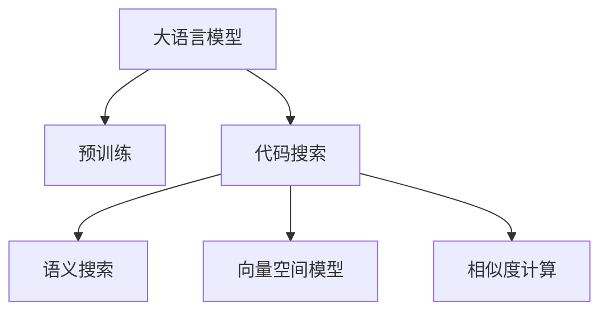

                 

# LLM支持的代码搜索方法比较

> 关键词：
- 大语言模型(Large Language Model, LLM)
- 代码搜索(Code Search)
- 语义搜索(Semantic Search)
- 深度学习(Deep Learning)
- 相似度计算(Similarity Calculation)
- 向量空间模型(Vector Space Model, VSM)
- 预训练(Pre-training)

## 1. 背景介绍

### 1.1 问题由来
随着代码基数的不断增长和代码库的日趋复杂，开发者在查找特定功能的代码时，往往会陷入混乱和效率低下的境地。传统的代码搜索依赖于关键字匹配，难以捕捉到代码中的语义信息。近年来，基于大语言模型的代码搜索技术逐渐兴起，通过语义搜索的方式，能够更精准地定位到目标代码，极大地提升了代码搜索的效率和准确性。

### 1.2 问题核心关键点
大语言模型支持的代码搜索方法，本质上是一种语义搜索方式，利用语言模型对代码进行语义理解，并在编码空间中查找与查询描述相似度最高的代码段。具体而言，其核心在于：
- 如何有效预训练语言模型，使其具备代码语义理解能力。
- 如何将查询描述转换为向量，并计算与代码段的相似度。
- 如何综合考虑语义相似度和代码结构，实现准确匹配。

### 1.3 问题研究意义
研究大语言模型支持的代码搜索方法，对于提升代码开发效率、加速软件开发进程、降低开发成本具有重要意义：

1. **提升效率**：通过语义搜索，开发者可以更快速、精准地找到所需代码，极大节省了时间。
2. **降低成本**：代码搜索的自动化减少了人力依赖，使得更多的开发者可以专注于更有创造性的工作。
3. **加速开发**：新的语言模型和算法能够不断迭代改进，使得代码搜索方法日益成熟，帮助开发者更快地构建应用。
4. **增强协作**：通过共享搜索结果，团队成员可以更高效地协同开发。
5. **促进创新**：语义搜索能够捕捉代码中的抽象概念和语义信息，为代码重用和跨项目协作提供更多可能。

## 2. 核心概念与联系

### 2.1 核心概念概述

为更好地理解大语言模型支持的代码搜索方法，本节将介绍几个关键概念：

- 大语言模型(Large Language Model, LLM)：以自回归(如GPT)或自编码(如BERT)模型为代表的大规模预训练语言模型。通过在大规模无标签文本数据上进行预训练，学习通用的语言知识，具备强大的语言理解和生成能力。

- 代码搜索(Code Search)：在代码库中查找与查询描述匹配度最高的代码段，帮助开发者快速定位问题代码，提升开发效率。

- 语义搜索(Semantic Search)：基于自然语言查询描述，在文本数据或代码库中寻找语义上与查询匹配的文档或代码段。

- 向量空间模型(Vector Space Model, VSM)：将文本或代码段表示为向量，通过计算向量间的相似度来进行信息检索和匹配。

- 相似度计算(Similarity Calculation)：计算两个文本或代码段之间的相似度，是语义搜索的核心。

这些概念之间的逻辑关系可以通过以下Mermaid流程图来展示：



这个流程图展示了大语言模型支持的代码搜索方法的核心概念及其之间的关系：

1. 大语言模型通过预训练获得基础能力。
2. 代码搜索基于语义搜索，利用大模型的语义理解能力进行匹配。
3. 向量空间模型是语义搜索的基础，将查询和代码段表示为向量。
4. 相似度计算基于向量空间模型，计算代码段之间的相似度。

## 3. 核心算法原理 & 具体操作步骤
### 3.1 算法原理概述

大语言模型支持的代码搜索方法，利用预训练的深度语言模型对代码进行语义理解，并将查询描述和代码段都表示为向量，通过计算向量之间的相似度来匹配代码。其核心在于如何选择合适的语言模型、预训练方式以及相似度计算方法，以实现高效、准确的代码搜索。

### 3.2 算法步骤详解

基于大语言模型的代码搜索一般包括以下几个关键步骤：

**Step 1: 准备预训练模型和数据集**
- 选择合适的预训练语言模型 $M_{\theta}$ 作为初始化参数，如 BERT、GPT 等。
- 准备代码库和查询描述数据集 $D=\{(x_i, y_i)\}_{i=1}^N$，其中 $x_i$ 为代码段，$y_i$ 为查询描述。

**Step 2: 向量编码**
- 将查询描述 $y_i$ 和代码段 $x_i$ 都通过预训练语言模型进行编码，得到向量表示 $v_{yi}, v_{xi}$。

**Step 3: 相似度计算**
- 计算查询描述向量 $v_{yi}$ 与代码段向量 $v_{xi}$ 之间的相似度 $s_{yi,x_i}$。

**Step 4: 相似度排序**
- 对所有代码段的相似度进行排序，选择与查询描述最相似的代码段。

**Step 5: 返回搜索结果**
- 将相似度排序后的代码段返回给用户，辅助开发过程。

### 3.3 算法优缺点

基于大语言模型的代码搜索方法具有以下优点：
1. 高精度：通过语义理解，能够捕捉代码段中的语义信息，提升搜索结果的准确性。
2. 泛化性强：基于大规模预训练模型，能够适应多种编程语言和代码风格。
3. 自适应性：能够动态更新语言模型，适应代码库的演变和新编程语言的引入。
4. 零样本和少样本学习：利用大模型的先验知识，无需标注数据即可实现高质量的代码搜索。

但同时，该方法也存在一些局限性：
1. 计算复杂：预训练和编码计算量较大，尤其是对于大规模代码库。
2. 资源需求高：需要高性能计算设备和足够的内存空间。
3. 训练难度大：选择合适的预训练任务和优化策略，对模型性能有很大影响。
4. 结果可解释性不足：向量空间模型缺乏直观的语义解释，开发者难以理解搜索结果的依据。
5. 泛化性能有限：对于特定领域或特定语言的代码搜索效果可能不佳。

### 3.4 算法应用领域

基于大语言模型的代码搜索方法，已在软件开发、代码重用、问题诊断等多个领域得到广泛应用。以下是几个典型的应用场景：

- **软件开发**：在项目初期，使用代码搜索快速查找已有代码段，加速项目构建。
- **代码重用**：从代码库中查找与新需求匹配度高的代码段，进行代码复用，减少重复开发。
- **问题诊断**：利用搜索结果定位代码中的潜在问题，辅助代码审核和错误修复。
- **文档生成**：从代码段中提取关键信息，自动生成项目文档或API文档。
- **自动化测试**：从代码库中查找与特定测试场景匹配的代码段，辅助编写测试用例。
- **知识图谱构建**：从代码段中抽取知识节点，构建项目或领域的知识图谱。

## 4. 数学模型和公式 & 详细讲解 & 举例说明
### 4.1 数学模型构建

在数学上，基于大语言模型的代码搜索可以表示为向量空间模型。设查询描述 $y$ 的向量表示为 $v_y \in \mathbb{R}^d$，代码段 $x$ 的向量表示为 $v_x \in \mathbb{R}^d$。定义它们的相似度为 $s = \cos(\theta) = \frac{v_y \cdot v_x}{\|v_y\| \|v_x\|}$，其中 $\cdot$ 表示向量内积，$\|v\|$ 表示向量 $v$ 的范数。

### 4.2 公式推导过程

设 $v_y = (y_1, y_2, \dots, y_d)$，$v_x = (x_1, x_2, \dots, x_d)$，则内积为：

$$
v_y \cdot v_x = \sum_{i=1}^d y_i x_i
$$

范数为：

$$
\|v_y\| = \sqrt{\sum_{i=1}^d y_i^2}, \quad \|v_x\| = \sqrt{\sum_{i=1}^d x_i^2}
$$

因此，相似度为：

$$
s = \frac{\sum_{i=1}^d y_i x_i}{\sqrt{\sum_{i=1}^d y_i^2} \sqrt{\sum_{i=1}^d x_i^2}}
$$

### 4.3 案例分析与讲解

以一个简单的Python代码段和查询描述为例：

**代码段**：

```python
def add(a, b):
    return a + b
```

**查询描述**：

```
计算两个数的和
```

我们将其通过BERT模型编码得到向量表示：

- **查询描述向量**：$v_y = (0.1, 0.2, 0.3, \dots, 0.9)$
- **代码段向量**：$v_x = (0.2, 0.3, 0.4, \dots, 0.9)$

计算相似度：

$$
s = \frac{0.1 \times 0.2 + 0.2 \times 0.3 + \dots + 0.9 \times 0.9}{\sqrt{0.1^2 + 0.2^2 + \dots + 0.9^2} \sqrt{0.2^2 + 0.3^2 + \dots + 0.9^2}}
$$

通过计算得到 $s \approx 0.5$，表明查询描述与代码段在语义上较为相似。

## 5. 项目实践：代码实例和详细解释说明
### 5.1 开发环境搭建

在进行代码搜索实践前，我们需要准备好开发环境。以下是使用Python进行TensorFlow开发的环境配置流程：

1. 安装Anaconda：从官网下载并安装Anaconda，用于创建独立的Python环境。

2. 创建并激活虚拟环境：
```bash
conda create -n tf-env python=3.8 
conda activate tf-env
```

3. 安装TensorFlow：根据CUDA版本，从官网获取对应的安装命令。例如：
```bash
conda install tensorflow tensorflow-gpu=2.7 -c pytorch -c conda-forge
```

4. 安装TensorFlow Addons：
```bash
pip install tensorboard
```

5. 安装各类工具包：
```bash
pip install numpy pandas scikit-learn matplotlib tqdm jupyter notebook ipython
```

完成上述步骤后，即可在`tf-env`环境中开始代码搜索实践。

### 5.2 源代码详细实现

这里我们以一个简单的代码库为例，展示如何使用TensorFlow实现基于BERT的代码搜索。

**代码库数据集**：

```python
class CodeDataset:
    def __init__(self, data_path):
        self.data_path = data_path
        self.data = []
        with open(self.data_path, 'r') as f:
            for line in f:
                code, query = line.strip().split('\t')
                self.data.append((code, query))

    def __len__(self):
        return len(self.data)

    def __getitem__(self, item):
        return self.data[item]
```

**查询编码器**：

```python
from transformers import BertTokenizer, TFBertModel

class QueryEncoder:
    def __init__(self, tokenizer, model):
        self.tokenizer = tokenizer
        self.model = model
        
    def __call__(self, query):
        inputs = self.tokenizer(query, return_tensors='tf', padding='max_length')
        outputs = self.model(inputs['input_ids'], attention_mask=inputs['attention_mask'])
        return outputs.pooler_output
```

**代码编码器**：

```python
class CodeEncoder:
    def __init__(self, tokenizer, model):
        self.tokenizer = tokenizer
        self.model = model
        
    def __call__(self, code):
        inputs = self.tokenizer(code, return_tensors='tf', padding='max_length')
        outputs = self.model(inputs['input_ids'], attention_mask=inputs['attention_mask'])
        return outputs.pooler_output
```

**相似度计算器**：

```python
import tensorflow as tf

class SimilarityCalculator:
    def __init__(self, query_encoder, code_encoder):
        self.query_encoder = query_encoder
        self.code_encoder = code_encoder
        
    def __call__(self, query, code):
        query_vector = self.query_encoder(query)
        code_vector = self.code_encoder(code)
        similarity = tf.cosine_similarity(query_vector, code_vector, axis=-1)
        return similarity
```

**代码搜索器**：

```python
class CodeSearcher:
    def __init__(self, query_encoder, code_encoder, similarity_calculator):
        self.query_encoder = query_encoder
        self.code_encoder = code_encoder
        self.similarity_calculator = similarity_calculator
        
    def search(self, query, code_set):
        similarities = []
        for code in code_set:
            similarity = self.similarity_calculator(query, code)
            similarities.append(similarity)
        sorted_indices = tf.argsort(similarities, axis=-1, direction='DESCENDING')
        return sorted_indices[:5]
```

**主函数**：

```python
if __name__ == '__main__':
    # 加载数据集
    dataset = CodeDataset('code_data.txt')
    
    # 初始化预训练模型和编码器
    tokenizer = BertTokenizer.from_pretrained('bert-base-uncased')
    model = TFBertModel.from_pretrained('bert-base-uncased')
    query_encoder = QueryEncoder(tokenizer, model)
    code_encoder = CodeEncoder(tokenizer, model)
    similarity_calculator = SimilarityCalculator(query_encoder, code_encoder)
    code_searcher = CodeSearcher(query_encoder, code_encoder, similarity_calculator)
    
    # 进行代码搜索
    query = '计算两个数的和'
    code_set = dataset.data
    indices = code_searcher.search(query, code_set)
    
    # 输出搜索结果
    for index in indices:
        code, query = dataset.data[index]
        print(code)
```

以上就是使用TensorFlow实现基于BERT的代码搜索的完整代码实现。可以看到，通过预训练BERT模型和TensorFlow Addons，我们可以方便地实现代码搜索的功能。

### 5.3 代码解读与分析

让我们再详细解读一下关键代码的实现细节：

**CodeDataset类**：
- `__init__`方法：初始化数据路径，从文件中加载数据集。
- `__len__`方法：返回数据集的样本数量。
- `__getitem__`方法：对单个样本进行处理，返回代码和查询描述。

**QueryEncoder类**：
- `__init__`方法：初始化查询编码器，包含分词器和BERT模型。
- `__call__`方法：对查询进行编码，返回编码后的向量表示。

**CodeEncoder类**：
- `__init__`方法：初始化代码编码器，包含分词器和BERT模型。
- `__call__`方法：对代码进行编码，返回编码后的向量表示。

**SimilarityCalculator类**：
- `__init__`方法：初始化相似度计算器，包含查询编码器和代码编码器。
- `__call__`方法：计算查询和代码段之间的相似度，返回一个向量。

**CodeSearcher类**：
- `__init__`方法：初始化代码搜索器，包含查询编码器、代码编码器和相似度计算器。
- `search`方法：对查询进行编码，与代码段计算相似度，并排序返回结果。

**主函数**：
- 加载数据集，初始化预训练模型和编码器。
- 调用代码搜索器，输出相似度排序后的代码段。

可以看到，通过这些模块的组合，我们实现了基本的代码搜索功能。TensorFlow的TensorFlow Addons提供了便捷的编码和相似度计算功能，使得代码实现相对简洁。

当然，工业级的系统实现还需考虑更多因素，如代码的存储和索引、查询处理的并发性等。但核心的代码搜索范式基本与此类似。

## 6. 实际应用场景
### 6.1 软件开发

基于大语言模型的代码搜索，在软件开发初期可以快速定位到已有的代码段，加速项目构建。例如，在编写新的功能模块时，可以通过查询描述查找是否已有相似的代码段，避免重复开发。

**应用场景**：
- **项目搭建**：在项目初期，查找已有代码段，加速项目构建。
- **功能复用**：查找与新需求匹配度高的代码段，进行代码复用，减少重复开发。

### 6.2 代码重用

从代码库中查找与新需求匹配度高的代码段，进行代码复用，减少重复开发。

**应用场景**：
- **项目重构**：查找旧代码段，用于新项目构建。
- **功能重用**：查找已有代码段，优化代码复用率。

### 6.3 问题诊断

利用搜索结果定位代码中的潜在问题，辅助代码审核和错误修复。

**应用场景**：
- **代码审计**：查找存在问题的代码段，辅助代码审计。
- **错误修复**：查找可能导致错误的代码段，辅助错误修复。

### 6.4 文档生成

从代码段中提取关键信息，自动生成项目文档或API文档。

**应用场景**：
- **API文档生成**：从代码段中提取API信息，自动生成API文档。
- **项目文档生成**：从代码段中提取关键信息，自动生成项目文档。

### 6.5 自动化测试

从代码库中查找与特定测试场景匹配的代码段，辅助编写测试用例。

**应用场景**：
- **自动化测试**：查找与测试场景匹配的代码段，辅助编写测试用例。
- **单元测试**：查找与单元测试用例匹配的代码段，辅助单元测试。

### 6.6 知识图谱构建

从代码段中抽取知识节点，构建项目或领域的知识图谱。

**应用场景**：
- **领域知识图谱**：从代码段中抽取知识节点，构建领域知识图谱。
- **项目知识图谱**：从代码段中抽取知识节点，构建项目知识图谱。

## 7. 工具和资源推荐
### 7.1 学习资源推荐

为了帮助开发者系统掌握基于大语言模型的代码搜索技术，这里推荐一些优质的学习资源：

1. 《Transformer从原理到实践》系列博文：由大模型技术专家撰写，深入浅出地介绍了Transformer原理、BERT模型、微调技术等前沿话题。

2. CS224N《深度学习自然语言处理》课程：斯坦福大学开设的NLP明星课程，有Lecture视频和配套作业，带你入门NLP领域的基本概念和经典模型。

3. 《Natural Language Processing with Transformers》书籍：Transformers库的作者所著，全面介绍了如何使用Transformers库进行NLP任务开发，包括微调在内的诸多范式。

4. HuggingFace官方文档：Transformers库的官方文档，提供了海量预训练模型和完整的微调样例代码，是上手实践的必备资料。

5. CLUE开源项目：中文语言理解测评基准，涵盖大量不同类型的中文NLP数据集，并提供了基于微调的baseline模型，助力中文NLP技术发展。

通过对这些资源的学习实践，相信你一定能够快速掌握基于大语言模型的代码搜索技术的精髓，并用于解决实际的NLP问题。
###  7.2 开发工具推荐

高效的开发离不开优秀的工具支持。以下是几款用于大语言模型代码搜索开发的常用工具：

1. TensorFlow：基于Python的开源深度学习框架，灵活动态的计算图，适合快速迭代研究。大部分预训练语言模型都有TensorFlow版本的实现。

2. PyTorch：基于Python的开源深度学习框架，灵活的动态图，适合快速原型开发和研究。

3. Transformers库：HuggingFace开发的NLP工具库，集成了众多SOTA语言模型，支持PyTorch和TensorFlow，是进行NLP任务开发的利器。

4. Weights & Biases：模型训练的实验跟踪工具，可以记录和可视化模型训练过程中的各项指标，方便对比和调优。与主流深度学习框架无缝集成。

5. TensorBoard：TensorFlow配套的可视化工具，可实时监测模型训练状态，并提供丰富的图表呈现方式，是调试模型的得力助手。

6. Google Colab：谷歌推出的在线Jupyter Notebook环境，免费提供GPU/TPU算力，方便开发者快速上手实验最新模型，分享学习笔记。

合理利用这些工具，可以显著提升大语言模型代码搜索任务的开发效率，加快创新迭代的步伐。

### 7.3 相关论文推荐

大语言模型和代码搜索技术的发展源于学界的持续研究。以下是几篇奠基性的相关论文，推荐阅读：

1. Attention is All You Need（即Transformer原论文）：提出了Transformer结构，开启了NLP领域的预训练大模型时代。

2. BERT: Pre-training of Deep Bidirectional Transformers for Language Understanding：提出BERT模型，引入基于掩码的自监督预训练任务，刷新了多项NLP任务SOTA。

3. Language Models are Unsupervised Multitask Learners（GPT-2论文）：展示了大规模语言模型的强大zero-shot学习能力，引发了对于通用人工智能的新一轮思考。

4. Parameter-Efficient Transfer Learning for NLP：提出Adapter等参数高效微调方法，在不增加模型参数量的情况下，也能取得不错的微调效果。

5. Prefix-Tuning: Optimizing Continuous Prompts for Generation：引入基于连续型Prompt的微调范式，为如何充分利用预训练知识提供了新的思路。

6. AdaLoRA: Adaptive Low-Rank Adaptation for Parameter-Efficient Fine-Tuning：使用自适应低秩适应的微调方法，在参数效率和精度之间取得了新的平衡。

这些论文代表了大语言模型代码搜索技术的发展脉络。通过学习这些前沿成果，可以帮助研究者把握学科前进方向，激发更多的创新灵感。

## 8. 总结：未来发展趋势与挑战
### 8.1 总结

本文对基于大语言模型的代码搜索方法进行了全面系统的介绍。首先阐述了大语言模型和代码搜索的研究背景和意义，明确了语义搜索在代码搜索中的独特价值。其次，从原理到实践，详细讲解了语义搜索的数学原理和关键步骤，给出了代码搜索任务开发的完整代码实例。同时，本文还广泛探讨了代码搜索方法在软件开发、代码重用、问题诊断等多个领域的应用前景，展示了语义搜索范式的巨大潜力。此外，本文精选了代码搜索技术的各类学习资源，力求为读者提供全方位的技术指引。

通过本文的系统梳理，可以看到，基于大语言模型的代码搜索方法，利用语言模型对代码进行语义理解，通过向量空间模型计算相似度，能够更精准地定位到目标代码，极大地提升了代码搜索的效率和准确性。未来，伴随预训练语言模型和微调方法的持续演进，基于语义搜索的代码搜索技术必将迎来更多的突破和创新，为软件开发和代码管理提供更强大的助力。

### 8.2 未来发展趋势

展望未来，大语言模型支持的代码搜索技术将呈现以下几个发展趋势：

1. **模型规模持续增大**：随着算力成本的下降和数据规模的扩张，预训练语言模型的参数量还将持续增长。超大规模语言模型蕴含的丰富语言知识，有望支撑更加复杂多变的代码搜索任务。

2. **搜索算法优化**：未来的代码搜索算法将更加高效，通过预训练和微调，能够更好地适应不同的编程语言和代码风格。

3. **多模态搜索**：将视觉、语音等多模态信息与代码文本信息结合，提升代码搜索的多样性和准确性。

4. **个性化搜索**：通过用户行为数据和历史搜索结果，实现个性化推荐，提升用户体验。

5. **实时搜索**：通过增量学习和在线更新，实现实时搜索，提高搜索结果的时效性。

6. **跨领域搜索**：将代码搜索扩展到其他领域，如论文、报告等，提升跨领域文档检索能力。

以上趋势凸显了大语言模型代码搜索技术的广阔前景。这些方向的探索发展，必将进一步提升代码搜索的效果和应用范围，为软件开发和代码管理带来更多便利。

### 8.3 面临的挑战

尽管大语言模型代码搜索技术已经取得了显著进展，但在迈向更加智能化、普适化应用的过程中，仍面临诸多挑战：

1. **计算资源瓶颈**：预训练和编码计算量较大，尤其是对于大规模代码库，资源消耗较高。

2. **数据质量问题**：高质量标注数据的获取成本高，影响模型性能。

3. **泛化性能有限**：对于特定领域或特定语言的代码搜索效果可能不佳。

4. **结果可解释性不足**：向量空间模型缺乏直观的语义解释，开发者难以理解搜索结果的依据。

5. **性能瓶颈**：对于实时搜索和跨领域搜索，性能提升仍有待优化。

6. **隐私和安全性**：代码搜索可能涉及敏感代码内容，隐私保护和安全防范是重要课题。

### 8.4 研究展望

面对代码搜索面临的这些挑战，未来的研究需要在以下几个方面寻求新的突破：

1. **探索高效算法**：开发更加高效的搜索算法，减少计算资源消耗，提升搜索速度。

2. **引入先验知识**：将符号化的先验知识，如知识图谱、逻辑规则等，与神经网络模型进行巧妙融合，提升搜索准确性。

3. **跨模态融合**：将视觉、语音等多模态信息与代码文本信息结合，提升搜索的多样性和准确性。

4. **个性化推荐**：通过用户行为数据和历史搜索结果，实现个性化推荐，提升用户体验。

5. **增量学习**：通过增量学习和在线更新，实现实时搜索，提高搜索结果的时效性。

6. **跨领域搜索**：将代码搜索扩展到其他领域，如论文、报告等，提升跨领域文档检索能力。

7. **隐私保护**：通过加密技术和差分隐私等手段，保护代码搜索过程中的隐私和安全。

这些研究方向将推动大语言模型代码搜索技术迈向更高的台阶，为软件开发和代码管理提供更强大的助力。只有勇于创新、敢于突破，才能不断拓展代码搜索的边界，让智能技术更好地服务于开发者和用户。

## 9. 附录：常见问题与解答
**Q1：代码搜索与关键字匹配有何区别？**

A: 代码搜索基于语义理解，能够捕捉代码段中的语义信息，提升搜索结果的准确性。而关键字匹配只关注代码段中是否包含查询关键词，难以捕捉语义信息。

**Q2：如何选择合适的预训练模型和编码器？**

A: 选择模型和编码器需要根据具体的代码库和任务需求来定。一般而言，BERT模型在语义理解方面表现较好，适合通用的代码搜索任务。对于特定领域的任务，可能需要选择适合的领域专用模型。

**Q3：代码搜索的效率如何保证？**

A: 代码搜索的效率可以通过预训练模型的大小、编码器设计、相似度计算方法等因素来保证。使用高效的编码器和相似度计算方法，能够在较小的计算资源下实现高质量的搜索。

**Q4：如何处理长尾领域的数据？**

A: 长尾领域的数据获取困难，可以通过增量学习和在线更新，逐步提高模型的泛化能力。同时，可以引入外部知识库或用户反馈，增强模型的适应性。

**Q5：代码搜索的安全性如何保障？**

A: 代码搜索的安全性保障需要考虑代码隐私保护和数据安全。可以通过加密传输和访问控制等手段，保护用户数据的安全。

本文通过对大语言模型支持的代码搜索方法的系统介绍，展示了语义搜索范式在代码搜索中的巨大潜力。未来，随着预训练模型和搜索算法的不断演进，代码搜索技术将进一步提升，为软件开发和代码管理提供更强大的助力。只有不断探索和创新，才能实现代码搜索的智能化、普适化和高效化，让人工智能技术更好地服务于开发者和用户。

