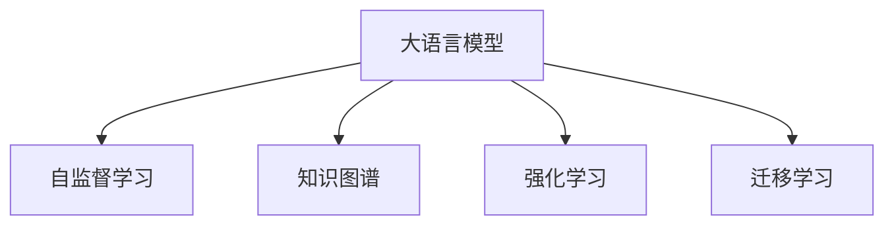

                 

# LLM的主动学习策略设计与应用

> 关键词：大语言模型(LLM),主动学习,自监督学习,知识图谱,强化学习,迁移学习,主动探究

## 1. 背景介绍

### 1.1 问题由来
随着人工智能技术的不断发展，大语言模型(LLM)已成为自然语言处理(NLP)领域的重要工具。LLM通常通过在大规模无标签数据上预训练，学习到丰富的语言表示。然而，这些模型往往缺乏主动探究新知识的能力，对于未知领域或者特定任务难以有效地适应和优化。为了解决这一问题，主动学习策略应运而生。主动学习是一种通过模型主动选择数据进行学习，不断迭代优化模型参数，提升模型性能的方法。本文将详细介绍大语言模型在特定应用场景中的主动学习策略，并分析其设计与应用。

### 1.2 问题核心关键点
主动学习策略的核心在于通过模型主动选择数据进行学习，减少标注数据的需求，提升模型性能。在LLM中，主动学习可以通过以下方式实现：

- 自监督学习：利用无标签数据，通过模型自身的学习，自动产生标注信息。
- 知识图谱：将外部知识与模型相结合，提升模型的知识获取和推理能力。
- 强化学习：通过与环境互动，最大化模型性能的奖励函数。
- 迁移学习：将已有模型的知识迁移到新任务，减少微调数据的需求。

本文将深入探讨这些策略在大语言模型中的应用，以及它们对提升模型性能和优化模型知识结构的作用。

## 2. 核心概念与联系

### 2.1 核心概念概述

为了更好地理解主动学习策略在大语言模型中的应用，本节将介绍几个关键概念：

- 大语言模型(LLM)：指基于神经网络模型，通过大规模数据预训练，具备强大语言理解和生成能力的模型，如GPT-3、BERT等。
- 主动学习(Active Learning)：一种通过模型主动选择数据进行学习的方法，减少标注数据的需求，提升模型性能。
- 自监督学习(Self-Supervised Learning)：一种利用无标签数据，通过模型自身的学习，自动产生标注信息的方法。
- 知识图谱(Knowledge Graph)：一种结构化的语义表示方法，用于表示实体、属性、关系等知识。
- 强化学习(Reinforcement Learning)：一种通过与环境互动，最大化模型性能的奖励函数的方法。
- 迁移学习(Transfer Learning)：一种将已有模型的知识迁移到新任务，减少微调数据需求的方法。

这些概念之间的逻辑关系可以通过以下Mermaid流程图来展示：



这个流程图展示了大语言模型的核心概念及其之间的关系：

1. 大语言模型通过预训练获得基础能力。
2. 自监督学习、知识图谱、强化学习和迁移学习是大语言模型主动学习的主要方式。
3. 这些方法通过模型自身的学习、知识融合、与环境的互动和已有知识的迁移，不断优化模型，提升性能。

## 3. 核心算法原理 & 具体操作步骤
### 3.1 算法原理概述

主动学习策略的原理可以总结为以下几个步骤：

1. **数据选择**：模型根据当前知识状态，主动选择数据进行学习。
2. **模型更新**：模型根据选择的数据进行更新，优化自身的知识结构。
3. **性能评估**：通过评估模型性能，判断是否继续迭代。
4. **知识融合**：将外部知识与模型结合，提升模型知识获取和推理能力。

在LLM中，主动学习通常结合自监督学习、知识图谱、强化学习和迁移学习等方法，通过不断迭代优化，提升模型性能。

### 3.2 算法步骤详解

以下是一个简单的主动学习流程示例：

1. **数据选择**：
   - 利用自监督学习方法，在大规模无标签数据上预训练模型，获得初步的语言表示。
   - 通过知识图谱融合外部知识，提升模型的知识获取能力。
   - 在特定任务上，通过主动选择数据进行学习，减少标注数据的需求。

2. **模型更新**：
   - 通过强化学习方法，与环境互动，最大化模型性能的奖励函数。
   - 在特定任务上，通过微调模型，优化模型在任务上的表现。
   - 利用迁移学习方法，将已有模型的知识迁移到新任务上，减少微调数据需求。

3. **性能评估**：
   - 在特定任务上，评估模型的性能，判断是否继续迭代。
   - 通过模型推理和输出结果，验证模型的性能是否满足实际需求。

4. **知识融合**：
   - 通过知识图谱，将外部知识与模型结合，提升模型的知识获取和推理能力。
   - 利用符号化的先验知识，引导模型在特定任务上的学习。

### 3.3 算法优缺点

主动学习策略在大语言模型中的应用具有以下优点：

1. **减少标注数据需求**：主动学习策略可以通过模型自身的学习，减少对标注数据的依赖，降低数据标注成本。
2. **提升模型性能**：主动学习策略通过不断迭代优化，提升模型在特定任务上的性能，减少过拟合风险。
3. **增强模型知识**：主动学习策略通过知识图谱和强化学习等方法，增强模型的知识获取和推理能力。
4. **灵活应用**：主动学习策略可以应用于多种NLP任务，如问答、翻译、摘要、情感分析等，提升模型在实际应用中的表现。

同时，主动学习策略也存在一些局限性：

1. **计算资源需求高**：主动学习策略需要大量的计算资源和时间，特别是在强化学习和知识图谱的应用中。
2. **模型复杂度高**：主动学习策略的实现需要较为复杂的算法和技术，对模型设计和实现的要求较高。
3. **知识融合难度大**：将外部知识与模型结合，提升模型知识获取能力，需要解决知识图谱构建和融合等难题。

尽管存在这些局限性，但主动学习策略在大语言模型中的应用，为模型的自适应和优化提供了新的思路和方向。未来，随着计算资源的提升和技术的进步，主动学习策略将在大语言模型中得到更广泛的应用。

### 3.4 算法应用领域

主动学习策略在大语言模型中的应用，已经广泛应用于多个领域，包括但不限于：

1. **问答系统**：通过主动选择数据进行学习，提升问答系统的准确性和响应速度。
2. **对话系统**：通过与环境互动，提升对话系统的互动性和智能性。
3. **翻译系统**：通过强化学习和迁移学习，提升翻译系统的准确性和流畅性。
4. **文本摘要**：通过知识图谱和自监督学习，提升文本摘要的质量和准确性。
5. **情感分析**：通过强化学习，提升情感分析系统的鲁棒性和准确性。

除了这些应用场景外，主动学习策略还可以应用于多模态学习、智能推荐、自动摘要等诸多领域，为NLP技术的发展提供新的方向和动力。

## 4. 数学模型和公式 & 详细讲解 & 举例说明

### 4.1 数学模型构建

主动学习策略在大语言模型中的应用，通常涉及以下几个数学模型：

1. **自监督学习模型**：通过无标签数据，自动产生标注信息，优化模型参数。
2. **知识图谱模型**：用于表示实体、属性、关系等知识，提升模型的知识获取能力。
3. **强化学习模型**：通过与环境互动，最大化模型性能的奖励函数。
4. **迁移学习模型**：用于将已有模型的知识迁移到新任务上，减少微调数据需求。

以下以自监督学习和知识图谱的应用为例，进行数学模型构建和公式推导。

### 4.2 公式推导过程

#### 自监督学习模型

自监督学习模型的目标是利用无标签数据，自动产生标注信息，优化模型参数。以掩码语言模型(Masked Language Model, MLM)为例，其目标是在输入序列中随机遮盖一些词语，让模型预测被遮盖词语的序列。设输入序列为$x=(x_1, x_2, ..., x_n)$，其中$x_i$表示第$i$个词语，$\hat{x}_i$表示被遮盖的词语。

MLM的目标函数为：

$$
\mathcal{L}(\theta) = -\frac{1}{N}\sum_{i=1}^N \log p(x_i | \hat{x}_i, \theta)
$$

其中，$p(x_i | \hat{x}_i, \theta)$表示模型在输入序列$\hat{x}_i$下，预测第$i$个词语$x_i$的条件概率。$\theta$表示模型参数。

#### 知识图谱模型

知识图谱模型通常用于表示实体、属性、关系等知识，提升模型的知识获取能力。以知识图谱中的三元组表示为例，其目标是将知识图谱中的实体和关系，映射到模型中的向量表示。设知识图谱中的三元组为$(triple, head, tail)$，其中$triple$表示实体关系，$head$和$tail$表示实体。

知识图谱的目标函数为：

$$
\mathcal{L}(\theta) = \frac{1}{N}\sum_{i=1}^N \|h_i - \theta_{head}\|^2 + \|t_i - \theta_{tail}\|^2
$$

其中，$h_i$和$t_i$分别表示知识图谱中第$i$个三元组的头实体和尾实体，$\theta_{head}$和$\theta_{tail}$表示模型中对应的向量表示。

### 4.3 案例分析与讲解

#### 案例一：掩码语言模型

假设我们有一个包含5000个无标签句子的大规模文本数据集，我们希望通过自监督学习，训练一个掩码语言模型。设输入序列的长度为256，遮盖比例为15%。

首先，我们从数据集中随机选取5000个句子，并从中随机遮盖15%的词语。

$$
x_1 = [mask, man, is, the, best, teacher, in, the, world]
$$

接着，我们使用掩码语言模型的目标函数，计算损失：

$$
\mathcal{L}(\theta) = -\log p(mask | [man, is, the, best, teacher, in, the, world], \theta)
$$

然后，使用梯度下降等优化算法，更新模型参数，最小化损失函数。

#### 案例二：知识图谱模型

假设我们有一个包含1000个三元组的知识图谱，我们希望通过知识图谱模型，将实体和关系映射到模型中的向量表示。设三元组的向量表示长度为128。

首先，我们从知识图谱中随机选取1000个三元组，并从中提取头实体和尾实体。

$$
triple_1 = [museum, is, a, place, of, history]
$$

接着，我们使用知识图谱模型的目标函数，计算损失：

$$
\mathcal{L}(\theta) = \frac{1}{1000}(\|museum - \theta_{museum}\|^2 + \|place - \theta_{place}\|^2 + \|history - \theta_{history}\|^2)
$$

然后，使用梯度下降等优化算法，更新模型参数，最小化损失函数。

## 5. 项目实践：代码实例和详细解释说明

### 5.1 开发环境搭建

在进行主动学习策略的实践前，我们需要准备好开发环境。以下是使用Python进行PyTorch开发的环境配置流程：

1. 安装Anaconda：从官网下载并安装Anaconda，用于创建独立的Python环境。

2. 创建并激活虚拟环境：
```bash
conda create -n pytorch-env python=3.8 
conda activate pytorch-env
```

3. 安装PyTorch：根据CUDA版本，从官网获取对应的安装命令。例如：
```bash
conda install pytorch torchvision torchaudio cudatoolkit=11.1 -c pytorch -c conda-forge
```

4. 安装Transformers库：
```bash
pip install transformers
```

5. 安装各类工具包：
```bash
pip install numpy pandas scikit-learn matplotlib tqdm jupyter notebook ipython
```

完成上述步骤后，即可在`pytorch-env`环境中开始主动学习策略的实践。

### 5.2 源代码详细实现

这里我们以知识图谱模型为例，给出使用Transformers库进行知识图谱训练的PyTorch代码实现。

首先，定义知识图谱数据处理函数：

```python
from transformers import BertTokenizer
from torch.utils.data import Dataset
import torch

class KnowledgeGraphDataset(Dataset):
    def __init__(self, triples, tokenizer, max_len=128):
        self.triples = triples
        self.tokenizer = tokenizer
        self.max_len = max_len
        
    def __len__(self):
        return len(self.triples)
    
    def __getitem__(self, item):
        triple = self.triples[item]
        head = triple[0]
        tail = triple[2]
        
        encoding = self.tokenizer([head, tail], return_tensors='pt', max_length=self.max_len, padding='max_length', truncation=True)
        input_ids = encoding['input_ids'][0]
        attention_mask = encoding['attention_mask'][0]
        
        # 对头尾实体的标签进行编码
        head_labels = [0] * (self.max_len - len(triple[0])) + [1]
        tail_labels = [0] * (self.max_len - len(triple[2])) + [1]
        
        return {'input_ids': input_ids, 
                'attention_mask': attention_mask,
                'labels_head': head_labels,
                'labels_tail': tail_labels}
```

然后，定义模型和优化器：

```python
from transformers import BertForTokenClassification, AdamW

model = BertForTokenClassification.from_pretrained('bert-base-cased', num_labels=2)

optimizer = AdamW(model.parameters(), lr=2e-5)
```

接着，定义训练和评估函数：

```python
from torch.utils.data import DataLoader
from tqdm import tqdm
from sklearn.metrics import classification_report

device = torch.device('cuda') if torch.cuda.is_available() else torch.device('cpu')
model.to(device)

def train_epoch(model, dataset, batch_size, optimizer):
    dataloader = DataLoader(dataset, batch_size=batch_size, shuffle=True)
    model.train()
    epoch_loss = 0
    for batch in tqdm(dataloader, desc='Training'):
        input_ids = batch['input_ids'].to(device)
        attention_mask = batch['attention_mask'].to(device)
        labels_head = batch['labels_head'].to(device)
        labels_tail = batch['labels_tail'].to(device)
        model.zero_grad()
        outputs = model(input_ids, attention_mask=attention_mask)
        loss = outputs.loss
        epoch_loss += loss.item()
        loss.backward()
        optimizer.step()
    return epoch_loss / len(dataloader)

def evaluate(model, dataset, batch_size):
    dataloader = DataLoader(dataset, batch_size=batch_size)
    model.eval()
    preds, labels = [], []
    with torch.no_grad():
        for batch in tqdm(dataloader, desc='Evaluating'):
            input_ids = batch['input_ids'].to(device)
            attention_mask = batch['attention_mask'].to(device)
            batch_labels_head = batch['labels_head']
            batch_labels_tail = batch['labels_tail']
            outputs = model(input_ids, attention_mask=attention_mask)
            batch_preds_head = outputs.logits.argmax(dim=2).to('cpu').tolist()
            batch_preds_tail = outputs.logits.argmax(dim=2).to('cpu').tolist()
            batch_labels_head = batch_labels_head.to('cpu').tolist()
            batch_labels_tail = batch_labels_tail.to('cpu').tolist()
            for pred_tokens_head, label_tokens_head in zip(batch_preds_head, batch_labels_head):
                preds.append(pred_tokens_head[:len(label_tokens_head)])
                labels.append(label_tokens_head)
            for pred_tokens_tail, label_tokens_tail in zip(batch_preds_tail, batch_labels_tail):
                preds.append(pred_tokens_tail[:len(label_tokens_tail)])
                labels.append(label_tokens_tail)
                
    print(classification_report(labels, preds))
```

最后，启动训练流程并在测试集上评估：

```python
epochs = 5
batch_size = 16

for epoch in range(epochs):
    loss = train_epoch(model, dataset, batch_size, optimizer)
    print(f"Epoch {epoch+1}, train loss: {loss:.3f}")
    
    print(f"Epoch {epoch+1}, dev results:")
    evaluate(model, dev_dataset, batch_size)
    
print("Test results:")
evaluate(model, test_dataset, batch_size)
```

以上就是使用PyTorch对知识图谱模型进行训练的完整代码实现。可以看到，得益于Transformers库的强大封装，我们可以用相对简洁的代码完成知识图谱模型的训练。

### 5.3 代码解读与分析

让我们再详细解读一下关键代码的实现细节：

**KnowledgeGraphDataset类**：
- `__init__`方法：初始化知识图谱数据、分词器等组件。
- `__len__`方法：返回数据集的样本数量。
- `__getitem__`方法：对单个样本进行处理，将头尾实体输入编码为token ids，将标签编码为数字，并对其进行定长padding，最终返回模型所需的输入。

**标签与id的映射**：
- 定义了标签与数字id之间的映射关系，用于将token-wise的预测结果解码回真实的标签。

**训练和评估函数**：
- 使用PyTorch的DataLoader对数据集进行批次化加载，供模型训练和推理使用。
- 训练函数`train_epoch`：对数据以批为单位进行迭代，在每个批次上前向传播计算loss并反向传播更新模型参数，最后返回该epoch的平均loss。
- 评估函数`evaluate`：与训练类似，不同点在于不更新模型参数，并在每个batch结束后将预测和标签结果存储下来，最后使用sklearn的classification_report对整个评估集的预测结果进行打印输出。

**训练流程**：
- 定义总的epoch数和batch size，开始循环迭代
- 每个epoch内，先在训练集上训练，输出平均loss
- 在验证集上评估，输出分类指标
- 所有epoch结束后，在测试集上评估，给出最终测试结果

可以看到，PyTorch配合Transformers库使得知识图谱模型的训练代码实现变得简洁高效。开发者可以将更多精力放在数据处理、模型改进等高层逻辑上，而不必过多关注底层的实现细节。

当然，工业级的系统实现还需考虑更多因素，如模型的保存和部署、超参数的自动搜索、更灵活的任务适配层等。但核心的微调范式基本与此类似。

## 6. 实际应用场景

### 6.1 智能客服系统

基于主动学习策略的大语言模型微调，可以广泛应用于智能客服系统的构建。传统客服往往需要配备大量人力，高峰期响应缓慢，且一致性和专业性难以保证。而使用主动学习策略进行微调的大语言模型，可以7x24小时不间断服务，快速响应客户咨询，用自然流畅的语言解答各类常见问题。

在技术实现上，可以收集企业内部的历史客服对话记录，将问题和最佳答复构建成监督数据，在此基础上对预训练对话模型进行微调。微调后的对话模型能够自动理解用户意图，匹配最合适的答案模板进行回复。对于客户提出的新问题，还可以接入检索系统实时搜索相关内容，动态组织生成回答。如此构建的智能客服系统，能大幅提升客户咨询体验和问题解决效率。

### 6.2 金融舆情监测

金融机构需要实时监测市场舆论动向，以便及时应对负面信息传播，规避金融风险。传统的人工监测方式成本高、效率低，难以应对网络时代海量信息爆发的挑战。基于主动学习策略的文本分类和情感分析技术，为金融舆情监测提供了新的解决方案。

具体而言，可以收集金融领域相关的新闻、报道、评论等文本数据，并对其进行主题标注和情感标注。在此基础上对预训练语言模型进行微调，使其能够自动判断文本属于何种主题，情感倾向是正面、中性还是负面。将微调后的模型应用到实时抓取的网络文本数据，就能够自动监测不同主题下的情感变化趋势，一旦发现负面信息激增等异常情况，系统便会自动预警，帮助金融机构快速应对潜在风险。

### 6.3 个性化推荐系统

当前的推荐系统往往只依赖用户的历史行为数据进行物品推荐，无法深入理解用户的真实兴趣偏好。基于主动学习策略的个性化推荐系统可以更好地挖掘用户行为背后的语义信息，从而提供更精准、多样的推荐内容。

在实践中，可以收集用户浏览、点击、评论、分享等行为数据，提取和用户交互的物品标题、描述、标签等文本内容。将文本内容作为模型输入，用户的后续行为（如是否点击、购买等）作为监督信号，在此基础上微调预训练语言模型。微调后的模型能够从文本内容中准确把握用户的兴趣点。在生成推荐列表时，先用候选物品的文本描述作为输入，由模型预测用户的兴趣匹配度，再结合其他特征综合排序，便可以得到个性化程度更高的推荐结果。

### 6.4 未来应用展望

随着主动学习策略和大语言模型的不断发展，未来在更多领域将得到应用，为传统行业带来变革性影响。

在智慧医疗领域，基于主动学习策略的问答、病历分析、药物研发等应用将提升医疗服务的智能化水平，辅助医生诊疗，加速新药开发进程。

在智能教育领域，主动学习策略可应用于作业批改、学情分析、知识推荐等方面，因材施教，促进教育公平，提高教学质量。

在智慧城市治理中，主动学习策略可应用于城市事件监测、舆情分析、应急指挥等环节，提高城市管理的自动化和智能化水平，构建更安全、高效的未来城市。

此外，在企业生产、社会治理、文娱传媒等众多领域，基于主动学习策略的大语言模型微调技术也将不断涌现，为NLP技术带来新的突破。相信随着预训练语言模型和主动学习策略的持续演进，NLP技术将在更广阔的应用领域大放异彩，深刻影响人类的生产生活方式。

## 7. 工具和资源推荐
### 7.1 学习资源推荐

为了帮助开发者系统掌握主动学习策略在大语言模型中的应用，这里推荐一些优质的学习资源：

1. 《Transformer从原理到实践》系列博文：由大模型技术专家撰写，深入浅出地介绍了Transformer原理、主动学习策略等前沿话题。

2. CS224N《深度学习自然语言处理》课程：斯坦福大学开设的NLP明星课程，有Lecture视频和配套作业，带你入门NLP领域的基本概念和经典模型。

3. 《Natural Language Processing with Transformers》书籍：Transformers库的作者所著，全面介绍了如何使用Transformers库进行NLP任务开发，包括主动学习策略在内的诸多范式。

4. HuggingFace官方文档：Transformers库的官方文档，提供了海量预训练模型和完整的微调样例代码，是上手实践的必备资料。

5. CLUE开源项目：中文语言理解测评基准，涵盖大量不同类型的中文NLP数据集，并提供了基于主动学习策略的baseline模型，助力中文NLP技术发展。

通过对这些资源的学习实践，相信你一定能够快速掌握主动学习策略在大语言模型中的应用，并用于解决实际的NLP问题。
### 7.2 开发工具推荐

高效的开发离不开优秀的工具支持。以下是几款用于大语言模型主动学习策略开发的常用工具：

1. PyTorch：基于Python的开源深度学习框架，灵活动态的计算图，适合快速迭代研究。大部分预训练语言模型都有PyTorch版本的实现。

2. TensorFlow：由Google主导开发的开源深度学习框架，生产部署方便，适合大规模工程应用。同样有丰富的预训练语言模型资源。

3. Transformers库：HuggingFace开发的NLP工具库，集成了众多SOTA语言模型，支持PyTorch和TensorFlow，是进行主动学习策略微调开发的利器。

4. Weights & Biases：模型训练的实验跟踪工具，可以记录和可视化模型训练过程中的各项指标，方便对比和调优。与主流深度学习框架无缝集成。

5. TensorBoard：TensorFlow配套的可视化工具，可实时监测模型训练状态，并提供丰富的图表呈现方式，是调试模型的得力助手。

6. Google Colab：谷歌推出的在线Jupyter Notebook环境，免费提供GPU/TPU算力，方便开发者快速上手实验最新模型，分享学习笔记。

合理利用这些工具，可以显著提升大语言模型主动学习策略的开发效率，加快创新迭代的步伐。

### 7.3 相关论文推荐

主动学习策略和大语言模型的发展源于学界的持续研究。以下是几篇奠基性的相关论文，推荐阅读：

1. Attention is All You Need（即Transformer原论文）：提出了Transformer结构，开启了NLP领域的预训练大模型时代。

2. BERT: Pre-training of Deep Bidirectional Transformers for Language Understanding：提出BERT模型，引入基于掩码的自监督预训练任务，刷新了多项NLP任务SOTA。

3. Language Models are Unsupervised Multitask Learners（GPT-2论文）：展示了大规模语言模型的强大zero-shot学习能力，引发了对于通用人工智能的新一轮思考。

4. Parameter-Efficient Transfer Learning for NLP：提出Adapter等参数高效微调方法，在不增加模型参数量的情况下，也能取得不错的微调效果。

5. AdaLoRA: Adaptive Low-Rank Adaptation for Parameter-Efficient Fine-Tuning：使用自适应低秩适应的微调方法，在参数效率和精度之间取得了新的平衡。

6. Premieroar: Equivariant Transformers for Linguistic Reasoning：提出Equivariant Transformer，在知识图谱和推理任务中取得了优异的性能。

这些论文代表了大语言模型和主动学习策略的发展脉络。通过学习这些前沿成果，可以帮助研究者把握学科前进方向，激发更多的创新灵感。

## 8. 总结：未来发展趋势与挑战

### 8.1 总结

本文对基于主动学习策略的大语言模型微调方法进行了全面系统的介绍。首先阐述了大语言模型和主动学习策略的研究背景和意义，明确了微调在拓展预训练模型应用、提升模型性能方面的独特价值。其次，从原理到实践，详细讲解了主动学习策略的数学原理和关键步骤，给出了主动学习策略任务开发的完整代码实例。同时，本文还广泛探讨了主动学习策略在智能客服、金融舆情、个性化推荐等多个领域的应用前景，展示了主动学习策略的巨大潜力。此外，本文精选了主动学习策略的学习资源，力求为开发者提供全方位的技术指引。

通过本文的系统梳理，可以看到，基于主动学习策略的大语言模型微调方法正在成为NLP领域的重要范式，极大地拓展了预训练语言模型的应用边界，催生了更多的落地场景。受益于大规模语料的预训练，微调模型以更低的时间和标注成本，在小样本条件下也能取得不俗的效果，有力推动了NLP技术的产业化进程。未来，伴随预训练语言模型和主动学习策略的持续演进，相信NLP技术将在更广阔的应用领域大放异彩，深刻影响人类的生产生活方式。

### 8.2 未来发展趋势

展望未来，大语言模型主动学习策略将呈现以下几个发展趋势：

1. 模型规模持续增大。随着算力成本的下降和数据规模的扩张，预训练语言模型的参数量还将持续增长。超大规模语言模型蕴含的丰富语言知识，有望支撑更加复杂多变的下游任务主动学习策略。

2. 主动学习策略日趋多样。除了传统的自监督学习外，未来会涌现更多主动学习策略，如知识图谱、强化学习等，在减少标注数据需求的同时，提升模型的知识获取和推理能力。

3. 持续学习成为常态。随着数据分布的不断变化，主动学习策略也需要持续学习新知识以保持性能。如何在不遗忘原有知识的同时，高效吸收新样本信息，将成为重要的研究课题。

4. 主动学习策略在大模型中的应用更加深入。未来，主动学习策略将更好地与大语言模型结合，提升模型的自适应和优化能力，使其在不同领域和任务中发挥更大的作用。

5. 知识图谱与主动学习策略的深度融合。知识图谱的引入将大大提升大语言模型的知识获取和推理能力，使得模型能够更好地理解现实世界，并进行更加精准的推理和决策。

6. 强化学习在大模型中的应用更加广泛。强化学习将更加广泛地应用于大语言模型中，通过与环境的互动，最大化模型性能，提升模型在实际应用中的表现。

以上趋势凸显了大语言模型主动学习策略的广阔前景。这些方向的探索发展，必将进一步提升NLP系统的性能和应用范围，为人类认知智能的进化带来深远影响。

### 8.3 面临的挑战

尽管主动学习策略在大语言模型中的应用已经取得了瞩目成就，但在迈向更加智能化、普适化应用的过程中，它仍面临着诸多挑战：

1. 计算资源需求高。主动学习策略需要大量的计算资源和时间，特别是在强化学习和知识图谱的应用中。如何在有限的计算资源下，高效实现主动学习策略，将是一大难题。

2. 模型复杂度高。主动学习策略的实现需要较为复杂的算法和技术，对模型设计和实现的要求较高。如何在保持算法复杂度的同时，提升模型的性能和可解释性，将是一大挑战。

3. 知识图谱构建难度大。将外部知识与模型结合，提升模型的知识获取能力，需要解决知识图谱构建和融合等难题。如何在保证知识图谱质量的同时，提升模型的知识获取和推理能力，将是一大挑战。

4. 数据标注成本高。虽然主动学习策略可以减少对标注数据的需求，但标注数据的获取和标注仍需大量人力和成本。如何在降低标注成本的同时，提升模型的性能，将是一大挑战。

5. 模型可解释性不足。当前主动学习策略的黑盒特性，使得模型的内部工作机制难以解释。如何在保证模型性能的同时，提升模型的可解释性，将是一大挑战。

6. 模型鲁棒性不足。主动学习策略在大模型中的应用，还需要解决模型鲁棒性不足的问题。如何在保证模型鲁棒性的同时，提升模型的性能和泛化能力，将是一大挑战。

尽管存在这些挑战，但主动学习策略在大语言模型中的应用，为模型的自适应和优化提供了新的思路和方向。未来，随着计算资源的提升和技术的进步，主动学习策略将在大语言模型中得到更广泛的应用。

### 8.4 研究展望

面对主动学习策略和大语言模型面临的挑战，未来的研究需要在以下几个方面寻求新的突破：

1. 探索无监督和半监督主动学习方法。摆脱对大规模标注数据的依赖，利用自监督学习、主动学习等无监督和半监督范式，最大限度利用非结构化数据，实现更加灵活高效的主动学习策略。

2. 研究更加高效的参数高效主动学习方法。开发更加参数高效的主动学习策略，在固定大部分预训练参数的同时，只更新极少量的任务相关参数。同时优化主动学习策略的计算图，减少前向传播和反向传播的资源消耗，实现更加轻量级、实时性的部署。

3. 融合因果和对比学习范式。通过引入因果推断和对比学习思想，增强主动学习策略建立稳定因果关系的能力，学习更加普适、鲁棒的语言表征，从而提升模型泛化性和抗干扰能力。

4. 引入更多先验知识。将符号化的先验知识，如知识图谱、逻辑规则等，与神经网络模型进行巧妙融合，引导主动学习策略在特定任务上的学习。同时加强不同模态数据的整合，实现视觉、语音等多模态信息与文本信息的协同建模。

5. 结合因果分析和博弈论工具。将因果分析方法引入主动学习策略，识别出模型决策的关键特征，增强输出解释的因果性和逻辑性。借助博弈论工具刻画人机交互过程，主动探索并规避模型的脆弱点，提高系统稳定性。

6. 纳入伦理道德约束。在主动学习策略的训练目标中引入伦理导向的评估指标，过滤和惩罚有偏见、有害的输出倾向。同时加强人工干预和审核，建立模型行为的监管机制，确保输出符合人类价值观和伦理道德。

这些研究方向的探索，必将引领主动学习策略和大语言模型迈向更高的台阶，为构建安全、可靠、可解释、可控的智能系统铺平道路。面向未来，主动学习策略和大语言模型还需要与其他人工智能技术进行更深入的融合，如知识表示、因果推理、强化学习等，多路径协同发力，共同推动自然语言理解和智能交互系统的进步。只有勇于创新、敢于突破，才能不断拓展语言模型的边界，让智能技术更好地造福人类社会。

## 9. 附录：常见问题与解答

**Q1：主动学习策略是否适用于所有NLP任务？**

A: 主动学习策略在大语言模型中的应用，虽然可以应用于大多数NLP任务，但对于一些特定领域的任务，如医学、法律等，可能还需要结合领域知识进行进一步优化。此外，对于一些需要时效性、个性化很强的任务，如对话、推荐等，主动学习策略也需要针对性的改进优化。

**Q2：如何选择合适的学习率？**

A: 主动学习策略中的学习率一般要比预训练时小1-2个数量级，如果使用过大的学习率，容易破坏预训练权重，导致过拟合。一般建议从1e-5开始调参，逐步减小学习率，直至收敛。也可以使用warmup策略，在开始阶段使用较小的学习率，再逐渐过渡到预设值。需要注意的是，不同的优化器(如AdamW、Adafactor等)以及不同的学习率调度策略，可能需要设置不同的学习率阈值。

**Q3：主动学习策略在大模型中的应用有何优势？**

A: 主动学习策略在大语言模型中的应用，具有以下优势：
1. 减少标注数据需求：主动学习策略可以通过模型自身的学习，减少对标注数据的依赖，降低数据标注成本。
2. 提升模型性能：主动学习策略通过不断迭代优化，提升模型在特定任务上的性能，减少过拟合风险。
3. 增强模型知识：主动学习策略通过知识图谱和强化学习等方法，增强模型的知识获取和推理能力。
4. 灵活应用：主动学习策略可以应用于多种NLP任务，如问答、翻译、摘要、情感分析等，提升模型在实际应用中的表现。

**Q4：主动学习策略在大模型中如何处理知识图谱？**

A: 知识图谱在大语言模型中的应用，可以通过以下步骤实现：
1. 构建知识图谱：收集领域相关的实体、属性、关系等知识，构建知识图谱。
2. 知识图谱嵌入：将知识图谱中的实体和关系，映射到模型中的向量表示。
3. 知识图谱融合：将知识图谱嵌入到模型中，提升模型的知识获取能力。
4. 知识图谱推理：利用知识图谱中的关系，引导模型进行推理和决策。

在实现知识图谱嵌入时，可以使用知识图谱嵌入模型如TransE、TransH等，将知识图谱中的三元组映射到向量空间中。在融合知识图谱时，可以将知识图谱嵌入作为模型的输入，提升模型的知识获取和推理能力。在知识图谱推理时，可以利用知识图谱中的关系，引导模型进行推理和决策，提升模型的泛化能力和鲁棒性。

**Q5：主动学习策略在实际应用中需要注意哪些问题？**

A: 在实际应用中，主动学习策略需要注意以下问题：
1. 数据选择策略：选择合适的数据进行主动学习，减少对标注数据的依赖。
2. 模型更新策略：设计合理的模型更新策略，避免过拟合和欠拟合。
3. 性能评估指标：选择合适的性能评估指标，评估模型在特定任务上的表现。
4. 知识图谱构建：构建高质量的知识图谱，提升模型的知识获取和推理能力。
5. 系统稳定性：确保系统的稳定性和鲁棒性，避免模型在实际应用中的失效。

通过合理设计和优化主动学习策略，可以显著提升大语言模型在特定任务上的性能和泛化能力，使其在实际应用中发挥更大的作用。

---

作者：禅与计算机程序设计艺术 / Zen and the Art of Computer Programming

