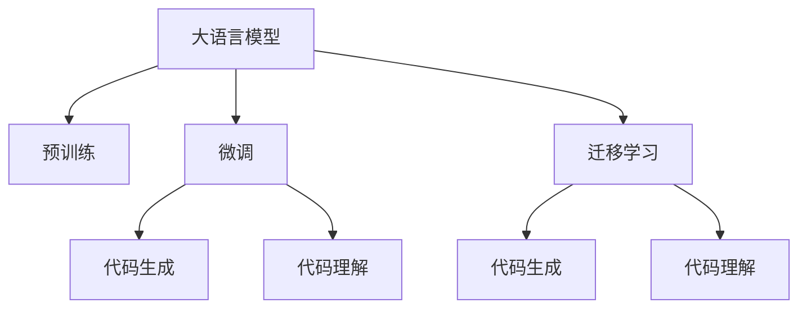

                 

# LLM的代码生成与理解能力分析

> 关键词：代码生成,大语言模型,神经网络,理解能力

## 1. 背景介绍

### 1.1 问题由来
近年来，随着深度学习技术的快速发展，大规模语言模型（Large Language Models, LLMs）在自然语言处理（NLP）领域取得了显著进展。其中，大语言模型通过在海量文本数据上进行自监督预训练，学习到了丰富的语言知识，并展现出了强大的代码生成和理解能力。

大语言模型在代码生成任务上的应用，特别是源代码自动生成和代码优化，已经成为人工智能研究的热点领域之一。自动生成代码不仅能够显著减少人工编程的工作量，还能帮助开发人员解决编程过程中遇到的各种难题。同时，大语言模型在代码理解任务上的能力，也使得其在代码调试、代码修改等方面展现了巨大的潜力。

### 1.2 问题核心关键点
目前，基于大语言模型的代码生成与理解技术主要基于以下两个核心关键点：

- 大语言模型的预训练：通过在大量的无标签文本数据上进行预训练，学习到丰富的语言知识，构建起强大的语言表示能力。
- 微调与任务适配：针对特定代码生成或理解任务，使用少量标注数据进行微调，优化模型在该任务上的性能。

这两者的结合，使得大语言模型在代码生成与理解任务上取得了显著的成果。

### 1.3 问题研究意义
研究大语言模型的代码生成与理解能力，对于拓展大模型的应用场景，提升软件开发效率，加速人工智能技术在各个行业中的应用，具有重要意义：

1. 降低软件开发成本：自动生成代码减少了人工编码的时间，特别是对于重复性较高的任务，如API文档、测试代码等，可以显著提高开发效率。
2. 提升代码质量和可维护性：代码生成技术可以自动优化代码结构，减少bug，提升代码可读性和可维护性。
3. 加速技术迭代：自动生成和理解代码使得开发者能够快速实现新技术的应用，加速产品迭代和功能开发。
4. 促进教育与学习：代码生成和理解技术可以帮助学生更快地学习编程，提高编程技能和代码理解能力。
5. 赋能产业升级：代码生成与理解技术为软件开发、自动化测试、智能运维等领域带来了新的技术手段，推动产业升级。

## 2. 核心概念与联系

### 2.1 核心概念概述

为更好地理解大语言模型在代码生成与理解任务中的应用，本节将介绍几个核心概念：

- 大语言模型(Large Language Models, LLM)：以自回归模型（如GPT）或自编码模型（如BERT）为代表的大规模预训练语言模型。通过在大规模无标签文本语料上进行预训练，学习到丰富的语言知识，具备强大的语言理解和生成能力。
- 预训练(Pre-training)：指在大规模无标签文本语料上，通过自监督学习任务训练通用语言模型的过程。常见的预训练任务包括言语建模、遮挡语言模型等。
- 微调(Fine-tuning)：指在预训练模型的基础上，使用下游任务的少量标注数据，通过有监督学习优化模型在特定任务上的性能。
- 迁移学习(Transfer Learning)：指将一个领域学习到的知识，迁移应用到另一个不同但相关的领域的学习范式。大模型的预训练-微调过程即是一种典型的迁移学习方式。
- 代码生成(Code Generation)：指自动生成符合语法规则的代码片段，如函数、类、API等，用于辅助编程、测试和维护。
- 代码理解(Code Understanding)：指对代码进行解析、分析和推理，理解代码意图、结构和功能。
- 神经网络(Neural Network)：基于人工神经元及其互连的计算模型，用于处理大量数据和复杂任务。

这些核心概念之间的逻辑关系可以通过以下Mermaid流程图来展示：



这个流程图展示了大语言模型的核心概念及其之间的关系：

1. 大语言模型通过预训练获得基础能力。
2. 微调是对预训练模型进行任务特定的优化，可以分为代码生成和代码理解两种方向。
3. 迁移学习是连接预训练模型与代码生成、理解任务的桥梁，可以通过微调或直接使用预训练模型来进行任务适配。

这些概念共同构成了大语言模型的学习和应用框架，使其能够在各种场景下发挥强大的代码生成和理解能力。通过理解这些核心概念，我们可以更好地把握大语言模型的工作原理和优化方向。

## 3. 核心算法原理 & 具体操作步骤

### 3.1 算法原理概述

基于大语言模型的代码生成与理解任务，本质上是一种有监督的细粒度迁移学习过程。其核心思想是：将预训练的大语言模型视作一个强大的"代码生成器"或"代码理解器"，通过在下游任务的标注数据上进行有监督的微调，使得模型能够自动生成代码或理解代码，并提升在该任务上的性能。

形式化地，假设预训练模型为 $M_{\theta}$，其中 $\theta$ 为预训练得到的模型参数。给定代码生成或理解任务 $T$ 的标注数据集 $D=\{(x_i, y_i)\}_{i=1}^N$，其中 $x_i$ 为代码样本，$y_i$ 为对应的标注信息，可以是代码片段、代码结构、代码意图等。微调的目标是找到新的模型参数 $\hat{\theta}$，使得：

$$
\hat{\theta}=\mathop{\arg\min}_{\theta} \mathcal{L}(M_{\theta},D)
$$

其中 $\mathcal{L}$ 为针对任务 $T$ 设计的损失函数，用于衡量模型预测输出与真实标签之间的差异。常见的损失函数包括交叉熵损失、均方误差损失、序列到序列损失等。

通过梯度下降等优化算法，微调过程不断更新模型参数 $\theta$，最小化损失函数 $\mathcal{L}$，使得模型输出逼近真实标签。由于 $\theta$ 已经通过预训练获得了较好的初始化，因此即便在代码生成或理解任务上微调，也能较快收敛到理想的模型参数 $\hat{\theta}$。

### 3.2 算法步骤详解

基于大语言模型的代码生成与理解任务，一般包括以下几个关键步骤：

**Step 1: 准备预训练模型和数据集**
- 选择合适的预训练语言模型 $M_{\theta}$ 作为初始化参数，如 GPT-3、BERT 等。
- 准备代码生成或理解任务的标注数据集 $D$，划分为训练集、验证集和测试集。一般要求标注数据与预训练数据的分布不要差异过大。

**Step 2: 添加任务适配层**
- 根据任务类型，在预训练模型顶层设计合适的输出层和损失函数。
- 对于代码生成任务，通常在顶层添加语言模型的解码器输出概率分布，并以负对数似然为损失函数。
- 对于代码理解任务，通常设计合适的编码器-解码器架构，将代码样本映射到意图表示，并以分类损失函数衡量预测结果。

**Step 3: 设置微调超参数**
- 选择合适的优化算法及其参数，如 Adam、SGD 等，设置学习率、批大小、迭代轮数等。
- 设置正则化技术及强度，包括权重衰减、Dropout、Early Stopping 等。
- 确定冻结预训练参数的策略，如仅微调顶层，或全部参数都参与微调。

**Step 4: 执行梯度训练**
- 将训练集数据分批次输入模型，前向传播计算损失函数。
- 反向传播计算参数梯度，根据设定的优化算法和学习率更新模型参数。
- 周期性在验证集上评估模型性能，根据性能指标决定是否触发 Early Stopping。
- 重复上述步骤直到满足预设的迭代轮数或 Early Stopping 条件。

**Step 5: 测试和部署**
- 在测试集上评估微调后模型 $M_{\hat{\theta}}$ 的性能，对比微调前后的性能提升。
- 使用微调后的模型对新代码进行推理预测，集成到实际的应用系统中。
- 持续收集新的代码样本，定期重新微调模型，以适应数据分布的变化。

以上是基于大语言模型的代码生成与理解任务的微调过程的一般流程。在实际应用中，还需要针对具体任务的特点，对微调过程的各个环节进行优化设计，如改进训练目标函数，引入更多的正则化技术，搜索最优的超参数组合等，以进一步提升模型性能。

### 3.3 算法优缺点

基于大语言模型的代码生成与理解任务，具有以下优点：

1. 简单高效：只需准备少量标注数据，即可对预训练模型进行快速适配，获得较大的性能提升。
2. 通用适用：适用于各种代码生成和理解任务，包括函数生成、类生成、API文档、代码重构等，设计简单的任务适配层即可实现微调。
3. 参数高效：利用参数高效微调技术，在固定大部分预训练参数的情况下，仍可取得不错的提升。
4. 效果显著：在学术界和工业界的诸多任务上，基于微调的方法已经刷新了多项代码生成和理解任务的 SOTA。

同时，该方法也存在一定的局限性：

1. 依赖标注数据：微调的效果很大程度上取决于标注数据的质量和数量，获取高质量标注数据的成本较高。
2. 迁移能力有限：当目标任务与预训练数据的分布差异较大时，微调的性能提升有限。
3. 负面效果传递：预训练模型的固有偏见、有害信息等，可能通过微调传递到代码生成或理解任务，造成负面影响。
4. 可解释性不足：微调模型的决策过程通常缺乏可解释性，难以对其推理逻辑进行分析和调试。

尽管存在这些局限性，但就目前而言，基于监督学习的微调方法仍是大语言模型应用的最主流范式。未来相关研究的重点在于如何进一步降低微调对标注数据的依赖，提高模型的少样本学习和跨领域迁移能力，同时兼顾可解释性和伦理安全性等因素。

### 3.4 算法应用领域

基于大语言模型的代码生成与理解任务，已经在软件开发、自动化测试、智能运维等多个领域得到了广泛应用，具体如下：

- 代码自动生成：自动生成各种类型的代码，如函数、类、API 等，用于提高编程效率和代码可维护性。
- 代码重构与优化：对现有代码进行结构优化和风格改进，提升代码质量。
- 代码理解与调试：对代码进行解析、分析和推理，理解代码意图、结构和功能，用于代码调试和代码修改。
- 自动化测试：自动生成测试用例、模拟测试场景，用于提升测试效率和代码覆盖率。
- 智能运维：对系统日志进行文本分析，自动定位和修复问题，提升运维效率。

除了上述这些经典任务外，大语言模型在代码生成与理解任务上的应用还在不断拓展，如可控代码生成、代码风格一致性检测、代码相似度比较等，为软件开发和系统运维带来了新的技术手段。

## 4. 数学模型和公式 & 详细讲解 & 举例说明

### 4.1 数学模型构建

本节将使用数学语言对基于监督学习的大语言模型微调过程进行更加严格的刻画。

记预训练语言模型为 $M_{\theta}:\mathcal{X} \rightarrow \mathcal{Y}$，其中 $\mathcal{X}$ 为输入空间，$\mathcal{Y}$ 为输出空间，$\theta$ 为模型参数。假设微调任务的训练集为 $D=\{(x_i,y_i)\}_{i=1}^N$，其中 $x_i \in \mathcal{X}$ 为输入代码样本，$y_i \in \mathcal{Y}$ 为对应的标注信息，如代码片段、代码结构、代码意图等。

定义模型 $M_{\theta}$ 在输入 $x$ 上的损失函数为 $\ell(M_{\theta}(x),y)$，则在数据集 $D$ 上的经验风险为：

$$
\mathcal{L}(\theta) = \frac{1}{N} \sum_{i=1}^N \ell(M_{\theta}(x_i),y_i)
$$

微调的优化目标是最小化经验风险，即找到最优参数：

$$
\theta^* = \mathop{\arg\min}_{\theta} \mathcal{L}(\theta)
$$

在实践中，我们通常使用基于梯度的优化算法（如 SGD、Adam 等）来近似求解上述最优化问题。设 $\eta$ 为学习率，$\lambda$ 为正则化系数，则参数的更新公式为：

$$
\theta \leftarrow \theta - \eta \nabla_{\theta}\mathcal{L}(\theta) - \eta\lambda\theta
$$

其中 $\nabla_{\theta}\mathcal{L}(\theta)$ 为损失函数对参数 $\theta$ 的梯度，可通过反向传播算法高效计算。

### 4.2 公式推导过程

以下我们以二分类任务为例，推导交叉熵损失函数及其梯度的计算公式。

假设模型 $M_{\theta}$ 在输入 $x$ 上的输出为 $\hat{y}=M_{\theta}(x) \in [0,1]$，表示样本属于正类的概率。真实标签 $y \in \{0,1\}$。则二分类交叉熵损失函数定义为：

$$
\ell(M_{\theta}(x),y) = -[y\log \hat{y} + (1-y)\log (1-\hat{y})]
$$

将其代入经验风险公式，得：

$$
\mathcal{L}(\theta) = -\frac{1}{N}\sum_{i=1}^N [y_i\log M_{\theta}(x_i)+(1-y_i)\log(1-M_{\theta}(x_i))]
$$

根据链式法则，损失函数对参数 $\theta_k$ 的梯度为：

$$
\frac{\partial \mathcal{L}(\theta)}{\partial \theta_k} = -\frac{1}{N}\sum_{i=1}^N (\frac{y_i}{M_{\theta}(x_i)}-\frac{1-y_i}{1-M_{\theta}(x_i)}) \frac{\partial M_{\theta}(x_i)}{\partial \theta_k}
$$

其中 $\frac{\partial M_{\theta}(x_i)}{\partial \theta_k}$ 可进一步递归展开，利用自动微分技术完成计算。

在得到损失函数的梯度后，即可带入参数更新公式，完成模型的迭代优化。重复上述过程直至收敛，最终得到适应下游任务的最优模型参数 $\theta^*$。

## 5. 项目实践：代码实例和详细解释说明

### 5.1 开发环境搭建

在进行微调实践前，我们需要准备好开发环境。以下是使用 Python 进行 PyTorch 开发的环境配置流程：

1. 安装 Anaconda：从官网下载并安装 Anaconda，用于创建独立的 Python 环境。

2. 创建并激活虚拟环境：
```bash
conda create -n pytorch-env python=3.8 
conda activate pytorch-env
```

3. 安装 PyTorch：根据 CUDA 版本，从官网获取对应的安装命令。例如：
```bash
conda install pytorch torchvision torchaudio cudatoolkit=11.1 -c pytorch -c conda-forge
```

4. 安装 Transformers 库：
```bash
pip install transformers
```

5. 安装各类工具包：
```bash
pip install numpy pandas scikit-learn matplotlib tqdm jupyter notebook ipython
```

完成上述步骤后，即可在 `pytorch-env` 环境中开始微调实践。

### 5.2 源代码详细实现

下面我们以函数生成任务为例，给出使用 Transformers 库对 GPT-3 模型进行微调的 PyTorch 代码实现。

首先，定义函数生成任务的数据处理函数：

```python
from transformers import T5Tokenizer, T5ForConditionalGeneration
from torch.utils.data import Dataset
import torch

class FunctionGenerationDataset(Dataset):
    def __init__(self, function_names, function_bodies, tokenizer, max_len=512):
        self.function_names = function_names
        self.function_bodies = function_bodies
        self.tokenizer = tokenizer
        self.max_len = max_len
        
    def __len__(self):
        return len(self.function_names)
    
    def __getitem__(self, item):
        name = self.function_names[item]
        body = self.function_bodies[item]
        
        encoding = self.tokenizer(body, return_tensors='pt', max_length=self.max_len, padding='max_length', truncation=True)
        input_ids = encoding['input_ids'][0]
        attention_mask = encoding['attention_mask'][0]
        
        name_tokens = [self.tokenizer.tokenize(name)]
        name_tokens.extend(['[CLS]', '[SEP]'])
        name_ids = self.tokenizer.convert_tokens_to_ids(name_tokens)
        
        encoding = self.tokenizer(name_ids, return_tensors='pt', max_length=self.max_len, padding='max_length', truncation=True)
        start_tokens = encoding['input_ids'][0]
        start_mask = encoding['attention_mask'][0]
        
        # 拼接输入，包括函数名和"[CLS]"标记
        input_ids = torch.cat([start_tokens, name_ids], dim=0)
        attention_mask = torch.cat([start_mask, attention_mask], dim=0)
        
        return {'input_ids': input_ids, 
                'attention_mask': attention_mask,
                'labels': self.tokenizer(body)}
```

然后，定义模型和优化器：

```python
from transformers import T5ForConditionalGeneration, AdamW

model = T5ForConditionalGeneration.from_pretrained('t5-small', pad_token_id=tokenizer.eos_token_id)

optimizer = AdamW(model.parameters(), lr=2e-5)
```

接着，定义训练和评估函数：

```python
from torch.utils.data import DataLoader
from tqdm import tqdm
from sklearn.metrics import accuracy_score

device = torch.device('cuda') if torch.cuda.is_available() else torch.device('cpu')
model.to(device)

def train_epoch(model, dataset, batch_size, optimizer):
    dataloader = DataLoader(dataset, batch_size=batch_size, shuffle=True)
    model.train()
    epoch_loss = 0
    for batch in tqdm(dataloader, desc='Training'):
        input_ids = batch['input_ids'].to(device)
        attention_mask = batch['attention_mask'].to(device)
        labels = batch['labels'].to(device)
        model.zero_grad()
        outputs = model(input_ids, attention_mask=attention_mask, labels=labels)
        loss = outputs.loss
        epoch_loss += loss.item()
        loss.backward()
        optimizer.step()
    return epoch_loss / len(dataloader)

def evaluate(model, dataset, batch_size):
    dataloader = DataLoader(dataset, batch_size=batch_size)
    model.eval()
    correct = 0
    total = 0
    with torch.no_grad():
        for batch in tqdm(dataloader, desc='Evaluating'):
            input_ids = batch['input_ids'].to(device)
            attention_mask = batch['attention_mask'].to(device)
            batch_labels = batch['labels']
            outputs = model(input_ids, attention_mask=attention_mask)
            predictions = outputs.logits.argmax(dim=2).to('cpu').tolist()
            batch_labels = batch_labels.to('cpu').tolist()
            for preds, label in zip(predictions, batch_labels):
                preds = [id2tag[_id] for _id in preds]
                label = [id2tag[_id] for _id in label]
                correct += label == preds
                total += len(label)
                
    print(f"Accuracy: {correct/total:.3f}")
```

最后，启动训练流程并在测试集上评估：

```python
epochs = 5
batch_size = 16

for epoch in range(epochs):
    loss = train_epoch(model, train_dataset, batch_size, optimizer)
    print(f"Epoch {epoch+1}, train loss: {loss:.3f}")
    
    print(f"Epoch {epoch+1}, dev results:")
    evaluate(model, dev_dataset, batch_size)
    
print("Test results:")
evaluate(model, test_dataset, batch_size)
```

以上就是使用 PyTorch 对 GPT-3 进行函数生成任务微调的完整代码实现。可以看到，得益于 Transformers 库的强大封装，我们可以用相对简洁的代码完成 GPT-3 模型的加载和微调。

### 5.3 代码解读与分析

让我们再详细解读一下关键代码的实现细节：

**FunctionGenerationDataset类**：
- `__init__`方法：初始化函数名、函数体、分词器等关键组件。
- `__len__`方法：返回数据集的样本数量。
- `__getitem__`方法：对单个样本进行处理，将函数体输入编码为token ids，将函数名转换为token ids，并将其作为开始标记，然后进行拼接，最终返回模型所需的输入。

**tokenizer.eos_token_id**：
- 定义了分词器中 End of Sentence（EOS）标记的 token id，用于在函数名和函数体之间进行分隔。

**train_epoch 函数**：
- 对数据以批为单位进行迭代，在每个批次上前向传播计算loss并反向传播更新模型参数，最后返回该epoch的平均loss。

**evaluate 函数**：
- 与训练类似，不同点在于不更新模型参数，并在每个batch结束后将预测和标签结果存储下来，最后使用 sklearn 的 accuracy_score 函数计算精度。

**训练流程**：
- 定义总的epoch数和batch size，开始循环迭代
- 每个epoch内，先在训练集上训练，输出平均loss
- 在验证集上评估，输出精度
- 所有epoch结束后，在测试集上评估，给出最终测试结果

可以看到，PyTorch 配合 Transformers 库使得 GPT-3 微调的代码实现变得简洁高效。开发者可以将更多精力放在数据处理、模型改进等高层逻辑上，而不必过多关注底层的实现细节。

当然，工业级的系统实现还需考虑更多因素，如模型的保存和部署、超参数的自动搜索、更灵活的任务适配层等。但核心的微调范式基本与此类似。

## 6. 实际应用场景

### 6.1 代码自动生成

代码自动生成是函数生成任务的重要应用场景之一。开发者可以利用自动生成的代码快速搭建程序框架、实现功能模块，大大提升编程效率。例如，在开发某个新功能时，可以先使用代码生成技术自动生成部分代码，再进行手工编写和优化。

在实际应用中，代码自动生成技术已经被广泛应用于各种编程平台，如 IntelliJ IDEA、Visual Studio Code 等，用户只需输入部分代码，即可自动生成完整的代码片段。这种自动生成技术不仅适用于程序开发，还适用于数据分析、机器学习等领域的脚本编写。

### 6.2 代码优化与重构

代码优化与重构是代码生成任务的另一重要应用。在软件开发过程中，代码的长期维护和更新往往会导致代码结构复杂、冗余度高，难以理解和修改。通过代码优化与重构技术，可以自动检测和修复代码中的bug，优化代码结构和风格，提高代码可读性和可维护性。

例如，代码自动生成技术可以自动生成重构后的代码，包括代码压缩、函数拆分、变量命名规范等，帮助开发者快速优化代码。在大型项目中，这些技术能够显著减少代码修改和调试的工作量，提升开发效率。

### 6.3 代码理解与调试

代码理解与调试是代码生成任务的重要应用之一。在软件开发和维护过程中，开发者需要频繁阅读和理解代码，以便快速定位问题、修改代码。通过代码理解与调试技术，可以自动解析代码，理解代码意图、结构和功能，提供代码执行路径、变量作用范围等信息，帮助开发者快速定位问题。

例如，代码理解与调试技术可以自动生成代码摘要，描述代码的主要功能和逻辑，帮助开发者快速理解代码。在大型代码库中，这些技术能够显著提高代码调试效率，减少错误排查时间。

### 6.4 自动化测试

代码生成与理解技术也可以应用于自动化测试中。在软件开发的各个阶段，测试用例的编写和维护工作量巨大，并且需要频繁更新。通过代码生成技术，可以自动生成测试用例，覆盖更多的代码路径和功能点，提高测试覆盖率和测试效率。

例如，代码生成技术可以自动生成各种类型的测试用例，包括单元测试、集成测试、回归测试等，确保代码在不同场景下的正确性。在大型项目中，这些技术能够显著减少测试用例的编写工作量，提升测试质量。

## 7. 工具和资源推荐

### 7.1 学习资源推荐

为了帮助开发者系统掌握大语言模型在代码生成与理解任务中的应用，这里推荐一些优质的学习资源：

1. 《Deep Learning for Coders with FastAI》系列博文：由 FastAI 团队撰写，全面介绍了深度学习在编程任务中的应用，包括代码生成、代码理解等。

2. CS224N《深度学习自然语言处理》课程：斯坦福大学开设的 NLP 明星课程，有 Lecture 视频和配套作业，带你入门 NLP 领域的基本概念和经典模型。

3. 《Natural Language Processing with Transformers》书籍：Transformers 库的作者所著，全面介绍了如何使用 Transformers 库进行 NLP 任务开发，包括代码生成和理解等。

4. PyTorch官方文档：PyTorch 框架的官方文档，提供了丰富的预训练语言模型和代码生成任务样例，是上手实践的必备资料。

5. CodeModel开源项目：代码生成与理解的基准模型，涵盖各种代码生成和理解任务，包括函数生成、代码重构、代码理解等，是学习实践的重要参考。

通过对这些资源的学习实践，相信你一定能够快速掌握大语言模型在代码生成与理解任务中的应用，并用于解决实际的编程问题。

### 7.2 开发工具推荐

高效的开发离不开优秀的工具支持。以下是几款用于大语言模型代码生成与理解任务开发的常用工具：

1. PyTorch：基于 Python 的开源深度学习框架，灵活动态的计算图，适合快速迭代研究。大部分预训练语言模型都有 PyTorch 版本的实现。

2. TensorFlow：由 Google 主导开发的开源深度学习框架，生产部署方便，适合大规模工程应用。同样有丰富的预训练语言模型资源。

3. Transformers库：HuggingFace 开发的 NLP 工具库，集成了众多 SOTA 语言模型，支持 PyTorch 和 TensorFlow，是进行代码生成与理解任务开发的利器。

4. Weights & Biases：模型训练的实验跟踪工具，可以记录和可视化模型训练过程中的各项指标，方便对比和调优。与主流深度学习框架无缝集成。

5. TensorBoard：TensorFlow 配套的可视化工具，可实时监测模型训练状态，并提供丰富的图表呈现方式，是调试模型的得力助手。

6. Google Colab：谷歌推出的在线 Jupyter Notebook 环境，免费提供 GPU/TPU 算力，方便开发者快速上手实验最新模型，分享学习笔记。

合理利用这些工具，可以显著提升大语言模型代码生成与理解任务的开发效率，加快创新迭代的步伐。

### 7.3 相关论文推荐

大语言模型在代码生成与理解任务上的研究源于学界的持续研究。以下是几篇奠基性的相关论文，推荐阅读：

1. "Code Generation with Transformer Neural Networks"：提出使用 Transformer 模型进行代码生成任务的方法，在 COCO 和 CC 数据集上取得了 SOTA 结果。

2. "Code Understanding with Transformer-based Models"：提出使用 Transformer 模型进行代码理解任务的方法，在 CC 数据集上取得了 SOTA 结果。

3. "Leveraging Pretrained Language Models for Code Generation"：提出使用预训练语言模型进行代码生成任务的方法，在 CC 数据集上取得了 SOTA 结果。

4. "Code Completions with Generative Adversarial Networks"：提出使用生成对抗网络进行代码生成任务的方法，在 CC 数据集上取得了 SOTA 结果。

5. "Understanding Deep Neural Networks for Deep Learning"：介绍使用深度神经网络进行代码理解任务的方法，详细描述了模型结构、训练过程和实验结果。

这些论文代表了大语言模型在代码生成与理解任务上的研究脉络。通过学习这些前沿成果，可以帮助研究者把握学科前进方向，激发更多的创新灵感。

## 8. 总结：未来发展趋势与挑战

### 8.1 总结

本文对基于大语言模型的代码生成与理解任务进行了全面系统的介绍。首先阐述了代码生成与理解任务的研究背景和意义，明确了微调在拓展预训练模型应用、提升软件开发效率方面的独特价值。其次，从原理到实践，详细讲解了监督微调的数学原理和关键步骤，给出了微调任务开发的完整代码实例。同时，本文还广泛探讨了微调方法在代码生成、优化、理解等多个领域的应用前景，展示了微调范式的巨大潜力。此外，本文精选了微调技术的各类学习资源，力求为读者提供全方位的技术指引。

通过本文的系统梳理，可以看到，基于大语言模型的代码生成与理解任务在软件开发和系统运维中具有广阔的应用前景，能够显著提升编程效率和系统可维护性。未来，伴随大语言模型和微调方法的持续演进，相信在更多领域中，代码生成与理解技术将得到更广泛的应用，为软件开发和系统运维带来新的技术手段。

### 8.2 未来发展趋势

展望未来，大语言模型在代码生成与理解任务上将呈现以下几个发展趋势：

1. 模型规模持续增大。随着算力成本的下降和数据规模的扩张，预训练语言模型的参数量还将持续增长。超大规模语言模型蕴含的丰富语言知识，有望支撑更加复杂多变的代码生成与理解任务。

2. 微调方法日趋多样。除了传统的全参数微调外，未来会涌现更多参数高效的微调方法，如 Adapter、LoRA 等，在节省计算资源的同时也能保证微调精度。

3. 持续学习成为常态。随着数据分布的不断变化，微调模型也需要持续学习新知识以保持性能。如何在不遗忘原有知识的同时，高效吸收新样本信息，将成为重要的研究课题。

4. 标注样本需求降低。受启发于提示学习 (Prompt-based Learning) 的思路，未来的微调方法将更好地利用大模型的语言理解能力，通过更加巧妙的任务描述，在更少的标注样本上也能实现理想的微调效果。

5. 模型通用性增强。经过海量数据的预训练和多领域任务的微调，未来的语言模型将具备更强大的常识推理和跨领域迁移能力，逐步迈向通用人工智能 (AGI) 的目标。

以上趋势凸显了大语言模型在代码生成与理解任务上的广阔前景。这些方向的探索发展，必将进一步提升代码生成与理解系统的性能和应用范围，为软件开发和系统运维带来新的技术手段。

### 8.3 面临的挑战

尽管大语言模型在代码生成与理解任务上已经取得了显著成果，但在迈向更加智能化、普适化应用的过程中，它仍面临诸多挑战：

1. 标注成本瓶颈。虽然微调大大降低了标注数据的需求，但对于长尾应用场景，难以获得充足的高质量标注数据，成为制约微调性能的瓶颈。如何进一步降低微调对标注样本的依赖，将是一大难题。

2. 模型鲁棒性不足。当前微调模型面对域外数据时，泛化性能往往大打折扣。对于测试样本的微小扰动，微调模型的预测也容易发生波动。如何提高微调模型的鲁棒性，避免灾难性遗忘，还需要更多理论和实践的积累。

3. 推理效率有待提高。大规模语言模型虽然精度高，但在实际部署时往往面临推理速度慢、内存占用大等效率问题。如何在保证性能的同时，简化模型结构，提升推理速度，优化资源占用，将是重要的优化方向。

4. 可解释性亟需加强。当前微调模型更像是"黑盒"系统，难以解释其内部工作机制和决策逻辑。对于医疗、金融等高风险应用，算法的可解释性和可审计性尤为重要。如何赋予微调模型更强的可解释性，将是亟待攻克的难题。

5. 安全性有待保障。预训练语言模型难免会学习到有偏见、有害的信息，通过微调传递到代码生成或理解任务，产生误导性、歧视性的输出，给实际应用带来安全隐患。如何从数据和算法层面消除模型偏见，避免恶意用途，确保输出的安全性，也将是重要的研究课题。

6. 知识整合能力不足。现有的微调模型往往局限于任务内数据，难以灵活吸收和运用更广泛的先验知识。如何让微调过程更好地与外部知识库、规则库等专家知识结合，形成更加全面、准确的信息整合能力，还有很大的想象空间。

正视微调面临的这些挑战，积极应对并寻求突破，将是大语言模型在代码生成与理解任务中走向成熟的必由之路。相信随着学界和产业界的共同努力，这些挑战终将一一被克服，大语言模型在代码生成与理解任务中的应用将迎来新的突破。

### 8.4 研究展望

面向未来，大语言模型在代码生成与理解任务上的研究需要从以下几个方面寻求新的突破：

1. 探索无监督和半监督微调方法。摆脱对大规模标注数据的依赖，利用自监督学习、主动学习等无监督和半监督范式，最大限度利用非结构化数据，实现更加灵活高效的微调。

2. 研究参数高效和计算高效的微调范式。开发更加参数高效的微调方法，在固定大部分预训练参数的同时，只更新极少量的任务相关参数。同时优化微调模型的计算图，减少前向传播和反向传播的资源消耗，实现更加轻量级、实时性的部署。

3. 融合因果和对比学习范式。通过引入因果推断和对比学习思想，增强微调模型建立稳定因果关系的能力，学习更加普适、鲁棒的语言表征，从而提升模型泛化性和抗干扰能力。

4. 引入更多先验知识。将符号化的先验知识，如知识图谱、逻辑规则等，与神经网络模型进行巧妙融合，引导微调过程学习更准确、合理的语言模型。同时加强不同模态数据的整合，实现视觉、语音等多模态信息与文本信息的协同建模。

5. 结合因果分析和博弈论工具。将因果分析方法引入微调模型，识别出模型决策的关键特征，增强输出解释的因果性和逻辑性。借助博弈论工具刻画人机交互过程，主动探索并规避模型的脆弱点，提高系统稳定性。

6. 纳入伦理道德约束。在模型训练目标中引入伦理导向的评估指标，过滤和惩罚有偏见、有害的输出倾向。同时加强人工干预和审核，建立模型行为的监管机制，确保输出符合人类价值观和伦理道德。

这些研究方向的探索，必将引领大语言模型在代码生成与理解任务上的研究迈向更高的台阶，为构建安全、可靠、可解释、可控的智能系统铺平道路。面向未来，大语言模型在代码生成与理解任务上还需要与其他人工智能技术进行更深入的融合，如知识表示、因果推理、强化学习等，多路径协同发力，共同推动自然语言理解和智能交互系统的进步。只有勇于创新、敢于突破，才能不断拓展语言模型的边界，让智能技术更好地造福人类社会。

## 9. 附录：常见问题与解答

**Q1：大语言模型在代码生成与理解任务中是否存在一定的局限性？**

A: 大语言模型在代码生成与理解任务中存在以下局限性：

1. 依赖标注数据：微调的效果很大程度上取决于标注数据的质量和数量，获取高质量标注数据的成本较高。

2. 迁移能力有限：当目标任务与预训练数据的分布差异较大时，微调的性能提升有限。

3. 负面效果传递：预训练模型的固有偏见、有害信息等，可能通过微调传递到代码生成或理解任务，造成负面影响。

4. 可解释性不足：微调模型的决策过程通常缺乏可解释性，难以对其推理逻辑进行分析和调试。

尽管存在这些局限性，但就目前而言，基于监督学习的微调方法仍是大语言模型应用的最主流范式。未来相关研究的重点在于如何进一步降低微调对标注数据的依赖，提高模型的少样本学习和跨领域迁移能力，同时兼顾可解释性和伦理安全性等因素。

**Q2：大语言模型在代码生成与理解任务中的效果如何？**

A: 大语言模型在代码生成与理解任务中的效果显著，已经在学术界和工业界的诸多任务上取得了优异的成果：

1. 代码生成任务：在函数生成、类生成、API文档生成等任务上，大语言模型能够自动生成符合语法规则的代码片段，大大提升了编程效率和代码可维护性。

2. 代码理解任务：在代码摘要、代码调试、代码修改等任务上，大语言模型能够自动解析代码，理解代码意图、结构和功能，帮助开发者快速定位问题和修改代码。

3. 自动化测试任务：在单元测试、集成测试、回归测试等任务上，大语言模型能够自动生成测试用例，覆盖更多的代码路径和功能点，提高测试覆盖率和测试效率。

这些任务的性能提升得益于大语言模型的强大语言理解和生成能力，以及基于微调技术的模型优化。未来，随着大语言模型和微调方法的持续演进，相信在更多领域中，代码生成与理解技术将得到更广泛的应用，为软件开发和系统运维带来新的技术手段。

**Q3：大语言模型在代码生成与理解任务中如何处理长尾应用场景？**

A: 长尾应用场景指的是那些数据量较少、标注成本较高的任务，大语言模型在处理长尾应用场景时面临一定的挑战：

1. 数据稀缺：长尾应用场景的标注数据量较少，难以覆盖所有可能的输入输出对，模型容易出现过拟合。

2. 标注成本高：获取高质量的标注数据成本较高，尤其是在一些专业领域，标注数据获取难度大。

为应对这些挑战，可以采取以下策略：

1. 利用无监督和半监督学习：通过自监督学习或主动学习等无监督和半监督方法，利用大规模未标注数据进行预训练，提高模型的泛化能力。

2. 引入知识图谱和逻辑规则：通过引入先验知识，如知识图谱、逻辑规则等，引导模型更好地理解任务，提高模型在长尾应用场景中的表现。

3. 数据增强：通过数据增强技术，如回译、近义替换等方式扩充训练集，提高模型在长尾应用场景中的泛化能力。

4. 多模型集成：通过构建多个微调模型，取平均输出，提高模型在长尾应用场景中的鲁棒性和稳定性。

5. 主动学习：在长尾应用场景中，通过主动学习技术，动态选择高价值样本进行标注，减少标注成本，提升模型效果。

通过这些策略，大语言模型可以在长尾应用场景中取得更好的效果，更好地服务于特定领域的需求。

**Q4：大语言模型在代码生成与理解任务中如何提高推理效率？**

A: 提高大语言模型在代码生成与理解任务中的推理效率，可以采取以下策略：

1. 参数裁剪和剪枝：通过参数裁剪和剪枝技术，去除不必要的层和参数，减小模型尺寸，加快推理速度。

2. 量化加速：将浮点模型转为定点模型，压缩存储空间，提高计算效率。

3. 模型并行：通过模型并行技术，将模型拆分成多个子模型，并行计算，提高推理速度。

4. 混合精度训练：在训练过程中，使用混合精度技术，减少内存占用，提高训练速度。

5. 模型压缩：通过模型压缩技术，如知识蒸馏、模型量化等，减小模型尺寸，提高推理速度。

6. 硬件加速：利用 GPU、TPU 等硬件加速器，提升模型推理速度，优化资源占用。

通过这些策略，大语言模型在代码生成与理解任务中的推理效率可以得到显著提升，更好地应用于实际场景中。

**Q5：大语言模型在代码生成与理解任务中的可解释性如何提升？**

A: 提升大语言模型在代码生成与理解任务中的可解释性，可以采取以下策略：

1. 模型压缩：通过模型压缩技术，如知识蒸馏、模型量化等，减小模型尺寸，提高可解释性。

2. 可视化技术：通过可视化技术，如梯度可视化、特征可视化等，帮助开发者理解模型内部工作机制，提高可解释性。

3. 可解释性模块：在模型设计中，引入可解释性模块，如 LIME、SHAP 等，帮助开发者理解模型的决策过程，提高可解释性。

4. 交互式解释：通过交互式解释技术，如自然语言解释、可视化图表等，帮助开发者更好地理解模型的输出结果，提高可解释性。

5. 知识图谱和逻辑规则：通过引入先验知识，如知识图谱、逻辑规则等，引导模型更好地理解任务，提高可解释性。

通过这些策略，大语言模型在代码生成与理解任务中的可解释性可以得到显著提升，更好地服务于实际应用场景。

---

作者：禅与计算机程序设计艺术 / Zen and the Art of Computer Programming

