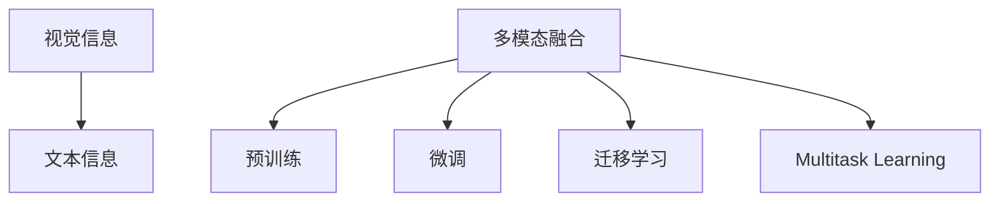

                 

# LLM的多模态融合：视觉与语言的结合

## 1. 背景介绍

### 1.1 问题由来

随着深度学习技术的不断进步，大语言模型（Large Language Models, LLMs）在自然语言处理（Natural Language Processing, NLP）领域取得了突破性的进展。然而，LLMs通常仅专注于处理文本数据，而对于包含大量视觉信息的场景，如智能辅助、医疗影像分析、自动驾驶等，LLMs显得力不从心。

为了克服这一问题，多模态学习（Multimodal Learning）应运而生。多模态学习通过将视觉、文本等多种信息源整合在一起，提高模型的理解和推理能力，使其能够在更复杂的应用场景中发挥作用。本文将重点探讨多模态融合技术，特别是视觉和语言结合的LMLs（Large Multimodal Models）。

### 1.2 问题核心关键点

- **多模态融合（Multimodal Fusion）**：指将视觉、语言等多种模态信息整合到同一模型中，提高模型的综合理解能力。
- **视觉-语言（Visual-Language）结合**：通过将视觉输入（如图像、视频）与语言输入（如描述、对话）结合，提高模型对场景的全面理解。
- **预训练与微调（Pretraining & Fine-tuning）**：在预训练阶段学习通用知识，在微调阶段针对特定任务进行优化，以提升模型的性能。
- **迁移学习（Transfer Learning）**：利用预训练模型在其他模态数据上的知识，进行迁移学习，提高模型的泛化能力。

## 2. 核心概念与联系

### 2.1 核心概念概述

为了更好地理解多模态融合的原理和应用，我们将介绍几个核心概念：

- **多模态学习（Multimodal Learning）**：涉及处理和整合多种模态信息，如文本、视觉、听觉等，以提高模型的综合理解能力。
- **视觉-语言模型（Visual-Language Model）**：一种将视觉与语言信息融合的模型，能够理解和生成包含视觉信息的文本描述。
- **预训练与微调（Pretraining & Fine-tuning）**：在预训练阶段学习通用知识，在微调阶段针对特定任务进行优化，以提升模型的性能。
- **迁移学习（Transfer Learning）**：利用预训练模型在其他模态数据上的知识，进行迁移学习，提高模型的泛化能力。
- **多任务学习（Multitask Learning）**：同时训练多个相关任务，共享底层特征，提高模型的通用性和泛化能力。

这些核心概念共同构成了多模态融合的框架，使得LMLs能够处理更加复杂和多样化的场景。

### 2.2 核心概念联系

以下是一个简单的Mermaid流程图，展示了多模态融合中各核心概念的联系：



这个流程图展示了多模态融合的主要流程：将视觉信息和文本信息融合，在预训练阶段学习通用知识，在微调阶段针对特定任务进行优化，并利用迁移学习和多任务学习提高模型的泛化能力。

## 3. 核心算法原理 & 具体操作步骤

### 3.1 算法原理概述

多模态融合的算法原理基于深度学习模型的架构和训练过程。通过引入视觉-语言模型，将视觉信息和文本信息编码到同一空间中，进行信息交互和融合。预训练阶段通过大规模数据学习通用知识，微调阶段针对特定任务进行优化，迁移学习则利用预训练模型在其他模态数据上的知识，进行跨模态的知识迁移。

### 3.2 算法步骤详解

以下详细解释多模态融合的具体步骤：

**Step 1: 预训练阶段**

1. **数据准备**：收集大量的视觉-语言对数据集，如ImageNet+MSCOCO、COCO-CAPTCHA等。
2. **模型选择**：选择适合的多模态模型，如CLIP、ViLT、DALL-E等。
3. **编码与融合**：将视觉信息和文本信息分别编码到同一空间中，进行信息交互和融合。
4. **预训练目标**：使用多模态联合训练任务，如自监督的图像-文本匹配任务，学习视觉和语言的联合表示。

**Step 2: 微调阶段**

1. **任务适配**：根据具体应用场景，选择适当的多模态任务，如视觉-语言问答、图像描述生成等。
2. **数据准备**：收集任务相关的标注数据，如问题-图像对、问题-描述对等。
3. **模型微调**：在预训练模型的基础上，使用标注数据进行微调，优化模型的性能。
4. **验证与评估**：在验证集上评估微调后的模型，选择最优模型进行部署。

**Step 3: 迁移学习**

1. **预训练模型选择**：选择预训练模型，如ViLT、CLIP等。
2. **数据集选择**：选择适合的数据集，如ImageNet、MSCOCO等。
3. **微调与迁移**：在预训练模型的基础上，针对特定任务进行微调，利用迁移学习提高泛化能力。
4. **评估与优化**：在测试集上评估模型的性能，根据需要进行优化。

### 3.3 算法优缺点

多模态融合具有以下优点：

- **泛化能力强**：通过将多种模态信息融合，提高了模型的泛化能力和适应性。
- **性能提升显著**：多模态融合能够显著提高模型在特定任务上的性能。
- **灵活性高**：适用于多种应用场景，如医疗影像分析、自动驾驶等。

同时，也存在一些缺点：

- **数据需求大**：需要大量的标注数据，获取成本较高。
- **计算资源消耗高**：多模态模型通常参数量较大，计算资源消耗高。
- **模型复杂度高**：模型结构复杂，训练和推理难度较大。

### 3.4 算法应用领域

多模态融合技术已经在多个领域得到了应用，包括但不限于：

- **智能辅助**：如智能问答、图像描述生成、图像搜索等。
- **医疗影像分析**：通过图像和文本结合，辅助医生进行疾病诊断和影像分析。
- **自动驾驶**：结合视觉、语言和雷达等信息，提高自动驾驶系统的理解和决策能力。
- **智能推荐**：结合视觉和文本信息，提升推荐系统的个性化和准确性。
- **虚拟助手**：通过视觉和语言信息，构建更智能、自然的交互界面。

## 4. 数学模型和公式 & 详细讲解 & 举例说明

### 4.1 数学模型构建

多模态融合的数学模型通常由两部分组成：视觉编码器和文本编码器。

假设输入为图像 $I$ 和文本描述 $T$，输出为多模态表示 $Z$。我们可以使用以下数学公式来表示这一过程：

$$
Z = f_v(I) + f_t(T)
$$

其中 $f_v$ 为视觉编码器，$f_t$ 为文本编码器，$+$ 表示元素相加。

### 4.2 公式推导过程

以CLIP模型为例，推导其联合训练过程。CLIP模型将视觉信息和文本信息分别编码为两个特征向量，然后将这两个向量相加得到多模态表示。假设输入图像 $I$ 和文本描述 $T$，输出为多模态表示 $Z$，CLIP模型的公式如下：

$$
Z = \mathcal{F}_v(I) + \mathcal{F}_t(T)
$$

其中 $\mathcal{F}_v$ 和 $\mathcal{F}_t$ 分别为视觉和文本编码器。

在预训练阶段，CLIP模型使用图像-文本匹配任务进行训练，目标是最小化以下损失函数：

$$
\mathcal{L} = \frac{1}{N}\sum_{i=1}^N (l_v(Z_i, I_i) + l_t(Z_i, T_i))
$$

其中 $l_v$ 和 $l_t$ 分别为视觉和文本编码器的损失函数，$N$ 为训练样本数。

在微调阶段，CLIP模型使用特定任务的数据进行微调，目标是最小化任务相关的损失函数。例如，在视觉-语言问答任务中，CLIP模型使用以下损失函数：

$$
\mathcal{L} = \frac{1}{N}\sum_{i=1}^N (l_v(Z_i, I_i) + l_t(Z_i, T_i) + l_q(Z_i, Q_i))
$$

其中 $l_q$ 为问答任务的损失函数。

### 4.3 案例分析与讲解

以ImageNet+MSCOCO数据集为例，展示CLIP模型在视觉-语言联合训练中的表现。

1. **数据准备**：收集ImageNet和MSCOCO数据集，其中ImageNet包含1000个类别的图像，MSCOCO包含多个类别的图像和文本描述。
2. **模型选择**：选择CLIP模型，包括视觉编码器和文本编码器。
3. **预训练过程**：使用图像-文本匹配任务进行训练，最小化联合损失函数。
4. **微调过程**：在特定任务（如视觉-语言问答）上进行微调，最小化任务相关的损失函数。
5. **评估与优化**：在验证集上评估微调后的模型，根据需要进行优化。

## 5. 项目实践：代码实例和详细解释说明

### 5.1 开发环境搭建

要进行多模态融合的实践，需要搭建一个包含深度学习框架、数据集和工具的开发环境。以下是一个示例环境的搭建步骤：

1. **安装深度学习框架**：安装PyTorch或TensorFlow等深度学习框架。
2. **下载数据集**：下载ImageNet、MSCOCO等数据集。
3. **安装依赖包**：安装相关的依赖包，如Pillow、tqdm等。
4. **搭建模型结构**：搭建CLIP模型，包含视觉编码器和文本编码器。
5. **配置训练环境**：配置GPU/TPU等计算资源。

### 5.2 源代码详细实现

以下是一个简单的CLIP模型的Python代码实现，展示了视觉和文本编码器的构建和联合训练过程：

```python
import torch
from transformers import CLIPModel, CLIPTextModel, CLIPVisionModel

# 构建视觉编码器
vision_encoder = CLIPVisionModel.from_pretrained('clip-vit-large-patch14')

# 构建文本编码器
text_encoder = CLIPTextModel.from_pretrained('clip-vit-large-patch14')

# 构建CLIP模型
clip_model = CLIPModel(vision_encoder, text_encoder)

# 加载数据集
train_dataset = ImageNetDataset()
val_dataset = ImageNetDataset()

# 定义训练过程
optimizer = AdamW(clip_model.parameters(), lr=1e-4)
scheduler = get_linear_schedule_with_warmup(optimizer, num_warmup_steps=1000, num_training_steps=num_train_epochs)

for epoch in range(num_train_epochs):
    for batch in train_dataset:
        inputs = batch
        outputs = clip_model(inputs)
        loss = outputs.loss
        loss.backward()
        optimizer.step()
        scheduler.step()

# 定义验证过程
for batch in val_dataset:
    inputs = batch
    outputs = clip_model(inputs)
    loss = outputs.loss
    print(f"Validation Loss: {loss}")
```

### 5.3 代码解读与分析

上述代码展示了CLIP模型在ImageNet数据集上的联合训练过程。具体分析如下：

- **数据准备**：使用ImageNet数据集，包含大量图像和标注信息。
- **模型选择**：使用预训练的CLIP模型，包含视觉编码器和文本编码器。
- **训练过程**：使用AdamW优化器进行优化，使用线性学习率调度器。
- **验证过程**：在验证集上评估模型性能，输出验证损失。

## 6. 实际应用场景

### 6.1 智能辅助

智能助理通过视觉和语言的结合，可以更好地理解用户的意图和需求，提供更智能的对话和查询服务。例如，智能助理可以通过图像识别技术识别用户的场景，结合自然语言处理技术，生成相关回答和建议。

### 6.2 医疗影像分析

医疗影像分析领域，视觉和语言的结合可以提高诊断的准确性和效率。通过图像识别技术，医生可以更快速地识别影像中的异常区域，结合自然语言处理技术，生成相关诊断报告和治疗建议。

### 6.3 自动驾驶

自动驾驶领域，视觉和语言的结合可以提高车辆的理解和决策能力。通过摄像头和雷达获取视觉信息，结合自然语言处理技术，车辆可以更好地理解路标、交通信号等，进行智能驾驶。

### 6.4 未来应用展望

未来，多模态融合技术将在更多领域得到应用，为智能系统带来更全面的感知和理解能力。例如：

- **智能家居**：通过视觉和语言结合，智能家居可以更好地理解用户的指令，提供个性化的服务和建议。
- **智能客服**：通过视觉和语言结合，智能客服可以更好地理解用户的表情和语调，提供更自然的对话体验。
- **智能安防**：通过视觉和语言结合，智能安防系统可以更好地理解监控视频内容，提供更高效的警报和分析。

## 7. 工具和资源推荐

### 7.1 学习资源推荐

为了帮助开发者系统掌握多模态融合的理论基础和实践技巧，这里推荐一些优质的学习资源：

1. **《多模态学习综述》（JMLR 2021）**：提供了多模态学习领域的最新研究成果和前沿技术。
2. **《深度学习中的多模态学习》（Deep Learning with Multi-Modal Data）**：由知名AI专家撰写，系统介绍了多模态学习的基本概念和应用场景。
3. **Transformers官方文档**：提供了多模态模型的详细使用指南和样例代码。
4. **COCO数据集**：包含大量视觉-语言对数据集，用于多模态模型的训练和评估。
5. **CLIP官方代码库**：提供了CLIP模型的详细实现和训练过程。

通过对这些资源的学习实践，相信你一定能够快速掌握多模态融合的精髓，并用于解决实际的NLP问题。

### 7.2 开发工具推荐

多模态融合的开发需要多个工具和框架的支持，以下是一些推荐的工具：

1. **PyTorch**：一个灵活的深度学习框架，适合多模态模型的开发和训练。
2. **TensorFlow**：一个强大的深度学习框架，支持多模态模型的训练和推理。
3. **Transformers**：提供了多模态模型的实现和训练支持。
4. **Pillow**：一个Python图像处理库，支持多模态模型中图像的加载和处理。
5. **HuggingFace**：提供了多模态模型的预训练和微调支持。

合理利用这些工具，可以显著提升多模态融合任务的开发效率，加快创新迭代的步伐。

### 7.3 相关论文推荐

多模态融合领域的研究不断涌现，以下是几篇经典论文，推荐阅读：

1. **CLIP: A Simple Framework for General-purpose Visual-Language Understanding**：提出了CLIP模型，将视觉和语言信息融合，在多个任务上取得了优异的性能。
2. **Visual Question Answering with Multimodal BERT Pretraining**：提出了ViLT模型，将视觉和语言信息结合，用于视觉-语言问答任务。
3. **Attention is All You Need for Multimodal Image Captioning**：提出了DALL-E模型，用于图像描述生成任务，将视觉和语言信息结合。
4. **Natural Language Understanding by Joint Training of Text and Multimodal Tasks**：提出了XLNet模型，通过联合训练文本和图像任务，提高了模型的泛化能力。
5. **Cross-modal Multitask Learning for Visual-Language Recognition**：提出了跨模态多任务学习的方法，用于视觉-语言识别任务。

这些论文代表了大语言模型多模态融合的发展脉络，通过学习这些前沿成果，可以帮助研究者把握学科前进方向，激发更多的创新灵感。

## 8. 总结：未来发展趋势与挑战

### 8.1 研究成果总结

多模态融合技术在近年来取得了显著进展，通过将视觉和语言信息结合，提高了模型的理解和生成能力。这一技术已经在多个领域得到了应用，展示了其广阔的应用前景。

### 8.2 未来发展趋势

未来，多模态融合技术将在更多领域得到应用，为智能系统带来更全面的感知和理解能力。以下是几个可能的发展趋势：

1. **更高效的多模态模型**：通过优化模型结构，减少计算资源消耗，提高模型的推理速度和效率。
2. **更广泛的数据集**：收集更多元、更复杂的多模态数据集，提高模型的泛化能力和适应性。
3. **更强的迁移学习能力**：通过迁移学习，将多模态模型的知识迁移到其他模态数据上，提高模型的跨领域适应能力。
4. **更好的交互体验**：通过视觉和语言的结合，提高智能系统的交互体验，使其更加自然、智能。
5. **更深入的领域应用**：多模态融合技术将在更多领域得到应用，如医疗、自动驾驶、智能家居等。

### 8.3 面临的挑战

虽然多模态融合技术已经取得了显著进展，但在推广应用的过程中仍面临诸多挑战：

1. **数据获取困难**：多模态数据集难以获取，尤其是高质量、大规模的标注数据。
2. **模型复杂度高**：多模态模型通常参数量较大，计算资源消耗高。
3. **算法复杂度高**：多模态融合的算法复杂度高，需要更多的理论研究和实践验证。
4. **跨模态对齐困难**：不同模态的数据格式和表示方式不同，难以直接对齐。
5. **模型泛化能力不足**：多模态模型在特定领域或任务上的泛化能力仍需进一步提升。

### 8.4 研究展望

为了克服上述挑战，未来的研究需要在以下几个方面寻求新的突破：

1. **数据增强与生成**：通过数据增强和生成技术，提高多模态数据集的丰富性和多样性。
2. **跨模态对齐方法**：研究跨模态对齐方法，提高不同模态数据之间的表示一致性。
3. **模型压缩与优化**：通过模型压缩和优化技术，降低多模态模型的计算资源消耗。
4. **多任务学习与迁移学习**：结合多任务学习和迁移学习，提高多模态模型的泛化能力和跨领域适应能力。
5. **跨模态推理与理解**：研究跨模态推理与理解方法，提高多模态模型的理解能力和决策能力。

这些研究方向的探索，必将引领多模态融合技术迈向更高的台阶，为构建智能系统提供更强大的技术支持。

## 9. 附录：常见问题与解答

**Q1: 多模态融合技术的难点是什么？**

A: 多模态融合技术的难点在于跨模态对齐和数据获取。不同模态的数据格式和表示方式不同，难以直接对齐。同时，高质量、大规模的标注数据难以获取，增加了模型训练的难度。

**Q2: 如何提高多模态模型的泛化能力？**

A: 提高多模态模型的泛化能力，可以从以下几个方面入手：

1. **数据增强**：通过数据增强技术，提高数据集的多样性和丰富性。
2. **跨模态对齐**：研究跨模态对齐方法，提高不同模态数据之间的表示一致性。
3. **多任务学习**：结合多任务学习，提高模型的通用性和泛化能力。
4. **迁移学习**：利用预训练模型在其他模态数据上的知识，进行跨模态的知识迁移。

**Q3: 多模态融合技术有哪些应用场景？**

A: 多模态融合技术已经在多个领域得到了应用，包括但不限于：

1. **智能辅助**：如智能问答、图像描述生成、图像搜索等。
2. **医疗影像分析**：通过图像和文本结合，辅助医生进行疾病诊断和影像分析。
3. **自动驾驶**：结合视觉、语言和雷达等信息，提高自动驾驶系统的理解和决策能力。
4. **智能推荐**：结合视觉和文本信息，提升推荐系统的个性化和准确性。
5. **虚拟助手**：通过视觉和语言结合，构建更智能、自然的交互界面。

通过本文的系统梳理，可以看到，多模态融合技术正在成为智能系统的重要范式，极大地拓展了模型在复杂场景中的应用边界。随着技术的不断发展，多模态融合技术必将在更多领域大放异彩，深刻影响人类的生产生活方式。

---

作者：禅与计算机程序设计艺术 / Zen and the Art of Computer Programming

