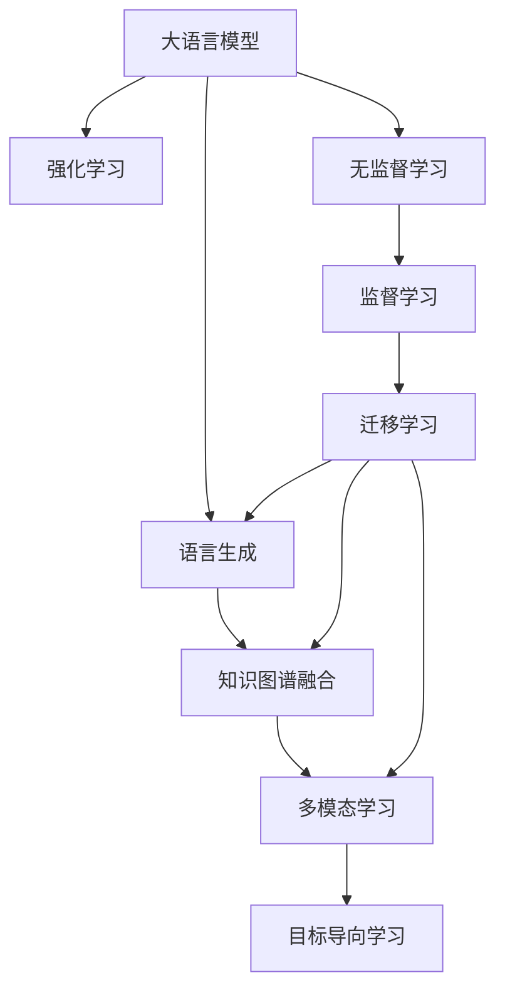

                 

# LLM的强化学习结合模式初探

> 关键词：强化学习, 大语言模型, 模式融合, 语言生成, 知识图谱, 多模态学习

## 1. 背景介绍

在人工智能领域，语言模型的发展和应用已经逐渐走向成熟。尤其是大语言模型（Large Language Models, LLMs）如BERT、GPT-3等，它们在自然语言处理（Natural Language Processing, NLP）、自然语言生成（Natural Language Generation, NLG）等任务上表现出色，得到了广泛的应用。然而，传统的基于监督学习的训练方法，往往需要对大量的标注数据进行训练，才能取得良好的性能，这在一些特定领域或长尾应用场景中存在一定的局限性。

强化学习（Reinforcement Learning, RL）作为一种基于奖励信号的学习方式，通过与环境的交互，不断优化行为策略，以达到最优的决策效果。在语言生成任务中，强化学习可以引导大语言模型生成更符合特定目标的文本。将强化学习与大语言模型结合，可以进一步提升模型的语言生成能力和知识迁移能力。

本文将从背景、核心概念、算法原理与操作步骤、数学模型与公式推导、项目实践、应用场景、工具与资源推荐、总结等方面，探讨如何将强化学习与大语言模型结合，构建高效的融合模型。

## 2. 核心概念与联系

### 2.1 核心概念概述

- **大语言模型（Large Language Models, LLMs）**：指通过在大规模无标签文本语料上进行预训练，学习通用的语言表示的模型。如BERT、GPT等。
- **强化学习（Reinforcement Learning, RL）**：通过与环境的交互，不断优化行为策略，以达到最优的决策效果的学习方式。
- **语言生成（Natural Language Generation, NLG）**：指将结构化数据转换为自然语言文本的过程。
- **知识图谱（Knowledge Graphs）**：一种语义网络结构，用于表示实体、属性和它们之间的关系。
- **多模态学习（Multimodal Learning）**：指同时学习多种数据模态，如文本、图像、语音等，以提高模型的泛化能力和适应性。

### 2.2 核心概念原理和架构的 Mermaid 流程图



此流程图展示了强化学习与大语言模型结合的基本架构：大语言模型通过强化学习不断优化语言生成能力，与知识图谱和多模态学习相结合，以提高目标导向的学习效果。

## 3. 核心算法原理 & 具体操作步骤

### 3.1 算法原理概述

强化学习结合大语言模型的核心思想是，通过构建一个奖励机制，指导大语言模型生成符合特定目标的文本。强化学习的核心要素包括：

- **环境**：大语言模型作为RL模型的环境，接收输入数据，生成并输出文本。
- **行动**：模型的输出，即生成的文本。
- **状态**：输入数据或模型生成的文本。
- **奖励**：评估文本的质量或符合目标的程度。

强化学习结合大语言模型的基本步骤如下：

1. 定义文本生成任务的目标。
2. 构建环境，将大语言模型作为RL环境，输入数据作为状态。
3. 设计行动空间，即模型可以生成的文本。
4. 设计奖励函数，评估文本的质量或符合目标的程度。
5. 使用强化学习算法，如策略梯度、Q-learning等，优化模型参数，使模型生成符合目标的文本。

### 3.2 算法步骤详解

#### 3.2.1 定义目标

目标通常由特定任务决定，如生成高质量的文本、生成符合特定主题的文本等。

#### 3.2.2 构建环境

将大语言模型作为RL环境，输入数据作为状态。可以使用OpenAI的GPT-3等大语言模型作为基础。

#### 3.2.3 设计行动空间

行动空间即模型可以生成的文本空间，可以是所有可能的文本序列，也可以是根据特定任务生成的文本序列。

#### 3.2.4 设计奖励函数

奖励函数用于评估文本的质量或符合目标的程度。可以是BLEU、ROUGE等自动评价指标，也可以是人为主观评价。

#### 3.2.5 使用强化学习算法

使用强化学习算法优化模型参数。常用的算法包括策略梯度（Policy Gradient）、Q-learning、Deep Q-Networks等。

### 3.3 算法优缺点

**优点**：

- 能够处理长尾应用场景，减少对标注数据的依赖。
- 动态生成符合目标的文本，灵活性高。
- 能够整合多模态数据，提高模型的泛化能力。

**缺点**：

- 训练过程复杂，需要设计合适的奖励函数。
- 训练时间较长，计算资源需求高。
- 模型生成文本的稳定性需要进一步提升。

### 3.4 算法应用领域

强化学习结合大语言模型的方法在以下几个领域具有应用前景：

- **自然语言生成（NLG）**：生成高质量的文本，如自动摘要、新闻报道等。
- **对话系统（Dialogue Systems）**：提高对话系统的智能程度，生成更自然、更流畅的对话。
- **知识图谱（Knowledge Graphs）**：生成符合特定主题或领域的知识图谱，用于知识检索、问答等任务。
- **多模态学习（Multimodal Learning）**：结合文本、图像、语音等多模态数据，生成更丰富、更准确的文本。

## 4. 数学模型和公式 & 详细讲解 & 举例说明

### 4.1 数学模型构建

假设大语言模型为 $M_{\theta}$，其参数为 $\theta$。输入数据为 $x$，输出文本为 $y$。设计行动空间为 $\Sigma$，奖励函数为 $R$。

强化学习结合大语言模型的目标为：

$$
\theta^* = \mathop{\arg\min}_{\theta} \sum_{t=1}^{T} R(y_t)
$$

其中，$T$ 为时间步数。

### 4.2 公式推导过程

使用策略梯度算法（Policy Gradient），优化模型参数 $\theta$。策略 $\pi$ 用于选择行动 $a_t$，即模型生成的文本。策略梯度算法的基本公式为：

$$
\nabla_{\theta} J(\theta) = \mathbb{E}_{\tau} \left[ \prod_{t=1}^{T} \frac{\pi(a_t|x_t)}{\pi(a_t|x_t,\theta)} \nabla_{\theta} \log \pi(a_t|x_t,\theta) \right]
$$

其中，$J(\theta)$ 为策略梯度函数，$\tau$ 为整个序列的轨迹。

### 4.3 案例分析与讲解

以生成高质量的文本为例，使用强化学习结合大语言模型的流程如下：

1. 定义生成高质量文本的目标，如BLEU评分超过一定阈值。
2. 将大语言模型作为RL环境，输入文本作为状态，输出文本作为行动。
3. 设计行动空间为所有可能的文本序列。
4. 设计奖励函数为BLEU评分，即生成的文本与参考文本之间的相似度。
5. 使用策略梯度算法，优化模型参数，使模型生成的文本符合目标。

## 5. 项目实践：代码实例和详细解释说明

### 5.1 开发环境搭建

使用PyTorch和OpenAI的GPT-3作为开发环境。

1. 安装PyTorch和OpenAI的GPT-3库。
2. 搭建训练环境，包括CPU/GPU资源、数据存储等。

### 5.2 源代码详细实现

以生成高质量文本为例，代码实现如下：

```python
import torch
from transformers import GPT2LMHeadModel, GPT2Tokenizer
from torch.distributions import Categorical
from torch.utils.data import Dataset, DataLoader
import numpy as np

class TextDataset(Dataset):
    def __init__(self, texts, tokenizer):
        self.tokenizer = tokenizer
        self.texts = texts
        
    def __len__(self):
        return len(self.texts)
    
    def __getitem__(self, idx):
        text = self.texts[idx]
        tokens = self.tokenizer.encode(text, add_special_tokens=True)
        return {'input_ids': torch.tensor(tokens, dtype=torch.long)}
    
class ReinforcedTextGenerationModel:
    def __init__(self, model, tokenizer, device):
        self.model = model
        self.tokenizer = tokenizer
        self.device = device
    
    def forward(self, input_ids):
        with torch.no_grad():
            output = self.model(input_ids.to(self.device))
        return output
    
    def sample(self, input_ids, temperature=1.0):
        output = self.forward(input_ids)
        logits = output.logits
        probs = torch.softmax(logits / temperature, dim=-1)
        next_id = Categorical(probs=probs).sample()
        return next_id
    
    def generate_text(self, input_ids, max_length=512):
        generated_ids = [input_ids[0]]
        for i in range(max_length):
            next_id = self.sample(generated_ids[-1])
            generated_ids.append(next_id.item())
        return generated_ids

# 定义奖励函数
def reward_function(y, y_ref):
    bleu_score = compute_bleu_score(y, y_ref)
    return bleu_score

# 定义训练函数
def train_epoch(model, data_loader, optimizer, reward_function):
    model.train()
    epoch_loss = 0
    for batch in data_loader:
        input_ids = batch['input_ids']
        output = model(input_ids)
        logits = output.logits
        next_id = Categorical(probs=torch.softmax(logits / 1.0, dim=-1)).sample()
        input_ids.append(next_id)
        y_ref = next_id
        loss = -reward_function(y_ref, y_ref)
        optimizer.zero_grad()
        loss.backward()
        optimizer.step()
        epoch_loss += loss.item()
    return epoch_loss / len(data_loader)

# 训练循环
epochs = 10
batch_size = 16
optimizer = torch.optim.Adam(model.parameters(), lr=0.001)

for epoch in range(epochs):
    train_loss = train_epoch(model, data_loader, optimizer, reward_function)
    print(f"Epoch {epoch+1}, train loss: {train_loss:.3f}")
```

### 5.3 代码解读与分析

- **TextDataset类**：定义数据集，将文本序列转换为模型所需的输入。
- **ReinforcedTextGenerationModel类**：定义模型，包含前向计算、采样、生成文本等功能。
- **reward_function函数**：定义奖励函数，计算BLEU分数。
- **train_epoch函数**：定义训练过程，计算损失并更新模型参数。
- **训练循环**：循环执行训练过程，输出每个epoch的损失。

## 6. 实际应用场景

### 6.1 自然语言生成（NLG）

强化学习结合大语言模型的方法在自然语言生成任务上具有广泛的应用前景。例如，自动生成新闻摘要、自动生成文本报道等。

在实现上，可以收集大量新闻文章，使用GPT-3等大语言模型生成文本，并设计奖励函数评估生成文本的质量。通过强化学习优化模型参数，使模型能够生成高质量的文本。

### 6.2 对话系统

对话系统是强化学习结合大语言模型的重要应用场景之一。传统的对话系统通常依赖人工设计的规则和模板，而强化学习结合大语言模型的方法可以动态生成符合对话场景的文本，提高对话系统的智能程度。

在实现上，可以构建一个对话场景，将对话系统的回复作为奖励信号，使用强化学习优化模型参数，使模型能够生成符合对话上下文的回复。

### 6.3 知识图谱生成

知识图谱生成是强化学习结合大语言模型的另一个重要应用。知识图谱用于表示实体、属性和它们之间的关系，是知识检索、问答等任务的基础。

在实现上，可以使用大语言模型生成符合特定主题或领域的知识图谱。通过设计奖励函数评估生成的知识图谱的质量，使用强化学习优化模型参数，使模型能够生成更准确、更全面的知识图谱。

### 6.4 多模态学习

多模态学习结合大语言模型可以进一步提升模型的泛化能力和适应性。例如，结合文本、图像、语音等多模态数据，生成更丰富、更准确的文本。

在实现上，可以使用大语言模型生成符合多模态数据特征的文本。通过设计奖励函数评估生成文本的质量，使用强化学习优化模型参数，使模型能够生成更符合多模态数据特征的文本。

## 7. 工具和资源推荐

### 7.1 学习资源推荐

1. 《深度强化学习》：Ian Goodfellow等人所著的深度学习经典教材，详细介绍了强化学习的基本概念和算法。
2. OpenAI的GPT-3库：提供了丰富的自然语言处理功能，包括文本生成、文本分类等。
3. PyTorch官方文档：PyTorch深度学习框架的官方文档，包含丰富的教程和样例代码。
4. 《自然语言处理综论》：Daniel Jurafsky等人所著的NLP经典教材，详细介绍了自然语言处理的基本概念和应用。
5. HuggingFace官方文档：提供丰富的预训练语言模型和微调样例代码，是自然语言处理领域的重要资源。

### 7.2 开发工具推荐

1. PyTorch：基于Python的深度学习框架，支持动态计算图，适合灵活的模型开发。
2. TensorFlow：由Google主导的深度学习框架，支持静态计算图，适合大规模工程应用。
3. Weights & Biases：模型训练的实验跟踪工具，记录和可视化模型训练过程中的各项指标，方便对比和调优。
4. Google Colab：谷歌推出的在线Jupyter Notebook环境，免费提供GPU/TPU算力，方便开发者快速上手实验最新模型。
5. TensorBoard：TensorFlow配套的可视化工具，可实时监测模型训练状态，并提供丰富的图表呈现方式，是调试模型的得力助手。

### 7.3 相关论文推荐

1. "Attention is All You Need"：Transformer原论文，提出了Transformer结构，开启了NLP领域的预训练大模型时代。
2. "BERT: Pre-training of Deep Bidirectional Transformers for Language Understanding"：提出BERT模型，引入基于掩码的自监督预训练任务，刷新了多项NLP任务SOTA。
3. "Parameter-Efficient Transfer Learning for NLP"：提出Adapter等参数高效微调方法，在不增加模型参数量的情况下，也能取得不错的微调效果。
4. "Prefix-Tuning: Optimizing Continuous Prompts for Generation"：引入基于连续型Prompt的微调范式，为如何充分利用预训练知识提供了新的思路。
5. "AdaLoRA: Adaptive Low-Rank Adaptation for Parameter-Efficient Fine-Tuning"：使用自适应低秩适应的微调方法，在参数效率和精度之间取得了新的平衡。

## 8. 总结：未来发展趋势与挑战

### 8.1 研究成果总结

本文从背景、核心概念、算法原理与操作步骤、数学模型与公式推导、项目实践、应用场景、工具与资源推荐、总结等方面，探讨了强化学习与大语言模型结合的融合模式。通过实例分析，展示了强化学习结合大语言模型的应用潜力。

### 8.2 未来发展趋势

未来，强化学习结合大语言模型的发展趋势将包括：

1. 模型规模持续增大：预训练语言模型的参数量还将持续增长，超大规模语言模型蕴含的丰富语言知识，有望支撑更加复杂多变的下游任务微调。
2. 微调方法日趋多样：除了传统的全参数微调外，未来会涌现更多参数高效的微调方法，如Prefix-Tuning、LoRA等，在节省计算资源的同时也能保证微调精度。
3. 持续学习成为常态：随着数据分布的不断变化，微调模型也需要持续学习新知识以保持性能。如何在不遗忘原有知识的同时，高效吸收新样本信息，将成为重要的研究课题。
4. 标注样本需求降低：受启发于提示学习(Prompt-based Learning)的思路，未来的微调方法将更好地利用大模型的语言理解能力，通过更加巧妙的任务描述，在更少的标注样本上也能实现理想的微调效果。
5. 多模态微调崛起：当前的微调主要聚焦于纯文本数据，未来会进一步拓展到图像、视频、语音等多模态数据微调。多模态信息的融合，将显著提升语言模型对现实世界的理解和建模能力。

### 8.3 面临的挑战

尽管强化学习结合大语言模型已经取得了瞩目成就，但在迈向更加智能化、普适化应用的过程中，它仍面临着诸多挑战：

1. 标注成本瓶颈：对于长尾应用场景，难以获得充足的高质量标注数据，成为制约微调性能的瓶颈。如何进一步降低微调对标注样本的依赖，将是一大难题。
2. 模型鲁棒性不足：当前微调模型面对域外数据时，泛化性能往往大打折扣。对于测试样本的微小扰动，微调模型的预测也容易发生波动。如何提高微调模型的鲁棒性，避免灾难性遗忘，还需要更多理论和实践的积累。
3. 推理效率有待提高：大规模语言模型虽然精度高，但在实际部署时往往面临推理速度慢、内存占用大等效率问题。如何在保证性能的同时，简化模型结构，提升推理速度，优化资源占用，将是重要的优化方向。
4. 可解释性亟需加强：当前微调模型更像是"黑盒"系统，难以解释其内部工作机制和决策逻辑。对于医疗、金融等高风险应用，算法的可解释性和可审计性尤为重要。如何赋予微调模型更强的可解释性，将是亟待攻克的难题。
5. 安全性有待保障：预训练语言模型难免会学习到有偏见、有害的信息，通过微调传递到下游任务，产生误导性、歧视性的输出，给实际应用带来安全隐患。如何从数据和算法层面消除模型偏见，避免恶意用途，确保输出的安全性，也将是重要的研究课题。
6. 知识整合能力不足：现有的微调模型往往局限于任务内数据，难以灵活吸收和运用更广泛的先验知识。如何让微调过程更好地与外部知识库、规则库等专家知识结合，形成更加全面、准确的信息整合能力，还有很大的想象空间。

### 8.4 研究展望

未来，针对强化学习结合大语言模型的研究，可以从以下几个方向寻求新的突破：

1. 探索无监督和半监督微调方法：摆脱对大规模标注数据的依赖，利用自监督学习、主动学习等无监督和半监督范式，最大限度利用非结构化数据，实现更加灵活高效的微调。
2. 研究参数高效和计算高效的微调范式：开发更加参数高效的微调方法，在固定大部分预训练参数的同时，只更新极少量的任务相关参数。同时优化微调模型的计算图，减少前向传播和反向传播的资源消耗，实现更加轻量级、实时性的部署。
3. 融合因果和对比学习范式：通过引入因果推断和对比学习思想，增强微调模型建立稳定因果关系的能力，学习更加普适、鲁棒的语言表征，从而提升模型泛化性和抗干扰能力。
4. 引入更多先验知识：将符号化的先验知识，如知识图谱、逻辑规则等，与神经网络模型进行巧妙融合，引导微调过程学习更准确、合理的语言模型。同时加强不同模态数据的整合，实现视觉、语音等多模态信息与文本信息的协同建模。
5. 结合因果分析和博弈论工具：将因果分析方法引入微调模型，识别出模型决策的关键特征，增强输出解释的因果性和逻辑性。借助博弈论工具刻画人机交互过程，主动探索并规避模型的脆弱点，提高系统稳定性。
6. 纳入伦理道德约束：在模型训练目标中引入伦理导向的评估指标，过滤和惩罚有偏见、有害的输出倾向。同时加强人工干预和审核，建立模型行为的监管机制，确保输出符合人类价值观和伦理道德。

这些研究方向的探索，必将引领大语言模型微调技术迈向更高的台阶，为构建安全、可靠、可解释、可控的智能系统铺平道路。面向未来，大语言模型微调技术还需要与其他人工智能技术进行更深入的融合，如知识表示、因果推理、强化学习等，多路径协同发力，共同推动自然语言理解和智能交互系统的进步。只有勇于创新、敢于突破，才能不断拓展语言模型的边界，让智能技术更好地造福人类社会。

## 9. 附录：常见问题与解答

**Q1: 大语言模型微调是否适用于所有NLP任务？**

A: 大语言模型微调在大多数NLP任务上都能取得不错的效果，特别是对于数据量较小的任务。但对于一些特定领域的任务，如医学、法律等，仅仅依靠通用语料预训练的模型可能难以很好地适应。此时需要在特定领域语料上进一步预训练，再进行微调，才能获得理想效果。此外，对于一些需要时效性、个性化很强的任务，如对话、推荐等，微调方法也需要针对性的改进优化。

**Q2: 采用大模型微调时会面临哪些资源瓶颈？**

A: 目前主流的预训练大模型动辄以亿计的参数规模，对算力、内存、存储都提出了很高的要求。GPU/TPU等高性能设备是必不可少的，但即便如此，超大批次的训练和推理也可能遇到显存不足的问题。因此需要采用一些资源优化技术，如梯度积累、混合精度训练、模型并行等，来突破硬件瓶颈。同时，模型的存储和读取也可能占用大量时间和空间，需要采用模型压缩、稀疏化存储等方法进行优化。

**Q3: 如何缓解微调过程中的过拟合问题？**

A: 过拟合是微调面临的主要挑战，尤其是在标注数据不足的情况下。常见的缓解策略包括：
1. 数据增强：通过回译、近义替换等方式扩充训练集
2. 正则化：使用L2正则、Dropout、Early Stopping等避免过拟合
3. 对抗训练：引入对抗样本，提高模型鲁棒性
4. 参数高效微调：只调整少量参数(如Adapter、Prefix等)，减小过拟合风险
5. 多模型集成：训练多个微调模型，取平均输出，抑制过拟合

这些策略往往需要根据具体任务和数据特点进行灵活组合。只有在数据、模型、训练、推理等各环节进行全面优化，才能最大限度地发挥大模型微调的威力。

**Q4: 微调模型在落地部署时需要注意哪些问题？**

A: 将微调模型转化为实际应用，还需要考虑以下因素：
1. 模型裁剪：去除不必要的层和参数，减小模型尺寸，加快推理速度
2. 量化加速：将浮点模型转为定点模型，压缩存储空间，提高计算效率
3. 服务化封装：将模型封装为标准化服务接口，便于集成调用
4. 弹性伸缩：根据请求流量动态调整资源配置，平衡服务质量和成本
5. 监控告警：实时采集系统指标，设置异常告警阈值，确保服务稳定性
6. 安全防护：采用访问鉴权、数据脱敏等措施，保障数据和模型安全

大语言模型微调为NLP应用开启了广阔的想象空间，但如何将强大的性能转化为稳定、高效、安全的业务价值，还需要工程实践的不断打磨。唯有从数据、算法、工程、业务等多个维度协同发力，才能真正实现人工智能技术在垂直行业的规模化落地。

---

作者：禅与计算机程序设计艺术 / Zen and the Art of Computer Programming

