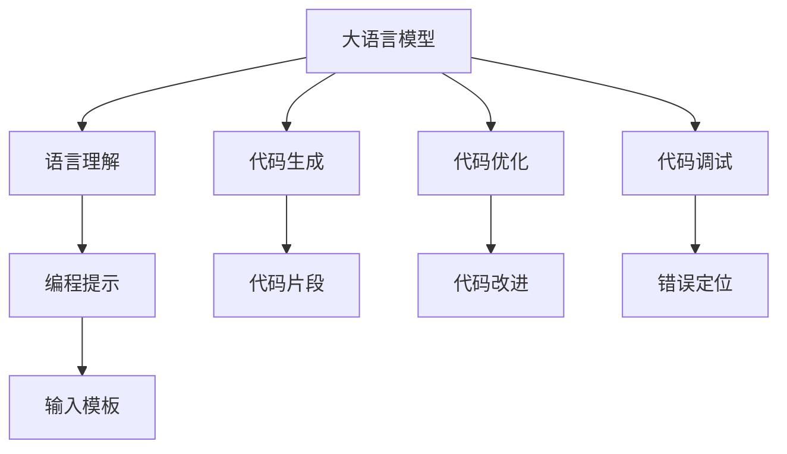

                 

# LLM的自动编程潜力与局限性

> 关键词：大语言模型,自动编程,语言理解,计算复杂度,模型泛化,生成代码,应用场景

## 1. 背景介绍

### 1.1 问题由来
近年来，大语言模型(Large Language Models, LLMs)，特别是基于Transformer结构的语言模型，在自然语言处理(Natural Language Processing, NLP)领域取得了显著的进展。通过在大规模无标签文本上进行的预训练，这些模型已经能够理解和生成自然语言，并在诸如文本分类、机器翻译、情感分析、问答系统等诸多NLP任务上取得了先进的性能。然而，这些模型主要是针对文本语料进行训练的，在编写和执行代码方面还没有展现出显著的自动编程能力。

大语言模型的自动编程潜力是指其通过自然语言理解和生成能力，在程序构建、代码优化、错误排查等过程中提供辅助或部分替代人工的编程工作。本文将探讨这种潜力的存在性以及当前的局限性，并分析其在不同应用场景下的表现，展望未来的发展趋势和面临的挑战。

### 1.2 问题核心关键点
本文聚焦于以下核心问题：

1. 大语言模型是否具备自动编程潜力？其原理是什么？
2. 自动编程在不同应用场景中的表现如何？
3. 自动编程在执行过程中存在哪些局限性？
4. 未来如何突破这些局限性，进一步提升大语言模型的自动编程能力？

## 2. 核心概念与联系

### 2.1 核心概念概述

为更好地理解大语言模型在自动编程中的潜力与局限性，本节将介绍几个密切相关的核心概念：

- 大语言模型(Large Language Model, LLM)：如GPT-3、BERT等，通过在大规模无标签文本上进行的预训练，学习通用的语言表示，具备强大的语言理解和生成能力。

- 自动编程(Automatic Programming)：指通过程序自动生成、优化和调试等过程，辅助或部分替代人工的编程工作，以提高开发效率和代码质量。

- 语言理解(Language Understanding)：大语言模型能够理解和解释自然语言输入，将其转化为计算机可执行的指令或代码片段。

- 代码生成(Code Generation)：大语言模型能够自动生成符合语法和语义的代码，或根据输入描述生成代码片段。

- 代码优化(Code Optimization)：基于对代码结构、性能和风格的分析，自动提出代码改进建议。

- 代码调试(Debugging)：利用自然语言描述的错误信息，自动定位和修复代码中的问题。

- 编程提示(Prompt)：在生成代码或解释指令时，通过设计合适的输入模板引导大语言模型生成期望的输出。

- 交叉模态学习(Cross-modal Learning)：大语言模型能够将自然语言与编程语言结合起来，形成跨模态的知识迁移和应用。

这些概念之间的逻辑关系可以通过以下Mermaid流程图来展示：



这个流程图展示了大语言模型在自动编程各个环节中的作用：

1. 语言理解：将自然语言输入转化为可执行指令。
2. 代码生成：根据指令自动生成代码片段。
3. 代码优化：自动改进代码结构和性能。
4. 代码调试：自动定位和修复代码错误。
5. 编程提示：通过模板引导生成期望输出。

## 3. 核心算法原理 & 具体操作步骤
### 3.1 算法原理概述

大语言模型的自动编程潜力主要依赖于其强大的语言理解和生成能力。具体来说，通过以下步骤实现自动编程：

1. 将编程任务描述为自然语言指令，输入大语言模型。
2. 大语言模型理解指令，并从中提取关键信息。
3. 基于指令生成相应的代码片段。
4. 对生成的代码进行优化、调试和解释，生成最终的程序或代码改进建议。

这种自动编程方法的核心在于将自然语言与编程语言结合起来，利用大语言模型的语义理解能力，生成符合要求的代码或代码片段。然而，这种潜力并不是无限的，存在一定的局限性。

### 3.2 算法步骤详解

#### 步骤1：将编程任务转化为自然语言指令
- 确定编程任务：例如编写一个函数、优化一个算法、调试一段代码等。
- 设计合适的指令模板，引导大语言模型理解任务需求和预期输出。

#### 步骤2：大语言模型的理解与生成
- 将指令输入大语言模型，模型通过分析指令内容，理解任务目标。
- 模型根据指令生成相应的代码片段，可能包括函数的定义、变量的声明、算法步骤等。

#### 步骤3：代码优化与调试
- 对生成的代码进行语法和语义检查，确保代码正确无误。
- 基于对代码的评估，自动提出改进建议，如优化性能、简化逻辑、修复错误等。
- 利用自然语言描述的错误信息，自动定位代码中的问题，并提供解决方案。

#### 步骤4：生成最终程序或代码片段
- 对优化后的代码进行最终检查，确保满足任务需求。
- 输出最终的代码或代码片段，供用户进一步修改或直接使用。

### 3.3 算法优缺点

自动编程利用大语言模型的语言理解和生成能力，具有以下优点：

1. 提高开发效率：自动生成和优化代码，减少人工编写和调试的时间。
2. 降低出错率：通过模型生成和优化代码，可以减少人工编码错误。
3. 扩展编程技能：不需要编程经验，任何人都可利用大语言模型进行编程。
4. 优化代码质量：自动提出代码改进建议，提高代码可读性和可维护性。

然而，自动编程也存在一些局限性：

1. 依赖高质量指令：自动编程的效果很大程度上取决于输入指令的质量和清晰度。
2. 缺乏通用性：不同的任务需要不同的指令模板，模板设计复杂且难以通用。
3. 泛化能力有限：大语言模型对特定领域或特定任务的处理能力较强，但对其他领域或任务可能效果不佳。
4. 可解释性不足：自动生成的代码难以解释其决策过程，存在“黑盒”问题。
5. 性能瓶颈：大语言模型的计算复杂度高，在处理大规模程序时效率较低。

### 3.4 算法应用领域

尽管存在上述局限性，自动编程仍在大语言模型中展现出一定的应用潜力。以下是一些主要的应用场景：

1. **代码生成与补全**：自动生成函数、类、模块等代码片段，辅助编程工作。
2. **算法优化与改进**：基于对算法性能的分析，自动提出改进建议。
3. **错误排查与修复**：利用自然语言描述的错误信息，自动定位和修复代码错误。
4. **代码重构与重写**：自动重构和重写代码，提升代码的可读性和可维护性。
5. **文档生成**：自动生成程序文档，解释代码逻辑和接口使用。
6. **版本管理与协同开发**：利用自然语言描述的变更记录，自动管理代码版本，辅助团队协同开发。

## 4. 数学模型和公式 & 详细讲解 & 举例说明

### 4.1 数学模型构建

在自动编程中，大语言模型主要通过自然语言理解生成代码片段。假设编程任务描述为 $D$，大语言模型为 $M$，则自动编程过程可以表示为：

- 指令提取：$x$：从指令 $D$ 中提取关键信息。
- 代码生成：$y$：根据提取的信息 $x$，生成代码片段 $y$。

数学上，我们可以将这个过程表示为一个映射：$y = M(x)$。

### 4.2 公式推导过程

以代码生成为例，我们假设大语言模型能够将自然语言指令转化为代码片段的概率分布 $P(Y|X)$，其中 $X$ 是输入的指令，$Y$ 是生成的代码片段。通过最大化 $P(Y|X)$，我们可以训练一个自动编程模型。

使用最大似然估计方法，我们可以写出目标函数：

$$
\mathcal{L} = -\frac{1}{N}\sum_{i=1}^N \log P(Y_i|X_i)
$$

其中 $Y_i$ 是训练集中的第 $i$ 个代码片段，$X_i$ 是对应的自然语言指令。

### 4.3 案例分析与讲解

假设有一个简单的任务，编写一个计算两个数之和的函数。自然语言指令为：“写一个函数，输入两个整数，输出它们的和。”

我们将这个指令输入大语言模型，模型理解并生成代码片段：

```python
def sum_numbers(a, b):
    return a + b
```

虽然代码片段语法和语义上正确，但并没有进行优化和错误检查。接下来，我们希望代码片段不仅正确无误，还要高效且易于理解。我们可以利用大语言模型对代码进行优化和解释：

```python
def sum_numbers(a, b):
    # 检查参数类型
    if isinstance(a, int) and isinstance(b, int):
        return a + b
    else:
        raise TypeError("输入参数必须为整数。")
```

通过模型对代码片段的优化和解释，生成了一个更加健壮的代码。这个过程展示了自动编程在代码优化和调试方面的应用。

## 5. 项目实践：代码实例和详细解释说明

### 5.1 开发环境搭建

在进行自动编程实践前，我们需要准备好开发环境。以下是使用Python进行自动编程实践的环境配置流程：

1. 安装Anaconda：从官网下载并安装Anaconda，用于创建独立的Python环境。

2. 创建并激活虚拟环境：
```bash
conda create -n python-env python=3.8 
conda activate python-env
```

3. 安装相关库：
```bash
pip install transformers numpy matplotlib
```

4. 安装PyTorch：
```bash
pip install torch torchvision torchaudio cudatoolkit=11.1 -c pytorch -c conda-forge
```

完成上述步骤后，即可在`python-env`环境中开始自动编程实践。

### 5.2 源代码详细实现

这里我们以Python中的函数自动生成为例，使用HuggingFace的Promptformer库来实现。

首先，定义自动生成函数的指令模板：

```python
from transformers import PromptformerTokenizer, PromptformerForCodeCompletion

tokenizer = PromptformerTokenizer.from_pretrained('promptformer-base')

def generate_function(name, params, return_type):
    prompt = f"生成一个名为{name}的函数，输入{params}，返回{return_type}。"
    inputs = tokenizer(prompt, return_tensors='pt')
    outputs = model(**inputs)
    code片段 = tokenizer.decode(outputs['text'], skip_special_tokens=True)
    return code片段
```

接下来，实例化Promptformer模型并调用生成函数：

```python
from transformers import PromptformerTokenizer, PromptformerForCodeCompletion

tokenizer = PromptformerTokenizer.from_pretrained('promptformer-base')
model = PromptformerForCodeCompletion.from_pretrained('promptformer-base')

code片段 = generate_function('求和函数', '两个整数', '整数')
print(code片段)
```

运行以上代码，可以自动生成一个求和函数的代码片段。

### 5.3 代码解读与分析

让我们再详细解读一下关键代码的实现细节：

**Promptformer库**：
- 定义指令模板：利用Promptformer库的预训练模型，设计指令模板，引导大语言模型生成期望的代码片段。

**generate_function函数**：
- 将自然语言指令作为输入，通过模型生成代码片段。
- 将生成的代码片段解码，返回最终的代码字符串。

**PromptformerForCodeCompletion类**：
- 加载Promptformer模型的预训练权重，用于代码补全和自动编程。

可以看出，利用Promptformer库，我们可以通过简单的自然语言指令，自动生成符合要求的Python代码片段，极大地提高了编程效率。

## 6. 实际应用场景

### 6.1 开发工具辅助

大语言模型在开发工具的辅助方面有广泛的应用前景。例如，自动生成代码片段、提示函数实现、解释代码逻辑等，都可以通过大语言模型实现，减少人工编程工作量。

### 6.2 编程教育与培训

自动编程在编程教育和培训中也具有重要意义。利用大语言模型，可以自动生成编程示例、解释代码逻辑，帮助学习者更好地理解和掌握编程知识。

### 6.3 代码审计与质量保证

在大规模软件开发过程中，代码审计和质量保证是必不可少的一环。自动编程可以帮助生成代码质量报告，自动化检测代码中的潜在问题，提升代码质量和开发效率。

### 6.4 未来应用展望

未来，自动编程在以下方面有进一步的发展空间：

1. 多模态自动编程：将自然语言与编程语言、视觉信息等多模态数据结合起来，形成更加丰富的编程提示。
2. 模型泛化能力提升：通过更多领域的预训练和微调，提升模型在不同领域和任务中的自动编程能力。
3. 跨领域知识迁移：利用大语言模型的知识迁移能力，在跨领域编程任务中实现自动编程。
4. 动态编程提示：根据用户的操作和代码，动态生成编程提示，增强自动编程的灵活性和智能性。

## 7. 工具和资源推荐

### 7.1 学习资源推荐

为了帮助开发者系统掌握大语言模型的自动编程技术，这里推荐一些优质的学习资源：

1. 《大语言模型与自然语言处理》系列博文：深入浅出地介绍大语言模型的原理和应用，涵盖自动编程范式。

2. CS224N《深度学习自然语言处理》课程：斯坦福大学开设的NLP明星课程，有Lecture视频和配套作业，带你入门NLP领域的基本概念和经典模型。

3. 《编程提示的原理与实践》书籍：全面介绍Promptformer库的使用，展示自动编程的强大功能。

4. HuggingFace官方文档：Promptformer库的官方文档，提供了完整的自动编程样例代码和模型信息。

5. GitHub开源项目：收集了各种自动编程的应用场景和代码实现，可供学习和参考。

通过对这些资源的学习实践，相信你一定能够快速掌握大语言模型在自动编程中的应用，并用于解决实际的编程问题。

### 7.2 开发工具推荐

高效的开发离不开优秀的工具支持。以下是几款用于大语言模型自动编程开发的常用工具：

1. Promptformer库：HuggingFace开发的自动编程工具库，支持多模态编程提示和代码生成。
2. Jupyter Notebook：交互式编程环境，方便开发和调试自动编程模型。
3. Weights & Biases：模型训练的实验跟踪工具，可以记录和可视化自动编程模型的训练过程。
4. TensorBoard：TensorFlow配套的可视化工具，可实时监测自动编程模型的训练状态。

合理利用这些工具，可以显著提升大语言模型自动编程任务的开发效率，加快创新迭代的步伐。

### 7.3 相关论文推荐

大语言模型和自动编程技术的发展源于学界的持续研究。以下是几篇奠基性的相关论文，推荐阅读：

1. 《自然语言编程：一种新的编程范式》：探讨利用自然语言进行编程的潜在可能性。
2. 《Promptformer：一种基于提示的自动编程方法》：介绍Promptformer库的设计思想和实现细节。
3. 《大语言模型在编程教育中的应用》：研究大语言模型在编程教育中的具体应用场景。
4. 《自动编程中的跨模态信息融合》：探讨自然语言与编程语言的跨模态融合，提升自动编程效果。
5. 《大语言模型在软件开发中的应用》：研究大语言模型在软件开发中的多方面应用，包括代码生成、审计等。

这些论文代表了大语言模型自动编程技术的发展脉络。通过学习这些前沿成果，可以帮助研究者把握学科前进方向，激发更多的创新灵感。

## 8. 总结：未来发展趋势与挑战

### 8.1 总结

本文对大语言模型的自动编程潜力与局限性进行了全面系统的介绍。首先阐述了大语言模型在自动编程中的应用前景和潜力，明确了自动编程在提高开发效率、降低出错率等方面的优势。其次，从原理到实践，详细讲解了自动编程的数学模型和操作步骤，给出了自动编程任务开发的完整代码实例。同时，本文还广泛探讨了自动编程技术在开发工具辅助、编程教育与培训、代码审计与质量保证等多个场景中的表现，展示了自动编程范式的广阔应用前景。

通过本文的系统梳理，可以看到，大语言模型在自动编程中展现了巨大的潜力，但也面临着诸如指令质量、泛化能力、可解释性等方面的挑战。未来，自动编程技术需要在提高指令质量和泛化能力、增强可解释性、提升计算效率等方面不断突破，才能更好地应用于实际编程任务。

### 8.2 未来发展趋势

展望未来，大语言模型的自动编程技术将呈现以下几个发展趋势：

1. 指令质量提升：通过更好的指令模板设计，提高自动编程的效果和灵活性。
2. 模型泛化能力增强：通过多领域预训练和微调，提升模型在不同场景下的自动编程能力。
3. 跨模态自动编程：将自然语言、编程语言、视觉信息等多模态数据结合起来，形成更加丰富的编程提示。
4. 动态编程提示：根据用户的操作和代码，动态生成编程提示，增强自动编程的灵活性和智能性。
5. 编程提示的解释性增强：通过更好的模型设计，提升自动编程提示的可解释性，解决“黑盒”问题。

这些趋势凸显了大语言模型自动编程技术的广阔前景。这些方向的探索发展，必将进一步提升自动编程的效果和应用范围，为构建智能化的开发环境提供强有力的技术支撑。

### 8.3 面临的挑战

尽管大语言模型自动编程技术已经取得了显著进展，但在迈向更加智能化、普适化应用的过程中，仍面临诸多挑战：

1. 指令质量瓶颈：自动编程的效果很大程度上取决于输入指令的质量和清晰度，如何设计更有效的指令模板，提高指令质量，将是重要的研究课题。
2. 泛化能力不足：大语言模型在特定领域或任务上的表现较好，但在其他领域或任务上可能效果不佳，如何提升模型的泛化能力，是未来需要突破的关键点。
3. 可解释性不足：自动编程生成代码的决策过程难以解释，存在“黑盒”问题，如何提升代码解释能力，增强模型透明度，是亟待解决的问题。
4. 性能瓶颈：大语言模型计算复杂度高，在处理大规模程序时效率较低，如何优化计算过程，提高模型性能，是自动编程技术需要攻克的难点。

### 8.4 研究展望

面对大语言模型自动编程所面临的挑战，未来的研究需要在以下几个方面寻求新的突破：

1. 探索更高效、更灵活的指令设计方法，提升自动编程的效果和泛化能力。
2. 引入更好的模型架构和训练策略，增强自动编程模型的泛化能力和可解释性。
3. 融合符号化先验知识，提升自动编程模型的理解和推理能力。
4. 探索多模态信息融合方法，将自然语言与编程语言、视觉信息等结合，提升自动编程的效果。
5. 结合因果分析和博弈论工具，增强自动编程模型的鲁棒性和可解释性。
6. 纳入伦理道德约束，确保自动编程模型的安全性、公平性和可控性。

这些研究方向的探索，必将引领大语言模型自动编程技术迈向更高的台阶，为构建安全、可靠、可解释、可控的智能系统铺平道路。面向未来，大语言模型自动编程技术还需要与其他人工智能技术进行更深入的融合，如知识表示、因果推理、强化学习等，多路径协同发力，共同推动自然语言理解和智能交互系统的进步。

## 9. 附录：常见问题与解答

**Q1：大语言模型自动编程的原理是什么？**

A: 大语言模型的自动编程主要依赖其强大的语言理解和生成能力。通过将编程任务描述为自然语言指令，输入大语言模型，模型理解并生成相应的代码片段，实现自动编程。

**Q2：自动编程的优缺点有哪些？**

A: 自动编程的优点包括提高开发效率、降低出错率、扩展编程技能、优化代码质量等。但同时也存在依赖高质量指令、缺乏通用性、泛化能力有限、可解释性不足、性能瓶颈等局限性。

**Q3：自动编程在不同应用场景中的表现如何？**

A: 自动编程在开发工具辅助、编程教育与培训、代码审计与质量保证等场景中表现良好，但在特定领域或任务上的效果可能不如人工编程。

**Q4：自动编程的未来发展方向有哪些？**

A: 自动编程的未来发展方向包括提高指令质量、增强模型泛化能力、跨模态自动编程、动态编程提示、提升可解释性等。

---

作者：禅与计算机程序设计艺术 / Zen and the Art of Computer Programming

