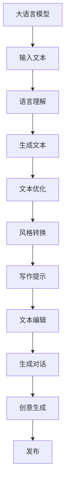

                 

# LLM辅助创意写作：AI与人类作家的协作

## 1. 背景介绍

### 1.1 问题由来
随着人工智能技术的发展，大语言模型(LLMs)在自然语言处理(NLP)领域取得了巨大成功。以OpenAI的GPT-3、Google的BERT等代表，这些模型能够生成流畅、连贯的文本，且具有高度的泛化能力。然而，这些模型在创造力、风格和情感表达方面仍然存在一定的局限性。

面对创作瓶颈和灵感枯竭的困境，人类作家和艺术家需要一种能够激发创意、协助创作的AI辅助工具。大语言模型在这一领域展现出了巨大的潜力，尤其是在辅助创意写作、故事创作和艺术创作等场景中，能够提供新的灵感、生成初步草稿，甚至完成部分创意性工作。本文将详细探讨大语言模型在创意写作中的应用，分析其核心原理和操作步骤，并展望其未来发展趋势。

## 2. 核心概念与联系

### 2.1 核心概念概述

大语言模型是一种基于深度学习架构的模型，能够理解和生成自然语言，在自监督学习和微调后的监督学习中获得了显著的性能提升。在创意写作中，大语言模型可以应用于：

- 生成文本草稿：根据给定的主题、情节、风格等，生成初步文本内容。
- 提供写作提示：为创作者提供写作灵感、思路建议和词汇推荐。
- 风格转换：将文本转换为不同的风格或文体。
- 文本编辑：自动检测并修正文本中的语法错误和逻辑漏洞。
- 生成对话：模拟不同角色的对话，丰富故事内容。
- 创意生成：生成原创性的文本，如诗歌、故事和小说片段。

### 2.2 核心概念原理和架构的 Mermaid 流程图



此流程图展示了大语言模型从输入文本到创意生成的全流程。大语言模型首先理解输入文本，然后生成相应的文本，并进行风格转换、写作提示、文本编辑、生成对话和创意生成等操作，最终生成创意写作的成果。

## 3. 核心算法原理 & 具体操作步骤

### 3.1 算法原理概述

大语言模型在辅助创意写作中的应用，主要基于预训练语言模型的微调（Fine-tuning）技术和迁移学习（Transfer Learning）。预训练模型通过在大量无标签文本上学习语言知识，并在特定任务上进行微调，以适应特定的创意写作场景。

具体来说，大语言模型在微调过程中会针对创意写作的任务特点，设计特定的损失函数、优化器和学习率等参数。通过有监督学习，模型能够学习如何根据给定的输入生成相应的文本，并且通过风格转换、写作提示等技术，进一步增强其创造性和多样性。

### 3.2 算法步骤详解

1. **数据准备**：收集和标注大量的创意写作数据集，包括小说片段、故事梗概、诗歌等。这些数据集应涵盖多种写作风格、主题和文体，以确保模型能够学习到全面的语言知识。

2. **模型选择与预训练**：选择合适的预训练大语言模型，如GPT-3、BERT等，并根据具体任务对其进行调整和预训练。预训练过程包括在大规模无标签文本上进行自监督学习，以学习语言的通用表示。

3. **任务适配层设计**：根据创意写作任务的特点，设计特定的任务适配层。例如，对于诗歌生成任务，可以使用语言模型的生成器；对于小说创作任务，可以使用长短时记忆网络（LSTM）或自回归模型等。

4. **微调设置**：选择合适的优化算法（如Adam、SGD等）、学习率、批大小和迭代轮数等参数，并设置正则化技术以避免过拟合。对于创意写作，通常会设置较小的学习率，以保持模型的多样性和创造性。

5. **训练与评估**：将标注好的创意写作数据集划分为训练集、验证集和测试集，对预训练模型进行微调训练。在训练过程中，周期性地在验证集上评估模型性能，并根据性能调整参数。

6. **后处理**：对生成的文本进行后处理，如修正语法错误、优化结构、调整风格等，以提高文本的质量和可读性。

### 3.3 算法优缺点

#### 优点

- **创造力激发**：大语言模型能够提供丰富的写作灵感和思路，激发创作者的创意。
- **多样化生成**：模型能够根据不同的输入生成多样化的文本，满足不同风格和体裁的需求。
- **高效辅助**：可以快速生成大量的草稿和文本，提高创作效率。
- **风格转换**：能够将文本转换为不同的风格和文体，增强文本的多样性和表现力。
- **跨领域适用**：适用于多种创意写作任务，包括小说、诗歌、剧本等。

#### 缺点

- **创造性不足**：尽管模型能够生成流畅的文本，但其创造性和原创性仍然不及人类作家。
- **风格一致性**：生成文本的风格可能会受到预训练数据的影响，不如人类作家的风格具有高度一致性。
- **缺乏情感深度**：生成的文本可能缺乏情感深度和细腻的情感表达。
- **依赖输入**：模型的生成质量高度依赖输入文本的质量和多样性。
- **技术门槛高**：对于非专业开发者来说，微调模型的训练和优化有一定技术门槛。

### 3.4 算法应用领域

大语言模型在创意写作中的应用领域非常广泛，以下是几个典型场景：

1. **小说创作**：帮助作家生成小说的初步草稿，包括情节、人物、对话等。
2. **诗歌生成**：生成押韵、节奏、主题等符合特定风格的诗歌。
3. **剧本创作**：生成剧本的对话、场景描述和故事情节。
4. **创意写作提示**：提供写作灵感、情节发展、角色设定等创意提示。
5. **文本编辑**：自动检测并修正文本中的语法错误、逻辑漏洞和语言表达问题。
6. **风格转换**：将现有的文本转换为不同的风格，如古文、现代文、科幻文等。

## 4. 数学模型和公式 & 详细讲解 & 举例说明

### 4.1 数学模型构建

假设有一个预训练的大语言模型 $M_{\theta}$，其中 $\theta$ 为模型参数。在微调过程中，我们定义创意写作任务的目标函数为：

$$
\mathcal{L}(\theta) = \frac{1}{N}\sum_{i=1}^N\ell(y_i, M_{\theta}(x_i))
$$

其中，$y_i$ 为输入 $x_i$ 对应的目标文本，$\ell$ 为目标损失函数，如交叉熵损失、均方误差损失等。我们的目标是最小化经验风险，即找到最优参数 $\theta^*$：

$$
\theta^* = \mathop{\arg\min}_{\theta} \mathcal{L}(\theta)
$$

### 4.2 公式推导过程

以交叉熵损失为例，假设有 $n$ 个样本，模型输出的概率分布为 $\hat{y}_i$，真实标签为 $y_i$，则交叉熵损失函数为：

$$
\ell(y_i, \hat{y}_i) = -y_i \log \hat{y}_i - (1-y_i) \log (1-\hat{y}_i)
$$

总损失函数为：

$$
\mathcal{L}(\theta) = -\frac{1}{N}\sum_{i=1}^N [y_i \log \hat{y}_i + (1-y_i) \log (1-\hat{y}_i)]
$$

对于创意写作任务，我们通常使用语言模型的生成器进行文本生成，即：

$$
\hat{y}_i = M_{\theta}(x_i)
$$

其中，$M_{\theta}$ 为预训练模型的生成器。通过反向传播算法，计算损失函数对模型参数 $\theta$ 的梯度，并使用优化器更新参数，最小化损失函数 $\mathcal{L}(\theta)$。

### 4.3 案例分析与讲解

以诗歌生成为例，我们可以将预训练的BERT模型进行微调，用于生成押韵和韵律的诗歌。我们定义损失函数为：

$$
\ell(y_i, \hat{y}_i) = -(y_i \log \hat{y}_i + (1-y_i) \log (1-\hat{y}_i))
$$

其中，$y_i$ 为诗句的真实标签，$\hat{y}_i$ 为模型生成的概率分布。通过反向传播算法，计算梯度并使用Adam优化器更新模型参数，最小化交叉熵损失。

## 5. 项目实践：代码实例和详细解释说明

### 5.1 开发环境搭建

本节将介绍如何搭建一个基于Python和PyTorch的开发环境，用于大语言模型的微调和创意写作。

1. **安装Python和PyTorch**：使用Anaconda创建虚拟环境，安装PyTorch和相关依赖。

2. **安装其他依赖**：安装TensorBoard、Weights & Biases等工具，以便于模型训练和调试。

3. **准备数据集**：收集创意写作数据集，包括小说、诗歌、故事等，并进行预处理和标注。

### 5.2 源代码详细实现

以下是一个简单的代码示例，展示如何使用PyTorch微调BERT模型进行诗歌生成：

```python
import torch
import torch.nn as nn
import torch.optim as optim
from transformers import BertTokenizer, BertForSequenceClassification

# 加载预训练模型和分词器
model = BertForSequenceClassification.from_pretrained('bert-base-uncased')
tokenizer = BertTokenizer.from_pretrained('bert-base-uncased')

# 定义损失函数和优化器
criterion = nn.CrossEntropyLoss()
optimizer = optim.Adam(model.parameters(), lr=2e-5)

# 定义训练函数
def train_epoch(model, data_loader, optimizer, criterion):
    model.train()
    epoch_loss = 0
    for batch in data_loader:
        input_ids, labels = batch
        input_ids = input_ids.to(device)
        labels = labels.to(device)
        outputs = model(input_ids)
        loss = criterion(outputs, labels)
        epoch_loss += loss.item()
        optimizer.zero_grad()
        loss.backward()
        optimizer.step()
    return epoch_loss / len(data_loader)

# 定义评估函数
def evaluate(model, data_loader, criterion):
    model.eval()
    epoch_loss = 0
    epoch_accuracy = 0
    with torch.no_grad():
        for batch in data_loader:
            input_ids, labels = batch
            input_ids = input_ids.to(device)
            labels = labels.to(device)
            outputs = model(input_ids)
            loss = criterion(outputs, labels)
            epoch_loss += loss.item()
            epoch_accuracy += (torch.argmax(outputs, dim=1) == labels).sum().item() / len(labels)
    return epoch_loss / len(data_loader), epoch_accuracy / len(data_loader)

# 定义模型训练和评估循环
device = torch.device('cuda' if torch.cuda.is_available() else 'cpu')
model.to(device)

# 训练循环
for epoch in range(epochs):
    train_loss, train_acc = train_epoch(model, train_loader, optimizer, criterion)
    val_loss, val_acc = evaluate(model, val_loader, criterion)
    print(f'Epoch {epoch+1}, train loss: {train_loss:.4f}, train acc: {train_acc:.4f}')
    print(f'Epoch {epoch+1}, val loss: {val_loss:.4f}, val acc: {val_acc:.4f}')

# 测试集评估
test_loss, test_acc = evaluate(model, test_loader, criterion)
print(f'Test loss: {test_loss:.4f}, test acc: {test_acc:.4f}')
```

### 5.3 代码解读与分析

这段代码展示了如何使用PyTorch和Transformer库对BERT模型进行诗歌生成任务的微调。代码的主要步骤包括：

- 加载预训练的BERT模型和分词器。
- 定义损失函数（交叉熵损失）和优化器（Adam优化器）。
- 定义训练和评估函数。
- 训练循环，在每个epoch上计算训练和验证损失，并在测试集上评估模型性能。

## 6. 实际应用场景

### 6.1 智能写作助手

智能写作助手是大语言模型在创意写作中最重要的应用场景之一。它可以作为作家的辅助工具，提供写作灵感、文本生成和文本编辑等功能。例如，作家在构思小说时，可以使用智能写作助手生成初步草稿，并根据需求进行修改和优化。

### 6.2 诗歌创作

诗歌创作是另一个典型应用场景。大语言模型可以生成押韵、韵律、情感丰富且符合特定风格的诗歌。在传统诗歌创作中，诗人的灵感和技巧非常重要，而大语言模型可以辅助诗人探索新的创意和表达方式。

### 6.3 剧本创作

剧本创作是大语言模型在影视行业的重要应用。模型可以生成剧本的对话、场景描述和故事情节，辅助编剧和导演构思和编写剧本。

### 6.4 未来应用展望

随着大语言模型的不断发展，其在创意写作中的应用也将更加广泛和深入。未来的发展趋势包括：

1. **多模态创意写作**：结合图像、音频等多模态数据，生成更加丰富和互动的创意作品。
2. **交互式创意写作**：通过自然语言交互，与用户实时互动，生成个性化、动态的创意内容。
3. **个性化推荐**：根据用户的偏好和历史行为，推荐符合其喜好的创意作品。
4. **情感计算**：结合情感分析技术，生成符合用户情感需求的创意作品。
5. **跨文化创意写作**：能够生成符合不同文化背景和语境的创意内容。

## 7. 工具和资源推荐

### 7.1 学习资源推荐

1. **《自然语言处理入门》**：介绍NLP基础理论和常用技术，适合初学者。
2. **《深度学习与自然语言处理》**：讲解深度学习在NLP中的应用，涵盖预训练、微调和生成模型。
3. **《大语言模型技术综述》**：全面介绍大语言模型的原理、应用和未来趋势。
4. **Coursera的《深度学习专项课程》**：涵盖深度学习的基础和高级技术，适合进阶学习。
5. **HuggingFace官方文档**：提供丰富的预训练模型和微调样例，适合实践学习。

### 7.2 开发工具推荐

1. **PyTorch**：强大的深度学习框架，适合研究和实践大语言模型。
2. **TensorFlow**：广泛使用的深度学习框架，适合工业生产部署。
3. **Transformers库**：HuggingFace开发的NLP工具库，提供丰富的预训练模型和微调样例。
4. **Weights & Biases**：实验跟踪工具，用于记录和可视化模型训练过程中的各项指标。
5. **TensorBoard**：模型可视化工具，用于监控和调试模型训练。

### 7.3 相关论文推荐

1. **《大语言模型的发展与应用》**：综述大语言模型在NLP中的应用，包括创意写作、文本生成等。
2. **《基于大语言模型的创意写作系统》**：介绍大语言模型在诗歌、小说等创意写作中的应用。
3. **《大语言模型在自然语言生成中的研究进展》**：详细探讨大语言模型在生成诗歌、故事等文本中的应用。

## 8. 总结：未来发展趋势与挑战

### 8.1 研究成果总结

大语言模型在创意写作中的应用取得了显著进展，展现出巨大的潜力。其核心在于：

1. **创造力激发**：能够提供丰富的写作灵感和思路，激发创作者的创意。
2. **多样化生成**：能够根据不同的输入生成多样化的文本，满足不同风格和体裁的需求。
3. **高效辅助**：可以快速生成大量的草稿和文本，提高创作效率。

### 8.2 未来发展趋势

未来，大语言模型在创意写作中的应用将更加广泛和深入，主要趋势包括：

1. **多模态创意写作**：结合图像、音频等多模态数据，生成更加丰富和互动的创意作品。
2. **交互式创意写作**：通过自然语言交互，与用户实时互动，生成个性化、动态的创意内容。
3. **个性化推荐**：根据用户的偏好和历史行为，推荐符合其喜好的创意作品。
4. **情感计算**：结合情感分析技术，生成符合用户情感需求的创意作品。
5. **跨文化创意写作**：能够生成符合不同文化背景和语境的创意内容。

### 8.3 面临的挑战

尽管大语言模型在创意写作中展现出巨大的潜力，但仍面临一些挑战：

1. **创造性不足**：尽管模型能够生成流畅的文本，但其创造性和原创性仍然不及人类作家。
2. **风格一致性**：生成文本的风格可能会受到预训练数据的影响，不如人类作家的风格具有高度一致性。
3. **缺乏情感深度**：生成的文本可能缺乏情感深度和细腻的情感表达。
4. **依赖输入**：模型的生成质量高度依赖输入文本的质量和多样性。
5. **技术门槛高**：对于非专业开发者来说，微调模型的训练和优化有一定技术门槛。

### 8.4 研究展望

未来的研究应重点解决以下几个问题：

1. **增强创造性**：开发更具创造性和原创性的生成模型，如基于生成对抗网络（GAN）的生成模型。
2. **提升风格一致性**：提高生成文本的风格一致性和多样性，如使用风格迁移技术。
3. **增强情感深度**：结合情感计算技术，生成具有情感深度和细腻表达的文本。
4. **提升输入依赖性**：开发更加鲁棒的生成模型，使其对输入文本的质量和多样性更加鲁棒。
5. **降低技术门槛**：简化微调模型的训练和优化流程，降低技术门槛。

## 9. 附录：常见问题与解答

**Q1：如何提高大语言模型的创造性？**

A: 提高大语言模型的创造性可以通过以下方法：

1. **数据多样性**：使用多样化的训练数据，涵盖不同的风格和体裁，以增强模型的创造性。
2. **模型架构改进**：改进模型的架构，如引入生成对抗网络（GAN）等，以提高创造性和多样性。
3. **多任务学习**：在预训练过程中加入多任务学习，如文本生成、情感分析等，以增强模型的泛化能力。
4. **人类指导**：结合人类的指导和反馈，不断调整模型参数和训练策略，以提升创造性。

**Q2：如何提高大语言模型的风格一致性？**

A: 提高大语言模型的风格一致性可以通过以下方法：

1. **风格迁移**：使用风格迁移技术，将生成的文本进行风格转换，使其符合特定风格。
2. **多风格训练**：在预训练过程中加入多种风格的训练数据，以增强模型的风格一致性。
3. **风格分类**：使用风格分类模型，对生成的文本进行风格分类，并根据分类结果进行微调。

**Q3：如何提高大语言模型的情感深度？**

A: 提高大语言模型的情感深度可以通过以下方法：

1. **情感计算**：结合情感计算技术，生成符合用户情感需求的文本。
2. **情感标注**：在预训练过程中加入情感标注，使模型学习情感表达的规律。
3. **情感分析**：在生成过程中使用情感分析模型，调整生成的文本情感。

**Q4：如何降低大语言模型的技术门槛？**

A: 降低大语言模型的技术门槛可以通过以下方法：

1. **简化微调流程**：使用易于使用的微调工具和库，简化微调流程。
2. **提供教程和示例**：提供详细的教程和示例代码，帮助开发者快速上手。
3. **社区支持**：建立社区支持系统，提供技术支持和协作。
4. **预训练模型开放**：开放更多高质量的预训练模型，降低技术门槛。

**Q5：如何处理大语言模型生成文本中的语法错误？**

A: 处理大语言模型生成文本中的语法错误可以通过以下方法：

1. **后处理工具**：使用后处理工具，如Grammarly、LanguageTool等，自动检测和修正语法错误。
2. **规则匹配**：使用语法规则进行匹配和修正，如正则表达式等。
3. **模型改进**：改进生成模型的训练过程，使其更加注重语法和逻辑正确性。

---

作者：禅与计算机程序设计艺术 / Zen and the Art of Computer Programming

