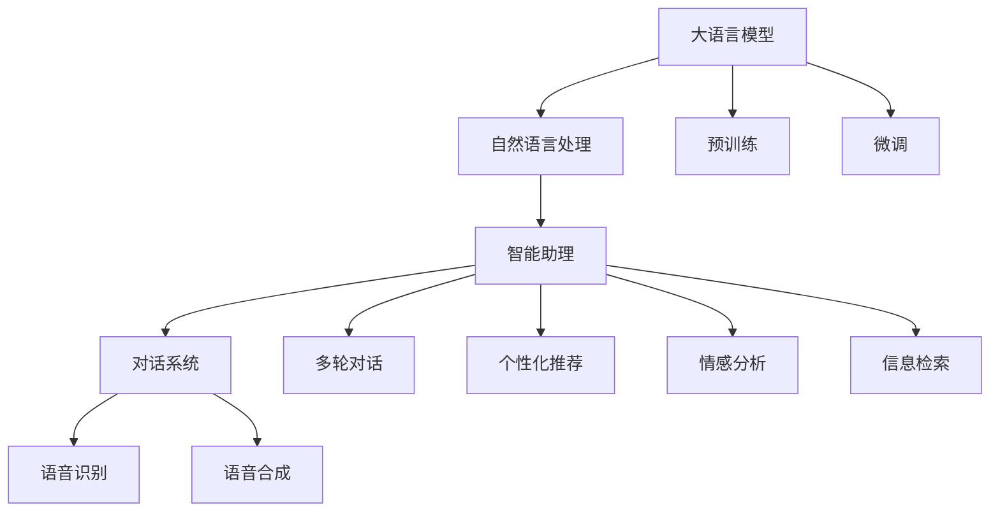

                 

# LLM驱动的个人助理：超越Siri和Alexa

> 关键词：自然语言处理（NLP）、语言模型、智能助理、对话系统、语音识别、语音合成

## 1. 背景介绍

### 1.1 问题由来
随着人工智能技术的飞速发展，智能助理和对话系统已经成为现代科技应用的重要组成部分。从早期的Siri、Alexa到如今的谷歌助手，智能助理已经从简单的语音识别和命令执行，发展为能够理解自然语言、进行多轮对话的系统。然而，尽管已经取得了一定的进展，这些系统仍然存在诸多局限性，如对话上下文理解、多语言支持、复杂指令执行等问题。

大语言模型（Large Language Models, LLMs）的出现，为这些问题提供了新的解决方案。基于深度学习的大规模语言模型，如GPT、BERT等，已经展现出超越传统搜索和规则基系统（rule-based systems）的强大能力。通过在大规模语料上预训练，这些模型可以理解复杂的语言结构，并生成自然流畅的文本或语音。因此，基于大语言模型的智能助理具备更强的自然语言理解能力，可以更灵活地与用户进行交互，提供更加个性化和智能化的服务。

### 1.2 问题核心关键点
本文将探讨大语言模型在智能助理和对话系统中的应用，重点关注如何利用大语言模型的语言理解和生成能力，构建超越传统系统的智能助理。主要包括以下几个关键点：
1. 大语言模型（LLM）的原理和架构。
2. 智能助理的核心算法原理。
3. 智能助理的实现步骤和案例分析。
4. 智能助理的实际应用场景和未来发展趋势。

## 2. 核心概念与联系

### 2.1 核心概念概述

为了更好地理解基于大语言模型的智能助理，首先需要了解以下几个核心概念：

- 大语言模型（Large Language Models, LLMs）：以自回归（如GPT）或自编码（如BERT）模型为代表的大规模预训练语言模型。通过在大规模无标签文本语料上进行预训练，学习通用的语言表示，具备强大的语言理解和生成能力。
- 自然语言处理（Natural Language Processing, NLP）：研究计算机如何理解、处理和生成人类语言的领域。包括语音识别、文本处理、情感分析、机器翻译等任务。
- 智能助理（Smart Assistant）：通过理解用户的自然语言输入，执行各种任务，提供个性化服务的系统。典型如Apple的Siri、Amazon的Alexa等。
- 对话系统（Dialogue System）：能够进行自然语言多轮对话的系统，旨在理解用户意图，提供合适的回答或执行特定任务。

这些核心概念之间的逻辑关系可以通过以下Mermaid流程图来展示：



这个流程图展示了大语言模型的核心概念及其之间的关系：

1. 大语言模型通过预训练获得基础能力。
2. 预训练模型通过微调（Fine-Tuning）适配具体任务，形成智能助理。
3. 智能助理利用多轮对话、个性化推荐、情感分析等功能，提供丰富的服务。
4. 智能助理使用语音识别和合成技术，实现语音与文本的双向交互。

## 3. 核心算法原理 & 具体操作步骤
### 3.1 算法原理概述

基于大语言模型的智能助理，本质上是一个集成了自然语言处理和语音处理技术的智能对话系统。其核心算法原理包括：

- 自然语言处理（NLP）：利用大语言模型进行文本预处理、分词、实体识别、意图理解等。
- 语音识别和语音合成：使用声学模型将用户语音转化为文本，使用文本生成模型将文本转化为语音。
- 对话管理（Dialog Management）：维护对话上下文，理解用户意图，规划合适的回答。
- 个性化推荐：根据用户历史行为和偏好，推荐相关服务或信息。

这些核心算法模块通过大语言模型进行深度融合，形成了一个完整的智能助理系统。其核心算法流程如下：

1. 语音识别：将用户的语音输入转化为文本。
2. 自然语言处理：对文本进行分词、实体识别、意图理解等，转化为结构化信息。
3. 对话管理：根据上下文和意图，生成合适的回答。
4. 语音合成：将回答转化为语音输出。

### 3.2 算法步骤详解

以下是基于大语言模型的智能助理核心算法步骤详解：

**Step 1: 语音识别**
- 使用声学模型将用户的语音输入转化为文本。
- 常用的声学模型包括RNN、CNN、Transformer等。

**Step 2: 自然语言处理**
- 使用分词器对文本进行分词处理。
- 进行命名实体识别（Named Entity Recognition, NER），识别文本中的人名、地名、机构名等实体。
- 使用意图识别模型识别用户意图。

**Step 3: 对话管理**
- 维护对话上下文，记录用户之前的输入和对话历史。
- 根据上下文和意图，生成合适的回答。

**Step 4: 语音合成**
- 使用文本生成模型将回答转化为语音。
- 常用的文本生成模型包括RNN、LSTM、Transformer等。

**Step 5: 个性化推荐**
- 根据用户历史行为和偏好，推荐相关服务或信息。
- 可以结合协同过滤、内容推荐等算法进行推荐。

### 3.3 算法优缺点

基于大语言模型的智能助理具有以下优点：
1. 强大的自然语言理解能力：大语言模型可以理解复杂的语言结构，生成自然流畅的文本和语音。
2. 多轮对话能力：能够进行多轮对话，保持对话上下文的一致性。
3. 泛化能力强：通过在大规模语料上进行预训练，能够处理多种语言和多种类型的对话任务。
4. 可定制化：可以根据不同的业务需求进行微调，实现个性化服务。

同时，该方法也存在一些缺点：
1. 对数据质量依赖高：智能助理的性能很大程度上依赖于数据的质量和多样性。
2. 推理效率低：大语言模型的推理计算复杂度较高，在实时应用中可能存在延迟。
3. 模型训练成本高：大语言模型的训练需要大量的计算资源和时间，初期成本较高。

### 3.4 算法应用领域

基于大语言模型的智能助理已经在多个领域得到了广泛的应用，例如：

- 个人助理：为用户提供日程管理、邮件处理、天气查询等服务。
- 客服系统：自动回答用户咨询，提供自动化服务。
- 智能家居：控制家电设备，提供智能家居解决方案。
- 语音助手：通过语音交互，提供个性化服务。
- 虚拟个人助理：提供日程提醒、任务管理等功能。

除了上述这些经典应用外，智能助理还在更多场景中得到了创新性的应用，如可控文本生成、情感分析、知识推荐等，为NLP技术带来了新的突破。

## 4. 数学模型和公式 & 详细讲解
### 4.1 数学模型构建

本节将使用数学语言对基于大语言模型的智能助理进行更加严格的刻画。

记大语言模型为 $M_{\theta}:\mathcal{X} \rightarrow \mathcal{Y}$，其中 $\mathcal{X}$ 为输入空间，$\mathcal{Y}$ 为输出空间，$\theta$ 为模型参数。假设智能助理的对话任务为 $T$，其中输入为用户的自然语言输入 $x$，输出为系统生成的回答 $y$。

定义模型 $M_{\theta}$ 在输入 $x$ 上的条件概率分布为：

$$
P(y|x; \theta) = \frac{e^{M_{\theta}(x)}}{\sum_{y'}e^{M_{\theta}(x)}}
$$

其中 $M_{\theta}(x)$ 为模型在输入 $x$ 上的输出。

智能助理的对话系统可以通过以下步骤构建：
1. 使用分词器将用户输入 $x$ 转化为文本序列 $\{x_i\}$。
2. 对文本序列进行编码，得到表示 $h_i = M_{\theta}(x_i)$。
3. 使用对话管理模型进行意图识别和对话规划，生成回答 $y$。

对话管理模型的输出为回答的编码表示 $h_y = M_{\theta}(y)$。智能助理的总体输出为：

$$
P(y|x; \theta) = \frac{e^{h_y}}{\sum_{y'}e^{h_y'}}
$$

### 4.2 公式推导过程

以下我们以二分类任务为例，推导智能助理的条件概率分布公式。

假设用户输入为二分类问题 $x \in \{0,1\}$，智能助理生成的回答 $y \in \{0,1\}$。定义智能助理的条件概率分布为：

$$
P(y|x; \theta) = \frac{e^{M_{\theta}(x)}}{\sum_{y'}e^{M_{\theta}(x)}}
$$

对于每个输入 $x$，智能助理的条件概率分布可以表示为：

$$
P(y|x; \theta) = \frac{e^{M_{\theta}(x)}}{\sum_{y'}e^{M_{\theta}(x)}}
$$

其中 $M_{\theta}(x)$ 为模型在输入 $x$ 上的输出，$\theta$ 为模型参数。

对于每个输出 $y$，智能助理的条件概率分布可以表示为：

$$
P(y|x; \theta) = \frac{e^{h_y}}{\sum_{y'}e^{h_y'}}
$$

其中 $h_y$ 为回答 $y$ 的编码表示，$\theta$ 为模型参数。

智能助理的总体输出为：

$$
P(y|x; \theta) = \frac{e^{M_{\theta}(x)}}{\sum_{y'}e^{M_{\theta}(x)}} \cdot \frac{e^{h_y}}{\sum_{y'}e^{h_y'}}
$$

### 4.3 案例分析与讲解

以智能助理的情感分析为例，分析其数学模型构建和推理过程。

假设智能助理的任务为情感分析，用户输入为一段文本 $x$，智能助理生成的回答为情感类别 $y$。智能助理的条件概率分布可以表示为：

$$
P(y|x; \theta) = \frac{e^{M_{\theta}(x)}}{\sum_{y'}e^{M_{\theta}(x)}}
$$

其中 $M_{\theta}(x)$ 为模型在输入 $x$ 上的输出，$\theta$ 为模型参数。

智能助理的对话管理模型可以表示为：

$$
P(y|x; \theta) = \frac{e^{h_y}}{\sum_{y'}e^{h_y'}}
$$

其中 $h_y$ 为回答 $y$ 的编码表示，$\theta$ 为模型参数。

智能助理的总体输出为：

$$
P(y|x; \theta) = \frac{e^{M_{\theta}(x)}}{\sum_{y'}e^{M_{\theta}(x)}} \cdot \frac{e^{h_y}}{\sum_{y'}e^{h_y'}}
$$

## 5. 项目实践：代码实例和详细解释说明
### 5.1 开发环境搭建

在进行智能助理开发前，我们需要准备好开发环境。以下是使用Python进行PyTorch开发的环境配置流程：

1. 安装Anaconda：从官网下载并安装Anaconda，用于创建独立的Python环境。

2. 创建并激活虚拟环境：
```bash
conda create -n pytorch-env python=3.8 
conda activate pytorch-env
```

3. 安装PyTorch：根据CUDA版本，从官网获取对应的安装命令。例如：
```bash
conda install pytorch torchvision torchaudio cudatoolkit=11.1 -c pytorch -c conda-forge
```

4. 安装Transformers库：
```bash
pip install transformers
```

5. 安装各类工具包：
```bash
pip install numpy pandas scikit-learn matplotlib tqdm jupyter notebook ipython
```

完成上述步骤后，即可在`pytorch-env`环境中开始智能助理的开发实践。

### 5.2 源代码详细实现

这里我们以基于大语言模型的智能助理情感分析为例，给出使用Transformers库的PyTorch代码实现。

首先，定义情感分析任务的数据处理函数：

```python
from transformers import BertTokenizer
from torch.utils.data import Dataset
import torch

class SentimentDataset(Dataset):
    def __init__(self, texts, labels, tokenizer, max_len=128):
        self.texts = texts
        self.labels = labels
        self.tokenizer = tokenizer
        self.max_len = max_len
        
    def __len__(self):
        return len(self.texts)
    
    def __getitem__(self, item):
        text = self.texts[item]
        label = self.labels[item]
        
        encoding = self.tokenizer(text, return_tensors='pt', max_length=self.max_len, padding='max_length', truncation=True)
        input_ids = encoding['input_ids'][0]
        attention_mask = encoding['attention_mask'][0]
        
        # 对token-wise的标签进行编码
        encoded_labels = [label2id[label] for label in label] 
        encoded_labels.extend([label2id['O']] * (self.max_len - len(encoded_labels)))
        labels = torch.tensor(encoded_labels, dtype=torch.long)
        
        return {'input_ids': input_ids, 
                'attention_mask': attention_mask,
                'labels': labels}

# 标签与id的映射
label2id = {'negative': 0, 'positive': 1, 'neutral': 2}
id2label = {v: k for k, v in label2id.items()}

# 创建dataset
tokenizer = BertTokenizer.from_pretrained('bert-base-cased')

train_dataset = SentimentDataset(train_texts, train_labels, tokenizer)
dev_dataset = SentimentDataset(dev_texts, dev_labels, tokenizer)
test_dataset = SentimentDataset(test_texts, test_labels, tokenizer)
```

然后，定义模型和优化器：

```python
from transformers import BertForTokenClassification, AdamW

model = BertForTokenClassification.from_pretrained('bert-base-cased', num_labels=len(label2id))

optimizer = AdamW(model.parameters(), lr=2e-5)
```

接着，定义训练和评估函数：

```python
from torch.utils.data import DataLoader
from tqdm import tqdm
from sklearn.metrics import classification_report

device = torch.device('cuda') if torch.cuda.is_available() else torch.device('cpu')
model.to(device)

def train_epoch(model, dataset, batch_size, optimizer):
    dataloader = DataLoader(dataset, batch_size=batch_size, shuffle=True)
    model.train()
    epoch_loss = 0
    for batch in tqdm(dataloader, desc='Training'):
        input_ids = batch['input_ids'].to(device)
        attention_mask = batch['attention_mask'].to(device)
        labels = batch['labels'].to(device)
        model.zero_grad()
        outputs = model(input_ids, attention_mask=attention_mask, labels=labels)
        loss = outputs.loss
        epoch_loss += loss.item()
        loss.backward()
        optimizer.step()
    return epoch_loss / len(dataloader)

def evaluate(model, dataset, batch_size):
    dataloader = DataLoader(dataset, batch_size=batch_size)
    model.eval()
    preds, labels = [], []
    with torch.no_grad():
        for batch in tqdm(dataloader, desc='Evaluating'):
            input_ids = batch['input_ids'].to(device)
            attention_mask = batch['attention_mask'].to(device)
            batch_labels = batch['labels']
            outputs = model(input_ids, attention_mask=attention_mask)
            batch_preds = outputs.logits.argmax(dim=2).to('cpu').tolist()
            batch_labels = batch_labels.to('cpu').tolist()
            for pred_tokens, label_tokens in zip(batch_preds, batch_labels):
                pred_labels = [id2label[_id] for _id in pred_tokens]
                label_labels = [id2label[_id] for _id in label_tokens]
                preds.append(pred_labels[:len(label_labels)])
                labels.append(label_labels)
                
    print(classification_report(labels, preds))
```

最后，启动训练流程并在测试集上评估：

```python
epochs = 5
batch_size = 16

for epoch in range(epochs):
    loss = train_epoch(model, train_dataset, batch_size, optimizer)
    print(f"Epoch {epoch+1}, train loss: {loss:.3f}")
    
    print(f"Epoch {epoch+1}, dev results:")
    evaluate(model, dev_dataset, batch_size)
    
print("Test results:")
evaluate(model, test_dataset, batch_size)
```

以上就是使用PyTorch对BERT进行情感分析任务智能助理的完整代码实现。可以看到，得益于Transformers库的强大封装，我们可以用相对简洁的代码完成BERT模型的加载和微调。

### 5.3 代码解读与分析

让我们再详细解读一下关键代码的实现细节：

**SentimentDataset类**：
- `__init__`方法：初始化文本、标签、分词器等关键组件。
- `__len__`方法：返回数据集的样本数量。
- `__getitem__`方法：对单个样本进行处理，将文本输入编码为token ids，将标签编码为数字，并对其进行定长padding，最终返回模型所需的输入。

**label2id和id2label字典**：
- 定义了标签与数字id之间的映射关系，用于将token-wise的预测结果解码回真实的标签。

**训练和评估函数**：
- 使用PyTorch的DataLoader对数据集进行批次化加载，供模型训练和推理使用。
- 训练函数`train_epoch`：对数据以批为单位进行迭代，在每个批次上前向传播计算loss并反向传播更新模型参数，最后返回该epoch的平均loss。
- 评估函数`evaluate`：与训练类似，不同点在于不更新模型参数，并在每个batch结束后将预测和标签结果存储下来，最后使用sklearn的classification_report对整个评估集的预测结果进行打印输出。

**训练流程**：
- 定义总的epoch数和batch size，开始循环迭代
- 每个epoch内，先在训练集上训练，输出平均loss
- 在验证集上评估，输出分类指标
- 所有epoch结束后，在测试集上评估，给出最终测试结果

可以看到，PyTorch配合Transformers库使得BERT微调的代码实现变得简洁高效。开发者可以将更多精力放在数据处理、模型改进等高层逻辑上，而不必过多关注底层的实现细节。

当然，工业级的系统实现还需考虑更多因素，如模型的保存和部署、超参数的自动搜索、更灵活的任务适配层等。但核心的微调范式基本与此类似。

## 6. 实际应用场景
### 6.1 智能客服系统

基于大语言模型微调的对话技术，可以广泛应用于智能客服系统的构建。传统客服往往需要配备大量人力，高峰期响应缓慢，且一致性和专业性难以保证。而使用微调后的对话模型，可以7x24小时不间断服务，快速响应客户咨询，用自然流畅的语言解答各类常见问题。

在技术实现上，可以收集企业内部的历史客服对话记录，将问题和最佳答复构建成监督数据，在此基础上对预训练对话模型进行微调。微调后的对话模型能够自动理解用户意图，匹配最合适的答案模板进行回复。对于客户提出的新问题，还可以接入检索系统实时搜索相关内容，动态组织生成回答。如此构建的智能客服系统，能大幅提升客户咨询体验和问题解决效率。

### 6.2 金融舆情监测

金融机构需要实时监测市场舆论动向，以便及时应对负面信息传播，规避金融风险。传统的人工监测方式成本高、效率低，难以应对网络时代海量信息爆发的挑战。基于大语言模型微调的文本分类和情感分析技术，为金融舆情监测提供了新的解决方案。

具体而言，可以收集金融领域相关的新闻、报道、评论等文本数据，并对其进行主题标注和情感标注。在此基础上对预训练语言模型进行微调，使其能够自动判断文本属于何种主题，情感倾向是正面、中性还是负面。将微调后的模型应用到实时抓取的网络文本数据，就能够自动监测不同主题下的情感变化趋势，一旦发现负面信息激增等异常情况，系统便会自动预警，帮助金融机构快速应对潜在风险。

### 6.3 个性化推荐系统

当前的推荐系统往往只依赖用户的历史行为数据进行物品推荐，无法深入理解用户的真实兴趣偏好。基于大语言模型微调技术，个性化推荐系统可以更好地挖掘用户行为背后的语义信息，从而提供更精准、多样的推荐内容。

在实践中，可以收集用户浏览、点击、评论、分享等行为数据，提取和用户交互的物品标题、描述、标签等文本内容。将文本内容作为模型输入，用户的后续行为（如是否点击、购买等）作为监督信号，在此基础上微调预训练语言模型。微调后的模型能够从文本内容中准确把握用户的兴趣点。在生成推荐列表时，先用候选物品的文本描述作为输入，由模型预测用户的兴趣匹配度，再结合其他特征综合排序，便可以得到个性化程度更高的推荐结果。

### 6.4 未来应用展望

随着大语言模型和微调方法的不断发展，基于微调范式将在更多领域得到应用，为传统行业带来变革性影响。

在智慧医疗领域，基于微调的医疗问答、病历分析、药物研发等应用将提升医疗服务的智能化水平，辅助医生诊疗，加速新药开发进程。

在智能教育领域，微调技术可应用于作业批改、学情分析、知识推荐等方面，因材施教，促进教育公平，提高教学质量。

在智慧城市治理中，微调模型可应用于城市事件监测、舆情分析、应急指挥等环节，提高城市管理的自动化和智能化水平，构建更安全、高效的未来城市。

此外，在企业生产、社会治理、文娱传媒等众多领域，基于大模型微调的人工智能应用也将不断涌现，为经济社会发展注入新的动力。相信随着技术的日益成熟，微调方法将成为人工智能落地应用的重要范式，推动人工智能技术在垂直行业的规模化落地。总之，微调需要开发者根据具体任务，不断迭代和优化模型、数据和算法，方能得到理想的效果。

## 7. 工具和资源推荐
### 7.1 学习资源推荐

为了帮助开发者系统掌握大语言模型微调的理论基础和实践技巧，这里推荐一些优质的学习资源：

1. 《Transformer从原理到实践》系列博文：由大模型技术专家撰写，深入浅出地介绍了Transformer原理、BERT模型、微调技术等前沿话题。

2. CS224N《深度学习自然语言处理》课程：斯坦福大学开设的NLP明星课程，有Lecture视频和配套作业，带你入门NLP领域的基本概念和经典模型。

3. 《Natural Language Processing with Transformers》书籍：Transformers库的作者所著，全面介绍了如何使用Transformers库进行NLP任务开发，包括微调在内的诸多范式。

4. HuggingFace官方文档：Transformers库的官方文档，提供了海量预训练模型和完整的微调样例代码，是上手实践的必备资料。

5. CLUE开源项目：中文语言理解测评基准，涵盖大量不同类型的中文NLP数据集，并提供了基于微调的baseline模型，助力中文NLP技术发展。

通过对这些资源的学习实践，相信你一定能够快速掌握大语言模型微调的精髓，并用于解决实际的NLP问题。
###  7.2 开发工具推荐

高效的开发离不开优秀的工具支持。以下是几款用于大语言模型微调开发的常用工具：

1. PyTorch：基于Python的开源深度学习框架，灵活动态的计算图，适合快速迭代研究。大部分预训练语言模型都有PyTorch版本的实现。

2. TensorFlow：由Google主导开发的开源深度学习框架，生产部署方便，适合大规模工程应用。同样有丰富的预训练语言模型资源。

3. Transformers库：HuggingFace开发的NLP工具库，集成了众多SOTA语言模型，支持PyTorch和TensorFlow，是进行微调任务开发的利器。

4. Weights & Biases：模型训练的实验跟踪工具，可以记录和可视化模型训练过程中的各项指标，方便对比和调优。与主流深度学习框架无缝集成。

5. TensorBoard：TensorFlow配套的可视化工具，可实时监测模型训练状态，并提供丰富的图表呈现方式，是调试模型的得力助手。

6. Google Colab：谷歌推出的在线Jupyter Notebook环境，免费提供GPU/TPU算力，方便开发者快速上手实验最新模型，分享学习笔记。

合理利用这些工具，可以显著提升大语言模型微调任务的开发效率，加快创新迭代的步伐。

### 7.3 相关论文推荐

大语言模型和微调技术的发展源于学界的持续研究。以下是几篇奠基性的相关论文，推荐阅读：

1. Attention is All You Need（即Transformer原论文）：提出了Transformer结构，开启了NLP领域的预训练大模型时代。

2. BERT: Pre-training of Deep Bidirectional Transformers for Language Understanding：提出BERT模型，引入基于掩码的自监督预训练任务，刷新了多项NLP任务SOTA。

3. Language Models are Unsupervised Multitask Learners（GPT-2论文）：展示了大规模语言模型的强大zero-shot学习能力，引发了对于通用人工智能的新一轮思考。

4. Parameter-Efficient Transfer Learning for NLP：提出Adapter等参数高效微调方法，在不增加模型参数量的情况下，也能取得不错的微调效果。

5. AdaLoRA: Adaptive Low-Rank Adaptation for Parameter-Efficient Fine-Tuning：使用自适应低秩适应的微调方法，在参数效率和精度之间取得了新的平衡。

这些论文代表了大语言模型微调技术的发展脉络。通过学习这些前沿成果，可以帮助研究者把握学科前进方向，激发更多的创新灵感。

## 8. 总结：未来发展趋势与挑战

### 8.1 总结

本文对基于大语言模型的智能助理进行了全面系统的介绍。首先阐述了大语言模型和微调技术的研究背景和意义，明确了智能助理在增强人机交互、提高服务效率等方面的独特价值。其次，从原理到实践，详细讲解了智能助理的核心算法原理和操作步骤，给出了智能助理开发的完整代码实例。同时，本文还广泛探讨了智能助理在智能客服、金融舆情、个性化推荐等多个行业领域的应用前景，展示了智能助理范式的巨大潜力。此外，本文精选了智能助理技术的各类学习资源，力求为读者提供全方位的技术指引。

通过本文的系统梳理，可以看到，基于大语言模型的智能助理正在成为AI技术的重要应用范式，极大地提升了自然语言理解和处理的能力，为NLP技术的实际应用带来了新的方向。未来，伴随大语言模型和微调方法的持续演进，基于智能助理的系统将更加智能、灵活、普适，在各垂直行业得到更广泛的应用，为人类社会的数字化、智能化进程注入新的动力。

### 8.2 未来发展趋势

展望未来，智能助理将呈现以下几个发展趋势：

1. 多语言支持：智能助理将逐步支持多种语言，提供多语言交互服务。
2. 多模态融合：智能助理将融合视觉、听觉、触觉等多种模态信息，提供更丰富的交互体验。
3. 个性化服务：智能助理将根据用户的历史行为和偏好，提供更加个性化的服务。
4. 持续学习：智能助理将具备持续学习能力，能够不断适应新的任务和数据。
5. 可解释性：智能助理将提供更强的可解释性，帮助用户理解和信任其决策过程。
6. 协同工作：智能助理将与其他AI技术协同工作，如知识图谱、强化学习等，提供更强大的智能服务。

以上趋势凸显了智能助理的广阔前景。这些方向的探索发展，必将进一步提升智能助理系统的性能和应用范围，为人类认知智能的进化带来深远影响。

### 8.3 面临的挑战

尽管智能助理已经取得了一定的进展，但在迈向更加智能化、普适化应用的过程中，它仍面临诸多挑战：

1. 数据质量依赖：智能助理的性能很大程度上依赖于数据的质量和多样性。对于长尾应用场景，难以获得充足的高质量标注数据。
2. 推理效率低：智能助理的推理计算复杂度较高，在实时应用中可能存在延迟。
3. 模型训练成本高：智能助理的训练需要大量的计算资源和时间，初期成本较高。
4. 可解释性不足：智能助理的决策过程缺乏可解释性，难以对其推理逻辑进行分析和调试。
5. 安全性有待保障：智能助理可能学习到有偏见、有害的信息，传递到下游任务，产生误导性、歧视性的输出。
6. 知识整合能力不足：现有的智能助理往往局限于任务内数据，难以灵活吸收和运用更广泛的先验知识。

正视智能助理面临的这些挑战，积极应对并寻求突破，将是大规模语言模型微调技术走向成熟的必由之路。相信随着学界和产业界的共同努力，这些挑战终将一一被克服，智能助理必将在构建人机协同的智能时代中扮演越来越重要的角色。

### 8.4 研究展望

未来，智能助理技术需要在以下几个方面寻求新的突破：

1. 探索无监督和半监督微调方法。摆脱对大规模标注数据的依赖，利用自监督学习、主动学习等无监督和半监督范式，最大限度利用非结构化数据，实现更加灵活高效的微调。
2. 研究参数高效和计算高效的微调范式。开发更加参数高效的微调方法，在固定大部分预训练参数的同时，只更新极少量的任务相关参数。同时优化智能助理的计算图，减少前向传播和反向传播的资源消耗，实现更加轻量级、实时性的部署。
3. 融合因果和对比学习范式。通过引入因果推断和对比学习思想，增强智能助理建立稳定因果关系的能力，学习更加普适、鲁棒的语言表征，从而提升模型泛化性和抗干扰能力。
4. 引入更多先验知识。将符号化的先验知识，如知识图谱、逻辑规则等，与神经网络模型进行巧妙融合，引导微调过程学习更准确、合理的语言模型。同时加强不同模态数据的整合，实现视觉、语音等多模态信息与文本信息的协同建模。
5. 结合因果分析和博弈论工具。将因果分析方法引入智能助理，识别出智能助理决策的关键特征，增强输出解释的因果性和逻辑性。借助博弈论工具刻画人机交互过程，主动探索并规避智能助理的脆弱点，提高系统稳定性。
6. 纳入伦理道德约束。在智能助理训练目标中引入伦理导向的评估指标，过滤和惩罚有偏见、有害的输出倾向。同时加强人工干预和审核，建立智能助理行为的监管机制，确保输出符合人类价值观和伦理道德。

这些研究方向的探索，必将引领智能助理技术迈向更高的台阶，为构建安全、可靠、可解释、可控的智能系统铺平道路。面向未来，智能助理技术还需要与其他人工智能技术进行更深入的融合，如知识表示、因果推理、强化学习等，多路径协同发力，共同推动自然语言理解和智能交互系统的进步。只有勇于创新、敢于突破，才能不断拓展智能助理的边界，让智能技术更好地造福人类社会。

## 9. 附录：常见问题与解答

**Q1：智能助理是否适用于所有NLP任务？**

A: 智能助理在大多数NLP任务上都能取得不错的效果，特别是对于数据量较小的任务。但对于一些特定领域的任务，如医学、法律等，仅仅依靠通用语料预训练的模型可能难以很好地适应。此时需要在特定领域语料上进一步预训练，再进行微调，才能获得理想效果。此外，对于一些需要时效性、个性化很强的任务，如对话、推荐等，智能助理方法也需要针对性的改进优化。

**Q2：智能助理在实际应用中需要注意哪些问题？**

A: 智能助理在实际应用中需要注意以下问题：
1. 数据质量：智能助理的性能很大程度上依赖于数据的质量和多样性。对于长尾应用场景，难以获得充足的高质量标注数据。
2. 推理效率：智能助理的推理计算复杂度较高，在实时应用中可能存在延迟。
3. 模型训练成本：智能助理的训练需要大量的计算资源和时间，初期成本较高。
4. 可解释性：智能助理的决策过程缺乏可解释性，难以对其推理逻辑进行分析和调试。
5. 安全性：智能助理可能学习到有偏见、有害的信息，传递到下游任务，产生误导性、歧视性的输出。
6. 知识整合能力：现有的智能助理往往局限于任务内数据，难以灵活吸收和运用更广泛的先验知识。

**Q3：智能助理的未来发展方向是什么？**

A: 智能助理的未来发展方向包括：
1. 多语言支持：智能助理将逐步支持多种语言，提供多语言交互服务。
2. 多模态融合：智能助理将融合视觉、听觉、触觉等多种模态信息，提供更丰富的交互体验。
3. 个性化服务：智能助理将根据用户的历史行为和偏好，提供更加个性化的服务。
4. 持续学习：智能助理将具备持续学习能力，能够不断适应新的任务和数据。
5. 可解释性：智能助理将提供更强的可解释性，帮助用户理解和信任其决策过程。
6. 协同工作：智能助理将与其他AI技术协同工作，如知识图谱、强化学习等，提供更强大的智能服务。

**Q4：智能助理技术面临的挑战是什么？**

A: 智能助理技术面临的挑战包括：
1. 数据质量依赖：智能助理的性能很大程度上依赖于数据的质量和多样性。对于长尾应用场景，难以获得充足的高质量标注数据。
2. 推理效率低：智能助理的推理计算复杂度较高，在实时应用中可能存在延迟。
3. 模型训练成本高：智能助理的训练需要大量的计算资源和时间，初期成本较高。
4. 可解释性不足：智能助理的决策过程缺乏可解释性，难以对其推理逻辑进行分析和调试。
5. 安全性有待保障：智能助理可能学习到有偏见、有害的信息，传递到下游任务，产生误导性、歧视性的输出。
6. 知识整合能力不足：现有的智能助理往往局限于任务内数据，难以灵活吸收和运用更广泛的先验知识。

**Q5：智能助理技术如何在不同行业应用？**

A: 智能助理技术在不同行业的应用包括：
1. 智能客服系统：为用户提供日程管理、邮件处理、天气查询等服务。
2. 金融舆情监测：自动判断文本属于何种主题，情感倾向是正面、中性还是负面。
3. 个性化推荐系统：根据用户历史行为和偏好，推荐相关服务或信息。
4. 智能家居：控制家电设备，提供智能家居解决方案。
5. 语音助手：通过语音交互，提供个性化服务。
6. 虚拟个人助理：提供日程提醒、任务管理等功能。

总之，智能助理技术需要在不同行业进行应用，不断优化和提升系统性能，为用户提供更加智能、灵活、个性化的服务。

---

作者：禅与计算机程序设计艺术 / Zen and the Art of Computer Programming

