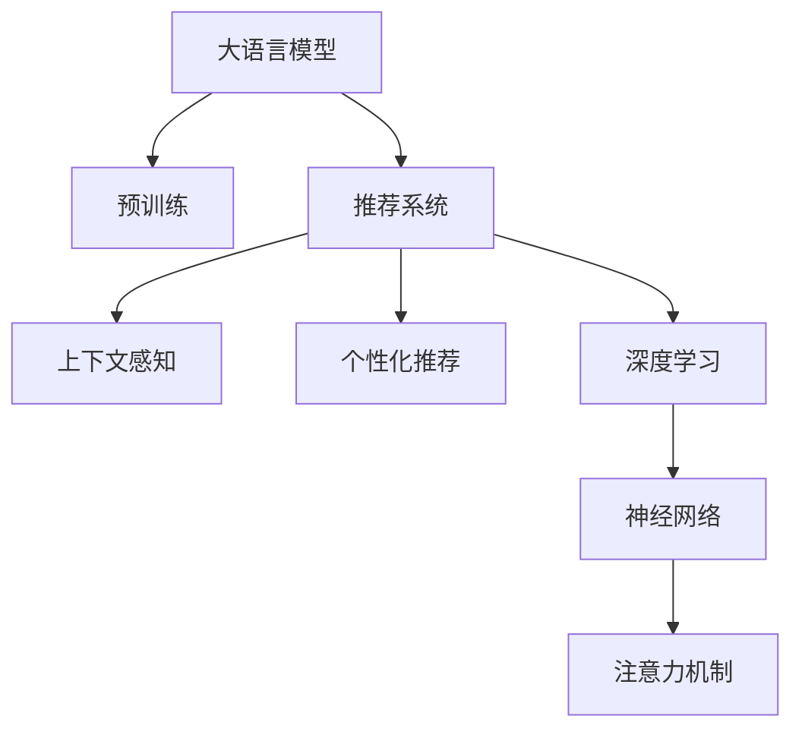

                 

# LLM驱动的个性化餐厅推荐系统

> 关键词：餐厅推荐系统,大语言模型,个性化推荐,深度学习,推荐算法

## 1. 背景介绍

在现代社会，信息过载和用户需求的多样性使得个性化推荐系统变得尤为重要。尤其是在餐饮领域，餐厅推荐系统作为用户寻找就餐地点、享受美食的智能助手，其个性化、准确性直接影响到用户的餐饮体验和满意度。

传统的餐厅推荐系统基于用户的历史行为数据，如浏览记录、评分等进行推荐。这种基于静态历史数据的推荐方式，往往忽略了用户当前的实时需求和动态变化。

然而，随着大语言模型（Large Language Model, LLM）的崛起，其强大的语言理解和生成能力为个性化推荐带来了新的思路。利用大语言模型对用户描述和偏好进行深入理解，结合多维度的实时数据，能够构建更加智能化、高效的餐厅推荐系统。

## 2. 核心概念与联系

### 2.1 核心概念概述

为更好地理解基于大语言模型驱动的餐厅推荐系统，本节将介绍几个密切相关的核心概念：

- 大语言模型（LLM）：指以自回归（如GPT）或自编码（如BERT）模型为代表的大规模预训练语言模型。通过在海量无标签文本数据上进行预训练，学习到丰富的语言知识和常识，具备强大的语言理解和生成能力。

- 推荐系统：基于用户兴趣和行为数据，推荐合适的商品、服务或内容给用户，以提高用户满意度和平台收益的智能系统。

- 个性化推荐：根据用户的历史行为和实时需求，推荐符合其个性化偏好的商品或服务。

- 上下文感知：推荐系统不仅仅基于静态历史数据，而是要结合当前上下文（如时间、地点、天气等）进行动态推荐。

- 深度学习：一种模拟人脑神经网络的机器学习方法，通过多层神经网络对数据进行抽象和学习。

- 神经网络：由大量神经元组成的计算模型，通过反向传播算法进行训练优化。

- 注意力机制：在神经网络中，通过计算输入序列中每个元素与输出序列元素的注意力权重，引导模型关注重要信息。

这些核心概念之间的逻辑关系可以通过以下Mermaid流程图来展示：



这个流程图展示了大语言模型与推荐系统之间的关系：

1. 大语言模型通过预训练获得基础能力。
2. 推荐系统利用大语言模型的语言理解和生成能力，进行上下文感知和个性化推荐。
3. 深度学习是推荐系统构建和优化的核心技术。
4. 神经网络是深度学习的基本构成单元。
5. 注意力机制是神经网络中的重要模块，用于增强模型对重要特征的关注。

这些核心概念共同构成了基于大语言模型的推荐系统的工作框架，使得系统能够更加智能化、准确地为用户推荐餐厅。

## 3. 核心算法原理 & 具体操作步骤

### 3.1 算法原理概述

基于大语言模型的餐厅推荐系统，本质上是一种基于深度学习（Deep Learning）的推荐算法。其核心思想是：将大语言模型作为推荐系统的核心组件，通过对用户描述和偏好进行深入理解，结合实时数据，生成个性化的餐厅推荐。

形式化地，假设餐厅推荐系统的输入为 $X$（包括用户描述、历史行为、上下文信息等），输出为 $Y$（推荐餐厅列表）。推荐系统的目标是找到最优映射函数 $f(X) = Y$，使得 $f$ 在给定 $X$ 下能生成最佳的 $Y$。

### 3.2 算法步骤详解

基于大语言模型的餐厅推荐系统通常包括以下几个关键步骤：

**Step 1: 准备预训练模型和数据集**
- 选择合适的预训练语言模型 $M_{\theta}$ 作为推荐系统的核心组件，如GPT、BERT等。
- 准备餐厅推荐任务的训练数据集 $D=\{(x_i,y_i)\}_{i=1}^N$，其中 $x_i$ 表示用户描述和上下文信息，$y_i$ 表示推荐餐厅的ID。

**Step 2: 添加任务适配层**
- 根据餐厅推荐任务的特点，设计合适的输出层和损失函数。
- 对于多分类任务，通常在顶层添加softmax分类器，以生成概率分布作为餐厅推荐。

**Step 3: 设置微调超参数**
- 选择合适的优化算法及其参数，如AdamW、SGD等，设置学习率、批大小、迭代轮数等。
- 设置正则化技术及强度，包括权重衰减、Dropout、Early Stopping等。
- 确定冻结预训练参数的策略，如仅微调顶层，或全部参数都参与微调。

**Step 4: 执行梯度训练**
- 将训练集数据分批次输入模型，前向传播计算损失函数。
- 反向传播计算参数梯度，根据设定的优化算法和学习率更新模型参数。
- 周期性在验证集上评估模型性能，根据性能指标决定是否触发 Early Stopping。
- 重复上述步骤直至满足预设的迭代轮数或 Early Stopping 条件。

**Step 5: 测试和部署**
- 在测试集上评估微调后模型 $M_{\hat{\theta}}$ 的性能，对比微调前后的精度提升。
- 使用微调后的模型对新用户进行餐厅推荐，集成到实际的应用系统中。
- 持续收集新的数据，定期重新微调模型，以适应数据分布的变化。

以上是基于深度学习的大语言模型驱动的餐厅推荐系统的一般流程。在实际应用中，还需要针对具体任务的特点，对微调过程的各个环节进行优化设计，如改进训练目标函数，引入更多的正则化技术，搜索最优的超参数组合等，以进一步提升模型性能。

### 3.3 算法优缺点

基于大语言模型的餐厅推荐系统具有以下优点：
1. 高效个性化：通过深度学习模型，能够对用户描述进行深入理解，生成符合其偏好的个性化推荐。
2. 数据需求低：仅需少量的标注数据即可进行微调，数据获取成本较低。
3. 实时动态：能够实时结合用户当前的上下文信息，进行动态推荐。
4. 鲁棒性强：深度学习模型的非线性映射能力，使其对数据的噪声和变化具有一定的鲁棒性。

同时，该方法也存在一定的局限性：
1. 计算资源要求高：大语言模型往往需要大量的计算资源，对硬件设施提出了较高的要求。
2. 可解释性不足：深度学习模型的黑盒特性，使其推理过程难以解释和调试。
3. 数据隐私问题：推荐系统需要收集用户数据，可能存在数据隐私和伦理问题。
4. 模型偏见：预训练模型可能存在数据偏见，需要通过微调进行纠正。

尽管存在这些局限性，但就目前而言，基于大语言模型的餐厅推荐系统仍是最主流范式。未来相关研究的重点在于如何进一步降低计算资源需求，提高模型的可解释性和公平性，同时兼顾用户体验和隐私保护。

### 3.4 算法应用领域

基于大语言模型的餐厅推荐系统已经在多个领域得到了广泛应用，例如：

- 餐饮平台：如美团、大众点评等，为用户提供个性化的餐厅推荐。
- 旅游景区：结合旅游用户行为数据和上下文信息，推荐适合的目的地。
- 购物中心：根据用户的购物记录和实时位置，推荐感兴趣的商品和服务。
- 电子商务：通过用户的浏览和购买历史，推荐符合其喜好的商品。

除了上述这些经典应用外，餐厅推荐系统还被创新性地应用到更多场景中，如可控推荐策略、智能客服、多渠道推荐等，为NLP技术带来了全新的突破。随着预训练模型和推荐方法的不断进步，相信餐厅推荐系统将在更广阔的应用领域大放异彩。

## 4. 数学模型和公式 & 详细讲解

### 4.1 数学模型构建

本节将使用数学语言对基于大语言模型的餐厅推荐系统进行更加严格的刻画。

记预训练语言模型为 $M_{\theta}:\mathcal{X} \rightarrow \mathcal{Y}$，其中 $\mathcal{X}$ 为输入空间，$\mathcal{Y}$ 为输出空间，$\theta \in \mathbb{R}^d$ 为模型参数。假设餐厅推荐任务的训练集为 $D=\{(x_i,y_i)\}_{i=1}^N$，其中 $x_i$ 表示用户描述和上下文信息，$y_i$ 表示推荐餐厅的ID。

定义模型 $M_{\theta}$ 在输入 $x_i$ 上的输出为 $\hat{y}=M_{\theta}(x_i)$，表示推荐的餐厅列表。推荐系统的目标是最小化预测输出与真实标签之间的差异，即：

$$
\mathcal{L}(\theta) = -\frac{1}{N}\sum_{i=1}^N \log P(y_i | x_i)
$$

其中 $P(y_i | x_i)$ 为模型在输入 $x_i$ 下生成餐厅 $y_i$ 的概率分布。在推荐系统中，通常使用交叉熵损失函数。

### 4.2 公式推导过程

以下我们以多分类任务为例，推导交叉熵损失函数及其梯度的计算公式。

假设模型 $M_{\theta}$ 在输入 $x_i$ 上的输出为 $\hat{y}=M_{\theta}(x_i) \in \mathbb{R}^C$，其中 $C$ 为餐厅类别数量。真实标签 $y_i \in \{1,2,\dots,C\}$。则多分类交叉熵损失函数定义为：

$$
\ell(M_{\theta}(x_i),y_i) = -y_i \log \hat{y}_i - (1-y_i) \log (1-\hat{y}_i)
$$

将其代入经验风险公式，得：

$$
\mathcal{L}(\theta) = -\frac{1}{N}\sum_{i=1}^N \ell(M_{\theta}(x_i),y_i)
$$

根据链式法则，损失函数对参数 $\theta_k$ 的梯度为：

$$
\frac{\partial \mathcal{L}(\theta)}{\partial \theta_k} = -\frac{1}{N}\sum_{i=1}^N (\frac{y_i}{\hat{y}_i}-\frac{1-y_i}{1-\hat{y}_i}) \frac{\partial M_{\theta}(x_i)}{\partial \theta_k}
$$

其中 $\frac{\partial M_{\theta}(x_i)}{\partial \theta_k}$ 可进一步递归展开，利用自动微分技术完成计算。

在得到损失函数的梯度后，即可带入参数更新公式，完成模型的迭代优化。重复上述过程直至收敛，最终得到适应餐厅推荐任务的最优模型参数 $\theta^*$。

## 5. 项目实践：代码实例和详细解释说明

### 5.1 开发环境搭建

在进行餐厅推荐系统开发前，我们需要准备好开发环境。以下是使用Python进行PyTorch开发的环境配置流程：

1. 安装Anaconda：从官网下载并安装Anaconda，用于创建独立的Python环境。

2. 创建并激活虚拟环境：
```bash
conda create -n pytorch-env python=3.8 
conda activate pytorch-env
```

3. 安装PyTorch：根据CUDA版本，从官网获取对应的安装命令。例如：
```bash
conda install pytorch torchvision torchaudio cudatoolkit=11.1 -c pytorch -c conda-forge
```

4. 安装Transformers库：
```bash
pip install transformers
```

5. 安装各类工具包：
```bash
pip install numpy pandas scikit-learn matplotlib tqdm jupyter notebook ipython
```

完成上述步骤后，即可在`pytorch-env`环境中开始餐厅推荐系统的开发。

### 5.2 源代码详细实现

下面我们以基于BERT模型的餐厅推荐系统为例，给出使用Transformers库进行微调的PyTorch代码实现。

首先，定义餐厅推荐任务的数据处理函数：

```python
from transformers import BertTokenizer
from torch.utils.data import Dataset
import torch

class RestaurantDataset(Dataset):
    def __init__(self, texts, labels, tokenizer, max_len=128):
        self.texts = texts
        self.labels = labels
        self.tokenizer = tokenizer
        self.max_len = max_len
        
    def __len__(self):
        return len(self.texts)
    
    def __getitem__(self, item):
        text = self.texts[item]
        label = self.labels[item]
        
        encoding = self.tokenizer(text, return_tensors='pt', max_length=self.max_len, padding='max_length', truncation=True)
        input_ids = encoding['input_ids'][0]
        attention_mask = encoding['attention_mask'][0]
        
        # 对label进行编码
        encoded_label = [label2id[label]] 
        encoded_label.extend([label2id['O']] * (self.max_len - len(encoded_label)))
        labels = torch.tensor(encoded_label, dtype=torch.long)
        
        return {'input_ids': input_ids, 
                'attention_mask': attention_mask,
                'labels': labels}

# 标签与id的映射
label2id = {'O': 0, '1': 1, '2': 2, '3': 3, '4': 4, '5': 5}
id2label = {v: k for k, v in label2id.items()}

# 创建dataset
tokenizer = BertTokenizer.from_pretrained('bert-base-cased')

train_dataset = RestaurantDataset(train_texts, train_labels, tokenizer)
dev_dataset = RestaurantDataset(dev_texts, dev_labels, tokenizer)
test_dataset = RestaurantDataset(test_texts, test_labels, tokenizer)
```

然后，定义模型和优化器：

```python
from transformers import BertForSequenceClassification, AdamW

model = BertForSequenceClassification.from_pretrained('bert-base-cased', num_labels=len(label2id))

optimizer = AdamW(model.parameters(), lr=2e-5)
```

接着，定义训练和评估函数：

```python
from torch.utils.data import DataLoader
from tqdm import tqdm
from sklearn.metrics import classification_report

device = torch.device('cuda') if torch.cuda.is_available() else torch.device('cpu')
model.to(device)

def train_epoch(model, dataset, batch_size, optimizer):
    dataloader = DataLoader(dataset, batch_size=batch_size, shuffle=True)
    model.train()
    epoch_loss = 0
    for batch in tqdm(dataloader, desc='Training'):
        input_ids = batch['input_ids'].to(device)
        attention_mask = batch['attention_mask'].to(device)
        labels = batch['labels'].to(device)
        model.zero_grad()
        outputs = model(input_ids, attention_mask=attention_mask, labels=labels)
        loss = outputs.loss
        epoch_loss += loss.item()
        loss.backward()
        optimizer.step()
    return epoch_loss / len(dataloader)

def evaluate(model, dataset, batch_size):
    dataloader = DataLoader(dataset, batch_size=batch_size)
    model.eval()
    preds, labels = [], []
    with torch.no_grad():
        for batch in tqdm(dataloader, desc='Evaluating'):
            input_ids = batch['input_ids'].to(device)
            attention_mask = batch['attention_mask'].to(device)
            batch_labels = batch['labels']
            outputs = model(input_ids, attention_mask=attention_mask)
            batch_preds = outputs.logits.argmax(dim=1).to('cpu').tolist()
            batch_labels = batch_labels.to('cpu').tolist()
            for pred, label in zip(batch_preds, batch_labels):
                pred_labels = [id2label[_id] for _id in pred]
                real_labels = [id2label[_id] for _id in label]
                preds.append(pred_labels[:len(real_labels)])
                labels.append(real_labels)
                
    print(classification_report(labels, preds))
```

最后，启动训练流程并在测试集上评估：

```python
epochs = 5
batch_size = 16

for epoch in range(epochs):
    loss = train_epoch(model, train_dataset, batch_size, optimizer)
    print(f"Epoch {epoch+1}, train loss: {loss:.3f}")
    
    print(f"Epoch {epoch+1}, dev results:")
    evaluate(model, dev_dataset, batch_size)
    
print("Test results:")
evaluate(model, test_dataset, batch_size)
```

以上就是使用PyTorch对BERT进行餐厅推荐任务微调的完整代码实现。可以看到，得益于Transformers库的强大封装，我们可以用相对简洁的代码完成BERT模型的加载和微调。

### 5.3 代码解读与分析

让我们再详细解读一下关键代码的实现细节：

**RestaurantDataset类**：
- `__init__`方法：初始化文本、标签、分词器等关键组件。
- `__len__`方法：返回数据集的样本数量。
- `__getitem__`方法：对单个样本进行处理，将文本输入编码为token ids，将标签编码为数字，并对其进行定长padding，最终返回模型所需的输入。

**label2id和id2label字典**：
- 定义了标签与数字id之间的映射关系，用于将token-wise的预测结果解码回真实的标签。

**训练和评估函数**：
- 使用PyTorch的DataLoader对数据集进行批次化加载，供模型训练和推理使用。
- 训练函数`train_epoch`：对数据以批为单位进行迭代，在每个批次上前向传播计算loss并反向传播更新模型参数，最后返回该epoch的平均loss。
- 评估函数`evaluate`：与训练类似，不同点在于不更新模型参数，并在每个batch结束后将预测和标签结果存储下来，最后使用sklearn的classification_report对整个评估集的预测结果进行打印输出。

**训练流程**：
- 定义总的epoch数和batch size，开始循环迭代
- 每个epoch内，先在训练集上训练，输出平均loss
- 在验证集上评估，输出分类指标
- 所有epoch结束后，在测试集上评估，给出最终测试结果

可以看到，PyTorch配合Transformers库使得BERT微调的代码实现变得简洁高效。开发者可以将更多精力放在数据处理、模型改进等高层逻辑上，而不必过多关注底层的实现细节。

当然，工业级的系统实现还需考虑更多因素，如模型的保存和部署、超参数的自动搜索、更灵活的任务适配层等。但核心的微调范式基本与此类似。

## 6. 实际应用场景

### 6.1 智能餐厅推荐系统

基于大语言模型驱动的餐厅推荐系统，已经在智能餐厅推荐系统中得到了广泛应用。传统餐厅推荐系统往往依赖静态的用户历史数据和有限的餐厅信息，难以捕捉用户实时需求和动态变化。

通过大语言模型，系统能够对用户的实时描述和上下文信息进行深入理解，生成符合其当前需求的餐厅推荐。例如，对于去餐厅的请求，系统可以结合当前天气、用户位置、历史偏好等因素，推荐最合适的餐厅。

在技术实现上，系统可以通过API接口与用户对话，获取实时需求，再结合实时数据进行动态推荐。这种基于用户实时上下文信息的推荐方式，使得推荐系统更具个性化和实时性，提升了用户满意度和平台粘性。

### 6.2 旅游推荐系统

旅游推荐系统同样受益于大语言模型驱动的推荐方法。传统旅游推荐系统往往只考虑静态的历史数据，如用户浏览记录、评分等，难以捕捉到用户当前的旅游兴趣和需求。

通过大语言模型，系统能够对用户的旅游描述和上下文信息进行深度分析，生成符合其当前需求的旅游目的地推荐。例如，用户输入“我想去一个安静的海滨城市度假”，系统可以结合用户的历史旅游记录和当前时间、天气信息，推荐最适合的旅游目的地。

这种基于用户实时描述的推荐方式，使得旅游推荐系统更具个性化和多样性，提升了用户的旅游体验和平台收益。

### 6.3 电商平台推荐系统

电商平台的推荐系统同样可以利用大语言模型进行个性化推荐。通过用户输入的搜索词、评价等文本信息，系统能够生成符合其兴趣的商品推荐。

例如，用户输入“我想买一部智能手机”，系统可以结合用户的历史浏览记录和评价信息，推荐最适合的智能手机。系统还可以通过用户对话，获取实时需求，动态调整推荐策略。

这种基于用户实时描述的推荐方式，使得电商平台推荐系统更具个性化和实效性，提升了用户购物体验和平台转化率。

### 6.4 未来应用展望

随着大语言模型和微调方法的不断发展，基于微调范式的推荐系统将在更多领域得到应用，为各行各业带来变革性影响。

在智慧医疗领域，基于大语言模型的医疗推荐系统能够帮助医生推荐最适合的药物、治疗方案，提升医疗服务的智能化水平。

在智能教育领域，大语言模型驱动的教育推荐系统能够根据学生的学习记录和实时反馈，推荐最适合的学习材料和辅导资源，促进个性化教育的发展。

在智慧城市治理中，基于大语言模型的城市推荐系统能够结合用户的实时需求和城市动态信息，推荐最适合的城市服务，提高城市管理的智能化水平。

此外，在企业生产、社会治理、文娱传媒等众多领域，基于大语言模型的推荐系统也将不断涌现，为经济社会发展注入新的动力。相信随着技术的日益成熟，微调方法将成为推荐系统应用的重要范式，推动人工智能技术在各行各业落地应用。

## 7. 工具和资源推荐

### 7.1 学习资源推荐

为了帮助开发者系统掌握基于大语言模型的推荐系统理论基础和实践技巧，这里推荐一些优质的学习资源：

1. 《深度学习与推荐系统》书籍：介绍深度学习与推荐系统的基础理论和实际应用，适合入门和进阶阅读。

2. CS448《人工智能导论》课程：斯坦福大学开设的AI入门课程，有Lecture视频和配套作业，全面介绍AI的基础概念和前沿技术。

3. 《Deep Learning for Recommendations》书籍：深度学习推荐系统领域的经典著作，涵盖深度学习推荐系统的理论和实践。

4. Kaggle推荐系统竞赛：参与Kaggle的推荐系统竞赛，实践前沿推荐算法，积累实际项目经验。

5. 《Recommender Systems: An Introduction》书籍：推荐系统领域的入门教材，涵盖推荐系统的基本概念和算法。

通过对这些资源的学习实践，相信你一定能够快速掌握基于大语言模型的推荐系统的精髓，并用于解决实际的推荐问题。

### 7.2 开发工具推荐

高效的开发离不开优秀的工具支持。以下是几款用于基于大语言模型的推荐系统开发的常用工具：

1. PyTorch：基于Python的开源深度学习框架，灵活动态的计算图，适合快速迭代研究。大部分预训练语言模型都有PyTorch版本的实现。

2. TensorFlow：由Google主导开发的开源深度学习框架，生产部署方便，适合大规模工程应用。同样有丰富的预训练语言模型资源。

3. Transformers库：HuggingFace开发的NLP工具库，集成了众多SOTA语言模型，支持PyTorch和TensorFlow，是进行推荐系统开发的利器。

4. Weights & Biases：模型训练的实验跟踪工具，可以记录和可视化模型训练过程中的各项指标，方便对比和调优。与主流深度学习框架无缝集成。

5. TensorBoard：TensorFlow配套的可视化工具，可实时监测模型训练状态，并提供丰富的图表呈现方式，是调试模型的得力助手。

6. Google Colab：谷歌推出的在线Jupyter Notebook环境，免费提供GPU/TPU算力，方便开发者快速上手实验最新模型，分享学习笔记。

合理利用这些工具，可以显著提升基于大语言模型的推荐系统开发效率，加快创新迭代的步伐。

### 7.3 相关论文推荐

大语言模型和微调技术的发展源于学界的持续研究。以下是几篇奠基性的相关论文，推荐阅读：

1. Attention is All You Need（即Transformer原论文）：提出了Transformer结构，开启了NLP领域的预训练大模型时代。

2. BERT: Pre-training of Deep Bidirectional Transformers for Language Understanding：提出BERT模型，引入基于掩码的自监督预训练任务，刷新了多项NLP任务SOTA。

3. Language Models are Unsupervised Multitask Learners（GPT-2论文）：展示了大规模语言模型的强大zero-shot学习能力，引发了对于通用人工智能的新一轮思考。

4. Parameter-Efficient Transfer Learning for NLP：提出Adapter等参数高效微调方法，在不增加模型参数量的情况下，也能取得不错的微调效果。

5. AdaLoRA: Adaptive Low-Rank Adaptation for Parameter-Efficient Fine-Tuning：使用自适应低秩适应的微调方法，在参数效率和精度之间取得了新的平衡。

这些论文代表了大语言模型微调技术的发展脉络。通过学习这些前沿成果，可以帮助研究者把握学科前进方向，激发更多的创新灵感。

## 8. 总结：未来发展趋势与挑战

### 8.1 总结

本文对基于大语言模型的餐厅推荐系统进行了全面系统的介绍。首先阐述了基于深度学习驱动的餐厅推荐系统的背景和意义，明确了微调在大语言模型推荐系统中的核心作用。其次，从原理到实践，详细讲解了推荐系统的数学模型和关键步骤，给出了微调任务开发的完整代码实例。同时，本文还广泛探讨了推荐系统在智能餐厅、旅游、电商等多个领域的应用前景，展示了微调范式的巨大潜力。此外，本文精选了微调技术的各类学习资源，力求为读者提供全方位的技术指引。

通过本文的系统梳理，可以看到，基于大语言模型的推荐系统正在成为推荐技术的重要范式，极大地拓展了深度学习在推荐领域的应用边界，催生了更多的落地场景。受益于大规模语料的预训练，推荐系统能够更加智能化、个性化地为用户推荐餐厅，提升用户满意度和平台收益。未来，伴随大语言模型和微调方法的持续演进，相信基于微调范式的推荐系统将在更广阔的应用领域大放异彩，为人工智能技术在推荐领域的发展注入新的动力。

### 8.2 未来发展趋势

展望未来，基于大语言模型的推荐系统将呈现以下几个发展趋势：

1. 模型规模持续增大。随着算力成本的下降和数据规模的扩张，预训练语言模型的参数量还将持续增长。超大规模语言模型蕴含的丰富语言知识，有望支撑更加复杂多变的推荐任务微调。

2. 推荐方法日趋多样。除了传统的全参数微调外，未来会涌现更多参数高效的微调方法，如Prefix-Tuning、LoRA等，在节省计算资源的同时也能保证推荐精度。

3. 实时动态推荐。未来推荐系统将能够实时结合用户当前上下文信息，进行动态推荐，提升推荐的时效性和个性化程度。

4. 跨模态推荐。除了文本数据，推荐系统还将利用图像、视频、语音等多模态数据，进行更全面、精细的用户画像刻画和推荐策略设计。

5. 联合优化。推荐系统将与上下游业务系统进行联合优化，共同提升用户满意度和平台收益。

6. 用户反馈驱动。推荐系统将更加注重用户反馈，通过迭代优化，不断提升推荐质量。

以上趋势凸显了大语言模型驱动的推荐系统的广阔前景。这些方向的探索发展，必将进一步提升推荐系统的性能和应用范围，为人工智能技术在推荐领域的发展注入新的活力。

### 8.3 面临的挑战

尽管基于大语言模型的推荐系统已经取得了瞩目成就，但在迈向更加智能化、普适化应用的过程中，它仍面临着诸多挑战：

1. 数据获取成本高。推荐系统需要收集大量用户数据，数据隐私和伦理问题突出。如何高效获取数据，保护用户隐私，是一大难题。

2. 计算资源需求大。大语言模型推荐系统往往需要大量计算资源，对硬件设施提出了较高的要求。如何降低计算资源需求，提升推荐系统的可扩展性，是未来技术发展的重要方向。

3. 可解释性不足。深度学习模型的黑盒特性，使其推理过程难以解释和调试。如何在保证推荐效果的同时，增强系统的可解释性，是一大挑战。

4. 推荐公平性问题。预训练模型可能存在数据偏见，推荐系统可能产生不公平的推荐结果。如何消除模型偏见，保证推荐公平性，是未来研究的重要课题。

5. 模型鲁棒性不足。推荐系统在面对噪声数据和对抗样本时，往往表现脆弱。如何提高模型鲁棒性，增强抗干扰能力，是未来研究的重要方向。

6. 数据分布变化。用户需求和数据分布会随着时间变化，如何动态调整模型参数，保证推荐系统性能不下降，是一大挑战。

7. 算法可扩展性。大语言模型驱动的推荐系统在面对大规模、高维度数据时，可能存在算法可扩展性不足的问题。如何设计高效、可扩展的算法，是一大挑战。

尽管存在这些挑战，但就目前而言，基于大语言模型的推荐系统仍是最主流范式。未来相关研究的重点在于如何进一步降低计算资源需求，提高模型的可解释性和公平性，同时兼顾用户体验和隐私保护。

### 8.4 研究展望

面对大语言模型驱动的推荐系统所面临的种种挑战，未来的研究需要在以下几个方面寻求新的突破：

1. 探索无监督和半监督推荐方法。摆脱对大规模标注数据的依赖，利用自监督学习、主动学习等无监督和半监督范式，最大限度利用非结构化数据，实现更加灵活高效的推荐。

2. 研究参数高效和计算高效的推荐方法。开发更加参数高效的推荐方法，在固定大部分预训练参数的同时，只更新极少量的任务相关参数。同时优化推荐模型的计算图，减少前向传播和反向传播的资源消耗，实现更加轻量级、实时性的部署。

3. 融合因果和对比学习范式。通过引入因果推断和对比学习思想，增强推荐系统建立稳定因果关系的能力，学习更加普适、鲁棒的用户画像，从而提升推荐泛化性和抗干扰能力。

4. 引入更多先验知识。将符号化的先验知识，如知识图谱、逻辑规则等，与神经网络模型进行巧妙融合，引导推荐过程学习更准确、合理的用户画像。同时加强不同模态数据的整合，实现视觉、语音等多模态信息与文本信息的协同建模。

5. 结合因果分析和博弈论工具。将因果分析方法引入推荐模型，识别出推荐系统决策的关键特征，增强推荐过程的逻辑性和因果性。借助博弈论工具刻画人机交互过程，主动探索并规避推荐系统的脆弱点，提高系统稳定性。

6. 纳入伦理道德约束。在推荐系统训练目标中引入伦理导向的评估指标，过滤和惩罚不公平、有害的推荐结果。同时加强人工干预和审核，建立推荐系统的监管机制，确保推荐结果符合人类价值观和伦理道德。

这些研究方向的探索，必将引领基于大语言模型的推荐系统技术迈向更高的台阶，为构建安全、可靠、可解释、可控的推荐系统铺平道路。面向未来，基于大语言模型的推荐系统需要与其他人工智能技术进行更深入的融合，如知识表示、因果推理、强化学习等，多路径协同发力，共同推动推荐系统的进步。只有勇于创新、敢于突破，才能不断拓展推荐系统的边界，让推荐系统更好地服务于用户和社会。

## 9. 附录：常见问题与解答

**Q1：大语言模型微调是否适用于所有推荐任务？**

A: 大语言模型微调在大多数推荐任务上都能取得不错的效果，特别是对于数据量较小的任务。但对于一些特定领域的任务，如医学、法律等，仅仅依靠通用语料预训练的模型可能难以很好地适应。此时需要在特定领域语料上进一步预训练，再进行微调，才能获得理想效果。此外，对于一些需要时效性、个性化很强的任务，如对话、推荐等，微调方法也需要针对性的改进优化。

**Q2：微调过程中如何选择合适的学习率？**

A: 微调的学习率一般要比预训练时小1-2个数量级，如果使用过大的学习率，容易破坏预训练权重，导致过拟合。一般建议从1e-5开始调参，逐步减小学习率，直至收敛。也可以使用warmup策略，在开始阶段使用较小的学习率，再逐渐过渡到预设值。需要注意的是，不同的优化器(如AdamW、Adafactor等)以及不同的学习率调度策略，可能需要设置不同的学习率阈值。

**Q3：采用大语言模型微调时会面临哪些资源瓶颈？**

A: 目前主流的预训练大模型动辄以亿计的参数规模，对算力、内存、存储都提出了很高的要求。GPU/TPU等高性能设备是必不可少的，但即便如此，超大批次的训练和推理也可能遇到显存不足的问题。因此需要采用一些资源优化技术，如梯度积累、混合精度训练、模型并行等，来突破硬件瓶颈。同时，模型的存储和读取也可能占用大量时间和空间，需要采用模型压缩、稀疏化存储等方法进行优化。

**Q4：如何缓解微调过程中的过拟合问题？**

A: 过拟合是微调面临的主要挑战，尤其是在标注数据不足的情况下。常见的缓解策略包括：
1. 数据增强：通过回译、近义替换等方式扩充训练集
2. 正则化：使用L2正则、Dropout、Early Stopping等避免过拟合
3. 对抗训练：引入对抗样本，提高模型鲁棒性
4. 参数高效微调：只调整少量参数(如Adapter、Prefix等)，减小过拟合风险
5. 多模型集成：训练多个微调模型，取平均输出，抑制过拟合

这些策略往往需要根据具体任务和数据特点进行灵活组合。只有在数据、模型、训练、推理等各环节进行全面优化，才能最大限度地发挥大语言模型微调的威力。

**Q5：微调模型在落地部署时需要注意哪些问题？**

A: 将微调模型转化为实际应用，还需要考虑以下因素：
1. 模型裁剪：去除不必要的层和参数，减小模型尺寸，加快推理速度
2. 量化加速：将浮点模型转为定点模型，压缩存储空间，提高计算效率
3. 服务化封装：将模型封装为标准化服务接口，便于集成调用
4. 弹性伸缩：根据请求流量动态调整资源配置，平衡服务质量和成本
5. 监控告警：实时采集系统指标，设置异常告警阈值，确保服务稳定性
6. 安全防护：采用访问鉴权、数据脱敏等措施，保障数据和模型安全

大语言模型微调为推荐系统开发带来了新的思路和方向。然而，如何高效利用大语言模型的能力，构建高效、可解释、可控的推荐系统，是未来研究的重要方向。相信随着大语言模型微调技术的发展和成熟，推荐系统将在更多领域得到应用，为各行各业带来变革性影响。

---

作者：禅与计算机程序设计艺术 / Zen and the Art of Computer Programming

