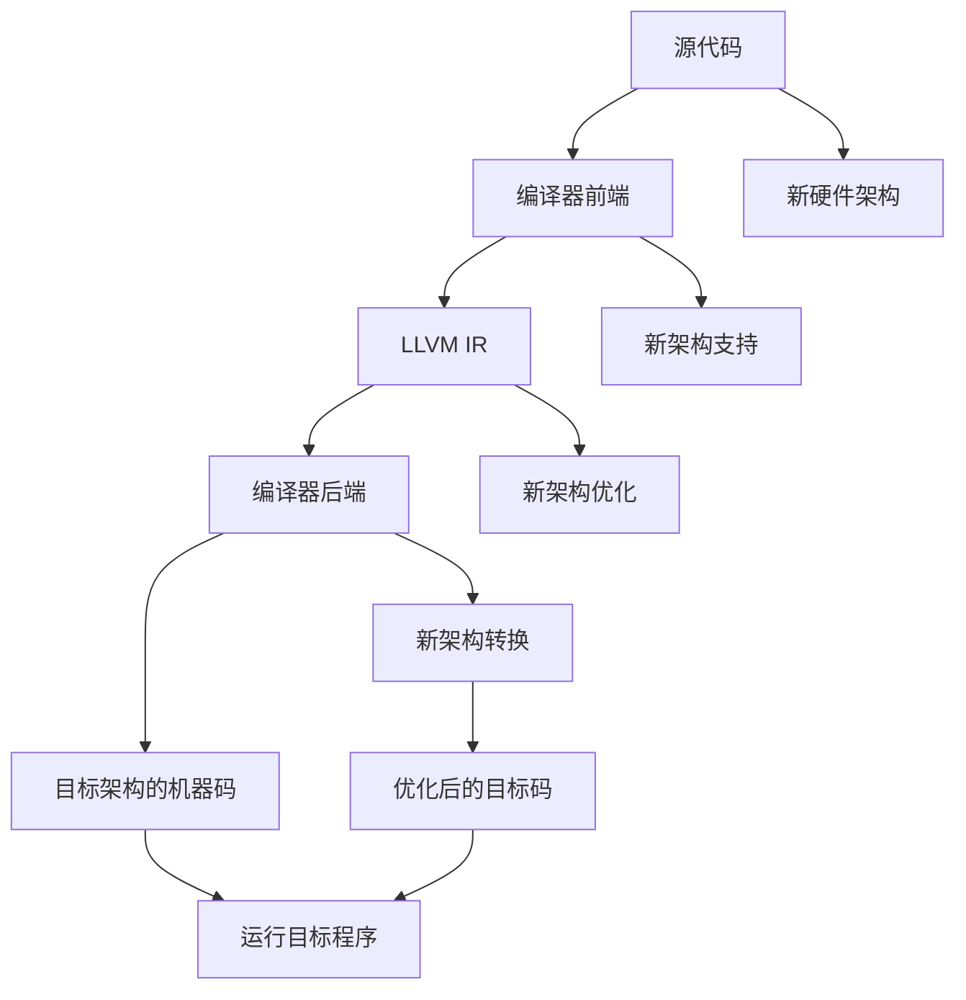

                 

# LLVM后端开发：针对新硬件架构的编译器扩展

> 关键词：LLVM, 编译器, 硬件架构, 低功耗, 多核处理器, 量子计算机, 新型存储器

## 1. 背景介绍

在当今高速发展的科技时代，计算架构的多样性和复杂性已经超越了传统的冯诺依曼模型。伴随着新硬件架构的不断涌现，传统的编译器技术面临严峻挑战。如何使编译器有效地支持新硬件特性，并优化性能和功耗，成为了硬件后端开发的一项关键任务。LLVM（LLow-Level Virtual Machine），作为一种先进的、开源的编译器基础设施，为这一挑战提供了强大的工具和平台。

## 2. 核心概念与联系

### 2.1 核心概念概述

在深入探讨新硬件架构的编译器扩展之前，我们需要先了解一些关键概念：

- **LLVM**：LLVM是一个低级虚拟机器，用于将源代码转换为机器代码，支持多种编程语言和架构，是现代编译器的重要基础设施。
- **编译器前端（Frontend）**：负责将高级语言代码解析为中间表示，例如LLVM的IR（Intermediate Representation）。
- **编译器后端（Backend）**：负责将中间表示转换成特定硬件的机器代码，包括目标架构的优化。
- **新硬件架构**：如多核处理器、低功耗处理器、量子计算机、新型存储器等，这些架构通常具有独特的数据流、控制流和内存访问模式。

### 2.2 核心概念原理和架构的 Mermaid 流程图



这个图表展示了从源代码到运行目标程序的一般编译器流程，以及新硬件架构如何通过编译器前端和后端的扩展得到支持。

## 3. 核心算法原理 & 具体操作步骤

### 3.1 算法原理概述

针对新硬件架构的编译器扩展，主要涉及三个方面：

1. **新架构的表示与支持**：首先需要将新硬件架构的特性和限制，转化为编译器可以理解和优化的形式。
2. **中间表示的适配**：将中间表示（IR）适应新架构的特点，包括数据流模型、指令集和寄存器架构等。
3. **目标码的生成与优化**：最终生成并优化适合新架构的机器码，提升性能和功耗效率。

### 3.2 算法步骤详解

以下是一个针对新硬件架构（例如低功耗处理器）的编译器扩展步骤：

**Step 1: 新架构分析与表示**
- 收集新硬件架构的特性文档和规格。
- 设计并实现新架构的数据流模型，包括指令集、寄存器架构、内存层次结构等。

**Step 2: 中间表示适配**
- 将新架构的数据流模型映射到LLVM IR中，为新的数据类型和指令创建对应的IR节点。
- 实现中间表示的转换规则，包括类型转换、控制流映射、内存布局等。

**Step 3: 目标码生成与优化**
- 生成新架构的目标码，通过优化技术如指令调度、寄存器分配、并行化等提高性能。
- 引入新架构特有的优化策略，如动态电压调节、动态线程调度等。

**Step 4: 性能评估与调优**
- 在模拟和真实硬件上测试生成的目标码，评估性能和功耗。
- 使用性能分析工具如perf、gprof等，识别瓶颈并进行优化。

### 3.3 算法优缺点

新硬件架构的编译器扩展具有以下优点：
1. **支持多样化硬件**：LLVM具有高度的可扩展性，可以轻松集成新硬件架构。
2. **可维护性**：模块化的设计和清晰的接口，使得扩展和维护更加容易。
3. **优化潜力**：通过专门的优化策略，能够有效提升新架构的性能和能效。

同时，也存在一些挑战：
1. **工作量大**：新架构的特性可能非常复杂，需要大量时间和精力进行分析和实现。
2. **兼容性问题**：新架构和现有架构的兼容问题，可能会影响已有应用兼容性。
3. **硬件演化**：硬件架构的快速变化，要求编译器快速适应，增加了维护难度。

### 3.4 算法应用领域

新硬件架构的编译器扩展，主要应用于以下领域：

1. **低功耗处理器**：如ARM Cortex-A系列，通过微架构优化和动态电压调节，提高能效比。
2. **多核处理器**：如Intel的Xeon Scalable系列，通过并行化和线程调度优化，提高性能。
3. **量子计算机**：如IBM Q系统，需要开发新的IR和代码生成策略，适应量子位的特殊特性。
4. **新型存储器**：如3D NAND闪存、忆阻器，需要优化存储访问模式和功耗。

## 4. 数学模型和公式 & 详细讲解 & 举例说明

### 4.1 数学模型构建

假设我们正在为一种新型低功耗处理器设计编译器后端。可以构建以下数学模型：

- **数据流模型**：描述指令流、数据依赖、资源竞争等。
- **性能模型**：基于硬件特性和编译优化，预测性能指标。
- **功耗模型**：根据频率、电压和计算量，计算功耗。

### 4.2 公式推导过程

我们以低功耗处理器为例，推导性能和功耗的计算公式：

- **性能模型**：设$P$为性能，$C$为周期数，$I$为指令数量，则有$P = \frac{I}{C}$。
- **功耗模型**：设$E$为功耗，$V$为电压，$F$为频率，$C$为周期数，则有$E = C \cdot V^2 \cdot F$。

### 4.3 案例分析与讲解

在实际应用中，可以选取典型场景进行案例分析。例如，为ARM Cortex-A55处理器设计编译器后端。首先分析其数据流模型，然后设计IR映射规则，最后进行目标码生成和优化，最终评估性能和功耗。

## 5. 项目实践：代码实例和详细解释说明

### 5.1 开发环境搭建

要搭建一个针对低功耗处理器的LLVM编译器后端开发环境，需要以下步骤：

1. 安装LLVM工具链：从官网下载安装包，并配置环境变量。
2. 安装必要的编译器前端：如Clang、GCC等。
3. 安装目标架构模拟器：如QEMU、FastRISC-V等。

### 5.2 源代码详细实现

以下是一个简单的LLVM IR转低功耗处理器的IR转换规则实现：

```c++
// IRNode.h
class IRNode {
public:
    virtual void mapToLowPowerIr() = 0;
};

// LowPowerIr.h
class LowPowerIr {
public:
    void translateToLowPowerIr(IRNode* node);
};

// X86Ir.h
class X86Ir : public IRNode {
public:
    void mapToLowPowerIr() override;
};

// mapToLowPowerIr方法实现
void X86Ir::mapToLowPowerIr() {
    // 实现X86 IR到低功耗IR的转换
    // 例如，将X86的LOAD指令转换为低功耗的LOAD指令
    LowPowerIr::translateToLowPowerIr(this);
}
```

### 5.3 代码解读与分析

在这个例子中，我们定义了三个IR节点类，分别代表通用IR节点、低功耗IR节点和X86IR节点。`mapToLowPowerIr`方法实现了IR节点间的映射转换，以适应低功耗架构。通过继承和重写方法，实现从X86到低功耗架构的转换。

### 5.4 运行结果展示

在测试新架构的编译器后端时，可以编写测试用例，使用模拟器运行生成的目标码，并对比性能和功耗的提升。

## 6. 实际应用场景

### 6.1 低功耗处理器

在低功耗处理器上，编译器后端扩展可以显著提高能效比。通过动态电压调节、唤醒逻辑优化等策略，可以在不增加功耗的情况下，提升处理器性能。

### 6.2 多核处理器

多核处理器需要高效的并行化优化。编译器后端扩展可以利用数据流分析和指令调度技术，合理分配任务到各个核心，提高并发执行效率。

### 6.3 量子计算机

量子计算机需要新的IR设计和指令生成策略，以适应量子位的特殊特性。编译器后端扩展可以实现量子逻辑的抽象和映射，提升量子程序的执行效率。

### 6.4 未来应用展望

随着新硬件架构的不断涌现，编译器后端扩展将持续面临新的挑战和机会。未来的研究方向可能包括：

1. **混合架构**：支持多种硬件架构共存，提供灵活的代码生成策略。
2. **自适应优化**：根据实时数据和环境，动态调整编译器参数。
3. **安全性优化**：在硬件安全性增强的前提下，优化安全代码的执行效率。

## 7. 工具和资源推荐

### 7.1 学习资源推荐

要深入了解LLVM后端开发，以下资源非常有帮助：

1. **LLVM官方文档**：包含详细的IR设计和代码生成原理。
2. **MIPS和RISC-V文档**：了解低功耗处理器架构。
3. **量子计算教程**：了解量子硬件特性和编译策略。

### 7.2 开发工具推荐

以下是一些常用的开发工具：

1. **LLVM工具链**：提供编译器前端的支持和优化后端生成。
2. **QEMU和FastRISC-V**：用于硬件模拟和测试。
3. **GDB和perf**：性能分析工具，用于调试和优化。

### 7.3 相关论文推荐

为了深入理解新硬件架构的编译器扩展，以下论文非常值得阅读：

1. **"Optimizing Embedded Systems with LLVM"**：探讨了LLVM在嵌入式系统中的优化技术。
2. **"Compiler Optimizations for Quantum Computing"**：研究了量子计算的编译器和优化策略。
3. **"Energy-Aware Compiler Optimization for Low-Power Processors"**：探讨了低功耗处理器的编译器优化。

## 8. 总结：未来发展趋势与挑战

### 8.1 研究成果总结

本文探讨了LLVM后端开发在针对新硬件架构的编译器扩展中的应用。总结了新架构分析、中间表示适配和目标码优化的核心步骤，并通过案例分析展示了其具体实现。

### 8.2 未来发展趋势

未来的趋势包括：

1. **自动化优化**：利用机器学习和数据驱动技术，实现自动化编译器优化。
2. **跨架构优化**：支持多种硬件架构的优化，提供统一的优化策略。
3. **跨平台兼容**：实现跨平台和跨硬件架构的代码生成和优化。

### 8.3 面临的挑战

挑战包括：

1. **硬件快速演化**：硬件架构的快速变化要求编译器快速适应。
2. **资源限制**：新架构的复杂性可能带来高开发成本。
3. **性能和功耗平衡**：在提高性能的同时，需要降低功耗。

### 8.4 研究展望

未来的研究方向包括：

1. **自动化编译优化**：结合AI和ML技术，实现自动化的编译器优化。
2. **硬件虚拟化**：利用虚拟化技术，实现跨硬件平台的兼容。
3. **新架构支持**：继续拓展LLVM对新硬件架构的支持，提高性能和能效。

## 9. 附录：常见问题与解答

**Q1: 如何评估编译器后端扩展的性能和功耗？**

A: 通常使用模拟器和硬件测试平台进行评估。可以收集指令执行周期、频率、功耗等数据，通过性能和功耗分析工具进行对比。

**Q2: 新架构的编译器扩展需要哪些技能？**

A: 需要掌握硬件架构知识、编译器原理、中间表示设计和优化技术。同时，还需要具备编程和测试能力，能够实现IR映射和目标码生成。

**Q3: 新架构的编译器扩展需要哪些工具？**

A: 需要使用LLVM工具链、模拟器、性能分析工具等。具体工具包括QEMU、FastRISC-V、GDB、perf等。

---

作者：禅与计算机程序设计艺术 / Zen and the Art of Computer Programming

