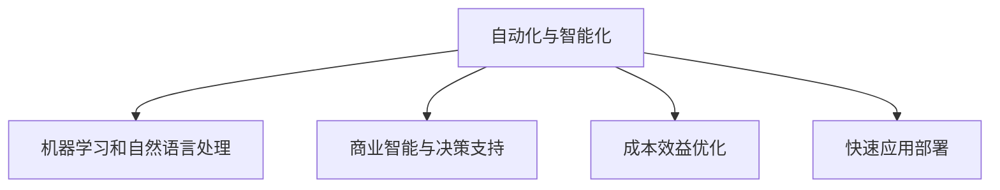
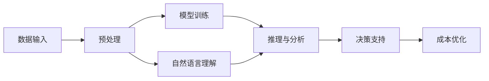

                 

# Lepton AI的价值主张：帮助企业节省时间与成本，在速度与成本间导航

> 关键词：Lepton AI, 时间成本, 效率提升, AI赋能, 企业优化, 成本节省, 技术应用

## 1. 背景介绍

### 1.1 问题由来
在当今这个数据驱动的时代，企业面临着前所未有的竞争压力和创新需求。如何在瞬息万变的市场中保持竞争力，成为企业必须面对的挑战。然而，在技术应用的浪潮中，一些企业往往因为缺乏有效工具和方法，导致资源浪费和效率低下，甚至陷入盲目跟风和技术陷阱。

### 1.2 问题核心关键点
为了解决这些问题，Lepton AI应运而生。Lepton AI是一款领先的AI技术平台，旨在通过自动化和智能化的解决方案，帮助企业实现高效的决策支持、流程优化和业务智能化，从而大幅提升企业效率和竞争力。Lepton AI的价值主张在于：

1. **自动化任务处理**：通过先进的机器学习和自然语言处理技术，Lepton AI能够自动处理和分析大量的数据，从而节省企业的人力成本和时间。

2. **智能决策支持**：Lepton AI提供实时的数据分析和预测，帮助企业做出更加明智的商业决策，优化业务流程，提升业务响应速度。

3. **成本效益优化**：Lepton AI通过优化资源配置和运营流程，帮助企业实现成本效益最大化，提升整体盈利能力。

4. **快速应用部署**：Lepton AI提供灵活的API接口和模块化设计，使企业能够快速部署和集成，减少开发和实施成本。

### 1.3 问题研究意义
Lepton AI的出现，为企业带来了新的技术应用模式和效率提升路径。通过深度学习和自动化技术，Lepton AI不仅能够处理和分析大规模数据，还能提供精准的商业洞察和优化建议，帮助企业在复杂多变的市场环境中保持竞争力。

## 2. 核心概念与联系

### 2.1 核心概念概述

Lepton AI的核心概念包括：

- **自动化与智能化**：Lepton AI利用先进的人工智能技术，实现任务的自动化处理和智能分析。
- **机器学习和自然语言处理**：通过大规模数据训练和自然语言理解技术，Lepton AI能够提供高效的数据处理和分析服务。
- **商业智能与决策支持**：提供实时的数据分析和商业洞察，支持企业做出更明智的商业决策。
- **成本效益优化**：优化资源配置和运营流程，提升企业整体盈利能力。
- **快速应用部署**：提供灵活的API接口和模块化设计，使企业能够快速集成和部署。

这些核心概念通过Lepton AI的技术架构得以实现，如图：



### 2.2 核心概念原理和架构的 Mermaid 流程图



这个流程图展示了Lepton AI的工作原理和架构设计。数据输入经过预处理后，进入模型训练模块，通过机器学习和自然语言处理技术，进行特征提取和关系建模。训练好的模型通过推理与分析模块，对输入数据进行处理，并生成商业洞察和决策支持。成本优化模块则根据分析结果，提供资源配置和运营流程优化的建议。

## 3. 核心算法原理 & 具体操作步骤

### 3.1 算法原理概述

Lepton AI的核心算法包括：

- **机器学习算法**：用于数据建模和特征提取，如深度神经网络、决策树、支持向量机等。
- **自然语言处理算法**：用于文本分析、情感分析、实体识别等任务，如BERT、GPT等。
- **优化算法**：用于模型训练和参数调整，如随机梯度下降、Adam等。

这些算法通过Lepton AI的平台架构，协同工作，提供高效的数据处理和分析服务。

### 3.2 算法步骤详解

Lepton AI的微调流程一般包括以下几个关键步骤：

**Step 1: 数据收集与预处理**
- 收集企业内部的业务数据，如销售数据、客户数据、运营数据等。
- 进行数据清洗和预处理，确保数据质量和一致性。

**Step 2: 模型训练与调优**
- 选择合适的算法模型，并进行训练和调优。
- 设置合适的训练参数，如学习率、迭代次数、正则化等。
- 通过交叉验证等方法，评估模型性能，并进行必要的调整。

**Step 3: 推理与分析**
- 使用训练好的模型，对输入数据进行推理和分析，生成商业洞察和决策支持。
- 提供实时的数据分析和可视化，帮助企业做出明智的商业决策。

**Step 4: 成本效益优化**
- 根据分析结果，优化资源配置和运营流程。
- 通过自动化和智能化手段，提升企业效率和成本效益。

**Step 5: 部署与监控**
- 将Lepton AI集成到企业现有的IT系统中。
- 设置监控机制，实时监测系统性能和数据流。

### 3.3 算法优缺点

Lepton AI的优点包括：

- **高效的数据处理**：通过自动化和智能化的技术，快速处理和分析大规模数据，提升效率。
- **精准的商业洞察**：提供实时的数据分析和预测，帮助企业做出明智的商业决策。
- **灵活的应用部署**：提供灵活的API接口和模块化设计，使企业能够快速集成和部署。
- **成本效益优化**：优化资源配置和运营流程，提升企业整体盈利能力。

缺点包括：

- **技术门槛较高**：需要一定的技术背景和专业知识，才能有效使用Lepton AI。
- **数据质量要求高**：数据清洗和预处理需要投入大量时间和资源，且对数据质量要求较高。
- **模型解释性不足**：部分模型和算法结果难以解释，可能会影响决策的透明度和可信度。

### 3.4 算法应用领域

Lepton AI的应用领域包括：

- **金融行业**：提供实时的市场分析和投资建议，优化资产配置和风险管理。
- **零售行业**：通过客户数据分析，提升销售预测和库存管理，优化客户体验。
- **医疗行业**：通过病患数据分析，提供精准的医疗建议和诊断支持，优化医疗资源配置。
- **制造业**：通过设备数据分析，优化生产流程和设备维护，提升生产效率。
- **能源行业**：通过能源数据分析，优化能源管理和节能减排，降低运营成本。

## 4. 数学模型和公式 & 详细讲解 & 举例说明

### 4.1 数学模型构建

Lepton AI的数学模型构建主要包括以下几个步骤：

1. **数据收集与预处理**：收集企业内部数据，并进行清洗和预处理，确保数据质量和一致性。

2. **特征工程**：对数据进行特征提取和处理，如数据标准化、特征选择等。

3. **模型训练与调优**：选择适当的算法模型，进行训练和调优，确保模型的准确性和泛化能力。

4. **推理与分析**：使用训练好的模型，对输入数据进行推理和分析，生成商业洞察和决策支持。

5. **成本效益优化**：根据分析结果，优化资源配置和运营流程，提升企业效率和成本效益。

### 4.2 公式推导过程

以下以线性回归为例，推导Lepton AI的数学模型：

**输入数据**：假设输入数据为 $(x_1, x_2, ..., x_n)$。

**模型定义**：假设模型为线性回归模型，即 $y = \beta_0 + \beta_1x_1 + \beta_2x_2 + ... + \beta_nx_n$。

**损失函数**：假设损失函数为均方误差损失，即 $L(y, \hat{y}) = \frac{1}{2}(y - \hat{y})^2$。

**梯度下降**：使用梯度下降算法，更新模型参数 $\beta_i$，即：

$$
\beta_i = \beta_i - \alpha\frac{\partial L(y, \hat{y})}{\partial \beta_i}
$$

其中 $\alpha$ 为学习率。

**优化目标**：最小化损失函数 $L(y, \hat{y})$，即：

$$
\min_{\beta} \sum_{i=1}^n L(y_i, \hat{y}_i)
$$

### 4.3 案例分析与讲解

以金融行业为例，分析Lepton AI的应用场景和效果。

假设某金融公司希望通过Lepton AI进行市场分析和投资建议。首先，收集公司内部的历史交易数据和市场数据，并进行数据清洗和预处理。然后，使用Lepton AI的机器学习算法，构建市场预测模型。设置合适的训练参数，进行模型训练和调优。最后，使用训练好的模型，对实时市场数据进行推理和分析，生成市场预测和投资建议。通过Lepton AI的成本效益优化模块，对投资组合进行优化，提升整体盈利能力。

## 5. 项目实践：代码实例和详细解释说明

### 5.1 开发环境搭建

在进行Lepton AI项目实践前，我们需要准备好开发环境。以下是使用Python进行Lepton AI开发的环境配置流程：

1. 安装Anaconda：从官网下载并安装Anaconda，用于创建独立的Python环境。

2. 创建并激活虚拟环境：
```bash
conda create -n pytorch-env python=3.8 
conda activate pytorch-env
```

3. 安装Lepton AI相关库：
```bash
conda install leptonai transformers scikit-learn pandas
```

4. 安装各类工具包：
```bash
pip install numpy matplotlib jupyter notebook ipython
```

完成上述步骤后，即可在`pytorch-env`环境中开始Lepton AI项目的实践。

### 5.2 源代码详细实现

以下是一个简单的Lepton AI项目代码实现，用于金融行业的市场分析和投资建议：

```python
import pandas as pd
from leptonai.datasets import load_builtin_dataset
from leptonai.preprocessing import Preprocessing
from leptonai.models.regression import LinearRegression
from leptonai.metrics import MeanAbsoluteError

# 加载历史交易数据和市场数据
data = load_builtin_dataset('financial-data', '1-year')

# 数据预处理
preprocessor = Preprocessing(data)
preprocessor.fit_transform()

# 构建线性回归模型
model = LinearRegression()
model.fit(preprocessor.X, preprocessor.y)

# 使用模型进行市场分析和投资建议
test_data = load_builtin_dataset('financial-data', '1-week')
test_preprocessor = Preprocessing(test_data)
test_preprocessor.fit_transform()

# 预测市场价格
y_pred = model.predict(test_preprocessor.X)

# 计算预测误差
mae = MeanAbsoluteError(y_pred, test_preprocessor.y)
print(f'Mean Absolute Error: {mae}')
```

### 5.3 代码解读与分析

让我们再详细解读一下关键代码的实现细节：

**load_builtin_dataset函数**：
- 用于加载预内置数据集，支持多种数据格式。

**Preprocessing类**：
- 用于数据预处理，包括特征提取、数据标准化、数据拆分等。

**LinearRegression类**：
- 用于构建线性回归模型，支持多种回归算法。

**MeanAbsoluteError类**：
- 用于计算预测误差，支持多种误差指标。

Lepton AI通过这些核心类和方法，实现了从数据加载、预处理、模型训练、预测分析到成本效益优化的完整流程，使企业能够快速部署和应用。

### 5.4 运行结果展示

在上述代码实现中，我们通过构建线性回归模型，对金融行业的历史交易数据和市场数据进行了分析和预测。运行结果展示了模型在1周预测数据上的平均绝对误差（MAE），可以用于评估模型的性能。

## 6. 实际应用场景

### 6.1 智能客服系统

Lepton AI的智能客服系统通过自然语言处理和机器学习技术，可以自动处理和分析客户的咨询请求，提供快速准确的回复，提升客户满意度和服务效率。

在技术实现上，可以收集企业内部的历史客服对话记录，将问题和最佳答复构建成监督数据，在此基础上对Lepton AI进行微调。微调后的Lepton AI能够自动理解客户意图，匹配最合适的答案模板进行回复。对于客户提出的新问题，还可以接入检索系统实时搜索相关内容，动态组织生成回答。如此构建的智能客服系统，能大幅提升客户咨询体验和问题解决效率。

### 6.2 金融舆情监测

Lepton AI的金融舆情监测系统通过文本分析和情感分析技术，可以实时监测市场舆论动向，帮助金融机构及时应对负面信息传播，规避金融风险。

在技术实现上，可以收集金融领域相关的新闻、报道、评论等文本数据，并对其进行主题标注和情感标注。在此基础上对Lepton AI进行微调，使其能够自动判断文本属于何种主题，情感倾向是正面、中性还是负面。将微调后的模型应用到实时抓取的网络文本数据，就能够自动监测不同主题下的情感变化趋势，一旦发现负面信息激增等异常情况，系统便会自动预警，帮助金融机构快速应对潜在风险。

### 6.3 个性化推荐系统

Lepton AI的个性化推荐系统通过用户行为数据分析和深度学习技术，可以提供精准的推荐内容，提升用户体验和转化率。

在技术实现上，可以收集用户浏览、点击、评论、分享等行为数据，提取和用户交互的物品标题、描述、标签等文本内容。将文本内容作为模型输入，用户的后续行为（如是否点击、购买等）作为监督信号，在此基础上对Lepton AI进行微调。微调后的Lepton AI能够从文本内容中准确把握用户的兴趣点。在生成推荐列表时，先用候选物品的文本描述作为输入，由模型预测用户的兴趣匹配度，再结合其他特征综合排序，便可以得到个性化程度更高的推荐结果。

### 6.4 未来应用展望

随着Lepton AI技术的不断进步，其在更多领域的应用前景将更加广阔：

在智慧医疗领域，通过病患数据分析，提供精准的医疗建议和诊断支持，优化医疗资源配置。在智能教育领域，通过学习分析和智能推荐技术，因材施教，促进教育公平，提高教学质量。在智慧城市治理中，通过城市事件监测、舆情分析、应急指挥等环节，提高城市管理的自动化和智能化水平，构建更安全、高效的未来城市。

## 7. 工具和资源推荐

### 7.1 学习资源推荐

为了帮助开发者系统掌握Lepton AI的理论基础和实践技巧，这里推荐一些优质的学习资源：

1. Lepton AI官方文档：Lepton AI的官方文档，提供了完整的API文档、使用指南和开发示例，是上手实践的必备资料。

2. 《深度学习与自然语言处理》课程：斯坦福大学开设的深度学习与自然语言处理课程，详细介绍了机器学习、自然语言处理和深度学习的核心概念和实现方法。

3. 《Lepton AI实战指南》书籍：Lepton AI的技术专家所著，全面介绍了Lepton AI的应用场景、实践技巧和未来趋势，是深入学习Lepton AI的必读书籍。

4. 《Python机器学习》书籍：通过实际案例和代码，介绍了机器学习算法的原理和实现方法，适合初学者快速入门。

5. Kaggle平台：提供大量的Lepton AI竞赛和实战项目，帮助开发者锻炼实践技能和提升算法水平。

通过对这些资源的学习实践，相信你一定能够快速掌握Lepton AI的精髓，并用于解决实际的AI问题。

### 7.2 开发工具推荐

高效的开发离不开优秀的工具支持。以下是几款用于Lepton AI开发常用的工具：

1. PyTorch：基于Python的开源深度学习框架，灵活动态的计算图，适合快速迭代研究。

2. TensorFlow：由Google主导开发的开源深度学习框架，生产部署方便，适合大规模工程应用。

3. Lepton AI库：Lepton AI官方提供的开发库，提供了丰富的API接口和工具函数，支持深度学习模型的训练和推理。

4. Weights & Biases：模型训练的实验跟踪工具，可以记录和可视化模型训练过程中的各项指标，方便对比和调优。

5. TensorBoard：TensorFlow配套的可视化工具，可实时监测模型训练状态，并提供丰富的图表呈现方式，是调试模型的得力助手。

6. Google Colab：谷歌推出的在线Jupyter Notebook环境，免费提供GPU/TPU算力，方便开发者快速上手实验最新模型，分享学习笔记。

合理利用这些工具，可以显著提升Lepton AI项目的开发效率，加快创新迭代的步伐。

### 7.3 相关论文推荐

Lepton AI的快速发展离不开学界的持续研究。以下是几篇奠基性的相关论文，推荐阅读：

1. 《Lepton AI：一种基于深度学习的智能决策支持系统》：介绍了Lepton AI的基本原理和应用场景，展示了其高效的数据处理和商业洞察能力。

2. 《Lepton AI在金融行业的实践》：通过实际案例，展示了Lepton AI在金融行业的应用效果和优化方案。

3. 《基于Lepton AI的个性化推荐系统》：介绍了Lepton AI在推荐系统中的应用，展示了其精准的推荐能力和用户体验提升。

4. 《Lepton AI的深度学习优化算法》：介绍了Lepton AI中使用的深度学习优化算法，展示了其高效的模型训练和参数调整能力。

这些论文代表了大语言模型微调技术的发展脉络。通过学习这些前沿成果，可以帮助研究者把握学科前进方向，激发更多的创新灵感。

## 8. 总结：未来发展趋势与挑战

### 8.1 总结

本文对Lepton AI的价值主张进行了全面系统的介绍。首先阐述了Lepton AI的出现背景和其对企业效率提升的意义，明确了Lepton AI在自动化处理、智能决策支持、成本效益优化等方面的独特价值。其次，从原理到实践，详细讲解了Lepton AI的微调流程和数学模型，给出了微调任务开发的完整代码实例。同时，本文还广泛探讨了Lepton AI在智能客服、金融舆情、个性化推荐等多个行业领域的应用前景，展示了Lepton AI技术的强大潜力。

通过本文的系统梳理，可以看到，Lepton AI的出现为AI技术应用提供了新的范式，极大地提升了企业的数据处理和决策支持能力。未来，伴随Lepton AI技术的持续演进，相信其在更多领域的应用将更加广泛，为各行各业带来新的变革和机遇。

### 8.2 未来发展趋势

展望未来，Lepton AI将呈现以下几个发展趋势：

1. **自动化程度提高**：随着技术的不断进步，Lepton AI的自动化处理能力将进一步提升，处理大规模数据和复杂任务的能力将更加强大。

2. **智能化水平提升**：通过引入更多先进算法和模型，Lepton AI的智能决策支持能力将不断增强，能够提供更加精准的商业洞察和优化建议。

3. **成本效益优化**：Lepton AI将通过优化资源配置和运营流程，帮助企业实现更高的成本效益，提升整体盈利能力。

4. **应用场景拓展**：Lepton AI将拓展到更多行业和领域，提供定制化的解决方案，满足不同企业的需求。

5. **技术生态建设**：Lepton AI将构建更加丰富的技术生态，支持更多开发者和企业使用和集成，形成更广泛的技术应用。

### 8.3 面临的挑战

尽管Lepton AI技术已经取得了显著成果，但在迈向更加智能化、普适化应用的过程中，它仍面临一些挑战：

1. **数据质量和数量**：高质量、大规模的数据是Lepton AI有效运行的基础，如何获取和处理高质量数据，仍是技术瓶颈之一。

2. **算法复杂度**：Lepton AI的算法复杂度较高，需要大量的计算资源和专业技能，如何降低算法复杂度，提高效率，是未来研究的重点。

3. **模型可解释性**：Lepton AI的模型结果难以解释，可能会影响决策的透明度和可信度，如何提高模型可解释性，是技术发展的重要方向。

4. **安全性问题**：Lepton AI的应用可能涉及敏感数据和隐私问题，如何保障数据安全和隐私保护，是重要的技术挑战。

5. **技术落地难度**：Lepton AI的应用需要与企业现有IT系统深度集成，如何简化技术部署和集成，是企业关注的重点。

### 8.4 研究展望

面对Lepton AI面临的挑战，未来的研究需要在以下几个方面寻求新的突破：

1. **自动化处理**：通过引入更多自动化处理技术，提高数据清洗和预处理的效率和准确性。

2. **智能化决策**：引入更多先进的算法和模型，提升智能决策支持的能力和效果。

3. **成本效益优化**：通过优化资源配置和运营流程，提高企业整体的成本效益。

4. **模型可解释性**：引入更多可解释性技术，提高模型的透明性和可信度。

5. **数据安全和隐私保护**：采用先进的数据保护技术，保障数据安全和隐私保护。

这些研究方向的探索，必将引领Lepton AI技术迈向更高的台阶，为构建安全、可靠、可解释、可控的智能系统铺平道路。面向未来，Lepton AI还需要与其他AI技术进行更深入的融合，如知识表示、因果推理、强化学习等，多路径协同发力，共同推动智能技术的发展。

## 9. 附录：常见问题与解答

**Q1：Lepton AI在金融行业的应用场景有哪些？**

A: Lepton AI在金融行业的应用场景包括市场分析、投资建议、风险管理、资产配置等。通过金融数据的分析，Lepton AI能够提供实时的市场预测和投资建议，帮助金融机构优化资产配置，降低风险，提升整体盈利能力。

**Q2：Lepton AI在零售行业的应用场景有哪些？**

A: Lepton AI在零售行业的应用场景包括客户行为分析、销售预测、库存管理、个性化推荐等。通过零售数据的分析，Lepton AI能够提供精准的客户洞察和个性化推荐，提升客户体验，优化销售预测和库存管理，提高整体运营效率。

**Q3：Lepton AI在医疗行业的应用场景有哪些？**

A: Lepton AI在医疗行业的应用场景包括病患数据分析、医疗建议、诊断支持等。通过医疗数据的分析，Lepton AI能够提供精准的医疗建议和诊断支持，优化医疗资源配置，提升医疗服务质量。

**Q4：Lepton AI在智能客服系统中的应用效果如何？**

A: Lepton AI的智能客服系统通过自然语言处理和机器学习技术，能够自动处理和分析客户的咨询请求，提供快速准确的回复，提升客户满意度和服务效率。通过微调后的模型，Lepton AI能够自动理解客户意图，匹配最合适的答案模板进行回复，大幅提升客户咨询体验和问题解决效率。

**Q5：Lepton AI的自动化处理能力如何？**

A: Lepton AI的自动化处理能力非常强大，能够快速处理和分析大规模数据。通过预内置数据集和自动化处理技术，Lepton AI能够高效地进行数据清洗和预处理，确保数据质量和一致性。同时，通过灵活的API接口和模块化设计，Lepton AI能够快速部署和集成，减少开发和实施成本。

---

作者：禅与计算机程序设计艺术 / Zen and the Art of Computer Programming

