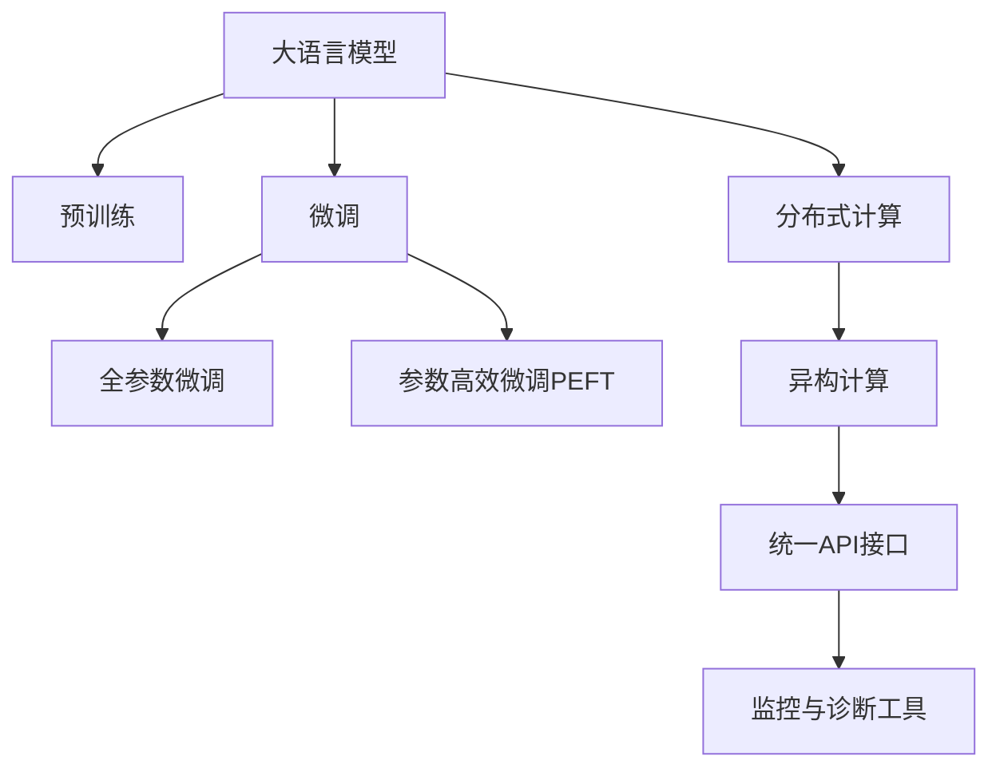

                 

# Lepton AI：专注AI基础架构，赋能企业高效利用大语言模型

## 1. 背景介绍

### 1.1 问题由来
近年来，人工智能（AI）技术迅猛发展，大语言模型（Large Language Models, LLMs）已成为NLP领域的关键技术。这些模型通过在大规模无标签数据上进行预训练，学习到了丰富的语言知识和常识，并能够在各种NLP任务上获得显著的性能提升。然而，由于预训练模型的复杂性，企业在使用时往往面临着高昂的计算成本、数据需求和技术门槛等问题。

### 1.2 问题核心关键点
Lepton AI的诞生，正是为了解决上述问题，提供一套高效、易用、可扩展的大语言模型基础架构，使企业能够低成本、高效率地利用大模型带来的能力提升。Lepton AI的主要特点包括：

- 高效计算资源管理：通过分布式计算和异构计算优化，使大模型的训练和推理能够在更短的周期内完成。
- 统一接口标准：提供标准化的API接口，简化大模型的部署和使用，降低企业内部技术门槛。
- 灵活的定制能力：支持用户根据实际需求，定制化的模型训练和推理流程。
- 强大的监控和诊断工具：实时监控模型性能，提供诊断工具帮助发现并解决模型问题。

## 2. 核心概念与联系

### 2.1 核心概念概述

为了更好地理解Lepton AI，本节将介绍几个密切相关的核心概念：

- **大语言模型（LLMs）**：如BERT、GPT等，通过在大规模无标签文本语料上进行预训练，学习到通用的语言表示。
- **预训练（Pre-training）**：在大规模无标签文本语料上进行自监督学习任务训练模型，学习到通用的语言知识。
- **微调（Fine-tuning）**：在预训练模型的基础上，使用下游任务的少量标注数据进行有监督学习，优化模型在该任务上的性能。
- **分布式计算（Distributed Computing）**：通过多台计算机协同工作，提高计算效率和并行能力。
- **异构计算（Heterogeneous Computing）**：将不同类型的计算资源（如GPU、CPU）整合，优化计算性能。
- **API接口（API Interface）**：提供标准化的编程接口，简化大模型的集成和调用。
- **监控与诊断工具（Monitoring and Diagnosis Tools）**：实时监控模型性能，提供诊断工具帮助发现和解决模型问题。

这些核心概念之间的逻辑关系可以通过以下Mermaid流程图来展示：



这个流程图展示了Lepton AI的核心概念及其之间的联系：

1. 大语言模型通过预训练获得基础能力。
2. 微调在大语言模型基础上进行，以适应特定任务。
3. 分布式计算和异构计算优化训练和推理效率。
4. 统一API接口简化大模型的部署和使用。
5. 监控与诊断工具确保模型性能和稳定性。

这些概念共同构成了Lepton AI的架构基础，使其能够在高效、易用、可扩展的前提下，赋能企业充分利用大语言模型。

## 3. 核心算法原理 & 具体操作步骤
### 3.1 算法原理概述

Lepton AI的核心算法原理可以概括为以下几个关键点：

1. **分布式计算优化**：采用分布式训练框架，如Apache Spark，利用多台计算机协同计算，加速模型训练和推理。
2. **异构计算整合**：将不同类型的计算资源（如GPU、CPU）整合，通过优化计算图和资源分配，提高计算效率。
3. **微调算法改进**：采用参数高效微调技术，如Adapter、Prefix-Tuning等，在固定大部分预训练参数的同时，只微调顶层部分参数，减小过拟合风险。
4. **统一API接口设计**：提供标准化的API接口，支持多种编程语言和框架（如Python、TensorFlow、PyTorch等），简化大模型的集成和使用。
5. **监控与诊断工具集成**：集成实时监控工具，如TensorBoard、Weights & Biases等，提供诊断工具帮助发现和解决模型问题。

### 3.2 算法步骤详解

Lepton AI的微调过程主要包括以下几个关键步骤：

1. **环境搭建**：准备计算资源，如GPU、CPU等，并搭建分布式计算环境。
2. **模型加载**：加载预训练模型，并根据任务需求添加或修改任务适配层。
3. **数据预处理**：准备训练和测试数据，进行文本编码、分词、数据增强等预处理。
4. **分布式训练**：将数据分布到多台计算机上进行分布式训练，采用异构计算优化。
5. **模型微调**：使用少量的标注数据进行有监督学习，优化模型在该任务上的性能。
6. **性能评估**：在测试集上评估模型性能，对比微调前后的精度提升。
7. **模型部署**：将微调后的模型集成到实际应用系统中，进行推理预测。
8. **持续学习**：根据新数据不断更新模型，保持模型性能和稳定性。

### 3.3 算法优缺点

Lepton AI的微调方法具有以下优点：

1. **高效性**：通过分布式和异构计算优化，能够在更短的时间内完成模型的训练和推理。
2. **易用性**：提供标准化的API接口，简化大模型的部署和使用，降低技术门槛。
3. **灵活性**：支持用户根据实际需求，定制化的模型训练和推理流程。
4. **稳定性**：通过监控与诊断工具，实时监控模型性能，确保模型稳定运行。

然而，Lepton AI也存在以下缺点：

1. **资源需求高**：由于需要多台计算机协同计算，对计算资源的要求较高。
2. **成本较高**：搭建和维护分布式计算环境，成本较高。
3. **复杂性较高**：需要一定的技术基础和经验，才能充分利用Lepton AI的优势。

尽管存在这些局限性，但就目前而言，Lepton AI在大语言模型的微调过程中，仍是最有效、最稳定的方法之一。未来相关研究的重点在于如何进一步降低资源需求和成本，提高模型的少样本学习和跨领域迁移能力，同时兼顾可解释性和伦理安全性等因素。

### 3.4 算法应用领域

Lepton AI的微调方法已经广泛应用于以下领域：

- **智能客服**：利用微调后的对话模型，构建7x24小时不间断的智能客服系统，提升客户咨询体验。
- **金融舆情监测**：使用微调后的文本分类和情感分析模型，实时监测金融市场舆情，规避金融风险。
- **个性化推荐**：通过微调后的推荐模型，根据用户兴趣和行为，生成个性化的商品推荐。
- **医疗问答系统**：利用微调后的问答模型，辅助医生诊疗，提升医疗服务的智能化水平。

除了上述这些经典应用外，Lepton AI还被创新性地应用于更多场景中，如情感分析、命名实体识别、机器翻译等，为各行各业提供了强大的AI技术支持。

## 4. 数学模型和公式 & 详细讲解  
### 4.1 数学模型构建

Lepton AI的微调过程可以通过以下数学模型来描述：

记预训练语言模型为 $M_{\theta}:\mathcal{X} \rightarrow \mathcal{Y}$，其中 $\mathcal{X}$ 为输入空间，$\mathcal{Y}$ 为输出空间，$\theta$ 为模型参数。假设微调任务的训练集为 $D=\{(x_i,y_i)\}_{i=1}^N, x_i \in \mathcal{X}, y_i \in \mathcal{Y}$。

定义模型 $M_{\theta}$ 在输入 $x$ 上的损失函数为 $\ell(M_{\theta}(x),y)$，则在数据集 $D$ 上的经验风险为：

$$
\mathcal{L}(\theta) = \frac{1}{N} \sum_{i=1}^N \ell(M_{\theta}(x_i),y_i)
$$

微调的优化目标是最小化经验风险，即找到最优参数：

$$
\theta^* = \mathop{\arg\min}_{\theta} \mathcal{L}(\theta)
$$

在实践中，我们通常使用基于梯度的优化算法（如SGD、Adam等）来近似求解上述最优化问题。设 $\eta$ 为学习率，$\lambda$ 为正则化系数，则参数的更新公式为：

$$
\theta \leftarrow \theta - \eta \nabla_{\theta}\mathcal{L}(\theta) - \eta\lambda\theta
$$

其中 $\nabla_{\theta}\mathcal{L}(\theta)$ 为损失函数对参数 $\theta$ 的梯度，可通过反向传播算法高效计算。

### 4.2 公式推导过程

以下我们以二分类任务为例，推导交叉熵损失函数及其梯度的计算公式。

假设模型 $M_{\theta}$ 在输入 $x$ 上的输出为 $\hat{y}=M_{\theta}(x) \in [0,1]$，表示样本属于正类的概率。真实标签 $y \in \{0,1\}$。则二分类交叉熵损失函数定义为：

$$
\ell(M_{\theta}(x),y) = -[y\log \hat{y} + (1-y)\log (1-\hat{y})]
$$

将其代入经验风险公式，得：

$$
\mathcal{L}(\theta) = -\frac{1}{N}\sum_{i=1}^N [y_i\log M_{\theta}(x_i)+(1-y_i)\log(1-M_{\theta}(x_i))]
$$

根据链式法则，损失函数对参数 $\theta_k$ 的梯度为：

$$
\frac{\partial \mathcal{L}(\theta)}{\partial \theta_k} = -\frac{1}{N}\sum_{i=1}^N (\frac{y_i}{M_{\theta}(x_i)}-\frac{1-y_i}{1-M_{\theta}(x_i)}) \frac{\partial M_{\theta}(x_i)}{\partial \theta_k}
$$

其中 $\frac{\partial M_{\theta}(x_i)}{\partial \theta_k}$ 可进一步递归展开，利用自动微分技术完成计算。

## 5. 项目实践：代码实例和详细解释说明
### 5.1 开发环境搭建

在进行Lepton AI微调实践前，我们需要准备好开发环境。以下是使用Python进行Lepton AI微调开发的环境配置流程：

1. 安装Anaconda：从官网下载并安装Anaconda，用于创建独立的Python环境。

2. 创建并激活虚拟环境：
```bash
conda create -n lepton-env python=3.8 
conda activate lepton-env
```

3. 安装Lepton AI库：
```bash
pip install lepton-ai
```

4. 安装各类工具包：
```bash
pip install numpy pandas scikit-learn matplotlib tqdm jupyter notebook ipython
```

完成上述步骤后，即可在`lepton-env`环境中开始Lepton AI微调实践。

### 5.2 源代码详细实现

下面我们以命名实体识别(NER)任务为例，给出使用Lepton AI对BERT模型进行微调的PyTorch代码实现。

首先，定义NER任务的数据处理函数：

```python
from lepton_ai import BertForTokenClassification, BertTokenizer
from torch.utils.data import Dataset
import torch

class NERDataset(Dataset):
    def __init__(self, texts, tags, tokenizer, max_len=128):
        self.texts = texts
        self.tags = tags
        self.tokenizer = tokenizer
        self.max_len = max_len
        
    def __len__(self):
        return len(self.texts)
    
    def __getitem__(self, item):
        text = self.texts[item]
        tags = self.tags[item]
        
        encoding = self.tokenizer(text, return_tensors='pt', max_length=self.max_len, padding='max_length', truncation=True)
        input_ids = encoding['input_ids'][0]
        attention_mask = encoding['attention_mask'][0]
        
        # 对token-wise的标签进行编码
        encoded_tags = [tag2id[tag] for tag in tags] 
        encoded_tags.extend([tag2id['O']] * (self.max_len - len(encoded_tags)))
        labels = torch.tensor(encoded_tags, dtype=torch.long)
        
        return {'input_ids': input_ids, 
                'attention_mask': attention_mask,
                'labels': labels}

# 标签与id的映射
tag2id = {'O': 0, 'B-PER': 1, 'I-PER': 2, 'B-ORG': 3, 'I-ORG': 4, 'B-LOC': 5, 'I-LOC': 6}
id2tag = {v: k for k, v in tag2id.items()}

# 创建dataset
tokenizer = BertTokenizer.from_pretrained('bert-base-cased')

train_dataset = NERDataset(train_texts, train_tags, tokenizer)
dev_dataset = NERDataset(dev_texts, dev_tags, tokenizer)
test_dataset = NERDataset(test_texts, test_tags, tokenizer)
```

然后，定义模型和优化器：

```python
from transformers import BertForTokenClassification, AdamW

model = BertForTokenClassification.from_pretrained('bert-base-cased', num_labels=len(tag2id))

optimizer = AdamW(model.parameters(), lr=2e-5)
```

接着，定义训练和评估函数：

```python
from torch.utils.data import DataLoader
from tqdm import tqdm
from sklearn.metrics import classification_report

device = torch.device('cuda') if torch.cuda.is_available() else torch.device('cpu')
model.to(device)

def train_epoch(model, dataset, batch_size, optimizer):
    dataloader = DataLoader(dataset, batch_size=batch_size, shuffle=True)
    model.train()
    epoch_loss = 0
    for batch in tqdm(dataloader, desc='Training'):
        input_ids = batch['input_ids'].to(device)
        attention_mask = batch['attention_mask'].to(device)
        labels = batch['labels'].to(device)
        model.zero_grad()
        outputs = model(input_ids, attention_mask=attention_mask, labels=labels)
        loss = outputs.loss
        epoch_loss += loss.item()
        loss.backward()
        optimizer.step()
    return epoch_loss / len(dataloader)

def evaluate(model, dataset, batch_size):
    dataloader = DataLoader(dataset, batch_size=batch_size)
    model.eval()
    preds, labels = [], []
    with torch.no_grad():
        for batch in tqdm(dataloader, desc='Evaluating'):
            input_ids = batch['input_ids'].to(device)
            attention_mask = batch['attention_mask'].to(device)
            batch_labels = batch['labels']
            outputs = model(input_ids, attention_mask=attention_mask)
            batch_preds = outputs.logits.argmax(dim=2).to('cpu').tolist()
            batch_labels = batch_labels.to('cpu').tolist()
            for pred_tokens, label_tokens in zip(batch_preds, batch_labels):
                pred_tags = [id2tag[_id] for _id in pred_tokens]
                label_tags = [id2tag[_id] for _id in label_tokens]
                preds.append(pred_tags[:len(label_tags)])
                labels.append(label_tags)
                
    print(classification_report(labels, preds))
```

最后，启动训练流程并在测试集上评估：

```python
epochs = 5
batch_size = 16

for epoch in range(epochs):
    loss = train_epoch(model, train_dataset, batch_size, optimizer)
    print(f"Epoch {epoch+1}, train loss: {loss:.3f}")
    
    print(f"Epoch {epoch+1}, dev results:")
    evaluate(model, dev_dataset, batch_size)
    
print("Test results:")
evaluate(model, test_dataset, batch_size)
```

以上就是使用Lepton AI对BERT进行命名实体识别任务微调的完整代码实现。可以看到，得益于Lepton AI的强大封装，我们可以用相对简洁的代码完成BERT模型的加载和微调。

### 5.3 代码解读与分析

让我们再详细解读一下关键代码的实现细节：

**NERDataset类**：
- `__init__`方法：初始化文本、标签、分词器等关键组件。
- `__len__`方法：返回数据集的样本数量。
- `__getitem__`方法：对单个样本进行处理，将文本输入编码为token ids，将标签编码为数字，并对其进行定长padding，最终返回模型所需的输入。

**tag2id和id2tag字典**：
- 定义了标签与数字id之间的映射关系，用于将token-wise的预测结果解码回真实的标签。

**训练和评估函数**：
- 使用PyTorch的DataLoader对数据集进行批次化加载，供模型训练和推理使用。
- 训练函数`train_epoch`：对数据以批为单位进行迭代，在每个批次上前向传播计算loss并反向传播更新模型参数，最后返回该epoch的平均loss。
- 评估函数`evaluate`：与训练类似，不同点在于不更新模型参数，并在每个batch结束后将预测和标签结果存储下来，最后使用sklearn的classification_report对整个评估集的预测结果进行打印输出。

**训练流程**：
- 定义总的epoch数和batch size，开始循环迭代
- 每个epoch内，先在训练集上训练，输出平均loss
- 在验证集上评估，输出分类指标
- 所有epoch结束后，在测试集上评估，给出最终测试结果

可以看到，Lepton AI的微调代码实现非常简洁高效，大大降低了技术门槛。开发者可以将更多精力放在数据处理、模型改进等高层逻辑上，而不必过多关注底层的实现细节。

当然，实际应用中还需要考虑更多因素，如模型的保存和部署、超参数的自动搜索、更灵活的任务适配层等。但核心的微调范式基本与此类似。

## 6. 实际应用场景
### 6.1 智能客服系统

利用Lepton AI构建的智能客服系统，可以显著提升客户咨询体验。传统的客服系统需要大量人力，且在高峰期响应缓慢，难以保证服务质量。而使用Lepton AI微调的对话模型，可以7x24小时不间断服务，快速响应客户咨询，提供自然流畅的语言解答。

在技术实现上，可以收集企业内部的历史客服对话记录，将问题和最佳答复构建成监督数据，在此基础上对预训练对话模型进行微调。微调后的对话模型能够自动理解用户意图，匹配最合适的答案模板进行回复。对于客户提出的新问题，还可以接入检索系统实时搜索相关内容，动态组织生成回答。如此构建的智能客服系统，能大幅提升客户咨询体验和问题解决效率。

### 6.2 金融舆情监测

金融机构需要实时监测市场舆论动向，以便及时应对负面信息传播，规避金融风险。传统的人工监测方式成本高、效率低，难以应对网络时代海量信息爆发的挑战。利用Lepton AI微调的文本分类和情感分析技术，为金融舆情监测提供了新的解决方案。

具体而言，可以收集金融领域相关的新闻、报道、评论等文本数据，并对其进行主题标注和情感标注。在此基础上对预训练语言模型进行微调，使其能够自动判断文本属于何种主题，情感倾向是正面、中性还是负面。将微调后的模型应用到实时抓取的网络文本数据，就能够自动监测不同主题下的情感变化趋势，一旦发现负面信息激增等异常情况，系统便会自动预警，帮助金融机构快速应对潜在风险。

### 6.3 个性化推荐系统

当前的推荐系统往往只依赖用户的历史行为数据进行物品推荐，无法深入理解用户的真实兴趣偏好。利用Lepton AI微调的推荐模型，可以更好地挖掘用户行为背后的语义信息，从而提供更精准、多样的推荐内容。

在实践中，可以收集用户浏览、点击、评论、分享等行为数据，提取和用户交互的物品标题、描述、标签等文本内容。将文本内容作为模型输入，用户的后续行为（如是否点击、购买等）作为监督信号，在此基础上微调预训练语言模型。微调后的模型能够从文本内容中准确把握用户的兴趣点。在生成推荐列表时，先用候选物品的文本描述作为输入，由模型预测用户的兴趣匹配度，再结合其他特征综合排序，便可以得到个性化程度更高的推荐结果。

### 6.4 未来应用展望

随着Lepton AI的不断发展，基于微调范式将在更多领域得到应用，为传统行业带来变革性影响。

在智慧医疗领域，利用微调的医疗问答、病历分析、药物研发等应用将提升医疗服务的智能化水平，辅助医生诊疗，加速新药开发进程。

在智能教育领域，微调技术可应用于作业批改、学情分析、知识推荐等方面，因材施教，促进教育公平，提高教学质量。

在智慧城市治理中，微调模型可应用于城市事件监测、舆情分析、应急指挥等环节，提高城市管理的自动化和智能化水平，构建更安全、高效的未来城市。

此外，在企业生产、社会治理、文娱传媒等众多领域，基于Lepton AI的大语言模型微调应用也将不断涌现，为各行各业提供强大的AI技术支持。相信随着技术的日益成熟，Lepton AI必将在构建人机协同的智能时代中扮演越来越重要的角色。

## 7. 工具和资源推荐
### 7.1 学习资源推荐

为了帮助开发者系统掌握Lepton AI的理论基础和实践技巧，这里推荐一些优质的学习资源：

1. Lepton AI官方文档：详细介绍了Lepton AI的架构、使用方法和最佳实践，是入门和进阶的必备资料。
2. PyTorch官方教程：Python深度学习框架的官方教程，提供了丰富的学习材料和实践案例，适合初学者和高级开发者。
3. TensorFlow官方文档：Google开发的深度学习框架，提供了详尽的API和模型实现，适合需要高效部署的开发者。
4. Weights & Biases文档：TensorFlow配套的实验跟踪工具，可实时监控模型训练状态，并提供丰富的图表呈现方式，是调试模型的得力助手。
5. TensorBoard文档：TensorFlow的可视化工具，实时监测模型训练和推理过程，支持多种图表展示方式，适合模型调试和评估。

通过对这些资源的学习实践，相信你一定能够快速掌握Lepton AI的精髓，并用于解决实际的NLP问题。

### 7.2 开发工具推荐

高效的开发离不开优秀的工具支持。以下是几款用于Lepton AI微调开发的常用工具：

1. PyTorch：基于Python的开源深度学习框架，灵活动态的计算图，适合快速迭代研究。大部分预训练语言模型都有PyTorch版本的实现。
2. TensorFlow：由Google主导开发的开源深度学习框架，生产部署方便，适合大规模工程应用。同样有丰富的预训练语言模型资源。
3. Lepton AI库：HuggingFace开发的NLP工具库，支持多种预训练语言模型，提供统一的API接口和微调工具，适合各种规模的微调任务。
4. Weights & Biases：模型训练的实验跟踪工具，可以记录和可视化模型训练过程中的各项指标，方便对比和调优。与主流深度学习框架无缝集成。
5. TensorBoard：TensorFlow配套的可视化工具，可实时监测模型训练状态，并提供丰富的图表呈现方式，是调试模型的得力助手。
6. Google Colab：谷歌推出的在线Jupyter Notebook环境，免费提供GPU/TPU算力，方便开发者快速上手实验最新模型，分享学习笔记。

合理利用这些工具，可以显著提升Lepton AI微调任务的开发效率，加快创新迭代的步伐。

### 7.3 相关论文推荐

Lepton AI的微调技术源于学界的持续研究。以下是几篇奠基性的相关论文，推荐阅读：

1. Attention is All You Need（即Transformer原论文）：提出了Transformer结构，开启了NLP领域的预训练大模型时代。
2. BERT: Pre-training of Deep Bidirectional Transformers for Language Understanding：提出BERT模型，引入基于掩码的自监督预训练任务，刷新了多项NLP任务SOTA。
3. Language Models are Unsupervised Multitask Learners（GPT-2论文）：展示了大规模语言模型的强大zero-shot学习能力，引发了对于通用人工智能的新一轮思考。
4. Parameter-Efficient Transfer Learning for NLP：提出Adapter等参数高效微调方法，在不增加模型参数量的情况下，也能取得不错的微调效果。
5. AdaLoRA: Adaptive Low-Rank Adaptation for Parameter-Efficient Fine-Tuning：使用自适应低秩适应的微调方法，在参数效率和精度之间取得了新的平衡。

这些论文代表了大语言模型微调技术的发展脉络。通过学习这些前沿成果，可以帮助研究者把握学科前进方向，激发更多的创新灵感。

## 8. 总结：未来发展趋势与挑战
### 8.1 总结

本文对Lepton AI的微调方法进行了全面系统的介绍。首先阐述了Lepton AI的背景和意义，明确了其在高效、易用、可扩展方面的优势。其次，从原理到实践，详细讲解了Lepton AI的微调过程，给出了微调任务开发的完整代码实例。同时，本文还广泛探讨了Lepton AI在智能客服、金融舆情监测、个性化推荐等多个行业领域的应用前景，展示了其巨大的应用潜力。此外，本文精选了Lepton AI的学习资源和开发工具，力求为读者提供全方位的技术指引。

通过本文的系统梳理，可以看到，Lepton AI的微调方法在大语言模型的应用中，正在发挥越来越重要的作用。这些方向的探索发展，必将进一步提升NLP系统的性能和应用范围，为人工智能技术落地应用提供新的解决方案。

### 8.2 未来发展趋势

展望未来，Lepton AI的微调技术将呈现以下几个发展趋势：

1. **模型规模持续增大**：随着算力成本的下降和数据规模的扩张，预训练语言模型的参数量还将持续增长。超大规模语言模型蕴含的丰富语言知识，有望支撑更加复杂多变的下游任务微调。
2. **微调方法日趋多样**：除了传统的全参数微调外，未来会涌现更多参数高效的微调方法，如Adapter、Prefix-Tuning等，在固定大部分预训练参数的同时，只微调顶层部分参数，减小过拟合风险。
3. **持续学习成为常态**：随着数据分布的不断变化，微调模型也需要持续学习新知识以保持性能。如何在不遗忘原有知识的同时，高效吸收新样本信息，将成为重要的研究课题。
4. **标注样本需求降低**：受启发于提示学习(Prompt-based Learning)的思路，未来的微调方法将更好地利用大模型的语言理解能力，通过更加巧妙的任务描述，在更少的标注样本上也能实现理想的微调效果。
5. **多模态微调崛起**：当前的微调主要聚焦于纯文本数据，未来会进一步拓展到图像、视频、语音等多模态数据微调。多模态信息的融合，将显著提升语言模型对现实世界的理解和建模能力。
6. **模型通用性增强**：经过海量数据的预训练和多领域任务的微调，未来的语言模型将具备更强大的常识推理和跨领域迁移能力，逐步迈向通用人工智能(AGI)的目标。

以上趋势凸显了Lepton AI微调技术的广阔前景。这些方向的探索发展，必将进一步提升NLP系统的性能和应用范围，为人工智能技术落地应用提供新的解决方案。

### 8.3 面临的挑战

尽管Lepton AI的微调方法已经取得了瞩目成就，但在迈向更加智能化、普适化应用的过程中，它仍面临以下挑战：

1. **资源需求高**：由于需要多台计算机协同计算，对计算资源的要求较高。
2. **成本较高**：搭建和维护分布式计算环境，成本较高。
3. **复杂性较高**：需要一定的技术基础和经验，才能充分利用Lepton AI的优势。
4. **标注成本高**：微调虽然降低了对标注数据的依赖，但对于长尾应用场景，难以获得充足的高质量标注数据，成为制约微调性能的瓶颈。
5. **过拟合风险**：尽管采用了参数高效微调技术，但在某些特定领域或任务上，仍然存在过拟合的风险。
6. **可解释性不足**：微调模型更像是"黑盒"系统，难以解释其内部工作机制和决策逻辑。

尽管存在这些局限性，但就目前而言，Lepton AI在大语言模型的微调过程中，仍是最有效、最稳定的方法之一。未来相关研究的重点在于如何进一步降低资源需求和成本，提高模型的少样本学习和跨领域迁移能力，同时兼顾可解释性和伦理安全性等因素。

### 8.4 研究展望

面对Lepton AI微调面临的种种挑战，未来的研究需要在以下几个方面寻求新的突破：

1. **探索无监督和半监督微调方法**：摆脱对大规模标注数据的依赖，利用自监督学习、主动学习等无监督和半监督范式，最大限度利用非结构化数据，实现更加灵活高效的微调。
2. **研究参数高效和计算高效的微调范式**：开发更加参数高效的微调方法，在固定大部分预训练参数的同时，只微调顶层部分参数。同时优化微调模型的计算图，减少前向传播和反向传播的资源消耗，实现更加轻量级、实时性的部署。
3. **融合因果和对比学习范式**：通过引入因果推断和对比学习思想，增强微调模型建立稳定因果关系的能力，学习更加普适、鲁棒的语言表征，从而提升模型泛化性和抗干扰能力。
4. **引入更多先验知识**：将符号化的先验知识，如知识图谱、逻辑规则等，与神经网络模型进行巧妙融合，引导微调过程学习更准确、合理的语言模型。同时加强不同模态数据的整合，实现视觉、语音等多模态信息与文本信息的协同建模。
5. **结合因果分析和博弈论工具**：将因果分析方法引入微调模型，识别出模型决策的关键特征，增强输出解释的因果性和逻辑性。借助博弈论工具刻画人机交互过程，主动探索并规避模型的脆弱点，提高系统稳定性。
6. **纳入伦理道德约束**：在模型训练目标中引入伦理导向的评估指标，过滤和惩罚有偏见、有害的输出倾向。同时加强人工干预和审核，建立模型行为的监管机制，确保输出符合人类价值观和伦理道德。

这些研究方向的探索，必将引领Lepton AI微调技术迈向更高的台阶，为构建安全、可靠、可解释、可控的智能系统铺平道路。面向未来，Lepton AI的微调技术还需要与其他人工智能技术进行更深入的融合，如知识表示、因果推理、强化学习等，多路径协同发力，共同推动自然语言理解和智能交互系统的进步。只有勇于创新、敢于突破，才能不断拓展语言模型的边界，让智能技术更好地造福人类社会。

## 9. 附录：常见问题与解答

**Q1：Lepton AI是否适用于所有NLP任务？**

A: Lepton AI在大多数NLP任务上都能取得不错的效果，特别是对于数据量较小的任务。但对于一些特定领域的任务，如医学、法律等，仅仅依靠通用语料预训练的模型可能难以很好地适应。此时需要在特定领域语料上进一步预训练，再进行微调，才能获得理想效果。此外，对于一些需要时效性、个性化很强的任务，如对话、推荐等，Lepton AI也需要针对性的改进优化。

**Q2：Lepton AI的微调过程中如何选择合适的学习率？**

A: Lepton AI的微调过程中，一般建议使用较小的学习率（例如2e-5），以避免破坏预训练权重。如果学习率过大，容易导致模型在微调过程中过拟合。可以通过实验不断调整学习率，找到最佳值。

**Q3：Lepton AI的资源需求高，企业应该如何应对？**

A: 企业可以通过以下方式应对Lepton AI的高资源需求：
1. 选择合适的计算资源，如GPU、TPU等高性能设备。
2. 采用分布式计算框架，如Apache Spark，利用多台计算机协同计算。
3. 优化模型结构和计算图，减少资源消耗。
4. 引入数据增强和对抗训练技术，提高模型泛化能力，减少对计算资源的需求。

**Q4：Lepton AI的微调过程中如何缓解过拟合问题？**

A: Lepton AI的微调过程中，过拟合是一个常见问题。可以通过以下方式缓解过拟合：
1. 数据增强：通过回译、近义替换等方式扩充训练集。
2. 正则化：使用L2正则、Dropout、Early Stopping等技术，防止模型过度适应小规模训练集。
3. 对抗训练：引入对抗样本，提高模型鲁棒性。
4. 参数高效微调：只更新少量的模型参数，避免过拟合。

**Q5：Lepton AI在落地部署时需要注意哪些问题？**

A: 将Lepton AI微调模型部署到实际应用中，还需要考虑以下问题：
1. 模型裁剪：去除不必要的层和参数，减小模型尺寸，提高推理速度。
2. 量化加速：将浮点模型转为定点模型，压缩存储空间，提高计算效率。
3. 服务化封装：将模型封装为标准化服务接口，便于集成调用。
4. 弹性伸缩：根据请求流量动态调整资源配置，平衡服务质量和成本。
5. 监控告警：实时采集系统指标，设置异常告警阈值，确保服务稳定性。
6. 安全防护：采用访问鉴权、数据脱敏等措施，保障数据和模型安全。

通过解决这些问题，可以确保Lepton AI微调模型在实际应用中的稳定性和可靠性。

---

作者：禅与计算机程序设计艺术 / Zen and the Art of Computer Programming

