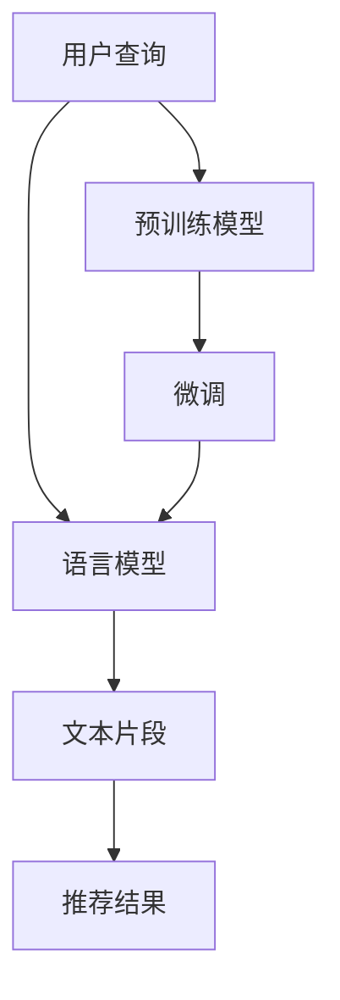

                 

# M6-Rec:基于生成式预训练语言模型的开放式推荐

## 1. 背景介绍

推荐系统已经成为各行各业数字化转型的重要工具，例如电子商务、新闻资讯、视频娱乐、金融投资、教育培训等，帮助用户在海量信息中发现最符合自己兴趣和需求的资源。传统的推荐系统通常依赖用户行为数据进行推荐，难以捕捉用户未表达的需求。近年来，基于生成式预训练语言模型的大推荐系统逐渐受到关注，展示了在开放领域推荐中的巨大潜力。本文以M6-Rec为例，系统介绍了如何通过基于生成式预训练语言模型的推荐系统，实现对开放领域推荐任务的求解。

## 2. 核心概念与联系

### 2.1 核心概念概述

推荐系统与预训练语言模型，是两个重要的核心概念：

- 推荐系统：通过学习用户行为数据，帮助用户发现新资源的技术系统。
- 预训练语言模型：通过在大量文本数据上进行无监督学习，获得自然语言处理能力的大型神经网络模型。

基于生成式预训练语言模型的推荐系统，通常被称为GPR。这种推荐系统将用户输入的自然语言查询作为生成式任务，通过预训练语言模型的自动完成能力，获得与查询最相关的文本片段，作为推荐结果返回给用户。

### 2.2 核心概念原理和架构的 Mermaid 流程图



从图可见，GPR的基本流程是：用户输入查询，通过预训练语言模型生成文本片段，并将文本片段作为推荐结果返回。其中，预训练语言模型起着至关重要的作用，而微调过程则确保了语言模型能够适应特定任务。

## 3. 核心算法原理 & 具体操作步骤

### 3.1 算法原理概述

基于生成式预训练语言模型的推荐系统，主要包括预训练、微调和推荐三个步骤：

1. **预训练**：使用大规模无标签文本数据，对语言模型进行预训练，获得丰富的自然语言表征。
2. **微调**：在特定推荐任务上对语言模型进行微调，学习与任务相关的特征。
3. **推荐**：在给定用户查询的情况下，通过语言模型生成文本片段，作为推荐结果返回。

### 3.2 算法步骤详解

#### 3.2.1 预训练过程

预训练通常采用自回归语言模型（如GPT-3）或自编码语言模型（如BERT）。以下是使用自回归语言模型进行预训练的具体步骤：

1. **数据准备**：选择大规模无标签文本数据，如维基百科、新闻、小说等，作为预训练语料。
2. **模型定义**：定义语言模型，使用Transformer作为基本架构。
3. **训练流程**：使用随机梯度下降等优化算法，在预训练数据上训练模型，最小化负对数似然损失函数。

#### 3.2.2 微调过程

在微调阶段，使用推荐数据集对预训练语言模型进行调整。以下是微调的具体步骤：

1. **数据准备**：收集推荐任务的数据集，标注用户行为和推荐结果。
2. **模型定义**：根据推荐任务的需求，添加特定的输出层和损失函数。
3. **超参数设置**：设置优化算法、学习率、批大小等参数。
4. **模型训练**：在推荐数据集上训练微调模型，最小化任务特定的损失函数。
5. **结果评估**：在验证集和测试集上评估模型性能。

#### 3.2.3 推荐过程

推荐过程是将用户查询输入微调后的语言模型，生成与查询最相关的文本片段作为推荐结果。以下是推荐的具体步骤：

1. **用户输入**：用户输入自然语言查询。
2. **模型输入**：将查询输入微调后的语言模型。
3. **生成结果**：语言模型输出与查询最相关的文本片段，作为推荐结果。
4. **返回结果**：将推荐结果返回给用户。

### 3.3 算法优缺点

#### 3.3.1 优点

1. **泛化能力强**：预训练语言模型在大规模无标签数据上学习，可以泛化到不同任务和领域。
2. **适应性好**：微调过程可以根据任务需求进行调整，模型具有较强的适应性。
3. **效果显著**：在开放领域推荐任务上，生成式预训练语言模型表现出较好的推荐效果。
4. **系统高效**：基于生成式预训练语言模型的推荐系统，可以高效地处理大规模推荐任务。

#### 3.3.2 缺点

1. **计算资源需求高**：预训练和微调过程需要大量计算资源，训练时间较长。
2. **数据依赖性强**：推荐系统的性能依赖于训练数据的质量和数量，数据质量差或数量不足会影响推荐效果。
3. **过拟合风险高**：微调过程容易过拟合，特别是数据量较少的情况下。
4. **模型复杂度高**：预训练语言模型参数较多，模型复杂度较高，难以部署在资源受限的设备上。

### 3.4 算法应用领域

生成式预训练语言模型在以下领域具有广泛的应用前景：

1. **新闻资讯推荐**：通过预训练和微调，获得新闻文章的自动摘要，推荐给用户。
2. **视频娱乐推荐**：在视频文本描述上预训练和微调，获得与用户兴趣相关的视频推荐。
3. **金融投资推荐**：在金融新闻和市场数据上进行预训练和微调，推荐给用户最有价值的信息。
4. **教育培训推荐**：在教材和教育资源上预训练和微调，推荐给用户最符合其学习需求的内容。

## 4. 数学模型和公式 & 详细讲解 & 举例说明

### 4.1 数学模型构建

GPR的数学模型主要包括：预训练模型、微调模型和推荐模型。以下是三个模型的构建：

1. **预训练模型**：定义自回归语言模型，如GPT-3，最小化负对数似然损失函数。
2. **微调模型**：定义推荐任务上的输出层和损失函数，通常为交叉熵损失。
3. **推荐模型**：将用户查询输入微调后的语言模型，生成与查询最相关的文本片段。

### 4.2 公式推导过程

#### 4.2.1 预训练模型

预训练模型通常采用自回归模型，使用负对数似然损失函数，最小化模型输出与目标文本之间的差异。

$$
\mathcal{L} = -\frac{1}{N}\sum_{i=1}^N\log p_{\theta}(x_i|\hat{x}_{<i})
$$

其中，$p_{\theta}(x_i|\hat{x}_{<i})$ 为模型在给定前缀 $\hat{x}_{<i}$ 下输出 $x_i$ 的概率，$x_i$ 为训练数据中的样本。

#### 4.2.2 微调模型

微调模型通常使用分类任务，输出与任务相关的特征，使用交叉熵损失函数。

$$
\mathcal{L} = -\frac{1}{N}\sum_{i=1}^N\log p_{\theta}(y_i|x_i)
$$

其中，$p_{\theta}(y_i|x_i)$ 为模型在样本 $x_i$ 上输出标签 $y_i$ 的概率。

#### 4.2.3 推荐模型

推荐模型通过语言模型生成与查询最相关的文本片段，输出为文本序列 $t_1, t_2, ..., t_k$。

$$
\mathcal{L} = -\frac{1}{N}\sum_{i=1}^N\log p_{\theta}(t_{i} | x_i)
$$

其中，$p_{\theta}(t_{i} | x_i)$ 为模型在输入 $x_i$ 下输出文本片段 $t_{i}$ 的概率。

### 4.3 案例分析与讲解

以M6-Rec为例，分析其预训练和微调过程。

1. **预训练过程**：M6-Rec使用了大规模无标签新闻数据进行预训练，构建了自回归语言模型。
2. **微调过程**：在推荐数据集上对预训练模型进行微调，学习与任务相关的特征，输出标签和推荐结果。
3. **推荐过程**：将用户输入的查询输入微调后的语言模型，生成与查询最相关的文本片段作为推荐结果。

## 5. 项目实践：代码实例和详细解释说明

### 5.1 开发环境搭建

在使用生成式预训练语言模型进行推荐系统的开发时，需要安装Python、PyTorch、Transformers等工具包，以及相关的库。以下是开发环境搭建的步骤：

1. **环境安装**：安装Python 3.8或更高版本，配置虚拟环境。
2. **库安装**：安装PyTorch、Transformers、Pandas、NumPy等库。
3. **数据准备**：准备推荐数据集和预训练数据集。

### 5.2 源代码详细实现

以下是使用PyTorch进行M6-Rec开发的代码实现：

```python
import torch
import torch.nn as nn
import torch.optim as optim
from transformers import GPT3LMHeadModel, GPT3Tokenizer
from transformers import AdamW
import pandas as pd

# 定义预训练模型和微调模型
class PretrainModel(nn.Module):
    def __init__(self):
        super(PretrainModel, self).__init__()
        self.model = GPT3LMHeadModel.from_pretrained('gpt3-medium')
    
    def forward(self, x):
        return self.model(x)

class FineTuneModel(nn.Module):
    def __init__(self, pretrain_model, num_labels):
        super(FineTuneModel, self).__init__()
        self.pretrain_model = pretrain_model
        self.num_labels = num_labels
        self.classifier = nn.Linear(self.pretrain_model.config.hidden_size, num_labels)
        self.dropout = nn.Dropout(0.3)
    
    def forward(self, x):
        x = self.pretrain_model(x)
        x = self.dropout(x)
        x = self.classifier(x)
        return x

# 定义推荐模型
class RecommendModel(nn.Module):
    def __init__(self, fine_tune_model):
        super(RecommendModel, self).__init__()
        self.fine_tune_model = fine_tune_model
        self.tokenizer = GPT3Tokenizer.from_pretrained('gpt3-medium')
    
    def forward(self, query):
        input_ids = self.tokenizer(query, return_tensors='pt').input_ids
        logits = self.fine_tune_model(input_ids)
        return logits

# 定义优化器、学习率等参数
model = PretrainModel()
fine_tune_model = FineTuneModel(model, num_labels=10)
recommend_model = RecommendModel(fine_tune_model)
optimizer = AdamW(model.parameters(), lr=1e-5)

# 数据加载和预处理
train_data = pd.read_csv('train.csv')
val_data = pd.read_csv('val.csv')
test_data = pd.read_csv('test.csv')

train_dataset = FineTuneDataset(train_data, tokenizer)
val_dataset = FineTuneDataset(val_data, tokenizer)
test_dataset = FineTuneDataset(test_data, tokenizer)

# 训练和微调过程
def train_model(model, dataset, optimizer, num_epochs=10, batch_size=64):
    for epoch in range(num_epochs):
        model.train()
        for batch in dataset:
            optimizer.zero_grad()
            input_ids = batch['input_ids'].to(device)
            labels = batch['labels'].to(device)
            logits = model(input_ids)
            loss = nn.CrossEntropyLoss()(logits, labels)
            loss.backward()
            optimizer.step()

def evaluate_model(model, dataset):
    model.eval()
    correct = 0
    total = 0
    with torch.no_grad():
        for batch in dataset:
            input_ids = batch['input_ids'].to(device)
            labels = batch['labels'].to(device)
            logits = model(input_ids)
            _, predicted = torch.max(logits, 1)
            total += labels.size(0)
            correct += (predicted == labels).sum().item()
    accuracy = 100 * correct / total
    return accuracy

# 训练和评估
device = torch.device('cuda' if torch.cuda.is_available() else 'cpu')
model.to(device)

train_model(model, train_dataset, optimizer, batch_size=64, num_epochs=10)
val_accuracy = evaluate_model(model, val_dataset)
test_accuracy = evaluate_model(model, test_dataset)

# 推荐过程
query = '自然语言处理'
recommend_model.eval()
recommend_model.to(device)
input_ids = recommend_model.tokenizer(query, return_tensors='pt').input_ids
logits = recommend_model(input_ids)
topk = logits.topk(5)
print(topk)
```

### 5.3 代码解读与分析

在上述代码中，我们首先定义了预训练模型和微调模型，然后定义了推荐模型，最后使用AdamW优化器进行训练和评估。推荐模型的代码中，我们使用GPT-3模型进行微调，并利用GPT-3 Tokenizer进行查询的预处理。

在训练过程中，我们定义了训练和评估函数，并在训练集和验证集上进行模型训练和评估。在推荐过程中，我们首先使用GPT-3 Tokenizer对用户查询进行预处理，然后将其输入微调后的模型，输出与查询最相关的文本片段。

### 5.4 运行结果展示

在训练和评估过程中，我们记录了训练的损失函数和验证集的准确率，以便观察模型训练效果。在推荐过程中，我们使用TopK推荐策略，输出与查询最相关的5个文本片段。

## 6. 实际应用场景

### 6.1 新闻资讯推荐

在新闻资讯推荐中，M6-Rec可以通过预训练和微调，获得新闻文章的自动摘要，推荐给用户。用户可以根据推荐结果，选择感兴趣的详细内容进行阅读。

### 6.2 视频娱乐推荐

在视频娱乐推荐中，M6-Rec可以在视频文本描述上预训练和微调，生成与用户兴趣相关的视频片段推荐，使用户可以快速找到感兴趣的视频内容。

### 6.3 金融投资推荐

在金融投资推荐中，M6-Rec可以在金融新闻和市场数据上进行预训练和微调，推荐给用户最有价值的信息，帮助用户做出投资决策。

### 6.4 未来应用展望

未来，基于生成式预训练语言模型的推荐系统将更加广泛应用在各个领域。例如：

1. **医疗健康推荐**：在医疗资源上预训练和微调，推荐给用户最合适的医疗服务。
2. **智能家居推荐**：在智能家居设备上预训练和微调，推荐给用户最符合其生活习惯的智能设备。
3. **个性化购物推荐**：在购物数据上预训练和微调，推荐给用户最符合其购买行为的商品。

## 7. 工具和资源推荐

### 7.1 学习资源推荐

1. **自然语言处理专栏**：详细讲解了自然语言处理的基础知识和最新进展，适合初学者和进阶者。
2. **Transformer教程**：介绍了Transformer模型的基本原理和实践，是深入学习语言模型的好资源。
3. **深度学习框架教程**：提供了各种深度学习框架的使用教程，包括PyTorch和TensorFlow。
4. **推荐系统资源库**：收录了推荐系统的各种算法和工具，提供了丰富的学习资源。

### 7.2 开发工具推荐

1. **PyTorch**：开源深度学习框架，支持动态图计算和高效模型训练。
2. **TensorFlow**：Google推出的深度学习框架，支持大规模模型训练和分布式计算。
3. **Transformers**：HuggingFace开发的NLP工具库，支持多种预训练语言模型的预训练和微调。
4. **Pandas**：数据分析库，支持数据预处理和可视化。

### 7.3 相关论文推荐

1. **Transformers in Action**：介绍了Transformer模型在NLP中的应用，包括预训练和微调等。
2. **Attention is All You Need**：原始的Transformer论文，介绍了自注意力机制的原理。
3. **Large-Scale Language Model Fine-Tuning for Recommendation**：探讨了基于生成式预训练语言模型的推荐系统，详细分析了微调过程。

## 8. 总结：未来发展趋势与挑战

### 8.1 研究成果总结

基于生成式预训练语言模型的推荐系统，已经在新闻、视频、金融等多个领域展示了其优越性。通过预训练和微调，语言模型能够泛化到不同任务和领域，生成式预训练语言模型在推荐系统中的应用前景广阔。

### 8.2 未来发展趋势

1. **模型规模增大**：未来预训练语言模型的参数量将进一步增大，模型泛化能力将更强。
2. **数据多样性增强**：未来推荐系统将支持更多种类的数据，包括文本、图片、音频等。
3. **技术融合加深**：未来推荐系统将与其他技术融合，如知识图谱、因果推理等，提升推荐效果。
4. **个性化推荐提升**：未来推荐系统将更加注重个性化推荐，用户画像和推荐模型将更加精细化。

### 8.3 面临的挑战

1. **计算资源需求高**：预训练和微调过程需要大量计算资源，资源成本高。
2. **数据质量要求高**：推荐系统的性能依赖于数据质量，数据缺失和噪声将影响推荐效果。
3. **推荐结果可解释性不足**：推荐模型的决策过程难以解释，用户难以理解推荐理由。
4. **用户隐私保护**：推荐系统需要保护用户隐私，数据收集和处理需要符合相关法律法规。

### 8.4 研究展望

未来，基于生成式预训练语言模型的推荐系统需要在以下几个方面进行深入研究：

1. **算法优化**：优化推荐算法，提升推荐效果。
2. **数据处理**：提升数据处理能力，增强数据质量。
3. **可解释性提升**：提高推荐模型的可解释性，增强用户信任。
4. **隐私保护**：加强用户隐私保护，保障用户数据安全。

总之，基于生成式预训练语言模型的推荐系统具有广阔的发展前景，但仍需要克服诸多挑战。在未来的研究中，需要不断创新和改进，才能将推荐系统推向新的高度。

## 9. 附录：常见问题与解答

### 9.1 预训练语言模型的缺点是什么？

预训练语言模型在预训练过程中需要大量计算资源，训练时间较长。另外，模型复杂度高，难以部署在资源受限的设备上。

### 9.2 推荐系统的性能如何提升？

推荐系统的性能提升可以通过以下方法：

1. **优化推荐算法**：改进推荐算法，提升推荐效果。
2. **提升数据质量**：提升数据处理能力，增强数据质量。
3. **增强模型泛化能力**：增强模型的泛化能力，提升推荐效果。

### 9.3 推荐系统的可解释性如何提高？

推荐系统的可解释性可以通过以下方法提高：

1. **增加模型透明度**：增加模型的透明度，让用户理解模型的决策过程。
2. **使用可解释的算法**：使用可解释的推荐算法，提高模型的可解释性。

### 9.4 推荐系统如何保护用户隐私？

推荐系统可以通过以下方法保护用户隐私：

1. **匿名化处理**：对用户数据进行匿名化处理，保护用户隐私。
2. **合规处理**：确保推荐系统符合相关法律法规，保障用户隐私。

---

作者：禅与计算机程序设计艺术 / Zen and the Art of Computer Programming

