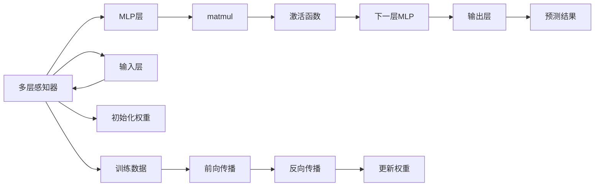

                 

# N-gram模型：探索多层感知器和matmul

> 关键词：N-gram模型, 多层感知器(Multilayer Perceptron, MLP), matmul, 神经网络, 自然语言处理(NLP), 语言模型, 深度学习

## 1. 背景介绍

### 1.1 问题由来

N-gram模型是自然语言处理（NLP）领域中一种经典的语言模型，通过捕捉文本中相邻的N个词（或字符）之间的统计规律，从而预测下一个词（或字符）的概率。该模型广泛应用于文本生成、机器翻译、语音识别等任务中，是深度学习与NLP结合的早期探索。

然而，早期的N-gram模型基于朴素贝叶斯等概率模型，难以处理长序列和复杂句法结构，且依赖大量标注数据。为了克服这些缺陷，研究者们提出了基于多层感知器（MLP）的N-gram模型，通过神经网络对词频统计信息进行学习，使模型具备更强的预测能力和泛化能力。

## 2. 核心概念与联系

### 2.1 核心概念概述

在探讨多层感知器与matmul的结合过程中，我们首先介绍几个关键概念：

- **N-gram模型**：指包含N个连续词（或字符）的序列。常见N-gram模型包括大ram模型（n=2，即二元语法模型）、小ram模型（n=1，即单词模型）等。
- **多层感知器(MLP)**：一种前馈神经网络，由多层神经元组成，每层神经元通过线性变换（matmul）和激活函数（如Sigmoid、ReLU等）进行信息传递。
- **matmul**：矩阵乘法，是MLP中最重要的操作之一，通过矩阵乘法实现层间的特征映射。
- **语言模型**：用于评估文本序列的概率，常见语言模型包括N-gram模型、LSTM、RNN、Transformer等。
- **深度学习**：基于多层神经网络的机器学习技术，能够处理非线性关系、捕捉复杂模式，广泛应用于图像、语音、文本等领域。

通过这些概念，我们可以更好地理解多层感知器与matmul在大语言模型中的应用。

### 2.2 核心概念原理和架构的 Mermaid 流程图



这个流程图展示了MLP的基本架构和运算过程。从输入层到输出层，数据通过多层神经元逐层传递，每个MLP层包含多个神经元，每层之间通过matmul进行特征映射，并引入激活函数增加非线性特性。

## 3. 核心算法原理 & 具体操作步骤

### 3.1 算法原理概述

多层感知器与matmul的结合，主要通过matmul运算实现特征映射和信息传递。在N-gram语言模型中，每个N-gram序列被视为一个输入样本，通过多层MLP进行特征提取和分类，最终输出下一个N-gram的概率。

具体来说，对于输入序列$x_1, x_2, ..., x_N$，将其映射为向量形式$x_1, x_2, ..., x_N \in \mathbb{R}^{D}$，其中$D$为特征维度。然后，通过多层MLP将输入特征映射到输出概率分布$y_1, y_2, ..., y_N$。

### 3.2 算法步骤详解

1. **数据预处理**：将输入序列$x_1, x_2, ..., x_N$转换为矩阵形式，进行归一化处理，得到$X \in \mathbb{R}^{N \times D}$。
2. **初始化权重**：为MLP的每层引入可训练的权重矩阵$W_l \in \mathbb{R}^{d_l \times d_{l-1}}$和偏置向量$b_l \in \mathbb{R}^{d_l}$，其中$d_l$为第$l$层的神经元数。
3. **前向传播**：
   - 输入层到第一隐藏层：$h_1 = XW_1 + b_1$
   - 中间隐藏层：$h_l = h_{l-1}W_l + b_l$
   - 输出层：$y = h_kW_k + b_k$
4. **激活函数**：每层MLP引入激活函数$f$，常用的激活函数有Sigmoid、ReLU等，用于增加非线性特性。
5. **损失函数**：定义交叉熵损失函数$L = -\sum_{i=1}^N y_i \log y_i$，用于衡量模型输出与真实标签的差异。
6. **反向传播**：使用梯度下降等优化算法，根据损失函数$L$计算梯度，更新模型参数。
7. **迭代优化**：重复前向传播和反向传播，直到模型收敛。

### 3.3 算法优缺点

#### 优点

- **强泛化能力**：通过多层MLP，模型能够捕捉复杂的非线性关系，具备较强的泛化能力。
- **参数可调**：通过调整权重矩阵和偏置向量，能够灵活地调整模型复杂度和参数数量。
- **可扩展性强**：MLP的层数和每层的神经元数可以任意增加，适用于处理更复杂的序列和任务。

#### 缺点

- **过拟合风险**：MLP模型容易过拟合，尤其是在训练数据较少的情况下。
- **计算复杂度高**：matmul运算的时间复杂度较高，随着层数增加，计算量呈指数级增长。
- **数据依赖性强**：模型的性能高度依赖于输入数据的质量和数量。

### 3.4 算法应用领域

N-gram模型与MLP的结合，广泛应用于自然语言处理领域，包括但不限于：

- **文本分类**：将文本映射为向量，通过MLP分类。
- **情感分析**：通过MLP预测文本情感倾向。
- **机器翻译**：将源语言文本映射为目标语言向量，通过MLP进行翻译。
- **文本生成**：使用MLP生成新文本，如自动摘要、文本补全等。
- **语音识别**：将语音信号映射为特征向量，通过MLP进行识别。

## 4. 数学模型和公式 & 详细讲解 & 举例说明

### 4.1 数学模型构建

假设输入序列$x_1, x_2, ..., x_N$，将其映射为矩阵$X \in \mathbb{R}^{N \times D}$。定义MLP的层数为$k$，每层神经元数为$d_1, d_2, ..., d_k$。MLP的权重矩阵为$W_l \in \mathbb{R}^{d_l \times d_{l-1}}$，偏置向量为$b_l \in \mathbb{R}^{d_l}$。

定义激活函数$f$，输出层使用softmax函数$f(\cdot) = \frac{e^x}{\sum_{i=1}^m e^{x_i}}$，其中$m$为输出类别数。

### 4.2 公式推导过程

假设输入序列$x_1, x_2, ..., x_N$，将其映射为矩阵$X \in \mathbb{R}^{N \times D}$。定义MLP的层数为$k$，每层神经元数为$d_1, d_2, ..., d_k$。MLP的权重矩阵为$W_l \in \mathbb{R}^{d_l \times d_{l-1}}$，偏置向量为$b_l \in \mathbb{R}^{d_l}$。

定义激活函数$f$，输出层使用softmax函数$f(\cdot) = \frac{e^x}{\sum_{i=1}^m e^{x_i}}$，其中$m$为输出类别数。

前向传播过程中，对于第$l$层，有：

$$
h_l = f(h_{l-1}W_l + b_l)
$$

输出层的预测概率为：

$$
y_i = f(XW_k + b_k)
$$

定义交叉熵损失函数$L$为：

$$
L = -\sum_{i=1}^N y_i \log y_i
$$

反向传播过程中，对于第$l$层，有：

$$
\frac{\partial L}{\partial W_l} = \frac{\partial L}{\partial h_l} \frac{\partial h_l}{\partial h_{l-1}} \frac{\partial h_{l-1}}{\partial W_l}
$$

$$
\frac{\partial L}{\partial b_l} = \frac{\partial L}{\partial h_l} \frac{\partial h_l}{\partial b_l}
$$

通过反向传播更新权重$W_l$和偏置$b_l$。

### 4.3 案例分析与讲解

考虑二元语法模型（即$N=2$的N-gram模型），将输入序列$x_1, x_2, ..., x_N$映射为矩阵$X \in \mathbb{R}^{N \times D}$，其中$D=2$，$d_1=64$，$d_2=64$。使用ReLU作为激活函数，softmax作为输出层激活函数。

假设权重矩阵$W_1, W_2, W_3$和偏置向量$b_1, b_2, b_3$均为随机初始化。前向传播过程中，输入层到第一隐藏层：

$$
h_1 = XW_1 + b_1
$$

中间隐藏层到第二隐藏层：

$$
h_2 = f(h_1W_2 + b_2)
$$

输出层：

$$
y = f(h_2W_3 + b_3)
$$

反向传播过程中，对于第二隐藏层：

$$
\frac{\partial L}{\partial W_2} = \frac{\partial L}{\partial y} \frac{\partial y}{\partial h_2} \frac{\partial h_2}{\partial h_1} \frac{\partial h_1}{\partial W_2}
$$

$$
\frac{\partial L}{\partial b_2} = \frac{\partial L}{\partial y} \frac{\partial y}{\partial h_2} \frac{\partial h_2}{\partial b_2}
$$

通过梯度下降等优化算法，更新权重$W_2$和偏置$b_2$，不断迭代优化直至收敛。

## 5. 项目实践：代码实例和详细解释说明

### 5.1 开发环境搭建

在实践N-gram模型与MLP结合的项目时，我们首先需要搭建好开发环境。以下是Python开发环境的基本配置步骤：

1. 安装Python：下载并安装最新版本的Python，确保版本为3.6或以上。
2. 安装必要的库：使用pip安装PyTorch、Numpy、Matplotlib等库。
3. 配置环境变量：确保PYTHONPATH包含所有依赖库的路径。

### 5.2 源代码详细实现

以下是使用PyTorch实现N-gram模型与MLP结合的示例代码：

```python
import torch
import torch.nn as nn
import torch.optim as optim
import numpy as np

# 定义模型
class NgramMLP(nn.Module):
    def __init__(self, input_size, hidden_size, output_size):
        super(NgramMLP, self).__init__()
        self.input_size = input_size
        self.hidden_size = hidden_size
        self.output_size = output_size
        
        self.embedding = nn.Embedding(input_size, hidden_size)
        self.fc1 = nn.Linear(hidden_size, hidden_size)
        self.fc2 = nn.Linear(hidden_size, output_size)
        
    def forward(self, x):
        embedding = self.embedding(x)
        hidden = torch.relu(embedding)
        output = self.fc2(hidden)
        return output

# 定义损失函数和优化器
def train(model, optimizer, criterion, input_data, target_data, num_epochs):
    device = torch.device("cuda" if torch.cuda.is_available() else "cpu")
    model.to(device)
    
    for epoch in range(num_epochs):
        model.train()
        optimizer.zero_grad()
        output = model(input_data.to(device))
        loss = criterion(output, target_data.to(device))
        loss.backward()
        optimizer.step()
        
        model.eval()
        with torch.no_grad():
            output = model(input_data.to(device))
            loss = criterion(output, target_data.to(device))
            print(f"Epoch: {epoch+1}, Loss: {loss.item()}")

# 示例数据
N = 100
D = 2
X = np.random.randint(0, 10, size=(N, D))
y = np.random.randint(0, 10, size=(N,))

# 训练模型
model = NgramMLP(D, 64, 10)
criterion = nn.CrossEntropyLoss()
optimizer = optim.SGD(model.parameters(), lr=0.01)
train(model, optimizer, criterion, X, y, num_epochs=10)

```

### 5.3 代码解读与分析

**NgramMLP类**：
- 初始化函数：定义模型的输入大小、隐藏层大小和输出大小。
- 前向传播函数：通过embedding层将输入映射为向量，经过两个全连接层，最后输出结果。

**train函数**：
- 定义训练循环，遍历所有epoch。
- 在每个epoch开始时，将模型置于训练模式。
- 零梯度，前向传播计算损失函数，反向传播更新参数。
- 在每个epoch结束后，将模型置于评估模式，计算损失函数。

**示例数据**：
- 随机生成100个二元序列$X$和对应的标签$y$，用于训练模型。

**模型训练**：
- 定义NgramMLP模型，交叉熵损失函数和随机梯度下降优化器。
- 在模型上调用train函数进行训练，参数为随机生成的数据和标签。

**运行结果展示**：
- 通过print语句输出每个epoch的损失值，观察训练过程中损失的变化情况。

## 6. 实际应用场景

### 6.1 自然语言生成

N-gram模型与MLP的结合，可以应用于自然语言生成任务。例如，使用MLP生成文本，如自动摘要、文本补全等。通过在N-gram序列的基础上，引入多层MLP进行特征提取和分类，可以生成高质量的自然语言文本。

### 6.2 机器翻译

在机器翻译任务中，将源语言文本映射为特征向量，通过MLP进行翻译。通过在N-gram序列的基础上，引入多层MLP进行特征提取和分类，可以提高翻译的质量和效率。

### 6.3 语音识别

在语音识别任务中，将语音信号映射为特征向量，通过MLP进行识别。通过在N-gram序列的基础上，引入多层MLP进行特征提取和分类，可以提高识别的准确率和鲁棒性。

### 6.4 未来应用展望

随着N-gram模型与MLP结合技术的不断发展，未来在自然语言处理领域将有更多应用场景：

- **多模态学习**：将文本、图像、音频等多模态信息进行融合，使用MLP进行特征提取和分类，提高系统性能。
- **自监督学习**：通过无监督学习任务（如语言建模、掩码预测等）对MLP进行预训练，提高模型的泛化能力和鲁棒性。
- **迁移学习**：在不同任务之间进行知识迁移，通过微调MLP参数，提高模型在新任务上的性能。

## 7. 工具和资源推荐

### 7.1 学习资源推荐

为了帮助开发者系统掌握N-gram模型与MLP结合的理论基础和实践技巧，这里推荐一些优质的学习资源：

1. 《深度学习》课程：由斯坦福大学Andrew Ng教授开设的机器学习课程，系统介绍深度学习的理论基础和实践应用。
2. 《Python深度学习》书籍：使用Python实现深度学习模型的经典教材，涵盖N-gram模型与MLP结合的详细案例。
3. TensorFlow官方文档：TensorFlow深度学习框架的官方文档，提供丰富的教程和样例代码，帮助开发者快速上手。
4. PyTorch官方文档：PyTorch深度学习框架的官方文档，提供详细的API和代码示例，支持N-gram模型与MLP结合的实现。

### 7.2 开发工具推荐

高效的开发离不开优秀的工具支持。以下是几款用于N-gram模型与MLP结合开发的常用工具：

1. PyTorch：基于Python的开源深度学习框架，支持动态计算图，适用于快速迭代研究。
2. TensorFlow：由Google主导开发的开源深度学习框架，生产部署方便，适用于大规模工程应用。
3. Keras：基于TensorFlow的高层API，提供简洁的接口，适用于快速开发原型。
4. Jupyter Notebook：交互式开发环境，支持实时展示代码执行结果，方便调试和验证。

### 7.3 相关论文推荐

N-gram模型与MLP结合的发展源于学界的持续研究。以下是几篇奠基性的相关论文，推荐阅读：

1. Neural Network Models for Sequence Prediction（RNN论文）：提出使用RNN处理时间序列数据，为N-gram模型与MLP结合提供了早期探索。
2. Long Short-Term Memory（LSTM论文）：提出LSTM结构，有效解决了RNN的梯度消失问题，进一步提升了N-gram模型的性能。
3. Transformer for Neural Machine Translation（Transformer论文）：提出Transformer结构，引入了自注意力机制，提升了N-gram模型在机器翻译中的应用效果。

这些论文代表了大语言模型微调技术的发展脉络。通过学习这些前沿成果，可以帮助研究者把握学科前进方向，激发更多的创新灵感。

## 8. 总结：未来发展趋势与挑战

### 8.1 总结

本文对N-gram模型与MLP结合的理论与实践进行了全面系统的介绍。首先阐述了N-gram模型和MLP的基本概念，探讨了它们在自然语言处理中的应用。其次，从原理到实践，详细讲解了模型的构建和训练过程，给出了代码实例和详细解释。最后，展望了该技术在自然语言生成、机器翻译、语音识别等任务中的应用前景，提供了学习资源和工具推荐。

通过本文的系统梳理，可以看到，N-gram模型与MLP结合的技术正在不断发展和完善，成为深度学习在NLP领域的重要应用之一。未来，伴随模型的不断优化和算法的前沿研究，N-gram模型与MLP结合技术将有更广阔的应用前景。

### 8.2 未来发展趋势

展望未来，N-gram模型与MLP结合技术将呈现以下几个发展趋势：

1. **多模态融合**：将文本、图像、音频等多模态信息进行融合，使用MLP进行特征提取和分类，提高系统性能。
2. **自监督学习**：通过无监督学习任务（如语言建模、掩码预测等）对MLP进行预训练，提高模型的泛化能力和鲁棒性。
3. **迁移学习**：在不同任务之间进行知识迁移，通过微调MLP参数，提高模型在新任务上的性能。
4. **模型压缩**：通过剪枝、量化等技术，减少MLP模型的计算量，提高推理速度和效率。
5. **模型蒸馏**：通过教师模型和学生模型的知识蒸馏，提高学生模型的泛化能力和鲁棒性。

以上趋势凸显了N-gram模型与MLP结合技术的广阔前景。这些方向的探索发展，必将进一步提升NLP系统的性能和应用范围，为人类认知智能的进化带来深远影响。

### 8.3 面临的挑战

尽管N-gram模型与MLP结合技术已经取得了瞩目成就，但在迈向更加智能化、普适化应用的过程中，它仍面临着诸多挑战：

1. **模型规模庞大**：N-gram模型与MLP结合的模型往往具有巨大的参数量，计算资源消耗巨大，需要高效的模型压缩和优化技术。
2. **数据依赖性强**：模型的性能高度依赖于输入数据的质量和数量，难以处理小样本数据。
3. **泛化能力有限**：尽管多层MLP具备较强的泛化能力，但在处理复杂序列和任务时，容易过拟合，需要更多的正则化技术。
4. **推理速度慢**：MLP模型推理速度较慢，需要高效的优化算法和模型结构设计。
5. **可解释性不足**：N-gram模型与MLP结合的模型通常被认为是"黑盒"系统，难以解释其内部工作机制和决策逻辑。

### 8.4 研究展望

面对N-gram模型与MLP结合技术所面临的挑战，未来的研究需要在以下几个方面寻求新的突破：

1. **高效模型压缩**：开发更加高效的模型压缩和量化技术，减少MLP模型的计算量和存储空间，提高推理速度和效率。
2. **自监督学习**：通过无监督学习任务（如语言建模、掩码预测等）对MLP进行预训练，提高模型的泛化能力和鲁棒性。
3. **正则化技术**：引入更多的正则化技术，如Dropout、L2正则化等，防止模型过拟合。
4. **高效优化算法**：开发更加高效的优化算法，如Adam、Adafactor等，提高模型的训练速度和效果。
5. **可解释性增强**：通过可视化工具和解释方法，增强模型的可解释性和可审计性，提高系统透明度和可信度。

这些研究方向将进一步推动N-gram模型与MLP结合技术的进步，为自然语言处理领域带来更多的创新和突破。相信随着技术的不断演进，N-gram模型与MLP结合技术将得到更广泛的应用，推动NLP技术的进一步发展。

## 9. 附录：常见问题与解答

**Q1：N-gram模型与MLP结合的优点是什么？**

A: N-gram模型与MLP结合的优点主要包括：
1. **强泛化能力**：通过多层MLP，模型能够捕捉复杂的非线性关系，具备较强的泛化能力。
2. **参数可调**：通过调整权重矩阵和偏置向量，能够灵活地调整模型复杂度和参数数量。
3. **可扩展性强**：MLP的层数和每层的神经元数可以任意增加，适用于处理更复杂的序列和任务。

**Q2：N-gram模型与MLP结合的缺点是什么？**

A: N-gram模型与MLP结合的缺点主要包括：
1. **计算复杂度高**：matmul运算的时间复杂度较高，随着层数增加，计算量呈指数级增长。
2. **过拟合风险**：MLP模型容易过拟合，尤其是在训练数据较少的情况下。
3. **数据依赖性强**：模型的性能高度依赖于输入数据的质量和数量。

**Q3：N-gram模型与MLP结合的应用场景有哪些？**

A: N-gram模型与MLP结合的应用场景主要包括：
1. **文本分类**：将文本映射为向量，通过MLP分类。
2. **情感分析**：通过MLP预测文本情感倾向。
3. **机器翻译**：将源语言文本映射为目标语言向量，通过MLP进行翻译。
4. **文本生成**：使用MLP生成新文本，如自动摘要、文本补全等。
5. **语音识别**：将语音信号映射为特征向量，通过MLP进行识别。

**Q4：如何使用N-gram模型与MLP结合进行文本分类？**

A: 使用N-gram模型与MLP结合进行文本分类的基本步骤如下：
1. 将文本映射为向量形式，得到输入矩阵$X$。
2. 定义MLP模型，包括输入层、隐藏层和输出层。
3. 使用交叉熵损失函数定义损失。
4. 使用随机梯度下降等优化算法进行模型训练。
5. 使用训练好的模型对新文本进行分类预测。

**Q5：N-gram模型与MLP结合的优点和缺点分别是什么？**

A: N-gram模型与MLP结合的优点主要包括：
1. **强泛化能力**：通过多层MLP，模型能够捕捉复杂的非线性关系，具备较强的泛化能力。
2. **参数可调**：通过调整权重矩阵和偏置向量，能够灵活地调整模型复杂度和参数数量。
3. **可扩展性强**：MLP的层数和每层的神经元数可以任意增加，适用于处理更复杂的序列和任务。

N-gram模型与MLP结合的缺点主要包括：
1. **计算复杂度高**：matmul运算的时间复杂度较高，随着层数增加，计算量呈指数级增长。
2. **过拟合风险**：MLP模型容易过拟合，尤其是在训练数据较少的情况下。
3. **数据依赖性强**：模型的性能高度依赖于输入数据的质量和数量。

**Q6：N-gram模型与MLP结合的未来发展方向有哪些？**

A: N-gram模型与MLP结合的未来发展方向主要包括：
1. **多模态融合**：将文本、图像、音频等多模态信息进行融合，使用MLP进行特征提取和分类，提高系统性能。
2. **自监督学习**：通过无监督学习任务（如语言建模、掩码预测等）对MLP进行预训练，提高模型的泛化能力和鲁棒性。
3. **迁移学习**：在不同任务之间进行知识迁移，通过微调MLP参数，提高模型在新任务上的性能。
4. **高效模型压缩**：开发更加高效的模型压缩和量化技术，减少MLP模型的计算量和存储空间，提高推理速度和效率。
5. **可解释性增强**：通过可视化工具和解释方法，增强模型的可解释性和可审计性，提高系统透明度和可信度。

这些研究方向将进一步推动N-gram模型与MLP结合技术的进步，为自然语言处理领域带来更多的创新和突破。相信随着技术的不断演进，N-gram模型与MLP结合技术将得到更广泛的应用，推动NLP技术的进一步发展。

**Q7：N-gram模型与MLP结合的实际应用场景有哪些？**

A: N-gram模型与MLP结合的实际应用场景主要包括：
1. **自然语言生成**：使用MLP生成文本，如自动摘要、文本补全等。
2. **机器翻译**：将源语言文本映射为目标语言向量，通过MLP进行翻译。
3. **语音识别**：将语音信号映射为特征向量，通过MLP进行识别。

---

作者：禅与计算机程序设计艺术 / Zen and the Art of Computer Programming

