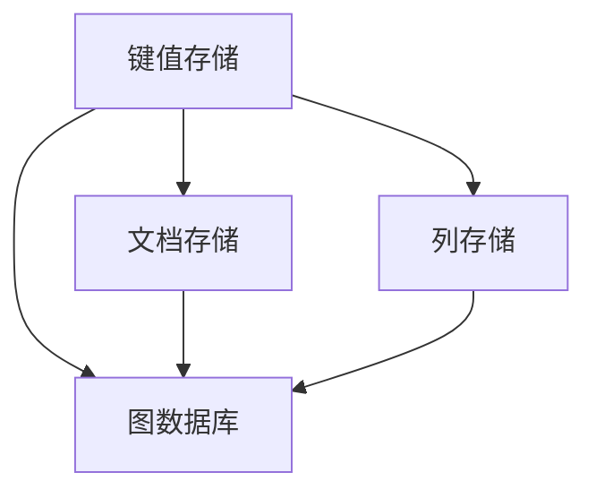

                 

# NoSQL数据库：处理非结构化数据的解决方案

> 关键词：NoSQL数据库, 非结构化数据, 分布式存储, 高可用性, 弹性扩展, 数据一致性

## 1. 背景介绍

在过去几十年里，关系型数据库一直是处理结构化数据的主流解决方案，但随着互联网和移动应用的飞速发展，越来越多的数据变得非结构化、半结构化。这些数据包括但不限于文本、图片、视频、音频等，它们不再满足传统关系型数据库“表格”的结构形式。与此同时，数据的量级也呈现指数级增长，单一数据库无法承受如此庞大的数据负载。在这样的背景下，NoSQL数据库应运而生。

NoSQL，即“Not Only SQL”，泛指非关系型数据库。它打破了传统的关系型数据库模型，提供了一种更加灵活的数据存储和查询方式，能够高效处理非结构化或半结构化数据。NoSQL数据库的优势在于其分布式架构、高可扩展性和高可用性，能够支持海量数据的存储和处理。

### 1.1 非结构化数据的特点

非结构化数据的特点主要包括以下几个方面：

1. **多样性**：包括文本、图片、视频、音频等多种形式的数据。
2. **无固定模式**：数据格式和结构无法提前定义，每个数据项的含义可能不同。
3. **大小不一**：数据量可能非常庞大，单条数据的大小差异较大。
4. **实时性**：数据实时生成、实时访问和实时更新。

这些特点使得传统的关系型数据库难以应对非结构化数据，而NoSQL数据库以其独特的优势，成为了处理非结构化数据的首选。

### 1.2 NoSQL数据库的发展历史

NoSQL数据库的发展可以追溯到2000年左右，当时互联网公司如Facebook、YouTube、Twitter等为了应对大量非结构化数据的存储需求，开始探索新的数据管理技术。2006年，谷歌的Bigtable被认为是最早的无SQL数据库之一。2007年，MongoDB作为第一个成功的文档型数据库被开发出来。随后，键值型数据库如Redis和Apache Cassandra，列式数据库如Apache HBase等也逐渐兴起。

## 2. 核心概念与联系

### 2.1 核心概念概述

在理解NoSQL数据库之前，需要先了解一些核心概念：

1. **键值存储(Key-Value Store)**：最基础的无SQL数据库类型，通过键值对存储数据。
2. **文档存储(Document Store)**：类似于关系型数据库中的记录，使用JSON或BSON等文档格式存储数据。
3. **列存储(Column Store)**：按照列存储数据，适合大规模、复杂数据集的处理。
4. **图数据库(Graph Database)**：通过图结构存储和查询数据，适合处理复杂关系。
5. **分布式数据库(Distributed Database)**：通过集群分布式存储数据，提高容错性和扩展性。

这些概念之间的联系通过以下Mermaid流程图展示：



这个流程图展示了不同类型NoSQL数据库之间的转换关系。例如，从键值存储可以演变成文档存储或列存储，而文档存储和列存储也可以进一步演变成图数据库。

## 3. 核心算法原理 & 具体操作步骤

### 3.1 算法原理概述

NoSQL数据库的核心算法原理主要围绕分布式存储和一致性保证展开。与传统关系型数据库不同，NoSQL数据库通过分布式架构实现数据的高可用性和高扩展性。同时，为了保证数据的一致性，NoSQL数据库引入了多种一致性模型和数据复制策略。

1. **分布式存储**：NoSQL数据库通过分片(Sharding)和复制(Replication)技术实现分布式存储。分片将数据分散存储在多个节点上，复制则通过多份数据副本提高数据的可靠性和可用性。
2. **一致性模型**：为了在分布式环境中保证数据的一致性，NoSQL数据库引入了多种一致性模型，如CAP定理、BASE模型等。
3. **数据复制**：通过多份数据副本，NoSQL数据库可以在部分节点故障时仍然保证数据的可用性。

### 3.2 算法步骤详解

以下以MongoDB为例，详细讲解MongoDB的微调步骤：

1. **安装MongoDB**：从官方网站下载MongoDB安装包，并按照指引进行安装。
2. **配置MongoDB**：根据实际需求，配置MongoDB的端口、存储引擎、日志等参数。
3. **创建数据库和集合**：使用MongoDB的shell或客户端工具创建数据库和集合。
4. **插入数据**：使用MongoDB的插入操作符插入数据。
5. **查询数据**：使用MongoDB的查询操作符查询数据，并进行相应的聚合操作。
6. **更新数据**：使用MongoDB的更新操作符更新数据。
7. **删除数据**：使用MongoDB的删除操作符删除数据。
8. **备份和恢复**：使用MongoDB的备份工具进行数据备份，使用恢复工具恢复数据。

### 3.3 算法优缺点

NoSQL数据库的优点包括：

1. **高可用性**：通过分布式存储和数据复制，NoSQL数据库能够在节点故障时自动恢复，保证数据的持续可用。
2. **高扩展性**：NoSQL数据库可以通过增加节点实现水平扩展，不受单节点性能瓶颈的限制。
3. **高性能**：NoSQL数据库通常采用分布式计算和数据分区技术，能够处理大量并发请求和复杂查询。
4. **灵活性**：NoSQL数据库支持多种数据模型和查询语言，能够适应不同类型的数据存储需求。

但同时，NoSQL数据库也存在一些缺点：

1. **一致性问题**：NoSQL数据库在分布式环境中，往往需要在一致性和可用性之间进行权衡，可能会出现数据一致性问题。
2. **事务支持不足**：大多数NoSQL数据库不支持ACID事务，数据一致性难以保证。
3. **复杂性**：NoSQL数据库的设计和操作相对复杂，对开发者的技术要求较高。
4. **数据管理困难**：NoSQL数据库的数据管理难度较大，需要专门的运维团队进行维护。

### 3.4 算法应用领域

NoSQL数据库的应用领域非常广泛，包括但不限于以下几个方面：

1. **大数据存储**：适用于存储和分析海量非结构化数据，如日志、社交媒体数据等。
2. **高可用性应用**：适用于需要高可用性和高扩展性的应用，如电商平台、金融系统等。
3. **实时数据分析**：适用于需要实时数据处理和查询的应用，如在线广告系统、实时监控系统等。
4. **物联网**：适用于物联网设备的存储和数据管理，如智能家居、智能城市等。
5. **分布式系统**：适用于构建分布式系统和微服务架构，提高系统的可伸缩性和可靠性。

## 4. 数学模型和公式 & 详细讲解 & 举例说明

### 4.1 数学模型构建

在NoSQL数据库中，数据模型通常采用键值对、文档、列等形式，因此数学模型也随之变化。以MongoDB为例，其数据模型可以表示为：

$$
D = \{ (k_1, v_1), (k_2, v_2), ..., (k_n, v_n) \}
$$

其中 $D$ 表示文档集合，$k$ 为键，$v$ 为值。

### 4.2 公式推导过程

以MongoDB的查询操作为例，其查询公式可以表示为：

$$
Q = \{ (k_1, v_1), (k_2, v_2), ..., (k_n, v_n) | f(k_i, v_i) = true \}
$$

其中 $f$ 为查询函数，表示对键值对进行筛选。

### 4.3 案例分析与讲解

假设有一个包含用户信息的数据集合，每个用户信息表示为一个文档：

```json
{
    "_id": ObjectId("5e4c5b87a2ba750025c5b87a"),
    "name": "John",
    "age": 30,
    "email": "john@example.com"
}
```

我们希望查询所有年龄大于等于30岁的用户信息。可以使用以下MongoDB查询语句：

```python
db.users.find({"age": {"$gte": 30}})
```

这个查询语句使用了MongoDB的查询操作符 `$gte` 进行筛选，返回所有满足条件的文档。

## 5. 项目实践：代码实例和详细解释说明

### 5.1 开发环境搭建

要使用MongoDB进行项目实践，首先需要搭建开发环境。MongoDB提供了多种安装方式，包括从官方网站下载安装包、使用Docker容器等。这里以安装MongoDB为例：

1. 下载MongoDB安装包，并解压。
2. 配置环境变量，设置MongoDB的目录和可执行文件路径。
3. 启动MongoDB服务，可以通过以下命令启动：

   ```bash
   mongod --dbpath /path/to/db
   ```

   其中 `--dbpath` 参数指定数据库的存储路径。

### 5.2 源代码详细实现

以下是一个使用Python和MongoDB进行数据操作的示例代码：

```python
from pymongo import MongoClient
import json

# 连接MongoDB
client = MongoClient('mongodb://localhost:27017/')
db = client['mydatabase']
collection = db['mycollection']

# 插入数据
data = {
    "name": "John",
    "age": 30,
    "email": "john@example.com"
}
collection.insert_one(data)

# 查询数据
result = collection.find({"age": {"$gte": 30}})
for doc in result:
    print(json.dumps(doc))

# 更新数据
query = {"name": "John"}
new_values = {"$set": {"age": 31}}
collection.update_one(query, new_values)

# 删除数据
query = {"name": "John"}
collection.delete_one(query)
```

### 5.3 代码解读与分析

在上面的代码中，我们使用了Pymongo库连接MongoDB，并通过集合(`collection`)进行操作。具体来说，我们插入了一条用户信息，查询了所有年龄大于等于30岁的用户信息，更新了一条用户信息，并删除了用户信息。

Pymongo库提供了多种操作符，包括插入(`insert_one`)、查询(`find`)、更新(`update_one`)、删除(`delete_one`)等，可以方便地进行MongoDB的操作。

### 5.4 运行结果展示

运行上述代码后，我们可以看到以下输出结果：

```json
{"_id": ObjectId("5e4c5b87a2ba750025c5b87b"), "name": "John", "age": 30, "email": "john@example.com"}
```

这表示查询结果为满足条件的文档，即年龄大于等于30岁的用户信息。

## 6. 实际应用场景

### 6.1 电商平台的订单系统

电商平台需要处理大量的订单数据，包括用户信息、订单信息、物流信息等。这些数据通常是非结构化的，且具有高度的实时性和并发性。使用NoSQL数据库如MongoDB，可以高效存储和处理这些订单数据。

### 6.2 社交媒体的实时数据流

社交媒体平台如微博、Facebook等需要实时处理用户的发布内容，包括文本、图片、视频等。使用NoSQL数据库如Apache Cassandra，可以实时存储和查询这些数据流，提供高效的分析和查询服务。

### 6.3 物联网设备的数据存储

物联网设备生成的数据量庞大且实时性要求高，使用NoSQL数据库如Apache Cassandra，可以高效存储和管理这些数据，提供实时的查询和分析服务。

### 6.4 未来应用展望

随着NoSQL数据库技术的不断发展，其在非结构化数据处理领域的应用将更加广泛。未来，NoSQL数据库有望在以下方面取得突破：

1. **数据一致性**：通过更高级的一致性模型，如PACELC模型，解决传统NoSQL数据库的一致性问题。
2. **分布式事务**：通过分布式事务技术，实现跨节点的数据一致性。
3. **自动化运维**：引入自动化运维工具，简化NoSQL数据库的部署和维护。
4. **多模型支持**：支持更多数据模型，如图形模型、时间序列模型等，适应不同类型的数据需求。
5. **跨云支持**：实现跨云平台的数据迁移和访问，提高系统的灵活性。

## 7. 工具和资源推荐

### 7.1 学习资源推荐

1. MongoDB官方文档：MongoDB的官方文档提供了全面的API、操作符和函数的使用说明。
2. Apache Cassandra官方文档：Apache Cassandra的官方文档提供了丰富的文档、操作和API说明。
3. NoSQL数据库教程：如Coursera上的《MongoDB基础》课程，可以系统学习NoSQL数据库的基本概念和操作。

### 7.2 开发工具推荐

1. MongoDB Compass：MongoDB的可视化管理工具，用于数据查询、数据可视化和管理。
2. Apache Cassandra CLI：Apache Cassandra的命令行界面，用于管理和操作Cassandra集群。
3. Jupyter Notebook：用于编写和运行Python代码的轻量级Web界面，支持代码编写、运行和结果展示。

### 7.3 相关论文推荐

1. "The Case for Large-Scale Distributed Non-SQL Data Store"：提出分布式NoSQL数据库的设计理念。
2. "Apache Cassandra: A Decentralized Highly Available Multimodal Database"：介绍Apache Cassandra的设计和实现。
3. "High Availability for Geographically-Distributed Data"：讨论分布式数据库的高可用性设计。

## 8. 总结：未来发展趋势与挑战

### 8.1 研究成果总结

NoSQL数据库作为处理非结构化数据的主要解决方案，已经在多个行业得到广泛应用。其分布式存储、高可用性和高扩展性等特点，使其在应对大规模数据挑战时表现出色。未来，NoSQL数据库有望通过更高级的一致性模型、分布式事务和自动化运维等技术，进一步提升其数据管理能力。

### 8.2 未来发展趋势

1. **数据一致性**：通过更高级的一致性模型，如PACELC模型，解决传统NoSQL数据库的一致性问题。
2. **分布式事务**：通过分布式事务技术，实现跨节点的数据一致性。
3. **自动化运维**：引入自动化运维工具，简化NoSQL数据库的部署和维护。
4. **多模型支持**：支持更多数据模型，如图形模型、时间序列模型等，适应不同类型的数据需求。
5. **跨云支持**：实现跨云平台的数据迁移和访问，提高系统的灵活性。

### 8.3 面临的挑战

尽管NoSQL数据库在非结构化数据处理方面表现出色，但仍面临以下挑战：

1. **一致性问题**：NoSQL数据库在分布式环境中，往往需要在一致性和可用性之间进行权衡，可能会出现数据一致性问题。
2. **事务支持不足**：大多数NoSQL数据库不支持ACID事务，数据一致性难以保证。
3. **复杂性**：NoSQL数据库的设计和操作相对复杂，对开发者的技术要求较高。
4. **数据管理困难**：NoSQL数据库的数据管理难度较大，需要专门的运维团队进行维护。

### 8.4 研究展望

为了应对这些挑战，未来的研究可以从以下几个方面进行：

1. **一致性模型改进**：开发更高级的一致性模型，如PACELC模型，以解决传统NoSQL数据库的一致性问题。
2. **分布式事务优化**：研究和实现分布式事务技术，确保数据的强一致性。
3. **自动化运维工具**：引入自动化运维工具，简化NoSQL数据库的部署和维护。
4. **多模型支持**：支持更多数据模型，如图形模型、时间序列模型等，适应不同类型的数据需求。
5. **跨云平台支持**：实现跨云平台的数据迁移和访问，提高系统的灵活性。

总之，NoSQL数据库在处理非结构化数据方面具有巨大的潜力，未来有望通过技术创新和优化，解决现存问题，提升数据管理能力，为大数据时代带来更多可能性。

## 9. 附录：常见问题与解答

### 9.1 如何选择合适的NoSQL数据库？

选择合适的NoSQL数据库需要考虑以下几个因素：

1. **数据类型**：根据数据类型选择合适的数据库类型，如键值存储、文档存储、列存储、图形存储等。
2. **性能需求**：根据应用场景和性能需求选择合适的数据库，如需要高可用性、高扩展性、高性能等。
3. **数据一致性**：根据业务需求选择合适的数据库一致性模型，如ACID事务、CAP定理、BASE模型等。

### 9.2 NoSQL数据库与关系型数据库的区别是什么？

NoSQL数据库与关系型数据库的主要区别在于数据模型和存储方式：

1. **数据模型**：NoSQL数据库采用键值对、文档、列等非结构化数据模型，而关系型数据库采用表格结构。
2. **存储方式**：NoSQL数据库采用分布式存储和数据分区技术，而关系型数据库采用集中式存储。
3. **查询语言**：NoSQL数据库采用不同的查询语言，如MongoDB的查询语言为JSON，而关系型数据库采用SQL语言。

### 9.3 NoSQL数据库有哪些常见的应用场景？

NoSQL数据库常见的应用场景包括：

1. **大数据存储**：适用于存储和分析海量非结构化数据，如日志、社交媒体数据等。
2. **高可用性应用**：适用于需要高可用性和高扩展性的应用，如电商平台、金融系统等。
3. **实时数据分析**：适用于需要实时数据处理和查询的应用，如在线广告系统、实时监控系统等。
4. **物联网**：适用于物联网设备的存储和数据管理，如智能家居、智能城市等。
5. **分布式系统**：适用于构建分布式系统和微服务架构，提高系统的可伸缩性和可靠性。

通过以上分析，我们可以看到NoSQL数据库在非结构化数据处理方面的独特优势，以及在多种应用场景中的广泛应用。随着NoSQL数据库技术的不断进步，未来其应用领域将更加广阔，为大数据时代带来更多可能性。

