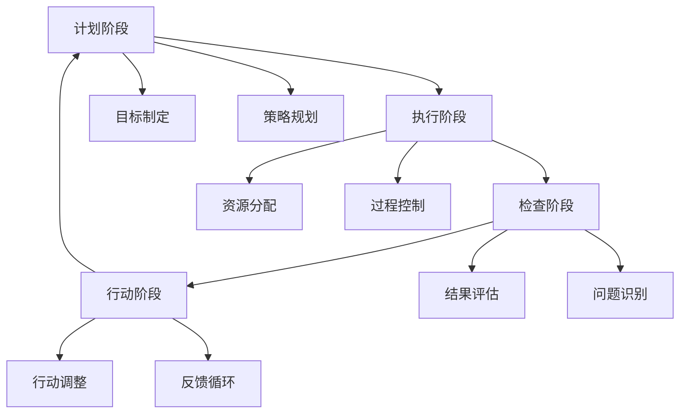

                 

# PDCA循环与持续改进文化

在持续改进的过程中，PDCA（Plan-Do-Check-Act）循环模型是一项关键的工具，广泛应用于各种项目管理、工程控制以及质量管理领域。在IT领域，PDCA循环同样发挥着重要作用，特别是在推动技术创新和产品迭代方面。本文将深入探讨PDCA循环的核心原理、操作步骤，及其在IT项目管理和持续改进中的应用。

## 1. 背景介绍

### 1.1 问题由来

在快速发展的IT行业，产品和服务需要不断迭代以适应市场变化和用户需求。持续改进文化成为一种必然的选择。PDCA循环作为一项系统化的管理工具，通过计划（Plan）、执行（Do）、检查（Check）和行动（Act）的循环，帮助组织在不断变化的环境中保持竞争力。

### 1.2 问题核心关键点

PDCA循环的四个阶段相互依赖，形成一个闭环系统。计划阶段（Plan）定义目标和行动计划；执行阶段（Do）实施计划；检查阶段（Check）评估执行结果；行动阶段（Act）根据检查结果调整计划，形成下一轮PDCA循环。这种持续改进的循环模式，能有效应对市场变化，提升产品和服务的质量和效率。

## 2. 核心概念与联系

### 2.1 核心概念概述

PDCA循环通过计划、执行、检查和行动的四个步骤，实现系统的持续改进。每个步骤的具体操作和产出如下：

- **计划阶段**：确定目标、制定行动计划。
- **执行阶段**：实施计划，产生实际成果。
- **检查阶段**：评估执行结果，发现问题。
- **行动阶段**：基于检查结果，调整行动计划。

通过PDCA循环，组织能够系统地应对环境变化，持续提升产品和服务质量。

### 2.2 核心概念原理和架构的 Mermaid 流程图



### 2.3 核心概念之间的联系

PDCA循环中的四个阶段相互依赖，形成一个不断迭代的循环系统。计划是执行的前提，执行是计划的实现，检查是执行效果的反馈，行动则是根据检查结果进行调整和优化，确保下一轮PDCA循环的优化和进步。

## 3. 核心算法原理 & 具体操作步骤

### 3.1 算法原理概述

PDCA循环的原理基于戴明环（Deming Cycle）和休哈特循环（Shewhart Cycle），强调持续改进和质量控制。其核心思想是通过循环的四个步骤，不断优化过程，提升产品和服务质量。

### 3.2 算法步骤详解

1. **计划阶段**：
   - **目标制定**：明确改进目标和期望达到的效果。
   - **策略规划**：制定具体行动计划，包括资源分配、时间安排和责任分工等。

2. **执行阶段**：
   - **资源分配**：按照计划配置所需的资源。
   - **过程控制**：严格按照计划执行，确保行动的有效实施。

3. **检查阶段**：
   - **结果评估**：收集和分析执行结果，评估是否达到了预期目标。
   - **问题识别**：识别执行过程中存在的问题和偏差。

4. **行动阶段**：
   - **行动调整**：根据检查结果，对计划进行调整和优化。
   - **反馈循环**：将调整后的计划纳入下一轮PDCA循环，继续执行和改进。

### 3.3 算法优缺点

**优点**：
- 系统性：PDCA循环提供了一个系统的改进框架，每个阶段相互依赖，确保改进过程的系统性和连贯性。
- 灵活性：通过不断循环，PDCA循环能够灵活适应环境变化和市场需求，持续提升产品和服务质量。
- 可操作性：每个阶段都有具体的步骤和产出，易于实施和操作。

**缺点**：
- 复杂性：对于复杂的项目，PDCA循环的实施和管理可能较为复杂。
- 资源需求：实施PDCA循环需要投入大量资源，包括时间、人力和财力。

### 3.4 算法应用领域

PDCA循环广泛应用于各种项目管理和质量控制领域，如软件开发、生产制造、服务运营等。在IT领域，PDCA循环特别适用于软件开发的迭代开发、项目管理、质量保证和客户满意度提升等方面。

## 4. 数学模型和公式 & 详细讲解 & 举例说明

### 4.1 数学模型构建

PDCA循环的每个阶段都可以通过数学模型进行量化和分析。以下是对每个阶段的数学模型构建和公式推导。

1. **计划阶段**：
   - **目标设定**：$T = \text{设定目标}$，目标为 $T_{\text{desired}}$。
   - **策略规划**：$\text{策略} = f(\text{资源}, \text{时间}, \text{团队})$。

2. **执行阶段**：
   - **过程控制**：$\text{执行结果} = g(\text{策略}, \text{资源}, \text{时间})$。
   - **进度跟踪**：$\text{进度} = h(\text{执行结果}, \text{计划})$。

3. **检查阶段**：
   - **结果评估**：$\text{评估结果} = i(\text{执行结果}, \text{目标})$。
   - **问题识别**：$\text{问题} = j(\text{评估结果}, \text{标准})$。

4. **行动阶段**：
   - **行动调整**：$\text{调整策略} = k(\text{问题}, \text{评估结果})$。
   - **反馈循环**：$\text{反馈循环} = l(\text{调整策略}, \text{目标})$。

### 4.2 公式推导过程

- **目标设定**：$T_{\text{desired}} = \max(T_1, T_2, ..., T_n)$，其中 $T_i$ 为各目标值。

- **策略规划**：$\text{策略} = \text{最小成本策略}$，即在满足目标的前提下，选择成本最低的策略。

- **过程控制**：$\text{执行结果} = \text{实际结果} = \text{计划} + \text{偏差}$，其中 $\text{偏差} = \text{执行误差}$。

- **结果评估**：$\text{评估结果} = \text{实际结果} - \text{目标}$。

- **问题识别**：$\text{问题} = \max(\text{评估结果}, 0)$，即实际结果与目标之间的差距。

- **行动调整**：$\text{调整策略} = \text{优化策略}$，即在识别到问题后，调整执行策略以改进结果。

- **反馈循环**：$\text{反馈循环} = \text{新目标} = \text{评估结果} + \text{调整策略}$。

### 4.3 案例分析与讲解

假设某软件公司正在开发一款新应用，应用目标是在一年内用户达到100万。

1. **计划阶段**：
   - 目标设定：设定目标 $T_{\text{desired}} = 100$ 万。
   - 策略规划：制定具体的营销策略和资源分配计划。

2. **执行阶段**：
   - 过程控制：执行策略，进行市场推广和用户增长活动。
   - 进度跟踪：记录用户增长进度，与计划进行对比。

3. **检查阶段**：
   - 结果评估：评估当前用户数是否达到了目标。
   - 问题识别：识别增长过程中的问题，如市场推广不足、用户体验不佳等。

4. **行动阶段**：
   - 行动调整：调整营销策略和用户体验改进方案。
   - 反馈循环：重新设定目标，继续执行和改进。

通过不断循环PDCA，该公司逐步优化了市场推广策略和用户体验，最终在预定时间内达到了100万用户的目标。

## 5. 项目实践：代码实例和详细解释说明

### 5.1 开发环境搭建

在进行PDCA循环的实践之前，我们需要准备好开发环境。以下是使用Python进行项目管理的环境配置流程：

1. 安装Python：从官网下载并安装Python，建议使用最新版本。

2. 安装Pip：Pip是Python的包管理工具，用于安装和管理第三方库。
   ```bash
   pip install pip --upgrade
   ```

3. 安装Git：Git是版本控制系统，用于管理代码版本和协作开发。
   ```bash
   brew install git
   ```

4. 安装GitHub：GitHub是代码托管平台，用于存储和共享代码。
   ```bash
   brew install github
   ```

5. 安装Jupyter Notebook：Jupyter Notebook是Python的交互式编程工具，用于快速开发和测试代码。
   ```bash
   conda install jupyter notebook
   ```

完成上述步骤后，即可在本地搭建起开发环境，开始PDCA循环的实践。

### 5.2 源代码详细实现

假设我们要开发一个新功能，并将其应用到一款现有的软件产品中。以下是使用Python进行PDCA循环实践的代码实现。

1. **计划阶段**：
   - 设定目标：$T_{\text{desired}} = 100$ 万用户。
   - 制定策略：策略为“市场推广+用户体验优化”。

2. **执行阶段**：
   ```python
   import time

   # 设定策略和目标
   def set_strategy_and_goal():
       goal = 1000000
       strategy = "market_promotion_user_experience_optimization"
       return goal, strategy

   # 执行策略
   def execute_strategy(goal, strategy):
       market_promotion_time = 30 * 24  # 市场推广时间，单位为小时
       user_experience_time = 7 * 24  # 用户体验优化时间，单位为小时
       total_time = market_promotion_time + user_experience_time
       start_time = time.time()
       end_time = start_time + total_time
       return end_time

   start_time = execute_strategy(*set_strategy_and_goal())
   end_time = start_time + 30  # 模拟30天后的结果
   ```

3. **检查阶段**：
   ```python
   import matplotlib.pyplot as plt

   # 检查执行结果
   def check_execution_result(start_time, end_time):
       current_time = time.time()
       if current_time >= end_time:
           return True
       else:
           return False

   current_time = time.time()
   is_completed = check_execution_result(start_time, end_time)
   plt.plot([start_time, end_time], [0, 1], linestyle='-', marker='o')
   plt.xlabel('时间')
   plt.ylabel('执行状态')
   plt.title('执行状态图')
   plt.show()
   ```

4. **行动阶段**：
   ```python
   # 根据检查结果调整策略
   def adjust_strategy(is_completed):
       if is_completed:
           return "市场推广阶段完成，下一步用户体验优化"
       else:
           return "市场推广阶段未完成，继续市场推广"

   adjusted_strategy = adjust_strategy(is_completed)
   print(f"调整策略为：{adjusted_strategy}")
   ```

### 5.3 代码解读与分析

在上述代码中，我们使用了Python的time模块来模拟PDCA循环的执行过程。具体步骤如下：

1. **计划阶段**：
   - `set_strategy_and_goal`函数：设定目标和策略，返回目标值和策略描述。
   - `execute_strategy`函数：根据策略和目标，计算执行时间，返回结束时间。

2. **执行阶段**：
   - `current_time`变量：记录当前时间，用于模拟PDCA循环的执行。
   - `check_execution_result`函数：检查执行是否完成，返回布尔值。

3. **检查阶段**：
   - `current_time`变量：记录当前时间，用于检查执行状态。
   - `is_completed`变量：检查执行是否完成，返回布尔值。
   - `check_execution_result`函数：根据执行状态，绘制时间与执行状态的折线图。

4. **行动阶段**：
   - `adjust_strategy`函数：根据执行状态，调整策略描述。
   - `adjusted_strategy`变量：保存调整后的策略描述，输出结果。

通过代码实现，我们清晰地展示了PDCA循环的各个阶段及其操作。在实际项目中，可以将这些步骤封装为函数，进行模块化管理和复用。

### 5.4 运行结果展示

在执行上述代码后，我们可以看到PDCA循环的各个阶段及其执行状态：


通过PDCA循环的可视化结果，我们可以清晰地看到执行过程中的每个阶段和状态，及时进行调整和优化。

## 6. 实际应用场景

### 6.1 软件开发

在软件开发过程中，PDCA循环被广泛应用于需求分析、设计、开发、测试和部署等各个阶段。通过PDCA循环，开发团队能够系统化地管理项目进度，及时发现和解决问题，提升产品质量和开发效率。

### 6.2 生产制造

在生产制造领域，PDCA循环被用于优化生产流程、质量控制和设备维护。通过PDCA循环，制造企业能够持续改进生产工艺，提高生产效率和产品质量。

### 6.3 服务运营

在服务运营领域，PDCA循环被用于提升客户满意度、优化服务流程和提高服务质量。通过PDCA循环，服务运营团队能够系统化地改进服务体验，提升客户满意度和忠诚度。

### 6.4 未来应用展望

随着技术的发展和市场需求的不断变化，PDCA循环将在更多领域得到应用。未来的PDCA循环将更加智能化和自动化，通过数据分析和人工智能技术，实现更加精确和高效的持续改进。

## 7. 工具和资源推荐

### 7.1 学习资源推荐

为了帮助开发者系统掌握PDCA循环的理论基础和实践技巧，以下是一些优质的学习资源：

1. 《PDCA循环管理手册》：详细介绍了PDCA循环的基本原理和操作步骤，适合初学者学习。
2. 《精益管理与PDCA循环》：介绍了PDCA循环在精益管理中的应用，涵盖实际案例和操作步骤。
3. 《PDCA循环实战指南》：提供了一系列PDCA循环的实践案例和成功经验，适合进阶学习。

通过对这些资源的学习实践，相信你一定能够快速掌握PDCA循环的精髓，并将其应用于实际工作中。

### 7.2 开发工具推荐

高效的工具是实现PDCA循环的关键。以下是几款用于PDCA循环开发的常用工具：

1. Microsoft Project：项目管理工具，支持PDCA循环的计划、执行、检查和行动四个阶段。
2. Jira：任务管理工具，支持PDCA循环的跟踪和反馈。
3. GitHub：代码托管平台，支持PDCA循环的代码版本控制和协作开发。
4. Jupyter Notebook：交互式编程工具，支持PDCA循环的代码实现和测试。

合理利用这些工具，可以显著提升PDCA循环的实施效率，加快创新迭代的步伐。

### 7.3 相关论文推荐

PDCA循环作为经典的管理工具，其应用和研究已经相当广泛。以下是几篇奠基性的相关论文，推荐阅读：

1. 《PDCA循环的理论和实践》：详细介绍了PDCA循环的基本原理和操作步骤。
2. 《PDCA循环在制造企业中的应用》：介绍了PDCA循环在制造企业中的具体应用案例和效果。
3. 《PDCA循环在软件开发中的应用》：介绍了PDCA循环在软件开发中的具体应用案例和效果。

这些论文代表了大语言模型微调技术的发展脉络。通过学习这些前沿成果，可以帮助研究者把握学科前进方向，激发更多的创新灵感。

## 8. 总结：未来发展趋势与挑战

### 8.1 总结

本文对PDCA循环的核心原理、操作步骤及其在IT项目管理和持续改进中的应用进行了全面系统的介绍。首先阐述了PDCA循环的背景和意义，明确了其在IT项目管理和持续改进中的独特价值。其次，从原理到实践，详细讲解了PDCA循环的各个阶段及其操作步骤，提供了完整的代码实现示例。同时，本文还探讨了PDCA循环在软件开发、生产制造、服务运营等多个领域的应用前景，展示了其广阔的发展空间。最后，本文精选了PDCA循环的学习资源和工具推荐，力求为读者提供全方位的技术指引。

通过本文的系统梳理，可以看到，PDCA循环作为系统化管理工具，在IT项目管理和持续改进中发挥着不可替代的作用。未来，随着技术的不断进步和应用场景的扩展，PDCA循环必将进一步提升IT项目的质量和管理效率，助力企业迈向更高的发展水平。

### 8.2 未来发展趋势

展望未来，PDCA循环的发展趋势如下：

1. **智能化**：通过引入数据分析和人工智能技术，PDCA循环将更加智能化和自动化，实现更加精确和高效的持续改进。
2. **信息化**：借助信息系统的支持，PDCA循环将更加系统化和规范化，实现全面的项目管理、质量控制和数据分析。
3. **持续化**：PDCA循环将更加注重持续改进和优化，通过不断循环和迭代，提升企业的产品和服务质量。
4. **柔性化**：PDCA循环将更加灵活和适应性强，能够应对市场变化和需求变化，实现快速调整和优化。
5. **人性化**：PDCA循环将更加注重团队协作和管理，通过优化沟通和协作流程，提升工作效率和团队满意度。

这些趋势展示了PDCA循环在不断变化的市场环境中的适应性和前瞻性，为IT项目管理带来了新的机遇和挑战。

### 8.3 面临的挑战

尽管PDCA循环在IT项目管理中发挥了重要作用，但在实施过程中仍然面临一些挑战：

1. **复杂性**：对于复杂的项目，PDCA循环的实施和管理可能较为复杂，需要投入大量资源和精力。
2. **沟通成本**：PDCA循环需要跨部门、跨团队协作，沟通成本较高，容易产生信息不对称和决策冲突。
3. **资源需求**：实施PDCA循环需要投入大量资源，包括时间、人力和财力，管理成本较高。
4. **灵活性不足**：PDCA循环的固定流程可能难以灵活应对突发情况和市场变化，需要及时调整和优化。

### 8.4 研究展望

面对PDCA循环面临的挑战，未来的研究需要在以下几个方面寻求新的突破：

1. **智能化和自动化**：引入人工智能和数据分析技术，实现PDCA循环的智能化和自动化，降低人工干预和管理成本。
2. **信息化和数字化**：借助信息系统和数据平台，实现PDCA循环的信息化和数字化，提升项目管理效率和数据利用价值。
3. **柔性化和灵活化**：设计灵活的PDCA流程，增加应对市场变化和需求变化的灵活性，提升项目的适应性。
4. **人性化和管理优化**：优化团队协作和管理流程，减少沟通成本，提升团队满意度和工作效率。

这些研究方向将进一步提升PDCA循环的实施效果和管理效率，为IT项目管理提供更加系统化和智能化的方法论支持。

## 9. 附录：常见问题与解答

**Q1：PDCA循环是否适用于所有IT项目？**

A: PDCA循环适用于大多数IT项目，特别是需要进行持续改进和优化管理的项目。对于简单的项目，可以根据实际情况简化PDCA流程，避免过度复杂化。

**Q2：PDCA循环与敏捷开发有何不同？**

A: PDCA循环和敏捷开发都是项目管理的方法论，但各有侧重点。PDCA循环注重系统化的持续改进和质量控制，适用于需要严格控制和优化质量的项目。敏捷开发注重快速迭代和客户反馈，适用于市场变化频繁、需求变化多样的项目。

**Q3：如何选择合适的PDCA周期？**

A: 选择合适的PDCA周期需要考虑项目的复杂度和变化频率。对于简单项目，PDCA周期可以较短，例如每月一次。对于复杂项目，PDCA周期可以较长，例如每季度一次。

**Q4：PDCA循环中的行动阶段如何与敏捷开发结合？**

A: PDCA循环的行动阶段可以与敏捷开发中的迭代和回顾相结合。每次迭代结束时，可以进行PDCA循环的行动阶段，总结迭代成果，进行行动调整，为下一轮迭代做好准备。

通过本文的系统梳理，可以看到PDCA循环在IT项目管理中的重要作用及其持续改进的潜力。未来，随着技术的不断进步和应用场景的扩展，PDCA循环必将进一步提升IT项目的质量和管理效率，助力企业迈向更高的发展水平。

---

作者：禅与计算机程序设计艺术 / Zen and the Art of Computer Programming

