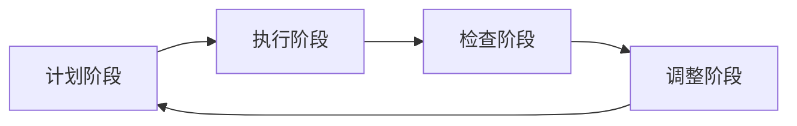

                 

# PDCA循环与管理持续改进的关系

## 1. 背景介绍

### 1.1 问题由来

PDCA循环（Plan-Do-Check-Act），全称为“计划-执行-检查-调整”循环，是一种经典的质量管理方法，旨在通过不断循环改进，提升工作绩效。自上世纪50年代由美国工程师沃特·艾登首次提出以来，已成为全球范围内广泛采用的管理工具。在制造业、医疗、政府、教育、软件开发等行业，PDCA循环被广泛应用于流程优化、质量控制、项目管理的各个方面。

然而，随着技术的发展，PDCA循环在一些领域的应用受到了挑战。例如，在快速迭代的软件开发过程中，传统的PDCA循环可能导致项目管理效率低下，开发周期拉长，无法快速响应市场变化。因此，如何在新时代背景下，结合软件工程的技术和理念，优化PDCA循环，提升持续改进的效果，成为了一个重要的课题。

### 1.2 问题核心关键点

PDCA循环的核心在于通过持续不断的反馈和调整，提升工作质量。其四个阶段分别对应着计划、执行、检查、调整四个关键过程，每个过程都是不可忽视的。通过PDCA循环，能够确保工作按照预期进行，并在不断调整中逐步优化。

但与此同时，PDCA循环也存在一些局限性：
1. 较为静态。PDCA循环更适用于固定流程和任务，对于快速变化的环境难以灵活应对。
2. 反馈滞后。由于人工审查和手工记录，反馈周期较长，无法快速响应问题。
3. 缺乏自动化。大部分环节依赖人工操作，难以实现自动化和智能化。
4. 流程单调。缺乏创新机制，难以引入新技术和新方法。

## 2. 核心概念与联系

### 2.1 核心概念概述

PDCA循环的基本组成包含四个阶段：

- **计划阶段(Plan)**：明确目标和任务，制定详细的实施计划。
- **执行阶段(Do)**：按计划执行工作，分配资源和任务。
- **检查阶段(Check)**：收集反馈数据，评估工作绩效，发现问题。
- **调整阶段(Act)**：根据反馈结果，调整计划和执行，提升工作质量。

PDCA循环的精髓在于通过持续的反馈和改进，提升工作绩效。但由于其依赖人工操作和手工记录，应用在信息化程度较高的软件工程领域时，效率和效果都需要进一步优化。

### 2.2 核心概念原理和架构的 Mermaid 流程图(Mermaid 流程节点中不要有括号、逗号等特殊字符)



这个流程图展示了PDCA循环的基本流程，即计划、执行、检查、调整四个阶段循环往复，不断改进。

## 3. 核心算法原理 & 具体操作步骤

### 3.1 算法原理概述

PDCA循环的算法原理可以总结为以下几个关键点：

1. **目标设定**：明确工作的目标和具体任务，确保每个环节都有明确的方向。
2. **计划制定**：根据目标制定详细的实施计划，包括时间表、资源分配等。
3. **执行监控**：按照计划执行任务，同时对执行过程进行监控，确保计划顺利进行。
4. **数据收集**：在执行过程中，收集反馈数据，评估工作绩效，发现问题。
5. **分析反馈**：对收集到的反馈数据进行分析，识别问题和改进点。
6. **调整优化**：根据分析结果，调整计划和执行策略，提升工作质量。

PDCA循环的核心理念是通过不断的反馈和调整，逐步提升工作绩效。

### 3.2 算法步骤详解

以下是PDCA循环的具体操作步骤：

1. **计划阶段(Plan)**：
   - **目标设定**：确定工作目标和具体任务，确保目标可量化、可衡量、可实现。
   - **资源准备**：准备所需的资源，包括人力、物力、时间等。
   - **制定计划**：详细制定实施计划，包括时间表、任务分配、质量标准等。

2. **执行阶段(Do)**：
   - **任务分配**：按照计划分配任务，确保每个任务都有明确的责任人。
   - **资源投入**：投入所需的资源，包括人力、设备、材料等。
   - **执行监控**：在执行过程中，实时监控任务的进展情况，及时发现和解决问题。

3. **检查阶段(Check)**：
   - **数据收集**：收集执行过程中的数据和反馈信息，包括工作进度、质量指标、资源使用情况等。
   - **结果评估**：对收集到的数据进行分析，评估任务的执行效果，发现问题和不足。
   - **反馈报告**：编制反馈报告，记录执行情况、存在问题、改进措施等。

4. **调整阶段(Act)**：
   - **问题分析**：对发现的问题进行深入分析，查找根本原因。
   - **改进措施**：根据分析结果，制定改进措施，优化计划和执行策略。
   - **执行验证**：实施改进措施，验证其有效性，确保问题得到解决。
   - **经验总结**：总结改进经验，形成标准操作程序，为后续工作提供参考。

通过PDCA循环的四个阶段，确保每个环节都有明确的方向和执行标准，不断优化工作流程，提升绩效。

### 3.3 算法优缺点

PDCA循环的主要优点包括：

1. **系统性**：通过明确的计划、执行、检查、调整四个环节，确保工作有序进行。
2. **持续改进**：通过不断反馈和调整，逐步提升工作绩效。
3. **简单易用**：适用于大多数流程，易于理解和实施。

缺点则在于：

1. **较慢的反馈周期**：由于依赖人工记录和手工操作，反馈周期较长，难以快速响应问题。
2. **资源浪费**：执行阶段可能存在资源浪费，由于缺乏自动化和智能化，效率较低。
3. **缺乏创新**：固定流程和步骤，难以引入新技术和新方法。

### 3.4 算法应用领域

PDCA循环在各个领域都有广泛的应用，例如：

- **制造业**：通过PDCA循环优化生产流程，提高产品质量和生产效率。
- **医疗**：在医疗诊断和治疗过程中，通过PDCA循环持续改进，提升诊疗质量。
- **政府**：在公共政策制定和执行过程中，通过PDCA循环优化流程，提升政策效果。
- **教育**：在教学和评估过程中，通过PDCA循环不断改进，提升教学质量。
- **软件开发**：在软件开发生命周期中，通过PDCA循环优化流程，提升开发效率和软件质量。

## 4. 数学模型和公式 & 详细讲解 & 举例说明

### 4.1 数学模型构建

PDCA循环的数学模型可以表示为：

$$
\begin{aligned}
\text{Plan} &= \{G, P, S\} \\
\text{Do} &= \{G, P, X, T\} \\
\text{Check} &= \{D, R\} \\
\text{Act} &= \{I, A, V, S\}
\end{aligned}
$$

其中，$G$表示目标，$P$表示计划，$S$表示策略，$X$表示执行，$T$表示时间，$D$表示数据，$R$表示反馈，$I$表示改进，$A$表示调整，$V$表示验证，$S$表示标准化。

### 4.2 公式推导过程

1. **计划阶段(Plan)**：
   - **目标设定**：$G = \text{目标}$
   - **资源准备**：$P = \text{计划}$
   - **制定计划**：$S = \text{策略}$

2. **执行阶段(Do)**：
   - **任务分配**：$X = \text{执行}$
   - **资源投入**：$T = \text{时间}$
   - **执行监控**：$\text{实时监控}$

3. **检查阶段(Check)**：
   - **数据收集**：$D = \text{数据}$
   - **结果评估**：$R = \text{反馈}$
   - **反馈报告**：$\text{编制报告}$

4. **调整阶段(Act)**：
   - **问题分析**：$I = \text{改进}$
   - **改进措施**：$A = \text{调整}$
   - **执行验证**：$V = \text{验证}$
   - **经验总结**：$S = \text{标准化}$

### 4.3 案例分析与讲解

假设某软件开发团队需要实施一个新的功能模块，可以按照PDCA循环的步骤进行操作：

- **计划阶段**：确定目标为“在三个月内完成功能模块开发和测试”，制定详细的计划，包括任务分配、时间表、质量标准等。
- **执行阶段**：按照计划分配任务，投入所需的资源，实时监控任务进展情况，及时发现和解决问题。
- **检查阶段**：收集任务执行数据和反馈信息，评估任务的执行效果，发现问题和不足，编制反馈报告。
- **调整阶段**：分析发现的问题，制定改进措施，优化计划和执行策略，实施改进措施，验证其有效性，总结经验，形成标准操作程序。

通过PDCA循环的不断优化，确保功能模块顺利开发，提升软件开发效率和软件质量。

## 5. 项目实践：代码实例和详细解释说明

### 5.1 开发环境搭建

要进行PDCA循环的项目实践，需要先搭建开发环境。以下是使用Python进行PDCA循环开发的环境配置流程：

1. 安装Anaconda：从官网下载并安装Anaconda，用于创建独立的Python环境。

2. 创建并激活虚拟环境：
```bash
conda create -n pdca-env python=3.8 
conda activate pdca-env
```

3. 安装必要的Python库：
```bash
pip install pandas matplotlib sklearn
```

完成上述步骤后，即可在`pdca-env`环境中开始PDCA循环的项目实践。

### 5.2 源代码详细实现

下面以一个简单的项目为例，展示如何使用Python实现PDCA循环。

首先，定义一个PDCA类：

```python
class PDCA:
    def __init__(self, goal, plan, strategy):
        self.goal = goal
        self.plan = plan
        self.strategy = strategy
        self.status = {}

    def execute(self):
        # 执行阶段
        pass

    def check(self):
        # 检查阶段
        pass

    def adjust(self):
        # 调整阶段
        pass

    def report(self):
        # 报告阶段
        pass
```

然后，实现PDCA循环的具体功能：

```python
class PDCA:
    def __init__(self, goal, plan, strategy):
        self.goal = goal
        self.plan = plan
        self.strategy = strategy
        self.status = {}

    def execute(self):
        # 执行阶段
        pass

    def check(self):
        # 检查阶段
        pass

    def adjust(self):
        # 调整阶段
        pass

    def report(self):
        # 报告阶段
        pass

    def run(self):
        self.status = {}
        self.status['plan'] = self.plan
        self.status['goal'] = self.goal
        self.status['strategy'] = self.strategy

        self.execute()
        self.check()
        self.adjust()
        self.report()
```

最后，启动PDCA循环并输出结果：

```python
pdca = PDCA('完成功能模块开发', {'任务1': '开发功能1', '任务2': '测试功能2'}, {'时间': '三个月'})
pdca.run()
print(pdca.status)
```

以上就是使用Python实现PDCA循环的代码示例。可以看到，通过定义PDCA类，可以方便地实现PDCA循环的各个阶段，并输出执行结果。

### 5.3 代码解读与分析

让我们再详细解读一下关键代码的实现细节：

**PDCA类**：
- `__init__`方法：初始化目标、计划和策略，记录当前状态。
- `execute`方法：执行任务，需要根据具体情况实现具体的执行过程。
- `check`方法：收集反馈数据，评估任务执行效果，需要根据具体情况实现具体的检查过程。
- `adjust`方法：根据检查结果，制定改进措施，调整计划和执行策略，需要根据具体情况实现具体的调整过程。
- `report`方法：编制反馈报告，记录执行情况、存在问题、改进措施等。
- `run`方法：按照PDCA循环的四个阶段执行，确保每个环节都有明确的方向和执行标准。

**执行阶段(Do)**：
- 执行阶段需要根据具体情况实现具体的执行过程，可能涉及到多个任务和资源分配，具体实现方式需要根据具体场景进行调整。

**检查阶段(Check)**：
- 检查阶段需要收集执行过程中的数据和反馈信息，评估任务的执行效果，发现问题和不足，编制反馈报告。具体实现方式需要根据具体场景进行调整。

**调整阶段(Act)**：
- 调整阶段需要根据检查结果，制定改进措施，优化计划和执行策略，实施改进措施，验证其有效性，总结经验，形成标准操作程序。具体实现方式需要根据具体场景进行调整。

可以看到，通过PDCA类的方法实现，可以方便地实现PDCA循环的各个阶段，并输出执行结果。

## 6. 实际应用场景

### 6.1 软件开发

在软件开发过程中，PDCA循环可以帮助团队不断优化开发流程，提升软件质量和开发效率。通过PDCA循环，可以实现以下效果：

- **需求管理**：明确项目目标和具体任务，制定详细的计划，确保每个环节都有明确的方向。
- **迭代开发**：按照计划执行任务，实时监控任务进展情况，及时发现和解决问题，确保开发进度和质量。
- **质量评估**：收集执行过程中的数据和反馈信息，评估任务的执行效果，发现问题和不足，编制反馈报告。
- **持续改进**：根据检查结果，制定改进措施，优化计划和执行策略，提升开发效率和软件质量。

通过PDCA循环，软件开发团队可以不断优化开发流程，提升软件质量和开发效率，确保项目按时按质完成。

### 6.2 项目管理

在项目管理过程中，PDCA循环可以帮助项目团队不断优化项目进度和质量。通过PDCA循环，可以实现以下效果：

- **目标设定**：明确项目目标和具体任务，制定详细的计划，确保每个环节都有明确的方向。
- **资源分配**：按照计划分配资源，确保每个任务都有所需的资源支持。
- **进度监控**：实时监控项目进展情况，及时发现和解决问题，确保项目进度。
- **质量评估**：收集执行过程中的数据和反馈信息，评估项目执行效果，发现问题和不足，编制反馈报告。
- **持续改进**：根据检查结果，制定改进措施，优化计划和执行策略，提升项目质量。

通过PDCA循环，项目团队可以不断优化项目管理流程，提升项目进度和质量，确保项目按时按质完成。

### 6.3 质量控制

在质量控制过程中，PDCA循环可以帮助企业不断优化产品质量。通过PDCA循环，可以实现以下效果：

- **目标设定**：明确产品质量目标和具体任务，制定详细的计划，确保每个环节都有明确的方向。
- **过程控制**：按照计划执行质量控制任务，实时监控质量控制进展情况，及时发现和解决问题，确保产品质量。
- **质量评估**：收集质量控制过程中的数据和反馈信息，评估质量控制效果，发现问题和不足，编制反馈报告。
- **持续改进**：根据检查结果，制定改进措施，优化质量控制策略，提升产品质量。

通过PDCA循环，企业可以不断优化质量控制流程，提升产品质量，确保企业竞争力。

### 6.4 未来应用展望

随着技术的发展，PDCA循环的未来应用前景将更加广阔。以下是对未来应用场景的展望：

1. **智能制造**：通过PDCA循环结合人工智能技术，可以实现智能制造和质量控制。例如，在生产过程中，利用传感器和数据分析技术，实时监控生产设备和质量指标，进行自动调整和优化。

2. **智慧医疗**：通过PDCA循环结合医疗大数据和人工智能技术，可以实现智慧医疗和疾病防控。例如，在医疗诊断和治疗过程中，利用大数据分析，不断优化诊疗方案和医疗流程，提升诊疗效果和患者满意度。

3. **智能交通**：通过PDCA循环结合物联网和人工智能技术，可以实现智能交通和城市管理。例如，在交通管理过程中，利用传感器和数据分析技术，实时监控交通流量和道路状况，进行自动调整和优化，提升交通效率和安全性。

4. **智慧教育**：通过PDCA循环结合人工智能技术，可以实现智慧教育和教学评估。例如，在教学过程中，利用数据分析技术，实时监控学生学习情况和课程效果，进行自动调整和优化，提升教学质量和学生满意度。

5. **智慧城市**：通过PDCA循环结合物联网和人工智能技术，可以实现智慧城市和公共服务优化。例如，在城市管理过程中，利用传感器和数据分析技术，实时监控城市运行状况和资源使用情况，进行自动调整和优化，提升城市管理效率和居民生活质量。

总之，PDCA循环作为经典的质量管理方法，在信息化程度较高的领域有着广泛的应用前景，结合人工智能技术，可以实现更高效、更智能的管理和优化。

## 7. 工具和资源推荐

### 7.1 学习资源推荐

为了帮助开发者系统掌握PDCA循环的理论基础和实践技巧，这里推荐一些优质的学习资源：

1. 《PDCA循环理论基础与应用》系列博文：由质量管理专家撰写，深入浅出地介绍了PDCA循环的基本原理和应用方法。

2. 《PDCA循环案例分析与实践》课程：由知名项目管理专家开设的在线课程，通过实际案例讲解PDCA循环的各个环节。

3. 《PDCA循环工具与技术》书籍：介绍PDCA循环中的各类工具和技术，包括质量控制、项目管理、流程优化等。

4. 《PDCA循环与敏捷管理》讲座：介绍PDCA循环在敏捷项目管理中的应用，讲解如何结合敏捷方法和PDCA循环，实现高效的项目管理和持续改进。

通过对这些资源的学习实践，相信你一定能够全面掌握PDCA循环的精髓，并用于解决实际的管理问题。

### 7.2 开发工具推荐

PDCA循环的实现需要借助一些工具和平台，以下是几款常用的工具和平台：

1. **Trello**：项目管理工具，可以方便地进行任务分配和进度监控。
2. **JIRA**：项目管理工具，支持敏捷开发和PDCA循环的项目管理。
3. **GanttProject**：项目计划和管理工具，支持甘特图和任务网络图，方便进行进度和资源管理。
4. **PDCA Plan**：专门的PDCA循环管理工具，支持PDCA循环的各个环节和数据管理。
5. **LeanKit**：项目管理工具，支持敏捷开发和PDCA循环的项目管理。

合理利用这些工具，可以显著提升PDCA循环的实施效率和效果，帮助企业和团队实现持续改进。

### 7.3 相关论文推荐

PDCA循环的研究源于学界的持续探索，以下是几篇经典的相关论文，推荐阅读：

1. 《PDCA循环的质量管理》：介绍了PDCA循环的基本原理和应用方法，通过实际案例讲解PDCA循环的各个环节。

2. 《PDCA循环与敏捷开发》：探讨了PDCA循环在敏捷项目管理中的应用，讲解如何结合敏捷方法和PDCA循环，实现高效的项目管理和持续改进。

3. 《PDCA循环在医疗质量管理中的应用》：介绍了PDCA循环在医疗质量管理中的应用，通过实际案例讲解PDCA循环的各个环节。

4. 《PDCA循环在智能制造中的应用》：介绍了PDCA循环在智能制造中的应用，通过实际案例讲解PDCA循环的各个环节。

5. 《PDCA循环在智慧交通中的应用》：介绍了PDCA循环在智慧交通中的应用，通过实际案例讲解PDCA循环的各个环节。

这些论文代表了大数据和人工智能技术对PDCA循环的进一步探索，帮助你更好地理解PDCA循环在实际应用中的细节和应用前景。

## 8. 总结：未来发展趋势与挑战

### 8.1 研究成果总结

PDCA循环作为经典的质量管理方法，在各个领域都有着广泛的应用。通过不断优化PDCA循环，可以逐步提升工作绩效和管理效果。然而，传统的PDCA循环在信息化程度较高的领域，存在反馈周期长、资源浪费、缺乏自动化和创新机制等缺点。

### 8.2 未来发展趋势

展望未来，PDCA循环将在以下几个方面取得新的突破：

1. **自动化和智能化**：结合人工智能和物联网技术，实现PDCA循环的自动化和智能化，提高管理效率和效果。
2. **实时监控和反馈**：通过传感器和数据分析技术，实现实时监控和反馈，缩短反馈周期，提高管理响应速度。
3. **多模态融合**：结合多模态数据，提升PDCA循环的全面性和准确性，增强管理的科学性和系统性。
4. **持续改进和创新**：引入创新机制，鼓励创新和优化，提升管理效果和竞争力。

### 8.3 面临的挑战

尽管PDCA循环在各个领域都有广泛应用，但仍然面临一些挑战：

1. **数据获取和处理**：在信息化程度较高的领域，获取和处理大量数据需要耗费大量时间和资源，存在数据瓶颈。
2. **技术实现复杂性**：结合人工智能和物联网技术，实现PDCA循环的自动化和智能化，需要复杂的算法和系统架构。
3. **跨领域应用难度**：不同领域的管理需求和业务特点不同，难以形成统一的标准和方法。
4. **人员素质要求高**：实现PDCA循环的自动化和智能化，需要高素质的管理和技术人员。

### 8.4 研究展望

面对PDCA循环面临的挑战，未来的研究需要在以下几个方面寻求新的突破：

1. **数据获取和处理**：探索高效的数据获取和处理方法，解决数据瓶颈问题，实现数据的高效利用。
2. **技术实现复杂性**：研究简单高效的算法和系统架构，实现PDCA循环的自动化和智能化。
3. **跨领域应用**：结合不同领域的管理需求和业务特点，形成统一的标准和方法，推动PDCA循环在各个领域的应用。
4. **人员素质要求**：提高管理人员和技术人员的素质，实现PDCA循环的自动化和智能化。

通过这些研究和突破，PDCA循环将更加适用于信息化程度较高的领域，实现管理效率和效果的全面提升。

## 9. 附录：常见问题与解答

**Q1：PDCA循环是否适用于所有行业？**

A: PDCA循环适用于大多数行业，但不同行业的管理需求和业务特点不同，需要结合具体情况进行调整。例如，在医疗、金融、教育等行业，PDCA循环需要结合行业特点进行优化。

**Q2：PDCA循环能否结合敏捷开发方法？**

A: 可以。PDCA循环结合敏捷开发方法，可以实现高效的项目管理和持续改进。在敏捷开发中，PDCA循环可以与Scrum、Kanban等方法结合，实现快速的反馈和调整。

**Q3：PDCA循环在信息化程度较高的领域有何优势？**

A: 在信息化程度较高的领域，PDCA循环可以结合人工智能和物联网技术，实现实时监控和反馈，缩短反馈周期，提高管理响应速度和效率。

**Q4：PDCA循环在实施过程中需要哪些资源支持？**

A: PDCA循环的实施需要结合具体场景进行资源规划和配置。例如，在软件开发中，需要考虑开发资源、测试资源、工具和平台等；在项目管理中，需要考虑人员、设备和工具等。

**Q5：如何评估PDCA循环的效果？**

A: 评估PDCA循环的效果可以通过以下指标：
- 任务完成率：完成任务的比例和速度。
- 质量控制指标：质量标准的符合程度和问题发现率。
- 资源使用效率：资源利用率、成本控制等。
- 管理改进效果：管理效率提升、管理效果改进等。

通过这些指标，可以评估PDCA循环的效果，持续改进和优化。

---

作者：禅与计算机程序设计艺术 / Zen and the Art of Computer Programming

