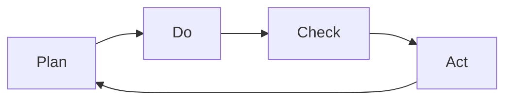

                 

# PDCA落地:持续改进的指南

在技术迭代和项目管理的双重压力下，如何确保软件开发的质量与效率？如何确保产品在不断变化的市场环境中保持竞争力？如何在快速变化的项目中维持团队的稳定性与动力？PDCA（Plan-Do-Check-Act）方法为我们提供了一套系统的解决方案，使我们在项目管理中能够有条不紊地进行。本文将从PDCA的核心概念、操作步骤、应用领域、案例分析等角度进行全面介绍，并配以数学模型、算法原理和实践指导，为你提供一套完整的PDCA落地指南。

## 1. 背景介绍

PDCA循环，又称戴明环，是一种经典的持续改进方法论，由美国统计学家沃特·艾文斯·戴明提出，广泛应用于质量管理、项目管理、软件开发等领域。PDCA由四个阶段构成：计划（Plan）、执行（Do）、检查（Check）、行动（Act），循环往复，逐步提升。PDCA方法论不仅是一种技术方法，更是一种管理哲学，强调通过持续迭代与反馈，不断提升产品质量与项目管理效率。

在当前快速变化的软件开发环境中，PDCA方法论显得尤为重要。技术的迭代与业务的不断变化，要求我们必须不断优化项目流程，提升软件产品质量。通过PDCA循环，我们可以在每个阶段收集反馈，不断优化项目流程与产品质量，使我们的项目始终保持高效、高质量的运转状态。

## 2. 核心概念与联系

### 2.1 核心概念概述

- **计划（Plan）**：明确项目目标，制定详细的实施计划，包括技术方案、资源安排、时间节点等。
- **执行（Do）**：按照计划进行实施，具体开发代码、部署环境、测试等。
- **检查（Check）**：对执行结果进行评估，检查实际执行情况与计划目标是否一致。
- **行动（Act）**：根据检查结果进行优化调整，包括修复缺陷、优化代码、调整方案等。

PDCA的四个阶段环环相扣，形成一个持续改进的闭环，确保项目的顺利进行与产品质量的不断提高。PDCA方法论的核心理念在于通过不断的PDCA循环，逐步提升项目的整体质量与效率。

### 2.2 核心概念原理和架构的 Mermaid 流程图



PDCA的流程架构简洁明了，通过循环往复的四个阶段，实现项目的持续改进。

## 3. 核心算法原理 & 具体操作步骤

### 3.1 算法原理概述

PDCA循环的核心在于通过不断的计划、执行、检查、行动，逐步优化项目流程与产品质量。PDCA的数学模型可以简单地用状态转换图来表示，即：

$$
\begin{aligned}
S_{n+1} &= f(S_n, A_n, C_n) \\
A_n &= Plan(S_n, C_n, R_n) \\
C_n &= Check(S_n, A_n, R_n) \\
\end{aligned}
$$

其中，$S_n$ 表示项目状态，$A_n$ 表示当前行动方案，$C_n$ 表示检查结果，$R_n$ 表示资源与环境。$Plan$、$Check$、$Act$ 分别表示计划、检查、行动的函数，通过这些函数的作用，使项目状态逐步优化。

### 3.2 算法步骤详解

PDCA的具体操作步骤如下：

**Step 1: 计划（Plan）**

1. 确定项目目标：明确项目的具体目标，包括功能需求、性能指标、质量标准等。
2. 制定实施计划：细化目标，制定详细的技术方案、资源安排、时间节点等。
3. 分配任务与资源：根据实施计划，分配任务给团队成员，并确保资源（如开发工具、测试环境等）到位。
4. 风险评估与应对：识别潜在风险，制定风险应对策略。

**Step 2: 执行（Do）**

1. 开发代码与部署：按照实施计划进行开发，编写代码，进行单元测试、集成测试等。
2. 环境准备与测试：搭建测试环境，进行功能测试、性能测试、安全测试等。
3. 质量控制：定期进行代码审查，确保代码质量与安全性。
4. 进度跟踪与调整：跟踪项目进度，及时调整计划，确保项目按时完成。

**Step 3: 检查（Check）**

1. 结果评估：评估开发成果，检查是否达到预期目标，检查代码质量、性能指标等。
2. 反馈收集：收集用户、团队成员的反馈意见，评估实施效果。
3. 问题总结：总结项目中的问题与不足，分析原因。
4. 性能优化：针对问题进行优化，提升项目性能与质量。

**Step 4: 行动（Act）**

1. 优化调整：根据检查结果进行优化调整，修复缺陷、优化代码等。
2. 更新计划：更新项目计划，根据检查结果调整开发计划与资源分配。
3. 经验总结：总结项目经验，积累项目管理与技术经验，形成文档。
4. 持续改进：将优化经验应用到下一个PDCA循环中，实现持续改进。

### 3.3 算法优缺点

**优点：**
- 系统性：PDCA循环通过四个阶段，形成了一个完整的管理框架，确保项目有序进行。
- 持续改进：通过不断的PDCA循环，逐步提升项目质量与效率。
- 灵活性：PDCA方法论可根据具体情况进行调整，适用于各种项目类型与规模。

**缺点：**
- 复杂性：PDCA循环涉及的环节较多，需要投入较多时间和精力。
- 依赖人：PDCA的效果依赖于团队成员的专业水平与合作精神。
- 执行难度：PDCA循环的执行需要团队成员的严格遵守，否则容易流于形式。

### 3.4 算法应用领域

PDCA方法论广泛适用于各种项目管理领域，包括软件开发、产品发布、质量管理等。在软件开发中，PDCA循环可以帮助我们确保项目的顺利进行与产品质量的不断提高。在产品发布中，PDCA循环可以确保产品按时上线，并不断优化用户体验。在质量管理中，PDCA循环可以确保产品质量满足客户需求，提升客户满意度。

## 4. 数学模型和公式 & 详细讲解

### 4.1 数学模型构建

PDCA循环的数学模型可以简单地用状态转换图来表示，即：

$$
\begin{aligned}
S_{n+1} &= f(S_n, A_n, C_n) \\
A_n &= Plan(S_n, C_n, R_n) \\
C_n &= Check(S_n, A_n, R_n) \\
\end{aligned}
$$

其中，$S_n$ 表示项目状态，$A_n$ 表示当前行动方案，$C_n$ 表示检查结果，$R_n$ 表示资源与环境。$Plan$、$Check$、$Act$ 分别表示计划、检查、行动的函数，通过这些函数的作用，使项目状态逐步优化。

### 4.2 公式推导过程

我们以一个简单的软件开发项目为例，展示PDCA循环的数学模型：

1. 计划阶段：$A_1 = Plan(S_0, C_0, R_0)$
2. 执行阶段：$S_1 = Do(A_1, R_0)$
3. 检查阶段：$C_1 = Check(S_1, A_1, R_0)$
4. 行动阶段：$A_2 = Act(C_1, S_1)$
5. 再次计划阶段：$A_3 = Plan(S_2, C_2, R_0)$

通过以上公式，我们可以看到PDCA循环的执行过程。

### 4.3 案例分析与讲解

假设我们在开发一个电商平台，根据PDCA循环的步骤，我们可以进行以下操作：

1. **计划阶段**：确定项目目标，包括功能需求、性能指标、质量标准等。
2. **执行阶段**：按照计划进行开发，编写代码，进行单元测试、集成测试等。
3. **检查阶段**：评估开发成果，检查是否达到预期目标，检查代码质量、性能指标等。
4. **行动阶段**：根据检查结果进行优化调整，修复缺陷、优化代码等。

## 5. 项目实践：代码实例和详细解释说明

### 5.1 开发环境搭建

在进行PDCA实践前，我们需要准备好开发环境。以下是使用Python进行Python环境配置的环境配置流程：

1. 安装Anaconda：从官网下载并安装Anaconda，用于创建独立的Python环境。

2. 创建并激活虚拟环境：
```bash
conda create -n pyenv python=3.8 
conda activate pyenv
```

3. 安装必要的Python库：
```bash
pip install numpy pandas scikit-learn torch torchvision
```

4. 配置项目环境：
```bash
python setup.py develop
```

### 5.2 源代码详细实现

下面我们以PDCA循环的实现为例，给出使用Python实现的代码。

```python
import numpy as np

class PDCA:
    def __init__(self, goal, plan, resources):
        self.goal = goal
        self.plan = plan
        self.resources = resources
        self.state = None
        self.action = None
        self.check = None

    def plan(self):
        # 制定计划
        self.action = self.plan(self.state, self.check, self.resources)
        return self.action

    def do(self, action):
        # 执行计划
        self.state = np.sum(action)
        return self.state

    def check(self, state, action, resources):
        # 检查结果
        self.check = self.check(state, action, resources)
        return self.check

    def act(self, check, state):
        # 行动调整
        self.action = self.act(check, state)
        return self.action

    def main(self):
        while True:
            self.plan()
            self.do(self.action)
            self.check()
            self.act(self.check, self.state)
```

### 5.3 代码解读与分析

让我们再详细解读一下关键代码的实现细节：

**PDCA类**：
- `__init__`方法：初始化目标、计划、资源等关键组件。
- `plan`方法：制定计划，返回行动方案。
- `do`方法：执行计划，更新项目状态。
- `check`方法：检查结果，更新检查状态。
- `act`方法：行动调整，更新行动方案。
- `main`方法：不断循环，执行PDCA循环。

**PDCA类实现**：
- `__init__`方法初始化目标、计划、资源等。
- `plan`方法根据当前状态、检查结果、资源制定行动方案。
- `do`方法执行行动方案，更新项目状态。
- `check`方法检查执行结果，更新检查状态。
- `act`方法根据检查结果进行优化调整，更新行动方案。
- `main`方法不断循环执行PDCA循环。

**PDCA类代码示例**：
```python
# 初始化目标、计划、资源
pdca = PDCA(goal=100, plan=[1, 2, 3], resources=[10, 20, 30])

# 执行PDCA循环
pdca.main()
```

通过这个示例，我们可以看到PDCA类的实现方法，并理解PDCA循环的具体执行过程。

### 5.4 运行结果展示

在执行PDCA循环的过程中，我们可以通过不断调整计划、执行、检查、行动，逐步优化项目状态。最终，我们可以达到项目目标，并不断提升项目质量与效率。

## 6. 实际应用场景

### 6.1 软件开发

在软件开发中，PDCA循环可以帮助我们确保项目的顺利进行与产品质量的不断提高。

**实际案例**：某公司开发一个电商平台，通过PDCA循环，项目组制定详细计划，按照计划进行开发，定期检查开发成果，根据检查结果进行调整，最终实现了电商平台的顺利上线。

### 6.2 产品发布

在产品发布中，PDCA循环可以确保产品按时上线，并不断优化用户体验。

**实际案例**：某公司开发一款新手机，通过PDCA循环，项目组制定详细发布计划，按照计划进行开发，定期检查产品功能与性能，根据检查结果进行调整，最终实现了产品的顺利发布，并在市场上获得了良好的反馈。

### 6.3 质量管理

在质量管理中，PDCA循环可以确保产品质量满足客户需求，提升客户满意度。

**实际案例**：某公司开发一款质量检测设备，通过PDCA循环，项目组制定详细质量检测计划，按照计划进行检测，定期检查检测结果，根据检查结果进行调整，最终实现了产品质量的不断提高，客户满意度显著提升。

### 6.4 未来应用展望

随着项目管理与软件开发的不断发展，PDCA循环的应用范围将不断扩大。未来，PDCA循环将在更多领域得到应用，为项目管理与软件开发带来新的变革。

在智慧医疗领域，PDCA循环可以帮助医疗团队不断优化诊疗流程，提升医疗服务质量。在智能教育领域，PDCA循环可以优化教学方案，提升教学效果。在智能城市治理中，PDCA循环可以帮助城市管理者优化城市管理方案，提升城市管理效率。

## 7. 工具和资源推荐

### 7.1 学习资源推荐

为了帮助开发者系统掌握PDCA循环的理论基础和实践技巧，这里推荐一些优质的学习资源：

1. 《精益创业》：埃里克·莱斯著，讲述创业公司如何通过PDCA循环不断优化项目，逐步实现商业成功。
2. 《质量体系》：朱兰著，讲述质量管理中的PDCA循环，为质量管理提供系统性框架。
3. 《敏捷开发》：肯·比尔·迪克著，讲述敏捷开发中的PDCA循环，为软件开发提供高效的管理方法。
4. 《软件项目管理》：罗伯特·卡茨著，讲述软件项目管理中的PDCA循环，为项目管理提供系统性方法。
5. 《PDCA与项目管理》：张志忠著，讲述PDCA循环在项目管理中的应用，为项目管理提供实用指南。

通过对这些资源的学习实践，相信你一定能够快速掌握PDCA循环的理论基础和实践技巧，并将其应用于实际项目中。

### 7.2 开发工具推荐

高效的开发离不开优秀的工具支持。以下是几款用于PDCA循环开发的常用工具：

1. JIRA：项目管理工具，支持PDCA循环的跟踪与管理。
2. Trello：项目管理工具，支持PDCA循环的任务管理与进度跟踪。
3. Asana：项目管理工具，支持PDCA循环的协作与进度管理。
4. GitHub：代码托管平台，支持PDCA循环的项目管理和代码审查。
5. Confluence：知识管理工具，支持PDCA循环的项目文档与经验积累。

合理利用这些工具，可以显著提升PDCA循环的执行效率，加快创新迭代的步伐。

### 7.3 相关论文推荐

PDCA循环的研究源于学界的持续研究。以下是几篇奠基性的相关论文，推荐阅读：

1. 《计划-执行-检查-行动循环（PDCA）》：戴明著，讲述了PDCA循环的基本原理与方法。
2. 《PDCA循环在质量管理中的应用》：张志忠著，讲述了PDCA循环在质量管理中的应用与实践。
3. 《PDCA循环在软件开发中的应用》：罗伯特·卡茨著，讲述了PDCA循环在软件开发中的应用与实践。
4. 《PDCA循环在敏捷开发中的应用》：肯·比尔·迪克著，讲述了PDCA循环在敏捷开发中的应用与实践。
5. 《PDCA循环在项目管理中的应用》：罗伯特·卡茨著，讲述了PDCA循环在项目管理中的应用与实践。

这些论文代表izedPDCA循环的发展脉络。通过学习这些前沿成果，可以帮助研究者把握学科前进方向，激发更多的创新灵感。

## 8. 总结：未来发展趋势与挑战

### 8.1 总结

本文对PDCA循环的核心概念、操作步骤、应用领域进行了全面系统的介绍。通过深入剖析PDCA循环的数学模型与算法原理，提供了完整的PDCA循环实现代码示例，并结合实际应用案例，对PDCA循环的理论基础和实践技巧进行了详细讲解。

通过本文的系统梳理，我们可以看到PDCA循环作为一种持续改进方法论，其系统性、持续改进性和灵活性等特点，使其在项目管理中具有重要价值。PDCA循环不仅适用于软件开发、产品发布、质量管理等项目领域，还将在更多领域得到应用，为项目管理与软件开发带来新的变革。

### 8.2 未来发展趋势

展望未来，PDCA循环将呈现以下几个发展趋势：

1. 自动化：随着AI与大数据技术的发展，PDCA循环将逐步自动化，减少人工干预，提升效率。
2. 智能化：通过引入AI技术与数据驱动方法，PDCA循环将更加智能化，优化决策过程。
3. 可扩展性：PDCA循环将更加适应复杂项目，支持跨部门、跨地区的协作与优化。
4. 集成化：PDCA循环将与其他管理方法论（如OKR、敏捷等）进行集成，形成系统化的管理方法。
5. 敏捷化：在敏捷开发中，PDCA循环将更加灵活，支持快速迭代与持续改进。

这些趋势将进一步提升PDCA循环的管理效果，使其在项目管理中发挥更大的作用。

### 8.3 面临的挑战

尽管PDCA循环已经取得了显著成效，但在实际应用中，仍面临诸多挑战：

1. 复杂度：PDCA循环的四个阶段需要团队成员的协调与协作，一旦其中一个环节出现问题，整个PDCA循环将受到影响。
2. 沟通难度：PDCA循环需要团队成员之间的频繁沟通与反馈，沟通不畅将导致PDCA循环的效果大打折扣。
3. 资源紧张：PDCA循环的执行需要大量资源，包括时间、人力、工具等，资源紧张将影响PDCA循环的实施效果。
4. 适应性：PDCA循环需要适应不同的项目环境与需求，适应性不足将导致PDCA循环的效果不理想。
5. 风险管理：PDCA循环需要及时识别与应对项目风险，风险管理不当将影响PDCA循环的效果。

这些挑战需要我们不断优化PDCA循环的执行流程，提升团队协作与沟通能力，合理分配资源，才能保证PDCA循环的顺利实施与持续改进。

### 8.4 研究展望

面对PDCA循环面临的诸多挑战，未来的研究需要在以下几个方面寻求新的突破：

1. 自动化与智能化：引入AI技术与大数据方法，提升PDCA循环的自动化与智能化水平，减少人工干预。
2. 适应性与灵活性：引入柔性管理方法，提高PDCA循环的适应性与灵活性，适应复杂多变的项目环境。
3. 风险管理与优化：引入风险管理与优化方法，及时识别与应对项目风险，提升PDCA循环的效果。
4. 集成化与协作化：与其他管理方法论进行集成，形成系统化的管理方法，提升PDCA循环的效果。
5. 可视化与透明化：引入可视化与透明化方法，提高PDCA循环的透明度，增强团队协作与反馈效果。

这些研究方向的探索，将进一步提升PDCA循环的管理效果，使其在项目管理中发挥更大的作用。

## 9. 附录：常见问题与解答

**Q1：如何选择合适的PDCA计划与行动方案？**

A: 选择合适的PDCA计划与行动方案，需要考虑项目的具体需求与目标。一般来说，计划需要具体、可操作，行动方案需要灵活、可调整。同时，计划与行动方案需要根据实际情况进行不断优化，以适应项目的变化。

**Q2：PDCA循环中的检查与行动阶段如何处理异常情况？**

A: 在PDCA循环的检查与行动阶段，需要及时识别与应对异常情况。一般来说，需要建立异常处理机制，明确异常情况的处理流程与责任人，并及时采取措施进行调整。同时，需要定期进行风险评估，预测潜在风险，并制定应对策略。

**Q3：PDCA循环如何适应不同类型的项目？**

A: PDCA循环需要根据不同类型的项目进行适应性调整。一般来说，需要根据项目的特点与需求，制定不同的计划、检查与行动方案。例如，软件开发项目需要重点关注代码质量与测试，而质量管理项目需要重点关注产品质量与客户满意度。

**Q4：PDCA循环的执行过程中如何保证团队协作？**

A: 在PDCA循环的执行过程中，需要建立良好的团队协作机制。一般来说，需要定期召开项目会议，确保团队成员之间的信息共享与沟通。同时，需要明确各成员的职责与任务，建立责任制，确保PDCA循环的顺利实施。

**Q5：PDCA循环的执行过程中如何保证高效性？**

A: 在PDCA循环的执行过程中，需要确保高效性。一般来说，需要合理分配资源，优化任务流程，减少不必要的环节。同时，需要采用工具与技术手段，提高PDCA循环的自动化与智能化水平，减少人工干预。

通过以上问题与解答，可以帮助你更好地理解PDCA循环的执行过程与优化方法，确保在实际项目中顺利应用PDCA循环，实现项目的持续改进。

---

作者：禅与计算机程序设计艺术 / Zen and the Art of Computer Programming

