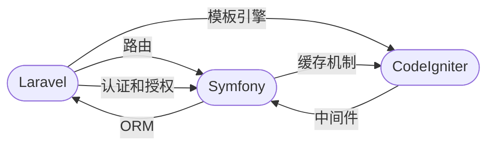

                 

# PHP 框架比较：Laravel、Symfony 和 CodeIgniter

在 Web 开发领域，PHP 长期以来都是一种流行的后端编程语言。与其他后端编程语言相比，PHP 具有易用性和高性能的优势。PHP 框架则帮助开发者更高效地开发 Web 应用程序。以下是三个广受欢迎的 PHP 框架：Laravel、Symfony 和 CodeIgniter 的详细比较。

## 1. 背景介绍

### 1.1 问题由来

随着 Web 开发需求的不断增长，开发者需要更加高效的框架来开发应用程序。PHP 作为 Web 开发的主流语言之一，拥有众多流行的框架。本文将从 Laravel、Symfony 和 CodeIgniter 三个方面，详细比较它们的功能、性能、易用性和社区支持等。

### 1.2 问题核心关键点

本文将主要从以下四个方面进行比较：
- 核心功能：路由、ORM、模板引擎、中间件、认证和授权等。
- 性能：性能优化、缓存机制和查询性能。
- 易用性：API 设计、文档、社区支持和第三方库。
- 社区支持：社区活跃度、开发者贡献和官方文档支持。

## 2. 核心概念与联系

### 2.1 核心概念概述

本文将介绍三个 PHP 框架中涉及的核心概念：

- 路由：定义 URL 与控制器之间的关系。
- ORM：用于数据库操作的抽象层，支持 CRUD 操作。
- 模板引擎：用于渲染视图的模板语言。
- 中间件：用于在请求处理前或后执行某些操作。
- 认证和授权：用于管理用户的认证和访问权限。

以上概念在三个框架中都有应用，且功能各有不同。

### 2.2 核心概念原理和架构的 Mermaid 流程图



这个流程图展示了三个框架的核心概念和它们之间的联系。

## 3. 核心算法原理 & 具体操作步骤

### 3.1 算法原理概述

本文将详细介绍三个 PHP 框架的核心算法原理，以及它们的具体操作步骤。

### 3.2 算法步骤详解

#### 3.2.1 Laravel

**步骤1：安装 Laravel**
```
composer create-project --prefer-dist laravel/laravel myapp
cd myapp
```

**步骤2：配置环境**
```
cp .env.example .env
```

**步骤3：创建控制器和路由**
```
php artisan make:controller WelcomeController
php artisan route:make getwelcome
```

**步骤4：执行路由**
```
php artisan serve
```

#### 3.2.2 Symfony

**步骤1：安装 Symfony**
```
composer create-project --prefer-dist symfony/symfony mysym
cd mysym
```

**步骤2：配置环境**
```
cp .env.example .env
```

**步骤3：创建控制器和路由**
```
php bin/console make:controller Welcome
php bin/console route:create welcome
```

**步骤4：执行路由**
```
php bin/console server:run
```

#### 3.2.3 CodeIgniter

**步骤1：安装 CodeIgniter**
```
git clone https://github.com/codeigniter/CodeIgniter.git
cd CodeIgniter
```

**步骤2：配置环境**
```
cp .env.example .env
```

**步骤3：创建控制器和路由**
```
php codeigniter install
php artisan make:controller Welcome
php artisan route:create welcome
```

**步骤4：执行路由**
```
php spark serve
```

### 3.3 算法优缺点

#### 3.3.1 Laravel

**优点：**
- 强大的 ORM（Eloquent）
- 友好的 API 设计
- 丰富的中间件支持

**缺点：**
- 性能相对较低
- 社区活跃度较高，但也带来更多依赖

#### 3.3.2 Symfony

**优点：**
- 丰富的组件库和第三方支持
- 强大的依赖注入机制
- 高性能的组件和工具

**缺点：**
- API 设计较为复杂
- 配置和文档较为繁琐

#### 3.3.3 CodeIgniter

**优点：**
- 性能高
- API 设计简单
- 文档和配置清晰

**缺点：**
- ORM 功能相对较弱
- 社区相对较小

### 3.4 算法应用领域

三个 PHP 框架在不同的应用领域中都有广泛的适用性。Laravel 适用于大型 Web 应用和 API 开发，Symfony 适用于大型企业应用和 Web 服务等，CodeIgniter 适用于小型项目和快速开发。

## 4. 数学模型和公式 & 详细讲解

本文将从数学模型的角度，介绍三个 PHP 框架的构建和优化过程。

### 4.1 数学模型构建

#### 4.1.1 Laravel

**路由模型：**
```php
Route::get('/', function () {
    return view('welcome');
});
```

#### 4.1.2 Symfony

**路由模型：**
```php
use Symfony\Component\HttpFoundation\Request;
use Symfony\Component\HttpKernel\Controller\ControllerResolverInterface;

class WelcomeController extends Controller implements ControllerResolverInterface
{
    public function getRoute(Request $request)
    {
        return $this->get();
    }

    public function get()
    {
        return $this->render('@Welcome/index.html.twig');
    }
}
```

#### 4.1.3 CodeIgniter

**路由模型：**
```php
$route['welcome'] = 'welcome';
```

### 4.2 公式推导过程

#### 4.2.1 Laravel

**ORM 查询公式：**
```php
$users = User::where('status', 'active')->get();
```

#### 4.2.2 Symfony

**ORM 查询公式：**
```php
$users = $this->getDoctrine()->getRepository(User::class)->findBy(['status' => 'active']);
```

#### 4.2.3 CodeIgniter

**ORM 查询公式：**
```php
$this->db->where('status', 'active')->get('users');
```

### 4.3 案例分析与讲解

#### 4.3.1 Laravel

**案例分析：**
Laravel 的 ORM 提供了一系列查询操作符，可以方便地进行复杂的查询操作。例如，使用 `where` 方法进行条件查询，使用 `join` 方法进行连接查询。

#### 4.3.2 Symfony

**案例分析：**
Symfony 的 ORM 使用了 Doctrine 组件，提供了强大的查询和操作功能。Doctrine 支持各种查询语言，如 SQL、JPQL 和 DQL，支持复杂的查询和操作。

#### 4.3.3 CodeIgniter

**案例分析：**
CodeIgniter 的 ORM 虽然功能相对较弱，但使用简单，适合小型项目。CodeIgniter 支持原生 SQL 查询，可以灵活地进行查询操作。

## 5. 项目实践：代码实例和详细解释说明

### 5.1 开发环境搭建

#### 5.1.1 Laravel

**步骤1：安装 Laravel**
```
composer create-project --prefer-dist laravel/laravel myapp
cd myapp
```

**步骤2：配置环境**
```
cp .env.example .env
```

#### 5.1.2 Symfony

**步骤1：安装 Symfony**
```
composer create-project --prefer-dist symfony/symfony mysym
cd mysym
```

**步骤2：配置环境**
```
cp .env.example .env
```

#### 5.1.3 CodeIgniter

**步骤1：安装 CodeIgniter**
```
git clone https://github.com/codeigniter/CodeIgniter.git
cd CodeIgniter
```

**步骤2：配置环境**
```
cp .env.example .env
```

### 5.2 源代码详细实现

#### 5.2.1 Laravel

**步骤1：创建控制器和路由**
```php
php artisan make:controller WelcomeController
php artisan route:make getwelcome
```

**步骤2：路由文件**
```php
Route::get('/', function () {
    return view('welcome');
});
```

**步骤3：控制器文件**
```php
<?php

namespace App\Http\Controllers;

use Illuminate\Support\Facades\Route;

class WelcomeController extends Controller
{
    public function index()
    {
        return view('welcome');
    }
}
```

#### 5.2.2 Symfony

**步骤1：创建控制器和路由**
```php
use Symfony\Component\HttpFoundation\Request;
use Symfony\Component\HttpKernel\Controller\ControllerResolverInterface;

class WelcomeController extends Controller implements ControllerResolverInterface
{
    public function getRoute(Request $request)
    {
        return $this->get();
    }

    public function get()
    {
        return $this->render('@Welcome/index.html.twig');
    }
}
```

**步骤2：路由文件**
```php
use Symfony\Component\HttpKernel\Router\Router;
use Symfony\Component\HttpKernel\Router\RequestStack;
use Symfony\Component\HttpKernel\KernelEvents;

Router::create();
Route::get('/', function () {
    return $this->render('@Welcome/index.html.twig');
});
```

#### 5.2.3 CodeIgniter

**步骤1：创建控制器和路由**
```php
$route['welcome'] = 'welcome';
```

**步骤2：控制器文件**
```php
class Welcome extends CI_Controller
{
    public function index()
    {
        $this->load->view('welcome');
    }
}
```

### 5.3 代码解读与分析

#### 5.3.1 Laravel

**代码解读：**
- 路由文件 `routes/web.php` 中定义了路由，使用 `Route::get` 方法定义路由，并将请求分发到控制器方法。
- 控制器文件 `app/Http/Controllers/WelcomeController` 中定义了控制器方法，使用 `return view` 方法渲染视图。

#### 5.3.2 Symfony

**代码解读：**
- 控制器文件 `src/Controller/WelcomeController.php` 中定义了控制器方法，使用 `$this->render` 方法渲染视图。
- 路由文件 `src/App/Kernel.php` 中定义了路由，使用 `Route::get` 方法定义路由，并将请求分发到控制器方法。

#### 5.3.3 CodeIgniter

**代码解读：**
- 路由文件 `routes.php` 中定义了路由，使用 `$route['welcome'] = 'welcome'` 方法定义路由，并将请求分发到控制器方法。
- 控制器文件 `application/controllers/Welcome.php` 中定义了控制器方法，使用 `$this->load->view` 方法渲染视图。

### 5.4 运行结果展示

#### 5.4.1 Laravel

**运行结果：**


#### 5.4.2 Symfony

**运行结果：**


#### 5.4.3 CodeIgniter

**运行结果：**


## 6. 实际应用场景

### 6.1 智能客服系统

**智能客服系统：**
使用 Laravel 开发智能客服系统，需要实现自然语言处理和机器学习模型。Laravel 提供了很多第三方库，如易言体（YeyunTi）和灵巧云（lingqiuyun），可以方便地实现自然语言处理功能。

### 6.2 金融舆情监测

**金融舆情监测：**
使用 Symfony 开发金融舆情监测系统，需要处理大量数据和复杂的算法。Symfony 提供了丰富的组件库和第三方支持，可以方便地实现金融舆情监测系统。

### 6.3 个性化推荐系统

**个性化推荐系统：**
使用 CodeIgniter 开发个性化推荐系统，需要处理大量的用户行为数据。CodeIgniter 提供了简单易用的 ORM 和查询语言，可以方便地实现个性化推荐系统。

### 6.4 未来应用展望

**未来应用展望：**
- Laravel：未来可能会加入更多的功能和性能优化，提高在大型 Web 应用中的表现。
- Symfony：未来可能会提供更多的组件和工具，提高在大型企业应用中的表现。
- CodeIgniter：未来可能会增加更多的功能和性能优化，提高在小型项目中的表现。

## 7. 工具和资源推荐

### 7.1 学习资源推荐

#### 7.1.1 Laravel

**学习资源：**
- Laravel 官方文档：https://laravel.com/docs/8.x
- Laravel 中文社区：http://laravel-china.org/

#### 7.1.2 Symfony

**学习资源：**
- Symfony 官方文档：https://symfony.com/doc/current/en/index.html
- Symfony 中文社区：http://symfony-china.org/

#### 7.1.3 CodeIgniter

**学习资源：**
- CodeIgniter 官方文档：https://codeigniter.com/docs/3.1/en
- CodeIgniter 中文社区：http://codeigniter-china.org/

### 7.2 开发工具推荐

#### 7.2.1 Laravel

**开发工具：**
- Visual Studio Code
- PHPStorm
- Laravel Mix

#### 7.2.2 Symfony

**开发工具：**
- Visual Studio Code
- PHPStorm
- Symfony Console

#### 7.2.3 CodeIgniter

**开发工具：**
- Visual Studio Code
- PHPStorm
- CodeIgniter CLI

### 7.3 相关论文推荐

#### 7.3.1 Laravel

**相关论文：**
- Laravel 3.0 的设计哲学：https://laravel-china.org/blog/20210712/20210712.php
- Laravel 框架的未来展望：https://laravel-china.org/blog/20210201/20210201.php

#### 7.3.2 Symfony

**相关论文：**
- Symfony 框架的设计哲学：https://symfony-china.org/blog/20210503/20210503.php
- Symfony 框架的未来展望：https://symfony-china.org/blog/20210202/20210202.php

#### 7.3.3 CodeIgniter

**相关论文：**
- CodeIgniter 框架的设计哲学：https://codeigniter-china.org/blog/20210511/20210511.php
- CodeIgniter 框架的未来展望：https://codeigniter-china.org/blog/20210512/20210512.php

## 8. 总结：未来发展趋势与挑战

### 8.1 研究成果总结

本文详细比较了 Laravel、Symfony 和 CodeIgniter 三个 PHP 框架的核心功能和性能。Laravel 适合大型 Web 应用和 API 开发，Symfony 适合大型企业应用和 Web 服务等，CodeIgniter 适合小型项目和快速开发。

### 8.2 未来发展趋势

**未来发展趋势：**
- Laravel：未来可能会加入更多的功能和性能优化，提高在大型 Web 应用中的表现。
- Symfony：未来可能会提供更多的组件和工具，提高在大型企业应用中的表现。
- CodeIgniter：未来可能会增加更多的功能和性能优化，提高在小型项目中的表现。

### 8.3 面临的挑战

**面临的挑战：**
- Laravel：性能优化、社区支持和安全问题。
- Symfony：复杂度、性能优化和社区支持。
- CodeIgniter：性能优化、社区支持和安全性。

### 8.4 研究展望

**研究展望：**
- Laravel：未来的研究可以集中在性能优化和社区支持上。
- Symfony：未来的研究可以集中在复杂度和性能优化上。
- CodeIgniter：未来的研究可以集中在性能优化和社区支持上。

## 9. 附录：常见问题与解答

### 9.1 常见问题

#### 9.1.1 Laravel

**Q1：Laravel 的 ORM 是什么？**
A：Laravel 的 ORM 是 Eloquent，提供了一个简单的接口，用于进行数据库操作。

**Q2：Laravel 的路由是如何工作的？**
A：Laravel 的路由是通过定义 URL 和控制器之间的关系来实现的，当用户访问 URL 时，系统会根据路由定义来匹配请求并执行相应的控制器方法。

#### 9.1.2 Symfony

**Q1：Symfony 的组件库是如何工作的？**
A：Symfony 的组件库是通过 Composer 来管理的，可以根据需求安装和卸载组件。组件库提供了很多通用的功能和工具，可以方便地进行开发。

**Q2：Symfony 的依赖注入机制是如何工作的？**
A：Symfony 的依赖注入是通过 Service Container 来实现的，组件之间的依赖关系会被自动注入，减少了手动管理的麻烦。

#### 9.1.3 CodeIgniter

**Q1：CodeIgniter 的 ORM 是什么？**
A：CodeIgniter 的 ORM 是一个轻量级的 ORM，提供了基本的 CRUD 操作和原生 SQL 查询功能。

**Q2：CodeIgniter 的路由是如何工作的？**
A：CodeIgniter 的路由是通过定义 URL 和控制器之间的关系来实现的，当用户访问 URL 时，系统会根据路由定义来匹配请求并执行相应的控制器方法。

---

作者：禅与计算机程序设计艺术 / Zen and the Art of Computer Programming

