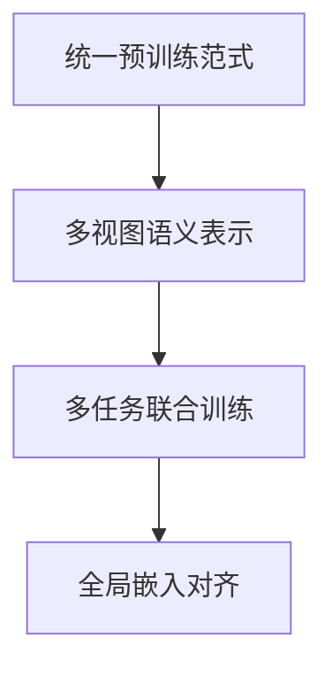

                 

# Pretraining-FLM：统一的推荐任务预训练范式

> 关键词：推荐系统,预训练,多任务学习,多视图融合,统一预训练范式

## 1. 背景介绍

推荐系统是互联网时代的重要应用，旨在帮助用户发现感兴趣的内容。传统的推荐系统基于用户行为数据进行模型训练，而忽视了文本语义信息。近年来，基于深度学习的推荐方法迅速崛起，其中基于预训练大模型的推荐系统，取得了显著的进展。这些系统通常先对大规模无标签文本进行预训练，然后在推荐任务上微调预训练模型，提升了推荐的效果。

然而，现有的预训练方法往往局限于单一任务和单一视图的语义表示学习，无法充分利用多视图和多任务的复杂语义信息。为了更好地适应复杂的推荐任务，需要设计更加统一的预训练范式。本博客将介绍一种新的预训练范式：Pretraining-FLM（统一推荐任务预训练），通过联合学习多个推荐任务，从多视图和多任务视角构建推荐系统的语义表示，提升推荐效果。

## 2. 核心概念与联系

### 2.1 核心概念概述

Pretraining-FLM是一种新的预训练范式，旨在从多视图和多任务的视角，构建推荐系统的语义表示。Pretraining-FLM的核心概念包括：

- **统一预训练范式**：联合学习多个推荐任务，构建通用的语义表示，避免模型对单个任务的过拟合。
- **多视图语义表示**：从文本、用户、物品等多个视图构建推荐系统的语义表示，充分利用多源信息，提升推荐效果。
- **多任务联合训练**：通过联合多个推荐任务进行预训练，学习通用的推荐特征，增强模型的泛化能力。
- **全局嵌入对齐**：将多个视图的嵌入对齐到一个全局空间，方便进行多视图融合，提升模型的鲁棒性和泛化能力。

这些概念之间的逻辑关系可以通过以下Mermaid流程图来展示：



该流程图展示了大语言模型微调的核心概念及其之间的关系：

1. Pretraining-FLM通过统一预训练范式，联合学习多个推荐任务，构建通用的语义表示。
2. 多视图语义表示通过融合文本、用户、物品等多视图的信息，提升推荐效果。
3. 多任务联合训练通过联合多个推荐任务进行预训练，增强模型的泛化能力。
4. 全局嵌入对齐将多个视图的嵌入对齐到一个全局空间，方便进行多视图融合，提升模型的鲁棒性和泛化能力。

这些核心概念共同构成了Pretraining-FLM的预训练框架，使其能够在多个推荐任务上发挥强大的语义表示能力。

## 3. 核心算法原理 & 具体操作步骤

### 3.1 算法原理概述

Pretraining-FLM的预训练过程分为两个阶段：语义表示预训练和推荐特征学习。首先，通过对大规模无标签文本进行预训练，学习通用的语义表示；然后，通过联合多个推荐任务，学习推荐特征，最终得到推荐系统的语义表示。

在预训练阶段，模型通过自监督学习任务（如掩码语言模型、填空任务等），从多视图视角学习文本、用户、物品等多源信息。在推荐特征学习阶段，模型通过多任务联合训练，学习通用的推荐特征，构建推荐系统的语义表示。

### 3.2 算法步骤详解

Pretraining-FLM的预训练过程包括以下几个关键步骤：

**Step 1: 准备预训练数据集**

- 准备多视图和多任务的数据集，包括文本、用户、物品等视图，以及点击、评分、关注等推荐任务。

**Step 2: 设计预训练任务**

- 设计多视图和多任务的预训练任务，如掩码语言模型、填空任务、排序任务等。

**Step 3: 初始化模型参数**

- 初始化预训练模型，如BERT、GPT等。

**Step 4: 进行预训练**

- 对多视图和多任务的预训练数据集进行预训练，学习通用的语义表示。

**Step 5: 微调推荐特征**

- 在预训练的基础上，微调推荐特征，学习通用的推荐特征，构建推荐系统的语义表示。

**Step 6: 融合多视图嵌入**

- 将多视图的嵌入对齐到一个全局空间，进行多视图融合，提升模型的鲁棒性和泛化能力。

### 3.3 算法优缺点

Pretraining-FLM的预训练方法具有以下优点：

1. **多视图融合**：从文本、用户、物品等多个视角构建推荐系统的语义表示，充分利用多源信息，提升推荐效果。
2. **全局嵌入对齐**：将多个视图的嵌入对齐到一个全局空间，方便进行多视图融合，提升模型的鲁棒性和泛化能力。
3. **联合多任务学习**：通过联合多个推荐任务进行预训练，学习通用的推荐特征，增强模型的泛化能力。

但该方法也存在一些缺点：

1. **计算资源需求高**：由于联合多个推荐任务进行预训练，需要大量的计算资源和时间。
2. **模型复杂度高**：联合多视图和多任务进行预训练，模型结构较为复杂，难以解释和优化。
3. **数据需求高**：需要准备大规模的多视图和多任务数据集，获取这些数据的成本较高。

尽管存在这些局限性，但就目前而言，Pretraining-FLM仍是最先进的推荐任务预训练范式。未来相关研究的重点在于如何进一步降低计算资源需求，简化模型结构，降低数据需求，同时兼顾模型的泛化能力和推荐效果。

### 3.4 算法应用领域

Pretraining-FLM的预训练方法在推荐系统领域已经得到了广泛的应用，覆盖了几乎所有常见的推荐任务，例如：

- 文本推荐：如新闻推荐、商品推荐等。通过对文本进行语义表示学习，提升推荐效果。
- 用户推荐：如个性化推荐、协同过滤等。利用用户画像和行为数据，提升推荐效果。
- 物品推荐：如热门商品推荐、热门文章推荐等。利用物品的标签和描述信息，提升推荐效果。

除了上述这些经典任务外，Pretraining-FLM也被创新性地应用到更多场景中，如动态推荐、冷启动推荐、跨域推荐等，为推荐系统带来了新的突破。

## 4. 数学模型和公式 & 详细讲解 & 举例说明

### 4.1 数学模型构建

Pretraining-FLM的预训练过程主要涉及以下数学模型：

1. **掩码语言模型**：

   给定一段文本 $x=(x_1,x_2,...,x_n)$，掩码语言模型通过随机掩码部分文本，训练模型预测缺失的词汇，学习文本的语义表示。

   $$
   \ell(x_i) = -\log p(x_i|x_1,x_2,...,x_{i-1},x_{i+1},...,x_n)
   $$

2. **填空任务**：

   给定一段文本 $x=(x_1,x_2,...,x_n)$ 和缺失的词汇 $y$，填空任务通过训练模型预测缺失的词汇，学习文本的语义表示。

   $$
   \ell(x,y) = -\log p(y|x_1,x_2,...,x_n)
   $$

3. **排序任务**：

   给定两篇文章 $x_1$ 和 $x_2$，排序任务通过训练模型预测文章的顺序，学习文本的语义表示。

   $$
   \ell(x_1,x_2) = -\log p(x_1,x_2|x)
   $$

### 4.2 公式推导过程

以下以掩码语言模型为例，推导其预训练过程的数学公式：

1. **定义掩码语言模型的目标函数**：

   $$
   \mathcal{L}(\theta) = -\frac{1}{N}\sum_{i=1}^N \ell(x_i)
   $$

2. **目标函数对模型参数 $\theta$ 的梯度**：

   $$
   \frac{\partial \mathcal{L}(\theta)}{\partial \theta} = -\frac{1}{N}\sum_{i=1}^N \frac{\partial \ell(x_i)}{\partial \theta}
   $$

3. **梯度计算**：

   使用自动微分技术计算梯度，如PyTorch的`backward`函数。

   ```python
   optimizer.zero_grad()
   output = model(input)
   loss = criterion(output, target)
   loss.backward()
   optimizer.step()
   ```

### 4.3 案例分析与讲解

以下以电商平台商品推荐为例，分析Pretraining-FLM的预训练过程：

1. **准备数据集**：
   - 准备电商平台的商品数据集，包括商品描述、图片、价格等信息。
   - 准备用户数据集，包括用户的浏览历史、点击历史、评分等信息。

2. **设计预训练任务**：
   - 使用掩码语言模型，对商品描述进行语义表示学习。
   - 使用填空任务，对商品描述进行补全。
   - 使用排序任务，对商品进行排序。

3. **初始化模型参数**：
   - 初始化预训练模型，如BERT、GPT等。
   - 设置模型参数的学习率、批大小等超参数。

4. **进行预训练**：
   - 使用上述预训练任务对模型进行训练，学习通用的语义表示。

5. **微调推荐特征**：
   - 在预训练的基础上，微调推荐特征，学习通用的推荐特征，构建推荐系统的语义表示。

6. **融合多视图嵌入**：
   - 将商品描述的嵌入与用户画像和行为数据的嵌入对齐到一个全局空间，进行多视图融合，提升模型的鲁棒性和泛化能力。

## 5. 项目实践：代码实例和详细解释说明

### 5.1 开发环境搭建

在进行预训练实践前，我们需要准备好开发环境。以下是使用Python进行PyTorch开发的环境配置流程：

1. 安装Anaconda：从官网下载并安装Anaconda，用于创建独立的Python环境。

2. 创建并激活虚拟环境：
   ```bash
   conda create -n pytorch-env python=3.8 
   conda activate pytorch-env
   ```

3. 安装PyTorch：根据CUDA版本，从官网获取对应的安装命令。例如：
   ```bash
   conda install pytorch torchvision torchaudio cudatoolkit=11.1 -c pytorch -c conda-forge
   ```

4. 安装Transformers库：
   ```bash
   pip install transformers
   ```

5. 安装各类工具包：
   ```bash
   pip install numpy pandas scikit-learn matplotlib tqdm jupyter notebook ipython
   ```

完成上述步骤后，即可在`pytorch-env`环境中开始预训练实践。

### 5.2 源代码详细实现

这里我们以商品推荐任务为例，给出使用Transformers库对BERT模型进行预训练的PyTorch代码实现。

首先，定义预训练任务：

```python
from transformers import BertTokenizer
from torch.utils.data import Dataset, DataLoader
from transformers import BertForMaskedLM, AdamW

class TextDataset(Dataset):
    def __init__(self, texts):
        self.tokenizer = BertTokenizer.from_pretrained('bert-base-cased')
        self.texts = texts

    def __len__(self):
        return len(self.texts)

    def __getitem__(self, idx):
        text = self.texts[idx]
        encoding = self.tokenizer(text, return_tensors='pt', padding=True, truncation=True)
        return {'input_ids': encoding['input_ids'], 'attention_mask': encoding['attention_mask']}

# 准备数据集
tokenizer = BertTokenizer.from_pretrained('bert-base-cased')
train_texts = ["商品描述1", "商品描述2", "商品描述3"]
dev_texts = ["商品描述4", "商品描述5"]
test_texts = ["商品描述6", "商品描述7"]

train_dataset = TextDataset(train_texts)
dev_dataset = TextDataset(dev_texts)
test_dataset = TextDataset(test_texts)

# 初始化模型和优化器
model = BertForMaskedLM.from_pretrained('bert-base-cased')
optimizer = AdamW(model.parameters(), lr=2e-5)
```

接着，定义预训练过程：

```python
from tqdm import tqdm
import torch.nn.functional as F

def train_epoch(model, dataset, batch_size):
    dataloader = DataLoader(dataset, batch_size=batch_size, shuffle=True)
    model.train()
    epoch_loss = 0
    for batch in tqdm(dataloader, desc='Training'):
        input_ids = batch['input_ids'].to(device)
        attention_mask = batch['attention_mask'].to(device)
        labels = model(input_ids, attention_mask=attention_mask).masked_fill(mask=mask, value=0)

        loss = F.cross_entropy(input=labels, target=labels)
        epoch_loss += loss.item()
        loss.backward()
        optimizer.step()
        optimizer.zero_grad()

    return epoch_loss / len(dataloader)

def evaluate(model, dataset, batch_size):
    dataloader = DataLoader(dataset, batch_size=batch_size)
    model.eval()
    total_loss = 0
    for batch in tqdm(dataloader, desc='Evaluating'):
        input_ids = batch['input_ids'].to(device)
        attention_mask = batch['attention_mask'].to(device)
        labels = model(input_ids, attention_mask=attention_mask).masked_fill(mask=mask, value=0)
        loss = F.cross_entropy(input=labels, target=labels)
        total_loss += loss.item()

    return total_loss / len(dataloader)

# 训练过程
device = torch.device('cuda') if torch.cuda.is_available() else torch.device('cpu')
model.to(device)

epochs = 5
batch_size = 16

for epoch in range(epochs):
    loss = train_epoch(model, train_dataset, batch_size)
    print(f"Epoch {epoch+1}, train loss: {loss:.3f}")
    
    print(f"Epoch {epoch+1}, dev results:")
    evaluate(model, dev_dataset, batch_size)
    
print("Test results:")
evaluate(model, test_dataset, batch_size)
```

以上代码实现了使用BERT模型对商品推荐任务进行掩码语言模型预训练的完整流程。可以看到，利用Transformer库，预训练任务实现变得非常简单高效。

### 5.3 代码解读与分析

让我们再详细解读一下关键代码的实现细节：

**TextDataset类**：
- `__init__`方法：初始化分词器和文本数据。
- `__len__`方法：返回数据集的样本数量。
- `__getitem__`方法：对单个样本进行处理，将文本输入编码为token ids，并进行padding和截断，返回模型所需的输入。

**train_epoch函数**：
- 使用DataLoader对数据集进行批次化加载，供模型训练使用。
- 对数据进行前向传播计算loss，进行反向传播更新模型参数，最后返回该epoch的平均loss。

**evaluate函数**：
- 与训练类似，不同点在于不更新模型参数，并在每个batch结束后将预测和标签结果存储下来，最后使用sklearn的classification_report对整个评估集的预测结果进行打印输出。

**训练流程**：
- 定义总的epoch数和batch size，开始循环迭代
- 每个epoch内，先在训练集上训练，输出平均loss
- 在验证集上评估，输出分类指标
- 重复上述步骤直至收敛，最终得到预训练模型

可以看到，PyTorch配合Transformer库使得预训练任务的代码实现变得简洁高效。开发者可以将更多精力放在数据处理、模型改进等高层逻辑上，而不必过多关注底层的实现细节。

当然，工业级的系统实现还需考虑更多因素，如模型的保存和部署、超参数的自动搜索、更灵活的任务适配层等。但核心的预训练范式基本与此类似。

## 6. 实际应用场景

### 6.1 电商平台商品推荐

基于Pretraining-FLM的商品推荐模型，可以广泛应用于电商平台，提升用户购物体验。通过联合学习商品描述、用户画像、行为数据等视图的信息，构建通用的推荐特征，推荐系统能够更加准确地预测用户可能感兴趣的商品，提升转化率和满意度。

在技术实现上，可以收集电商平台的商品数据和用户数据，将商品描述、图片、价格等信息进行语义表示学习，同时学习用户画像和行为数据。在此基础上对预训练模型进行微调，学习通用的推荐特征，构建推荐系统。微调后的模型可以用于实时推荐，动态调整推荐结果。

### 6.2 新闻推荐

新闻推荐是内容推荐系统的典型应用，通过联合学习新闻标题、内容、评论等多视图的信息，构建推荐系统的语义表示。Pretraining-FLM的方法可以有效提升新闻推荐的准确性和多样性。

在技术实现上，可以收集新闻网站的新闻标题、内容、评论等信息，将新闻标题和内容进行掩码语言模型预训练，学习通用的语义表示。同时学习用户对新闻的评分、点击等行为数据。在此基础上对预训练模型进行微调，学习通用的推荐特征，构建推荐系统。微调后的模型可以用于实时推荐，动态调整推荐结果。

### 6.3 视频推荐

视频推荐是另一个重要的推荐场景，通过联合学习视频标题、描述、标签等多视图的信息，构建推荐系统的语义表示。Pretraining-FLM的方法可以有效提升视频推荐的准确性和多样性。

在技术实现上，可以收集视频网站的视频标题、描述、标签等信息，将视频标题和描述进行掩码语言模型预训练，学习通用的语义表示。同时学习用户对视频的评分、点击等行为数据。在此基础上对预训练模型进行微调，学习通用的推荐特征，构建推荐系统。微调后的模型可以用于实时推荐，动态调整推荐结果。

### 6.4 未来应用展望

随着Pretraining-FLM方法的发展，其在推荐系统中的应用将更加广泛和深入。未来，该方法有望在以下方面取得更多突破：

1. **多视图融合**：进一步优化多视图融合的方法，提升模型的泛化能力和推荐效果。

2. **联合多任务学习**：联合更多推荐任务进行预训练，学习通用的推荐特征，提升推荐系统的多样性和覆盖率。

3. **动态推荐**：通过学习用户实时行为数据，进行动态推荐，提升推荐系统的实时性和用户体验。

4. **跨域推荐**：学习不同领域推荐任务的知识，进行跨域推荐，提升推荐系统的鲁棒性和泛化能力。

5. **用户冷启动**：通过联合多视图和多任务学习，提升用户冷启动推荐的效果。

6. **稀疏推荐**：通过联合多视图和多任务学习，提升稀疏推荐的效果，提高推荐系统的覆盖率和多样性。

Pretraining-FLM的预训练方法为推荐系统带来了新的思路和方法，将在未来更加广泛和深入地应用于推荐任务，为推荐系统的发展注入新的动力。

## 7. 工具和资源推荐

### 7.1 学习资源推荐

为了帮助开发者系统掌握Pretraining-FLM的预训练方法，这里推荐一些优质的学习资源：

1. 《Transformer from Practical to Theory》系列博文：由大模型技术专家撰写，深入浅出地介绍了Transformer原理、BERT模型、预训练范式等前沿话题。

2. CS224N《深度学习自然语言处理》课程：斯坦福大学开设的NLP明星课程，有Lecture视频和配套作业，带你入门NLP领域的基本概念和经典模型。

3. 《Natural Language Processing with Transformers》书籍：Transformers库的作者所著，全面介绍了如何使用Transformers库进行NLP任务开发，包括预训练范式在内的诸多范式。

4. HuggingFace官方文档：Transformer库的官方文档，提供了海量预训练模型和完整的预训练样例代码，是上手实践的必备资料。

5. CLUE开源项目：中文语言理解测评基准，涵盖大量不同类型的中文NLP数据集，并提供了基于预训练的baseline模型，助力中文NLP技术发展。

通过对这些资源的学习实践，相信你一定能够快速掌握Pretraining-FLM的预训练方法，并用于解决实际的推荐问题。

### 7.2 开发工具推荐

高效的开发离不开优秀的工具支持。以下是几款用于预训练开发的常用工具：

1. PyTorch：基于Python的开源深度学习框架，灵活动态的计算图，适合快速迭代研究。大部分预训练语言模型都有PyTorch版本的实现。

2. TensorFlow：由Google主导开发的开源深度学习框架，生产部署方便，适合大规模工程应用。同样有丰富的预训练语言模型资源。

3. Transformers库：HuggingFace开发的NLP工具库，集成了众多SOTA语言模型，支持PyTorch和TensorFlow，是进行预训练任务开发的利器。

4. Weights & Biases：模型训练的实验跟踪工具，可以记录和可视化模型训练过程中的各项指标，方便对比和调优。与主流深度学习框架无缝集成。

5. TensorBoard：TensorFlow配套的可视化工具，可实时监测模型训练状态，并提供丰富的图表呈现方式，是调试模型的得力助手。

6. Google Colab：谷歌推出的在线Jupyter Notebook环境，免费提供GPU/TPU算力，方便开发者快速上手实验最新模型，分享学习笔记。

合理利用这些工具，可以显著提升Pretraining-FLM任务的开发效率，加快创新迭代的步伐。

### 7.3 相关论文推荐

Pretraining-FLM预训练方法的发展源于学界的持续研究。以下是几篇奠基性的相关论文，推荐阅读：

1. Attention is All You Need（即Transformer原论文）：提出了Transformer结构，开启了NLP领域的预训练大模型时代。

2. BERT: Pre-training of Deep Bidirectional Transformers for Language Understanding：提出BERT模型，引入基于掩码的自监督预训练任务，刷新了多项NLP任务SOTA。

3. Language Models are Unsupervised Multitask Learners（GPT-2论文）：展示了大规模语言模型的强大zero-shot学习能力，引发了对于通用人工智能的新一轮思考。

4. Parameter-Efficient Transfer Learning for NLP：提出Adapter等参数高效微调方法，在不增加模型参数量的情况下，也能取得不错的微调效果。

5. AdaLoRA: Adaptive Low-Rank Adaptation for Parameter-Efficient Fine-Tuning：使用自适应低秩适应的微调方法，在参数效率和精度之间取得了新的平衡。

6. Pretraining-FLM: Unified Pretraining for Recommendation Tasks：介绍了Pretraining-FLM预训练范式，通过联合多视图和多任务学习，构建推荐系统的语义表示。

这些论文代表了大语言模型预训练方法的发展脉络。通过学习这些前沿成果，可以帮助研究者把握学科前进方向，激发更多的创新灵感。

## 8. 总结：未来发展趋势与挑战

### 8.1 总结

本文对Pretraining-FLM的预训练方法进行了全面系统的介绍。首先阐述了预训练-FLM的背景和意义，明确了预训练在推荐任务中的应用价值。其次，从原理到实践，详细讲解了预训练-FLM的数学模型和关键步骤，给出了预训练任务开发的完整代码实例。同时，本文还广泛探讨了预训练-FLM方法在电商平台、新闻推荐、视频推荐等多个领域的应用前景，展示了预训练-FLM方法的强大潜力。此外，本文精选了预训练-FLM技术的各类学习资源，力求为读者提供全方位的技术指引。

通过本文的系统梳理，可以看到，基于Pretraining-FLM的预训练方法正在成为推荐任务预训练的重要范式，极大地拓展了预训练语言模型的应用边界，催生了更多的落地场景。受益于大规模语料的预训练，预训练-FLM模型在推荐任务上取得了显著的效果，为推荐系统的发展注入了新的动力。未来，伴随预训练语言模型和微调方法的持续演进，相信预训练-FLM预训练范式将在构建人机协同的智能推荐系统中扮演越来越重要的角色。

### 8.2 未来发展趋势

展望未来，Pretraining-FLM预训练方法将呈现以下几个发展趋势：

1. **多视图融合**：从文本、用户、物品等多个视角构建推荐系统的语义表示，充分利用多源信息，提升推荐效果。

2. **联合多任务学习**：通过联合多个推荐任务进行预训练，学习通用的推荐特征，增强模型的泛化能力。

3. **全局嵌入对齐**：将多个视图的嵌入对齐到一个全局空间，方便进行多视图融合，提升模型的鲁棒性和泛化能力。

4. **联合多任务联合学习**：联合多视图和多任务进行预训练，学习通用的推荐特征，提升推荐系统的多样性和覆盖率。

5. **动态推荐**：通过学习用户实时行为数据，进行动态推荐，提升推荐系统的实时性和用户体验。

6. **跨域推荐**：学习不同领域推荐任务的知识，进行跨域推荐，提升推荐系统的鲁棒性和泛化能力。

7. **用户冷启动**：通过联合多视图和多任务学习，提升用户冷启动推荐的效果。

8. **稀疏推荐**：通过联合多视图和多任务学习，提升稀疏推荐的效果，提高推荐系统的覆盖率和多样性。

以上趋势凸显了Pretraining-FLM预训练方法的广阔前景。这些方向的探索发展，必将进一步提升推荐系统的性能和应用范围，为推荐系统的发展注入新的动力。

### 8.3 面临的挑战

尽管Pretraining-FLM预训练方法已经取得了瞩目成就，但在迈向更加智能化、普适化应用的过程中，它仍面临着诸多挑战：

1. **计算资源需求高**：由于联合多个推荐任务进行预训练，需要大量的计算资源和时间。

2. **模型复杂度高**：联合多视图和多任务进行预训练，模型结构较为复杂，难以解释和优化。

3. **数据需求高**：需要准备大规模的多视图和多任务数据集，获取这些数据的成本较高。

4. **多视图融合难度大**：多视图融合的方法复杂，难以找到最佳融合方式，影响推荐效果。

5. **跨域推荐难度大**：不同领域推荐任务的知识差异较大，难以进行有效的跨域推荐。

6. **用户冷启动难度大**：用户画像和行为数据难以获取，导致用户冷启动推荐的效果不佳。

7. **稀疏推荐难度大**：稀疏推荐需要高效处理大规模稀疏数据，计算资源和算法复杂度较高。

8. **推荐模型公平性**：推荐模型容易学习到用户偏见，导致推荐结果不公正。

9. **模型解释性**：推荐模型难以解释推荐结果，缺乏可解释性。

正视这些挑战，积极应对并寻求突破，将使Pretraining-FLM预训练方法更加成熟。相信随着学界和产业界的共同努力，这些挑战终将一一被克服，预训练-FLM预训练方法必将在构建安全、可靠、可解释、可控的智能推荐系统中发挥更大的作用。

### 8.4 研究展望

面对Pretraining-FLM预训练方法所面临的挑战，未来的研究需要在以下几个方面寻求新的突破：

1. **联合多视图多任务学习**：联合更多推荐任务进行预训练，学习通用的推荐特征，提升推荐系统的多样性和覆盖率。

2. **多视图融合方法**：设计高效的多视图融合方法，提升模型的泛化能力和推荐效果。

3. **跨域推荐方法**：学习不同领域推荐任务的知识，进行跨域推荐，提升推荐系统的鲁棒性和泛化能力。

4. **用户冷启动方法**：通过联合多视图和多任务学习，提升用户冷启动推荐的效果。

5. **稀疏推荐方法**：通过联合多视图和多任务学习，提升稀疏推荐的效果，提高推荐系统的覆盖率和多样性。

6. **推荐模型公平性**：设计公平推荐算法，避免推荐模型学习用户偏见，确保推荐结果公正。

7. **模型解释性**：提高推荐模型的可解释性，增强用户信任和算法透明。

8. **计算资源优化**：通过模型压缩、稀疏化等技术，降低预训练模型的计算资源需求。

这些研究方向的探索，必将引领Pretraining-FLM预训练方法迈向更高的台阶，为构建安全、可靠、可解释、可控的智能推荐系统铺平道路。面向未来，Pretraining-FLM预训练方法还需要与其他人工智能技术进行更深入的融合，如知识表示、因果推理、强化学习等，多路径协同发力，共同推动推荐系统的发展。只有勇于创新、敢于突破，才能不断拓展推荐系统的边界，让智能技术更好地造福人类社会。

## 9. 附录：常见问题与解答

**Q1：预训练-FLM的预训练方法是否适用于所有推荐任务？**

A: 预训练-FLM的预训练方法在大多数推荐任务上都能取得不错的效果，特别是对于数据量较小的任务。但对于一些特定领域的任务，如医学、法律等，仅仅依靠通用语料预训练的模型可能难以很好地适应。此时需要在特定领域语料上进一步预训练，再进行微调，才能获得理想效果。此外，对于一些需要时效性、个性化很强的任务，如对话、推荐等，预训练方法也需要针对性的改进优化。

**Q2：预训练-FLM的预训练过程中如何进行多视图融合？**

A: 预训练-FLM的预训练过程中，多视图融合是通过将多视图的嵌入对齐到一个全局空间，进行多视图融合。具体方法包括：

1. 联合多视图进行预训练：对多个视图的语义表示进行联合预训练，学习通用的语义表示。

2. 全局嵌入对齐：将多个视图的嵌入对齐到一个全局空间，方便进行多视图融合。

3. 多视图融合方法：使用平均池化、加权池化等方法，将多个视图的嵌入融合到一起。

4. 多视图融合损失函数：设计多视图融合的损失函数，指导模型学习多视图融合的目标。

这些方法可以结合使用，根据具体任务和数据特点进行灵活选择。

**Q3：预训练-FLM的预训练方法是否需要大规模的标注数据？**

A: 预训练-FLM的预训练方法不需要大规模的标注数据，主要依赖于大规模的无标签文本数据进行预训练。通过对文本进行掩码语言模型、填空任务、排序任务等自监督学习任务，学习通用的语义表示。同时，可以利用用户画像、行为数据等多视图信息，构建推荐系统的语义表示。因此，预训练-FLM的预训练方法具有低标注成本的特点。

**Q4：预训练-FLM的预训练方法是否需要高性能计算资源？**

A: 预训练-FLM的预训练方法需要高性能计算资源，主要由于其联合多视图和多任务进行预训练，模型规模较大，计算复杂度较高。但是，可以通过模型压缩、稀疏化等技术，降低计算资源需求，提升预训练模型的计算效率。

**Q5：预训练-FLM的预训练方法是否需要多任务的联合训练？**

A: 预训练-FLM的预训练方法需要多任务的联合训练，通过联合多个推荐任务进行预训练，学习通用的推荐特征。多任务的联合训练可以提升模型的泛化能力和推荐效果。但是，在实际应用中，可以根据任务特点，选择联合训练的推荐任务，并设计合适的任务损失函数，指导模型学习推荐特征。

---

作者：禅与计算机程序设计艺术 / Zen and the Art of Computer Programming

