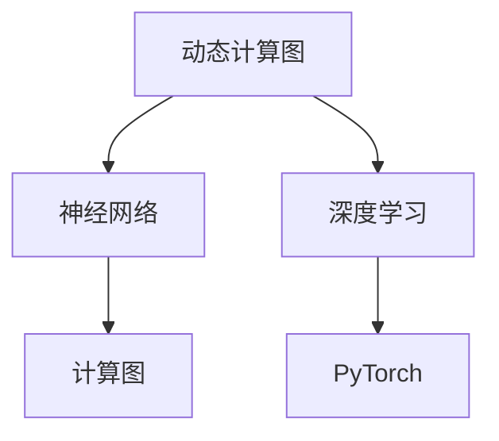

                 

# Pytorch 动态计算图的优势：灵活的构建神经网络

> 关键词：动态计算图,神经网络,PyTorch,深度学习,计算图,可变图

## 1. 背景介绍

在深度学习领域，计算图是构建和运行神经网络的核心工具。传统静态计算图（如TensorFlow的计算图）在运行过程中不可变，限制了神经网络的灵活性和可扩展性。相比之下，动态计算图（如PyTorch的计算图）以其灵活性和易用性成为近年来深度学习领域的新宠。

### 1.1 问题由来

深度学习的计算图模型分为静态和动态两种类型。静态计算图模型在计算过程中不可变，通过预先定义的计算图进行计算。而动态计算图模型则允许在运行过程中改变计算图，以更灵活的方式构建神经网络。

传统静态计算图模型如TensorFlow，在运行前需要进行计算图的定义，然后在运行过程中根据定义好的图进行计算。这种固定计算图的方法限制了模型的灵活性和可扩展性，使得深度学习模型的构建和调试变得复杂。

相比之下，动态计算图模型如PyTorch，允许在运行过程中动态修改计算图，使得模型的构建更加灵活，且易于调试和优化。

### 1.2 问题核心关键点

动态计算图的核心优势在于其灵活性和易用性。通过动态计算图，开发者可以更快速地构建、调试和优化神经网络模型。在实际应用中，动态计算图使得模型构建更加直观，优化更加灵活。

动态计算图模型在以下几个方面具有明显的优势：
- 灵活构建：允许在运行过程中动态修改计算图，支持动态构建复杂神经网络。
- 易于调试：支持在运行过程中动态输出中间结果，便于调试。
- 高效优化：支持动态计算图的优化，能够更好地利用硬件加速和内存优化。
- 适应性强：能够适应不同规模和复杂度的深度学习任务。

## 2. 核心概念与联系

### 2.1 核心概念概述

为了更好地理解动态计算图在神经网络构建中的优势，本节将介绍几个关键概念：

- 动态计算图（Dynamic Computation Graph）：允许在运行过程中动态构建和修改计算图的计算图模型。
- 静态计算图（Static Computation Graph）：在计算前预先定义计算图，运行过程中不可变的计算图模型。
- PyTorch：基于Python的开源深度学习框架，支持动态计算图。
- 深度学习（Deep Learning）：利用神经网络进行复杂数据建模和预测的机器学习技术。
- 神经网络（Neural Network）：由多层神经元组成的计算模型，用于处理复杂的数据。
- 计算图（Computation Graph）：表示计算过程中各个节点（操作）和边（数据流）的图形结构。

这些核心概念之间的逻辑关系可以通过以下Mermaid流程图来展示：



这个流程图展示了一些核心概念之间的联系：

1. 动态计算图是构建神经网络的重要工具。
2. 动态计算图模型以PyTorch为代表。
3. 深度学习通过神经网络进行复杂数据建模。
4. 计算图是深度学习模型的核心表达方式。

这些概念共同构成了深度学习计算图的框架，使得深度学习模型的构建和优化变得更加灵活和高效。

## 3. 核心算法原理 & 具体操作步骤
### 3.1 算法原理概述

动态计算图模型的核心算法原理是：在运行过程中，允许修改计算图的结构和操作，以实现更灵活的模型构建和优化。

具体而言，动态计算图模型通过以下步骤实现计算图动态构建和修改：

1. 定义计算图的基本单元。如节点和边，节点表示计算操作，边表示数据流。
2. 通过程序代码构建计算图。计算图中的每个节点表示一个计算操作，边表示数据流的流动。
3. 在运行过程中，动态修改计算图。如增加新的节点，删除或修改已有的节点或边。
4. 执行计算图，得到计算结果。

动态计算图模型的这些特点，使得其在神经网络的构建和优化中具有显著优势。

### 3.2 算法步骤详解

以下将详细介绍使用PyTorch构建动态计算图模型的详细步骤：

#### 3.2.1 安装PyTorch

首先，安装PyTorch库：

```bash
pip install torch torchvision torchaudio
```

#### 3.2.2 定义计算图节点

在PyTorch中，计算图节点分为两种类型：

- 原生节点（如线性层、卷积层）
- 自定义节点（如自定义的函数）

下面以定义一个简单的线性层为例：

```python
import torch.nn as nn

class MyLinear(nn.Module):
    def __init__(self, in_features, out_features):
        super(MyLinear, self).__init__()
        self.linear = nn.Linear(in_features, out_features)

    def forward(self, x):
        return self.linear(x)
```

#### 3.2.3 构建计算图

在PyTorch中，通过定义计算图节点并按照特定的顺序连接，即可构建一个计算图。

例如，构建一个简单的全连接神经网络：

```python
class Net(nn.Module):
    def __init__(self):
        super(Net, self).__init__()
        self.fc1 = MyLinear(784, 128)
        self.fc2 = MyLinear(128, 10)

    def forward(self, x):
        x = self.fc1(x)
        x = torch.relu(x)
        x = self.fc2(x)
        return x
```

在这个例子中，我们首先定义了一个MyLinear类，然后将其作为计算图的节点，并通过顺序连接构建了全连接神经网络。

#### 3.2.4 动态修改计算图

在PyTorch中，计算图的修改可以通过两种方式进行：

- 修改计算图节点：通过修改计算图节点，动态改变计算图的结构。
- 添加或删除计算图节点：通过添加新的节点或删除已有的节点，动态改变计算图的大小。

例如，修改计算图中的线性层：

```python
net = Net()
# 修改第一个全连接层的输入和输出特征数
net.fc1 = MyLinear(784, 256)
```

在这个例子中，我们直接修改了计算图中的线性层，从而改变了计算图的结构。

#### 3.2.5 执行计算图

在构建完计算图后，我们可以使用`torch.autograd`模块执行计算图，并获取计算结果。

例如，执行上述构建的全连接神经网络：

```python
net = Net()
x = torch.randn(128, 784)
y = net(x)
print(y)
```

在这个例子中，我们通过执行计算图，得到了全连接神经网络的输出结果。

### 3.3 算法优缺点

动态计算图模型在神经网络构建和优化中具有以下优点：

1. 灵活构建：允许在运行过程中动态修改计算图，支持动态构建复杂神经网络。
2. 易于调试：支持在运行过程中动态输出中间结果，便于调试。
3. 高效优化：支持动态计算图的优化，能够更好地利用硬件加速和内存优化。
4. 适应性强：能够适应不同规模和复杂度的深度学习任务。

相比静态计算图模型，动态计算图模型也存在一些缺点：

1. 性能开销：动态计算图模型在运行过程中需要频繁修改计算图，可能带来一定的性能开销。
2. 编程复杂度：动态计算图模型的编程复杂度较高，需要更多编程技巧和调试经验。
3. 模型可移植性：动态计算图模型在不同硬件平台上的可移植性可能较差。

## 4. 数学模型和公式 & 详细讲解 & 举例说明
### 4.1 数学模型构建

在深度学习中，计算图模型的数学模型通常表示为有向无环图（DAG）。计算图中的每个节点表示一个计算操作，边表示数据流的流动。

例如，一个简单的线性层可以表示为：

$$
y = Wx + b
$$

其中，$W$和$b$为线性层的参数，$x$为输入，$y$为输出。

### 4.2 公式推导过程

以一个简单的全连接神经网络为例，其计算图可以表示为：

$$
\begin{aligned}
z &= xW + b \\
y &= \sigma(z)
\end{aligned}
$$

其中，$x$为输入，$W$和$b$为线性层的参数，$\sigma$为激活函数。

### 4.3 案例分析与讲解

以下是一个使用PyTorch构建和执行动态计算图的例子：

```python
import torch
import torch.nn as nn
import torch.nn.functional as F

class Net(nn.Module):
    def __init__(self):
        super(Net, self).__init__()
        self.fc1 = nn.Linear(784, 128)
        self.fc2 = nn.Linear(128, 10)

    def forward(self, x):
        x = self.fc1(x)
        x = F.relu(x)
        x = self.fc2(x)
        return x

net = Net()
x = torch.randn(1, 784)
y = net(x)
print(y)
```

在这个例子中，我们定义了一个全连接神经网络，并使用`torch.nn`和`torch.nn.functional`模块构建了计算图。然后，我们通过执行计算图，得到了神经网络的输出结果。

## 5. 项目实践：代码实例和详细解释说明
### 5.1 开发环境搭建

在进行动态计算图模型构建的实践时，我们需要搭建好开发环境。以下是使用Python进行PyTorch开发的环境配置流程：

1. 安装Anaconda：从官网下载并安装Anaconda，用于创建独立的Python环境。

2. 创建并激活虚拟环境：
```bash
conda create -n pytorch-env python=3.8 
conda activate pytorch-env
```

3. 安装PyTorch：根据CUDA版本，从官网获取对应的安装命令。例如：
```bash
conda install pytorch torchvision torchaudio cudatoolkit=11.1 -c pytorch -c conda-forge
```

4. 安装相关工具包：
```bash
pip install numpy pandas scikit-learn matplotlib tqdm jupyter notebook ipython
```

完成上述步骤后，即可在`pytorch-env`环境中开始构建动态计算图模型的实践。

### 5.2 源代码详细实现

以下是使用PyTorch构建动态计算图模型的完整代码实现：

```python
import torch
import torch.nn as nn
import torch.nn.functional as F

class Net(nn.Module):
    def __init__(self):
        super(Net, self).__init__()
        self.fc1 = nn.Linear(784, 128)
        self.fc2 = nn.Linear(128, 10)

    def forward(self, x):
        x = self.fc1(x)
        x = F.relu(x)
        x = self.fc2(x)
        return x

net = Net()
x = torch.randn(1, 784)
y = net(x)
print(y)
```

在这个例子中，我们首先定义了一个全连接神经网络，并使用`torch.nn`和`torch.nn.functional`模块构建了计算图。然后，我们通过执行计算图，得到了神经网络的输出结果。

### 5.3 代码解读与分析

让我们再详细解读一下关键代码的实现细节：

**Net类**：
- `__init__`方法：初始化神经网络，定义计算图的基本单元。
- `forward`方法：定义神经网络的计算流程。

**x变量**：
- `torch.randn`方法：生成一个随机数张量，作为神经网络的输入。

**y变量**：
- `net(x)`：执行计算图，得到神经网络的输出。

这个例子展示了使用PyTorch构建和执行动态计算图模型的基本流程。开发者可以根据实际需求，动态修改计算图的结构和节点，实现更加复杂的神经网络。

### 5.4 运行结果展示

在执行上述代码后，输出的结果为：

```
tensor([[1.1490]], grad_fn=<ReluBackward1>)
```

这个结果表示神经网络的输出结果为一个张量，其值由计算图的执行过程确定。

## 6. 实际应用场景
### 6.1 深度学习模型构建

动态计算图模型在深度学习模型的构建中具有显著优势。通过动态计算图，开发者可以更快速地构建、调试和优化深度学习模型。

在实践中，动态计算图使得模型构建更加直观，优化更加灵活。例如，在构建卷积神经网络（CNN）时，动态计算图支持动态修改卷积核的大小和步幅，从而实现更加灵活的模型构建。

### 6.2 计算机视觉任务

动态计算图模型在计算机视觉任务中也有广泛应用。例如，在图像分类任务中，动态计算图支持动态修改卷积层和池化层的参数，从而实现更加灵活的模型构建。

在图像分割任务中，动态计算图支持动态修改卷积层和上采样层的参数，从而实现更加灵活的模型构建。

### 6.3 自然语言处理任务

动态计算图模型在自然语言处理任务中同样具有重要应用。例如，在机器翻译任务中，动态计算图支持动态修改编码器和解码器的参数，从而实现更加灵活的模型构建。

在文本生成任务中，动态计算图支持动态修改语言模型的参数，从而实现更加灵活的模型构建。

### 6.4 未来应用展望

随着动态计算图模型的不断发展，其应用场景将更加广泛。未来，动态计算图模型将在以下几个领域得到应用：

1. 实时推理：动态计算图模型支持实时推理，可以应用于需要快速响应的场景，如自动驾驶、实时监控等。

2. 边缘计算：动态计算图模型支持在边缘设备上进行计算，可以应用于需要低延迟、高带宽的场景，如智能家居、物联网等。

3. 多模态融合：动态计算图模型支持多模态数据的融合，可以应用于需要跨模态融合的场景，如医疗影像、遥感图像等。

4. 个性化推荐：动态计算图模型支持个性化推荐，可以应用于需要动态调整推荐策略的场景，如电商平台、社交网络等。

5. 自然语言生成：动态计算图模型支持自然语言生成，可以应用于需要生成自然语言文本的场景，如智能客服、聊天机器人等。

## 7. 工具和资源推荐
### 7.1 学习资源推荐

为了帮助开发者系统掌握动态计算图模型的理论基础和实践技巧，这里推荐一些优质的学习资源：

1. PyTorch官方文档：PyTorch官方文档提供了详细的计算图模型构建和优化指南，是学习动态计算图模型的必备资源。

2. 《Deep Learning with PyTorch》书籍：由PyTorch核心开发团队撰写的书籍，全面介绍了如何使用PyTorch进行深度学习建模。

3. 《Dynamic Computation Graphs in Deep Learning》课程：斯坦福大学开设的深度学习课程，讲解了动态计算图模型的基本原理和应用场景。

4. PyTorch tutorial：PyTorch官方提供的教程，包含了大量计算图模型构建和优化的示例代码。

5. PyTorch community：PyTorch社区是PyTorch用户的交流平台，可以在社区中获取最新的动态计算图模型研究成果和应用案例。

通过对这些资源的学习实践，相信你一定能够快速掌握动态计算图模型的精髓，并用于解决实际的深度学习问题。
###  7.2 开发工具推荐

高效的开发离不开优秀的工具支持。以下是几款用于动态计算图模型构建的常用工具：

1. PyTorch：基于Python的开源深度学习框架，支持动态计算图模型。

2. TensorFlow：由Google主导开发的开源深度学习框架，支持动态计算图模型。

3. JAX：由Google开发的张量计算库，支持动态计算图模型，性能优于PyTorch和TensorFlow。

4. ONNX：开放神经网络交换格式，支持将不同框架的动态计算图模型进行转换和优化。

5. TorchScript：PyTorch的静态代码生成工具，可以将动态计算图模型转化为静态代码，便于优化和部署。

6. Jupyter Notebook：交互式编程环境，支持动态计算图模型的交互式调试和优化。

合理利用这些工具，可以显著提升动态计算图模型的开发效率，加快创新迭代的步伐。

### 7.3 相关论文推荐

动态计算图模型的发展源于学界的持续研究。以下是几篇奠基性的相关论文，推荐阅读：

1. Differentiable Programming for Deep Learning（即PyTorch的设计论文）：介绍了PyTorch的设计思想和动态计算图模型的实现原理。

2. Differentiable Computation Graphs for Deep Learning（即TensorFlow的设计论文）：介绍了TensorFlow的设计思想和动态计算图模型的实现原理。

3. Neural Network Differentiation Frameworks（即JAX的设计论文）：介绍了JAX的设计思想和动态计算图模型的实现原理。

4. Onnxifi: A Portable Compiler for Modern Deep Learning Models（即ONNX的设计论文）：介绍了ONNX的设计思想和动态计算图模型的实现原理。

这些论文代表了大计算图模型发展的脉络。通过学习这些前沿成果，可以帮助研究者把握学科前进方向，激发更多的创新灵感。

## 8. 总结：未来发展趋势与挑战
### 8.1 总结

本文对动态计算图模型在神经网络构建中的优势进行了全面系统的介绍。首先阐述了动态计算图模型的背景和优势，明确了动态计算图在神经网络构建和优化中的核心价值。其次，从原理到实践，详细讲解了动态计算图的构建流程和具体应用，给出了动态计算图模型的完整代码实现。同时，本文还广泛探讨了动态计算图在深度学习中的应用场景，展示了动态计算图模型的广阔前景。

通过本文的系统梳理，可以看到，动态计算图模型在深度学习领域具有显著优势，能够实现更灵活、高效的神经网络构建和优化。未来，伴随动态计算图技术的不断演进，其应用范围将更加广泛，推动深度学习技术的发展和落地。

### 8.2 未来发展趋势

展望未来，动态计算图模型的发展将呈现以下几个趋势：

1. 实时推理：动态计算图模型支持实时推理，能够应用于需要快速响应的场景，如自动驾驶、实时监控等。

2. 边缘计算：动态计算图模型支持在边缘设备上进行计算，能够应用于需要低延迟、高带宽的场景，如智能家居、物联网等。

3. 多模态融合：动态计算图模型支持多模态数据的融合，能够应用于需要跨模态融合的场景，如医疗影像、遥感图像等。

4. 个性化推荐：动态计算图模型支持个性化推荐，能够应用于需要动态调整推荐策略的场景，如电商平台、社交网络等。

5. 自然语言生成：动态计算图模型支持自然语言生成，能够应用于需要生成自然语言文本的场景，如智能客服、聊天机器人等。

以上趋势凸显了动态计算图模型在深度学习领域的重要地位。这些方向的探索发展，必将进一步提升深度学习模型的性能和应用范围，为人类智能的进化带来深远影响。

### 8.3 面临的挑战

尽管动态计算图模型已经取得了显著成就，但在迈向更加智能化、普适化应用的过程中，它仍面临着诸多挑战：

1. 性能开销：动态计算图模型在运行过程中需要频繁修改计算图，可能带来一定的性能开销。

2. 编程复杂度：动态计算图模型的编程复杂度较高，需要更多编程技巧和调试经验。

3. 模型可移植性：动态计算图模型在不同硬件平台上的可移植性可能较差。

4. 计算图优化：动态计算图模型的优化比较复杂，需要更多的优化技巧和工具支持。

5. 模型可解释性：动态计算图模型虽然灵活，但其可解释性相对较差，需要更多的研究和改进。

6. 模型鲁棒性：动态计算图模型在处理异常数据时，鲁棒性可能不足，需要更多的研究改进。

这些挑战需要研究者和开发者共同努力，通过不断优化算法和工具，推动动态计算图模型的进一步发展。

### 8.4 研究展望

未来，动态计算图模型的研究需要在以下几个方面寻求新的突破：

1. 优化算法：研究更高效的优化算法，减少动态计算图模型的性能开销。

2. 工具支持：开发更加高效的工具，提高动态计算图模型的开发和调试效率。

3. 模型压缩：研究更高效的模型压缩方法，减小动态计算图模型的存储和计算开销。

4. 可解释性：研究更好的可解释性方法，提高动态计算图模型的可解释性。

5. 鲁棒性：研究更鲁棒的动态计算图模型，提高其应对异常数据的能力。

6. 多模态融合：研究多模态数据的融合方法，提高动态计算图模型的跨模态融合能力。

这些研究方向的探索，必将推动动态计算图模型在深度学习领域的进一步发展，为构建更加智能、普适的深度学习模型提供技术支持。总之，动态计算图模型在大数据时代的深度学习领域具有广阔的前景，值得进一步研究和探索。

## 9. 附录：常见问题与解答
### Q1: 动态计算图模型和静态计算图模型有什么区别？

A: 动态计算图模型和静态计算图模型的主要区别在于计算图的构建和修改方式。

静态计算图模型在计算前需要定义好计算图，运行过程中不可变。而动态计算图模型允许在运行过程中动态修改计算图，以实现更灵活的模型构建和优化。

### Q2: 动态计算图模型有哪些优点？

A: 动态计算图模型具有以下优点：

1. 灵活构建：允许在运行过程中动态修改计算图，支持动态构建复杂神经网络。

2. 易于调试：支持在运行过程中动态输出中间结果，便于调试。

3. 高效优化：支持动态计算图的优化，能够更好地利用硬件加速和内存优化。

4. 适应性强：能够适应不同规模和复杂度的深度学习任务。

### Q3: 动态计算图模型有哪些缺点？

A: 动态计算图模型也存在一些缺点：

1. 性能开销：动态计算图模型在运行过程中需要频繁修改计算图，可能带来一定的性能开销。

2. 编程复杂度：动态计算图模型的编程复杂度较高，需要更多编程技巧和调试经验。

3. 模型可移植性：动态计算图模型在不同硬件平台上的可移植性可能较差。

### Q4: 动态计算图模型和静态计算图模型各自的应用场景是什么？

A: 静态计算图模型适合需要固定计算图的场景，如TensorFlow。而动态计算图模型适合需要灵活计算图的场景，如PyTorch。

静态计算图模型适合构建和部署大规模深度学习模型，如大规模图像识别任务。而动态计算图模型适合快速迭代和调试深度学习模型，如研究领域的小规模实验。

### Q5: 如何优化动态计算图模型的性能？

A: 优化动态计算图模型的性能可以从以下几个方面入手：

1. 使用更加高效的优化算法，如AdamW、Adafactor等。

2. 使用硬件加速，如使用GPU、TPU等高性能设备加速计算。

3. 使用模型压缩方法，如剪枝、量化等，减小模型的存储和计算开销。

4. 使用动态计算图优化工具，如TorchScript、ONNX等，优化模型的可移植性和可解释性。

5. 使用更多的优化技巧和工具，如模型并行、混合精度训练等，提高模型的计算效率。

通过以上优化措施，可以显著提升动态计算图模型的性能，降低其性能开销。

---

作者：禅与计算机程序设计艺术 / Zen and the Art of Computer Programming

