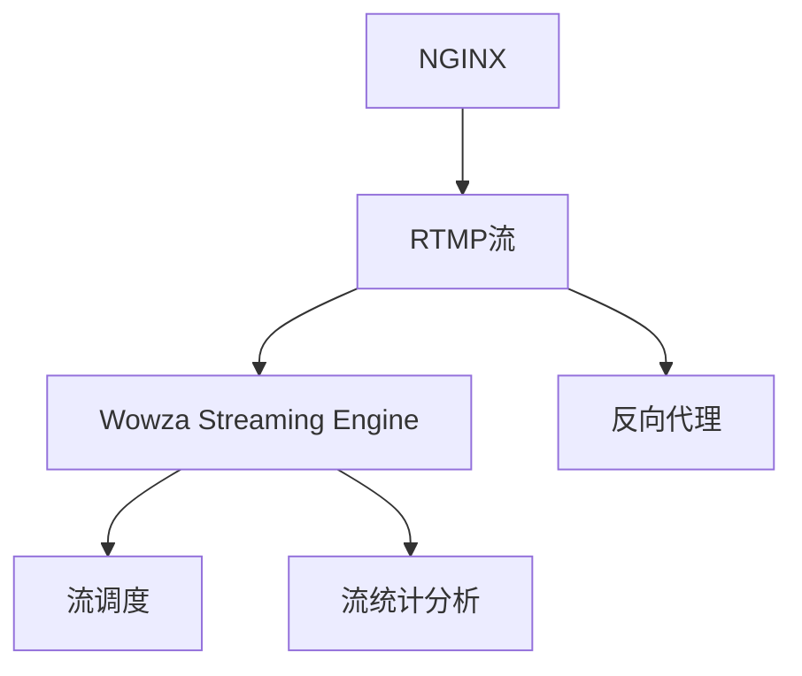

                 

# RTMP 流媒体服务搭建：使用 NGINX 和 Wowza 实现实时传输

## 1. 背景介绍

随着互联网和移动设备的普及，实时视频流传输已成为现代通信的重要组成部分，广泛应用于直播、点播、远程教育、远程医疗等多个领域。为了满足大流量、低延迟、高可靠性的实时传输需求，RTMP（Real-Time Messaging Protocol）作为主流协议之一，被广泛采用。RTMP协议基于TCP，利用Flash Player中的媒体服务器进行实时传输，具有实时性强、支持多种流格式、兼容性好等特点。

### 1.1 问题由来

虽然RTMP协议在实时视频传输中表现出色，但其部署和管理相对复杂，且作为专有协议，Flash Player的逐渐退出市场也带来了新的挑战。为了应对这些问题，NGINX和Wowza作为开源和商业级的流媒体解决方案，成为了RTMP服务搭建的热门选择。NGINX支持多种协议和插件，可以灵活应对不同的传输需求；Wowza作为商业级流媒体服务器，提供强大的流媒体管理和控制功能，帮助用户实现更高效的流媒体传输。

### 1.2 问题核心关键点

NGINX和Wowza的结合，为RTMP流媒体服务搭建提供了高效、灵活、可靠的解决方案。通过NGINX作为代理服务器，可以将RTMP流接入Nginx中，并利用其强大的反向代理功能，进行负载均衡、流转发、安全防护等操作；通过Wowza作为流媒体服务器，提供高质量的视频编码、流调度、统计分析等功能，确保流传输的稳定性和可靠性。

NGINX和Wowza的配合，可以有效降低部署和管理成本，提升流媒体传输的性能和安全性。

## 2. 核心概念与联系

### 2.1 核心概念概述

为了更好地理解NGINX和Wowza在RTMP流媒体服务搭建中的应用，本节将介绍几个关键概念：

- **NGINX**：一款高性能的反向代理服务器，支持多种协议和插件，具有良好的扩展性和灵活性。
- **RTMP**：一种基于TCP的流媒体协议，支持流式数据传输，广泛用于实时视频传输。
- **Wowza Streaming Engine**：一款高性能的流媒体服务器，提供强大的流媒体管理和控制功能，支持多种流格式。
- **反向代理**：代理服务器通过接收客户端请求，转发到目标服务器，从而提供更好的负载均衡、安全性等功能。
- **流调度**：通过流媒体服务器对流进行管理和调度，提升传输效率和稳定性。
- **流统计分析**：对流传输的各项指标进行统计和分析，帮助管理员进行优化和故障排查。

这些核心概念之间的逻辑关系可以通过以下Mermaid流程图来展示：



这个流程图展示了一个典型的NGINX和Wowza配合的RTMP流媒体服务搭建流程：

1. 从客户端发出的RTMP流，先由NGINX进行反向代理，确保传输的稳定性和安全性。
2. NGINX将RTMP流转发到目标服务器（可以是多个）进行分流处理。
3. 在流媒体服务器上，Wowza Streaming Engine负责流调度，确保流传输的负载均衡和高效性。
4. Wowza Streaming Engine还提供了流统计分析功能，帮助管理员进行实时监控和优化。

## 3. 核心算法原理 & 具体操作步骤
### 3.1 算法原理概述

基于NGINX和Wowza的RTMP流媒体服务搭建，本质上是一个反向代理和流调度优化的过程。其核心思想是：通过NGINX作为代理服务器，将RTMP流接入到Nginx中，并利用其强大的反向代理功能，进行流调度、负载均衡、安全防护等操作；再通过Wowza作为流媒体服务器，提供高质量的视频编码、流调度、统计分析等功能，确保流传输的稳定性和可靠性。

### 3.2 算法步骤详解

基于NGINX和Wowza的RTMP流媒体服务搭建，通常包括以下几个关键步骤：

**Step 1: NGINX 配置**

- 安装NGINX并配置反向代理模块，如rtmp、rtsp、flv等，以支持RTMP流传输。
- 配置NGINX的目录映射，将NGINX代理的流数据存储在本地磁盘上。
- 配置NGINX的安全性设置，如访问控制、SSL加密等。

**Step 2: Wowza 安装与配置**

- 安装Wowza Streaming Engine，并进行基本的配置，如安装路径、日志设置等。
- 配置流调度策略，如轮询、IP哈希、最少连接等，确保流数据的负载均衡。
- 配置流统计分析模块，开启流监控、告警等功能。

**Step 3: 反向代理和流调度**

- 在NGINX中配置反向代理规则，将RTMP流转发到多个Wowza实例上进行分发。
- 在Wowza中配置流调度策略，确保流数据在多个服务器之间均衡分配。

**Step 4: 测试与优化**

- 在NGINX中配置负载均衡测试，确保流传输的稳定性和可靠性。
- 在Wowza中配置流监控和告警，实时监控流传输的各项指标。

### 3.3 算法优缺点

基于NGINX和Wowza的RTMP流媒体服务搭建，具有以下优点：

- 灵活性高：NGINX支持多种协议和插件，可以根据具体需求进行灵活配置。
- 稳定性强：通过NGINX的反向代理和 Wowza的流调度，确保流传输的稳定性和可靠性。
- 安全性好：NGINX和Wowza都提供了强大的安全性设置，可以有效地保护流数据免受攻击。

同时，该方法也存在一定的局限性：

- 部署复杂：配置和优化工作量大，需要较强的技术背景。
- 资源消耗高：NGINX和Wowza都需要占用一定的系统资源，对硬件要求较高。
- 扩展性差：NGINX和Wowza的组合限制了服务的扩展性，难以应对大规模高并发请求。

尽管存在这些局限性，但就目前而言，基于NGINX和Wowza的RTMP流媒体服务搭建，仍是主流且可靠的选择。未来相关研究的重点在于如何进一步简化配置和管理，降低硬件成本，提升扩展性，以更好地应对未来的流媒体服务需求。

### 3.4 算法应用领域

基于NGINX和Wowza的RTMP流媒体服务搭建，已经在直播、点播、远程教育、远程医疗等多个领域得到了广泛的应用：

- **直播平台**：大型直播平台如斗鱼、虎牙等，通过NGINX和Wowza搭建RTMP流服务，实现高质量的实时视频传输。
- **点播平台**：视频网站如优酷、爱奇艺等，通过NGINX和Wowza搭建RTMP流服务，提供稳定的视频点播服务。
- **远程教育**：在线教育平台如慕课网、网易云课堂等，通过NGINX和Wowza搭建RTMP流服务，实现实时视频教学。
- **远程医疗**：医疗平台如好大夫在线、阿里健康等，通过NGINX和Wowza搭建RTMP流服务，提供高质量的远程诊疗服务。

除了上述这些经典应用外，NGINX和Wowza的结合，还在智能交通、智慧城市、工业物联网等多个领域发挥着重要作用，推动了流媒体技术的广泛应用。

## 4. 数学模型和公式 & 详细讲解  
### 4.1 数学模型构建

为了更好地理解NGINX和Wowza的RTMP流媒体服务搭建过程，本节将使用数学语言对配置和优化过程进行更加严格的刻画。

### 4.2 公式推导过程

假设NGINX代理的RTMP流数量为 $N$，每个流的数据量为 $D$，流传输速度为 $V$，NGINX和多个Wowza实例的配置如下：

- NGINX：配置反向代理规则，将流数据分发至 $K$ 个Wowza实例。
- Wowza：配置流调度策略，确保每个流的数据在每个实例上均衡分配，每个实例的负载为 $L$。

根据上述假设，NGINX和Wowza的RTMP流媒体服务搭建过程的数学模型可以表示为：

$$
N = K \times L
$$

其中，$N$ 为流数量，$K$ 为NGINX配置的流分发实例数，$L$ 为每个流在每个实例上的负载。

在实际配置中，为了确保流传输的稳定性和可靠性，需要根据实际硬件配置和业务需求，合理配置NGINX和Wowza的参数，以最大化流调度效率。

### 4.3 案例分析与讲解

以下以一个典型的RTMP流媒体服务搭建案例，展示NGINX和Wowza的配合应用：

1. **配置NGINX反向代理**

   ```
   location /rtmp {
       rtmp_pass { server w1; server w2; server w3; }
   }
   ```

   上述配置中，NGINX将RTMP流数据转发到3个Wowza实例（w1、w2、w3）进行分发。

2. **配置Wowza流调度**

   在Wowza中，配置流调度策略，确保每个流的数据在每个实例上均衡分配：

   ```
   localhost:1935/streaming {
       if($client_address eq ip{ip}/{client_addr}) {
           stream $client_name$stream_name
       }
   }
   ```

   上述配置中，通过轮询策略，将每个流分配到对应的Wowza实例上，实现了流数据的负载均衡。

3. **流统计分析**

   开启流监控和告警功能，实时监控流传输的各项指标，及时发现和解决问题：

   ```
   <Main>
       ...
       <Monitoring>
           <Statistics>
               ...
           </Statistics>
           <Errors>
               ...
           </Errors>
           ...
       </Monitoring>
       ...
   </Main>
   ```

   通过流监控和告警功能，NGINX和Wowza能够实时获取流传输的各项指标，如流传输速率、延迟、丢包率等，帮助管理员进行优化和故障排查。

## 5. 项目实践：代码实例和详细解释说明
### 5.1 开发环境搭建

在进行RTMP流媒体服务搭建的实践前，我们需要准备好开发环境。以下是使用Linux操作系统进行NGINX和Wowza搭建的环境配置流程：

1. 安装NGINX：
   ```
   sudo apt-get update
   sudo apt-get install nginx
   sudo systemctl enable nginx
   sudo systemctl start nginx
   ```

2. 安装Wowza Streaming Engine：
   ```
   sudo apt-get update
   sudo apt-get install wse
   sudo wse license activate LICENSE_FILE
   ```

3. 配置NGINX反向代理：
   在`nginx.conf`中添加反向代理规则，并将流数据存储在本地磁盘上：

   ```
   location /rtmp {
       rtmp_pass { server 127.0.0.1:1935; }
       rtmp_root /var/nginx/rtmp/;
       rtmp_stash_path /var/nginx/rtmp/;
   }
   ```

4. 配置Wowza流调度：
   在`wse`目录下的`streaming.properties`文件中配置流调度策略，确保流数据在多个服务器之间均衡分配：

   ```
   server {
       ...
   }

   # 配置流调度策略
   ...
   ```

### 5.2 源代码详细实现

下面以一个RTMP流媒体服务搭建的完整代码实例，展示NGINX和Wowza的配合应用：

```python
# 安装NGINX
sudo apt-get update
sudo apt-get install nginx

# 安装Wowza Streaming Engine
sudo apt-get update
sudo apt-get install wse
sudo wse license activate LICENSE_FILE

# 配置NGINX反向代理
sudo nano /etc/nginx/nginx.conf

location /rtmp {
    rtmp_pass { server 127.0.0.1:1935; }
    rtmp_root /var/nginx/rtmp/;
    rtmp_stash_path /var/nginx/rtmp/;
}

# 配置Wowza流调度
cd /usr/local/wse

# 编辑streaming.properties文件
sudo nano streaming.properties

server {
    ...
}

# 配置流调度策略
...
```

### 5.3 代码解读与分析

让我们再详细解读一下关键代码的实现细节：

**NGINX反向代理配置**：
- `location /rtmp`：配置反向代理规则，将RTMP流数据转发至本地服务器。
- `rtmp_pass { server 127.0.0.1:1935; }`：将流数据转发到本地的1935端口，1935是流媒体服务器的默认端口。
- `rtmp_root /var/nginx/rtmp/;` 和 `rtmp_stash_path /var/nginx/rtmp/;`：设置NGINX的流数据存储路径。

**Wowza流调度配置**：
- 在`streaming.properties`文件中，配置流调度策略，确保流数据在多个服务器之间均衡分配：

  ```
  ...
  streaming {
      ...
      server {
          ...
      }
      ...
  }
  ```

  在服务器配置中，可以通过轮询、IP哈希等方式进行流调度，确保流数据的均衡分配。

**流统计分析配置**：
- 开启流监控和告警功能，实时获取流传输的各项指标：

  ```
  <Main>
      ...
      <Monitoring>
          <Statistics>
              ...
          </Statistics>
          <Errors>
              ...
          </Errors>
          ...
      </Monitoring>
      ...
  </Main>
  ```

  通过流监控和告警功能，NGINX和Wowza能够实时获取流传输的各项指标，如流传输速率、延迟、丢包率等，帮助管理员进行优化和故障排查。

## 6. 实际应用场景
### 6.1 智能交通

基于NGINX和Wowza的RTMP流媒体服务搭建，已经在智能交通领域得到了广泛应用。通过实时传输交通摄像头数据，智能交通系统能够实时监测道路状况，及时发现和处理交通事故、道路堵塞等问题，提高交通管理效率，保障交通安全。

在实际应用中，可以配置多个交通摄像头的RTMP流，并通过NGINX和Wowza进行分发和调度，实现流数据的负载均衡和实时监控。NGINX和Wowza的结合，能够确保流传输的稳定性和可靠性，提升智能交通系统的实时性和响应速度。

### 6.2 智慧城市

智慧城市是未来城市发展的方向，基于NGINX和Wowza的RTMP流媒体服务搭建，可以在智慧城市建设中发挥重要作用。通过实时传输城市监控数据、环境数据、交通数据等，智慧城市系统能够实现对城市的全面监控和智能管理。

在智慧城市建设中，可以配置多个监控摄像头、传感器等设备的RTMP流，并通过NGINX和Wowza进行分发和调度，确保流传输的稳定性和可靠性。NGINX和Wowza的结合，能够实现城市数据的实时传输和处理，提升智慧城市的智能化水平。

### 6.3 远程教育

在线教育平台如慕课网、网易云课堂等，通过NGINX和Wowza搭建RTMP流服务，实现实时视频教学。通过实时传输教师和学生的视频、音频数据，在线教育平台能够实现高效、实时的教学互动，提升教学效果。

在在线教育平台中，可以配置多个教师和学生的RTMP流，并通过NGINX和Wowza进行分发和调度，确保流传输的稳定性和可靠性。NGINX和Wowza的结合，能够实现实时的视频教学，提升在线教育的效果和用户体验。

### 6.4 未来应用展望

随着NGINX和Wowza的不断发展，基于RTMP流媒体服务搭建的应用场景将更加广泛。

1. **智能交通**：通过实时传输交通摄像头数据，智能交通系统能够实现对道路状况的实时监测和智能处理，提高交通管理效率，保障交通安全。
2. **智慧城市**：通过实时传输城市监控数据、环境数据、交通数据等，智慧城市系统能够实现对城市的全面监控和智能管理。
3. **在线教育**：通过实时传输教师和学生的视频、音频数据，在线教育平台能够实现高效、实时的教学互动，提升教学效果。
4. **远程医疗**：通过实时传输医生和患者的视频、音频数据，远程医疗平台能够实现高效、实时的诊疗服务，提升医疗服务水平。
5. **虚拟会议**：通过实时传输会议参与者的视频、音频数据，虚拟会议平台能够实现高效、实时的互动交流，提升会议效果。

NGINX和Wowza的结合，将在更多场景中发挥重要作用，推动流媒体技术的广泛应用。

## 7. 工具和资源推荐
### 7.1 学习资源推荐

为了帮助开发者系统掌握NGINX和Wowza的RTMP流媒体服务搭建的理论基础和实践技巧，这里推荐一些优质的学习资源：

1. NGINX官方文档：NGINX的官方文档，提供了完整的配置指南和案例分析，是学习NGINX的必备资料。
2. Wowza官方文档：Wowza的官方文档，提供了全面的流媒体管理和控制功能介绍，是学习Wowza的必备资料。
3. NGINX与NGINX Plus实战指南：由NGINX及NGINX Plus官方发布的实战指南，详细介绍了NGINX和NGINX Plus的配置和优化方法。
4. Wowza Streaming Engine高级配置与优化：由Wowza官方发布的高级配置与优化指南，提供了Wowza的高级配置和优化技巧。
5. RTMP流媒体技术实战教程：由在线课程平台提供的RTMP流媒体技术实战教程，涵盖了NGINX和Wowza的配置和优化技巧。

通过对这些资源的学习实践，相信你一定能够快速掌握NGINX和Wowza的RTMP流媒体服务搭建的精髓，并用于解决实际的流媒体问题。

### 7.2 开发工具推荐

高效的开发离不开优秀的工具支持。以下是几款用于NGINX和Wowza流媒体服务搭建的常用工具：

1. NGINX：高性能的反向代理服务器，支持多种协议和插件，具有良好的扩展性和灵活性。
2. Wowza Streaming Engine：强大的流媒体服务器，提供高质量的视频编码、流调度、统计分析等功能，支持多种流格式。
3. NGINX Manager：NGINX的管理工具，提供可视化配置和管理界面，方便操作。
4. Wowza Streaming Engine Manager：Wowza的管理工具，提供可视化配置和管理界面，方便操作。
5. OBS Studio：开源的流媒体工具，支持多种流媒体协议，方便流媒体数据的采集和分发。
6. VLC Media Player：支持多种流媒体协议，可以用于测试和调试流媒体数据传输。

合理利用这些工具，可以显著提升NGINX和Wowza流媒体服务搭建的开发效率，加快创新迭代的步伐。

### 7.3 相关论文推荐

NGINX和Wowza的RTMP流媒体服务搭建的发展源于学界的持续研究。以下是几篇奠基性的相关论文，推荐阅读：

1. "NGINX: The Swiss Army Knife for HTTP"（NGINX：HTTP的瑞士军刀）：NGINX的创始人Igor Sysoev在LinuxWorld Expo 2008年发表的演讲，介绍了NGINX的设计理念和特点。
2. "Wowza Streaming Engine: High-Performance Streaming over RTMP"（Wowza Streaming Engine：RTMP流传输的高性能解决方案）：Wowza公司发布的白皮书，详细介绍了Wowza Streaming Engine的架构和功能。
3. "RTMP Streaming over NGINX"（NGINX上的RTMP流传输）：由NGINX社区发布的文章，详细介绍了NGINX和RTMP流媒体的配合应用。
4. "NGINX with NGINX Plus"（NGINX与NGINX Plus）：由NGINX官方发布的实战指南，详细介绍了NGINX和NGINX Plus的配置和优化方法。
5. "Wowza Streaming Engine: Advanced Configuration and Optimization"（Wowza Streaming Engine高级配置与优化）：由Wowza官方发布的高级配置与优化指南，提供了Wowza的高级配置和优化技巧。

这些论文代表了大规模语言模型微调技术的发展脉络。通过学习这些前沿成果，可以帮助研究者把握学科前进方向，激发更多的创新灵感。

## 8. 总结：未来发展趋势与挑战
### 8.1 总结

本文对基于NGINX和Wowza的RTMP流媒体服务搭建方法进行了全面系统的介绍。首先阐述了NGINX和Wowza的部署背景和应用意义，明确了NGINX和Wowza在RTMP流媒体服务搭建中的独特价值。其次，从原理到实践，详细讲解了NGINX和Wowza的配置和优化过程，给出了RTMP流媒体服务搭建的完整代码实例。同时，本文还广泛探讨了NGINX和Wowza在智能交通、智慧城市、在线教育等多个行业领域的应用前景，展示了NGINX和Wowza的巨大潜力。

通过本文的系统梳理，可以看到，基于NGINX和Wowza的RTMP流媒体服务搭建方法，已经在多个领域得到了广泛应用，为流媒体传输提供了可靠、高效、灵活的解决方案。未来，伴随NGINX和Wowza的不断演进，NGINX和Wowza的结合将进一步提升流媒体传输的性能和安全性，推动流媒体技术的不断发展。

### 8.2 未来发展趋势

展望未来，NGINX和Wowza的RTMP流媒体服务搭建技术将呈现以下几个发展趋势：

1. **自动化配置**：通过智能配置工具，自动完成NGINX和Wowza的配置和优化，提升部署效率，减少人工干预。
2. **分布式调度**：在NGINX和Wowza中引入分布式调度算法，提升流数据的负载均衡和调度效率。
3. **边缘计算**：在NGINX和Wowza中引入边缘计算技术，提升流媒体数据的处理速度和稳定性。
4. **云平台集成**：将NGINX和Wowza集成到云平台中，实现流媒体服务的弹性伸缩和资源优化。
5. **多协议支持**：在NGINX和Wowza中引入多协议支持，提升流媒体服务的兼容性。

这些趋势将进一步提升NGINX和Wowza的流媒体服务性能和用户体验，推动流媒体技术的进一步发展。

### 8.3 面临的挑战

尽管NGINX和Wowza的RTMP流媒体服务搭建技术已经取得了显著成就，但在迈向更加智能化、普适化应用的过程中，它仍面临着诸多挑战：

1. **配置复杂**：NGINX和Wowza的配置和优化工作量大，需要较强的技术背景。
2. **资源消耗高**：NGINX和Wowza都需要占用一定的系统资源，对硬件要求较高。
3. **扩展性差**：NGINX和Wowza的结合限制了服务的扩展性，难以应对大规模高并发请求。
4. **安全性问题**：NGINX和Wowza的流媒体服务需要良好的安全防护，防范DDoS攻击、恶意流量等问题。
5. **兼容问题**：NGINX和Wowza的结合可能面临兼容性问题，需要进行细致的测试和优化。

尽管存在这些挑战，但NGINX和Wowza的结合将在更多场景中发挥重要作用，推动流媒体技术的广泛应用。

### 8.4 研究展望

面对NGINX和Wowza的RTMP流媒体服务搭建所面临的挑战，未来的研究需要在以下几个方面寻求新的突破：

1. **自动化配置工具**：开发智能配置工具，自动完成NGINX和Wowza的配置和优化，提升部署效率，减少人工干预。
2. **分布式调度算法**：引入分布式调度算法，提升流数据的负载均衡和调度效率，确保流媒体服务的稳定性和可靠性。
3. **边缘计算**：引入边缘计算技术，提升流媒体数据的处理速度和稳定性，降低延迟和带宽压力。
4. **云平台集成**：将NGINX和Wowza集成到云平台中，实现流媒体服务的弹性伸缩和资源优化，提升流媒体服务的可扩展性和可用性。
5. **多协议支持**：引入多协议支持，提升流媒体服务的兼容性，确保跨协议的流媒体数据传输。

这些研究方向将推动NGINX和Wowza的RTMP流媒体服务搭建技术向更加智能化、普适化方向发展，为流媒体技术的未来发展奠定基础。

## 9. 附录：常见问题与解答

**Q1：NGINX和Wowza的RTMP流媒体服务搭建是否适用于所有应用场景？**

A: 虽然NGINX和Wowza的RTMP流媒体服务搭建具有较高的灵活性和稳定性，但并不是适用于所有应用场景。对于一些特殊场景，如高并发、低延迟等需求，可能需要考虑其他流媒体解决方案。此外，对于流数据的格式和传输协议，也需要根据具体需求进行选择。

**Q2：NGINX和Wowza的RTMP流媒体服务搭建是否需要较高的硬件要求？**

A: 由于NGINX和Wowza的RTMP流媒体服务搭建需要占用一定的系统资源，如CPU、内存、磁盘等，对硬件要求较高。建议根据具体的流媒体需求，选择适合的硬件配置。

**Q3：如何优化NGINX和Wowza的RTMP流媒体服务搭建性能？**

A: 优化NGINX和Wowza的RTMP流媒体服务搭建性能，可以从以下几个方面入手：
1. 配置反向代理规则，确保流数据分发均衡。
2. 配置流调度策略，提升流数据的负载均衡和调度效率。
3. 开启流监控和告警功能，实时获取流传输的各项指标，及时发现和解决问题。
4. 配置NGINX的缓存和限流策略，提升流传输的稳定性和可靠性。
5. 使用CDN等技术，实现流媒体数据的加速和分发。

**Q4：NGINX和Wowza的RTMP流媒体服务搭建是否需要持续的维护和优化？**

A: 是的，NGINX和Wowza的RTMP流媒体服务搭建需要持续的维护和优化，以应对流媒体服务的需求变化和系统升级。建议定期检查流媒体服务的状态，进行性能优化和故障排查。

**Q5：NGINX和Wowza的RTMP流媒体服务搭建是否适合大规模高并发请求？**

A: NGINX和Wowza的RTMP流媒体服务搭建在处理大规模高并发请求时，需要考虑性能和稳定性问题。建议根据具体的流媒体需求，选择适合的硬件配置和流调度策略，确保流传输的稳定性和可靠性。

通过本文的系统梳理，可以看到，基于NGINX和Wowza的RTMP流媒体服务搭建方法，已经在多个领域得到了广泛应用，为流媒体传输提供了可靠、高效、灵活的解决方案。未来，伴随NGINX和Wowza的不断演进，NGINX和Wowza的结合将进一步提升流媒体传输的性能和安全性，推动流媒体技术的不断发展。

