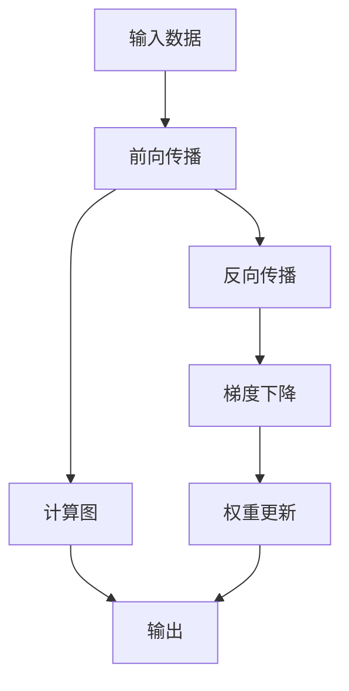

                 

# Tensor计算：深度学习的数学基石

> 关键词：Tensor,深度学习,数学模型,数值计算,反向传播,梯度下降,神经网络

## 1. 背景介绍

### 1.1 问题由来
深度学习（Deep Learning）作为现代人工智能的支柱技术，已经在诸如计算机视觉、自然语言处理、语音识别等多个领域取得了突破性进展。其核心在于构建多层神经网络，通过大量数据的反向传播（Backpropagation）训练模型参数，从而实现复杂的非线性映射和预测。然而，深度学习模型的训练和推理过程涉及大量的数值计算，这使得它对计算资源的依赖极大，从早期GPU的昂贵与稀少，到今日的广泛应用，背后都是大量工程师和科学家在硬件与软件方面的不懈努力。

### 1.2 问题核心关键点
在深度学习中，Tensor计算扮演了至关重要的角色。Tensor是用于表示多维数组的数据结构，它们通常用于表示神经网络中的权重和偏置，以及输入和输出数据。Tensor计算则是指使用Tensor来执行数值计算的过程，包括前向传播和反向传播。这一过程是深度学习模型的基础，通过将大量数据打包进Tensor中，并高效地执行计算，深度学习得以实现大规模模型的训练和推理。

Tensor计算的核心在于其能将复杂的数值计算任务，如矩阵乘法、向量加法等，高效地映射到硬件加速器（如GPU）上，加速计算过程，降低能耗，提高训练效率。这一过程不仅需要扎实的数学基础，还需对计算架构、优化算法有深刻理解。本文将详细解析Tensor计算的数学原理、操作步骤，并分析其优缺点及应用领域，期望能够为深度学习开发者提供一个全面的学习框架。

## 2. 核心概念与联系

### 2.1 核心概念概述

为了更好地理解Tensor计算在深度学习中的作用，我们需要掌握以下几个关键概念：

- **Tensor**：用于表示多维数组的数据结构，通常是深度学习模型中的权重和偏置，以及输入和输出数据。
- **神经网络**：由多个层组成的网络结构，每个层由一系列神经元组成，通过前向传播和反向传播更新权重和偏置，从而实现数据的映射和预测。
- **前向传播**：将输入数据通过神经网络，计算出预测结果的过程。
- **反向传播**：通过计算预测值与真实值之间的误差，反向更新神经网络权重和偏置，以减小误差的过程。
- **梯度下降**：一种优化算法，通过迭代更新模型参数，使得损失函数最小化，优化模型的性能。

这些概念之间通过计算图（Computational Graph）相连，计算图是记录神经网络计算过程的图形表示，其中每个操作对应一个节点，每个节点的输入和输出连接了前一层的输出和下一层的输入。通过计算图，可以高效地进行数值计算，并在反向传播时自动计算梯度。

### 2.2 核心概念原理和架构的 Mermaid 流程图



这个流程图展示了Tensor计算在深度学习中的基本流程：从输入数据到前向传播，再到计算图、输出和反向传播，最后通过梯度下降更新权重。

## 3. 核心算法原理 & 具体操作步骤

### 3.1 算法原理概述

Tensor计算的原理基于数值计算，即使用Tensor进行矩阵乘法、向量加法等基本操作，从而完成深度学习模型的前向传播和反向传播。这一过程通过计算图进行高效记录和执行，显著降低了计算复杂度，提升了计算速度。

具体来说，Tensor计算包括：
- **前向传播**：将输入数据通过神经网络计算输出结果的过程。
- **反向传播**：根据输出结果与真实值的误差，反向计算梯度，更新模型参数的过程。

### 3.2 算法步骤详解

Tensor计算的步骤如下：

1. **数据准备**：将输入数据和标签数据转换为Tensor格式。
2. **构建模型**：定义神经网络的结构，包括各层神经元的数量和连接方式。
3. **前向传播**：通过计算图执行前向传播，计算输出结果。
4. **损失计算**：计算预测结果与真实值之间的误差，即损失函数。
5. **反向传播**：计算梯度，更新模型参数。
6. **优化**：通过优化算法如梯度下降，调整模型参数以最小化损失函数。
7. **模型评估**：在测试集上评估模型的性能。

### 3.3 算法优缺点

Tensor计算的优点在于：
- **高效计算**：Tensor计算利用了GPU、TPU等硬件加速器，大幅度提升了计算效率。
- **可扩展性**：Tensor计算的计算图结构支持模型并行和分布式计算，可以轻松扩展到大规模模型。
- **便于优化**：通过梯度下降等优化算法，Tensor计算可以自动调整模型参数，提升模型性能。

缺点在于：
- **资源消耗大**：Tensor计算对内存和计算资源的需求较大，对硬件设备要求高。
- **调试复杂**：Tensor计算的计算图结构复杂，调试时容易出错。
- **依赖库**：Tensor计算依赖于TensorFlow、PyTorch等库，迁移成本高。

### 3.4 算法应用领域

Tensor计算广泛应用于深度学习模型的训练和推理过程，特别在以下几个领域：

- **计算机视觉**：如图像分类、目标检测、人脸识别等。通过Tensor计算，可以高效地处理大规模图像数据。
- **自然语言处理**：如文本分类、情感分析、机器翻译等。Tensor计算可以处理文本数据的多维特性，实现高效的计算。
- **语音识别**：如自动语音识别、语音合成等。Tensor计算可以高效地处理音频数据。
- **推荐系统**：如协同过滤、基于矩阵分解的推荐算法等。Tensor计算可以处理稀疏矩阵，优化推荐模型的性能。

## 4. 数学模型和公式 & 详细讲解 & 举例说明

### 4.1 数学模型构建

Tensor计算的核心是矩阵和向量乘法，它们是深度学习模型的基本计算单位。设输入数据为 $X \in \mathbb{R}^{m \times n}$，权重矩阵为 $W \in \mathbb{R}^{n \times k}$，偏置向量为 $b \in \mathbb{R}^{k}$，则前向传播过程如下：

$$
Y = XW + b
$$

其中 $Y \in \mathbb{R}^{m \times k}$ 为输出结果。在Tensor计算中，这些操作通过Tensor表示，并使用计算图进行高效记录和执行。

### 4.2 公式推导过程

设损失函数为 $L(Y, T)$，其中 $T$ 为真实标签，则反向传播过程如下：

1. **损失函数计算**：
   $$
   \frac{\partial L}{\partial Y} = \frac{\partial L}{\partial T} \cdot \frac{\partial T}{\partial Y}
   $$

2. **梯度计算**：
   $$
   \frac{\partial L}{\partial W} = \frac{\partial L}{\partial Y} \cdot \frac{\partial Y}{\partial W}
   $$
   $$
   \frac{\partial L}{\partial b} = \frac{\partial L}{\partial Y} \cdot \frac{\partial Y}{\partial b}
   $$

3. **权重和偏置更新**：
   $$
   W_{\text{new}} = W - \eta \cdot \frac{\partial L}{\partial W}
   $$
   $$
   b_{\text{new}} = b - \eta \cdot \frac{\partial L}{\partial b}
   $$

其中 $\eta$ 为学习率，控制每次更新的步长。在Tensor计算中，这些计算通过计算图进行高效自动推导，从而实现了自动化的模型优化。

### 4.3 案例分析与讲解

以一个简单的全连接神经网络为例，其前向传播和反向传播过程如下：

**前向传播**：
$$
Y = XW + b
$$

**损失函数计算**：
假设 $Y$ 和 $T$ 分别为输出和真实标签，则：
$$
L(Y, T) = \frac{1}{N} \sum_{i=1}^{N} \| Y_i - T_i \|^2
$$

**梯度计算**：
$$
\frac{\partial L}{\partial W} = 2 \cdot \frac{\partial L}{\partial Y} \cdot X^T
$$
$$
\frac{\partial L}{\partial b} = 2 \cdot \frac{\partial L}{\partial Y}
$$

**权重和偏置更新**：
$$
W_{\text{new}} = W - \eta \cdot \frac{\partial L}{\partial W}
$$
$$
b_{\text{new}} = b - \eta \cdot \frac{\partial L}{\partial b}
$$

这一过程通过Tensor计算高效实现，并且可以通过TensorFlow、PyTorch等框架自动化执行，使得深度学习模型的训练和推理变得高效便捷。

## 5. 项目实践：代码实例和详细解释说明

### 5.1 开发环境搭建

Tensor计算的开发环境搭建需要考虑以下步骤：

1. **安装依赖库**：安装TensorFlow、PyTorch等深度学习库。
2. **配置GPU**：确保GPU驱动和CUDA库正确安装，并配置好环境变量。
3. **搭建模型**：使用TensorFlow或PyTorch搭建深度学习模型。
4. **数据准备**：将输入数据和标签数据转换为Tensor格式。

### 5.2 源代码详细实现

以下是使用TensorFlow搭建一个简单的全连接神经网络的代码实现：

```python
import tensorflow as tf

# 定义模型
X = tf.placeholder(tf.float32, shape=[None, 784])
W = tf.Variable(tf.zeros([784, 10]))
b = tf.Variable(tf.zeros([10]))
Y = tf.nn.softmax(tf.matmul(X, W) + b)

# 定义损失函数
Y_ = tf.placeholder(tf.float32, shape=[None, 10])
cross_entropy = tf.reduce_mean(-tf.reduce_sum(Y_ * tf.log(Y), reduction_indices=[1]))

# 定义优化器
train_step = tf.train.GradientDescentOptimizer(0.5).minimize(cross_entropy)
```

### 5.3 代码解读与分析

这段代码实现了简单的全连接神经网络的前向传播和反向传播。其中：
- `tf.placeholder`用于定义输入和输出占位符。
- `tf.Variable`用于定义可训练的权重和偏置。
- `tf.nn.softmax`用于计算输出结果。
- `tf.reduce_mean`和 `-tf.reduce_sum`用于计算损失函数。
- `tf.train.GradientDescentOptimizer`用于定义优化算法。

### 5.4 运行结果展示

训练后，可以通过以下代码测试模型的预测结果：

```python
# 初始化模型
sess = tf.InteractiveSession()
tf.global_variables_initializer().run()

# 训练模型
for i in range(1000):
    batch_X, batch_Y_ = mnist.train.next_batch(100)
    sess.run(train_step, feed_dict={X: batch_X, Y_: batch_Y_})

# 测试模型
correct_prediction = tf.equal(tf.argmax(Y, 1), tf.argmax(Y_, 1))
accuracy = tf.reduce_mean(tf.cast(correct_prediction, tf.float32))
print(sess.run(accuracy, feed_dict={X: mnist.test.images, Y_: mnist.test.labels}))
```

运行结果显示了模型在测试集上的准确率。

## 6. 实际应用场景

### 6.1 计算机视觉

在计算机视觉领域，Tensor计算广泛应用于图像分类、目标检测、人脸识别等任务。以图像分类为例，通过Tensor计算，可以高效地处理大规模图像数据，训练深度神经网络。TensorFlow中的`tf.keras`和`tf.estimator`等高级API简化了模型的搭建和训练过程，使得开发人员可以更加专注于业务逻辑的实现。

### 6.2 自然语言处理

在自然语言处理领域，Tensor计算可以处理文本数据的多维特性，实现高效的计算。以机器翻译为例，通过Tensor计算，可以高效地处理序列数据的并行计算，训练序列到序列的模型。TensorFlow中的`tf.data`和`tf.layers`等API简化了模型的搭建和数据处理过程。

### 6.3 语音识别

在语音识别领域，Tensor计算可以高效地处理音频数据，训练声学模型和语言模型。以自动语音识别为例，通过Tensor计算，可以高效地处理音频信号的特征提取和处理，训练深度神经网络。TensorFlow中的`tf.signal`和`tf.losses`等API简化了模型的搭建和训练过程。

### 6.4 推荐系统

在推荐系统领域，Tensor计算可以处理稀疏矩阵，优化推荐模型的性能。以协同过滤为例，通过Tensor计算，可以高效地处理用户-物品的矩阵数据，训练深度神经网络。TensorFlow中的`tf.sparse`和`tf.nn`等API简化了模型的搭建和训练过程。

## 7. 工具和资源推荐

### 7.1 学习资源推荐

为了系统掌握Tensor计算和深度学习，以下推荐一些优质的学习资源：

1. **《深度学习》by Ian Goodfellow**：这本书是深度学习领域的经典之作，全面介绍了深度学习的基本原理和算法。
2. **Coursera《深度学习专项课程》by Andrew Ng**：由深度学习领域的权威人士Andrew Ng主讲的在线课程，适合初学者入门。
3. **Kaggle《深度学习竞赛》**：Kaggle是一个数据科学竞赛平台，通过参与深度学习竞赛，可以系统地掌握Tensor计算和模型优化技巧。
4. **GitHub上的TensorFlow和PyTorch示例代码**：通过学习优秀的开源代码，可以快速掌握Tensor计算和深度学习模型的搭建和训练过程。

### 7.2 开发工具推荐

Tensor计算的开发工具推荐以下几款：

1. **TensorFlow**：由Google开发的深度学习框架，提供了丰富的API和模型库。
2. **PyTorch**：由Facebook开发的深度学习框架，以其动态计算图和易用性著称。
3. **MXNet**：由Apache开发的深度学习框架，支持多种编程语言和硬件平台。
4. **Caffe**：由Berkeley Vision and Learning Center开发的深度学习框架，适合计算机视觉任务。

### 7.3 相关论文推荐

以下是几篇奠基性的相关论文，推荐阅读：

1. **Neural Networks and Deep Learning by Michael Nielsen**：介绍了深度学习的数学原理和实现方法。
2. **TensorFlow Whitepaper**：由Google发布的TensorFlow白皮书，详细介绍了TensorFlow的架构和设计思想。
3. **PyTorch Whitepaper**：由Facebook发布的PyTorch白皮书，详细介绍了PyTorch的架构和设计思想。
4. **Caffe Whitepaper**：由Berkeley Vision and Learning Center发布的Caffe白皮书，详细介绍了Caffe的架构和设计思想。

## 8. 总结：未来发展趋势与挑战

### 8.1 研究成果总结

Tensor计算作为深度学习的基石，已经在多个领域取得了广泛应用。其高效、可扩展和自动化的特点，使得深度学习模型的训练和推理变得高效便捷。通过Tensor计算，深度学习模型可以实现大规模数据的处理和复杂模型的训练，提升了人工智能技术的应用水平。

### 8.2 未来发展趋势

未来，Tensor计算的发展趋势主要包括以下几个方面：

1. **更高效的计算架构**：随着硬件技术的进步，如量子计算、光子计算等，Tensor计算将变得更加高效。
2. **更灵活的计算图设计**：未来的Tensor计算将支持更灵活的计算图设计，支持更多的模型和算法。
3. **更广泛的跨平台支持**：未来的Tensor计算将支持更多的平台和设备，包括CPU、GPU、TPU等。
4. **更完善的生态系统**：未来的Tensor计算将有更完善的生态系统，支持更多高级API和模型库。

### 8.3 面临的挑战

尽管Tensor计算在深度学习中发挥了重要作用，但其面临的挑战也不容忽视：

1. **计算资源限制**：Tensor计算对计算资源的需求较大，对硬件设备的要求高。
2. **模型可解释性**：深度学习模型的黑盒特性使得其可解释性较差，难以理解模型的内部工作机制。
3. **模型稳定性**：深度学习模型容易过拟合和泛化能力不足，需要更多的数据和更好的正则化方法。
4. **计算图复杂性**：Tensor计算的计算图结构复杂，调试时容易出错。

### 8.4 研究展望

未来的研究需要在以下几个方面寻求新的突破：

1. **更高效的计算优化**：通过优化计算架构和算法，进一步提升Tensor计算的效率。
2. **更好的模型可解释性**：开发更易于理解和解释的模型，提升模型的可解释性。
3. **更稳定的模型设计**：通过正则化和对抗训练等方法，提升模型的泛化能力和稳定性。
4. **更灵活的计算图设计**：通过更灵活的计算图设计，支持更多的模型和算法。

## 9. 附录：常见问题与解答

### Q1：Tensor计算对计算资源的要求高，如何降低计算成本？

A：可以使用分布式计算和模型压缩等技术来降低计算成本。通过将计算任务分配到多个计算节点上，可以大幅度降低单个节点的计算负担。同时，可以通过剪枝、量化等方法，将大模型压缩为更小的模型，减少计算资源的需求。

### Q2：Tensor计算中计算图复杂，如何调试？

A：可以使用TensorBoard等工具，可视化计算图和模型训练过程，帮助调试模型。同时，可以通过编写代码，逐步执行计算图中的各个节点，逐层排查问题。

### Q3：Tensor计算中的优化算法有哪些？

A：常用的优化算法包括梯度下降、Adam、Adagrad等。其中，梯度下降算法是最基础的优化算法，通过迭代更新模型参数，最小化损失函数。Adam算法结合了梯度下降和动量方法的优点，可以更快地收敛到最优解。Adagrad算法则通过自适应学习率，针对不同参数自适应调整学习率，提高优化效率。

### Q4：Tensor计算中如何处理稀疏矩阵？

A：可以使用稀疏矩阵存储和处理方式，如TensorFlow中的`tf.sparse`和`tf.sparse_tensor`等API，高效处理稀疏矩阵数据。同时，可以通过稀疏矩阵分解等方法，进一步优化稀疏矩阵的计算过程。

### Q5：Tensor计算中如何处理大规模数据？

A：可以使用数据并行和模型并行等技术，将大规模数据和模型分配到多个计算节点上，进行并行计算。同时，可以通过数据增量和梯度累积等技术，优化数据加载和模型更新的过程。

通过本文的系统梳理，可以看到，Tensor计算在深度学习中扮演了至关重要的角色，其高效、可扩展和自动化的特点，使得深度学习模型得以实现大规模数据的处理和复杂模型的训练。未来，随着计算架构和算法的不断进步，Tensor计算必将进一步提升深度学习模型的性能和应用范围，为人工智能技术的产业化进程提供更强大的支持。

