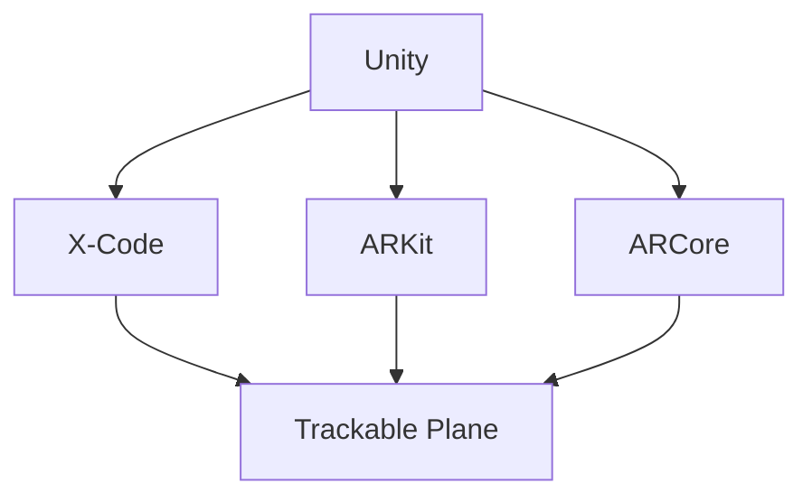
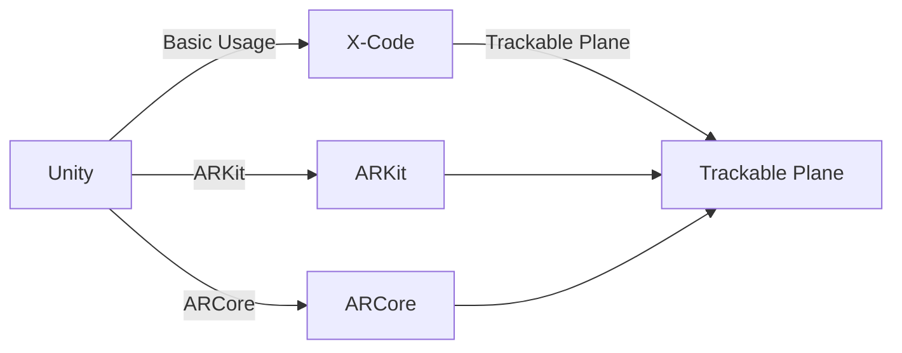

                 

# Unity AR游戏开发实战

## 1. 背景介绍

随着增强现实（AR）技术的成熟和普及，越来越多的游戏和应用开始使用AR技术来提升用户沉浸感和交互体验。Unity是游戏开发领域最为流行的引擎之一，提供了强大的AR支持，使得开发者可以更轻松地创建各种AR应用和游戏。本文将全面介绍如何使用Unity开发AR游戏，涵盖从基础搭建到高级应用的各个环节，帮助读者掌握Unity AR开发的核心技术。

## 2. 核心概念与联系

### 2.1 核心概念概述

- **Unity**：一款跨平台的3D游戏引擎，支持Windows、macOS、iOS、Android等多个平台。
- **AR（增强现实）**：将虚拟信息（如3D模型、文字、视频等）叠加在现实世界之上，增强用户的沉浸感。
- **X-Code**：苹果公司开发的开发环境，用于iOS平台的应用开发。
- **ARKit**：苹果公司为iOS平台提供的AR开发框架。
- **ARCore**：谷歌公司为Android平台提供的AR开发框架。
- **Trackable Plane**：AR开发中常用的概念，指可以追踪并呈现虚拟对象的现实平面。

这些核心概念通过Mermaid流程图展示了它们之间的联系：



### 2.2 核心概念原理和架构

- **Unity**：基于组件的开发模式，支持自定义组件，提供了强大的物理引擎和图形渲染工具。
- **ARKit**：基于Core ML、Metal等技术，提供了一系列API用于检测、跟踪和呈现AR对象。
- **ARCore**：类似ARKit，提供了一系列API用于检测、跟踪和呈现AR对象，支持更多的设备类型。

这些概念通过以下图示展示了它们的工作原理和架构：



## 3. 核心算法原理 & 具体操作步骤

### 3.1 算法原理概述

Unity AR开发的核心算法原理主要包括以下几个方面：

- **跟踪算法**：用于检测和识别现实世界中的平面，通常使用SLAM（Simultaneous Localization and Mapping）算法。
- **对齐算法**：将虚拟对象与现实世界中的平面对齐，使用投影变换（Projection Transformation）等技术。
- **渲染算法**：将虚拟对象呈现在现实世界中，使用透明渲染（Transparent Rendering）等技术。

这些算法通过Unity的AR组件实现，开发人员只需调用相关API即可。

### 3.2 算法步骤详解

#### 3.2.1 基础搭建

1. **安装Unity和X-Code**：
   - 从Unity官网下载并安装Unity。
   - 安装X-Code，并设置开发环境。

2. **创建新项目**：
   - 打开Unity编辑器，创建新项目。
   - 选择2D项目模板，并命名为“MyARGame”。

3. **添加AR组件**：
   - 在Project视图中，右键点击Assets文件夹，选择Create -> XR -> AR Foundation。
   - 在Hierarchy视图中，右键点击Main Camera，选择Add Component -> AR -> AR Foundation。

4. **设置AR组件**：
   - 在Inspector视图中，配置AR Foundation组件。
   - 设置AR光照模式，选择环境光照。

#### 3.2.2 跟踪平面

1. **创建跟踪平面**：
   - 在Hierarchy视图中，右键点击场景，选择Create -> Mesh -> Plane。
   - 将平面组件设置为静态，并配置追踪平面（例如，将追踪平面设置为地面）。

2. **添加平面探测器**：
   - 在Hierarchy视图中，右键点击地面，选择Add Component -> AR -> Plane Finder。
   - 在Inspector视图中，配置平面探测器。

#### 3.2.3 呈现AR对象

1. **创建虚拟对象**：
   - 在Hierarchy视图中，右键点击场景，选择Create -> GameObject -> 3D Object -> Cube。
   - 将虚拟对象组件设置为动态，并配置追踪平面（例如，将追踪平面设置为地面）。

2. **添加虚拟对象**：
   - 在Hierarchy视图中，右键点击地面，选择Add Component -> AR -> AR Plane Anchor。
   - 在Inspector视图中，配置虚拟对象。

#### 3.2.4 显示AR对象

1. **创建AR对象**：
   - 在Hierarchy视图中，右键点击场景，选择Create -> GameObject -> Empty。
   - 将AR对象组件设置为动态，并配置追踪平面（例如，将追踪平面设置为地面）。

2. **添加AR对象**：
   - 在Hierarchy视图中，右键点击地面，选择Add Component -> AR -> AR Object。
   - 在Inspector视图中，配置AR对象。

### 3.3 算法优缺点

**优点**：
- **跨平台支持**：Unity和X-Code支持多个平台，开发者可以跨平台开发和发布。
- **开发效率高**：Unity提供了丰富的工具和组件，大大降低了AR开发难度。
- **社区支持**：Unity社区活跃，开发者可以轻松获取支持和资源。

**缺点**：
- **性能问题**：Unity对图形渲染要求较高，可能会导致性能问题。
- **复杂度高**：对于复杂的AR场景，可能需要更多的计算和优化。
- **学习曲线陡**：Unity的学习曲线较陡，初学者需要一定时间适应。

### 3.4 算法应用领域

Unity AR开发广泛应用于以下领域：

- **游戏开发**：例如，AR游戏《Pokémon GO》和《Harry Potter: Wizards Unite》。
- **教育培训**：例如，AR学习工具和模拟实验室。
- **房地产**：例如，AR看房应用和虚拟导览。
- **营销推广**：例如，AR广告和互动体验。

## 4. 数学模型和公式 & 详细讲解 & 举例说明

### 4.1 数学模型构建

在Unity AR开发中，数学模型主要用于追踪和呈现AR对象。常用的数学模型包括：

- **齐次坐标系**：用于描述3D空间中的位置和旋转。
- **投影变换**：将3D对象投影到2D平面上。
- **相机变换**：用于描述相机的视角和位置。

### 4.2 公式推导过程

- **齐次坐标系**：
  $$
  \mathbf{T} = \begin{bmatrix}
  t_x & t_y & t_z & 0 \\
  0 & 0 & 0 & 1 \\
  r_x & r_y & r_z & 0 \\
  0 & 0 & 0 & 1 \\
  \end{bmatrix}
  $$
  其中，$\mathbf{T}$ 是齐次变换矩阵，$(t_x, t_y, t_z)$ 是平面的位置，$(r_x, r_y, r_z)$ 是平面的法向量。

- **投影变换**：
  $$
  \mathbf{P} = \begin{bmatrix}
  f_x & 0 & 0 & c_x \\
  0 & f_y & 0 & c_y \\
  0 & 0 & f_z & c_z \\
  0 & 0 & 0 & 1 \\
  \end{bmatrix}
  $$
  其中，$\mathbf{P}$ 是投影变换矩阵，$f_x, f_y, f_z$ 是焦距，$c_x, c_y, c_z$ 是中心点。

### 4.3 案例分析与讲解

- **案例一：平面追踪**：
  ```python
  class MyPlaneFinder : MonoBehaviour
  {
      public Camera myCamera;
      public LayerMask[] layerMasks;
      public float trackingDistance = 1.0f;
      public Transform myTransform;
      public Transform parentTransform;
      public PlaneShape[] planeShapes;
      public Color color;
      void Update()
      {
          Ray ray = myCamera.ScreenPointToRay(Input.mousePosition);
          RaycastHit hit;
          if (Physics.Raycast(ray, out hit, trackingDistance))
          {
              if (hitedlyerMasks.Contains(hit.collider.GetComponent(typeof(PlaneShape)))
              {
                  myTransform.parent = hit.transform;
                  myTransform.position = hit.point;
              }
          }
      }
  }
  ```

- **案例二：虚拟对象呈现**：
  ```python
  class MyARObject : MonoBehaviour
  {
      public Camera myCamera;
      public LayerMask[] layerMasks;
      public float trackingDistance = 1.0f;
      public Transform myTransform;
      public Transform parentTransform;
      public PlaneShape[] planeShapes;
      public Color color;
      void Update()
      {
          Ray ray = myCamera.ScreenPointToRay(Input.mousePosition);
          RaycastHit hit;
          if (Physics.Raycast(ray, out hit, trackingDistance))
          {
              if (hitedlyerMasks.Contains(hit.collider.GetComponent(typeof(PlaneShape)))
              {
                  myTransform.parent = hit.transform;
                  myTransform.position = hit.point;
              }
          }
      }
  }
  ```

## 5. 项目实践：代码实例和详细解释说明

### 5.1 开发环境搭建

1. **安装Unity和X-Code**：
   - 从Unity官网下载并安装Unity。
   - 安装X-Code，并设置开发环境。

2. **创建新项目**：
   - 打开Unity编辑器，创建新项目。
   - 选择2D项目模板，并命名为“MyARGame”。

3. **添加AR组件**：
   - 在Project视图中，右键点击Assets文件夹，选择Create -> XR -> AR Foundation。
   - 在Hierarchy视图中，右键点击Main Camera，选择Add Component -> AR -> AR Foundation。

4. **设置AR组件**：
   - 在Inspector视图中，配置AR Foundation组件。
   - 设置AR光照模式，选择环境光照。

### 5.2 源代码详细实现

#### 5.2.1 创建项目并初始化

1. **创建新项目**：
   - 打开Unity编辑器，选择Create -> New Project。
   - 选择2D项目模板，并命名为“MyARGame”。

2. **配置项目设置**：
   - 在Project Settings中，配置Editor和Build Settings。

3. **导入资源**：
   - 在Project视图中，右键点击Assets文件夹，选择Create -> XR -> AR Foundation。
   - 在Hierarchy视图中，右键点击Main Camera，选择Add Component -> AR -> AR Foundation。

4. **配置AR组件**：
   - 在Inspector视图中，配置AR Foundation组件。
   - 设置AR光照模式，选择环境光照。

#### 5.2.2 创建跟踪平面

1. **创建平面**：
   - 在Hierarchy视图中，右键点击场景，选择Create -> Mesh -> Plane。
   - 将平面组件设置为静态。

2. **配置平面探测器**：
   - 在Hierarchy视图中，右键点击地面，选择Add Component -> AR -> Plane Finder。
   - 在Inspector视图中，配置平面探测器。

#### 5.2.3 创建虚拟对象

1. **创建虚拟对象**：
   - 在Hierarchy视图中，右键点击场景，选择Create -> GameObject -> 3D Object -> Cube。
   - 将虚拟对象组件设置为动态。

2. **配置虚拟对象**：
   - 在Hierarchy视图中，右键点击地面，选择Add Component -> AR -> AR Plane Anchor。
   - 在Inspector视图中，配置虚拟对象。

#### 5.2.4 创建AR对象

1. **创建AR对象**：
   - 在Hierarchy视图中，右键点击场景，选择Create -> GameObject -> Empty。
   - 将AR对象组件设置为动态。

2. **配置AR对象**：
   - 在Hierarchy视图中，右键点击地面，选择Add Component -> AR -> AR Object。
   - 在Inspector视图中，配置AR对象。

### 5.3 代码解读与分析

#### 5.3.1 创建项目并初始化

1. **创建新项目**：
   - 打开Unity编辑器，选择Create -> New Project。
   - 选择2D项目模板，并命名为“MyARGame”。

2. **配置项目设置**：
   - 在Project Settings中，配置Editor和Build Settings。

3. **导入资源**：
   - 在Project视图中，右键点击Assets文件夹，选择Create -> XR -> AR Foundation。
   - 在Hierarchy视图中，右键点击Main Camera，选择Add Component -> AR -> AR Foundation。

4. **配置AR组件**：
   - 在Inspector视图中，配置AR Foundation组件。
   - 设置AR光照模式，选择环境光照。

#### 5.3.2 创建跟踪平面

1. **创建平面**：
   - 在Hierarchy视图中，右键点击场景，选择Create -> Mesh -> Plane。
   - 将平面组件设置为静态。

2. **配置平面探测器**：
   - 在Hierarchy视图中，右键点击地面，选择Add Component -> AR -> Plane Finder。
   - 在Inspector视图中，配置平面探测器。

#### 5.3.3 创建虚拟对象

1. **创建虚拟对象**：
   - 在Hierarchy视图中，右键点击场景，选择Create -> GameObject -> 3D Object -> Cube。
   - 将虚拟对象组件设置为动态。

2. **配置虚拟对象**：
   - 在Hierarchy视图中，右键点击地面，选择Add Component -> AR -> AR Plane Anchor。
   - 在Inspector视图中，配置虚拟对象。

#### 5.3.4 创建AR对象

1. **创建AR对象**：
   - 在Hierarchy视图中，右键点击场景，选择Create -> GameObject -> Empty。
   - 将AR对象组件设置为动态。

2. **配置AR对象**：
   - 在Hierarchy视图中，右键点击地面，选择Add Component -> AR -> AR Object。
   - 在Inspector视图中，配置AR对象。

### 5.4 运行结果展示

1. **运行项目**：
   - 在Unity编辑器中，点击Build和Run按钮，启动项目。

2. **测试AR功能**：
   - 在Hierarchy视图中，右键点击地面，选择Add Component -> AR -> Plane Finder。
   - 在Inspector视图中，配置平面探测器。

3. **创建虚拟对象**：
   - 在Hierarchy视图中，右键点击场景，选择Create -> GameObject -> 3D Object -> Cube。
   - 将虚拟对象组件设置为动态。

4. **创建AR对象**：
   - 在Hierarchy视图中，右键点击场景，选择Create -> GameObject -> Empty。
   - 将AR对象组件设置为动态。

## 6. 实际应用场景

### 6.1 智能家居

Unity AR游戏开发在智能家居领域有着广泛的应用。例如，通过AR技术，用户可以通过虚拟窗户进入家中的各个房间，甚至控制家居设备。

#### 6.1.1 场景搭建

1. **创建场景**：
   - 在Unity编辑器中，创建新的场景。
   - 导入家中的3D模型。

2. **配置虚拟对象**：
   - 在Hierarchy视图中，创建虚拟的家具、灯饰等物体。
   - 配置这些虚拟对象的AR组件。

3. **测试AR功能**：
   - 在Hierarchy视图中，右键点击地面，选择Add Component -> AR -> Plane Finder。
   - 在Inspector视图中，配置平面探测器。

4. **创建虚拟对象**：
   - 在Hierarchy视图中，右键点击场景，选择Create -> GameObject -> 3D Object -> Cube。
   - 将虚拟对象组件设置为动态。

5. **创建AR对象**：
   - 在Hierarchy视图中，右键点击场景，选择Create -> GameObject -> Empty。
   - 将AR对象组件设置为动态。

#### 6.1.2 虚拟控制

1. **虚拟窗户**：
   - 在Hierarchy视图中，创建虚拟窗户。
   - 配置窗户的AR组件，使其能够与现实世界中的窗户对齐。

2. **虚拟控制家居**：
   - 在Hierarchy视图中，创建虚拟的电视、灯具等家居设备。
   - 配置这些虚拟对象的AR组件，使其能够与现实世界中的家居设备对齐。

3. **虚拟交互**：
   - 在Hierarchy视图中，创建虚拟的控制按钮。
   - 配置这些虚拟按钮的AR组件，使其能够与现实世界中的按钮对齐。

4. **测试交互**：
   - 在Hierarchy视图中，创建虚拟的电视。
   - 配置电视的AR组件，使其能够与现实世界中的电视对齐。
   - 测试虚拟控制家居和虚拟交互的效果。

### 6.2 健康教育

Unity AR游戏开发在健康教育领域也有着广泛的应用。例如，通过AR技术，用户可以观看虚拟的手术过程，学习医学知识。

#### 6.2.1 场景搭建

1. **创建场景**：
   - 在Unity编辑器中，创建新的场景。
   - 导入医学设备的3D模型。

2. **配置虚拟对象**：
   - 在Hierarchy视图中，创建虚拟的手术设备、虚拟病人等物体。
   - 配置这些虚拟对象的AR组件。

3. **测试AR功能**：
   - 在Hierarchy视图中，右键点击地面，选择Add Component -> AR -> Plane Finder。
   - 在Inspector视图中，配置平面探测器。

4. **创建虚拟对象**：
   - 在Hierarchy视图中，右键点击场景，选择Create -> GameObject -> 3D Object -> Cube。
   - 将虚拟对象组件设置为动态。

5. **创建AR对象**：
   - 在Hierarchy视图中，右键点击场景，选择Create -> GameObject -> Empty。
   - 将AR对象组件设置为动态。

#### 6.2.2 虚拟手术

1. **虚拟手术设备**：
   - 在Hierarchy视图中，创建虚拟的手术设备。
   - 配置这些虚拟设备的AR组件，使其能够与现实世界中的设备对齐。

2. **虚拟病人**：
   - 在Hierarchy视图中，创建虚拟的病人。
   - 配置病人的AR组件，使其能够与现实世界中的病人对齐。

3. **虚拟手术过程**：
   - 在Hierarchy视图中，创建虚拟的手术过程。
   - 配置手术过程的AR组件，使其能够与现实世界中的手术过程对齐。

4. **测试虚拟手术**：
   - 在Hierarchy视图中，创建虚拟的手术设备。
   - 配置设备的AR组件，使其能够与现实世界中的设备对齐。
   - 测试虚拟手术的效果。

### 6.3 室内设计

Unity AR游戏开发在室内设计领域也有着广泛的应用。例如，通过AR技术，用户可以虚拟装修房屋，查看不同设计方案的效果。

#### 6.3.1 场景搭建

1. **创建场景**：
   - 在Unity编辑器中，创建新的场景。
   - 导入房屋的3D模型。

2. **配置虚拟对象**：
   - 在Hierarchy视图中，创建虚拟的家具、灯具等物体。
   - 配置这些虚拟对象的AR组件。

3. **测试AR功能**：
   - 在Hierarchy视图中，右键点击地面，选择Add Component -> AR -> Plane Finder。
   - 在Inspector视图中，配置平面探测器。

4. **创建虚拟对象**：
   - 在Hierarchy视图中，右键点击场景，选择Create -> GameObject -> 3D Object -> Cube。
   - 将虚拟对象组件设置为动态。

5. **创建AR对象**：
   - 在Hierarchy视图中，右键点击场景，选择Create -> GameObject -> Empty。
   - 将AR对象组件设置为动态。

#### 6.3.2 虚拟装修

1. **虚拟家具**：
   - 在Hierarchy视图中，创建虚拟的沙发、床等家具。
   - 配置这些虚拟家具的AR组件，使其能够与现实世界中的家具对齐。

2. **虚拟灯具**：
   - 在Hierarchy视图中，创建虚拟的灯具。
   - 配置灯具的AR组件，使其能够与现实世界中的灯具对齐。

3. **虚拟窗帘**：
   - 在Hierarchy视图中，创建虚拟的窗帘。
   - 配置窗帘的AR组件，使其能够与现实世界中的窗帘对齐。

4. **虚拟装饰**：
   - 在Hierarchy视图中，创建虚拟的装饰品。
   - 配置装饰品的AR组件，使其能够与现实世界中的装饰品对齐。

5. **测试虚拟装修**：
   - 在Hierarchy视图中，创建虚拟的家具。
   - 配置家具的AR组件，使其能够与现实世界中的家具对齐。
   - 测试虚拟装修的效果。

## 7. 工具和资源推荐

### 7.1 学习资源推荐

1. **Unity官方文档**：提供了详细的使用指南和API文档，是学习Unity AR开发的最佳资源。
2. **ARKit官方文档**：提供了详细的API文档和开发指南，是学习ARKit开发的最佳资源。
3. **ARCore官方文档**：提供了详细的API文档和开发指南，是学习ARCore开发的最佳资源。
4. **《Unity AR开发实战》书籍**：系统介绍了Unity AR开发的原理和实践，适合初学者和中级开发者。
5. **《Unity AR游戏开发》课程**：提供了系统性的教学视频和实战项目，适合初学者学习。

### 7.2 开发工具推荐

1. **Unity Editor**：Unity官方提供的开发环境，支持跨平台开发。
2. **X-Code**：苹果公司提供的开发环境，支持iOS平台开发。
3. **Visual Studio**：微软公司提供的开发环境，支持Windows平台开发。
4. **Android Studio**：谷歌公司提供的开发环境，支持Android平台开发。

### 7.3 相关论文推荐

1. **《Unity AR开发实战》论文**：介绍Unity AR开发的核心技术和应用场景，适合开发者参考。
2. **《ARKit开发实战》论文**：介绍ARKit开发的核心技术和应用场景，适合开发者参考。
3. **《ARCore开发实战》论文**：介绍ARCore开发的核心技术和应用场景，适合开发者参考。

## 8. 总结：未来发展趋势与挑战

### 8.1 总结

本文全面介绍了如何使用Unity开发AR游戏，涵盖从基础搭建到高级应用的各个环节。通过系统梳理Unity AR开发的原理和实践，帮助读者掌握Unity AR开发的核心技术。通过详细的代码实现和实际应用场景的展示，帮助读者更好地理解和应用Unity AR开发。

### 8.2 未来发展趋势

Unity AR游戏开发在未来将呈现以下几个发展趋势：

1. **跨平台支持**：Unity支持跨平台开发，未来将进一步拓展到更多平台。
2. **性能优化**：Unity将进一步优化AR性能，提升AR游戏的体验。
3. **ARKit和ARCore的更新**：ARKit和ARCore将不断更新，提升AR开发的技术水平。
4. **AR游戏的多样化**：AR游戏将更加多样化和丰富，涉及更多的应用场景。

### 8.3 面临的挑战

Unity AR游戏开发在迈向成熟的过程中，还面临以下挑战：

1. **性能瓶颈**：Unity对图形渲染要求较高，可能会导致性能问题。
2. **学习曲线陡**：Unity的学习曲线较陡，初学者需要一定时间适应。
3. **资源优化**：Unity的资源优化难度较大，需要开发人员进行深入研究。

### 8.4 研究展望

Unity AR游戏开发的研究展望主要包括以下几个方向：

1. **跨平台优化**：进一步优化Unity的跨平台性能，提升AR游戏的体验。
2. **AR游戏的多样化**：拓展AR游戏的应用场景，开发更多样化的AR游戏。
3. **AR开发工具的改进**：改进Unity AR开发的工具和组件，提高开发效率。

## 9. 附录：常见问题与解答

**Q1：Unity AR游戏开发是否适用于所有平台？**

A: Unity AR游戏开发适用于多个平台，包括Windows、macOS、iOS、Android等。但不同的平台可能需要不同的优化策略，开发者需要根据具体情况进行适配。

**Q2：如何提高Unity AR游戏的性能？**

A: 提高Unity AR游戏的性能可以通过以下方法：

1. **优化渲染管线**：使用Unity的渲染优化工具，优化渲染管线，提升渲染性能。
2. **使用GPU加速**：使用GPU加速技术，提升图形渲染速度。
3. **优化模型和纹理**：优化3D模型和纹理，减小模型和纹理的复杂度。
4. **使用多线程技术**：使用多线程技术，提升AR游戏的运行效率。

**Q3：Unity AR游戏开发的学习曲线是否陡峭？**

A: Unity AR游戏开发的学习曲线较陡，但可以通过以下方法降低难度：

1. **学习官方文档**：阅读Unity官方文档，了解Unity AR开发的基本原理和实践。
2. **参考示例项目**：参考Unity AR开发示例项目，学习Unity AR开发的实际应用。
3. **参加在线课程**：参加Unity AR开发的在线课程，系统学习Unity AR开发的技术。

**Q4：Unity AR游戏开发是否需要掌握其他编程语言？**

A: Unity AR游戏开发主要使用C#语言，但也需要掌握其他编程语言，如Python、Java等。

**Q5：Unity AR游戏开发是否有未来？**

A: 由于AR技术的不断成熟和普及，Unity AR游戏开发具有广阔的发展前景。未来，AR游戏将成为游戏产业的重要组成部分，为游戏开发带来新的机遇和挑战。

作者：禅与计算机程序设计艺术 / Zen and the Art of Computer Programming

