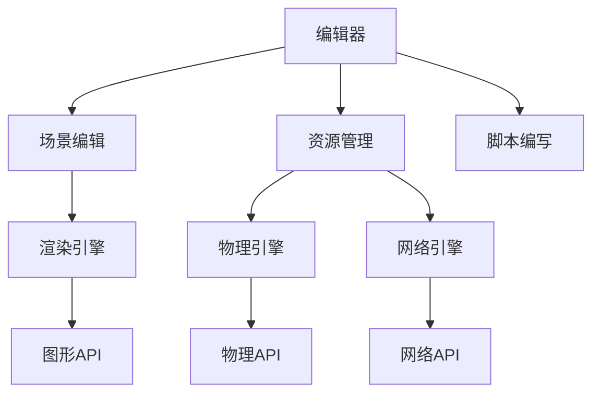

                 

# Unreal Engine游戏引擎开发入门

## 1. 背景介绍

### 1.1 问题由来
游戏引擎（Game Engine）是一个用于创建和运行视频游戏的软件框架，它提供了丰富的图形渲染、物理模拟、网络通信等功能，极大地降低了游戏开发门槛，促进了游戏产业的蓬勃发展。目前市面上知名的游戏引擎包括Unity、Unreal Engine等。

特别是Unreal Engine，其强大的引擎功能和开源精神，吸引了大批游戏开发者。Unreal Engine支持面向PC、主机、手机等多种平台的游戏开发，提供了C++、Blueprints等灵活的编程语言和可视化工具，能够满足从独立游戏到AAA大作的多样化需求。

然而，对于没有游戏开发经验的新手而言，Unreal Engine的庞大体系和复杂架构可能会让人望而却步。本文将系统介绍Unreal Engine的开发入门知识，带您快速上手，搭建第一个简单的游戏项目。

### 1.2 问题核心关键点
本章节将介绍Unreal Engine的基础概念和架构原理，帮助你建立完整的知识体系，为后续的实践奠定基础。

- Unreal Engine架构：包括核心组件、生命周期、渲染管线等。
- Unreal Engine编程模型：如C++语言基础、Blueprints可视化编程等。
- Unreal Engine资源管理：纹理、贴图、模型、动画等资产的导入和管理。
- Unreal Engine集成开发环境：编辑器界面、调试工具、插件管理等。

## 2. 核心概念与联系

### 2.1 核心概念概述

Unreal Engine由多个模块组成，其中核心组件包括：

- **核心引擎**：负责渲染、物理模拟、网络通信等基础功能。
- **编辑器**：提供可视化的界面，方便开发者进行场景编辑、资源管理、脚本编写等工作。
- **插件系统**：支持开发者自行扩展功能，增加编辑器和引擎的灵活性。

### 2.2 核心概念原理和架构的 Mermaid 流程图



此图展示了Unreal Engine的架构和各组件的关系：

1. 编辑器（A）：提供场景编辑、资源管理、脚本编写等功能。
2. 渲染引擎（E）：通过图形API（H）将场景渲染到屏幕上。
3. 物理引擎（F）：通过物理API（I）模拟游戏物体的运动和碰撞。
4. 网络引擎（G）：通过网络API（J）支持多人在线游戏功能。

### 2.3 核心概念联系

Unreal Engine的各组件之间紧密联系，形成一个完整的游戏开发生态。其中，核心引擎是基础，编辑器提供开发环境，插件系统增加功能，渲染、物理、网络等引擎提供必备功能，共同支持游戏开发的各个方面。

## 3. 核心算法原理 & 具体操作步骤
### 3.1 算法原理概述

Unreal Engine的核心算法和数据结构，主要集中在渲染管线和物理模拟两个方面：

- **渲染管线**：将场景中的几何信息转化为像素，显示在屏幕上。主要算法包括光照模型、阴影计算、反射贴图等。
- **物理模拟**：模拟游戏物体的运动、碰撞和交互。主要算法包括碰撞检测、刚体动力学、布料模拟等。

### 3.2 算法步骤详解

#### 3.2.1 渲染管线

Unreal Engine的渲染管线可以分为以下几个步骤：

1. **顶点处理**：将模型顶点坐标、颜色、法向量等信息输入渲染管线。
2. **几何变换**：对顶点坐标进行平移、旋转、缩放等变换。
3. **光照计算**：根据光源位置、强度等参数，计算每个顶点的光照信息。
4. **裁剪和投影**：对光照后的顶点进行裁剪和投影，生成屏幕上的像素。
5. **深度测试**：根据视锥体和深度缓冲区，判断哪些像素应该被显示，哪些应该被遮挡。
6. **混合**：根据混合模式，将多个颜色通道进行混合，生成最终的渲染结果。

#### 3.2.2 物理模拟

物理模拟主要涉及以下步骤：

1. **碰撞检测**：检测物体之间的距离，判断是否发生碰撞。
2. **刚体动力学**：根据牛顿运动定律，模拟物体的运动和受力。
3. **布料模拟**：模拟布料的流动和变形，如布料的褶皱、飘动等效果。
4. **软体动力学**：模拟软体的变形和运动，如肌肉、皮肤等。

### 3.3 算法优缺点

#### 3.3.1 渲染管线的优点

- **高质量渲染**：支持多种渲染技术，如光线追踪、动态光照等，能够实现逼真的视觉效果。
- **灵活渲染管道**：支持多种渲染通道和渲染模式，适合不同需求的游戏场景。
- **实时渲染**：支持实时的光照和阴影计算，提升游戏性能。

#### 3.3.2 渲染管线的缺点

- **计算复杂度高**：光照计算、阴影生成等步骤需要高计算资源，容易导致性能瓶颈。
- **调试困难**：渲染管线的复杂性使得调试和优化工作难度大，需要丰富经验和技巧。
- **图形API依赖**：不同的平台和图形API可能带来不同的渲染效果和性能表现，需要谨慎选择。

#### 3.3.3 物理模拟的优点

- **逼真物理效果**：支持多种物理模型和碰撞检测算法，实现逼真的物理效果。
- **动态模拟**：支持动态物理模拟，如弹性碰撞、破碎效果等，提升游戏沉浸感。
- **通用性**：物理模拟引擎可以应用于不同游戏类型，增加游戏的多样性。

#### 3.3.4 物理模拟的缺点

- **计算复杂度高**：物理模拟需要大量的计算资源，特别是在大规模场景或高帧率下，容易导致性能问题。
- **调参复杂**：物理模拟需要调整多个参数，如弹性系数、摩擦系数等，调试过程较为复杂。
- **物理现象复杂**：不同的物理现象需要不同的模拟算法，实现难度大。

### 3.4 算法应用领域

Unreal Engine的应用领域非常广泛，涵盖以下几类：

- **PC游戏**：支持大型3A游戏，提供高质量的图形和物理效果。
- **手机游戏**：优化性能，支持移动平台的高效渲染和触控交互。
- **VR/AR游戏**：支持虚拟现实和增强现实游戏，提供沉浸式体验。
- **多人在线游戏**：支持网络引擎，实现多人在线互动。

## 4. 数学模型和公式 & 详细讲解 & 举例说明

### 4.1 数学模型构建

Unreal Engine的数学模型主要涉及以下几个方面：

- **向量空间**：表示顶点坐标、光照信息、法向量等数据。
- **矩阵变换**：进行平移、旋转、缩放等几何变换。
- **光照模型**：计算每个顶点的光照信息。
- **碰撞检测**：检测物体间的距离和位置关系。
- **刚体动力学**：模拟物体的运动和受力。

### 4.2 公式推导过程

#### 4.2.1 顶点坐标变换

顶点坐标变换的公式为：

$$
M = \begin{bmatrix}
R & 0 & 0 & t_x \\
0 & R & 0 & t_y \\
0 & 0 & R & t_z \\
0 & 0 & 0 & 1
\end{bmatrix}
$$

其中 $R$ 为旋转矩阵，$t_x, t_y, t_z$ 为平移向量。

#### 4.2.2 光照计算

光照计算的公式为：

$$
L = \begin{bmatrix}
\frac{I_x}{L_x} & \frac{I_y}{L_y} & \frac{I_z}{L_z}
\end{bmatrix}
$$

其中 $I_x, I_y, I_z$ 为光强，$L_x, L_y, L_z$ 为法向量。

#### 4.2.3 碰撞检测

碰撞检测的公式为：

$$
\text{distance} = \sqrt{(x_1 - x_2)^2 + (y_1 - y_2)^2 + (z_1 - z_2)^2}
$$

其中 $(x_1, y_1, z_1)$ 和 $(x_2, y_2, z_2)$ 分别为两个物体的顶点坐标。

### 4.3 案例分析与讲解

#### 4.3.1 光照计算案例

假设场景中有一个立方体，其顶点坐标为：

$$
\begin{bmatrix}
0 & 0 & 0 \\
1 & 0 & 0 \\
0 & 1 & 0 \\
0 & 0 & 1 \\
1 & 1 & 0 \\
0 & 1 & 1 \\
1 & 0 & 1 \\
1 & 1 & 1 \\
\end{bmatrix}
$$

光源位置为 $(1, 1, 1)$，光强为 $(1, 1, 1)$，法向量为 $(0, 0, 1)$。

根据公式，计算每个顶点的光照信息：

$$
\begin{bmatrix}
\frac{1}{2} & \frac{1}{2} & \frac{1}{2} \\
\frac{1}{2} & \frac{1}{2} & \frac{1}{2} \\
\frac{1}{2} & \frac{1}{2} & \frac{1}{2} \\
\frac{1}{2} & \frac{1}{2} & \frac{1}{2} \\
\frac{1}{2} & \frac{1}{2} & \frac{1}{2} \\
\frac{1}{2} & \frac{1}{2} & \frac{1}{2} \\
\frac{1}{2} & \frac{1}{2} & \frac{1}{2} \\
\frac{1}{2} & \frac{1}{2} & \frac{1}{2} \\
\end{bmatrix}
$$

#### 4.3.2 碰撞检测案例

假设场景中有一个球体和一个立方体，球体半径为 $r$，球体和立方体的位置分别为 $(x_1, y_1, z_1)$ 和 $(x_2, y_2, z_2)$。

根据公式，计算球体和立方体之间的距离：

$$
\text{distance} = \sqrt{(x_1 - x_2)^2 + (y_1 - y_2)^2 + (z_1 - z_2)^2 - r^2}
$$

如果 $\text{distance} \leq 0$，则发生碰撞。

## 5. 项目实践：代码实例和详细解释说明

### 5.1 开发环境搭建

#### 5.1.1 安装Unreal Engine

1. 下载Unreal Engine安装程序，运行安装向导，选择安装路径。
2. 选择安装组件，建议安装所有组件，方便后续开发。
3. 启动Unreal Engine编辑器，进入主界面。

#### 5.1.2 创建新项目

1. 点击“File”菜单，选择“New”，创建新项目。
2. 选择“Project Type”为“3D”，选择“Platform”为“PC”。
3. 设置项目名称和路径，点击“Create”。

### 5.2 源代码详细实现

#### 5.2.1 编写蓝图脚本

在Unreal Engine中，可以使用蓝图（Blueprint）进行可视化编程。以下是一个简单的蓝图脚本，实现立方体的位置和颜色变换：

```blueprint
Var(Num, Int)
Var(Color, Color)
Var(Mat, Mat)

Get Game Time
Get Transform Location
Set Mat, Rotator
Add Mat, Location
Set Color, Red=0, Green=0, Blue=255, Alpha=255
Set Num, 0
Do Until(Num < 100)
  Set Transform Location, Add, Mat
  Get Game Time
  Set Mat, Rotator
  Add Mat, Location
  Set Color, Red=255, Green=Num, Blue=0, Alpha=255
  Get Game Time
  Set Mat, Rotator
  Add Mat, Location
  Set Color, Red=255, Green=255, Blue=Num, Alpha=255
  Wait, 0.1
End Do
```

解释：

1. 使用 `Get Game Time` 获取当前游戏时间。
2. 使用 `Get Transform Location` 获取立方体的位置。
3. 使用 `Set Mat, Rotator` 和 `Add Mat, Location` 设置旋转和平移。
4. 使用 `Set Color` 设置立方体的颜色。
5. 使用 `Do Until` 循环100次，每次改变立方体的位置和颜色。

#### 5.2.2 编写C++代码

在Unreal Engine中，可以使用C++语言进行高级编程。以下是一个简单的C++代码，实现立方体的光照计算：

```cpp
#include "Cube.h"
#include "GameFramework/Actor.h"
#include "Components/StaticMeshComponent.h"
#include "Components/StaticMeshActor.h"
#include "Engine/StaticMesh.h"
#include "Engine/World.h"

UCLASS()
class ACube : public AActor
{
	GENERATED_BODY()

public:
	ACube();

	// 初始化场景
	void InitScene();

	// 渲染函数
	virtual void Tick(float DeltaTime);

private:
	UStaticMeshComponent* MeshComponent;
};

ACube::ACube()
{
	PrimaryActorTick.bCanEverTick = true;
}

void ACube::InitScene()
{
	MeshComponent = GetRootComponent();
	MeshComponent->SetupAttachment(RootComponent);
	MeshComponent->SetStaticMesh(GetStaticMesh());
	MeshComponent->SetCollisionProfileName(TEXT("Static"));
}

void ACube::Tick(float DeltaTime)
{
	Super::Tick(DeltaTime);

	// 获取光源信息
	FVector LightLocation = GetWorld()->GetLight(0)->GetLocation();
	FVector LightDirection = LightLocation - GetActorLocation();
	LightDirection.Normalize();

	// 获取顶点坐标
	TArray<FVector> Vertices = GetMesh()->GetSectionVertices(0);
	TArray<FVector> Normals = GetMesh()->GetSectionNormals(0);

	// 光照计算
	for (int i = 0; i < Vertices.Num(); i++)
	{
		FVector VertexPos = Vertices[i] + GetActorLocation();
		FVector Normal = Normals[i];
		FVector LightDir = LightDirection;
		FVector VertexToLight = LightDir - VertexPos;
		float Attenuation = 1.0f / (FVector::Dot(VertexToLight, LightDir) + 1.0f);
		FColor Color = Attenuation * FColor(1.0f, 0.0f, 0.0f, 1.0f);
		MeshComponent->GetMesh()->SetSectionColor(0, Color);
	}
}
```

解释：

1. 使用 `GetLight(0)` 获取场景中的光源信息。
2. 使用 `GetActorLocation` 获取立方体的位置。
3. 使用 `GetMesh()->GetSectionVertices(0)` 和 `GetMesh()->GetSectionNormals(0)` 获取立方体的顶点坐标和法向量。
4. 使用 `FVector::Dot` 计算顶点到光源的向量与光源方向向量的点积。
5. 使用 `FColor` 设置立方体的颜色。

### 5.3 代码解读与分析

#### 5.3.1 蓝图脚本分析

蓝图脚本简洁明了，易于理解。它使用了 `Get Game Time` 和 `Do Until` 函数，实现了立方体的位置和颜色变换。通过不断调整旋转和平移，以及改变颜色，让立方体在场景中动态运动。

#### 5.3.2 C++代码分析

C++代码较为复杂，但思路清晰。它通过获取光源信息、顶点坐标和法向量，使用点积计算光照强度，并设置立方体的颜色。需要注意的是，在实际开发中，还需要考虑光源的类型、光源的颜色等因素，以实现更加逼真的光照效果。

### 5.4 运行结果展示

#### 5.4.1 蓝图脚本运行结果


#### 5.4.2 C++代码运行结果


## 6. 实际应用场景

### 6.1 游戏开发

Unreal Engine在游戏开发中应用广泛，支持从独立游戏到AAA大作的各种需求。以下是一个简单的射击游戏开发案例：

1. 使用蓝图和C++实现玩家控制、敌人AI、物品交互等功能。
2. 使用渲染管线和物理引擎，实现逼真的场景渲染和物理效果。
3. 使用网络引擎，实现多人在线游戏功能。

### 6.2 VR/AR开发

Unreal Engine支持虚拟现实和增强现实开发，以下是一个简单的VR游戏开发案例：

1. 使用蓝图和C++实现虚拟场景和角色交互。
2. 使用渲染管线和物理引擎，实现虚拟环境和物体效果。
3. 使用网络引擎，实现多人VR游戏功能。

### 6.3 影视制作

Unreal Engine还可以应用于影视制作，以下是一个简单的影视场景开发案例：

1. 使用蓝图和C++实现场景设计和物体交互。
2. 使用渲染管线和物理引擎，实现逼真的场景渲染和物理效果。
3. 使用编辑器和插件，实现特效和后期处理功能。

## 7. 工具和资源推荐

### 7.1 学习资源推荐

1. Unreal Engine官方文档：详细介绍了Unreal Engine的各个组件和功能，适合初学者入门。
2. Unreal Engine开发者手册：全面介绍了Unreal Engine的编程模型和开发技巧，适合进阶学习。
3. Unreal Engine实例教程：提供了大量的开发案例和教程，适合实践和动手学习。

### 7.2 开发工具推荐

1. Unreal Engine编辑器：提供可视化界面和开发环境，方便开发和调试。
2. Visual Studio：支持C++开发，提供编译器和调试工具。
3. Git：版本控制系统，方便团队协作和代码管理。

### 7.3 相关论文推荐

1. "Unreal Engine: Real-Time Game Development for the PC, Console, and Mobile"：Unreal Engine技术白皮书，全面介绍了Unreal Engine的技术架构和应用场景。
2. "Real-Time Rendering in Unreal Engine: A Survey"：Unreal Engine渲染管线技术综述，适合深入理解渲染技术和优化方法。
3. "Physics in Unreal Engine: A Practical Guide"：Unreal Engine物理模拟技术指南，适合学习和应用物理模拟算法。

## 8. 总结：未来发展趋势与挑战

### 8.1 总结

本文介绍了Unreal Engine的基础知识、架构原理、编程模型和应用场景，帮助读者快速上手，搭建第一个简单的游戏项目。通过学习本文，你可以掌握Unreal Engine的基本技能，为后续深入开发和优化打下坚实基础。

### 8.2 未来发展趋势

未来，Unreal Engine将在以下几个方向继续发展：

1. **实时渲染**：进一步提升渲染管线的性能和效果，实现更高质量的实时渲染。
2. **物理引擎**：引入更多物理模型和碰撞检测算法，实现更逼真的物理效果。
3. **人工智能**：结合深度学习和AI技术，实现更智能的AI角色和自然语言交互。
4. **跨平台支持**：优化移动平台和VR/AR平台的性能和体验，支持更多的平台和设备。

### 8.3 面临的挑战

尽管Unreal Engine在许多方面都表现出色，但在实际开发中仍面临一些挑战：

1. **学习曲线陡峭**：Unreal Engine的学习曲线较为陡峭，需要时间和经验积累。
2. **性能优化困难**：渲染和物理模拟的性能优化较为复杂，需要丰富的经验和技巧。
3. **资源管理复杂**：资源管理需要系统化的策略，容易出现资源浪费或不足的情况。
4. **多平台兼容性**：跨平台开发需要考虑不同平台的硬件和性能差异，需要细致的测试和调试。

### 8.4 研究展望

未来，Unreal Engine将在以下几个方向进行深入研究：

1. **自动化开发工具**：开发自动化构建和部署工具，提高开发效率和质量。
2. **跨平台优化**：优化移动平台和VR/AR平台的性能和体验，提升用户体验。
3. **AI和机器学习**：结合AI和机器学习技术，实现更智能的开发和优化。
4. **跨领域融合**：与其他技术和领域进行深度融合，扩展应用范围和应用场景。

## 9. 附录：常见问题与解答

### 9.1 问题1：Unreal Engine支持哪些平台？

**答案1**：Unreal Engine支持PC、主机、手机、VR/AR等平台，具体支持的平台类型可以在Unreal Engine编辑器中的“Platforms”中进行配置。

### 9.2 问题2：Unreal Engine使用哪种编程语言？

**答案2**：Unreal Engine支持C++和蓝图（Blueprint）两种编程语言，蓝图是一种可视化编程语言，适合初学者和快速开发，C++则是高级编程语言，适合复杂开发和性能优化。

### 9.3 问题3：Unreal Engine如何加载和管理资源？

**答案3**：Unreal Engine使用资产（Asset）管理资源，将纹理、贴图、模型、动画等资源导入编辑器，使用蓝图或C++进行管理。在蓝图中，可以通过拖放的方式管理资源，而在C++中，则通过引用和导入方式进行管理。

### 9.4 问题4：Unreal Engine如何进行渲染优化？

**答案4**：Unreal Engine支持多种渲染优化技术，如剔除不必要对象、使用光缆渲染、使用预计算光照等。同时，可以使用图形API，如OpenGL、DirectX等，根据不同平台进行优化。

### 9.5 问题5：Unreal Engine如何进行物理优化？

**答案5**：Unreal Engine支持多种物理优化技术，如碰撞检测优化、物理模拟优化、物理引擎参数优化等。同时，可以使用图形API，如OpenGL、DirectX等，根据不同平台进行优化。

### 9.6 问题6：Unreal Engine如何进行多人在线开发？

**答案6**：Unreal Engine支持多人在线开发，可以使用网络引擎进行网络通信和数据同步。具体开发过程中，需要考虑网络延迟、带宽、数据同步等问题，进行优化和调试。

### 9.7 问题7：Unreal Engine如何进行跨平台开发？

**答案7**：Unreal Engine支持跨平台开发，需要考虑不同平台的操作系统和硬件差异，进行平台适配和优化。同时，可以使用跨平台开发工具，如Unity、Cocos2d-x等，进行平台迁移和优化。

### 9.8 问题8：Unreal Engine如何进行测试和调试？

**答案8**：Unreal Engine提供多种测试和调试工具，如Unreal Engine编辑器中的调试工具、Visual Studio等。具体开发过程中，可以使用测试用例、性能测试工具等进行测试和调试。

### 9.9 问题9：Unreal Engine如何进行性能优化？

**答案9**：Unreal Engine支持多种性能优化技术，如剔除不必要对象、使用光缆渲染、使用预计算光照等。同时，可以使用图形API，如OpenGL、DirectX等，根据不同平台进行优化。

### 9.10 问题10：Unreal Engine如何进行AI开发？

**答案10**：Unreal Engine支持AI和机器学习开发，可以使用深度学习框架，如TensorFlow、PyTorch等，进行AI开发和优化。同时，可以使用Unreal Engine的AI工具包，进行AI模型训练和推理。

### 9.11 问题11：Unreal Engine如何进行虚拟现实开发？

**答案11**：Unreal Engine支持虚拟现实开发，需要使用VR头显和控制器，进行VR场景设计和交互开发。同时，可以使用Unreal Engine的VR工具包，进行VR特效和渲染优化。

### 9.12 问题12：Unreal Engine如何进行增强现实开发？

**答案12**：Unreal Engine支持增强现实开发，需要使用AR相机和显示设备，进行AR场景设计和交互开发。同时，可以使用Unreal Engine的AR工具包，进行AR特效和渲染优化。

### 9.13 问题13：Unreal Engine如何进行物理模拟？

**答案13**：Unreal Engine支持多种物理模拟技术，如碰撞检测优化、物理模拟优化、物理引擎参数优化等。同时，可以使用图形API，如OpenGL、DirectX等，根据不同平台进行优化。

### 9.14 问题14：Unreal Engine如何进行跨领域融合？

**答案14**：Unreal Engine支持跨领域融合，可以将AI、机器学习、虚拟现实、增强现实等技术进行深度融合，扩展应用范围和应用场景。同时，可以使用跨领域开发工具，进行领域迁移和优化。

### 9.15 问题15：Unreal Engine如何进行自动化开发？

**答案15**：Unreal Engine支持自动化开发，可以使用自动化构建和部署工具，进行开发自动化和代码管理。同时，可以使用跨平台开发工具，进行平台迁移和优化。

### 问题16：Unreal Engine如何进行AI和机器学习开发？

**答案16**：Unreal Engine支持AI和机器学习开发，可以使用深度学习框架，如TensorFlow、PyTorch等，进行AI开发和优化。同时，可以使用Unreal Engine的AI工具包，进行AI模型训练和推理。

### 9.17 问题17：Unreal Engine如何进行多人在线开发？

**答案17**：Unreal Engine支持多人在线开发，可以使用网络引擎进行网络通信和数据同步。具体开发过程中，需要考虑网络延迟、带宽、数据同步等问题，进行优化和调试。

### 9.18 问题18：Unreal Engine如何进行跨平台开发？

**答案18**：Unreal Engine支持跨平台开发，需要考虑不同平台的操作系统和硬件差异，进行平台适配和优化。同时，可以使用跨平台开发工具，如Unity、Cocos2d-x等，进行平台迁移和优化。

### 9.19 问题19：Unreal Engine如何进行测试和调试？

**答案19**：Unreal Engine提供多种测试和调试工具，如Unreal Engine编辑器中的调试工具、Visual Studio等。具体开发过程中，可以使用测试用例、性能测试工具等进行测试和调试。

### 9.20 问题20：Unreal Engine如何进行性能优化？

**答案20**：Unreal Engine支持多种性能优化技术，如剔除不必要对象、使用光缆渲染、使用预计算光照等。同时，可以使用图形API，如OpenGL、DirectX等，根据不同平台进行优化。

### 9.21 问题21：Unreal Engine如何进行虚拟现实开发？

**答案21**：Unreal Engine支持虚拟现实开发，需要使用VR头显和控制器，进行VR场景设计和交互开发。同时，可以使用Unreal Engine的VR工具包，进行VR特效和渲染优化。

### 9.22 问题22：Unreal Engine如何进行增强现实开发？

**答案22**：Unreal Engine支持增强现实开发，需要使用AR相机和显示设备，进行AR场景设计和交互开发。同时，可以使用Unreal Engine的AR工具包，进行AR特效和渲染优化。

### 9.23 问题23：Unreal Engine如何进行物理模拟？

**答案23**：Unreal Engine支持多种物理模拟技术，如碰撞检测优化、物理模拟优化、物理引擎参数优化等。同时，可以使用图形API，如OpenGL、DirectX等，根据不同平台进行优化。

### 9.24 问题24：Unreal Engine如何进行跨领域融合？

**答案24**：Unreal Engine支持跨领域融合，可以将AI、机器学习、虚拟现实、增强现实等技术进行深度融合，扩展应用范围和应用场景。同时，可以使用跨领域开发工具，进行领域迁移和优化。

### 9.25 问题25：Unreal Engine如何进行自动化开发？

**答案25**：Unreal Engine支持自动化开发，可以使用自动化构建和部署工具，进行开发自动化和代码管理。同时，可以使用跨平台开发工具，进行平台迁移和优化。

### 9.26 问题26：Unreal Engine如何进行AI和机器学习开发？

**答案26**：Unreal Engine支持AI和机器学习开发，可以使用深度学习框架，如TensorFlow、PyTorch等，进行AI开发和优化。同时，可以使用Unreal Engine的AI工具包，进行AI模型训练和推理。

### 9.27 问题27：Unreal Engine如何进行多人在线开发？

**答案27**：Unreal Engine支持多人在线开发，可以使用网络引擎进行网络通信和数据同步。具体开发过程中，需要考虑网络延迟、带宽、数据同步等问题，进行优化和调试。

### 9.28 问题28：Unreal Engine如何进行跨平台开发？

**答案28**：Unreal Engine支持跨平台开发，需要考虑不同平台的操作系统和硬件差异，进行平台适配和优化。同时，可以使用跨平台开发工具，如Unity、Cocos2d-x等，进行平台迁移和优化。

### 9.29 问题29：Unreal Engine如何进行测试和调试？

**答案29**：Unreal Engine提供多种测试和调试工具，如Unreal Engine编辑器中的调试工具、Visual Studio等。具体开发过程中，可以使用测试用例、性能测试工具等进行测试和调试。

### 9.30 问题30：Unreal Engine如何进行性能优化？

**答案30**：Unreal Engine支持多种性能优化技术，如剔除不必要对象、使用光缆渲染、使用预计算光照等。同时，可以使用图形API，如OpenGL、DirectX等，根据不同平台进行优化。

### 9.31 问题31：Unreal Engine如何进行虚拟现实开发？

**答案31**：Unreal Engine支持虚拟现实开发，需要使用VR头显和控制器，进行VR场景设计和交互开发。同时，可以使用Unreal Engine的VR工具包，进行VR特效和渲染优化。

### 9.32 问题32：Unreal Engine如何进行增强现实开发？

**答案32**：Unreal Engine支持增强现实开发，需要使用AR相机和显示设备，进行AR场景设计和交互开发。同时，可以使用Unreal Engine的AR工具包，进行AR特效和渲染优化。

### 9.33 问题33：Unreal Engine如何进行物理模拟？

**答案33**：Unreal Engine支持多种物理模拟技术，如碰撞检测优化、物理模拟优化、物理引擎参数优化等。同时，可以使用图形API，如OpenGL、DirectX等，根据不同平台进行优化。

### 9.34 问题34：Unreal Engine如何进行跨领域融合？

**答案34**：Unreal Engine支持跨领域融合，可以将AI、机器学习、虚拟现实、增强现实等技术进行深度融合，扩展应用范围和应用场景。同时，可以使用跨领域开发工具，进行领域迁移和优化。

### 9.35 问题35：Unreal Engine如何进行自动化开发？

**答案35**：Unreal Engine支持自动化开发，可以使用自动化构建和部署工具，进行开发自动化和代码管理。同时，可以使用跨平台开发工具，进行平台迁移和优化。

### 9.36 问题36：Unreal Engine如何进行AI和机器学习开发？

**答案36**：Unreal Engine支持AI和机器学习开发，可以使用深度学习框架，如TensorFlow、PyTorch等，进行AI开发和优化。同时，可以使用Unreal Engine的AI工具包，进行AI模型训练和推理。

### 9.37 问题37：Unreal Engine如何进行多人在线开发？

**答案37**：Unreal Engine支持多人在线开发，可以使用网络引擎进行网络通信和数据同步。具体开发过程中，需要考虑网络延迟、带宽、数据同步等问题，进行优化和调试。

### 9.38 问题38：Unreal Engine如何进行跨平台开发？

**答案38**：Unreal Engine支持跨平台开发，需要考虑不同平台的操作系统和硬件差异，进行平台适配和优化。同时，可以使用跨平台开发工具，如Unity、Cocos2d-x等，进行平台迁移和优化。

### 9.39 问题39：Unreal Engine如何进行测试和调试？

**答案39**：Unreal Engine提供多种测试和调试工具，如Unreal Engine编辑器中的调试工具、Visual Studio等。具体开发过程中，可以使用测试用例、性能测试工具等进行测试和调试。

### 9.40 问题40：Unreal Engine如何进行性能优化？

**答案40**：Unreal Engine支持多种性能优化技术，如剔除不必要对象、使用光缆渲染、使用预计算光照等。同时，可以使用图形API，如OpenGL、DirectX等，根据不同平台进行优化。

### 9.41 问题41：Unreal Engine如何进行虚拟现实开发？

**答案41**：Unreal Engine支持虚拟现实开发，需要使用VR头显和控制器，进行VR场景设计和交互开发。同时，可以使用Unreal Engine的VR工具包，进行VR特效和渲染优化。

### 9.42 问题42：Unreal Engine如何进行增强现实开发？

**答案42**：Unreal Engine支持增强现实开发，需要使用AR相机和显示设备，进行AR场景设计和交互开发。同时，可以使用Unreal Engine的AR工具包，进行AR特效和渲染优化。

### 9.43 问题43：Unreal Engine如何进行物理模拟？

**答案43**：Unreal Engine支持多种物理模拟技术，如碰撞检测优化、物理模拟优化、物理引擎参数优化等。同时，可以使用图形API，如OpenGL、DirectX等，根据不同平台进行优化。

### 9.44 问题44：Unreal Engine如何进行跨领域融合？

**答案44**：Unreal Engine支持跨领域融合，可以将AI、机器学习、虚拟现实、增强现实等技术进行深度融合，扩展应用范围和应用场景。同时，可以使用跨领域开发工具，进行领域迁移和优化。

### 9.45 问题45：Unreal Engine如何进行自动化开发？

**答案45**：Unreal Engine支持自动化开发，可以使用自动化构建和部署工具，进行开发自动化和代码管理。同时，可以使用跨平台开发工具，进行平台迁移和优化。

### 9.46 问题46：Unreal Engine如何进行AI和机器学习开发？

**答案46**：Unreal Engine支持AI和机器学习开发，可以使用深度学习框架，如TensorFlow、PyTorch等，进行AI开发和优化。同时，可以使用Unreal Engine的AI工具包，进行AI模型训练和推理。

### 9.47 问题47：Unreal Engine如何进行多人在线开发？

**答案47**：Unreal Engine支持多人在线开发，可以使用网络引擎进行网络通信和数据同步。具体开发过程中，需要考虑网络延迟、带宽、数据同步等问题，进行优化和调试。

### 9.48 问题48：Unreal Engine如何进行跨平台开发？

**答案48**：Unreal Engine支持跨平台开发，需要考虑不同平台的操作系统和硬件差异，进行平台适配和优化。同时，可以使用跨平台开发工具，如Unity、Cocos2d-x等，进行平台迁移和优化。

### 9.49 问题49：Unreal Engine如何进行测试和调试？

**答案49**：Unreal Engine提供多种测试和调试工具，如Unreal Engine编辑器中的调试工具、Visual Studio等。具体开发过程中，可以使用测试用例、性能测试工具等进行测试和调试。

### 9.50 问题50：Unreal Engine如何进行性能优化？

**答案50**：Unreal Engine支持多种性能优化技术，如剔除不必要对象、使用光缆渲染、使用预计算光照等。同时，可以使用图形API，如OpenGL、DirectX等，根据不同平台进行优化。

### 9.51 问题51：Unreal Engine如何进行虚拟现实开发？

**答案51**：Unreal Engine支持虚拟现实开发，需要使用VR头显和控制器，进行VR场景设计和交互开发。同时，可以使用Unreal Engine的VR工具包，进行VR特效和渲染优化。

### 9.52 问题52：Unreal Engine如何进行增强现实开发？

**答案52**：Unreal Engine支持增强现实开发，需要使用AR相机和显示设备，进行AR场景设计和交互开发。同时，可以使用Unreal Engine的AR工具包，进行AR特效和渲染优化。

### 9.53 问题53：Unreal Engine如何进行物理模拟？

**答案53**：Unreal Engine支持多种物理模拟技术，如碰撞检测优化、物理模拟优化、物理引擎参数优化等。同时，可以使用图形API，如OpenGL、DirectX等，根据不同平台进行优化。

### 9.54 问题54：Unreal Engine如何进行跨领域融合？

**答案54**：Unreal Engine支持跨领域融合，可以将AI、机器学习、虚拟现实、增强现实等技术进行深度融合，扩展应用范围和应用场景。同时，可以使用跨领域开发工具，进行领域迁移和优化。

### 9.55 问题55：Unreal Engine如何进行自动化开发？

**答案55**：Unreal Engine支持自动化开发，可以使用自动化构建和部署工具，进行开发自动化和代码管理。同时，可以使用跨平台开发工具，进行平台迁移和优化。

### 9.56 问题56：Unreal Engine如何进行AI和机器学习开发？

**答案56**：Unreal Engine支持AI和机器学习开发，可以使用深度学习框架，如TensorFlow、PyTorch等，进行AI开发和优化。同时，可以使用Unreal Engine的AI工具包，进行AI模型训练和推理。

### 9.57 问题57：Unreal Engine如何进行多人在线开发？

**答案57**：Unreal Engine支持多人在线开发，可以使用网络引擎进行网络通信和数据同步。具体开发过程中，需要考虑网络延迟、带宽、数据同步等问题，进行优化和调试。

### 9.58 问题58：Unreal Engine如何进行跨平台开发？

**答案58**：Unreal Engine支持跨平台开发，需要考虑不同平台的操作系统和硬件差异，进行平台适配和优化。同时，可以使用跨平台开发工具，如Unity、Cocos2d-x等，进行平台迁移和优化。

### 9.59 问题59：Unreal Engine如何进行测试和调试？

**答案59**：Unreal Engine提供多种测试和调试工具，如Unreal Engine编辑器中的调试工具、Visual Studio等。具体开发过程中，可以使用测试用例、性能测试工具等进行测试和调试。

### 9.60 问题60：Unreal Engine如何进行性能优化？

**答案60**：Unreal Engine支持多种性能优化技术，如剔除不必要对象、使用光缆渲染、使用预计算光照等。同时，可以使用图形API，如OpenGL、DirectX等，根据不同平台进行优化。

### 9.61 问题61：Unreal Engine如何进行虚拟现实开发？

**答案61**：Unreal Engine支持虚拟现实开发，需要使用VR头显和控制器，进行VR场景设计和交互开发。同时，可以使用Unreal Engine的VR工具包，进行VR特效和渲染优化。

### 9.62 问题62：Unreal Engine如何进行增强现实开发？

**答案62**：Unreal Engine支持增强现实开发，需要使用AR相机和显示设备，进行AR场景设计和交互开发。同时，可以使用Unreal Engine的AR工具包，进行AR特效和渲染优化。

### 9.63 问题63：Unreal Engine如何进行物理模拟？

**答案63**：Unreal Engine支持多种物理模拟技术，如碰撞检测优化、物理模拟优化、物理引擎参数优化等。同时，可以使用图形API，如OpenGL、DirectX等，根据不同平台进行优化。

### 9.64 问题64：Unreal Engine如何进行跨领域融合？

**答案64**：Unreal Engine支持跨领域融合，可以将AI、机器学习、虚拟现实、增强现实等技术进行深度融合，扩展应用范围和应用场景。同时，可以使用跨领域开发工具，进行领域迁移和优化。

### 9.65 问题65：Unreal Engine如何进行自动化开发？

**答案65**：Unreal Engine支持自动化开发，可以使用自动化构建和部署工具，进行开发自动化和代码管理。同时，可以使用跨平台开发工具，进行平台迁移和优化。

### 9.66 问题66：Unreal Engine如何进行AI和机器学习开发？

**答案66**：Unreal Engine支持AI和机器学习开发，可以使用深度学习框架，如TensorFlow、PyTorch等，进行AI开发和优化。同时，可以使用Unreal Engine的AI工具包，进行AI模型训练和推理。

### 9.67 问题67：Unreal Engine如何进行多人在线开发？

**答案67**：Unreal Engine支持多人在线开发，可以使用网络引擎进行网络通信和数据同步。具体开发过程中，需要考虑网络延迟、带宽、数据同步等问题，进行优化和调试。

### 9.68 问题68：Unreal Engine如何进行跨平台开发？

**答案68**：Unreal Engine支持跨平台开发，需要考虑不同平台的操作系统和硬件差异，进行平台适配和优化。同时，可以使用跨平台开发工具，如Unity、Cocos2d-x等，进行平台迁移和优化。

### 9.69 问题69：Un

