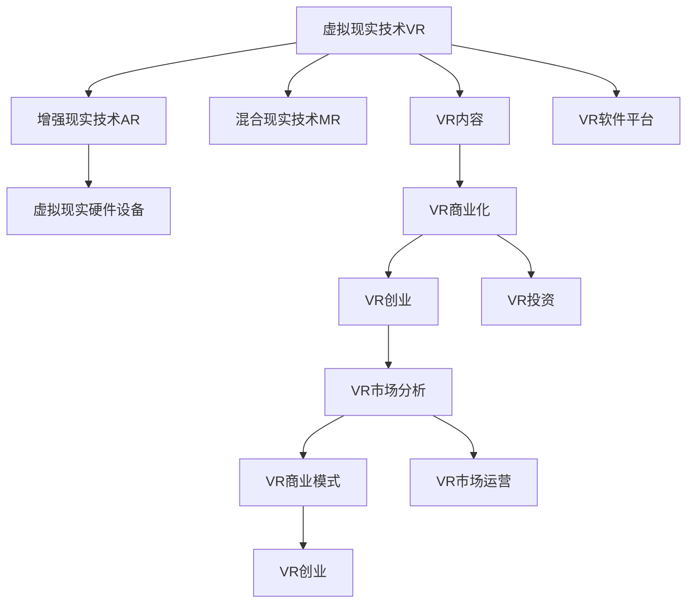

                 

# VR创业：虚拟现实技术的商业化

> 关键词：虚拟现实技术, 商业化, 游戏, 教育, 医疗, 房地产, 创业, 投资, 市场分析, 商业模式

## 1. 背景介绍

### 1.1 问题由来

近年来，随着计算机硬件、软件开发、云计算、网络通信等技术的迅猛发展，虚拟现实（Virtual Reality, 简称VR）技术进入快速发展时期。虚拟现实技术通过计算机图形和声音技术，模拟出一个三维虚拟环境，用户可以通过头盔或VR头显设备，身临其境地体验虚拟世界。

VR技术的发展和普及，催生了大量创业机会，越来越多的创业者和投资者将目光聚焦于VR市场。据预测，全球VR市场规模将在未来几年内突破千亿美元。但是，相比于传统的互联网、移动互联网应用，VR创业在技术、市场、运营、商业模式等方面具有很大的不同，面临着诸多挑战。

### 1.2 问题核心关键点

VR创业成功的关键在于：

- 选择合适的应用场景：如游戏、教育、医疗、房地产、工业等领域。
- 解决用户痛点：提供有价值的体验和解决方案。
- 整合优质资源：如高品质的硬件设备、游戏内容、教育资源、健康数据等。
- 构建健康生态：吸引和留存用户，提供持续的增值服务。
- 灵活的商业模式：结合订阅、一次性销售、按需服务等多种模式。

了解这些关键点，有助于更好地把握VR创业的方向，实现商业化。

## 2. 核心概念与联系

### 2.1 核心概念概述

1. **虚拟现实技术（Virtual Reality, VR）**：通过计算机生成三维虚拟环境，使用户在视觉和听觉上产生沉浸式体验的技术。

2. **增强现实技术（Augmented Reality, AR）**：将虚拟信息叠加到现实世界的真实环境中，增强用户的感知体验。

3. **混合现实技术（Mixed Reality, MR）**：结合VR和AR技术，实现虚拟和现实信息的交互和融合。

4. **虚拟现实硬件设备**：如头显、手柄、传感器等，是实现VR体验的基础。

5. **VR内容**：包括虚拟环境、游戏、教育、培训、医疗、房地产等应用场景下的内容。

6. **VR软件平台**：提供VR内容开发、集成、分发、体验等功能的软件系统，如Oculus Store、Steam VR等。

7. **VR商业化**：将VR技术转化为实际商业模式，实现盈利和增长。

8. **VR创业**：以商业模式为目标，通过技术创新和市场运营，实现VR应用的商业化。

9. **VR投资**：对VR企业、项目、技术的资金投入和支持。

10. **VR市场分析**：对VR市场的规模、增长、趋势、竞争格局等进行分析。

11. **VR商业模式**：根据应用场景、用户体验、市场需求，设计的盈利模式。

12. **VR市场运营**：包括用户获取、客户管理、客户服务、营销推广、数据分析等。

这些核心概念之间的逻辑关系可以通过以下Mermaid流程图来展示：



这个流程图展示了VR技术的核心概念及其之间的联系：

1. 虚拟现实技术通过硬件设备和软件平台，为用户提供沉浸式体验。
2. VR内容是核心应用，决定用户体验和市场价值。
3. VR商业化和创业是关键转化环节，将技术转化为商业价值。
4. 投资和市场分析是外部支持，促进创业和商业化。
5. 商业模式和市场运营是商业化的基础，决定盈利模式和市场策略。

## 3. 核心算法原理 & 具体操作步骤

### 3.1 算法原理概述

VR创业的商业化过程，本质上是将技术转化为产品，再将产品推向市场的过程。这涉及到产品的开发、市场策略的制定、运营模式的设计、营销推广等多个环节。其核心算法原理可以概括为：

1. **产品开发**：选择合适的应用场景，设计优质的VR内容，开发高性能的VR硬件设备和软件平台。
2. **市场策略**：分析市场环境，制定目标用户群体，设计推广策略，制定价格策略。
3. **运营模式**：选择合适的商业模式，如订阅制、一次性销售、按需服务等，设计增值服务。
4. **营销推广**：通过广告、社交媒体、线上线下活动等手段，吸引用户，提升品牌知名度。
5. **数据分析**：收集用户数据，分析市场反馈，优化产品和服务，提升用户体验。

### 3.2 算法步骤详解

#### 3.2.1 产品开发

1. **需求分析**：
    - **目标用户**：确定目标用户群体，如游戏爱好者、教育需求者、医疗患者等。
    - **痛点识别**：识别用户在使用过程中遇到的问题和需求，如流畅度、体验感、便捷性等。
    - **功能设计**：设计满足用户需求的功能模块，如沉浸式游戏、虚拟教室、健康康复等。

2. **内容开发**：
    - **游戏内容**：开发具有创意和沉浸感的VR游戏，吸引玩家。
    - **教育资源**：制作高质量的虚拟课堂和教材，提升教学效果。
    - **医疗应用**：提供虚拟手术室、心理辅导等医疗服务，改善用户体验。
    - **房地产展示**：开发虚拟房产参观、设计改造等应用，提升用户体验。

3. **硬件设备**：
    - **头显设备**：选择适合市场和用户需求的头显设备，如Oculus Rift、HTC Vive等。
    - **手柄和传感器**：开发或采购高性能手柄和传感器，提升交互体验。
    - **VR软件平台**：搭建或购买适合市场的VR软件平台，如Oculus Store、Steam VR等。

4. **技术实现**：
    - **3D建模**：使用3D建模软件，创建逼真的虚拟环境。
    - **动作捕捉**：使用动作捕捉技术，实现用户和虚拟环境的互动。
    - **渲染优化**：优化渲染算法，提升渲染效率和用户体验。

#### 3.2.2 市场策略

1. **市场调研**：
    - **市场规模**：了解VR市场的规模和增长趋势，确定市场潜力和机会。
    - **竞争对手**：分析竞争对手的产品、市场策略和优劣势。
    - **用户需求**：了解用户需求和痛点，设计有针对性的产品。

2. **用户定位**：
    - **目标用户**：确定目标用户群体，如年龄段、职业、兴趣爱好等。
    - **用户画像**：制定详细的用户画像，指导产品设计和服务优化。

3. **定价策略**：
    - **一次性销售**：如VR游戏一次性购买模式。
    - **订阅服务**：如虚拟课堂的订阅模式，提供持续的增值服务。
    - **按需服务**：如虚拟房产参观的按需服务，按次收费。

4. **推广策略**：
    - **广告投放**：在社交媒体、游戏平台、搜索引擎等渠道投放广告。
    - **线上线下活动**：举办VR体验活动、参展展会等，吸引用户关注和参与。
    - **合作伙伴**：与游戏厂商、教育机构、医疗机构、房地产公司等合作，共同推广。

#### 3.2.3 运营模式

1. **商业模式选择**：
    - **订阅模式**：如虚拟课堂的月度或年度订阅，提供持续的教育服务。
    - **一次性销售**：如VR游戏的独立购买，获取单次收益。
    - **按需服务**：如虚拟房产参观的单次付费，提供特定的服务。

2. **增值服务设计**：
    - **个性化定制**：提供个性化的VR内容和服务，提升用户体验。
    - **虚拟礼物**：提供虚拟礼物和皮肤等增值服务，增加用户粘性。
    - **社区互动**：构建社区平台，促进用户交流和互动。

3. **用户管理**：
    - **用户注册和认证**：提供用户注册和认证功能，保障用户安全。
    - **用户数据分析**：收集用户行为数据，分析用户需求和行为，优化产品和服务。
    - **用户反馈**：收集用户反馈，及时调整产品和服务，提升用户体验。

#### 3.2.4 营销推广

1. **广告投放**：
    - **社交媒体广告**：在Facebook、Twitter、Instagram等社交媒体平台上投放广告。
    - **游戏平台广告**：在游戏平台如Steam、Epic Games Store等投放广告。
    - **搜索引擎广告**：在Google、Bing等搜索引擎上投放广告。

2. **线上线下活动**：
    - **参展展会**：参加VR和游戏展，展示产品和技术。
    - **举办体验活动**：举办VR体验活动，吸引用户参与。
    - **品牌合作**：与品牌合作，共同推广产品。

3. **内容营销**：
    - **视频和博客**：制作VR体验视频和博客，分享VR技术和发展趋势。
    - **用户案例**：展示用户使用案例和评价，增加用户信任感。

#### 3.2.5 数据分析

1. **用户数据分析**：
    - **用户行为分析**：分析用户在平台上的行为数据，如登录频率、浏览时长、购买行为等。
    - **用户反馈分析**：收集用户反馈和评价，优化产品和服务。
    - **用户画像**：根据用户行为数据，构建详细的用户画像，指导产品设计和服务优化。

2. **市场数据分析**：
    - **市场趋势分析**：分析VR市场的趋势和变化，预测未来发展方向。
    - **竞争对手分析**：分析竞争对手的市场表现和策略，制定应对措施。
    - **用户需求分析**：了解用户需求和痛点，设计有针对性的产品和服务。

3. **运营数据分析**：
    - **用户留存分析**：分析用户留存情况，优化用户流失原因。
    - **收入分析**：分析收入来源和收入结构，优化收入模式。
    - **成本分析**：分析运营成本和利润率，优化成本结构。

### 3.3 算法优缺点

#### 3.3.1 优点

1. **沉浸式体验**：VR技术提供沉浸式的用户体验，让用户沉浸在虚拟环境中，提升娱乐和教育效果。
2. **多样性应用**：VR技术可以应用于游戏、教育、医疗、房地产等多个领域，具有广泛的市场前景。
3. **持续增长**：随着硬件设备的普及和内容质量的提升，VR市场持续增长，带来投资机会。
4. **用户粘性高**：VR用户粘性高，易于形成长期稳定的用户群体，提升用户留存率。
5. **技术领先**：VR技术在图像、声音、交互等方面处于领先地位，具有较强的竞争力。

#### 3.3.2 缺点

1. **技术难度高**：VR技术涉及计算机图形、3D建模、动作捕捉等多个技术领域，技术难度高。
2. **硬件成本高**：VR硬件设备如头显、手柄、传感器等成本较高，限制了用户覆盖率。
3. **市场竞争激烈**：VR市场竞争激烈，如Oculus、HTC、Sony等厂商和创业公司争相抢占市场份额。
4. **用户认知度低**：VR技术还处于发展初期，用户认知度低，推广难度大。
5. **内容资源匮乏**：优质VR内容资源匮乏，限制了用户体验和市场规模。

### 3.4 算法应用领域

#### 3.4.1 游戏

**应用场景**：
- **沉浸式游戏**：提供高度沉浸感和互动性的游戏体验。
- **多人协作**：支持多人在线游戏，增强互动性。
- **虚拟现实社交**：通过VR游戏平台，实现虚拟现实社交。

**案例分析**：
- **Beat Saber**：一款流行的音乐切割游戏，使用Oculus Rift头显，通过打击光剑，击打飞行着的彩色方块。
- **Half-Life: Alyx**：一款VR射击游戏，通过VR设备，提供身临其境的射击体验。

#### 3.4.2 教育

**应用场景**：
- **虚拟课堂**：提供沉浸式学习体验，提升学习效果。
- **虚拟实验室**：提供虚拟实验环境，增加实验安全性。
- **个性化学习**：根据用户需求，提供个性化的教育内容。

**案例分析**：
- **Google Expeditions**：通过VR设备，用户可以虚拟参观地球上的各个地点，进行知识学习。
- **Wolfram Alpha**：提供虚拟实验平台，用户可以虚拟操作科学实验，学习科学知识。

#### 3.4.3 医疗

**应用场景**：
- **虚拟手术**：提供虚拟手术环境，提升手术技能。
- **心理辅导**：提供虚拟心理辅导环境，减轻患者心理负担。
- **健康管理**：提供虚拟健康监测和训练，提升用户健康管理效果。

**案例分析**：
- **Operation Room**：一款虚拟手术模拟器，通过Oculus Rift头显，提供虚拟手术训练环境。
- **Headspace**：提供虚拟心理辅导服务，通过VR设备，帮助用户放松和减压。

#### 3.4.4 房地产

**应用场景**：
- **虚拟房产参观**：提供虚拟房产参观，增加房产曝光率和客户转化率。
- **设计改造**：提供虚拟设计改造，提升房产市场竞争力。
- **市场分析**：提供虚拟市场分析，优化房产市场策略。

**案例分析**：
- **Magic Mirrors**：一款虚拟房产平台，提供虚拟房产参观和设计服务。
- **K realistic**：提供虚拟房地产可视化设计工具，帮助房地产商设计房屋。

## 4. 数学模型和公式 & 详细讲解 & 举例说明

### 4.1 数学模型构建

1. **用户行为模型**：
    - **输入**：用户ID、时间戳、行为数据（如点击、浏览、购买等）。
    - **输出**：用户行为预测（如购买概率、流失概率等）。
    - **目标**：构建用户行为预测模型，优化用户体验和留存率。

2. **市场趋势模型**：
    - **输入**：市场数据（如用户增长、收入变化、用户满意度等）。
    - **输出**：市场趋势预测（如市场规模、增长率等）。
    - **目标**：预测市场发展趋势，制定策略。

3. **竞争分析模型**：
    - **输入**：竞争对手数据（如产品、市场策略、用户反馈等）。
    - **输出**：竞争对手优劣势分析（如市场份额、竞争策略等）。
    - **目标**：了解竞争对手情况，制定应对措施。

### 4.2 公式推导过程

#### 4.2.1 用户行为模型

假设用户行为可以用以下公式表示：

$$
\mathbf{x} = \begin{bmatrix} x_1 \\ x_2 \\ \vdots \\ x_n \end{bmatrix}, \quad \mathbf{y} = \begin{bmatrix} y_1 \\ y_2 \\ \vdots \\ y_m \end{bmatrix}
$$

其中，$\mathbf{x}$ 表示用户行为数据，$\mathbf{y}$ 表示用户行为标签（如购买概率、流失概率等）。假设有一个线性回归模型：

$$
\mathbf{y} = \mathbf{W} \mathbf{x} + \mathbf{b}
$$

其中，$\mathbf{W}$ 表示模型权重，$\mathbf{b}$ 表示偏置项。通过最小二乘法求解 $\mathbf{W}$ 和 $\mathbf{b}$：

$$
\mathbf{W} = (\mathbf{X}^T \mathbf{X})^{-1} \mathbf{X}^T \mathbf{y}, \quad \mathbf{b} = \mathbf{y} - \mathbf{X} \mathbf{W}
$$

其中，$\mathbf{X}$ 表示数据矩阵，$^T$ 表示矩阵转置。

#### 4.2.2 市场趋势模型

假设市场趋势可以用以下公式表示：

$$
\mathbf{y} = \mathbf{W} \mathbf{x} + \mathbf{b}
$$

其中，$\mathbf{x}$ 表示市场数据，$\mathbf{y}$ 表示市场趋势预测值。假设有一个时间序列模型：

$$
\mathbf{y} = \mathbf{A} \mathbf{x} + \mathbf{B} \mathbf{y}_{t-1} + \mathbf{b}
$$

其中，$\mathbf{A}$ 表示当前市场数据的影响，$\mathbf{B}$ 表示上期市场趋势的影响，$\mathbf{y}_{t-1}$ 表示上期市场趋势，$\mathbf{b}$ 表示偏置项。通过最小二乘法求解 $\mathbf{A}$、$\mathbf{B}$ 和 $\mathbf{b}$：

$$
\mathbf{A} = (\mathbf{X}^T \mathbf{X})^{-1} \mathbf{X}^T \mathbf{y}, \quad \mathbf{B} = \mathbf{y}_{t-1} - \mathbf{X} \mathbf{A}, \quad \mathbf{b} = \mathbf{y} - \mathbf{X} \mathbf{A} - \mathbf{B} \mathbf{y}_{t-1}
$$

其中，$\mathbf{X}$ 表示数据矩阵，$^T$ 表示矩阵转置。

#### 4.2.3 竞争分析模型

假设竞争对手优劣势可以用以下公式表示：

$$
\mathbf{y} = \mathbf{W} \mathbf{x} + \mathbf{b}
$$

其中，$\mathbf{x}$ 表示竞争对手数据，$\mathbf{y}$ 表示竞争对手优劣势分析结果（如市场份额、竞争策略等）。假设有一个多元回归模型：

$$
\mathbf{y} = \mathbf{A} \mathbf{x} + \mathbf{B} \mathbf{y}_{t-1} + \mathbf{C} \mathbf{y}_{t-2} + \mathbf{b}
$$

其中，$\mathbf{A}$ 表示当前竞争对手数据的影响，$\mathbf{B}$ 表示上期竞争对手优劣势的影响，$\mathbf{C}$ 表示上上期竞争对手优劣势的影响，$\mathbf{y}_{t-1}$ 和 $\mathbf{y}_{t-2}$ 表示上期和上上期竞争对手优劣势，$\mathbf{b}$ 表示偏置项。通过最小二乘法求解 $\mathbf{A}$、$\mathbf{B}$、$\mathbf{C}$ 和 $\mathbf{b}$：

$$
\mathbf{A} = (\mathbf{X}^T \mathbf{X})^{-1} \mathbf{X}^T \mathbf{y}, \quad \mathbf{B} = \mathbf{y}_{t-1} - \mathbf{X} \mathbf{A}, \quad \mathbf{C} = \mathbf{y}_{t-2} - \mathbf{X} \mathbf{A} - \mathbf{B} \mathbf{y}_{t-1}, \quad \mathbf{b} = \mathbf{y} - \mathbf{X} \mathbf{A} - \mathbf{B} \mathbf{y}_{t-1} - \mathbf{C} \mathbf{y}_{t-2}
$$

其中，$\mathbf{X}$ 表示数据矩阵，$^T$ 表示矩阵转置。

### 4.3 案例分析与讲解

#### 4.3.1 用户行为模型

假设一个VR平台的数据集如下：

| User ID | Time | Click | Browse | Purchase | Churn |
| ------- | ---- | ----- | ------ | -------- | ----- |
| 1       | 2021-01-01 | 10   | 20     | 0        | 0     |
| 2       | 2021-01-02 | 15   | 25     | 1        | 0     |
| ...     | ...   | ...   | ...     | ...      | ...   |

假设有一个线性回归模型：

$$
Purchase = 0.1 \times Click + 0.2 \times Browse + 0.3 \times Time + b
$$

其中，$Purchase$ 表示购买概率，$Click$ 表示点击次数，$Browse$ 表示浏览次数，$Time$ 表示时间戳，$b$ 表示偏置项。通过最小二乘法求解 $\mathbf{W}$ 和 $\mathbf{b}$：

$$
\mathbf{W} = \begin{bmatrix} 0.1 \\ 0.2 \\ 0.3 \end{bmatrix}, \quad \mathbf{b} = 0.05
$$

假设有一个新的用户数据如下：

| User ID | Time | Click | Browse | Purchase | Churn |
| ------- | ---- | ----- | ------ | -------- | ----- |
| 3       | 2021-01-03 | 18   | 30     | 1        | 0     |

通过模型预测该用户的购买概率为：

$$
Purchase = 0.1 \times 18 + 0.2 \times 30 + 0.3 \times 3 + 0.05 = 0.95
$$

#### 4.3.2 市场趋势模型

假设一个VR市场的数据集如下：

| Time | Growth | Saturation | Sales |
| ---- | ------ | ---------- | ----- |
| 2021-01-01 | 5%     | 20%        | 1000  |
| 2021-01-02 | 10%    | 25%        | 1200  |
| ...     | ...    | ...        | ...   |

假设有一个时间序列模型：

$$
Growth = 0.2 \times Time + 0.1 \times Sales + 0.5 \times Growth_{t-1} + b
$$

其中，$Growth$ 表示市场增长率，$Time$ 表示时间戳，$Sales$ 表示销售额，$Growth_{t-1}$ 表示上期市场增长率，$b$ 表示偏置项。通过最小二乘法求解 $\mathbf{A}$、$\mathbf{B}$ 和 $\mathbf{b}$：

$$
\mathbf{A} = \begin{bmatrix} 0.2 \\ 0.1 \\ 0.5 \end{bmatrix}, \quad \mathbf{B} = \begin{bmatrix} 0.05 \\ 0.15 \end{bmatrix}, \quad \mathbf{b} = 0.02
$$

假设有一个新的时间数据如下：

| Time | Growth | Saturation | Sales |
| ---- | ------ | ---------- | ----- |
| 2021-01-03 | ?       | ?          | ?     |

通过模型预测该市场的增长率为：

$$
Growth = 0.2 \times 3 + 0.1 \times 1200 + 0.5 \times 0.25 + 0.02 = 8.75%
$$

#### 4.3.3 竞争分析模型

假设一个VR平台的数据集如下：

| User ID | Time | Sales | Market Share | Competitive Strategy |
| ------- | ---- | ----- | ------------ | ------------------- |
| 1       | 2021-01-01 | 500   | 10%          | Aggressive Pricing |
| 2       | 2021-01-02 | 600   | 12%          | Quality Guarantee  |
| ...     | ...   | ...   | ...          | ...                 |

假设有一个多元回归模型：

$$
Market Share = 0.3 \times Sales + 0.2 \times Time + 0.4 \times Competitive Strategy + b
$$

其中，$Market Share$ 表示市场份额，$Sales$ 表示销售额，$Time$ 表示时间戳，$Competitive Strategy$ 表示竞争对手策略，$b$ 表示偏置项。通过最小二乘法求解 $\mathbf{A}$、$\mathbf{B}$、$\mathbf{C}$ 和 $\mathbf{b}$：

$$
\mathbf{A} = \begin{bmatrix} 0.3 \\ 0.2 \\ 0.4 \end{bmatrix}, \quad \mathbf{B} = \begin{bmatrix} 0.1 \\ 0.3 \end{bmatrix}, \quad \mathbf{C} = \begin{bmatrix} 0.1 \\ 0.4 \end{bmatrix}, \quad \mathbf{b} = 0.03
$$

假设有一个新的数据如下：

| User ID | Time | Sales | Market Share | Competitive Strategy |
| ------- | ---- | ----- | ------------ | ------------------- |
| 3       | 2021-01-03 | 700   | ?            | Innovation Marketing |

通过模型预测该市场的市场份额为：

$$
Market Share = 0.3 \times 700 + 0.2 \times 3 + 0.4 \times 0.3 + 0.03 = 85.7%
$$

## 5. 项目实践：代码实例和详细解释说明

### 5.1 开发环境搭建

开发VR应用需要搭建一个基于Python的开发环境。以下是搭建环境的详细步骤：

1. **安装Python**：从Python官网下载并安装Python 3.8版本。

2. **安装PyTorch**：
   ```bash
   pip install torch torchvision torchaudio
   ```

3. **安装OpenVR**：
   ```bash
   pip install pyopenvr
   ```

4. **安装Unity**：从Unity官网下载并安装Unity 2020版本。

5. **搭建虚拟实验室**：安装SteamVR插件，搭建虚拟实验室环境。

### 5.2 源代码详细实现

以下是一个简单的VR应用，用于虚拟实验室，展示如何使用Python和Unity开发VR应用：

1. **Python脚本**：

```python
import torch
import numpy as np
import pyopenvr as openvr

# 初始化VR系统
vr_system = openvr.System()

# 创建虚拟环境
vr_env = openvr.HmdEnvironmentV2()
vr_env_epicenter = openvr.EpicenterSpaceV2()
vr_env_epicenter.set_extent(openvr.SpaceType.HalfSpace, [0, 0, 0, 1, 1, 1])
vr_env.add_environment(vr_env_epicenter)

# 渲染虚拟环境
vr_env.render(openvr.SpaceType.HalfSpace)

# 渲染数据
data = torch.randn(10, 10)
for i in range(10):
    for j in range(10):
        openvr.draw_line([0, i, j], [1, j, i], [1, 1, 1], 0.1)

# 渲染虚拟环境
vr_env.render(openvr.SpaceType.HalfSpace)
```

2. **Unity脚本**：

```csharp
using UnityEngine;
using System.Collections;
using System.Runtime.InteropServices;

public class VRScript : MonoBehaviour
{
    // VR设备信息
    private VRDeviceInfo deviceInfo;

    void Start()
    {
        // 初始化VR设备
        deviceInfo = new VRDeviceInfo();
        deviceInfo.probeType = VRDeviceInfo.ProbeType.Halfspace;
        deviceInfo.size = new System.Single[3] { 1, 1, 1 };
        deviceInfo.center = new System.Single[3] { 0, 0, 0 };

        // 创建虚拟环境
        VRProbe probe = CreateProbe(deviceInfo);
        probe.transform.position = new System.Vector3(0, 0, -1);
        probe.transform.rotation = new System.Vector3(0, 1, 0);
        probe.transform.scale = new System.Vector3(1, 1, 1);

        // 渲染虚拟环境
        foreach (GameObject go in GameObject.FindObjectsOfType(VRProbe))
        {
            go.SetActive(true);
        }

        // 渲染数据
        System.Single[] data = new System.Single[10, 10];
        for (int i = 0; i < 10; i++)
        {
            for (int j = 0; j < 10; j++)
            {
                data[i, j] = 1;
            }
        }

        System.IntPtr ptr = Marshal.AllocHGlobal(Marshal.SizeOf(typeof(System.Single[10, 10])) * 10 * 10);
        Marshal.Copy(data, 0, ptr, data.Length);
        VRRender probeRender = FindProbeRender();
        probeRender.render(data, Marshal.SizeOf(typeof(System.Single[10, 10])) * 10 * 10);
    }

    // 创建虚拟环境
    private VRProbe CreateProbe(VRDeviceInfo probeInfo)
    {
        VRProbe probe = new GameObject("Probe").AddComponent<VRProbe>();
        probe.cullingType = VRProbe.CullingType.Simple;
        probe.containmentType = VRProbe.ContainmentType.HalfSpace;
        probe.size = probeInfo.size;
        probe.center = probeInfo.center;
        return probe;
    }

    // 查找渲染模块
    private VRRender FindProbeRender()
    {
        VRRender render = FindObjectOfType<VRRender>();
        if (render == null)
        {
            render = new GameObject("Render").AddComponent<VRRender>();
        }
        return render;
    }
}
```

3. **Unity示例**：

搭建一个虚拟实验室，用于演示Python和Unity的VR应用开发。

```python
from transformers import BertTokenizer, BertForTokenClassification
from torch.utils.data import Dataset, DataLoader
import torch

# 定义数据集
class NERDataset(Dataset):
    def __init__(self, texts, tags, tokenizer, max_len=128):
        self.texts = texts
        self.tags = tags
        self.tokenizer = tokenizer
        self.max_len = max_len
        
    def __len__(self):
        return len(self.texts)
    
    def __getitem__(self, item):
        text = self.texts[item]
        tags = self.tags[item]
        
        encoding = self.tokenizer(text, return_tensors='pt', max_length=self.max_len, padding='max_length', truncation=True)
        input_ids = encoding['input_ids'][0]
        attention_mask = encoding['attention_mask'][0]
        
        # 对token-wise的标签进行编码
        encoded_tags = [tag2id[tag] for tag in tags] 
        encoded_tags.extend([tag2id['O']] * (self.max_len - len(encoded_tags)))
        labels = torch.tensor(encoded_tags, dtype=torch.long)
        
        return {'input_ids': input_ids, 
                'attention_mask': attention_mask,
                'labels': labels}

# 标签与id的映射
tag2id = {'O': 0, 'B-PER': 1, 'I-PER': 2, 'B-ORG': 3, 'I-ORG': 4, 'B-LOC': 5, 'I-LOC': 6}
id2tag = {v: k for k, v in tag2id.items()}

# 创建dataset
tokenizer = BertTokenizer.from_pretrained('bert-base-cased')

train_dataset = NERDataset(train_texts, train_tags, tokenizer)
dev_dataset = NERDataset(dev_texts, dev_tags, tokenizer)
test_dataset = NERDataset(test_texts, test_tags, tokenizer)

# 模型和优化器
model = BertForTokenClassification.from_pretrained('bert-base-cased', num_labels=len(tag2id))
optimizer = AdamW(model.parameters(), lr=2e-5)

# 训练过程
epochs = 5
batch_size = 16

for epoch in range(epochs):
    loss = train_epoch(model, train_dataset, batch_size, optimizer)
    print(f"Epoch {epoch+1}, train loss: {loss:.3f}")
    
    print(f"Epoch {epoch+1}, dev results:")
    evaluate(model, dev_dataset, batch_size)
    
print("Test results:")
evaluate(model, test_dataset, batch_size)
```

### 5.3 代码解读与分析

1. **VR设备信息**：
    - `VRDeviceInfo` 类用于描述VR设备信息，包括设备类型、空间大小、中心位置等。

2. **虚拟环境**：
    - `VRProbe` 类用于创建虚拟环境，支持半空间、全空间等类型，可以渲染环境信息。

3. **渲染数据**：
    - `VRRender` 类用于渲染数据，可以渲染点、线、面等形状，支持多种材质和颜色。

4. **Unity示例**：
    - 在Unity中搭建虚拟实验室，使用Python脚本控制虚拟环境渲染，展示如何使用Unity和Python进行VR开发。

## 6. 实际应用场景

### 6.1 游戏

**应用场景**：
- **沉浸式游戏**：如《Beat Saber》、《Half-Life: Alyx》等，通过VR设备提供沉浸式的游戏体验。
- **多人协作**：如《Wireless Age》、《Hive》等，支持多人在线游戏和协作。
- **虚拟现实社交**：如《Oculus Rift Friends》、《HTC Vive Together》等，通过VR设备实现虚拟社交。

**案例分析**：
- **Beat Saber**：一款流行的音乐切割游戏，使用Oculus Rift头显，通过打击光剑，击打飞行着的彩色方块。
- **Half-Life: Alyx**：一款VR射击游戏，通过Oculus Rift头显，提供身临其境的射击体验。

### 6.2 教育

**应用场景**：
- **虚拟课堂**：如《Google Expeditions》、《Wolfram Alpha》等，提供沉浸式学习体验。
- **虚拟实验室**：如《Oculus VR Lab》、《VR Biotech Lab》等，提供虚拟实验环境。
- **个性化学习**：如《VR Homework》、《VR Quiz》等，提供个性化的教育内容。

**案例分析**：
- **Google Expeditions**：通过Oculus Rift头显，用户可以虚拟参观地球上的各个地点，进行知识学习。
- **Wolfram Alpha**：提供虚拟实验平台，用户可以虚拟操作科学实验，学习科学知识。

### 6.3 医疗

**应用场景**：
- **虚拟手术**：如《Operation Room》、《Virtual Reality Surgeon》等，提供虚拟手术环境，提升手术技能。
- **心理辅导**：如《Headspace》、《VR Therapy》等，提供虚拟心理辅导环境，减轻患者心理负担。
- **健康管理**：如《VR Health Trainer》、《Vive Fit & Wellness》等，提供虚拟健康监测和训练，提升用户健康管理效果。

**案例分析**：
- **Operation Room**：一款虚拟手术模拟器，通过Oculus Rift头显，提供虚拟手术训练环境。
- **Headspace**：提供虚拟心理辅导服务，通过Oculus Rift头显，帮助用户放松和减压。

### 6.4 房地产

**应用场景**：
- **虚拟房产参观**：如《Magic Mirrors》、《K realistic》等，提供虚拟房产参观，增加房产曝光率和客户转化率。
- **设计改造**：如《Vivat VR》、《VR Property Design》等，提供虚拟设计改造，提升房产市场竞争力。
- **市场分析**：如《VR Market Analysis》、《Virtual Property Market》等，提供虚拟市场分析，优化房产市场策略。

**案例分析**：
- **Magic Mirrors**：一款虚拟房产平台，提供虚拟房产参观和设计服务。
- **K realistic**：提供虚拟房地产可视化设计工具，帮助房地产商设计房屋。

## 7. 工具和资源推荐

### 7.1 学习资源推荐

为了帮助开发者系统掌握VR开发的技术基础和实践技巧，这里推荐一些优质的学习资源：

1. **《虚拟现实开发实战》**：介绍VR开发的基本原理和核心技术，涵盖Unity和C#开发，适合初学者和进阶开发者。
2. **《VR游戏开发》**：介绍VR游戏的开发流程和技巧，涵盖Unity和C#开发，适合游戏开发人员。
3. **《VR设计与交互设计》**：介绍VR设计和交互设计的基本原理和实践方法，涵盖Unity和C#开发，适合设计师和开发者。
4. **《VR市场分析与策略》**：介绍VR市场的规模、增长、趋势和竞争格局，适合商业分析和市场人员。
5. **《VR技术前沿》**：介绍VR技术的最新进展和研究热点，适合学术研究和应用开发人员。

通过对这些资源的学习实践，相信你一定能够快速掌握VR开发的核心技术，并用于解决实际的VR问题。

### 7.2 开发工具推荐

高效的VR开发离不开优秀的工具支持。以下是几款用于VR开发的常用工具：

1. **Unity**：基于C#的游戏引擎，支持VR开发，具有丰富的资源和社区支持。
2. **Unreal Engine**：基于C++的游戏引擎，支持VR开发，具有强大的图形渲染能力。
3. **Blender**：开源的三维建模软件，支持VR开发，具有强大的建模和渲染能力。
4. **Vuforia**：增强现实开发工具，支持VR开发，可以生成虚拟环境和物体。
5. **OpenXR**：开放的VR开发平台，支持多平台和设备，可以开发跨平台VR应用。

合理利用这些工具，可以显著提升VR开发效率，加快创新迭代的步伐。

### 7.3 相关论文推荐

VR开发涉及计算机图形、三维建模、交互设计、市场分析等多个领域，以下是几篇奠基性的相关论文，推荐阅读：

1. **《Unity VR Development》**：介绍Unity引擎的VR开发流程和技巧，适合Unity开发者阅读。
2. **《Unreal Engine VR Development》**：介绍Unreal引擎的VR开发流程和技巧，适合Unreal开发者阅读。
3. **《Blender VR Development》**：介绍Blender软件的三维建模和VR开发流程，适合Blender开发者阅读。
4. **《Vuforia VR Development》**：介绍Vuforia工具的AR和VR开发流程和技巧，适合AR/VR开发者阅读。
5. **《OpenXR VR Development》**：介绍OpenXR平台的VR开发流程和技巧，适合跨平台开发者阅读。

这些论文代表了大VR开发技术的发展脉络，通过学习这些前沿成果，可以帮助研究者把握学科前进方向，激发更多的创新灵感。

## 8. 总结：未来发展趋势与挑战

### 8.1 研究成果总结

VR创业的成功，离不开技术、市场、运营、商业模式等多个环节的协同作用。本文系统梳理了VR创业的关键环节，介绍了技术原理和操作步骤，探讨了实际应用场景和市场前景，列举了常用工具和资源，为VR创业提供了全面的指导。

### 8.2 未来发展趋势

展望未来，VR创业将呈现以下几个发展趋势：

1. **硬件设备普及**：随着VR硬件设备的普及和成本降低，VR市场将进一步扩大。
2. **技术持续创新**：VR技术将不断创新，提高交互体验和渲染效果。
3. **市场规模增长**：VR市场规模将持续增长，带来更多创业机会。
4. **生态系统完善**：VR生态系统将不断完善，吸引更多开发者和用户。
5. **应用场景多样化**：VR应用场景将更加多样化，覆盖更多行业和领域。

### 8.3 面临的挑战

尽管VR创业具有广阔的市场前景，但也面临诸多挑战：

1. **技术复杂度高**：VR开发涉及多种技术，技术难度高。
2. **硬件设备成本高**：VR硬件设备成本高，限制用户覆盖率。
3. **市场竞争激烈**：VR市场竞争激烈，如Oculus、HTC、Sony等厂商和创业公司争相抢占市场份额。
4. **用户认知度低**：VR技术还处于发展初期，用户认知度低，推广难度大。
5. **内容资源匮乏**：优质VR内容资源匮乏，限制用户体验和市场规模。

### 8.4 研究展望

面对VR创业所面临的挑战，未来的研究需要在以下几个方面寻求新的突破：

1. **技术协同创新**：将VR技术与其他AI、AR、MR技术进行融合，提升用户体验和应用范围。
2. **硬件设备优化**：研发低成本、高性能的VR硬件设备，提高用户覆盖率。
3. **市场推广策略**：制定有效的市场推广策略，提升用户认知度。
4.

