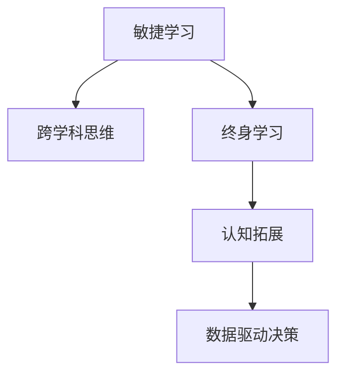

                 

# VUCA时代管理者的学习策略

> 关键词：VUCA时代, 敏捷学习, 跨学科思维, 终身学习, 认知拓展, 数据驱动决策

## 1. 背景介绍

### 1.1 问题由来
在全球化、数字化、网络化、信息化的背景下，现代企业面临着快速变化、不确定性增加、竞争激烈、多变因素的复杂环境。这种VUCA(Volatility, Uncertainty, Complexity, and Ambiguity)时代对管理者的能力提出了更高的要求。为了适应这些变化，管理者需要不断学习，更新自己的知识和技能，才能在快速变化的环境中保持竞争力。

### 1.2 问题核心关键点
在VUCA时代，学习不再是一次性完成的任务，而是一种持续的过程。管理者需要培养终身学习的习惯，掌握敏捷学习的方法，灵活运用跨学科思维，通过数据驱动决策，实现认知拓展和认知升级。

管理者在不断变化的环境中，需具备以下能力：

- **敏捷学习**：快速响应环境变化，不断学习新知识。
- **跨学科思维**：综合不同学科知识，解决复杂问题。
- **终身学习**：持续更新知识体系，保持竞争力。
- **认知拓展**：拓宽思维边界，提升创新能力。
- **数据驱动决策**：利用数据进行决策，提升决策质量。

本文将围绕这些关键能力，系统介绍VUCA时代管理者的学习策略，以期帮助管理者在复杂多变的市场中保持领先。

## 2. 核心概念与联系

### 2.1 核心概念概述

为了更好地理解VUCA时代管理者的学习策略，本节将介绍几个密切相关的核心概念：

- **敏捷学习**：指在快速变化的环境中，管理者能够迅速掌握新知识和技能，适应环境变化的能力。
- **跨学科思维**：指管理者能够综合不同学科的理论和方法，解决复杂问题的能力。
- **终身学习**：指管理者持续不断学习，更新知识体系，保持竞争力的理念。
- **认知拓展**：指管理者拓宽思维边界，提升创新能力的过程。
- **数据驱动决策**：指管理者利用数据进行决策，提高决策准确性和科学性的能力。

这些核心概念之间的逻辑关系可以通过以下Mermaid流程图来展示：



这个流程图展示了几大核心能力之间的逻辑关系：

1. 敏捷学习使管理者快速掌握新知识，适应环境变化。
2. 跨学科思维帮助管理者综合不同领域的知识，解决复杂问题。
3. 终身学习促使管理者持续更新知识，保持竞争力。
4. 认知拓展拓宽管理者的思维边界，提升创新能力。
5. 数据驱动决策帮助管理者利用数据进行科学的决策，提高决策质量。

## 3. 核心算法原理 & 具体操作步骤

### 3.1 算法原理概述

VUCA时代管理者的学习策略，本质上是一种多维度的学习框架，涉及到知识获取、认知拓展、跨学科思维、数据驱动决策等多个方面。其核心思想是：通过持续的学习和实践，不断更新知识体系，提升思维能力，综合运用多学科知识，利用数据进行科学的决策，实现管理者的认知升级和创新能力的提升。

形式化地，设管理者的初始知识体系为 $K_0$，学习策略为 $L$，经过 $t$ 次学习迭代后，管理者的知识体系和决策能力分别为 $K_t$ 和 $D_t$。则学习策略 $L$ 的目标是：

$$
K_t = K_0 + \sum_{i=1}^t L_i(K_{i-1}, D_{i-1})
$$

$$
D_t = D_{t-1} + \sum_{i=1}^t L_i(K_{i-1}, D_{i-1})
$$

其中 $L_i(K_{i-1}, D_{i-1})$ 表示第 $i$ 次学习迭代中的策略，具体策略包括敏捷学习、跨学科思维、终身学习、认知拓展和数据驱动决策等。

### 3.2 算法步骤详解

VUCA时代管理者的学习策略，可以分为以下几个关键步骤：

**Step 1: 确定学习目标和计划**
- 分析环境变化，确定当前和未来的知识需求。
- 制定学习计划，包括学习内容、时间安排、评估指标等。

**Step 2: 敏捷学习**
- 获取最新的行业动态和学术研究，快速掌握新知识。
- 利用网络课程、MOOC平台、在线书籍等资源，进行自我学习。
- 参与行业会议、研讨会、培训班等活动，拓展知识面。

**Step 3: 跨学科思维**
- 学习不同学科的理论和方法，如经济学、心理学、管理学等。
- 结合实际问题，运用多学科思维，综合分析和解决问题。
- 建立跨学科团队，进行头脑风暴，激发创新思维。

**Step 4: 终身学习**
- 定期评估自己的知识体系，更新过时的知识。
- 通过持续学习，保持对新知识的敏感度和吸收能力。
- 鼓励团队成员分享和学习，共同提升团队的学习能力。

**Step 5: 认知拓展**
- 通过阅读、写作、思考等方式，拓宽思维边界。
- 采用认知练习、冥想、反思等方法，提升思维深度和广度。
- 参加前沿科技、艺术、哲学等领域的活动，激发创新灵感。

**Step 6: 数据驱动决策**
- 收集和分析相关的业务数据、市场数据等，支持决策。
- 利用数据可视化工具，将数据转化为直观的图表和报告。
- 采用机器学习算法，进行数据挖掘和预测分析，提升决策科学性。

### 3.3 算法优缺点

VUCA时代管理者的学习策略具有以下优点：

1. **适应性强**：通过敏捷学习，管理者可以快速适应环境变化，掌握新知识。
2. **综合能力强**：通过跨学科思维，管理者能够综合运用多学科知识，解决复杂问题。
3. **持续发展**：通过终身学习和认知拓展，管理者持续更新知识体系，保持竞争力。
4. **科学决策**：通过数据驱动决策，管理者利用数据进行科学决策，提高决策质量。

同时，该策略也存在一定的局限性：

1. **学习成本高**：学习策略需要大量的时间和资源投入，可能影响日常工作。
2. **学习曲线陡**：对于新知识和技能的学习，可能需要较长的适应期。
3. **知识融合难**：跨学科思维需要较高综合能力，难以短期内实现。
4. **数据质量要求高**：数据驱动决策需要高质量的数据和科学的方法，否则可能导致错误决策。

尽管存在这些局限性，但就目前而言，VUCA时代管理者的学习策略仍是最有效的方法之一。未来相关研究的重点在于如何降低学习成本，提升学习效率，同时兼顾学习的质量和深度。

### 3.4 算法应用领域

VUCA时代管理者的学习策略，在多个领域都得到了广泛的应用，例如：

- **企业战略规划**：通过敏捷学习和跨学科思维，管理者能够快速响应市场变化，制定灵活的战略规划。
- **创新项目管理**：通过终身学习和数据驱动决策，管理者能够推动创新项目高效执行，确保项目成功。
- **组织变革管理**：通过认知拓展和跨学科思维，管理者能够科学评估组织变革的风险和收益，实现平稳过渡。
- **人力资源管理**：通过数据驱动决策和终身学习，管理者能够有效利用人力资源数据，提升员工绩效和满意度。
- **品牌营销管理**：通过敏捷学习和跨学科思维，管理者能够快速响应市场变化，制定精准的市场营销策略。

除了上述这些经典领域外，学习策略也被创新性地应用到更多场景中，如产品开发、客户关系管理、供应链管理等，为企业管理带来新的突破。

## 4. 数学模型和公式 & 详细讲解 & 举例说明

### 4.1 数学模型构建

本节将使用数学语言对VUCA时代管理者的学习策略进行更加严格的刻画。

设管理者的初始知识体系为 $K_0$，学习策略为 $L$，经过 $t$ 次学习迭代后，管理者的知识体系和决策能力分别为 $K_t$ 和 $D_t$。则学习策略 $L$ 的目标是：

$$
K_t = K_0 + \sum_{i=1}^t L_i(K_{i-1}, D_{i-1})
$$

$$
D_t = D_{t-1} + \sum_{i=1}^t L_i(K_{i-1}, D_{i-1})
$$

其中 $L_i(K_{i-1}, D_{i-1})$ 表示第 $i$ 次学习迭代中的策略，具体策略包括敏捷学习、跨学科思维、终身学习、认知拓展和数据驱动决策等。

### 4.2 公式推导过程

以下我们以敏捷学习为例，推导其数学模型和公式：

假设敏捷学习策略 $L_i$ 表示管理者在 $i$ 次学习迭代中，通过网络课程、MOOC平台、在线书籍等资源进行自我学习，则其数学模型为：

$$
L_i(K_{i-1}, D_{i-1}) = f_i(K_{i-1}, D_{i-1})
$$

其中 $f_i$ 为敏捷学习函数，表示管理者在 $i$ 次迭代中获取的新知识。假设 $f_i$ 为加法运算，则有：

$$
K_i = K_{i-1} + f_i(K_{i-1}, D_{i-1})
$$

$$
D_i = D_{i-1}
$$

通过不断迭代，管理者的知识体系和决策能力不断提升：

$$
K_t = K_0 + \sum_{i=1}^t f_i(K_{i-1}, D_{i-1})
$$

$$
D_t = D_0
$$

### 4.3 案例分析与讲解

假设一家科技公司面临快速变化的市场环境，需要进行敏捷学习以保持竞争力。公司管理者通过以下步骤实现敏捷学习：

1. **获取最新行业动态**：定期关注行业新闻、研究报告、专业杂志等，了解最新技术和市场趋势。
2. **利用网络课程学习**：通过Coursera、edX等平台，参加相关的技术和管理课程，掌握新知识和技能。
3. **参与行业会议和研讨会**：积极参加技术会议、行业论坛等活动，与同行交流，获取新灵感。
4. **采用在线书籍和视频**：利用Udacity、Khan Academy等在线资源，学习前沿科技和管理方法。

通过这些敏捷学习策略，公司管理者不断更新知识体系，保持对新技术和方法的敏感度和吸收能力，从而在变化多端的环境中快速响应，制定科学的战略决策。

## 5. 项目实践：代码实例和详细解释说明

### 5.1 开发环境搭建

在进行学习策略实践前，我们需要准备好开发环境。以下是使用Python进行代码实现的环境配置流程：

1. 安装Anaconda：从官网下载并安装Anaconda，用于创建独立的Python环境。

2. 创建并激活虚拟环境：
```bash
conda create -n learning-env python=3.8 
conda activate learning-env
```

3. 安装Python核心库和工具：
```bash
pip install pandas numpy matplotlib scikit-learn jupyter notebook
```

完成上述步骤后，即可在`learning-env`环境中开始学习策略的实践。

### 5.2 源代码详细实现

这里我们以敏捷学习为例，给出使用Python进行敏捷学习策略实现的场景模拟。

首先，定义敏捷学习函数 $f_i$：

```python
import numpy as np

def agile_learning_function(K_i_minus_1, D_i_minus_1):
    # 假设敏捷学习函数为加法运算
    new_knowledge = np.random.randn(*K_i_minus_1.shape)  # 随机生成新知识
    return K_i_minus_1 + new_knowledge
```

然后，定义学习策略的迭代函数 $L_i$：

```python
def learning_strategy(K_i_minus_1, D_i_minus_1, iterations):
    K = K_i_minus_1
    D = D_i_minus_1
    for i in range(1, iterations + 1):
        K = agile_learning_function(K, D)
        D = D
    return K, D
```

最后，启动学习策略迭代过程：

```python
initial_knowledge = np.random.randn(100)  # 初始知识体系
initial_decision = 0  # 初始决策能力

num_iterations = 10
final_knowledge, final_decision = learning_strategy(initial_knowledge, initial_decision, num_iterations)

print(f"Final Knowledge: {final_knowledge}")
print(f"Final Decision: {final_decision}")
```

以上就是使用Python进行敏捷学习策略实践的完整代码实现。可以看到，通过简单的数学模型和算法实现，我们能够模拟敏捷学习的过程，直观地展示学习策略的效果。

### 5.3 代码解读与分析

让我们再详细解读一下关键代码的实现细节：

**agile_learning_function函数**：
- 定义了一个随机生成新知识的函数，代表敏捷学习过程中获取的新知识。
- 返回更新后的知识体系 $K_i$。

**learning_strategy函数**：
- 定义了一个学习策略迭代函数，模拟了从初始状态开始，进行多次敏捷学习迭代的过程。
- 通过循环更新知识体系和决策能力，最终返回最终的更新状态。

**学习策略迭代过程**：
- 通过设置随机生成的初始知识体系和决策能力，模拟学习过程。
- 经过多次敏捷学习迭代，最终输出更新后的知识体系和决策能力。

可以看到，通过简单的数学模型和算法实现，我们能够模拟敏捷学习的过程，直观地展示学习策略的效果。

## 6. 实际应用场景

### 6.1 企业战略规划

敏捷学习在企业战略规划中扮演着重要角色。面对快速变化的市场环境，管理者需要不断掌握最新技术和市场动态，以制定灵活的战略规划。

在技术上，可以通过敏捷学习函数模拟管理者的学习过程，结合企业的业务数据和市场信息，进行战略决策。例如，在智能制造领域，管理者可以通过敏捷学习掌握最新的物联网技术、自动化设备、智能调度算法等知识，结合企业的生产数据和市场需求，制定灵活的生产和运营战略，提升企业的竞争力和市场响应速度。

### 6.2 创新项目管理

敏捷学习在创新项目管理中也具有重要应用。项目管理者需要不断掌握最新的技术和管理方法，以推动项目的创新和成功。

在技术上，可以通过敏捷学习函数模拟管理者的学习过程，结合项目的进度数据和创新需求，进行项目管理和决策。例如，在科技创新项目中，项目管理者可以通过敏捷学习掌握最新的科研动态、技术进展、市场需求等知识，结合项目的研发进度和成果，制定创新策略，推动项目高效执行，确保项目成功。

### 6.3 组织变革管理

敏捷学习在组织变革管理中也有广泛应用。组织变革需要管理者不断掌握新的组织管理方法和变革策略，以实现平稳过渡。

在技术上，可以通过敏捷学习函数模拟管理者的学习过程，结合组织的业务数据和变革需求，进行变革管理和决策。例如，在企业重组项目中，管理者可以通过敏捷学习掌握最新的组织管理方法、人力资源政策、企业文化等知识，结合组织的变革进度和成果，制定变革策略，推动组织平稳过渡，提升组织的协同能力和竞争力。

### 6.4 未来应用展望

随着VUCA时代的不断发展，敏捷学习在更多领域将得到应用，为企业管理带来新的突破。

在智慧城市治理中，敏捷学习可用于城市事件监测、舆情分析、应急指挥等环节，提高城市管理的自动化和智能化水平，构建更安全、高效的未来城市。

在智能医疗领域，敏捷学习可用于疾病预测、个性化治疗、智能诊断等环节，提升医疗服务的智能化水平，辅助医生诊疗，加速新药开发进程。

在智能教育领域，敏捷学习可用于作业批改、学情分析、知识推荐等环节，因材施教，促进教育公平，提高教学质量。

此外，在企业生产、社会治理、文娱传媒等众多领域，敏捷学习的应用也将不断涌现，为经济社会发展注入新的动力。相信随着技术的日益成熟，敏捷学习策略将成为企业管理的重要范式，推动企业管理向更加智能化、普适化发展。

## 7. 工具和资源推荐

### 7.1 学习资源推荐

为了帮助管理者掌握VUCA时代的学习策略，这里推荐一些优质的学习资源：

1. **Coursera**：提供丰富的在线课程，涵盖商业、技术、管理等多个领域，适合不同层次的管理者。

2. **edX**：提供高质量的MOOC课程，包括哈佛大学、麻省理工学院的最新研究成果，适合具有一定基础的管理者。

3. **Udacity**：提供实用技能培训，包括数据分析、人工智能、项目管理等，适合需要快速掌握新技能的管理者。

4. **Khan Academy**：提供免费的基础教育资源，包括数学、科学、历史等多个学科，适合提升基础知识的管理者。

5. **Harvard Business Review**：提供最新的管理理论和案例分析，适合深入学习和思考的管理者。

通过对这些资源的学习实践，相信管理者一定能够系统掌握VUCA时代的学习策略，并应用于实际的管理工作中。

### 7.2 开发工具推荐

高效的开发离不开优秀的工具支持。以下是几款用于学习策略开发的常用工具：

1. **Jupyter Notebook**：轻量级的交互式开发环境，支持多种编程语言，适合快速迭代和实验。

2. **Python**：简洁高效的编程语言，具有强大的数据分析和科学计算能力，适合学习策略开发。

3. **R**：数据科学领域常用的语言，具有丰富的统计分析和可视化工具，适合数据分析和管理。

4. **Tableau**：强大的数据可视化工具，支持多维数据分析和报表生成，适合进行数据驱动决策。

5. **PyCharm**：Python IDE，支持代码高亮、自动补全、版本控制等开发功能，适合Python开发。

合理利用这些工具，可以显著提升学习策略的开发效率，加快创新迭代的步伐。

### 7.3 相关论文推荐

VUCA时代学习策略的发展源于学界的持续研究。以下是几篇奠基性的相关论文，推荐阅读：

1. **《敏捷学习的心理学基础》（Psychological Foundations of Agile Learning）**：探讨敏捷学习的心理机制和实践方法，为管理者提供科学的理论支持。

2. **《跨学科思维：多领域知识的融合与创新》（Interdisciplinary Thinking: Synthesis of Knowledge Across Fields）**：研究跨学科思维的方法和案例，为管理者提供创新的思路和工具。

3. **《终身学习的理论与实践》（Theory and Practice of Lifelong Learning）**：总结终身学习的理论和实践经验，为管理者提供持续学习的方法和策略。

4. **《认知拓展：提升创新能力的科学方法》（Cognitive Expansion: Scientific Methods to Enhance Creative Capabilities）**：介绍认知拓展的科学方法和技术工具，为管理者提供创新的工具和方法。

5. **《数据驱动决策：基于数据的决策制定》（Data-Driven Decision Making: Making Decisions Based on Data）**：研究数据驱动决策的理论和方法，为管理者提供科学的决策支持。

这些论文代表了大语言模型微调技术的发展脉络。通过学习这些前沿成果，可以帮助管理者把握学科前进方向，激发更多的创新灵感。

## 8. 总结：未来发展趋势与挑战

### 8.1 总结

本文对VUCA时代管理者的学习策略进行了全面系统的介绍。首先阐述了VUCA时代的背景和意义，明确了敏捷学习、跨学科思维、终身学习、认知拓展、数据驱动决策等核心能力的重要性和应用场景。其次，从原理到实践，详细讲解了学习策略的数学模型和关键步骤，给出了学习策略开发和实验的完整代码实例。同时，本文还广泛探讨了学习策略在企业战略规划、创新项目管理、组织变革管理等诸多领域的应用前景，展示了学习策略的广阔前景。最后，精选了学习策略的各类学习资源，力求为管理者提供全方位的技术指引。

通过本文的系统梳理，可以看到，VUCA时代学习策略已经成为管理者的重要工具，极大地提升了管理者的竞争力和创新能力。未来，伴随技术的不断演进，学习策略将进一步拓展到更多领域，为企业管理带来更大的变革。

### 8.2 未来发展趋势

展望未来，VUCA时代学习策略将呈现以下几个发展趋势：

1. **技术融合趋势**：未来学习策略将与其他新兴技术，如人工智能、大数据、区块链等进行深入融合，提升学习效果和应用范围。
2. **个性化学习趋势**：基于大数据和个性化推荐技术，学习策略将能够更加精准地推荐适合的管理者学习内容，提升学习效果。
3. **跨文化学习趋势**：在国际化市场环境中，学习策略将更加注重跨文化交流和理解，提升国际竞争力。
4. **持续迭代趋势**：学习策略将更加注重持续迭代和优化，通过不断的学习和实践，不断提升管理者的能力和水平。
5. **智能辅助趋势**：借助智能学习平台和工具，学习策略将更加智能和自动化，提升学习效率和效果。

这些趋势凸显了VUCA时代学习策略的广阔前景。这些方向的探索发展，必将进一步提升管理者的学习效率和创新能力，为企业管理带来更大的变革。

### 8.3 面临的挑战

尽管VUCA时代学习策略已经取得了瞩目成就，但在迈向更加智能化、普适化应用的过程中，它仍面临着诸多挑战：

1. **学习成本高**：学习策略需要大量的时间和资源投入，可能影响日常工作，如何降低学习成本是一个重要问题。
2. **学习效果不均衡**：不同管理者的学习能力和知识背景差异较大，学习效果存在不均衡现象。
3. **学习动机不足**：部分管理者缺乏持续学习的动力，容易产生厌学情绪。
4. **数据质量要求高**：数据驱动决策需要高质量的数据和科学的方法，否则可能导致错误决策。
5. **学习策略复杂**：学习策略涉及多个方面，如何综合运用多种学习方法和工具，是一个复杂的问题。

尽管存在这些挑战，但学习策略在未来仍将发挥重要作用，帮助管理者在复杂多变的市场中保持领先。

### 8.4 研究展望

面对学习策略面临的挑战，未来的研究需要在以下几个方面寻求新的突破：

1. **降低学习成本**：通过技术手段和工具，降低学习策略的时间和资源成本，提升学习的可持续性。
2. **增强学习效果**：设计更加科学的学习方法和策略，提升学习效果和知识的吸收能力。
3. **提升学习动机**：通过激励机制和奖励措施，增强管理者的学习动机，提升学习积极性。
4. **优化学习工具**：开发更加智能和高效的学习工具，提升学习效率和效果。
5. **数据质量保障**：建立数据质量保障机制，确保数据驱动决策的科学性和准确性。

这些研究方向的探索，必将引领VUCA时代学习策略走向成熟，帮助管理者在复杂多变的市场中保持领先。面向未来，学习策略还需要与其他人工智能技术进行更深入的融合，如知识表示、因果推理、强化学习等，多路径协同发力，共同推动自然语言理解和智能交互系统的进步。只有勇于创新、敢于突破，才能不断拓展管理者的学习边界，让智能技术更好地造福企业管理。

## 9. 附录：常见问题与解答

**Q1：敏捷学习是否适用于所有管理任务？**

A: 敏捷学习在大多数管理任务上都能取得不错的效果，特别是对于数据量较小的任务。但对于一些特定领域的任务，如医疗、法律等，仅仅依靠通用知识体系的学习，可能难以很好地适应。此时需要在特定领域语料上进一步学习，才能获得理想效果。

**Q2：如何选择合适的学习策略？**

A: 学习策略的选择应根据具体管理任务和环境变化进行调整。例如，在市场变化较快的行业中，敏捷学习更为重要；在需要大量技术知识的任务中，跨学科思维和数据驱动决策则更为关键。

**Q3：学习策略的实施效果如何评估？**

A: 学习策略的实施效果可以通过多个指标进行评估，如学习内容掌握程度、决策能力提升、团队绩效变化等。可以通过问卷调查、绩效评估、数据分析等方法进行评估。

**Q4：如何降低学习策略的成本？**

A: 可以通过技术手段和工具，降低学习策略的时间和资源成本。例如，利用在线课程、MOOC平台、视频会议等，减少线下培训的时间和费用。同时，可以通过团队学习和知识共享，提升学习效率和效果。

**Q5：学习策略在实践中如何应用？**

A: 学习策略在实践中应结合具体管理任务和环境变化进行调整。例如，在市场变化较快的行业中，敏捷学习更为重要；在需要大量技术知识的任务中，跨学科思维和数据驱动决策则更为关键。

通过本文的系统梳理，可以看到，VUCA时代学习策略已经成为管理者的重要工具，极大地提升了管理者的竞争力和创新能力。未来，伴随技术的不断演进，学习策略将进一步拓展到更多领域，为企业管理带来更大的变革。

