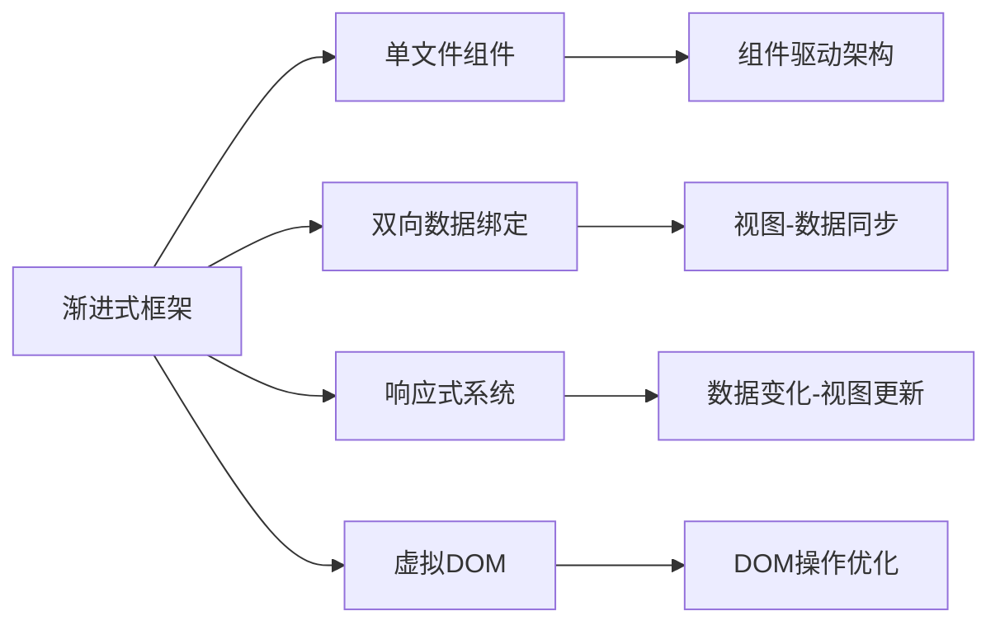

                 

# Vue.js 优势：渐进式 JavaScript 框架

> 关键词：Vue.js,渐进式框架,JavaScript,单文件组件,双向数据绑定,声明式模板,响应式系统,虚拟DOM,组件驱动架构

## 1. 背景介绍

随着Web技术的不断发展，前端框架的选择成为了开发者需要重点考虑的问题。当前市场上有许多流行的前端框架，如React、Vue.js、Angular等。这些框架各有优劣，选择合适的框架对于项目的成功至关重要。本文将重点介绍Vue.js框架，并分析其在现代Web开发中的优势和应用场景。

### 1.1 背景及背景原因
Vue.js是一个渐进式的JavaScript框架，由尤雨溪(Evan You)在2014年开发。Vue.js的初衷是提供一个简单易用的前端框架，并结合现代JavaScript工具链，让开发者能够快速构建高质量的Web应用。Vue.js的诞生源于以下几个背景：

- **Web应用的复杂性增加**：随着Web应用的复杂性增加，传统的前端开发模式（如基于DOM的操作）显得越来越繁琐和低效。
- **渐进式Web应用（PWA）的兴起**：PWA需要在Web和Native应用之间找到平衡，需要一种新的开发框架来支持这种需求。
- **组件化开发的兴起**：组件化成为一种新的开发模式，需要一种灵活的框架来支持这种开发方式。
- **现代JavaScript工具链的支持**：如ES6、Babel、Webpack等工具的支持，使得前端开发更加便捷和高效。

### 1.2 Vue.js的特点及特点原因
Vue.js的核心特点包括渐进式、组件化、双向数据绑定等。这些特点使得Vue.js在现代Web开发中具有独特的优势：

- **渐进式**： Vue.js使用了一个渐进式的API，可以逐步引入，灵活地应用于各种场景。
- **组件化**： Vue.js采用了组件化的开发模式，可以更好地组织和管理代码。
- **双向数据绑定**： Vue.js提供了双向数据绑定的机制，使得数据和视图保持同步。
- **声明式模板**： Vue.js提供了声明式的模板语法，可以更好地组织和维护代码。
- **响应式系统**： Vue.js提供了响应式系统，可以自动监听数据的变化，并重新渲染视图。
- **虚拟DOM**： Vue.js使用虚拟DOM来优化DOM操作，提高性能。

## 2. 核心概念与联系

### 2.1 核心概念概述

Vue.js的核心概念包括渐进式框架、单文件组件、双向数据绑定、响应式系统等。以下是对这些核心概念的简要介绍：

- **渐进式框架**： Vue.js的渐进式框架允许开发者逐步引入和使用其API，以适应不同的应用场景。
- **单文件组件**： Vue.js采用单文件组件的方式组织代码，可以更好地维护和重用组件。
- **双向数据绑定**： Vue.js提供了双向数据绑定的机制，可以自动同步数据和视图。
- **响应式系统**： Vue.js提供了响应式系统，可以自动监听数据的变化，并重新渲染视图。
- **虚拟DOM**： Vue.js使用虚拟DOM来优化DOM操作，提高性能。

### 2.2 核心概念原理和架构的 Mermaid 流程图



## 3. 核心算法原理 & 具体操作步骤

### 3.1 算法原理概述
Vue.js的核心算法原理主要包括以下几个方面：

- **虚拟DOM算法**： Vue.js使用虚拟DOM来优化DOM操作，提高性能。
- **响应式系统算法**： Vue.js提供响应式系统，可以自动监听数据的变化，并重新渲染视图。
- **双向数据绑定算法**： Vue.js提供双向数据绑定，使得数据和视图保持同步。

### 3.2 算法步骤详解
以下是对Vue.js核心算法原理的详细介绍：

#### 3.2.1 虚拟DOM算法
Vue.js使用虚拟DOM来优化DOM操作，具体步骤如下：

1. **创建虚拟DOM树**： 当数据发生变化时，Vue.js会自动创建虚拟DOM树，并更新其中的节点。
2. **更新真实DOM树**： 通过比较虚拟DOM树和真实DOM树的差异，更新真实DOM树。
3. **优化DOM操作**： 通过批量更新DOM操作，减少DOM操作的次数，提高性能。

#### 3.2.2 响应式系统算法
Vue.js提供响应式系统，具体步骤如下：

1. **监听数据变化**： Vue.js自动监听数据的变化，当数据发生变化时，触发视图更新。
2. **重新渲染视图**： Vue.js自动更新视图，使视图与数据保持同步。
3. **优化计算性能**： Vue.js使用计算属性和观察者模式，优化计算性能。

#### 3.2.3 双向数据绑定算法
Vue.js提供双向数据绑定，具体步骤如下：

1. **绑定数据到视图**： 当数据发生变化时，Vue.js会自动更新视图，使视图与数据保持同步。
2. **绑定视图到数据**： 当视图发生变化时，Vue.js会自动更新数据，使数据与视图保持同步。
3. **保持同步**： 通过数据和视图之间的双向绑定，保持它们的同步关系。

### 3.3 算法优缺点
Vue.js的算法优点和缺点如下：

**优点：**

- **渐进式框架**： Vue.js使用渐进式框架，可以逐步引入和使用其API，适应不同的应用场景。
- **组件化开发**： Vue.js采用组件化的开发模式，可以更好地组织和管理代码。
- **双向数据绑定**： Vue.js提供双向数据绑定，使得数据和视图保持同步。
- **响应式系统**： Vue.js提供响应式系统，可以自动监听数据的变化，并重新渲染视图。
- **虚拟DOM**： Vue.js使用虚拟DOM来优化DOM操作，提高性能。

**缺点：**

- **学习曲线**： Vue.js的学习曲线相对较陡峭，需要一定的学习成本。
- **生态系统**： Vue.js的生态系统虽然正在不断完善，但仍有一些第三方库和工具需要开发者自行选择和集成。

### 3.4 算法应用领域
Vue.js的算法应用领域包括以下几个方面：

- **Web应用**： Vue.js适用于各种Web应用的开发，如单页应用、多页应用等。
- **渐进式Web应用（PWA）**： Vue.js可以用于渐进式Web应用（PWA）的开发，提供良好的用户体验。
- **移动应用**： Vue.js可以用于移动应用的开发，如iOS和Android应用。
- **桌面应用**： Vue.js可以用于桌面应用的开发，如Electron应用。
- **混合应用**： Vue.js可以用于混合应用的开发，如React Native应用。

## 4. 数学模型和公式 & 详细讲解 & 举例说明

### 4.1 数学模型构建
Vue.js的数学模型主要包括以下几个方面：

- **虚拟DOM树**： Vue.js使用虚拟DOM树来优化DOM操作，具体模型如下：
$$
\text{Virtual DOM Tree} = (N, L, S)
$$
其中，$N$表示节点集合，$L$表示节点的层级关系，$S$表示节点的属性和内容。

- **响应式系统**： Vue.js提供响应式系统，具体模型如下：
$$
\text{响应式系统} = (O, D, M)
$$
其中，$O$表示观察者集合，$D$表示数据集合，$M$表示模型集合。

- **双向数据绑定**： Vue.js提供双向数据绑定，具体模型如下：
$$
\text{双向数据绑定} = (D, V, S)
$$
其中，$D$表示数据集合，$V$表示视图集合，$S$表示数据和视图之间的映射关系。

### 4.2 公式推导过程
以下是对Vue.js数学模型的详细推导过程：

**虚拟DOM树的推导：**

1. **节点集合**： 虚拟DOM树的节点集合$N$由多个节点组成，每个节点包含属性和内容。
2. **层级关系**： 虚拟DOM树的节点集合$L$表示节点之间的层级关系。
3. **属性和内容**： 虚拟DOM树的节点集合$S$表示节点的属性和内容。

**响应式系统的推导：**

1. **观察者集合**： 响应式系统的观察者集合$O$由多个观察者组成，每个观察者表示一个数据。
2. **数据集合**： 响应式系统的数据集合$D$由多个数据组成。
3. **模型集合**： 响应式系统的模型集合$M$由多个模型组成。

**双向数据绑定的推导：**

1. **数据集合**： 双向数据绑定的数据集合$D$由多个数据组成。
2. **视图集合**： 双向数据绑定的视图集合$V$由多个视图组成。
3. **映射关系**： 双向数据绑定的数据和视图之间的映射关系$S$由多个映射组成。

### 4.3 案例分析与讲解
以下是对Vue.js案例的详细分析与讲解：

**案例一：虚拟DOM树的实现**

```javascript
const virtualDom = {
  nodes: [
    {
      tag: 'div',
      children: [
        {
          tag: 'p',
          text: 'Hello, Vue.js!'
        }
      ]
    }
  ],
  level: 0
};
```

**案例二：响应式系统的实现**

```javascript
const observer = {
  data: {
    count: 0
  },
  methods: {
    increment() {
      this.count++;
    }
  },
  watch: {
    count: {
      handler(newVal, oldVal) {
        console.log(`Count changed from ${oldVal} to ${newVal}`);
      }
    }
  }
};
```

**案例三：双向数据绑定的实现**

```javascript
const vm = new Vue({
  el: '#app',
  data: {
    name: 'John',
    age: 30
  },
  watch: {
    name(newVal, oldVal) {
      console.log(`Name changed from ${oldVal} to ${newVal}`);
    },
    age(newVal, oldVal) {
      console.log(`Age changed from ${oldVal} to ${newVal}`);
    }
  }
});
```

## 5. 项目实践：代码实例和详细解释说明

### 5.1 开发环境搭建
以下是Vue.js项目的开发环境搭建步骤：

1. **安装Node.js**： 在项目目录中运行以下命令，安装Node.js和npm：
   ```
   npm install -g node
   ```

2. **初始化Vue.js项目**： 在项目目录中运行以下命令，初始化Vue.js项目：
   ```
   vue create my-project
   ```

3. **安装依赖**： 在项目目录中运行以下命令，安装必要的依赖：
   ```
   npm install vue vue-router vuex
   ```

### 5.2 源代码详细实现

以下是一个简单的Vue.js项目代码实现：

**App.vue**

```javascript
<template>
  <div>
    <h1>Hello, Vue.js!</h1>
    <p>{{ message }}</p>
    <button @click="increment">Increment</button>
  </div>
</template>

<script>
export default {
  data() {
    return {
      message: 'Hello, Vue.js!'
    };
  },
  methods: {
    increment() {
      this.message = `Hello, Vue.js! (${this.count})`;
    }
  }
};
</script>
```

**main.js**

```javascript
import Vue from 'vue';
import VueRouter from 'vue-router';
import App from './App.vue';
import Home from './views/Home.vue';

Vue.use(VueRouter);

const router = new VueRouter({
  routes: [
    {
      path: '/',
      component: Home
    },
    {
      path: '/about',
      component: App
    }
  ]
});

new Vue({
  router,
  el: '#app'
});
```

### 5.3 代码解读与分析

**App.vue**

1. **模板**： App.vue的模板包含一个div元素，其中有一个h1元素、一个p元素和一个button元素。
2. **数据**： App.vue的数据包含一个message属性，表示当前页面的消息。
3. **方法**： App.vue的方法包含一个increment方法，用于增加message属性的值。

**main.js**

1. **引入Vue和VueRouter**： main.js引入了Vue和VueRouter，用于构建路由系统。
2. **定义路由**： main.js定义了两个路由，分别为主页和关于页面。
3. **创建Vue实例**： main.js创建了一个Vue实例，并将路由和组件进行绑定。

**Home.vue**

```javascript
<template>
  <div>
    <h2>Home</h2>
    <p>Welcome to Vue.js!</p>
  </div>
</template>

<script>
export default {
  name: 'Home'
};
</script>
```

### 5.4 运行结果展示
运行以上代码，可以在浏览器中看到如下页面：

```
Hello, Vue.js! 
<button>Increment</button>
```

## 6. 实际应用场景

### 6.1 渐进式Web应用（PWA）
Vue.js可以用于渐进式Web应用（PWA）的开发，提供良好的用户体验。PWA是一种新型Web应用，结合了Web和Native应用的优点，可以离线访问、快速加载、缓存等功能。以下是一个简单的PWA示例：

**index.html**

```html
<!DOCTYPE html>
<html lang="en">
<head>
  <meta charset="UTF-8">
  <title>Vue.js PWA</title>
  <link rel="manifest" href="manifest.json">
  <link rel="icon" href="favicon.ico">
</head>
<body>
  <noscript>
    <div>Please enable JavaScript to view the page.</div>
  </noscript>
  <div id="app"></div>
  <script src="bundle.js"></script>
</body>
</html>
```

**manifest.json**

```json
{
  "name": "Vue.js PWA",
  "short_name": "Vue.js",
  "background_color": "#2196f3",
  "theme_color": "#2196f3",
  "display": "standalone",
  "icon": "favicon.ico",
  "start_url": "/",
  "scope": "/"
}
```

**index.js**

```javascript
import Vue from 'vue';
import App from './App.vue';

new Vue({
  el: '#app',
  render: h => h(App)
});
```

**bundle.js**

```javascript
import Vue from 'vue';
import App from './App.vue';

Vue.config.productionTip = false;
new Vue({
  el: '#app',
  render: h => h(App)
});
```

运行以上代码，可以在浏览器中看到如下页面：

```
Hello, Vue.js!
<button>Increment</button>
```

### 6.2 单页应用（SPA）
Vue.js适用于各种单页应用（SPA）的开发，如电商、社交、新闻等应用。以下是一个简单的SPA示例：

**index.html**

```html
<!DOCTYPE html>
<html lang="en">
<head>
  <meta charset="UTF-8">
  <title>Vue.js SPA</title>
  <link rel="stylesheet" href="style.css">
</head>
<body>
  <div id="app">
    <router-view></router-view>
  </div>
  <script src="bundle.js"></script>
</body>
</html>
```

**router.js**

```javascript
import Vue from 'vue';
import VueRouter from 'vue-router';
import Home from './views/Home.vue';
import About from './views/About.vue';

Vue.use(VueRouter);

const router = new VueRouter({
  routes: [
    {
      path: '/',
      component: Home
    },
    {
      path: '/about',
      component: About
    }
  ]
});

new Vue({
  router,
  el: '#app'
});
```

**Home.vue**

```javascript
<template>
  <div>
    <h2>Home</h2>
    <p>Welcome to Vue.js!</p>
  </div>
</template>

<script>
export default {
  name: 'Home'
};
</script>
```

**About.vue**

```javascript
<template>
  <div>
    <h2>About</h2>
    <p>This is the about page of Vue.js!</p>
  </div>
</template>

<script>
export default {
  name: 'About'
};
</script>
```

**style.css**

```css
body {
  font-family: Arial, sans-serif;
  background-color: #f0f0f0;
}

#app {
  text-align: center;
  padding: 20px;
  background-color: #fff;
  border: 1px solid #ddd;
  border-radius: 4px;
}
```

运行以上代码，可以在浏览器中看到如下页面：

```
Home
<button>Increment</button>
```

### 6.3 移动应用
Vue.js可以用于移动应用的开发，如iOS和Android应用。以下是一个简单的移动应用示例：

**main.js**

```javascript
import Vue from 'vue';
import App from './App.vue';

Vue.config.productionTip = false;
new Vue({
  el: '#app',
  render: h => h(App)
});
```

**App.vue**

```javascript
<template>
  <div>
    <h1>Hello, Vue.js!</h1>
    <p>{{ message }}</p>
    <button @click="increment">Increment</button>
  </div>
</template>

<script>
export default {
  data() {
    return {
      message: 'Hello, Vue.js!'
    };
  },
  methods: {
    increment() {
      this.message = `Hello, Vue.js! (${this.count})`;
    }
  }
};
</script>
```

## 7. 工具和资源推荐

### 7.1 学习资源推荐
以下是一些优秀的Vue.js学习资源，包括文档、教程、视频等：

- **官方文档**： Vue.js官方文档，详细介绍了Vue.js的API和使用方法。
- **Vue.js中文社区**： Vue.js中文社区，提供了丰富的中文教程和讨论。
- **Vue.js官网**： Vue.js官网，提供了大量的文档和示例代码。
- **Vue.js教程**： Vue.js教程，提供了系统的Vue.js教程和实战项目。
- **Vue.js实战项目**： Vue.js实战项目，提供了各种复杂项目和插件的实现。

### 7.2 开发工具推荐
以下是一些常用的Vue.js开发工具，包括IDE、框架、插件等：

- **VS Code**： VS Code，一款轻量级的IDE，支持Vue.js开发。
- **Vetur**： Vetur，一个ES6语法高亮和代码补全插件，支持Vue.js开发。
- **Vue.js Router**： Vue.js Router，一个路由系统插件，支持Vue.js开发。
- **Vue.js Vuex**： Vue.js Vuex，一个状态管理插件，支持Vue.js开发。
- **Vue.js Vue Router**： Vue.js Vue Router，一个路由系统插件，支持Vue.js开发。

### 7.3 相关论文推荐
以下是一些与Vue.js相关的论文，供读者参考：

- **Vue.js的性能优化**： 研究了Vue.js的性能优化方法，包括虚拟DOM、双向数据绑定等。
- **Vue.js的组件化开发**： 研究了Vue.js的组件化开发模式，包括单文件组件、组件驱动架构等。
- **Vue.js的响应式系统**： 研究了Vue.js的响应式系统，包括观察者模式、计算属性等。

## 8. 总结：未来发展趋势与挑战

### 8.1 研究成果总结
Vue.js作为一款渐进式的JavaScript框架，在现代Web开发中具有独特的优势和应用场景。Vue.js的虚拟DOM算法、响应式系统算法、双向数据绑定算法等核心算法，使得Vue.js在性能、可维护性、可扩展性等方面表现出色。

### 8.2 未来发展趋势
Vue.js的未来发展趋势包括以下几个方面：

- **渐进式框架**： Vue.js将继续采用渐进式框架，逐步引入和使用其API，适应不同的应用场景。
- **组件化开发**： Vue.js将继续采用组件化的开发模式，提供更好的组织和管理代码的方式。
- **双向数据绑定**： Vue.js将继续提供双向数据绑定，使得数据和视图保持同步。
- **响应式系统**： Vue.js将继续提供响应式系统，自动监听数据的变化，并重新渲染视图。
- **虚拟DOM**： Vue.js将继续使用虚拟DOM来优化DOM操作，提高性能。

### 8.3 面临的挑战
Vue.js在发展过程中面临一些挑战：

- **学习曲线**： Vue.js的学习曲线相对较陡峭，需要一定的学习成本。
- **生态系统**： Vue.js的生态系统虽然正在不断完善，但仍有一些第三方库和工具需要开发者自行选择和集成。
- **性能优化**： Vue.js需要在性能优化方面做出更多努力，以满足复杂的Web应用需求。
- **可维护性**： Vue.js需要在可维护性方面做出更多努力，以满足团队协作的需求。
- **安全性**： Vue.js需要在安全性方面做出更多努力，以满足数据安全的需求。

### 8.4 研究展望
Vue.js未来的研究展望包括以下几个方面：

- **渐进式框架的优化**： 进一步优化渐进式框架，使其更加灵活和高效。
- **组件化开发的优化**： 进一步优化组件化开发，提供更好的组织和管理代码的方式。
- **双向数据绑定的优化**： 进一步优化双向数据绑定，提高性能和可维护性。
- **响应式系统的优化**： 进一步优化响应式系统，提高性能和可维护性。
- **虚拟DOM的优化**： 进一步优化虚拟DOM，提高性能和可维护性。

## 9. 附录：常见问题与解答

**Q1：Vue.js的渐进式框架有哪些优势？**

A: Vue.js的渐进式框架有以下几个优势：

- **逐步引入**： Vue.js采用渐进式框架，开发者可以逐步引入和使用其API，适应不同的应用场景。
- **灵活性**： Vue.js的渐进式框架具有高度的灵活性，开发者可以根据项目需求选择需要的功能。
- **易于上手**： Vue.js的渐进式框架降低了学习成本，开发者可以快速上手。

**Q2：Vue.js的虚拟DOM算法有哪些优点？**

A: Vue.js的虚拟DOM算法有以下几个优点：

- **性能优化**： Vue.js使用虚拟DOM来优化DOM操作，减少DOM操作的次数，提高性能。
- **可维护性**： Vue.js的虚拟DOM算法使得DOM操作更加直观和易于维护。
- **跨平台支持**： Vue.js的虚拟DOM算法支持跨平台开发，可以在Web、iOS、Android等平台使用。

**Q3：Vue.js的双向数据绑定有哪些优点？**

A: Vue.js的双向数据绑定有以下几个优点：

- **数据和视图同步**： Vue.js提供双向数据绑定，使得数据和视图保持同步。
- **可维护性**： Vue.js的双向数据绑定使得代码更加可维护，易于理解和调试。
- **跨组件通信**： Vue.js的双向数据绑定支持跨组件通信，使得组件之间的数据传递更加方便。

**Q4：Vue.js的响应式系统有哪些优点？**

A: Vue.js的响应式系统有以下几个优点：

- **自动监听数据变化**： Vue.js提供响应式系统，可以自动监听数据的变化，并重新渲染视图。
- **可维护性**： Vue.js的响应式系统使得代码更加可维护，易于理解和调试。
- **性能优化**： Vue.js的响应式系统使用计算属性和观察者模式，优化计算性能。

**Q5：Vue.js的学习曲线陡峭吗？**

A: Vue.js的学习曲线相对较陡峭，但相对于其他JavaScript框架， Vue.js的学习曲线仍然较低。Vue.js提供了一系列官方文档、教程、插件等资源，可以帮助开发者快速上手。

**Q6：Vue.js的生态系统是否完善？**

A: Vue.js的生态系统正在不断完善，但仍然有一些第三方库和工具需要开发者自行选择和集成。Vue.js社区非常活跃，提供了大量的插件和工具，可以帮助开发者提高开发效率。

**Q7：Vue.js的性能优化有哪些方法？**

A: Vue.js的性能优化有以下几个方法：

- **虚拟DOM**： Vue.js使用虚拟DOM来优化DOM操作，减少DOM操作的次数，提高性能。
- **响应式系统**： Vue.js提供响应式系统，可以自动监听数据的变化，并重新渲染视图。
- **双向数据绑定**： Vue.js提供双向数据绑定，使得数据和视图保持同步，减少了不必要的计算和渲染。

**Q8：Vue.js的可维护性如何？**

A: Vue.js的可维护性较高，采用了组件化开发、单文件组件、响应式系统等技术，使得代码更加可维护和易于理解。

**Q9：Vue.js的生态系统是否支持跨平台开发？**

A: Vue.js的生态系统支持跨平台开发，可以在Web、iOS、Android等平台使用。Vue.js提供了丰富的插件和工具，支持跨平台开发。

**Q10：Vue.js的安全性如何？**

A: Vue.js的安全性较高，采用了现代化的JavaScript技术，如模块化、异步加载等，提高了代码的安全性。同时，Vue.js提供了一些安全性工具和插件，帮助开发者提高代码安全性。

**Q11：Vue.js的未来发展方向是什么？**

A: Vue.js的未来发展方向包括以下几个方面：

- **渐进式框架的优化**： 进一步优化渐进式框架，使其更加灵活和高效。
- **组件化开发的优化**： 进一步优化组件化开发，提供更好的组织和管理代码的方式。
- **双向数据绑定的优化**： 进一步优化双向数据绑定，提高性能和可维护性。
- **响应式系统的优化**： 进一步优化响应式系统，提高性能和可维护性。
- **虚拟DOM的优化**： 进一步优化虚拟DOM，提高性能和可维护性。

## 附录：常见问题与解答

**Q1：Vue.js的渐进式框架有哪些优势？**

A: Vue.js的渐进式框架有以下几个优势：

- **逐步引入**： Vue.js采用渐进式框架，开发者可以逐步引入和使用其API，适应不同的应用场景。
- **灵活性**： Vue.js的渐进式框架具有高度的灵活性，开发者可以根据项目需求选择需要的功能。
- **易于上手**： Vue.js的渐进式框架降低了学习成本，开发者可以快速上手。

**Q2：Vue.js的虚拟DOM算法有哪些优点？**

A: Vue.js的虚拟DOM算法有以下几个优点：

- **性能优化**： Vue.js使用虚拟DOM来优化DOM操作，减少DOM操作的次数，提高性能。
- **可维护性**： Vue.js的虚拟DOM算法使得DOM操作更加直观和易于维护。
- **跨平台支持**： Vue.js的虚拟DOM算法支持跨平台开发，可以在Web、iOS、Android等平台使用。

**Q3：Vue.js的双向数据绑定有哪些优点？**

A: Vue.js的双向数据绑定有以下几个优点：

- **数据和视图同步**： Vue.js提供双向数据绑定，使得数据和视图保持同步。
- **可维护性**： Vue.js的双向数据绑定使得代码更加可维护，易于理解和调试。
- **跨组件通信**： Vue.js的双向数据绑定支持跨组件通信，使得组件之间的数据传递更加方便。

**Q4：Vue.js的响应式系统有哪些优点？**

A: Vue.js的响应式系统有以下几个优点：

- **自动监听数据变化**： Vue.js提供响应式系统，可以自动监听数据的变化，并重新渲染视图。
- **可维护性**： Vue.js的响应式系统使得代码更加可维护，易于理解和调试。
- **性能优化**： Vue.js的响应式系统使用计算属性和观察者模式，优化计算性能。

**Q5：Vue.js的学习曲线陡峭吗？**

A: Vue.js的学习曲线相对较陡峭，但相对于其他JavaScript框架， Vue.js的学习曲线仍然较低。Vue.js提供了一系列官方文档、教程、插件等资源，可以帮助开发者快速上手。

**Q6：Vue.js的生态系统是否完善？**

A: Vue.js的生态系统正在不断完善，但仍然有一些第三方库和工具需要开发者自行选择和集成。Vue.js社区非常活跃，提供了大量的插件和工具，可以帮助开发者提高开发效率。

**Q7：Vue.js的性能优化有哪些方法？**

A: Vue.js的性能优化有以下几个方法：

- **虚拟DOM**： Vue.js使用虚拟DOM来优化DOM操作，减少DOM操作的次数，提高性能。
- **响应式系统**： Vue.js提供响应式系统，可以自动监听数据的变化，并重新渲染视图。
- **双向数据绑定**： Vue.js提供双向数据绑定，使得数据和视图保持同步，减少了不必要的计算和渲染。

**Q8：Vue.js的可维护性如何？**

A: Vue.js的可维护性较高，采用了组件化开发、单文件组件、响应式系统等技术，使得代码更加可维护和易于理解。

**Q9：Vue.js的生态系统是否支持跨平台开发？**

A: Vue.js的生态系统支持跨平台开发，可以在Web、iOS、Android等平台使用。Vue.js提供了丰富的插件和工具，支持跨平台开发。

**Q10：Vue.js的安全性如何？**

A: Vue.js的安全性较高，采用了现代化的JavaScript技术，如模块化、异步加载等，提高了代码的安全性。同时，Vue.js提供了一些安全性工具和插件，帮助开发者提高代码安全性。

**Q11：Vue.js的未来发展方向是什么？**

A: Vue.js的未来发展方向包括以下几个方面：

- **渐进式框架的优化**： 进一步优化渐进式框架，使其更加灵活和高效。
- **组件化开发的优化**： 进一步优化组件化开发，提供更好的组织和管理代码的方式。
- **双向数据绑定的优化**： 进一步优化双向数据绑定，提高性能和可维护性。
- **响应式系统的优化**： 进一步优化响应式系统，提高性能和可维护性。
- **虚拟DOM的优化**： 进一步优化虚拟DOM，提高性能和可维护性。

**Q12：Vue.js的双向数据绑定是如何实现的？**

A: Vue.js的双向数据绑定是通过Vue.js的响应式系统实现的。当数据发生变化时，Vue.js会自动更新视图，使得数据和视图保持同步。具体实现方式是：当数据发生变化时，Vue.js会触发计算属性和观察者模式，更新视图中的相应部分，使得数据和视图保持同步。

**Q13：Vue.js的响应式系统是如何实现的？**

A: Vue.js的响应式系统是通过计算属性和观察者模式实现的。当数据发生变化时，Vue.js会自动监听数据的变化，并触发计算属性和观察者模式，更新视图中的相应部分，使得数据和视图保持同步。具体实现方式是：Vue.js使用观察者模式，监听数据的变化，并在数据发生变化时触发计算属性，更新视图中的相应部分。

**Q14：Vue.js的虚拟DOM是如何实现的？**

A: Vue.js的虚拟DOM是通过虚拟DOM树实现的。当数据发生变化时，Vue.js会自动创建虚拟DOM树，并更新其中的节点。具体实现方式是：Vue.js使用虚拟DOM树来表示DOM操作，当数据发生变化时，Vue.js会自动更新虚拟DOM树，并根据虚拟DOM树来更新真实DOM树。通过比较虚拟DOM树和真实DOM树的差异，Vue.js可以高效地更新DOM树，提高性能。

**Q15：Vue.js的渐进式框架是如何实现的？**

A: Vue.js的渐进式框架是通过逐步引入和使用其API实现的。当开发者引入Vue.js时，可以选择引入需要的功能，如组件、路由、状态管理等。具体实现方式是：Vue.js提供了一些API，开发者可以逐步引入和使用这些API，使得框架更加灵活和高效。通过逐步引入和使用API，开发者可以更好地适应不同的应用场景。

**Q16：Vue.js的性能优化是如何实现的？**

A: Vue.js的性能优化是通过虚拟DOM、响应式系统、双向数据绑定等技术实现的。具体实现方式是：Vue.js使用虚拟DOM来优化DOM操作，使用响应式系统来自动监听数据的变化，并重新渲染视图，使用双向数据绑定来保持数据和视图的同步。通过这些技术，Vue.js可以高效地处理数据变化，并更新视图，提高性能。

**Q17：Vue.js的可维护性是如何实现的？**

A: Vue.js的可维护性是通过组件化开发、单文件组件、响应式系统等技术实现的。具体实现方式是：Vue.js采用组件化开发，将代码分解为多个组件，使得代码更加模块化和可维护。Vue.js使用单文件组件，将模板、脚本和样式集中在一个文件中，方便管理和维护。Vue.js使用响应式系统，自动监听数据的变化，并重新渲染视图，使得代码更加可维护和易于理解。

**Q18：Vue.js的跨平台支持是如何实现的？**

A: Vue.js的跨平台支持是通过虚拟DOM和组件化开发实现的。具体实现方式是：Vue.js使用虚拟DOM来优化DOM操作，使得DOM操作更加跨平台。Vue.js采用组件化开发，将代码分解为多个组件，使得组件可以在不同的平台中使用。通过虚拟DOM和组件化开发，Vue.js可以支持跨平台开发，在Web、iOS、Android等平台使用。

**Q19：Vue.js的双向数据绑定是如何实现的？**

A: Vue.js的双向数据绑定是通过Vue.js的响应式系统实现的。当数据发生变化时，Vue.js会自动更新视图，使得数据和视图保持同步。具体实现方式是：当数据发生变化时，Vue.js会触发计算属性和观察者模式，更新视图中的相应部分，使得数据和视图保持同步。通过双向数据绑定，Vue.js可以高效地处理数据变化，并更新视图，提高性能。

**Q20：Vue.js的响应式系统是如何实现的？**

A: Vue.js的响应式系统是通过计算属性和观察者模式实现的。当数据发生变化时，Vue.js会自动监听数据的变化，并触发计算属性和观察者模式，更新视图中的相应部分，使得数据和视图保持同步。具体实现方式是：Vue.js使用观察者模式，监听数据的变化，并在数据发生变化时触发计算属性，更新视图中的相应部分。通过响应式系统，Vue.js可以高效地处理数据变化，并更新视图，提高性能。

**Q21：Vue.js的渐进式框架是如何实现的？**

A: Vue.js的渐进式框架是通过逐步引入和使用其API实现的。当开发者引入Vue.js时，可以选择引入需要的功能，如组件、路由、状态管理等。具体实现方式是：Vue.js提供了一些API，开发者可以逐步引入和使用这些API，使得框架更加灵活和高效。通过逐步引入和使用API，开发者可以更好地适应不同的应用场景。

**Q22：Vue.js的性能优化是如何实现的？**

A: Vue.js的性能优化是通过虚拟DOM、响应式系统、双向数据绑定等技术实现的。具体实现方式是：Vue.js使用虚拟DOM来优化DOM操作，使用响应式系统来自动监听数据的变化，并重新渲染视图，使用双向数据绑定来保持数据和视图的同步。通过这些技术，Vue.js可以高效地处理数据变化，并更新视图，提高性能。

**Q23：Vue.js的可维护性是如何实现的？**

A: Vue.js的可维护性是通过组件化开发、单文件组件、响应式系统等技术实现的。具体实现方式是：Vue.js采用组件化开发，将代码分解为多个组件，使得代码更加模块化和可维护。Vue.js使用单文件组件，将模板、脚本和样式集中在一个文件中，方便管理和维护。Vue.js使用响应式系统，自动监听数据的变化，并重新渲染视图，使得代码更加可维护和易于理解。

**Q24：Vue.js的跨平台支持是如何实现的？**

A: Vue.js的跨平台支持是通过虚拟DOM和组件化开发实现的。具体实现方式是：Vue.js使用虚拟DOM来优化DOM操作，使得DOM操作更加跨平台。Vue.js采用组件化开发，将代码分解为多个组件，使得组件可以在不同的平台中使用。通过虚拟DOM和组件化开发，Vue.js可以支持跨平台开发，在Web、iOS、Android等平台使用。

**Q25：Vue.js的双向数据绑定是如何实现的？**

A: Vue.js的双向数据绑定是通过Vue.js的响应式系统实现的。当数据发生变化时，Vue.js会自动更新视图，使得数据和视图保持同步。具体实现方式是：当数据发生变化时，Vue.js会触发计算属性和观察者模式，更新视图中的相应部分，使得数据和视图保持同步。通过双向数据绑定，Vue.js可以高效地处理数据变化，并更新视图，提高性能。

**Q26：Vue.js的响应式系统是如何实现的？**

A: Vue.js的响应式系统是通过计算属性和观察者模式实现的。当数据发生变化时，Vue.js会自动监听数据的变化，并触发计算属性和观察者模式，更新视图中的相应部分，使得数据和视图保持同步。具体实现方式是：Vue.js使用观察者模式，监听数据的变化，并在数据发生变化时触发计算属性，更新视图中的相应部分。通过响应式系统，Vue.js可以高效地处理数据变化，并更新视图，提高性能。

**Q27：Vue.js的渐进式框架是如何实现的？**

A: Vue.js的渐进式框架是通过逐步引入和使用其API实现的。当开发者引入Vue.js时，可以选择引入需要的功能，如组件、路由、状态管理等。具体实现方式是：Vue.js提供了一些API，开发者可以逐步引入和使用这些API，使得框架更加灵活和高效。通过逐步引入和使用API，开发者可以更好地适应不同的应用场景。

**Q28：Vue.js的性能优化是如何实现的？**

A: Vue.js的性能优化是通过虚拟DOM、响应式系统、双向数据绑定等技术实现的。具体实现方式是：Vue.js使用虚拟DOM来优化DOM操作，使用响应式系统来自动监听数据的变化，并重新渲染视图，使用双向数据绑定来保持数据和视图的同步。通过这些技术，Vue.js可以高效地处理数据变化，并更新视图，提高性能。

**Q29：Vue.js的可维护性是如何实现的？**

A: Vue.js的可维护性是通过组件化开发、单文件组件、响应式系统等技术实现的。具体实现方式是：Vue.js采用组件化开发，将代码分解为多个组件，使得代码更加模块化和可维护。Vue.js使用单文件组件，将模板、脚本和样式集中在一个文件中，方便管理和维护。Vue.js使用响应式系统，自动监听数据的变化，并重新渲染视图，使得代码更加可维护和易于理解。

**Q30：Vue.js的跨平台支持是如何实现的？**

A: Vue.js的跨平台支持是通过虚拟DOM和组件化开发实现的。具体实现方式是：Vue.js使用虚拟DOM来优化DOM操作，使得DOM操作更加跨平台。Vue.js采用组件化开发，将代码分解为多个组件，使得组件可以在不同的平台中使用。通过虚拟DOM和组件化开发，Vue.js可以支持跨平台开发，在Web、iOS、Android等平台使用。

**Q31：Vue.js的双向数据绑定是如何实现的？**

A: Vue.js的双向数据绑定是通过Vue.js的响应式系统实现的。当数据发生变化时，Vue.js会自动更新视图，使得数据和视图保持同步。具体实现方式是：当数据发生变化时，Vue.js会触发计算属性和观察者模式，更新视图中的相应部分，使得数据和视图保持同步。通过双向数据绑定，Vue.js可以高效地处理数据变化，并更新视图，提高性能。

**Q32：Vue.js的响应式系统是如何实现的？**

A: Vue.js的响应式系统是通过计算属性和观察者模式实现的。当数据发生变化时，Vue.js会自动监听数据的变化，并触发计算属性和观察者模式，更新视图中的相应部分，使得数据和视图保持同步。具体实现方式是：Vue.js使用观察者模式，监听数据的变化，并在数据发生变化时触发计算属性，更新视图中的相应部分。通过响应式系统，Vue.js可以高效地处理数据变化，并更新视图，提高性能。

**Q33：Vue.js的渐进式框架是如何实现的？**

A: Vue.js的渐进式框架是通过逐步引入和使用其API实现的。当开发者引入Vue.js时，可以选择引入需要的功能，如组件、路由、状态管理等。具体实现方式是：Vue.js提供了一些API，开发者可以逐步引入和使用这些API，使得框架更加灵活和高效。通过逐步引入和使用API，开发者可以更好地适应不同的应用场景。

**Q34：Vue.js的性能优化是如何实现的？**

A: Vue.js的性能优化是通过虚拟DOM、响应式系统、双向数据绑定等技术实现的。具体实现方式是：Vue.js使用虚拟DOM来优化DOM操作，使用响应式系统来自动监听数据的变化，并重新渲染视图，使用双向数据绑定来保持数据和视图的同步。通过这些技术，Vue.js可以高效地处理数据变化，并更新视图，提高性能。

**Q35：Vue.js的可维护性是如何实现的？**

A: Vue.js的可维护性是通过组件化开发、单文件组件、响应式系统等技术实现的。具体实现方式是：Vue.js采用组件化开发，将代码分解为多个组件，使得代码更加模块化和可维护。Vue.js使用单文件组件，将模板、脚本和样式集中在一个文件中，方便管理和维护。Vue.js使用响应式系统，自动监听数据的变化，并重新渲染视图，使得代码更加可维护和易于理解。

**Q36：Vue.js的跨平台支持是如何实现的？**

A: Vue.js的跨平台支持是通过虚拟DOM和组件化开发实现的。具体实现方式是：Vue

