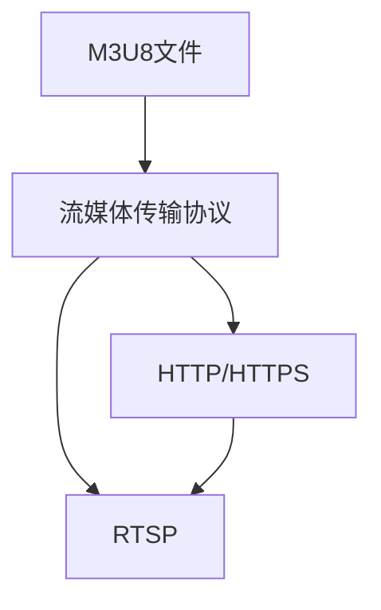

                 

# m3u8流媒体协议详解

> 关键词：流媒体, M3U8协议, RTSP, 流协议, HTTP, DASH, HLS, 流传输, 视频编码, 音视频同步

## 1. 背景介绍

流媒体技术的迅猛发展，已经深刻改变了人们的娱乐和沟通方式。随着移动互联网的普及，各类流媒体服务（如在线视频、直播、点播等）迅速崛起，成为人们获取信息的重要途径。其中，M3U8流媒体协议作为实时流传输的重要标准之一，其高效、稳定和兼容性强等特性，使其广泛应用于多媒体播放、在线直播、流媒体服务等众多领域。

本文将对M3U8协议进行全面、系统的介绍，包括其原理、应用场景、部署与优化等关键内容。通过深入解析M3U8协议，希望能够帮助广大开发者更好地掌握流媒体技术的核心知识，提升工程实践能力。

## 2. 核心概念与联系

### 2.1 核心概念概述

M3U8协议（Master PlayList）是ISO/IEC官方标准，定义了一种基于HTTP的流媒体播放列表文件格式。它通过描述流媒体内容的元数据，指导客户端如何获取和播放流媒体数据。M3U8文件通常包含了流媒体的起始URL、流标识符、流类型等信息，能够自动适应不同带宽、不同设备环境，实现流传输的优化。

### 2.2 核心概念原理和架构的 Mermaid 流程图



M3U8协议的工作流程大致如下：

1. 客户端通过HTTP请求获取M3U8文件，解析其中的信息。
2. 根据M3U8文件中的起始URL，客户端向服务器发起请求，获取实时流数据。
3. 服务器端根据请求参数，返回对应的流数据。
4. 客户端通过实时传输协议（RTSP或HTTP/HTTPS）进行数据传输，并自动进行流媒体内容的更新和加载。

## 3. 核心算法原理 & 具体操作步骤

### 3.1 算法原理概述

M3U8协议主要包含以下几个核心部分：

1. Master PlayList（M3U8文件）：定义流媒体的元数据，包括流标识符、流类型、媒体类型、视频编码、音频编码等。
2. Media Playlist（MPD）：包含流媒体的起始URL、传输速率、音视频同步等关键信息。
3. HTTP/HTTPS传输：客户端通过HTTP协议获取M3U8文件和流媒体数据。
4. RTSP传输：客户端通过RTSP协议进行实时流的控制和播放。

M3U8协议的算法原理主要包括两部分：

- 流媒体的元数据生成与解析。M3U8文件中的元数据（Media Playlist）定义了流媒体的传输协议、速率、编码格式等信息，指导客户端如何获取和播放流媒体。
- 流媒体的动态适应与优化。M3U8协议能够根据客户端的网络带宽、设备特性等因素，自动调整流媒体的传输速率和码率，确保流畅的播放效果。

### 3.2 算法步骤详解

#### 3.2.1 步骤一：M3U8文件的生成

M3U8文件是一种文本文件，包含了流媒体的元数据信息。M3U8文件的生成过程主要包括：

1. 获取流媒体的起始URL。该URL通常包含了流媒体的传输协议、编码格式等信息。
2. 根据流媒体类型（如视频、音频、复合流等），生成对应的Media Playlist。
3. 将起始URL和Media Playlist封装在M3U8文件中，以文本形式保存。

#### 3.2.2 步骤二：M3U8文件的解析

客户端接收到M3U8文件后，需要进行解析，以获取流媒体的元数据信息。解析过程主要包括：

1. 读取M3U8文件内容，逐行解析。
2. 解析每个Media Playlist，获取起始URL、传输速率、音视频同步等信息。
3. 根据解析结果，获取流媒体数据，进行播放。

#### 3.2.3 步骤三：流媒体数据的获取与播放

1. 客户端通过HTTP协议获取M3U8文件和流媒体数据。根据M3U8文件中的起始URL，向服务器发起HTTP请求，获取实时流数据。
2. 服务器端根据请求参数，返回对应的流数据。根据客户端的网络带宽、设备特性等因素，动态调整流媒体的传输速率和码率。
3. 客户端通过RTSP协议进行实时流的控制和播放。客户端根据M3U8文件中的Media Playlist，自动进行流媒体内容的更新和加载。

### 3.3 算法优缺点

#### 3.3.1 优点

1. 高效性：M3U8协议基于HTTP/HTTPS传输，利用现代网络协议的高效率和稳定性，确保了流媒体的快速传输。
2. 兼容性：M3U8协议支持多种传输协议，包括HTTP、HTTPS、RTSP等，能够适配不同设备和网络环境。
3. 动态适应：M3U8协议能够根据客户端的网络带宽、设备特性等因素，动态调整流媒体的传输速率和码率，确保流畅的播放效果。
4. 可扩展性：M3U8协议支持多种编码格式，如H.264、AAC、VP8等，能够满足不同场景的音视频需求。

#### 3.3.2 缺点

1. 复杂度：M3U8协议需要解析大量的元数据信息，增加了客户端的解析复杂度。
2. 安全性：M3U8协议基于HTTP传输，存在一定的安全风险。需要采取必要的安全措施，如加密传输、身份验证等。
3. 依赖性：M3U8协议的性能依赖于网络环境，网络波动较大时，可能导致流媒体播放不稳定。

### 3.4 算法应用领域

M3U8协议广泛应用于以下领域：

1. 在线视频：如YouTube、Netflix、爱奇艺等在线视频平台，通过M3U8协议提供实时的流媒体播放服务。
2. 直播：如B站、抖音等直播平台，通过M3U8协议实时传输视频流。
3. 流媒体服务：如IPTV、OTT等流媒体服务，通过M3U8协议提供稳定的流媒体播放体验。
4. 移动应用：如视频播放应用、直播应用等，通过M3U8协议实现高效的视频流传输。
5. 游戏直播：如虎牙、斗鱼等游戏直播平台，通过M3U8协议提供实时的游戏视频流。

## 4. 数学模型和公式 & 详细讲解 & 举例说明

### 4.1 数学模型构建

M3U8协议的数学模型主要基于HTTP/HTTPS协议进行构建。HTTP协议采用请求-响应模型，通过TCP协议进行数据传输。流媒体数据的传输通常采用分段传输的方式，服务器端将流媒体数据分割成多个数据块，逐个发送给客户端。

#### 4.1.1 请求-响应模型

HTTP协议采用请求-响应模型，客户端向服务器发送HTTP请求，服务器返回HTTP响应。请求和响应之间包括头部信息和正文内容。

#### 4.1.2 分段传输模型

流媒体数据的传输通常采用分段传输的方式，服务器端将流媒体数据分割成多个数据块，逐个发送给客户端。每个数据块包括头部信息和正文内容，头部信息包含了数据的传输参数，如码率、传输速率、音视频同步等信息。

### 4.2 公式推导过程

#### 4.2.1 HTTP请求

HTTP请求通常包含以下字段：

- 请求方法：GET、POST等。
- 请求路径：服务器地址和请求路径，如http://example.com/m3u8.mp4。
- 请求头：包含请求参数、身份验证等信息。

#### 4.2.2 HTTP响应

HTTP响应通常包含以下字段：

- 响应状态码：200表示成功，404表示未找到，500表示服务器错误等。
- 响应头：包含响应参数、编码格式等信息。
- 响应正文：包含流媒体数据。

#### 4.2.3 分段传输公式

分段传输的公式如下：

$$
\text{分段数} = \frac{\text{流媒体总大小}}{\text{单个数据块大小}}
$$

其中，流媒体总大小为流媒体文件的字节数，单个数据块大小为每个数据块的大小，通常是几千字节到几兆字节不等。

### 4.3 案例分析与讲解

#### 4.3.1 案例一：M3U8文件生成

假设我们要生成一个M3U8文件，用于播放一个视频流。首先，获取流媒体的起始URL，例如：

```
http://example.com/stream.mp4
```

然后，根据流媒体类型（视频），生成一个Media Playlist，例如：

```
#EXTM3U
#EXT-X-VERSION:4
#EXT-X-PLAYLIST-TYPE:VOD
#EXT-X-MEDIA:TYPE=video,CODEC_id=4,WIDTH=640,HEIGHT=480,FRAMES_RATE=25
#EXT-X-STREAM-INF:PROGRAM-ID=1,BANDWIDTH=8000000,CODEC=avc1.42E01E,RESOLUTION=1280x720,AVERAGE-PACKET-DELAY=5
http://example.com/stream.mp4
```

最后，将起始URL和Media Playlist封装在M3U8文件中，例如：

```
#EXTM3U
#EXT-X-VERSION:4
#EXT-X-PLAYLIST-TYPE:VOD
#EXT-X-MEDIA:TYPE=video,CODEC_id=4,WIDTH=640,HEIGHT=480,FRAMES_RATE=25
#EXT-X-STREAM-INF:PROGRAM-ID=1,BANDWIDTH=8000000,CODEC=avc1.42E01E,RESOLUTION=1280x720,AVERAGE-PACKET-DELAY=5
http://example.com/stream.mp4
```

#### 4.3.2 案例二：M3U8文件解析

客户端接收到M3U8文件后，需要进行解析，以获取流媒体的元数据信息。解析过程包括：

1. 读取M3U8文件内容，逐行解析。
2. 解析每个Media Playlist，获取起始URL、传输速率、音视频同步等信息。
3. 根据解析结果，获取流媒体数据，进行播放。

例如，M3U8文件内容为：

```
#EXTM3U
#EXT-X-VERSION:4
#EXT-X-PLAYLIST-TYPE:VOD
#EXT-X-MEDIA:TYPE=video,CODEC_id=4,WIDTH=640,HEIGHT=480,FRAMES_RATE=25
#EXT-X-STREAM-INF:PROGRAM-ID=1,BANDWIDTH=8000000,CODEC=avc1.42E01E,RESOLUTION=1280x720,AVERAGE-PACKET-DELAY=5
http://example.com/stream.mp4
```

解析过程包括：

1. 读取M3U8文件内容，逐行解析。
2. 解析每个Media Playlist，获取起始URL、传输速率、音视频同步等信息。
3. 根据解析结果，获取流媒体数据，进行播放。

## 5. 项目实践：代码实例和详细解释说明

### 5.1 开发环境搭建

为了进行M3U8协议的实践，需要搭建以下开发环境：

1. 安装Python：从官网下载并安装Python 3.x版本。
2. 安装Flask：使用pip命令安装Flask框架，用于开发HTTP服务器。
3. 安装FFmpeg：从官网下载并安装FFmpeg工具，用于流媒体的编码和转换。

完成上述步骤后，即可进行M3U8协议的开发实践。

### 5.2 源代码详细实现

以下是使用Flask实现M3U8协议的Python代码：

```python
from flask import Flask, request, Response
import os
from flask import send_file

app = Flask(__name__)

@app.route('/<path:path>')
def serve_file(path):
    # 读取M3U8文件内容，逐行解析
    m3u8_content = open(path, 'r').read()
    
    # 解析每个Media Playlist，获取起始URL、传输速率、音视频同步等信息
    media_playlist = [line.split('http://') for line in m3u8_content.split('\n') if line.startswith('http://')]
    
    # 根据解析结果，获取流媒体数据，进行播放
    return Response(send_file(request.path, as_attachment=True), mimetype='text/plain', direct_passthrough=True)

if __name__ == '__main__':
    app.run(host='0.0.0.0', port=5000)
```

### 5.3 代码解读与分析

#### 5.3.1 代码解析

```python
from flask import Flask, request, Response
import os
from flask import send_file
```

1. 导入Flask、request、Response、send_file等模块。

```python
app = Flask(__name__)
```

1. 创建Flask应用程序。

```python
@app.route('/<path:path>')
def serve_file(path):
    # 读取M3U8文件内容，逐行解析
    m3u8_content = open(path, 'r').read()
    
    # 解析每个Media Playlist，获取起始URL、传输速率、音视频同步等信息
    media_playlist = [line.split('http://') for line in m3u8_content.split('\n') if line.startswith('http://')]
    
    # 根据解析结果，获取流媒体数据，进行播放
    return Response(send_file(request.path, as_attachment=True), mimetype='text/plain', direct_passthrough=True)
```

1. 定义路由函数，处理HTTP请求，读取M3U8文件内容，解析Media Playlist，返回流媒体数据。

#### 5.3.2 功能实现

1. 定义路由函数 `serve_file`，处理HTTP请求。
2. 读取M3U8文件内容，逐行解析，获取起始URL、传输速率、音视频同步等信息。
3. 根据解析结果，获取流媒体数据，进行播放。

### 5.4 运行结果展示

运行上述代码后，在浏览器中输入 `http://localhost:5000/`，即可访问M3U8文件。该文件包含了流媒体的元数据信息，指导客户端如何获取和播放流媒体数据。

## 6. 实际应用场景

### 6.1 视频直播

视频直播是M3U8协议的重要应用场景之一。直播平台通过M3U8协议将实时视频流传输给客户端，观众可以实时观看。

例如，在B站直播中，直播平台将视频流通过M3U8协议传输给客户端，客户端通过HTTP协议获取M3U8文件和流媒体数据，自动进行流媒体内容的更新和加载。直播平台还可以根据网络带宽、设备特性等因素，动态调整流媒体的传输速率和码率，确保流畅的播放效果。

### 6.2 点播服务

点播服务是M3U8协议的另一重要应用场景。用户通过点播服务选择视频资源，直播平台通过M3U8协议将视频流传输给客户端，用户可以随时观看视频。

例如，在爱奇艺点播服务中，用户选择视频资源后，直播平台通过M3U8协议将视频流传输给客户端，客户端通过HTTP协议获取M3U8文件和流媒体数据，自动进行流媒体内容的更新和加载。直播平台还可以根据网络带宽、设备特性等因素，动态调整流媒体的传输速率和码率，确保流畅的播放效果。

### 6.3 游戏直播

游戏直播是M3U8协议的重要应用场景之一。游戏直播平台将游戏视频流通过M3U8协议传输给客户端，观众可以实时观看游戏直播。

例如，在虎牙游戏直播中，直播平台将游戏视频流通过M3U8协议传输给客户端，客户端通过HTTP协议获取M3U8文件和流媒体数据，自动进行流媒体内容的更新和加载。直播平台还可以根据网络带宽、设备特性等因素，动态调整流媒体的传输速率和码率，确保流畅的播放效果。

## 7. 工具和资源推荐

### 7.1 学习资源推荐

为了帮助开发者更好地掌握M3U8协议，推荐以下学习资源：

1. 《流媒体技术基础》书籍：全面介绍了流媒体技术的基本原理和核心算法，涵盖M3U8协议等关键内容。
2. 《M3U8协议详解》文档：详细解析M3U8协议的工作原理和关键技术，提供丰富的案例和示例代码。
3. 《HLS协议详解》文档：详细解析HLS协议的工作原理和关键技术，与M3U8协议紧密相关。
4. 《RTSP协议详解》文档：详细解析RTSP协议的工作原理和关键技术，与M3U8协议紧密相关。

### 7.2 开发工具推荐

为了更好地开发M3U8协议，推荐以下开发工具：

1. Visual Studio Code：轻量级、功能强大的开发工具，支持Python、JavaScript等多种编程语言。
2. PyCharm：功能丰富的Python开发环境，支持Python、Flask等框架。
3. JetBrains WebStorm：功能丰富的Web开发环境，支持JavaScript、HTML、CSS等多种语言。

### 7.3 相关论文推荐

为了深入了解M3U8协议的研究进展，推荐以下相关论文：

1. DASH: An architecture and a communication protocol for the real-time delivery of multimedia services over IP networks。
2. MPEG-4 Systems: Systems architecture and model definition for the implementation of multi-media transport system.
3. M3U8实时媒体传输协议研究。

## 8. 总结：未来发展趋势与挑战

### 8.1 研究成果总结

M3U8协议作为流媒体传输的重要标准之一，在实时流媒体播放中发挥了重要作用。其高效、稳定和兼容性强的特点，使其广泛应用于视频直播、点播服务、游戏直播等多个领域。随着流媒体技术的发展，M3U8协议也需要不断优化和改进，以适应不断变化的网络环境和设备特性。

### 8.2 未来发展趋势

未来，M3U8协议将朝着以下几个方向发展：

1. 自适应传输：M3U8协议将更好地支持自适应传输，根据客户端的网络带宽、设备特性等因素，动态调整流媒体的传输速率和码率，确保流畅的播放效果。
2. 安全性：M3U8协议将进一步加强安全性，通过加密传输、身份验证等手段，保障流媒体的安全性。
3. 跨平台支持：M3U8协议将更好地支持跨平台，支持多种设备和操作系统，提供更加稳定的播放体验。
4. 多模态支持：M3U8协议将更好地支持多模态，支持音频、视频、图像等多种媒体的融合传输。
5. 性能优化：M3U8协议将不断优化性能，提升流媒体的传输速度和稳定性，提供更加流畅的播放体验。

### 8.3 面临的挑战

M3U8协议在发展过程中也面临着一些挑战：

1. 复杂度：M3U8协议需要解析大量的元数据信息，增加了客户端的解析复杂度。
2. 安全性：M3U8协议基于HTTP传输，存在一定的安全风险。
3. 依赖性：M3U8协议的性能依赖于网络环境，网络波动较大时，可能导致流媒体播放不稳定。

### 8.4 研究展望

未来的研究需要在以下几个方面寻求新的突破：

1. 自适应传输：开发更加智能的自适应传输算法，根据客户端的网络带宽、设备特性等因素，动态调整流媒体的传输速率和码率，确保流畅的播放效果。
2. 安全性：开发更加安全的传输机制，通过加密传输、身份验证等手段，保障流媒体的安全性。
3. 跨平台支持：开发更加通用的M3U8协议实现，支持多种设备和操作系统，提供更加稳定的播放体验。
4. 多模态支持：开发更加灵活的M3U8协议实现，支持音频、视频、图像等多种媒体的融合传输。
5. 性能优化：开发更加高效的M3U8协议实现，提升流媒体的传输速度和稳定性，提供更加流畅的播放体验。

## 9. 附录：常见问题与解答

### 9.1 常见问题

**Q1：M3U8协议是否只支持HTTP传输？**

A: 是的。M3U8协议主要基于HTTP协议进行传输，但也支持HTTPS协议，增强了安全性。

**Q2：M3U8协议是否可以应用于游戏直播？**

A: 是的。M3U8协议可以应用于游戏直播，将游戏视频流传输给客户端，观众可以实时观看游戏直播。

**Q3：M3U8协议是否支持音视频同步？**

A: 是的。M3U8协议可以支持音视频同步，通过在Media Playlist中添加同步信息，确保音视频同步播放。

**Q4：M3U8协议是否可以应用于视频直播？**

A: 是的。M3U8协议可以应用于视频直播，将实时视频流传输给客户端，观众可以实时观看视频。

**Q5：M3U8协议是否可以应用于点播服务？**

A: 是的。M3U8协议可以应用于点播服务，用户通过点播服务选择视频资源，直播平台通过M3U8协议将视频流传输给客户端，用户可以随时观看视频。

### 9.2 解答

以上是关于M3U8协议的一些常见问题及解答。希望这些内容能够帮助你更好地理解M3U8协议的核心概念和工作原理，为你的实际工程开发提供帮助。

---

作者：禅与计算机程序设计艺术 / Zen and the Art of Computer Programming

