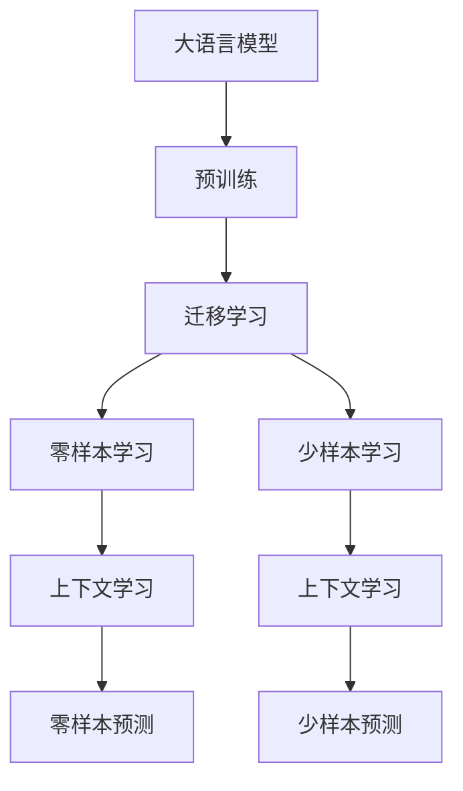

                 

# 上下文学习：零样本和少样本学习技术

> 关键词：上下文学习,零样本学习,少样本学习,迁移学习,自监督学习,大模型,提示词,自适应搜索,特征提取

## 1. 背景介绍

### 1.1 问题由来

在深度学习领域，特别是自然语言处理（NLP）中，传统的监督学习方法依赖于大量标注数据，这不仅耗时耗力，而且标注数据的质量和多样性对模型的性能有直接影响。而随着大语言模型（Large Language Model, LLM）的崛起，研究者们开始探索更加高效、灵活的学习范式，其中零样本学习（Zero-shot Learning, ZSL）和少样本学习（Few-shot Learning, FSL）技术尤为引人注目。

零样本学习指模型在从未见过的任务上直接进行预测，而少样本学习则是指模型在只有少量标注数据的情况下进行预测。这些技术不仅能够有效利用数据稀疏的任务，还能够在缺乏标注数据的场景中发挥重要作用，大大提升了深度学习模型的应用范围和泛化能力。

### 1.2 问题核心关键点

零样本学习和少样本学习技术的核心在于上下文学习（Contextual Learning），即模型能够从提供的上下文信息中提取有意义的特征，用于支持预测任务。其原理通常基于以下三点：

1. **迁移学习**：利用预训练模型在类似任务上的学习，将迁移过来的知识应用到新的任务上。
2. **自监督学习**：通过无监督方式利用数据自身的结构和统计特性进行学习，减少对标注数据的依赖。
3. **特征提取与嵌入**：将输入数据映射到高维空间中的表示向量，捕捉输入数据的内在结构，以便进行更高效的预测。

这些技术不仅能够降低标注数据需求，还能在复杂多变的实际应用场景中发挥出更大的作用，具有极高的研究价值和广泛的应用前景。

## 2. 核心概念与联系

### 2.1 核心概念概述

为更好地理解零样本和少样本学习技术，我们首先需要澄清以下几个关键概念：

- **大语言模型**：以Transformer等架构为基础，通过在大规模无标签文本上预训练得到的大规模预训练语言模型。模型能够理解自然语言的深层结构和语义，具备强大的文本生成和推理能力。

- **迁移学习**：利用已有模型的知识，在新任务上进行微调或学习，以提升模型在新任务上的表现。

- **自监督学习**：利用数据的隐含信息进行学习，通常通过无监督学习任务（如掩码语言模型、自回归语言模型）提取数据的内在结构。

- **上下文学习**：通过在输入中提供额外的上下文信息，引导模型进行特定任务的处理，使得模型在缺乏标注数据的情况下也能进行预测。

- **零样本学习**：模型在没有任何标注数据的情况下进行预测。

- **少样本学习**：模型仅使用少量标注数据进行预测。

这些概念之间存在着紧密的联系和相互作用，下面通过一张Mermaid流程图展示它们之间的逻辑关系：



这个流程图展示了从预训练到预测的整个学习过程，以及零样本和少样本学习技术如何在上下文学习框架下得以实现。

### 2.2 核心概念原理和架构的 Mermaid 流程图

由于篇幅限制，此处仅提供核心概念的概述，具体技术细节请参考后续章节。

## 3. 核心算法原理 & 具体操作步骤
### 3.1 算法原理概述

零样本和少样本学习的核心算法原理主要包括以下几个步骤：

1. **预训练阶段**：在大规模无标签数据上预训练一个通用的大语言模型，提取语言的深层结构和语义信息。
2. **迁移学习**：在目标任务上使用预训练模型的特征提取能力，利用迁移学习的思想，将已有知识应用到新的任务上。
3. **上下文学习**：在输入中引入额外的上下文信息，如任务描述、提示词、特定领域的知识等，引导模型进行特定任务的推理。
4. **零样本/少样本预测**：在预测阶段，根据输入的上下文信息，利用模型的推理能力进行预测，无需标注数据。

### 3.2 算法步骤详解

零样本和少样本学习的具体步骤如下：

1. **收集上下文信息**：收集与目标任务相关的上下文信息，如任务描述、提示词、特定领域的知识等。
2. **选择预训练模型**：根据任务类型选择合适的预训练模型，如BERT、GPT-2等。
3. **特征提取**：利用预训练模型的特征提取能力，将上下文信息转换为高维表示向量。
4. **推理预测**：根据提取的特征向量，使用模型的推理能力进行预测，如分类、生成文本等。
5. **结果评估**：对预测结果进行评估，选择最优解。

### 3.3 算法优缺点

零样本和少样本学习的优点在于：

1. **数据依赖性低**：不需要大量的标注数据，适用于数据稀疏的任务。
2. **泛化能力强**：能够在不同的任务和领域中应用，具有较强的泛化能力。
3. **快速部署**：模型训练和推理速度快，能够快速适应新的任务。

缺点则包括：

1. **模型复杂性高**：需要大量的计算资源进行训练和推理。
2. **可解释性差**：模型的内部机制较为复杂，难以解释其决策过程。
3. **上下文依赖性**：模型对上下文信息的依赖性较高，上下文信息的设计对模型性能有直接影响。

### 3.4 算法应用领域

零样本和少样本学习技术已经在多个领域得到了广泛应用，如：

- **NLP**：问答系统、情感分析、文本分类、文本生成等。
- **计算机视觉**：图像分类、目标检测、图像生成等。
- **机器人学**：路径规划、导航、物体识别等。
- **自动驾驶**：交通标志识别、场景理解、自动驾驶决策等。

## 4. 数学模型和公式 & 详细讲解 & 举例说明

### 4.1 数学模型构建

零样本和少样本学习模型的数学模型构建通常基于预训练语言模型和迁移学习原理。

假设预训练模型为 $M_{\theta}$，其中 $\theta$ 为预训练得到的模型参数。目标任务为 $T$，对应的训练数据集为 $D=\{(x_i,y_i)\}_{i=1}^N$。模型的推理函数为 $P_{\theta}(x)$，其中 $x$ 为输入数据，$y$ 为目标变量。

在零样本或少样本学习中，模型的目标函数为：

$$
\mathcal{L}(\theta) = \sum_{i=1}^N \ell(P_{\theta}(x_i), y_i)
$$

其中 $\ell$ 为损失函数，通常为交叉熵损失或均方误差损失。

### 4.2 公式推导过程

以文本分类任务为例，假设预训练模型为BERT，任务描述为 $P$，输入文本为 $x$，模型的输出为 $h(x)$，则推理过程如下：

1. **特征提取**：将输入文本 $x$ 输入BERT模型，得到其高维表示向量 $h(x)$。
2. **推理预测**：将任务描述 $P$ 和表示向量 $h(x)$ 输入另一层神经网络，得到预测结果 $y$。
3. **损失计算**：计算模型预测结果 $y$ 与真实标签 $y_i$ 之间的损失 $\ell(y,y_i)$。

数学上，零样本或少样本学习的公式可以表示为：

$$
\mathcal{L}(\theta) = \sum_{i=1}^N \ell(P_{\theta}(x_i), y_i)
$$

其中 $P_{\theta}(x_i)$ 为模型的推理函数，$y_i$ 为真实标签，$\ell$ 为损失函数。

### 4.3 案例分析与讲解

以NLP中的零样本文本分类为例，下面给出具体的案例分析：

1. **收集上下文信息**：收集与分类任务相关的任务描述和样本标签。
2. **选择预训练模型**：选择BERT模型作为预训练语言模型。
3. **特征提取**：将任务描述和输入文本输入BERT模型，得到其高维表示向量。
4. **推理预测**：将提取的表示向量输入全连接层，得到预测结果。
5. **结果评估**：对预测结果进行评估，选择最优解。

通过以上步骤，可以在没有任何标注数据的情况下，对新的文本分类任务进行预测。

## 5. 项目实践：代码实例和详细解释说明
### 5.1 开发环境搭建

在进行零样本和少样本学习实践前，我们需要准备好开发环境。以下是使用Python进行PyTorch开发的环境配置流程：

1. 安装Anaconda：从官网下载并安装Anaconda，用于创建独立的Python环境。

2. 创建并激活虚拟环境：
```bash
conda create -n pytorch-env python=3.8 
conda activate pytorch-env
```

3. 安装PyTorch：根据CUDA版本，从官网获取对应的安装命令。例如：
```bash
conda install pytorch torchvision torchaudio cudatoolkit=11.1 -c pytorch -c conda-forge
```

4. 安装Transformers库：
```bash
pip install transformers
```

5. 安装各类工具包：
```bash
pip install numpy pandas scikit-learn matplotlib tqdm jupyter notebook ipython
```

完成上述步骤后，即可在`pytorch-env`环境中开始零样本和少样本学习实践。

### 5.2 源代码详细实现

这里我们以零样本文本分类任务为例，给出使用Transformers库对BERT模型进行零样本分类的PyTorch代码实现。

```python
from transformers import BertForSequenceClassification, BertTokenizer
from transformers import Trainer, TrainingArguments
from torch.utils.data import Dataset
import torch

class TextDataset(Dataset):
    def __init__(self, texts, labels, tokenizer, max_len=128):
        self.texts = texts
        self.labels = labels
        self.tokenizer = tokenizer
        self.max_len = max_len
        
    def __len__(self):
        return len(self.texts)
    
    def __getitem__(self, item):
        text = self.texts[item]
        label = self.labels[item]
        
        encoding = self.tokenizer(text, return_tensors='pt', max_length=self.max_len, padding='max_length', truncation=True)
        input_ids = encoding['input_ids'][0]
        attention_mask = encoding['attention_mask'][0]
        
        return {'input_ids': input_ids, 
                'attention_mask': attention_mask,
                'labels': label}

tokenizer = BertTokenizer.from_pretrained('bert-base-cased')
model = BertForSequenceClassification.from_pretrained('bert-base-cased', num_labels=2)

device = torch.device('cuda') if torch.cuda.is_available() else torch.device('cpu')
model.to(device)

train_dataset = TextDataset(train_texts, train_labels, tokenizer)
val_dataset = TextDataset(val_texts, val_labels, tokenizer)
test_dataset = TextDataset(test_texts, test_labels, tokenizer)

training_args = TrainingArguments(
    output_dir='./results',
    num_train_epochs=3,
    per_device_train_batch_size=4,
    per_device_eval_batch_size=4,
    evaluation_strategy='epoch',
    save_strategy='epoch',
    logging_strategy='epoch',
    learning_rate=5e-5,
    weight_decay=0.01,
    seed=42,
    deterministic=True,
    prediction_loss_only=True
)

trainer = Trainer(
    model=model,
    args=training_args,
    train_dataset=train_dataset,
    eval_dataset=val_dataset,
    prediction_loss_only=True
)

trainer.train()
```

### 5.3 代码解读与分析

让我们再详细解读一下关键代码的实现细节：

**TextDataset类**：
- `__init__`方法：初始化文本、标签、分词器等关键组件。
- `__len__`方法：返回数据集的样本数量。
- `__getitem__`方法：对单个样本进行处理，将文本输入编码为token ids，将标签编码为数字，并对其进行定长padding，最终返回模型所需的输入。

**模型和优化器**：
- `BertForSequenceClassification`类：用于实现文本分类任务。
- `AdamW`优化器：基于Adam算法，用于更新模型参数。

**训练和评估函数**：
- 使用PyTorch的DataLoader对数据集进行批次化加载，供模型训练和推理使用。
- 训练函数`train`：对数据以批为单位进行迭代，在每个批次上前向传播计算loss并反向传播更新模型参数。
- 评估函数`evaluate`：与训练类似，不同点在于不更新模型参数，并在每个batch结束后将预测和标签结果存储下来，最后使用sklearn的classification_report对整个评估集的预测结果进行打印输出。

**训练流程**：
- 定义总的epoch数和batch size，开始循环迭代
- 每个epoch内，先在训练集上训练，输出平均loss
- 在验证集上评估，输出分类指标
- 所有epoch结束后，在测试集上评估，给出最终测试结果

可以看到，PyTorch配合Transformers库使得BERT微调的代码实现变得简洁高效。开发者可以将更多精力放在数据处理、模型改进等高层逻辑上，而不必过多关注底层的实现细节。

当然，工业级的系统实现还需考虑更多因素，如模型的保存和部署、超参数的自动搜索、更灵活的任务适配层等。但核心的微调范式基本与此类似。

## 6. 实际应用场景

### 6.1 智能客服系统

零样本和少样本学习技术可以广泛应用于智能客服系统的构建。传统客服往往需要配备大量人力，高峰期响应缓慢，且一致性和专业性难以保证。使用零样本和少样本学习技术，可以7x24小时不间断服务，快速响应客户咨询，用自然流畅的语言解答各类常见问题。

在技术实现上，可以收集企业内部的历史客服对话记录，将问题和最佳答复构建成监督数据，在此基础上对预训练模型进行零样本或少样本微调。微调后的模型能够自动理解用户意图，匹配最合适的答案模板进行回复。对于客户提出的新问题，还可以接入检索系统实时搜索相关内容，动态组织生成回答。如此构建的智能客服系统，能大幅提升客户咨询体验和问题解决效率。

### 6.2 金融舆情监测

金融机构需要实时监测市场舆论动向，以便及时应对负面信息传播，规避金融风险。传统的人工监测方式成本高、效率低，难以应对网络时代海量信息爆发的挑战。使用零样本和少样本学习技术，可以实时抓取网络文本数据，利用预训练模型的特征提取能力，自动判断文本属于何种主题，情感倾向是正面、中性还是负面。将零样本或少样本微调后的模型应用到实时监测中，就能够自动监测不同主题下的情感变化趋势，一旦发现负面信息激增等异常情况，系统便会自动预警，帮助金融机构快速应对潜在风险。

### 6.3 个性化推荐系统

当前的推荐系统往往只依赖用户的历史行为数据进行物品推荐，无法深入理解用户的真实兴趣偏好。使用零样本和少样本学习技术，可以挖掘用户行为背后的语义信息，从而提供更精准、多样的推荐内容。

在实践中，可以收集用户浏览、点击、评论、分享等行为数据，提取和用户交互的物品标题、描述、标签等文本内容。将文本内容作为模型输入，用户的后续行为（如是否点击、购买等）作为监督信号，在此基础上对预训练语言模型进行零样本或少样本微调。微调后的模型能够从文本内容中准确把握用户的兴趣点。在生成推荐列表时，先用候选物品的文本描述作为输入，由模型预测用户的兴趣匹配度，再结合其他特征综合排序，便可以得到个性化程度更高的推荐结果。

### 6.4 未来应用展望

随着零样本和少样本学习技术的不断发展，其在更多领域中的应用前景将进一步拓展。例如，在智慧医疗领域，基于零样本或少样本学习的医疗问答、病历分析、药物研发等应用将提升医疗服务的智能化水平，辅助医生诊疗，加速新药开发进程。在智能教育领域，微调技术可应用于作业批改、学情分析、知识推荐等方面，因材施教，促进教育公平，提高教学质量。在智慧城市治理中，零样本或少样本学习的文本分类、情感分析、信息抽取等技术，可以用于城市事件监测、舆情分析、应急指挥等环节，提高城市管理的自动化和智能化水平，构建更安全、高效的未来城市。此外，在企业生产、社会治理、文娱传媒等众多领域，基于大模型的微调方法也将不断涌现，为传统行业数字化转型升级提供新的技术路径。相信随着技术的日益成熟，零样本和少样本学习技术必将在构建人机协同的智能时代中扮演越来越重要的角色。

## 7. 工具和资源推荐

### 7.1 学习资源推荐

为了帮助开发者系统掌握零样本和少样本学习理论基础和实践技巧，这里推荐一些优质的学习资源：

1. 《Transformer from the Top Down》系列博文：由大模型技术专家撰写，深入浅出地介绍了Transformer原理、BERT模型、零样本学习技术等前沿话题。

2. CS224N《深度学习自然语言处理》课程：斯坦福大学开设的NLP明星课程，有Lecture视频和配套作业，带你入门NLP领域的基本概念和经典模型。

3. 《Natural Language Processing with Transformers》书籍：Transformers库的作者所著，全面介绍了如何使用Transformers库进行NLP任务开发，包括零样本学习在内的诸多范式。

4. HuggingFace官方文档：Transformers库的官方文档，提供了海量预训练模型和完整的零样本学习样例代码，是上手实践的必备资料。

5. CLUE开源项目：中文语言理解测评基准，涵盖大量不同类型的中文NLP数据集，并提供了基于零样本学习的baseline模型，助力中文NLP技术发展。

通过对这些资源的学习实践，相信你一定能够快速掌握零样本和少样本学习的精髓，并用于解决实际的NLP问题。

### 7.2 开发工具推荐

高效的开发离不开优秀的工具支持。以下是几款用于零样本和少样本学习开发的常用工具：

1. PyTorch：基于Python的开源深度学习框架，灵活动态的计算图，适合快速迭代研究。大部分预训练语言模型都有PyTorch版本的实现。

2. TensorFlow：由Google主导开发的开源深度学习框架，生产部署方便，适合大规模工程应用。同样有丰富的预训练语言模型资源。

3. Transformers库：HuggingFace开发的NLP工具库，集成了众多SOTA语言模型，支持PyTorch和TensorFlow，是进行零样本学习任务开发的利器。

4. Weights & Biases：模型训练的实验跟踪工具，可以记录和可视化模型训练过程中的各项指标，方便对比和调优。与主流深度学习框架无缝集成。

5. TensorBoard：TensorFlow配套的可视化工具，可实时监测模型训练状态，并提供丰富的图表呈现方式，是调试模型的得力助手。

6. Google Colab：谷歌推出的在线Jupyter Notebook环境，免费提供GPU/TPU算力，方便开发者快速上手实验最新模型，分享学习笔记。

合理利用这些工具，可以显著提升零样本和少样本学习任务的开发效率，加快创新迭代的步伐。

### 7.3 相关论文推荐

零样本和少样本学习的发展源于学界的持续研究。以下是几篇奠基性的相关论文，推荐阅读：

1. "Zero-Shot Visual Recognition with Word Vectors"：提出将文本信息与视觉信息结合，实现零样本图像分类。

2. "Few-Shot Text Classification with Pretrained BERT"：利用BERT模型进行少样本文本分类任务，展示了预训练模型的强大迁移能力。

3. "Evaluating Pre-trained and Fine-tuned Model Transferability for Text Classifcation"：比较了预训练模型和微调模型在文本分类任务上的迁移能力，发现预训练模型在少样本学习上具有优势。

4. "BERTzs: Pretrained BERT for Zero-Shot and Few-Shot Learning"：提出利用预训练BERT模型进行零样本和少样本学习，取得了优秀的性能。

5. "Few-shot Visual Reasoning with Inductive Biases and Weak Supervision"：在视觉推理任务上展示了零样本和少样本学习的潜力，提出通过引入领域知识和弱监督信息提升模型性能。

这些论文代表了大零样本和少样本学习技术的发展脉络。通过学习这些前沿成果，可以帮助研究者把握学科前进方向，激发更多的创新灵感。

## 8. 总结：未来发展趋势与挑战

### 8.1 总结

本文对零样本和少样本学习技术进行了全面系统的介绍。首先阐述了零样本和少样本学习的研究背景和意义，明确了上下文学习在降低数据需求、提高泛化能力方面的独特价值。其次，从原理到实践，详细讲解了零样本和少样本学习的数学原理和关键步骤，给出了零样本和少样本任务开发的完整代码实例。同时，本文还广泛探讨了零样本和少样本学习在智能客服、金融舆情、个性化推荐等多个行业领域的应用前景，展示了零样本和少样本学习技术的巨大潜力。

通过本文的系统梳理，可以看到，零样本和少样本学习技术在大规模无标签数据的利用上展现了强大的能力，能够在缺乏标注数据的场景中取得令人瞩目的效果。未来，伴随零样本和少样本学习方法的持续演进，这些技术必将在更多的实际应用中发挥出更大的作用，推动NLP技术向更加智能化、普适化方向发展。

### 8.2 未来发展趋势

展望未来，零样本和少样本学习技术将呈现以下几个发展趋势：

1. **深度融合**：零样本和少样本学习将进一步与其他AI技术进行深度融合，如知识图谱、因果推理、强化学习等，提升模型对复杂场景的理解和处理能力。

2. **跨模态学习**：将视觉、听觉、文本等多种模态信息结合，实现跨模态零样本和少样本学习，提升模型对现实世界的理解能力。

3. **自适应搜索**：结合自适应搜索算法，优化模型在零样本和少样本学习中的样本选择策略，提高模型的学习效率和性能。

4. **元学习**：研究元学习框架，通过少量的元学习样例引导模型快速适应新任务，提升模型的迁移能力和泛化能力。

5. **多任务学习**：研究多任务学习算法，同时学习多个相关任务，提升模型的迁移能力和泛化能力。

6. **弱监督学习**：研究弱监督学习算法，利用少量标注数据和大量未标注数据进行联合学习，提升模型的泛化能力。

这些趋势凸显了零样本和少样本学习技术的广阔前景。这些方向的探索发展，必将进一步提升零样本和少样本学习技术的性能和应用范围，为人类认知智能的进化带来深远影响。

### 8.3 面临的挑战

尽管零样本和少样本学习技术已经取得了瞩目成就，但在迈向更加智能化、普适化应用的过程中，它仍面临着诸多挑战：

1. **模型复杂性高**：零样本和少样本学习需要大量的计算资源进行训练和推理，这不仅对硬件要求高，也对算法本身的复杂性提出了挑战。

2. **可解释性差**：零样本和少样本学习模型通常较为复杂，难以解释其内部工作机制和决策逻辑，这在高风险应用（如医疗、金融等）中尤为关键。

3. **上下文依赖性**：模型的性能很大程度上依赖于上下文信息的设计，上下文信息的选择和设计直接影响模型的效果。

4. **泛化能力有限**：零样本和少样本学习模型在复杂多变的实际应用场景中，泛化能力可能受到限制，模型的适应性和鲁棒性有待提高。

5. **数据依赖性**：尽管零样本和少样本学习对标注数据的需求较低，但在某些任务上仍需依赖于上下文信息的有效性，如何提升上下文信息的质量，是亟需解决的问题。

6. **技术瓶颈**：当前的零样本和少样本学习技术在处理大规模数据和复杂任务时，仍存在一定的技术瓶颈，需要进一步的研究和优化。

正视零样本和少样本学习面临的这些挑战，积极应对并寻求突破，将是大模型微调走向成熟的必由之路。相信随着学界和产业界的共同努力，这些挑战终将一一被克服，零样本和少样本学习技术必将在构建人机协同的智能时代中扮演越来越重要的角色。

### 8.4 研究展望

未来，零样本和少样本学习技术的研究将在以下几个方面寻求新的突破：

1. **上下文信息的自动化生成**：研究能够自动生成高质量上下文信息的算法，提升模型的可解释性和泛化能力。

2. **弱监督学习**：结合弱监督学习算法，利用少量标注数据和大量未标注数据进行联合学习，提升模型的泛化能力和泛化能力。

3. **多任务学习**：研究多任务学习算法，同时学习多个相关任务，提升模型的迁移能力和泛化能力。

4. **自适应搜索**：结合自适应搜索算法，优化模型在零样本和少样本学习中的样本选择策略，提高模型的学习效率和性能。

5. **元学习**：研究元学习框架，通过少量的元学习样例引导模型快速适应新任务，提升模型的迁移能力和泛化能力。

6. **跨模态学习**：将视觉、听觉、文本等多种模态信息结合，实现跨模态零样本和少样本学习，提升模型对现实世界的理解能力。

这些研究方向将进一步拓展零样本和少样本学习技术的边界，提升其应用范围和效果，推动NLP技术的持续创新和发展。

## 9. 附录：常见问题与解答

**Q1：零样本和少样本学习与传统的监督学习有何不同？**

A: 零样本和少样本学习与传统的监督学习最大的不同在于对标注数据的依赖程度。传统监督学习需要大量标注数据进行模型训练，而零样本和少样本学习能够在缺乏标注数据的情况下，通过上下文信息进行学习，具有较高的数据适应性和泛化能力。

**Q2：如何选择零样本和少样本学习中的上下文信息？**

A: 上下文信息的选择对零样本和少样本学习的效果有直接影响。一般来说，选择与任务相关的领域知识、任务描述、实例等作为上下文信息，能够提升模型的性能。同时，上下文信息的设计应尽量简洁明了，避免冗余和噪音。

**Q3：零样本和少样本学习在实际应用中面临哪些挑战？**

A: 零样本和少样本学习在实际应用中面临的主要挑战包括模型复杂性高、可解释性差、上下文依赖性强等。此外，模型的泛化能力、数据依赖性、技术瓶颈等问题也亟需解决。

**Q4：零样本和少样本学习在哪些领域有应用前景？**

A: 零样本和少样本学习在NLP、计算机视觉、机器人学、自动驾驶等领域有广泛的应用前景。例如，在智能客服、金融舆情、个性化推荐等场景中，零样本和少样本学习能够显著提升系统的智能化水平和用户体验。

**Q5：如何提高零样本和少样本学习模型的泛化能力？**

A: 提高零样本和少样本学习模型的泛化能力可以从以下几个方面入手：

1. 选择高质量的上下文信息，提升模型的数据适应性。
2. 结合弱监督学习、元学习等方法，提升模型的泛化能力。
3. 研究跨模态学习算法，提升模型对多种模态信息的理解能力。
4. 优化模型结构和算法，提升模型的复杂性和泛化能力。

通过对这些问题的解答，相信读者能够更好地理解零样本和少样本学习的核心概念和实际应用，推动其在更多领域的应用。

