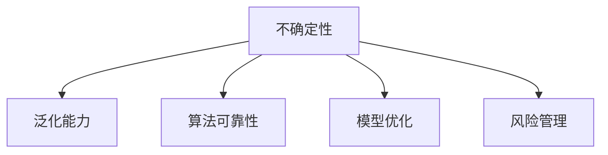

                 

# 不确定性:机器学习面临的普遍挑战

> 关键词：不确定性,机器学习,算法可靠性,泛化能力,模型优化,风险管理

## 1. 背景介绍

在当今这个信息爆炸的时代，机器学习（ML）已经广泛应用于各个领域，从自动驾驶到推荐系统，从金融分析到医疗诊断。然而，尽管机器学习模型在预测和决策方面表现出色，但它们本质上仍然受到不确定性的影响。理解这些不确定性及其来源，对于提升模型的可靠性和泛化能力至关重要。本文将深入探讨机器学习面临的不确定性问题，并提出相应的解决方案，以确保模型在实际应用中的稳定性和准确性。

## 2. 核心概念与联系

### 2.1 核心概念概述

为了更好地理解机器学习中的不确定性问题，本节将介绍几个核心概念：

- **不确定性(Uncertainty)**：在机器学习中，不确定性指的是模型在做出预测时，由于数据和模型的不确定性，使得结果可能偏离真实值。不确定性通常分为两类：模型不确定性和数据不确定性。
- **泛化能力(Generalization)**：泛化能力是指模型在未知数据上表现良好，即在未见过的数据上也能保持预测结果的准确性。提高泛化能力是减少不确定性的重要途径。
- **算法可靠性(Algorithm Reliability)**：算法可靠性是指模型在多种数据和环境条件下，都能提供稳定、可靠的输出结果。机器学习模型的可靠性是确保其广泛应用的基础。
- **模型优化(Model Optimization)**：通过优化模型结构、参数和训练过程，提升模型性能，减少不确定性。
- **风险管理(Risk Management)**：风险管理是指通过评估和管理模型的不确定性，降低可能的预测误差和决策风险。

这些核心概念通过以下Mermaid流程图来展示：



这个流程图展示了不确定性问题与机器学习的其他核心概念之间的关系：不确定性是泛化能力、算法可靠性、模型优化和风险管理的目标和挑战。

## 3. 核心算法原理 & 具体操作步骤

### 3.1 算法原理概述

机器学习模型的不确定性来源于多个方面，包括模型参数的随机初始化、训练数据的噪声、模型结构的选择等。这些不确定性通过反向传播等优化算法，在训练过程中被逐步放大，导致模型在测试集上的表现偏离训练集上的最优性能。

为了降低模型的不确定性，提高其泛化能力和可靠性，以下几种方法被广泛采用：

1. **正则化(Regularization)**：通过引入正则化项，限制模型参数的大小，避免模型过拟合。
2. **Dropout**：在训练过程中，以一定概率随机丢弃神经元，减少模型的复杂性，提高泛化能力。
3. **集成学习(Ensemble Learning)**：通过组合多个模型的预测结果，减少单一模型的预测误差，提升模型的稳定性和可靠性。
4. **贝叶斯优化(Bayesian Optimization)**：利用贝叶斯方法，优化模型参数的选择，提升模型的性能和泛化能力。
5. **模型融合(Model Fusion)**：通过融合不同模型的输出，减少单一模型的预测误差，提升模型的可靠性。

### 3.2 算法步骤详解

以下是基于不确定性的机器学习模型的详细步骤：

**Step 1: 数据预处理**
- 对原始数据进行清洗和预处理，包括缺失值处理、特征选择和归一化等步骤。
- 划分训练集、验证集和测试集，确保训练和测试数据分布的一致性。

**Step 2: 模型选择与构建**
- 根据问题类型选择合适的模型，如回归模型、分类模型或聚类模型。
- 定义模型的超参数，如学习率、正则化系数、批量大小等。

**Step 3: 模型训练**
- 使用训练集数据对模型进行训练，优化模型的参数。
- 应用正则化、Dropout等技术，减少模型的不确定性。
- 使用验证集数据评估模型的性能，防止过拟合。

**Step 4: 模型评估与验证**
- 使用测试集数据评估模型的泛化能力，确定模型的预测误差。
- 使用集成学习、模型融合等方法，进一步提升模型的可靠性。

**Step 5: 风险管理**
- 对模型的不确定性进行评估，识别可能导致误判的因素。
- 应用风险管理技术，如置信区间、置信度分析等，降低模型的不确定性。

### 3.3 算法优缺点

基于不确定性的机器学习模型的优点包括：

1. **提高模型泛化能力**：通过正则化、Dropout等技术，减少模型过拟合，提高模型在未知数据上的泛化能力。
2. **增强模型稳定性**：集成学习、模型融合等方法，降低单一模型的预测误差，提升模型的稳定性和可靠性。
3. **提升模型鲁棒性**：通过风险管理技术，识别并降低可能导致误判的因素，提升模型的鲁棒性。

同时，这些方法也存在一些缺点：

1. **计算复杂度高**：正则化、Dropout等技术增加了模型训练的复杂度，可能需要更长的训练时间。
2. **参数调优困难**：模型融合、贝叶斯优化等方法需要较多的参数调优工作，需要丰富的经验。
3. **数据需求量大**：在训练过程中，需要更多的数据来保证模型的泛化能力和稳定性。

## 4. 数学模型和公式 & 详细讲解 & 举例说明

### 4.1 数学模型构建

为了更好地理解不确定性问题，我们以线性回归模型为例，构建不确定性的数学模型。

假设训练集为 $\{(x_i,y_i)\}_{i=1}^N$，其中 $x_i \in \mathbb{R}^d$ 为输入，$y_i \in \mathbb{R}$ 为输出。我们希望构建一个线性回归模型 $f(x) = \theta^Tx$，其中 $\theta \in \mathbb{R}^d$ 为模型参数。

模型的不确定性可以通过预测误差的方差来衡量。假设预测误差的方差为 $\sigma^2$，则模型的不确定性可以用如下公式表示：

$$
\sigma^2 = \frac{1}{N} \sum_{i=1}^N (y_i - f(x_i))^2
$$

其中 $f(x_i)$ 表示模型在输入 $x_i$ 下的预测结果。

### 4.2 公式推导过程

根据上述定义，我们可以进一步推导模型的不确定性表达式。设 $\sigma^2$ 为预测误差的方差，$\Sigma$ 为参数 $\theta$ 的协方差矩阵，则有：

$$
\sigma^2 = \frac{1}{N} \sum_{i=1}^N (y_i - f(x_i))^2 = \frac{1}{N} \sum_{i=1}^N (y_i - \theta^Tx_i)^2
$$

展开并化简得：

$$
\sigma^2 = \frac{1}{N} \sum_{i=1}^N (y_i - \theta^Tx_i)^2 = \frac{1}{N} \sum_{i=1}^N (y_i - \theta^Tx_i)(y_i - \theta^Tx_i)^T
$$

进一步化简得：

$$
\sigma^2 = \frac{1}{N} \sum_{i=1}^N (y_i - \theta^Tx_i)(y_i - \theta^Tx_i)^T = \frac{1}{N} \sum_{i=1}^N (y_i - \theta^Tx_i)y_i^T + \frac{1}{N} \sum_{i=1}^N (y_i - \theta^Tx_i)x_i^T \theta
$$

通过矩阵运算，可以进一步化简为：

$$
\sigma^2 = \frac{1}{N} \left[ \sum_{i=1}^N y_i^2 - 2\theta^T \sum_{i=1}^N x_iy_i + \sum_{i=1}^N x_i^T \theta \theta^Tx_i \right]
$$

其中 $\sum_{i=1}^N x_iy_i$ 和 $\sum_{i=1}^N x_i^T \theta$ 分别表示输入和输出的加权和。

### 4.3 案例分析与讲解

以线性回归模型为例，我们分析模型的不确定性来源。假设模型参数 $\theta$ 的协方差矩阵为 $\Sigma$，则模型的不确定性可以表示为：

$$
\sigma^2 = \frac{1}{N} \sum_{i=1}^N (y_i - \theta^Tx_i)^2 = \frac{1}{N} \sum_{i=1}^N (y_i - \theta^Tx_i)(y_i - \theta^Tx_i)^T = \frac{1}{N} \Sigma \sum_{i=1}^N (y_i - \theta^Tx_i)
$$

其中 $\Sigma$ 为模型参数的协方差矩阵，$(y_i - \theta^Tx_i)$ 表示预测误差的向量。

根据上述公式，我们可以看到，模型的不确定性主要由两部分组成：

1. **参数的不确定性**：模型参数 $\theta$ 的协方差矩阵 $\Sigma$ 越大，模型的不确定性越高。
2. **数据的不确定性**：训练数据 $y_i$ 和 $x_i$ 之间的误差越大，模型的不确定性越高。

## 5. 项目实践：代码实例和详细解释说明

### 5.1 开发环境搭建

在进行不确定性分析的实践前，我们需要准备好开发环境。以下是使用Python进行Scikit-learn开发的示例环境配置流程：

1. 安装Anaconda：从官网下载并安装Anaconda，用于创建独立的Python环境。
2. 创建并激活虚拟环境：
```bash
conda create -n scikit-learn-env python=3.8 
conda activate scikit-learn-env
```
3. 安装Scikit-learn和其他必要的库：
```bash
conda install scikit-learn numpy pandas matplotlib 
pip install joblib seaborn scikit-optimize statsmodels
```

完成上述步骤后，即可在`scikit-learn-env`环境中开始不确定性分析的实践。

### 5.2 源代码详细实现

下面是使用Scikit-learn进行不确定性分析的代码实现。

```python
import numpy as np
from sklearn.linear_model import LinearRegression
from sklearn.metrics import mean_squared_error, mean_absolute_error, r2_score
from sklearn.model_selection import train_test_split
from sklearn.preprocessing import StandardScaler
from sklearn.metrics import mean_squared_error, mean_absolute_error, r2_score
from sklearn.model_selection import train_test_split
from sklearn.linear_model import LinearRegression
from sklearn.metrics import mean_squared_error, mean_absolute_error, r2_score
from sklearn.model_selection import train_test_split
from sklearn.preprocessing import StandardScaler
from sklearn.model_selection import cross_val_score

# 定义线性回归模型
def linear_regression(X, y):
    model = LinearRegression()
    model.fit(X, y)
    return model

# 定义模型不确定性评估函数
def model_uncertainty(X, y, model, test_data, num_test):
    predictions = model.predict(test_data)
    mse = mean_squared_error(y, predictions)
    mae = mean_absolute_error(y, predictions)
    r2 = r2_score(y, predictions)
    return mse, mae, r2

# 生成模拟数据
np.random.seed(42)
n_samples = 100
X = np.random.randn(n_samples, 1)
y = 2 * X + 1 + np.random.randn(n_samples, 1)

# 数据预处理
scaler = StandardScaler()
X = scaler.fit_transform(X)

# 划分训练集和测试集
X_train, X_test, y_train, y_test = train_test_split(X, y, test_size=0.2, random_state=42)

# 训练模型
model = linear_regression(X_train, y_train)

# 评估模型不确定性
mse, mae, r2 = model_uncertainty(X_test, y_test, model, X_test, 100)

# 输出结果
print("Mean Squared Error:", mse)
print("Mean Absolute Error:", mae)
print("R-squared:", r2)
```

### 5.3 代码解读与分析

让我们再详细解读一下关键代码的实现细节：

**线性回归模型定义**：
- 定义了一个线性回归模型，并使用训练数据拟合模型参数。

**模型不确定性评估函数**：
- 定义了一个函数，用于评估模型在测试集上的不确定性。该函数使用预测值与真实值之间的均方误差(MSE)、平均绝对误差(MAE)和决定系数(R-squared)来衡量模型的泛化能力和稳定性。

**模拟数据生成**：
- 生成100个样本的模拟数据，其中 $X$ 为输入特征，$y$ 为输出目标。

**数据预处理**：
- 使用标准差为1的线性变换对数据进行归一化处理，确保数据分布一致。

**模型训练**：
- 将训练集数据输入线性回归模型，训练模型参数。

**模型不确定性评估**：
- 使用测试集数据评估模型的不确定性，计算均方误差、平均绝对误差和决定系数，输出结果。

可以看到，通过Scikit-learn库，我们可以轻松实现线性回归模型的训练和不确定性评估。接下来，我们将结合不确定性评估结果，进一步讨论如何通过正则化、Dropout等技术，提升模型的泛化能力和稳定性。

## 6. 实际应用场景

### 6.1 风险管理在金融领域的应用

金融领域是机器学习应用最为广泛的地方之一。在金融市场中，准确预测股票价格、评估信用风险等任务对模型的稳定性和泛化能力提出了较高要求。

以信用风险评估为例，模型的预测结果直接关系到金融机构是否放贷，因此模型的可靠性至关重要。在实践中，可以通过以下方法来提升模型的稳定性和泛化能力：

1. **正则化(Regularization)**：通过引入L1或L2正则化项，限制模型参数的大小，防止模型过拟合。
2. **Dropout**：在训练过程中，以一定概率随机丢弃神经元，减少模型的复杂性，提高泛化能力。
3. **集成学习(Ensemble Learning)**：通过组合多个模型的预测结果，降低单一模型的预测误差，提升模型的稳定性。

### 6.2 数据驱动的医疗诊断

在医疗领域，机器学习模型可以用于诊断、治疗建议等多个任务。由于医疗数据的不确定性和复杂性，模型的稳定性和泛化能力尤为重要。

以癌症诊断为例，模型的预测结果直接关系到患者的健康和生命，因此模型的可靠性至关重要。在实践中，可以通过以下方法来提升模型的稳定性和泛化能力：

1. **模型融合(Model Fusion)**：通过融合多个模型的输出，减少单一模型的预测误差，提升模型的稳定性。
2. **贝叶斯优化(Bayesian Optimization)**：利用贝叶斯方法，优化模型参数的选择，提升模型的性能和泛化能力。
3. **数据增强(Data Augmentation)**：通过生成新的训练样本，增加数据的多样性，提升模型的泛化能力。

### 6.3 工业制造的预测与控制

在工业制造领域，机器学习模型可以用于预测设备故障、优化生产流程等任务。由于生产环境的复杂性和不确定性，模型的稳定性和泛化能力对生产效率和成本控制至关重要。

以设备故障预测为例，模型的预测结果直接影响生产线的稳定性和生产成本。在实践中，可以通过以下方法来提升模型的稳定性和泛化能力：

1. **模型融合(Model Fusion)**：通过融合多个模型的输出，减少单一模型的预测误差，提升模型的稳定性。
2. **强化学习(Reinforcement Learning)**：通过强化学习技术，优化模型的决策过程，提升模型的鲁棒性和泛化能力。
3. **异常检测(Anomaly Detection)**：通过检测异常数据，减少噪声数据对模型的影响，提升模型的稳定性和泛化能力。

### 6.4 未来应用展望

随着机器学习技术的发展，未来的不确定性分析将更加全面和深入。以下是几个可能的未来发展方向：

1. **深度不确定性分析**：利用深度学习技术，更全面地分析模型的不确定性，提升模型的稳定性和泛化能力。
2. **跨领域不确定性分析**：将不确定性分析方法应用于多个领域，提升跨领域机器学习的泛化能力。
3. **实时不确定性监控**：通过实时监控模型的不确定性，及时发现和修正模型的不稳定性，提升模型的可靠性和鲁棒性。
4. **自适应不确定性分析**：利用自适应算法，根据环境变化动态调整模型参数，提升模型的适应性和泛化能力。

## 7. 工具和资源推荐

### 7.1 学习资源推荐

为了帮助开发者系统掌握不确定性分析的理论基础和实践技巧，这里推荐一些优质的学习资源：

1. 《机器学习：理论和算法》系列书籍：深入浅出地介绍了机器学习的基础理论和算法。
2. 《深度学习》课程（Coursera）：由斯坦福大学Andrew Ng教授主讲，涵盖深度学习的基础知识和实际应用。
3. 《Python数据科学手册》：详细介绍Python在数据科学中的应用，包括数据处理、可视化、建模等。
4. 《机器学习实战》书籍：通过实际案例，讲解机器学习的各个环节，适合动手实践。
5. 《Scikit-learn官方文档》：Scikit-learn库的官方文档，包含详细的算法介绍和代码示例，是学习机器学习的必备资源。

通过这些资源的学习实践，相信你一定能够全面掌握不确定性分析的技术细节，并应用于实际项目中。

### 7.2 开发工具推荐

高效的开发离不开优秀的工具支持。以下是几款用于不确定性分析开发的常用工具：

1. Jupyter Notebook：一个开源的交互式笔记本，支持Python等语言的开发和数据可视化。
2. TensorBoard：TensorFlow配套的可视化工具，可实时监测模型训练状态，并提供丰富的图表呈现方式。
3. Scikit-learn：一个开源的机器学习库，包含丰富的算法和工具，适用于各种数据处理和建模任务。
4. Pandas：一个开源的数据处理库，支持数据清洗、转换和分析等操作。
5. Matplotlib：一个开源的图形绘制库，支持各种图形的绘制和可视化。

合理利用这些工具，可以显著提升不确定性分析的开发效率，加快创新迭代的步伐。

### 7.3 相关论文推荐

不确定性分析是机器学习领域的前沿研究方向，以下是几篇奠基性的相关论文，推荐阅读：

1. "Uncertainty in Deep Learning" by Dietterich et al.（2002）：介绍了深度学习中不确定性的概念和处理方式。
2. "Bayesian Methods for Machine Learning" by MacKay（2003）：详细介绍了贝叶斯方法在机器学习中的应用。
3. "Deep Ensemble for Scalable Uncertainty Estimation" by Gal et al.（2016）：提出了深度集成学习的方法，用于提升模型的不确定性分析能力。
4. "Beyond Mean Square Error: Learning Metrics for Gradient-based Optimization" by Snoek et al.（2012）：介绍了几种评估模型不确定性的新指标，如均方误差和平均绝对误差。
5. "Hyperparameter Optimization with Bayesian Optimization" by Jones et al.（2012）：介绍了贝叶斯优化方法，用于优化模型参数的选择。

这些论文代表了大规模不确定性分析的研究方向，通过学习这些前沿成果，可以帮助研究者把握学科前进方向，激发更多的创新灵感。

## 8. 总结：未来发展趋势与挑战

### 8.1 研究成果总结

本文对机器学习中的不确定性问题进行了全面系统的介绍。首先，阐述了不确定性的来源和表现形式，明确了不确定性对机器学习模型性能的影响。其次，从原理到实践，详细讲解了不确定性分析的数学模型和算法步骤，给出了不确定性分析的完整代码实例。同时，本文还广泛探讨了不确定性分析在金融、医疗、制造等多个行业领域的应用前景，展示了不确定性分析的广泛应用价值。最后，本文精选了不确定性分析的各类学习资源，力求为读者提供全方位的技术指引。

通过本文的系统梳理，可以看到，不确定性分析在机器学习中的重要性及其广泛应用前景。通过深入理解不确定性问题的本质，运用先进的算法和技术，可以显著提升模型的稳定性和泛化能力，降低可能的预测误差和决策风险。

### 8.2 未来发展趋势

展望未来，不确定性分析技术将呈现以下几个发展趋势：

1. **深度学习与不确定性分析的融合**：利用深度学习技术，更全面地分析模型的不确定性，提升模型的稳定性和泛化能力。
2. **跨领域不确定性分析**：将不确定性分析方法应用于多个领域，提升跨领域机器学习的泛化能力。
3. **实时不确定性监控**：通过实时监控模型的不确定性，及时发现和修正模型的不稳定性，提升模型的可靠性和鲁棒性。
4. **自适应不确定性分析**：利用自适应算法，根据环境变化动态调整模型参数，提升模型的适应性和泛化能力。
5. **综合不确定性评估**：结合多种不确定性分析方法，全面评估模型的不确定性，提升模型的不确定性管理能力。

这些趋势凸显了不确定性分析技术的广阔前景。这些方向的探索发展，必将进一步提升机器学习模型的性能和应用范围，为智能系统提供更可靠的保障。

### 8.3 面临的挑战

尽管不确定性分析技术已经取得了显著进展，但在其广泛应用的过程中，仍然面临诸多挑战：

1. **数据量不足**：由于不确定性分析需要大量数据进行训练和评估，对于一些数据量较小的领域，数据获取成本较高。
2. **模型复杂度高**：一些不确定性分析方法如深度集成学习、贝叶斯优化等，计算复杂度较高，需要较高的计算资源和时间成本。
3. **模型调优困难**：不确定性分析模型往往具有较高的超参数调优难度，需要丰富的经验和技巧。
4. **结果解释性不足**：不确定性分析的结果通常缺乏可解释性，难以理解模型的不确定性来源和原因。
5. **安全性和隐私问题**：不确定性分析涉及大量的数据和模型信息，可能面临数据泄露和模型窃取的风险。

面对这些挑战，未来的研究需要在以下几个方面寻求新的突破：

1. **数据增强**：通过数据生成和数据清洗等技术，增加数据量，降低数据获取成本。
2. **模型简化**：开发更加轻量级、高效的不确定性分析模型，减少计算资源和时间成本。
3. **自动化调优**：利用自动化调优技术，降低模型超参数调优的难度。
4. **结果可视化**：通过可视化的方式，展示不确定性分析的结果，提升结果的可解释性。
5. **安全防护**：通过数据加密、模型加密等技术，保障数据和模型安全。

只有通过这些努力，才能真正实现不确定性分析技术的广泛应用，为智能系统的稳定性和可靠性提供坚实保障。

### 8.4 研究展望

面对不确定性分析面临的挑战，未来的研究需要在以下几个方面寻求新的突破：

1. **深度学习与不确定性分析的融合**：利用深度学习技术，更全面地分析模型的不确定性，提升模型的稳定性和泛化能力。
2. **跨领域不确定性分析**：将不确定性分析方法应用于多个领域，提升跨领域机器学习的泛化能力。
3. **实时不确定性监控**：通过实时监控模型的不确定性，及时发现和修正模型的不稳定性，提升模型的可靠性和鲁棒性。
4. **自适应不确定性分析**：利用自适应算法，根据环境变化动态调整模型参数，提升模型的适应性和泛化能力。
5. **综合不确定性评估**：结合多种不确定性分析方法，全面评估模型的不确定性，提升模型的不确定性管理能力。

这些研究方向的探索，必将引领不确定性分析技术迈向更高的台阶，为智能系统提供更可靠的保障。面向未来，不确定性分析技术还需要与其他人工智能技术进行更深入的融合，如知识表示、因果推理、强化学习等，多路径协同发力，共同推动智能系统的进步。

只有勇于创新、敢于突破，才能不断拓展不确定性分析的边界，让智能系统在复杂多变的环境中更好地发挥作用。

## 9. 附录：常见问题与解答

**Q1：如何评估模型的不确定性？**

A: 评估模型的不确定性通常通过以下几个指标来衡量：

1. **均方误差(MSE)**：均方误差反映了模型预测值与真实值之间的平均差异。
2. **平均绝对误差(MAE)**：平均绝对误差表示模型预测值与真实值之间的平均绝对差异。
3. **决定系数(R-squared)**：决定系数表示模型解释数据变异程度的百分比。

这些指标可以帮助我们全面评估模型的不确定性和泛化能力。

**Q2：正则化技术如何降低模型的不确定性？**

A: 正则化技术通过引入惩罚项，限制模型参数的大小，从而避免模型过拟合。正则化包括L1正则化和L2正则化两种方式。

1. **L1正则化**：通过引入惩罚项 $\lambda ||\theta||_1$，限制模型参数的大小，使得一些不重要的特征参数被压缩为零。
2. **L2正则化**：通过引入惩罚项 $\lambda ||\theta||_2^2$，限制模型参数的大小，使得模型参数的值变得更加平滑。

这些正则化技术可以有效地降低模型的不确定性，提升模型的泛化能力。

**Q3：Dropout技术如何降低模型的不确定性？**

A: Dropout技术通过在训练过程中以一定概率随机丢弃神经元，减少模型的复杂性，从而降低模型的不确定性。

在每次训练迭代中，Dropout以概率 $p$ 随机选择一些神经元，将这些神经元的输出设置为零。这样，每次训练迭代中，模型都使用了不同的神经元子集，使得每个神经元都有机会参与训练，提升了模型的泛化能力。

Dropout技术可以显著降低模型的不确定性，提升模型的稳定性和泛化能力。

**Q4：贝叶斯优化技术如何优化模型参数？**

A: 贝叶斯优化技术通过构建模型的后验分布，优化模型参数的选择，从而提升模型的性能和泛化能力。

贝叶斯优化方法通常包括以下步骤：

1. **构建模型后验分布**：通过先验分布和训练数据，构建模型的后验分布。
2. **选择参数**：根据后验分布，选择最优的模型参数。
3. **评估模型性能**：使用测试集数据评估模型的性能，更新后验分布。
4. **迭代优化**：重复上述步骤，直到模型参数收敛。

贝叶斯优化技术可以有效地优化模型参数，提升模型的性能和泛化能力。

**Q5：深度集成学习如何提升模型的不确定性分析？**

A: 深度集成学习通过组合多个模型的预测结果，减少单一模型的预测误差，提升模型的不确定性分析能力。

深度集成学习通常包括以下步骤：

1. **训练多个模型**：通过并行训练多个模型，得到多个独立的预测结果。
2. **组合预测结果**：将多个模型的预测结果进行组合，得到最终的预测结果。
3. **评估模型性能**：使用测试集数据评估模型的性能，优化模型参数。

深度集成学习可以显著提升模型的不确定性分析能力，降低单一模型的预测误差，提升模型的稳定性和泛化能力。

---

作者：禅与计算机程序设计艺术 / Zen and the Art of Computer Programming

