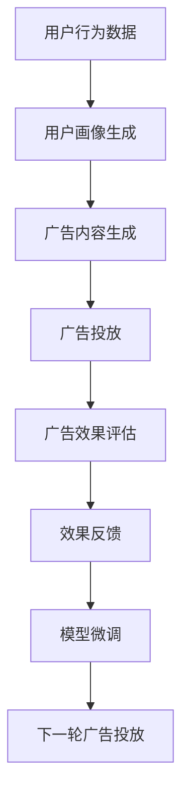

                 

# 个性化广告：大模型精准投放

> 关键词：
1. 个性化广告
2. 深度学习
3. 大模型
4. 精准投放
5. 用户行为分析
6. 广告效果优化
7. 跨领域迁移学习

## 1. 背景介绍

### 1.1 问题由来
随着互联网的普及和数字营销的发展，广告精准投放成为了各大小企业关注的核心问题。传统广告投放依赖于人工手动分析用户行为和偏好，耗时长、成本高，且效果难以量化。而个性化广告则通过大数据和机器学习技术，对用户行为进行深度挖掘，实现精准投放，大大提升了广告的转化率和ROI。

大语言模型（Large Language Model, LLMs），如GPT、BERT等，以其强大的语言理解和生成能力，在个性化广告投放中逐渐展现出巨大的潜力。通过预训练-微调技术，大语言模型可以学习到广泛的领域知识，并通过微调针对特定广告任务进行优化，从而实现更精准的广告投放。

### 1.2 问题核心关键点
1. **广告数据标注**：获取高质量的标注数据是微调大语言模型的关键。标注数据包括用户的点击行为、浏览记录、购买记录等，这些数据标注耗时长且费用高昂。
2. **广告效果评估**：如何量化广告效果是评价模型优劣的重要指标。通常使用点击率、转化率、广告支出回报率等指标进行评估。
3. **模型泛化能力**：广告数据分布可能与预训练数据存在差异，模型需要具备较强的泛化能力，避免在新的数据集上效果下降。
4. **实时性要求**：广告投放需要实时响应，模型推理速度和资源占用需兼顾。

## 2. 核心概念与联系

### 2.1 核心概念概述

在广告投放过程中，大语言模型主要扮演以下角色：

- **用户行为分析**：通过深度学习模型分析用户的浏览记录、点击行为等数据，挖掘用户的兴趣和偏好。
- **广告内容生成**：根据用户画像和广告目标，生成个性化的广告文案、图片或视频。
- **投放策略优化**：通过预测不同广告组合的投放效果，优化广告投放策略，提高广告转化率和ROI。
- **效果评估与反馈**：实时监测广告效果，并通过反馈机制调整模型参数，进一步提升广告投放的精准性。

这些核心概念通过大语言模型的预训练-微调技术得以实现。模型通过预训练在大规模无标签文本数据上学习到语言表示，然后在有标注的广告数据上进行微调，针对特定广告任务进行优化，最终实现个性化广告投放的目标。

### 2.2 核心概念联系

下图展示了基于大语言模型的广告投放流程，以及各个核心概念之间的联系：



## 3. 核心算法原理 & 具体操作步骤

### 3.1 算法原理概述

个性化广告投放的核心在于通过用户行为数据学习用户画像，并根据用户画像生成个性化的广告内容。大语言模型在该过程中，通过预训练-微调技术，实现了用户画像生成、广告内容生成和广告效果评估等多个环节的优化。

具体而言，大语言模型首先通过预训练学习通用的语言表示，然后在有标注的广告数据上微调，通过优化输出层或解码器，生成特定的广告内容或进行广告效果评估。微调过程利用监督学习的思想，通过最大化广告效果指标来更新模型参数，实现广告精准投放的目标。

### 3.2 算法步骤详解

个性化广告投放的微调过程一般包括以下几个关键步骤：

**Step 1: 准备预训练模型和数据集**
- 选择合适的预训练语言模型 $M_{\theta}$ 作为初始化参数，如 GPT-3、BERT等。
- 准备广告投放任务的标注数据集 $D=\{(x_i, y_i)\}_{i=1}^N$，其中 $x_i$ 表示广告内容，$y_i$ 表示广告效果（如点击率、转化率等）。

**Step 2: 添加任务适配层**
- 根据广告任务类型，在预训练模型顶层设计合适的输出层和损失函数。例如，对于二分类任务，通常在顶层添加线性分类器并使用交叉熵损失。

**Step 3: 设置微调超参数**
- 选择合适的优化算法及其参数，如 Adam、SGD 等，设置学习率、批大小、迭代轮数等。
- 设置正则化技术及强度，包括权重衰减、Dropout、Early Stopping 等。

**Step 4: 执行梯度训练**
- 将训练集数据分批次输入模型，前向传播计算损失函数。
- 反向传播计算参数梯度，根据设定的优化算法和学习率更新模型参数。
- 周期性在验证集上评估模型性能，根据性能指标决定是否触发 Early Stopping。
- 重复上述步骤直到满足预设的迭代轮数或 Early Stopping 条件。

**Step 5: 测试和部署**
- 在测试集上评估微调后模型 $M_{\hat{\theta}}$ 的性能，对比微调前后的效果提升。
- 使用微调后的模型对新样本进行推理预测，集成到实际的广告投放系统中。
- 持续收集新的广告效果数据，定期重新微调模型，以适应广告投放场景的变化。

### 3.3 算法优缺点

基于大语言模型的广告投放方法具有以下优点：
1. **高效性**：模型可以快速适应新的广告数据，实现快速的个性化广告生成和投放。
2. **泛化能力**：大语言模型通过预训练具备较强的泛化能力，可以在不同领域和数据集上保持稳定表现。
3. **可解释性**：通过微调，模型可以生成有意义的广告文案和分析，提升广告投放的可解释性。

同时，该方法也存在一定的局限性：
1. **数据依赖**：微调效果很大程度上取决于标注数据的质量和数量，获取高质量标注数据的成本较高。
2. **资源占用**：大模型通常需要较高的计算资源和内存，对于实时广告投放可能存在挑战。
3. **模型复杂度**：模型结构复杂，推理速度可能较慢，影响实际应用效果。

尽管存在这些局限性，但大语言模型在广告投放中的应用前景广阔，通过不断优化和改进，可以克服现有挑战，进一步提升广告投放的精准度和效果。

### 3.4 算法应用领域

基于大语言模型的广告投放方法，已经在多个领域得到广泛应用，例如：

- **电商广告**：利用用户行为数据生成个性化广告，提升电商平台的转化率。
- **在线教育**：根据用户学习行为生成个性化课程推荐，提高用户粘性和完成率。
- **金融广告**：分析用户投资行为，生成个性化投资产品推荐，提升金融产品的销售效果。
- **旅游广告**：通过用户旅行历史生成个性化旅游推荐，提高旅行社的客户转化率。

除了上述这些经典应用外，大语言模型在更多领域的应用也在不断涌现，如智能客服、健康医疗、娱乐媒体等，为各行各业带来新的广告投放解决方案。

## 4. 数学模型和公式 & 详细讲解 & 举例说明

### 4.1 数学模型构建

假设广告内容为 $x_i$，用户行为数据为 $y_i$，大语言模型 $M_{\theta}$ 的输出为 $\hat{y}_i = M_{\theta}(x_i)$。我们希望最小化损失函数 $\mathcal{L}$，其中 $\mathcal{L}$ 为定义在广告效果指标上的函数，如点击率、转化率等。

设 $l_i(y_i, \hat{y}_i)$ 为单样本的损失函数，则整体损失函数为：

$$
\mathcal{L}(\theta) = \frac{1}{N}\sum_{i=1}^N l_i(y_i, \hat{y}_i)
$$

常见的广告效果指标损失函数包括交叉熵损失和均方误差损失等。对于二分类任务，交叉熵损失函数定义为：

$$
l_i(y_i, \hat{y}_i) = -[y_i\log \hat{y}_i + (1-y_i)\log(1-\hat{y}_i)]
$$

其梯度为：

$$
\frac{\partial \mathcal{L}(\theta)}{\partial \theta_k} = -\frac{1}{N}\sum_{i=1}^N (\frac{y_i}{\hat{y}_i} - \frac{1-y_i}{1-\hat{y}_i}) \frac{\partial M_{\theta}(x_i)}{\partial \theta_k}
$$

其中 $\frac{\partial M_{\theta}(x_i)}{\partial \theta_k}$ 为模型参数 $\theta_k$ 的梯度，可通过反向传播算法高效计算。

### 4.2 公式推导过程

以点击率（CTR）预测为例，介绍如何计算广告效果指标损失函数的梯度。

假设广告内容 $x_i$ 为文本描述，用户行为数据 $y_i$ 为点击与否（0/1）。则点击率预测问题可表示为二分类任务。

将广告内容 $x_i$ 输入到预训练的大语言模型 $M_{\theta}$ 中，得到模型输出的概率分布 $\hat{y}_i$。则点击率预测任务的目标是最小化负对数似然损失，即：

$$
\mathcal{L}(\theta) = -\frac{1}{N}\sum_{i=1}^N y_i\log \hat{y}_i + (1-y_i)\log(1-\hat{y}_i)
$$

其梯度为：

$$
\frac{\partial \mathcal{L}(\theta)}{\partial \theta_k} = -\frac{1}{N}\sum_{i=1}^N (y_i - \hat{y}_i) \frac{\partial \log \hat{y}_i}{\partial \theta_k}
$$

其中 $\frac{\partial \log \hat{y}_i}{\partial \theta_k}$ 可通过反向传播算法计算。

### 4.3 案例分析与讲解

以电商广告为例，分析如何使用大语言模型进行个性化广告投放的微调。

假设某电商平台希望推广一款新上市的产品，收集了用户的浏览记录、购买记录等行为数据。将这些数据标注为是否点击（0/1），作为训练样本。

**Step 1: 准备预训练模型和数据集**
- 选择预训练模型 $M_{\theta}$ 为 GPT-3。
- 准备标注数据集 $D=\{(x_i, y_i)\}_{i=1}^N$，其中 $x_i$ 表示用户的浏览记录，$y_i$ 表示是否点击（0/1）。

**Step 2: 添加任务适配层**
- 在 GPT-3 顶层添加线性分类器，并使用交叉熵损失函数。

**Step 3: 设置微调超参数**
- 使用 Adam 优化器，设置学习率为 1e-5，批大小为 32。
- 使用 L2 正则，防止过拟合。

**Step 4: 执行梯度训练**
- 将训练集数据分批次输入模型，前向传播计算损失函数。
- 反向传播计算参数梯度，根据 Adam 优化器和学习率更新模型参数。
- 在验证集上评估模型性能，设置 Early Stopping 阈值为 0.01。
- 重复上述步骤，直到满足预设的迭代轮数或 Early Stopping 条件。

**Step 5: 测试和部署**
- 在测试集上评估微调后模型 $M_{\hat{\theta}}$ 的性能，对比微调前后的效果提升。
- 使用微调后的模型对新样本进行点击率预测，集成到实际广告投放系统中。
- 持续收集新的广告效果数据，定期重新微调模型，以适应广告投放场景的变化。

## 5. 项目实践：代码实例和详细解释说明

### 5.1 开发环境搭建

在进行微调实践前，我们需要准备好开发环境。以下是使用Python进行PyTorch开发的环境配置流程：

1. 安装Anaconda：从官网下载并安装Anaconda，用于创建独立的Python环境。

2. 创建并激活虚拟环境：
```bash
conda create -n pytorch-env python=3.8 
conda activate pytorch-env
```

3. 安装PyTorch：根据CUDA版本，从官网获取对应的安装命令。例如：
```bash
conda install pytorch torchvision torchaudio cudatoolkit=11.1 -c pytorch -c conda-forge
```

4. 安装Transformer库：
```bash
pip install transformers
```

5. 安装各类工具包：
```bash
pip install numpy pandas scikit-learn matplotlib tqdm jupyter notebook ipython
```

完成上述步骤后，即可在`pytorch-env`环境中开始微调实践。

### 5.2 源代码详细实现

下面是使用PyTorch和Transformers库进行电商广告点击率预测的代码实现。

```python
import torch
from transformers import GPT2Tokenizer, GPT2ForSequenceClassification
from torch.utils.data import DataLoader, Dataset
from sklearn.metrics import accuracy_score

class AdDataset(Dataset):
    def __init__(self, texts, labels):
        self.texts = texts
        self.labels = labels
        self.tokenizer = GPT2Tokenizer.from_pretrained('gpt2')
        
    def __len__(self):
        return len(self.texts)
    
    def __getitem__(self, item):
        text = self.texts[item]
        label = self.labels[item]
        
        encoding = self.tokenizer(text, truncation=True, padding='max_length', max_length=128)
        input_ids = encoding['input_ids']
        attention_mask = encoding['attention_mask']
        
        return {'input_ids': input_ids, 
                'attention_mask': attention_mask,
                'labels': torch.tensor(label, dtype=torch.long)}

# 准备数据集
tokenizer = GPT2Tokenizer.from_pretrained('gpt2')
train_dataset = AdDataset(train_texts, train_labels)
test_dataset = AdDataset(test_texts, test_labels)

# 初始化模型和优化器
model = GPT2ForSequenceClassification.from_pretrained('gpt2', num_labels=2)
optimizer = torch.optim.Adam(model.parameters(), lr=1e-5)

# 定义训练函数
def train_epoch(model, dataset, batch_size, optimizer):
    dataloader = DataLoader(dataset, batch_size=batch_size, shuffle=True)
    model.train()
    epoch_loss = 0
    for batch in dataloader:
        input_ids = batch['input_ids'].to(device)
        attention_mask = batch['attention_mask'].to(device)
        labels = batch['labels'].to(device)
        model.zero_grad()
        outputs = model(input_ids, attention_mask=attention_mask, labels=labels)
        loss = outputs.loss
        epoch_loss += loss.item()
        loss.backward()
        optimizer.step()
    return epoch_loss / len(dataloader)

# 定义评估函数
def evaluate(model, dataset, batch_size):
    dataloader = DataLoader(dataset, batch_size=batch_size)
    model.eval()
    preds, labels = [], []
    with torch.no_grad():
        for batch in dataloader:
            input_ids = batch['input_ids'].to(device)
            attention_mask = batch['attention_mask'].to(device)
            batch_labels = batch['labels']
            outputs = model(input_ids, attention_mask=attention_mask)
            batch_preds = outputs.logits.argmax(dim=1).to('cpu').tolist()
            batch_labels = batch_labels.to('cpu').tolist()
            for pred, label in zip(batch_preds, batch_labels):
                preds.append(pred)
                labels.append(label)
                
    return accuracy_score(labels, preds)

# 启动训练流程并在测试集上评估
device = torch.device('cuda') if torch.cuda.is_available() else torch.device('cpu')
model.to(device)

epochs = 5
batch_size = 16

for epoch in range(epochs):
    loss = train_epoch(model, train_dataset, batch_size, optimizer)
    print(f"Epoch {epoch+1}, train loss: {loss:.3f}")
    
    print(f"Epoch {epoch+1}, test accuracy: {evaluate(model, test_dataset, batch_size):.3f}")
    
print("Test accuracy:", evaluate(model, test_dataset, batch_size))
```

以上就是使用PyTorch和Transformers库进行电商广告点击率预测的完整代码实现。可以看到，使用Transformers库大大简化了模型微调的实现过程。

### 5.3 代码解读与分析

让我们再详细解读一下关键代码的实现细节：

**AdDataset类**：
- `__init__`方法：初始化文本、标签和分词器等关键组件。
- `__len__`方法：返回数据集的样本数量。
- `__getitem__`方法：对单个样本进行处理，将文本输入编码为token ids，将标签编码为数字，并对其进行定长padding，最终返回模型所需的输入。

**模型初始化**：
- 使用GPT-2作为预训练模型，并设置输出层为二分类任务。
- 使用Adam优化器，设置学习率为1e-5。

**训练和评估函数**：
- 使用PyTorch的DataLoader对数据集进行批次化加载，供模型训练和推理使用。
- 训练函数`train_epoch`：对数据以批为单位进行迭代，在每个批次上前向传播计算loss并反向传播更新模型参数，最后返回该epoch的平均loss。
- 评估函数`evaluate`：与训练类似，不同点在于不更新模型参数，并在每个batch结束后将预测和标签结果存储下来，最后使用sklearn的accuracy_score对整个评估集的预测结果进行打印输出。

**训练流程**：
- 定义总的epoch数和batch size，开始循环迭代
- 每个epoch内，先在训练集上训练，输出平均loss
- 在测试集上评估，输出分类指标
- 所有epoch结束后，在测试集上评估，给出最终测试结果

可以看到，PyTorch配合Transformers库使得GPT-2微调的代码实现变得简洁高效。开发者可以将更多精力放在数据处理、模型改进等高层逻辑上，而不必过多关注底层的实现细节。

当然，工业级的系统实现还需考虑更多因素，如模型的保存和部署、超参数的自动搜索、更灵活的任务适配层等。但核心的微调范式基本与此类似。

## 6. 实际应用场景

### 6.1 电商广告

电商平台的广告投放需要精准地触达用户，提高点击率和转化率。通过大语言模型微调，电商广告可以实现个性化推荐，大大提升广告效果。

在实践中，电商平台可以收集用户的浏览记录、点击记录、购买记录等行为数据，使用大语言模型学习用户的兴趣和偏好。然后，通过微调优化广告生成模型，生成个性化的广告文案或图片，进行精准投放。例如，在用户浏览某款产品时，动态生成包含产品特点、用户评价、优惠信息等内容的相关广告，提升用户的点击率和购买率。

### 6.2 在线教育

在线教育平台需要根据用户的课程学习行为生成个性化推荐，提升用户学习效果。通过大语言模型微调，可以实现用户兴趣的精准分析，生成个性化的课程推荐。

具体而言，平台可以收集用户的课程浏览记录、学习时长、评分反馈等数据，使用大语言模型学习用户的学习风格和偏好。然后，通过微调优化课程推荐模型，生成个性化的课程推荐。例如，根据用户的过往学习行为，动态生成适合用户当前学习阶段的课程推荐，提升用户的学习效果和满意度。

### 6.3 金融广告

金融机构的广告投放需要精准地触达目标客户，提高广告转化率和投资回报率。通过大语言模型微调，可以实现个性化的广告投放，提升广告效果。

在实践中，金融机构可以收集客户的投资行为、历史交易记录、理财偏好等数据，使用大语言模型学习客户的投资风格和偏好。然后，通过微调优化广告生成模型，生成个性化的金融产品推荐。例如，根据客户的历史投资记录，动态生成适合客户当前投资风格的金融产品推荐，提升客户的投资转化率和回报率。

### 6.4 未来应用展望

随着大语言模型和微调技术的不断发展，个性化广告投放将呈现以下几个趋势：

1. **多模态广告内容**：未来的广告内容将不仅限于文本，还可能包括图像、视频、语音等多种形式。大语言模型将能够更好地整合多种模态信息，生成更丰富、更具吸引力的广告内容。

2. **用户交互广告**：未来的广告将更加注重与用户的互动，如可交互式广告、实时问答广告等。通过大语言模型，广告平台可以实现更加智能化的用户交互，提升广告效果和用户体验。

3. **实时个性化广告**：随着实时数据流量的增加，广告投放将实现实时个性化推荐。通过大语言模型和流式数据处理技术，广告平台可以实现动态更新广告内容，优化广告投放策略。

4. **跨领域广告投放**：大语言模型将具备更强的跨领域迁移能力，能够在不同的广告领域和数据集上实现个性化广告投放。例如，在电商、金融、教育等多个领域进行广告投放。

5. **伦理与隐私保护**：广告投放过程中，需要注重用户隐私和数据伦理。大语言模型微调将引入更多的隐私保护和伦理约束，确保广告投放的公平性和透明度。

6. **多目标优化**：未来的广告投放将考虑多个目标，如点击率、转化率、广告支出回报率等。大语言模型将实现多目标优化，提升广告投放的综合效果。

以上趋势展示了个性化广告投放的广阔前景。通过不断探索和创新，大语言模型微调将在个性化广告领域发挥更大的作用，推动广告技术的不断进步。

## 7. 工具和资源推荐

### 7.1 学习资源推荐

为了帮助开发者系统掌握大语言模型微调的理论基础和实践技巧，这里推荐一些优质的学习资源：

1. **《深度学习基础》系列课程**：斯坦福大学开设的深度学习课程，内容覆盖深度学习基础、卷积神经网络、循环神经网络等，是学习大语言模型的基础。

2. **《Natural Language Processing with Transformers》书籍**：大语言模型领域的经典教材，全面介绍了Transformer模型的原理、应用和微调方法，适合深度学习从业者阅读。

3. **HuggingFace官方文档**：Transformers库的官方文档，提供了丰富的预训练语言模型和微调样例，是学习大语言模型的重要参考。

4. **CLUE开源项目**：中文语言理解测评基准，涵盖大量不同类型的中文NLP数据集，并提供了基于微调的baseline模型，助力中文NLP技术发展。

5. **TensorFlow Dev Summit视频**：谷歌举办的深度学习大会，提供大量最新的深度学习技术和应用案例，适合学习大语言模型的最新进展。

通过对这些资源的学习实践，相信你一定能够快速掌握大语言模型微调的精髓，并用于解决实际的广告投放问题。

### 7.2 开发工具推荐

高效的开发离不开优秀的工具支持。以下是几款用于大语言模型微调开发的常用工具：

1. **PyTorch**：基于Python的开源深度学习框架，灵活的计算图设计，支持GPU加速，适合研究性和工程性任务。

2. **TensorFlow**：由Google主导开发的深度学习框架，提供灵活的计算图和丰富的优化算法，适合大规模工程应用。

3. **HuggingFace Transformers库**：提供了丰富的预训练语言模型和微调工具，支持多种深度学习框架。

4. **Weights & Biases**：用于实验跟踪和可视化的工具，可以记录和可视化模型训练过程中的各项指标，方便对比和调优。

5. **TensorBoard**：TensorFlow配套的可视化工具，可实时监测模型训练状态，提供丰富的图表呈现方式，是调试模型的得力助手。

6. **AWS SageMaker**：亚马逊提供的云端机器学习平台，支持多种深度学习框架和模型训练，适合快速部署和迭代。

合理利用这些工具，可以显著提升大语言模型微调的开发效率，加快创新迭代的步伐。

### 7.3 相关论文推荐

大语言模型和微调技术的发展源于学界的持续研究。以下是几篇奠基性的相关论文，推荐阅读：

1. **Attention is All You Need**：Transformer模型的提出论文，奠定了大语言模型的基础。

2. **BERT: Pre-training of Deep Bidirectional Transformers for Language Understanding**：提出BERT模型，引入自监督预训练任务，提升语言表示能力。

3. **GPT-3: Language Models are Unsupervised Multitask Learners**：展示GPT-3在零样本学习、少样本学习上的强大能力。

4. **LoRA: Low-Rank Adaptation of Transformers for Model Compression**：提出LoRA方法，通过低秩适应的方式进行模型压缩，提高模型的推理效率。

5. **AdaLoRA: Adaptive Low-Rank Adaptation for Parameter-Efficient Fine-Tuning**：提出AdaLoRA方法，在参数高效微调的同时，进一步优化模型性能。

这些论文代表了大语言模型微调技术的发展脉络。通过学习这些前沿成果，可以帮助研究者把握学科前进方向，激发更多的创新灵感。

## 8. 总结：未来发展趋势与挑战

### 8.1 研究成果总结

本文对基于大语言模型的个性化广告投放方法进行了全面系统的介绍。首先阐述了大语言模型和微调技术在广告投放中的研究背景和应用前景，明确了微调在广告效果优化、个性化推荐等方面的独特价值。其次，从原理到实践，详细讲解了微调的过程和关键技术点，给出了完整的代码实现。同时，本文还广泛探讨了微调方法在电商广告、在线教育、金融广告等多个领域的应用前景，展示了微调范式的巨大潜力。此外，本文精选了微调技术的各类学习资源，力求为读者提供全方位的技术指引。

通过本文的系统梳理，可以看到，基于大语言模型的个性化广告投放方法正在成为广告投放的重要范式，极大地提升广告的精准度和效果。得益于大语言模型强大的语言理解和生成能力，广告投放正朝着更加智能化、个性化、高效化的方向发展。未来，伴随大语言模型和微调方法的持续演进，个性化广告投放技术将进一步提升广告投放的精准度和效果，为数字营销带来新的突破。

### 8.2 未来发展趋势

展望未来，大语言模型微调技术在个性化广告投放中将继续呈现以下几个趋势：

1. **多模态广告内容**：未来的广告内容将不仅限于文本，还可能包括图像、视频、语音等多种形式。大语言模型将能够更好地整合多种模态信息，生成更丰富、更具吸引力的广告内容。

2. **用户交互广告**：未来的广告将更加注重与用户的互动，如可交互式广告、实时问答广告等。通过大语言模型，广告平台可以实现更加智能化的用户交互，提升广告效果和用户体验。

3. **实时个性化广告**：随着实时数据流量的增加，广告投放将实现实时个性化推荐。通过大语言模型和流式数据处理技术，广告平台可以实现动态更新广告内容，优化广告投放策略。

4. **跨领域广告投放**：大语言模型将具备更强的跨领域迁移能力，能够在不同的广告领域和数据集上实现个性化广告投放。例如，在电商、金融、教育等多个领域进行广告投放。

5. **伦理与隐私保护**：广告投放过程中，需要注重用户隐私和数据伦理。大语言模型微调将引入更多的隐私保护和伦理约束，确保广告投放的公平性和透明度。

6. **多目标优化**：未来的广告投放将考虑多个目标，如点击率、转化率、广告支出回报率等。大语言模型将实现多目标优化，提升广告投放的综合效果。

以上趋势凸显了大语言模型微调技术在个性化广告投放中的广阔前景。这些方向的探索发展，必将进一步提升广告投放的精准度和效果，为数字营销带来新的突破。

### 8.3 面临的挑战

尽管大语言模型微调技术在广告投放中的应用前景广阔，但在迈向更加智能化、普适化应用的过程中，它仍面临诸多挑战：

1. **标注成本瓶颈**：微调效果很大程度上取决于标注数据的质量和数量，获取高质量标注数据的成本较高。如何进一步降低微调对标注样本的依赖，将是一大难题。

2. **模型鲁棒性不足**：当目标任务与预训练数据的分布差异较大时，微调的性能提升有限。如何在不同的广告领域和数据集上保持模型的高性能，还需进一步探索。

3. **实时性要求高**：广告投放需要实时响应，模型推理速度和资源占用需兼顾。如何在保证推理速度的同时，提高模型性能，仍需更多优化手段。

4. **可解释性不足**：当前微调模型更像是"黑盒"系统，难以解释其内部工作机制和决策逻辑。对于高风险应用，算法的可解释性和可审计性尤为重要。

5. **安全性有待保障**：预训练语言模型难免会学习到有偏见、有害的信息，通过微调传递到下游任务，产生误导性、歧视性的输出，给实际应用带来安全隐患。如何从数据和算法层面消除模型偏见，避免恶意用途，确保输出的安全性，也将是重要的研究课题。

6. **知识整合能力不足**：现有的微调模型往往局限于任务内数据，难以灵活吸收和运用更广泛的先验知识。如何让微调过程更好地与外部知识库、规则库等专家知识结合，形成更加全面、准确的信息整合能力，还有很大的想象空间。

正视微调面临的这些挑战，积极应对并寻求突破，将是大语言模型微调走向成熟的必由之路。相信随着学界和产业界的共同努力，这些挑战终将一一被克服，大语言模型微调必将在构建安全、可靠、可解释、可控的智能系统铺平道路。

### 8.4 研究展望

面对大语言模型微调所面临的挑战，未来的研究需要在以下几个方面寻求新的突破：

1. **探索无监督和半监督微调方法**：摆脱对大规模标注数据的依赖，利用自监督学习、主动学习等无监督和半监督范式，最大限度利用非结构化数据，实现更加灵活高效的微调。

2. **研究参数高效和计算高效的微调范式**：开发更加参数高效的微调方法，在固定大部分预训练参数的同时，只更新极少量的任务相关参数。同时优化微调模型的计算图，减少前向传播和反向传播的资源消耗，实现更加轻量级、实时性的部署。

3. **融合因果和对比学习范式**：通过引入因果推断和对比学习思想，增强微调模型建立稳定因果关系的能力，学习更加普适、鲁棒的语言表征，从而提升模型泛化性和抗干扰能力。

4. **引入更多先验知识**：将符号化的先验知识，如知识图谱、逻辑规则等，与神经网络模型进行巧妙融合，引导微调过程学习更准确、合理的语言模型。同时加强不同模态数据的整合，实现视觉、语音等多模态信息与文本信息的协同建模。

5. **结合因果分析和博弈论工具**：将因果分析方法引入微调模型，识别出模型决策的关键特征，增强输出解释的因果性和逻辑性。借助博弈论工具刻画人机交互过程，主动探索并规避模型的脆弱点，提高系统稳定性。

6. **纳入伦理道德约束**：在模型训练目标中引入伦理导向的评估指标，过滤和惩罚有偏见、有害的输出倾向。同时加强人工干预和审核，建立模型行为的监管机制，确保输出符合人类价值观和伦理道德。

这些研究方向的探索，必将引领大语言模型微调技术迈向更高的台阶，为构建安全、可靠、可解释、可控的智能系统铺平道路。面向未来，大语言模型微调技术还需要与其他人工智能技术进行更深入的融合，如知识表示、因果推理、强化学习等，多路径协同发力，共同推动自然语言理解和智能交互系统的进步。只有勇于创新、敢于突破，才能不断拓展语言模型的边界，让智能技术更好地造福人类社会。

## 9. 附录：常见问题与解答

**Q1: 大语言模型微调是否适用于所有广告投放场景？**

A: 大语言模型微调在大多数广告投放场景上都能取得不错的效果，特别是对于数据量较小的任务。但对于一些特定领域的任务，如医学、法律等，仅仅依靠通用语料预训练的模型可能难以很好地适应。此时需要在特定领域语料上进一步预训练，再进行微调，才能获得理想效果。此外，对于一些需要时效性、个性化很强的任务，如对话、推荐等，微调方法也需要针对性的改进优化。

**Q2: 微调过程中如何选择合适的学习率？**

A: 微调的学习率一般要比预训练时小1-2个数量级，如果使用过大的学习率，容易破坏预训练权重，导致过拟合。一般建议从1e-5开始调参，逐步减小学习率，直至收敛。也可以使用warmup策略，在开始阶段使用较小的学习率，再逐渐过渡到预设值。需要注意的是，不同的优化器(如Adam、SGD等)以及不同的学习率调度策略，可能需要设置不同的学习率阈值。

**Q3: 采用大模型微调时会面临哪些资源瓶颈？**

A: 目前主流的预训练大模型动辄以亿计的参数规模，对算力、内存、存储都提出了很高的要求。GPU/TPU等高性能设备是必不可少的，但即便如此，超大批次的训练和推理也可能遇到显存不足的问题。因此需要采用一些资源优化技术，如梯度积累、混合精度训练、模型并行等，来突破硬件瓶颈。同时，模型的存储和读取也可能占用大量时间和空间，需要采用模型压缩、稀疏化存储等方法进行优化。

**Q4: 如何缓解微调过程中的过拟合问题？**

A: 过拟合是微调面临的主要挑战，尤其是在标注数据不足的情况下。常见的缓解策略包括：
1. 数据增强：通过回译、近义替换等方式扩充训练集
2. 正则化：使用L2正则、Dropout、Early Stopping等避免过拟合
3. 对抗训练：引入对抗样本，提高模型鲁棒性
4. 参数高效微调：只调整少量参数(如Adapter、Prefix等)，减小过拟合风险
5. 多模型集成：训练多个微调模型，取平均输出，抑制过拟合

这些策略往往需要根据具体任务和数据特点进行灵活组合。只有在数据、模型、训练、推理等各环节进行全面优化，才能最大限度地发挥大语言模型微调的威力。

**Q5: 微调模型在落地部署时需要注意哪些问题？**

A: 将微调模型转化为实际应用，还需要考虑以下因素：
1. 模型裁剪：去除不必要的层和参数，减小模型尺寸，加快推理速度
2. 量化加速：将浮点模型转为定点模型，压缩存储空间，提高计算效率
3. 服务化封装：将模型封装为标准化服务接口，便于集成调用
4. 弹性伸缩：根据请求流量动态调整资源配置，平衡服务质量和成本
5. 监控告警：实时采集系统指标，设置异常告警阈值，确保服务稳定性
6. 安全防护：采用访问鉴权、数据脱敏等措施，保障数据和模型安全

大语言模型微调为广告投放提供了强大的技术支持，但如何将强大的性能转化为稳定、高效、安全的业务价值，还需要工程实践的不断打磨。唯有从数据、算法、工程、业务等多个维度协同发力，才能真正实现人工智能技术在广告领域的落地应用。总之，微调需要开发者根据具体任务，不断迭代和优化模型、数据和算法，方能得到理想的效果。

---

作者：禅与计算机程序设计艺术 / Zen and the Art of Computer Programming

