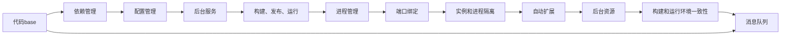

                 

# 云原生应用开发：12因素应用方法论

> 关键词：云原生, 微服务, 容器化, 持续集成, 持续部署, 12因素, DevOps, 无服务器

## 1. 背景介绍

### 1.1 问题由来
近年来，随着云计算和微服务架构的兴起，越来越多的企业开始采用云原生技术来构建分布式、高可用的应用系统。云原生技术包括容器化、微服务、持续集成、持续部署、12因素方法论等核心思想。这些技术理念将应用构建、运维、监控等各个环节进行了重构，大大提升了系统的可扩展性、弹性和效率。

然而，尽管云原生技术带来了诸多优势，但实际应用过程中也遇到了不少问题。例如：
- 微服务之间的通信复杂度增加，系统设计难度变大。
- 容器化导致的服务部署复杂性，增加了运维成本。
- 持续集成和持续部署的流程不一致，导致集成问题频发。
- 服务调度和资源分配缺乏自动化，导致系统效率低下。
- 日志、监控和告警系统建设不完善，导致故障排查困难。

为了解决这些问题，开发出稳定、可扩展、高效的应用系统，云原生领域亟需一种系统、全面、易用的应用开发和运维方法论。

### 1.2 问题核心关键点
针对上述问题，12因素方法论应运而生。12因素方法论是由Herman S.ītsche在2014年提出的一套云原生应用构建和运维的最佳实践，旨在通过系统化的规范，确保应用系统能够高效、可扩展、易于维护。

12因素方法论包括以下12个核心要素：
1. 代码base：将应用代码存储在代码库中，便于版本管理和协作开发。
2. 依赖管理：使用依赖管理工具，确保应用各组件之间的依赖关系清晰、可靠。
3. 配置管理：将配置与代码分离，使用配置文件管理应用的各种配置信息。
4. 后台服务：通过后台服务实现应用的持久化存储、身份验证等逻辑。
5. 构建、发布、运行：将构建、发布、运行集成到CI/CD流程中，自动化自动化构建、测试和部署。
6. 进程管理：使用进程管理工具，确保应用各组件的健康运行和资源合理分配。
7. 端口绑定：将应用服务绑定到特定端口，便于外部访问和负载均衡。
8. 实例和进程隔离：通过容器化技术实现应用的实例和进程隔离，保证系统的稳定性和独立性。
9. 自动扩展：根据负载情况自动扩展应用实例，确保系统的扩展性和弹性。
10. 后台资源：通过云服务提供自动化的后台资源管理，减少运维成本。
11. 构建和运行环境一致性：确保应用的构建和运行环境一致，避免不同环境下的应用差异。
12. 消息队列：使用消息队列实现应用组件之间的解耦合，提高系统的灵活性和可扩展性。

通过遵循12因素方法论，开发者可以构建出稳定、高效、可扩展的云原生应用系统，从而更好地应对云计算环境下的复杂性和不确定性。

### 1.3 问题研究意义
研究12因素方法论，对于构建高效的云原生应用系统，推动云计算和微服务架构的普及应用，具有重要意义：

1. 提升应用系统稳定性。通过系统化规范各环节的构建和运维流程，确保应用各组件的稳定运行，减少故障和停机。
2. 提升应用系统可扩展性。通过自适应扩展机制，确保应用能够高效应对流量峰值，满足业务扩展需求。
3. 降低应用运维成本。通过自动化的资源管理和服务编排，减少手动干预，降低运维难度和成本。
4. 促进团队协作。通过代码base和依赖管理等规范，提高团队协作效率，降低开发和运维过程中的沟通成本。
5. 加快应用交付速度。通过CI/CD流程自动化，缩短应用从开发到上线的时间周期，提升市场响应速度。
6. 增强应用灵活性。通过消息队列和后台服务等机制，实现应用组件的解耦合和灵活配置，满足不同场景下的需求。

## 2. 核心概念与联系

### 2.1 核心概念概述

为更好地理解12因素方法论的核心思想，本节将介绍其中的几个关键概念及其相互之间的联系。

- **代码base**：将应用代码存储在代码库中，如Git，便于版本管理和协作开发。
- **依赖管理**：使用依赖管理工具，如Maven、Pip，确保应用各组件之间的依赖关系清晰、可靠。
- **配置管理**：将配置与代码分离，使用配置文件管理应用的各种配置信息，如环境变量、数据库连接等。
- **后台服务**：通过后台服务实现应用的持久化存储、身份验证等逻辑，如数据库、缓存、身份认证等。
- **构建、发布、运行**：将构建、发布、运行集成到CI/CD流程中，自动化构建、测试和部署。
- **进程管理**：使用进程管理工具，如supervisor、systemd，确保应用各组件的健康运行和资源合理分配。
- **端口绑定**：将应用服务绑定到特定端口，便于外部访问和负载均衡。
- **实例和进程隔离**：通过容器化技术实现应用的实例和进程隔离，保证系统的稳定性和独立性。
- **自动扩展**：根据负载情况自动扩展应用实例，确保系统的扩展性和弹性。
- **后台资源**：通过云服务提供自动化的后台资源管理，减少运维成本，如ECS、Kubernetes。
- **构建和运行环境一致性**：确保应用的构建和运行环境一致，避免不同环境下的应用差异。
- **消息队列**：使用消息队列实现应用组件之间的解耦合，提高系统的灵活性和可扩展性。

这些核心概念通过合理的设计和配置，构建出一个稳定、高效、可扩展的云原生应用系统。

### 2.2 核心概念原理和架构的 Mermaid 流程图



这个流程图展示了12因素方法论中各要素之间的联系和交互关系。每个要素都是构建和运维云原生应用的关键环节，通过合理的配置和整合，能够构建出稳定、高效、可扩展的应用系统。

## 3. 核心算法原理 & 具体操作步骤
### 3.1 算法原理概述

12因素方法论的核心算法原理是基于微服务架构和容器化技术的。微服务架构将应用拆分为多个小型服务，通过容器化技术实现服务的隔离和灵活部署。构建和运维过程中，需要遵循12因素的规范，确保应用的稳定性和可扩展性。

### 3.2 算法步骤详解

**Step 1: 准备开发环境**
- 安装代码库（如Git）和依赖管理工具（如Maven、Pip）。
- 准备配置文件（如配置YAML文件）。
- 部署后台服务（如数据库、缓存、身份认证等）。

**Step 2: 设计服务架构**
- 将应用拆分为多个小型服务，明确各服务之间的依赖关系。
- 使用消息队列实现服务之间的解耦合，提高系统的灵活性和可扩展性。

**Step 3: 实现微服务**
- 使用代码base和依赖管理工具构建服务的代码库。
- 在配置文件中管理应用的各种配置信息。
- 实现服务的后台逻辑，如持久化存储、身份验证等。

**Step 4: 设计CI/CD流程**
- 自动化构建、测试和部署流程，确保应用各组件的一致性。
- 使用容器化技术实现服务的隔离和灵活部署。
- 实现自动扩展机制，根据负载情况自动扩展服务实例。

**Step 5: 实现消息队列**
- 使用消息队列实现服务之间的解耦合，提高系统的灵活性和可扩展性。

**Step 6: 监控和运维**
- 使用日志、监控和告警系统实时监测应用状态，及时发现和处理故障。
- 使用无服务器技术，降低运维成本。

### 3.3 算法优缺点

12因素方法论具有以下优点：
1. 系统化规范各环节的构建和运维流程，确保应用各组件的稳定运行。
2. 实现服务的自动扩展，确保系统的扩展性和弹性。
3. 使用容器化技术实现服务的隔离和灵活部署，降低运维难度和成本。
4. 促进团队协作，提高开发和运维效率。
5. 缩短应用交付速度，提升市场响应速度。

同时，该方法也存在一定的局限性：
1. 配置复杂，需要团队成员具备一定的配置和部署经验。
2. 依赖于云服务提供商的生态系统，不够灵活。
3. 对于小规模应用，引入的复杂度可能超出预期。
4. 需要投入一定的运维资源，保证系统的稳定性和可扩展性。

尽管存在这些局限性，但就目前而言，12因素方法论仍是构建云原生应用的最佳实践之一。未来相关研究的重点在于如何进一步降低配置复杂度，提高系统的灵活性和可扩展性，同时兼顾低成本、高效率的目标。

### 3.4 算法应用领域

12因素方法论适用于各种类型的云原生应用开发和运维。例如：

- 微服务架构：通过拆解服务，实现服务的独立部署和灵活扩展。
- 容器化部署：通过Docker、Kubernetes等技术，实现服务的自动化部署和管理。
- 持续集成与持续部署：通过CI/CD流程，实现应用的自动化构建和部署。
- 消息队列解耦：通过消息队列，实现服务组件的解耦合，提高系统的灵活性和可扩展性。
- DevOps实践：通过12因素方法论，提升团队协作和开发效率，加快应用交付速度。
- 无服务器技术：通过FaaS（函数即服务）技术，降低运维成本，提高系统效率。

除了上述这些核心应用领域，12因素方法论还被广泛应用于企业级应用系统的构建和运维中，为各种场景下的应用开发提供了可靠保障。

## 4. 数学模型和公式 & 详细讲解 & 举例说明

### 4.1 数学模型构建

12因素方法论中的核心概念均可以通过数学模型来表达。例如，配置管理中的环境变量和数据库连接，可以通过配置文件进行管理和映射。构建和运行环境的一致性，可以通过环境变量和依赖管理工具来保证。

### 4.2 公式推导过程

以配置管理为例，假设配置文件中包含环境变量`DB_HOST`和`DB_PORT`，分别表示数据库的地址和端口。则配置管理的过程可以表示为：

$$
\text{配置文件} \rightarrow \text{环境变量} \rightarrow \text{数据库连接}
$$

其中，配置文件中定义了环境变量的值，环境变量通过依赖管理工具解析和映射，最终得到数据库连接信息。这种配置管理方式，能够确保应用在不同环境下的配置一致性，提高系统的稳定性和可靠性。

### 4.3 案例分析与讲解

假设我们正在开发一个电商网站，需要部署一个MySQL数据库。我们可以按照12因素方法论，进行以下操作：

1. 在配置文件中定义数据库连接信息：

```
DB_HOST: mydb.example.com
DB_PORT: 3306
```

2. 使用依赖管理工具解析环境变量，确保数据库连接信息在各个环境中的一致性：

```python
import os

DB_HOST = os.getenv('DB_HOST')
DB_PORT = os.getenv('DB_PORT')
```

3. 使用后台服务部署MySQL数据库，确保数据库的稳定运行：

```python
# 启动MySQL服务
mysql = subprocess.Popen(['mysqld', '--port', DB_PORT, '--host', DB_HOST])
mysql.wait()
```

通过上述操作，我们成功实现了数据库连接的配置管理和后台服务的部署，确保了应用的稳定性和可扩展性。

## 5. 项目实践：代码实例和详细解释说明
### 5.1 开发环境搭建

在进行项目实践前，我们需要准备好开发环境。以下是使用Python进行Flask开发的开发环境配置流程：

1. 安装Python：从官网下载并安装Python，建议使用3.8及以上版本。
2. 安装Flask：使用pip安装Flask框架。
3. 创建虚拟环境：创建虚拟环境，确保不同项目之间的依赖隔离。
4. 安装依赖库：安装项目所需的依赖库，如SQLAlchemy、Flask-SQLAlchemy等。

完成上述步骤后，即可在虚拟环境中开始项目开发。

### 5.2 源代码详细实现

下面我们以一个简单的电商网站为例，展示如何使用Flask和SQLAlchemy实现数据库的配置管理和后台服务部署。

首先，定义数据库连接配置：

```python
import os

DB_HOST = os.getenv('DB_HOST', 'localhost')
DB_PORT = int(os.getenv('DB_PORT', 3306))
DB_NAME = os.getenv('DB_NAME', 'mydb')
```

接着，定义SQLAlchemy模型：

```python
from flask_sqlalchemy import SQLAlchemy

app = Flask(__name__)
app.config['SQLALCHEMY_DATABASE_URI'] = f'mysql+pymysql://user:password@{DB_HOST}:{DB_PORT}/{DB_NAME}'
db = SQLAlchemy(app)
```

然后，定义Flask路由和视图：

```python
@app.route('/')
def index():
    return 'Hello, World!'
```

最后，运行Flask应用：

```python
if __name__ == '__main__':
    app.run(debug=True)
```

### 5.3 代码解读与分析

让我们再详细解读一下关键代码的实现细节：

**配置管理**：
- 使用os.getenv获取环境变量，确保数据库连接信息在各个环境中的一致性。
- 根据环境变量的值，动态构建数据库连接URI。

**SQLAlchemy模型**：
- 使用Flask-SQLAlchemy插件，实现数据库的配置管理和连接。
- 动态生成数据库连接URI，确保在不同环境中的数据库连接一致。

**Flask路由和视图**：
- 定义路由和视图函数，实现应用的基本功能。
- 使用Flask的请求-响应机制，处理客户端请求并返回响应。

**Flask应用运行**：
- 使用Flask的run方法启动应用，开启开发服务器。
- 在开发模式下，自动重新加载代码，方便调试和测试。

通过上述代码实现，我们成功实现了Flask应用的配置管理、数据库连接和路由处理，确保了应用的稳定性和可扩展性。

## 6. 实际应用场景

### 6.1 电商网站

基于12因素方法论，可以构建稳定、高效、可扩展的电商网站。电商网站通常包含商品管理、订单管理、用户管理等多个服务组件，通过微服务架构进行拆分和部署，实现各个组件的独立运行和灵活扩展。

在具体实现上，可以按照12因素方法论，进行以下操作：

1. 使用代码base和依赖管理工具构建各服务组件的代码库。
2. 在配置文件中管理各组件的依赖关系和配置信息。
3. 通过后台服务实现各组件的持久化存储和身份验证。
4. 设计CI/CD流程，自动化构建、测试和部署各服务组件。
5. 使用容器化技术实现各组件的隔离和灵活部署。
6. 实现自动扩展机制，根据负载情况自动扩展服务实例。

通过12因素方法论，可以构建出稳定、高效、可扩展的电商网站，满足日益增长的电商业务需求。

### 6.2 企业级应用系统

12因素方法论不仅适用于电商网站，还适用于各种类型的企业级应用系统的构建和运维。例如，金融交易系统、医疗信息管理系统、物流配送系统等。这些系统通常涉及多个组件和功能模块，需要高度可靠和稳定的技术支持。

在具体实现上，可以按照12因素方法论，进行以下操作：

1. 使用代码base和依赖管理工具构建各功能模块的代码库。
2. 在配置文件中管理各组件的依赖关系和配置信息。
3. 通过后台服务实现各组件的持久化存储和身份验证。
4. 设计CI/CD流程，自动化构建、测试和部署各功能模块。
5. 使用容器化技术实现各组件的隔离和灵活部署。
6. 实现自动扩展机制，根据负载情况自动扩展服务实例。

通过12因素方法论，可以构建出稳定、高效、可扩展的企业级应用系统，满足企业级业务的复杂需求。

### 6.3 微服务架构

微服务架构是12因素方法论的核心应用之一。通过将应用拆分为多个小型服务，每个服务可以独立部署和扩展，提升系统的灵活性和可维护性。

在具体实现上，可以按照12因素方法论，进行以下操作：

1. 使用代码base和依赖管理工具构建各服务的代码库。
2. 在配置文件中管理各服务的依赖关系和配置信息。
3. 通过后台服务实现各服务的持久化存储和身份验证。
4. 设计CI/CD流程，自动化构建、测试和部署各服务。
5. 使用容器化技术实现各服务的隔离和灵活部署。
6. 实现自动扩展机制，根据负载情况自动扩展服务实例。

通过微服务架构和12因素方法论，可以构建出稳定、高效、可扩展的应用系统，提升系统的灵活性和可维护性。

## 7. 工具和资源推荐

### 7.1 学习资源推荐

为了帮助开发者系统掌握12因素方法论的理论基础和实践技巧，这里推荐一些优质的学习资源：

1. **《云原生12因素应用设计》**：介绍12因素方法论的核心思想和应用实践，详细讲解了每个要素的实现细节和注意事项。
2. **《Flask Web开发实战》**：系统讲解Flask框架的使用，包括代码base、依赖管理、路由处理等关键技术。
3. **《Docker实战》**：介绍Docker容器化技术的使用，包括容器部署、服务编排、自动扩展等关键技术。
4. **《Kubernetes实战》**：介绍Kubernetes容器编排技术的使用，包括集群管理、资源管理、自动扩展等关键技术。
5. **《云原生架构设计与实践》**：介绍云原生架构的设计和实现，包括微服务、容器化、CI/CD、DevOps等关键技术。

通过这些资源的学习，相信你一定能够全面掌握12因素方法论的理论基础和实践技巧，从而构建出稳定、高效、可扩展的云原生应用系统。

### 7.2 开发工具推荐

高效的开发离不开优秀的工具支持。以下是几款用于云原生应用开发的常用工具：

1. **Flask**：基于Python的Web开发框架，简单易用，支持路由处理、依赖管理等关键技术。
2. **SQLAlchemy**：Python ORM工具，支持数据库的配置管理和连接。
3. **Docker**：开源容器引擎，支持服务的隔离和灵活部署。
4. **Kubernetes**：开源容器编排系统，支持服务的集群管理和资源管理。
5. **Jenkins**：开源CI/CD工具，支持自动化构建、测试和部署。
6. **Prometheus**：开源监控系统，支持实时监测应用状态和性能。

合理利用这些工具，可以显著提升云原生应用开发的效率和质量，缩短项目开发周期。

### 7.3 相关论文推荐

云原生领域的研究在不断深入，以下是几篇奠基性的相关论文，推荐阅读：

1. **《12 Factors of Cloud-Native Applications》**：介绍12因素方法论的核心思想和应用实践，系统讲解了每个要素的实现细节。
2. **《Microservices: A Pragmatic Guide to Designing Fine-Grained Systems》**：介绍微服务架构的设计和实现，强调服务的独立部署和灵活扩展。
3. **《Docker: The Future of Computing》**：介绍Docker容器化技术的使用，强调服务的隔离和灵活部署。
4. **《Kubernetes: Orchestrating Large-Scale Production Containers》**：介绍Kubernetes容器编排技术的使用，强调服务的集群管理和资源管理。
5. **《DevOps: Automate the Future of IT》**：介绍DevOps实践的核心思想和应用，强调团队协作和自动化流程。

这些论文代表了大规模应用系统构建和运维的最佳实践，对开发者具有重要的参考价值。

## 8. 总结：未来发展趋势与挑战

### 8.1 研究成果总结

本文对12因素方法论进行了全面系统的介绍。首先阐述了12因素方法论的研究背景和意义，明确了其在云原生应用开发和运维中的独特价值。其次，从原理到实践，详细讲解了12因素方法论的每个要素，给出了微服务架构和容器化技术的代码实例。同时，本文还广泛探讨了12因素方法论在电商网站、企业级应用系统和微服务架构等多个场景中的应用前景，展示了其广泛的应用潜力和实际价值。最后，本文精选了12因素方法论的学习资源、开发工具和相关论文，力求为读者提供全方位的技术指引。

通过本文的系统梳理，可以看到，12因素方法论为构建稳定、高效、可扩展的云原生应用系统提供了可靠保障。这种系统化规范各环节的构建和运维流程，确保应用各组件的稳定运行，减少故障和停机，提升系统的扩展性和弹性，降低运维难度和成本，促进团队协作，加快应用交付速度，增强应用灵活性，从而更好地应对云计算环境下的复杂性和不确定性。

### 8.2 未来发展趋势

展望未来，12因素方法论将呈现以下几个发展趋势：

1. **自动化**：随着自动化运维技术的发展，12因素方法论将更加注重自动化流程的建设，进一步提升系统的可靠性和稳定性。
2. **容器化**：容器化技术将继续发展，实现更灵活、更高效的云原生应用部署。
3. **微服务**：微服务架构将进一步发展，实现更细粒度的服务拆分和更灵活的服务编排。
4. **无服务器**：无服务器技术将进一步发展，实现更高效、更可靠的服务运行。
5. **多云管理**：随着多云环境的普及，12因素方法论将更多地关注多云管理和跨云协作，提升应用的跨云扩展性和一致性。
6. **12+因素**：12因素方法论将进一步完善，涵盖更多关键要素，如数据管理、安全管理等。

以上趋势凸显了12因素方法论的持续演进和完善，为云原生应用系统的构建和运维提供了更可靠、更高效的技术支持。

### 8.3 面临的挑战

尽管12因素方法论已经取得了不错的成果，但在应用过程中仍面临一些挑战：

1. **配置复杂**：配置文件管理和依赖管理工具的使用，增加了开发和运维的复杂度。
2. **性能优化**：如何优化应用的性能和资源使用效率，仍然是一个重要的研究课题。
3. **安全管理**：如何保障应用的安全性和数据隐私，仍然是一个重要的挑战。
4. **团队协作**：如何在团队中实现良好的协作和沟通，仍然是一个重要的挑战。
5. **持续集成与持续部署**：如何实现更高效、更可靠的持续集成与持续部署，仍然是一个重要的挑战。

这些挑战凸显了12因素方法论在实际应用中的复杂性和挑战性，需要开发者不断优化和改进，才能更好地发挥其优势。

### 8.4 研究展望

面对12因素方法论面临的挑战，未来的研究需要在以下几个方面寻求新的突破：

1. **简化配置管理**：引入更易用的配置管理工具和自动化配置管理流程，降低开发和运维的复杂度。
2. **优化性能**：引入更高效的性能优化技术，提升应用的响应速度和资源利用效率。
3. **加强安全管理**：引入更全面的安全管理机制，保障应用的安全性和数据隐私。
4. **促进团队协作**：引入更高效的项目管理工具和沟通平台，提升团队的协作效率。
5. **完善持续集成与持续部署**：引入更高效的CI/CD工具和自动化测试流程，提升应用的交付速度和可靠性。

这些研究方向将推动12因素方法论的不断演进和完善，为云原生应用系统的构建和运维提供更可靠、更高效的技术支持。

## 9. 附录：常见问题与解答

**Q1：如何使用Docker容器化技术实现服务的隔离和灵活部署？**

A: 使用Docker容器化技术，可以轻松实现服务的隔离和灵活部署。具体步骤如下：

1. 将服务打包为Docker镜像。
2. 创建Docker容器，启动服务。
3. 通过Kubernetes等容器编排工具，实现服务的集群管理和自动扩展。

通过上述步骤，可以确保服务在容器中的独立运行和灵活部署，减少手动干预，降低运维难度和成本。

**Q2：如何使用微服务架构实现服务的独立部署和灵活扩展？**

A: 使用微服务架构，可以将应用拆分为多个小型服务，实现服务的独立部署和灵活扩展。具体步骤如下：

1. 将应用拆分为多个小型服务。
2. 使用代码base和依赖管理工具构建各服务的代码库。
3. 在配置文件中管理各服务的依赖关系和配置信息。
4. 通过后台服务实现各服务的持久化存储和身份验证。
5. 设计CI/CD流程，自动化构建、测试和部署各服务。
6. 使用容器化技术实现各服务的隔离和灵活部署。
7. 实现自动扩展机制，根据负载情况自动扩展服务实例。

通过上述步骤，可以构建出稳定、高效、可扩展的微服务架构，提升系统的灵活性和可维护性。

**Q3：如何在12因素方法论中实现自动扩展机制？**

A: 在12因素方法论中，自动扩展机制可以通过云服务提供商提供的自动化服务实现。具体步骤如下：

1. 使用云服务提供商的自动扩展工具，如AWS Auto Scaling、Azure Auto Scale等。
2. 根据应用的负载情况，自动扩展或缩减服务实例。
3. 配置自动扩展的触发条件和策略，如CPU使用率、网络流量等。
4. 监控应用负载，及时触发自动扩展机制。

通过上述步骤，可以实现应用的自动扩展，提升系统的扩展性和弹性，保证系统的高可用性和稳定性。

---

作者：禅与计算机程序设计艺术 / Zen and the Art of Computer Programming

