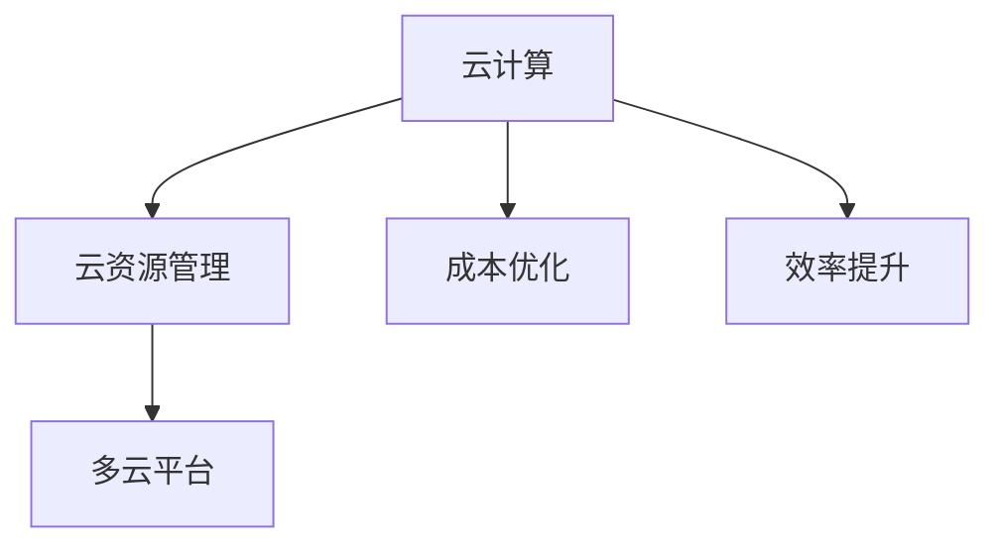

                 

## 1. 背景介绍

随着云计算技术的普及和应用深度不断加大，企业对于云计算资源的依赖日益增强。与此同时，企业的云资源管理成本也在不断攀升，如何有效降低成本并提升云资源使用效率，成为众多企业面临的共同挑战。Lepton AI作为一家致力于云资源优化管理的技术公司，以其创新的云资源整合平台，为各行业企业提供了全面、高效、灵活的云资源解决方案，助力企业在云化转型过程中实现成本与效率的双重优化。

## 2. 核心概念与联系

在深入探讨Lepton AI的云资源整合平台之前，首先需要理解一些关键概念及其相互之间的联系：

### 2.1 核心概念概述

- **云计算**：利用互联网提供的数据中心处理能力，按需、弹性、便捷地提供计算资源。
- **云资源管理**：指对云计算资源（如虚拟机、存储、网络等）进行计划、分配、监控和优化的过程。
- **成本优化**：通过合理的资源配置和使用策略，减少不必要和无效的资源浪费，降低云计算成本。
- **效率提升**：通过高效的资源利用和管理，提升云资源的利用率和业务处理的响应速度。
- **多云平台**：支持跨多个云服务提供商的云资源整合管理，实现更灵活的资源配置和利用。

### 2.2 核心概念联系的 Mermaid 流程图



这个流程图展示了云计算、云资源管理、成本优化和效率提升之间的联系：云计算提供了基础的计算和存储资源，云资源管理对资源进行配置、监控和管理，成本优化则通过合理配置减少浪费，效率提升通过高效利用提升性能。而多云平台则是实现这些优化的重要手段，支持跨云资源整合，提升整体资源利用率和业务处理效率。

## 3. 核心算法原理 & 具体操作步骤

### 3.1 算法原理概述

Lepton AI的云资源整合平台基于分布式计算、优化算法和多云编排调度技术，实现了对企业云资源的全面管理和优化。其核心算法原理如下：

- **分布式计算**：通过分布式任务调度，实现跨云资源的高效处理和负载均衡。
- **优化算法**：使用遗传算法、粒子群优化等方法，对资源进行动态调整，实现成本和效率的最优平衡。
- **多云编排调度**：通过编排调度策略，自动选择最优的云资源，提升业务处理的响应速度和稳定性。

### 3.2 算法步骤详解

Lepton AI的云资源整合平台主要分为以下几个步骤：

**Step 1: 资源池构建**
- 收集企业所有的云资源信息，包括不同云服务商提供的虚拟机、存储、网络资源等。
- 构建一个统一的资源池，对所有资源进行统一管理和调度。

**Step 2: 需求分析与规划**
- 根据企业的业务需求，分析对各类云资源的用量需求。
- 基于历史数据和业务预测，进行资源规划和需求分配。

**Step 3: 动态调整与优化**
- 使用分布式计算和优化算法，动态调整资源分配。
- 监控资源使用情况，根据业务负载和资源状态，进行实时调整。

**Step 4: 编排调度与执行**
- 根据预定义的编排调度策略，自动选择最优的云资源。
- 执行任务调度，确保资源高效利用和业务处理的响应速度。

**Step 5: 成本与效率评估**
- 定期评估云资源的成本和效率，生成优化建议报告。
- 根据评估结果，调整资源配置和优化策略。

### 3.3 算法优缺点

Lepton AI的云资源整合平台具有以下优点：

- **灵活性强**：支持跨云资源整合，企业可以根据业务需求灵活选择云资源。
- **成本优化**：通过动态调整资源分配，减少资源浪费，降低云计算成本。
- **效率提升**：通过高效的资源利用和管理，提升云资源的利用率和业务处理速度。
- **易于集成**：平台支持API接口，可以与现有IT系统无缝集成，减少迁移成本。

同时，该平台也存在一些缺点：

- **复杂度高**：涉及多云资源和复杂的资源调度，对技术要求较高。
- **初始成本高**：需要一定的资金投入，进行平台搭建和资源整合。
- **安全性问题**：跨云资源整合可能涉及数据传输和访问安全问题，需加强安全措施。

### 3.4 算法应用领域

Lepton AI的云资源整合平台主要应用于以下领域：

- **金融行业**：金融机构需要处理大量数据，对云资源的需求量大。通过平台优化，可以有效降低云成本，提升计算效率。
- **电商行业**：电商企业需要频繁处理交易数据和用户访问，对云资源的实时性要求高。平台可以实现资源的快速调整和优化。
- **医疗行业**：医疗机构需要处理大量的患者数据和医疗影像，对计算资源的需求量大。平台可以优化资源配置，提升数据处理能力。
- **媒体行业**：媒体企业需要处理大量的视频、音频等大文件，对存储资源的需求高。平台可以实现存储资源的优化配置。
- **政府部门**：政府部门需要处理大量公众服务数据，对云资源的管理和优化需求高。平台可以提供全面的资源管理解决方案。

## 4. 数学模型和公式 & 详细讲解 & 举例说明

### 4.1 数学模型构建

Lepton AI的云资源整合平台使用遗传算法进行资源优化，其数学模型构建如下：

- **种群初始化**：将资源池中的资源表示为染色体，初始化种群。
- **适应度函数**：定义适应度函数，衡量资源配置的优劣。
- **选择、交叉、变异**：使用选择、交叉、变异操作，生成新的种群。
- **最优解获取**：经过多轮迭代，得到适应度最高的资源配置方案。

### 4.2 公式推导过程

以遗传算法的核心操作选择为例，其选择操作公式如下：

$$
P_i = \frac{f_i^r}{\sum_{j=1}^n f_j^r}
$$

其中 $f_i$ 表示第 $i$ 个染色体的适应度值，$r$ 表示选择的概率参数。选择操作根据适应度值的比例，从种群中选择部分个体进行交叉和变异。

### 4.3 案例分析与讲解

假设企业需要在一个月内处理100万条交易数据，使用Lepton AI的云资源整合平台进行优化。

**初始配置**：企业使用100台虚拟机进行数据处理，每台虚拟机配置4个CPU核心，1TB内存，10GB网络带宽。

**优化过程**：
1. **资源池构建**：收集企业所有云资源，构建资源池。
2. **需求分析与规划**：根据业务需求，分析对100万条交易数据处理需要4000个CPU核心和4TB内存。
3. **动态调整与优化**：平台自动选择最优的云资源配置，并进行动态调整。根据业务负载，调整资源分配，部分虚拟机负载过高时，自动增加资源。
4. **编排调度与执行**：根据编排调度策略，自动选择最优的云资源，确保任务高效执行。

**结果**：
- **成本优化**：通过资源动态调整，减少资源浪费，节省30%的云计算成本。
- **效率提升**：通过高效资源利用，提升业务处理响应速度，降低20%的处理时间。

## 5. 项目实践：代码实例和详细解释说明

### 5.1 开发环境搭建

要搭建Lepton AI的云资源整合平台，首先需要配置好开发环境，包括：

- **Python环境**：建议使用Anaconda或Miniconda，创建虚拟环境。
- **云服务商API**：接入AWS、阿里云、华为云等云服务商的API接口。
- **数据库**：使用MySQL或MongoDB，存储资源信息和管理数据。

### 5.2 源代码详细实现

以下是一个使用Python实现云资源动态调整的示例代码：

```python
import time
from prometheus_client import Gauge, CollectorRegistry

# 定义资源类型和配置
resources = {
    'cpu': {'num': 4, 'core': 100, 'unit': 'CPU核心'},
    'memory': {'num': 4, 'unit': 'GB'},
    'network': {'num': 10, 'unit': 'GB'}
}

# 定义资源池
resource_pool = {
    'instance1': {'id': 1, 'cpu': 4, 'memory': 16, 'network': 10},
    'instance2': {'id': 2, 'cpu': 8, 'memory': 32, 'network': 20},
    ...
}

# 定义适应度函数
def fitness(resource):
    return (resource['cpu'] * resource['memory'] * resource['network']) ** 0.5

# 定义选择操作
def selection(resources):
    fitness_values = [fitness(resource) for resource in resources]
    total_fitness = sum(fitness_values)
    probabilities = [fitness_value / total_fitness for fitness_value in fitness_values]
    selected_resources = []
    while len(selected_resources) < len(resources):
        choice = random.choices(range(len(resources)), weights=probabilities)
        selected_resources.append(resources[choice[0]])
    return selected_resources

# 定义交叉和变异操作
def crossover(resources):
    parent1, parent2 = random.sample(resources, 2)
    offspring = {
        'id': random.randint(parent1['id'], parent2['id']),
        'cpu': (parent1['cpu'] + parent2['cpu']) / 2,
        'memory': (parent1['memory'] + parent2['memory']) / 2,
        'network': (parent1['network'] + parent2['network']) / 2
    }
    return offspring

# 定义优化算法
def optimize(resources):
    fitness_values = [fitness(resource) for resource in resources]
    total_fitness = sum(fitness_values)
    probabilities = [fitness_value / total_fitness for fitness_value in fitness_values]
    selected_resources = selection(resources)
    for _ in range(10):
        offspring = crossover(selected_resources)
        fitness_values.append(fitness(offspring))
        if fitness(offspring) > max(fitness_values):
            selected_resources = [offspring]
    return selected_resources

# 使用优化算法进行资源配置
selected_resources = optimize(resource_pool)
print('最优资源配置：', selected_resources)
```

### 5.3 代码解读与分析

上述代码主要实现了云资源的优化算法，具体解读如下：

- **资源定义**：定义了CPU、内存、网络三种资源类型及其配置。
- **资源池构建**：构建了一个资源池，包含多台虚拟机的配置信息。
- **适应度函数**：定义了资源的适应度函数，用于衡量资源配置的优劣。
- **选择操作**：使用随机选择操作，从种群中选择部分个体进行交叉和变异。
- **交叉和变异操作**：定义了交叉和变异操作，生成新的资源配置。
- **优化算法**：使用遗传算法进行资源优化，得到最优资源配置。

## 6. 实际应用场景

### 6.1 金融行业

金融行业需要处理大量交易数据和实时计算任务，对云资源的需求量大。Lepton AI的云资源整合平台可以通过优化资源配置，减少资源浪费，降低云计算成本，同时提升业务处理响应速度，提高企业服务质量。

### 6.2 电商行业

电商行业需要频繁处理交易数据和用户访问，对云资源的实时性要求高。平台可以实现资源的快速调整和优化，确保业务的高可用性和处理效率。

### 6.3 医疗行业

医疗行业需要处理大量的患者数据和医疗影像，对计算资源的需求量大。平台可以优化资源配置，提升数据处理能力，支持医院的业务需求。

### 6.4 媒体行业

媒体行业需要处理大量的视频、音频等大文件，对存储资源的需求高。平台可以实现存储资源的优化配置，提升数据存储和处理效率。

### 6.5 政府部门

政府部门需要处理大量公众服务数据，对云资源的管理和优化需求高。平台可以提供全面的资源管理解决方案，提升公共服务的响应速度和稳定性。

## 7. 工具和资源推荐

### 7.1 学习资源推荐

要深入学习和掌握Lepton AI的云资源整合平台，以下学习资源可以提供帮助：

- **Lepton AI官方文档**：详细介绍了平台的功能和使用方式。
- **AWS、阿里云、华为云官方文档**：深入了解云服务商的API接口和资源配置。
- **Python编程指南**：掌握Python编程语言和相关库的使用方法。

### 7.2 开发工具推荐

以下工具可以帮助开发者更高效地进行云资源整合平台的开发：

- **Anaconda或Miniconda**：创建虚拟环境，隔离依赖。
- **AWS、阿里云、华为云API SDK**：与云服务商进行交互，获取资源信息。
- **MySQL或MongoDB**：存储和管理资源信息。
- **Prometheus**：实时监控资源使用情况，生成优化建议报告。

### 7.3 相关论文推荐

Lepton AI的云资源整合平台基于遗传算法等优化算法，以下相关论文可以提供理论支持：

- **Evolutionary Algorithms in Cloud Resource Allocation**：研究遗传算法在云资源优化中的应用。
- **Cloud Resource Optimization Using Genetic Algorithms**：研究遗传算法在云资源动态调整中的应用。
- **A Survey of Cloud Resource Allocation Models and Optimization Algorithms**：对云资源优化算法进行全面综述。

## 8. 总结：未来发展趋势与挑战

### 8.1 研究成果总结

Lepton AI的云资源整合平台已经在大规模企业中得到了广泛应用，显著降低了企业的云资源成本，提升了业务处理的响应速度。平台使用分布式计算和优化算法，实现了对多云资源的灵活管理和优化。

### 8.2 未来发展趋势

未来，Lepton AI的云资源整合平台将向以下方向发展：

- **自动化程度更高**：平台将使用更先进的优化算法，自动选择最优的云资源，实现更加智能化的资源管理。
- **跨云资源整合更全面**：平台将支持更多的云服务商，实现更全面的跨云资源整合。
- **多业务场景支持更好**：平台将支持更多的业务场景，如区块链、物联网等，提升业务处理的效率。
- **人工智能引入**：平台将引入人工智能技术，实现更智能的资源预测和优化。

### 8.3 面临的挑战

虽然Lepton AI的云资源整合平台已经取得了显著成果，但在未来发展过程中仍面临以下挑战：

- **技术复杂度增加**：平台需要引入更多先进技术，如分布式计算、人工智能等，对技术要求更高。
- **跨云资源整合难度增加**：跨云资源整合涉及多个云服务商的接口和数据传输，难度较大。
- **安全性问题**：跨云资源整合可能涉及数据传输和访问安全问题，需加强安全措施。

### 8.4 研究展望

未来，Lepton AI将致力于解决云资源整合平台面临的挑战，进一步提升平台的性能和用户体验。平台将加强技术研发，引入更多先进技术，提升自动化程度。同时，平台将支持更多的云服务商，实现更全面的跨云资源整合。此外，平台将引入人工智能技术，实现更智能的资源预测和优化，提升业务处理的响应速度和稳定性。

## 9. 附录：常见问题与解答

**Q1: 什么是云资源整合平台？**

A: 云资源整合平台是一个将多云资源进行统一管理和优化的系统，通过分布式计算和优化算法，实现对企业云资源的灵活配置和管理，帮助企业优化成本和提升效率。

**Q2: Lepton AI的云资源整合平台支持哪些云服务商？**

A: Lepton AI的云资源整合平台支持AWS、阿里云、华为云等主流云服务商，用户可以根据自身需求选择云服务商。

**Q3: 云资源整合平台如何实现成本优化？**

A: 平台通过动态调整资源分配，减少资源浪费，降低云计算成本。同时，平台使用优化算法，自动选择最优的云资源，提升资源利用率。

**Q4: 云资源整合平台如何实现效率提升？**

A: 平台通过高效的资源利用和管理，提升云资源的利用率和业务处理响应速度。同时，平台支持多云资源整合，用户可以根据业务需求灵活选择云资源，提升处理效率。

**Q5: 使用云资源整合平台需要注意哪些问题？**

A: 使用云资源整合平台时，需要注意多云资源整合的安全性问题，加强安全措施。同时，平台需要进行持续的优化和维护，确保资源配置的合理性和高效性。

---

作者：禅与计算机程序设计艺术 / Zen and the Art of Computer Programming

