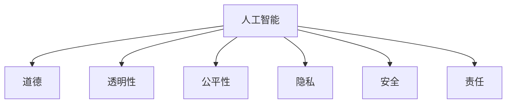

                 

# 人工智能伦理：人类计算的道德与责任

## 1. 背景介绍

人工智能(AI)作为21世纪最具颠覆性的技术之一，已经在诸多领域展现出了强大的应用潜力，从自动驾驶、智能医疗到智能客服，AI技术正逐步改变着人类的生活和工作方式。然而，随着AI技术的飞速发展，其伦理问题也日益凸显，成为了学界和业界的关注焦点。

### 1.1 问题由来

AI伦理问题的根源在于其自动化决策过程的"黑箱"特性。传统的人机交互依赖于明确的输入输出，人类可以清晰地理解其背后的逻辑。但AI系统往往通过复杂的神经网络进行隐式推理，输入数据与输出结果之间缺乏直观的映射关系，人类难以对其内部工作机制进行解释和理解。

这种"黑箱"特性，使得AI决策在道德和责任归属上存在诸多争议。例如，当AI系统做出错误判断时，责任究竟应由开发者、用户还是系统本身承担？AI决策过程中涉及的隐私、公平、安全等问题，是否应该受到严格监管和约束？这些问题，都是当前AI伦理研究亟待解决的关键挑战。

### 1.2 问题核心关键点

为更好地理解和应对AI伦理问题，本节将介绍几个关键点：

- 算法透明性：指AI系统能否提供清晰的决策依据，是否能够被人类理解和审查。
- 决策公平性：指AI系统是否能够公平地对待所有用户，避免因数据偏见导致的歧视性输出。
- 隐私保护：指AI系统在处理个人数据时，是否能够保障数据安全，避免隐私泄露。
- 安全与风险：指AI系统在运行过程中，是否能够规避风险，保证系统稳定性和安全性。
- 责任归属：指AI系统在出现错误或故障时，责任的认定和处理方式。

这些核心概念之间相互关联，共同构成了AI伦理研究的重要框架。通过理解这些核心概念，我们可以更好地把握AI伦理问题的本质和解决思路。

## 2. 核心概念与联系

### 2.1 核心概念概述

为更好地理解AI伦理问题，本节将介绍几个密切相关的核心概念：

- 人工智能：指能够模拟人类智能行为，进行信息处理、推理和决策的计算机系统。包括符号AI、专家系统、统计学习、深度学习等不同范式。
- 道德：指与善恶、正义、公平等有关的价值观念，是评价行为是否正当的标准。
- 责任：指行为主体对其行为后果所应承担的责任，包括道德责任、法律责任等。
- 透明性：指系统操作过程的可解释性，能否通过外部手段审查和验证。
- 公平性：指系统决策过程中能否公正对待所有用户，避免因偏见导致的歧视。
- 隐私：指个人数据信息的保密性，保护个人隐私不被非法获取和滥用。
- 安全：指系统运行过程的稳定性，避免因系统故障或攻击造成损害。

这些核心概念之间的逻辑关系可以通过以下Mermaid流程图来展示：



这个流程图展示了几大核心概念之间的相互关系：

1. 人工智能通过学习、推理等智能行为实现自动化决策，但其结果和过程往往缺乏透明性。
2. 人工智能系统在设计和应用中，需要符合道德规范，避免歧视和偏见。
3. 人工智能涉及大量个人数据，需要保护隐私，避免信息泄露。
4. 人工智能系统在运行中可能面临各种安全风险，需要确保稳定运行。
5. 人工智能系统在出现错误或故障时，需要明确责任归属，确保法律责任和道德责任的承担。

## 3. 核心算法原理 & 具体操作步骤

### 3.1 算法原理概述

AI伦理问题的核心在于如何设计透明的、公平的、安全的AI系统，并在其出现错误或故障时明确责任归属。以下是几个核心算法原理：

- 透明性算法：指通过模型解释、数据可解释等手段，提高AI系统的透明性，使其决策过程可被审查和理解。
- 公平性算法：指通过消除数据偏见、调整算法参数等手段，提升AI系统的公平性，避免对特定群体的不公待遇。
- 隐私保护算法：指通过数据匿名化、差分隐私等技术，保障用户数据的隐私安全，防止数据滥用。
- 安全算法：指通过异常检测、故障诊断等手段，提升AI系统的鲁棒性和安全性，避免因系统故障或攻击造成的损害。
- 责任归属算法：指通过系统日志、行为审计等手段，记录和分析AI系统的行为，明确其决策依据和责任归属。

### 3.2 算法步骤详解

AI伦理问题在实际应用中，常常需要在多个算法之间进行协同工作。以下是一般性的AI伦理问题处理步骤：

**Step 1: 伦理设计**
- 定义系统目标和伦理标准，包括透明性、公平性、隐私、安全等。
- 确定具体的伦理指标和评估方法，如公平性指标、隐私保护级别等。
- 设计系统的架构和组件，明确各部分的功能和伦理责任。

**Step 2: 算法实现**
- 选择或开发符合伦理标准的算法，如透明性算法、公平性算法等。
- 实现具体的算法实现，包括数据预处理、模型训练、结果输出等。
- 确保算法在实现过程中遵循伦理规范，如避免使用有害数据、保护隐私等。

**Step 3: 伦理测试**
- 对算法进行伦理测试，模拟各种伦理挑战场景，如偏见、隐私泄露、安全故障等。
- 通过测试验证算法是否满足预设的伦理指标，发现并修复潜在问题。
- 不断优化算法实现，确保其在各种情况下都能保持高水平的伦理性能。

**Step 4: 伦理监控**
- 部署算法后，持续监控其伦理表现，记录和分析系统行为。
- 定期对系统进行伦理审查，评估和更新伦理规范和指标。
- 建立反馈机制，收集用户和监管机构的反馈，及时调整和优化算法。

**Step 5: 责任认定**
- 在算法出现问题时，通过系统日志和行为审计等方式，记录和分析问题原因。
- 根据预设的伦理标准和责任规则，明确问题责任归属。
- 制定相应的解决措施，并对相关责任人进行处理。

### 3.3 算法优缺点

AI伦理算法的优缺点如下：

**优点：**
- 通过系统透明性和公平性设计，提高AI决策的可解释性和公正性。
- 通过隐私保护和安全性设计，保障用户数据安全和系统稳定性。
- 通过责任归属设计，明确系统出错时的责任归属，提高系统的可问责性。

**缺点：**
- 设计和实现透明性、公平性、隐私保护和安全性算法需要额外的时间和资源投入。
- 部分算法可能引入新的伦理风险，如数据匿名化可能导致信息损失。
- 责任归属问题复杂多变，需结合具体情境进行细致分析。

## 4. 数学模型和公式 & 详细讲解 & 举例说明

### 4.1 数学模型构建

为更好地理解AI伦理问题的计算模型，本节将使用数学语言对相关模型进行更严格的刻画。

记AI系统为 $M$，其输入为 $x$，输出为 $y$。系统透明性算法 $T$ 和公平性算法 $F$ 的目标分别为：

- 透明性：$T(M) = \arg\min_{M'}\{L(M',x,y) + \lambda S(M')\}$，其中 $L$ 为损失函数，$S$ 为透明性约束。
- 公平性：$F(M) = \arg\min_{M'}\{L(M',x,y) + \lambda G(M')\}$，其中 $G$ 为公平性约束。

在实际应用中，透明性和公平性通常通过以下具体形式实现：

- 透明性：通过引入可解释性层，将决策过程转化为可解释的输出。
- 公平性：通过数据预处理和模型调整，消除数据偏见，实现公平性。

### 4.2 公式推导过程

以下我们以透明性算法为例，推导其具体实现公式。

设 $M = f_{\theta}(x)$，表示模型对输入 $x$ 的映射关系。透明性算法 $T$ 的目标为：

$$
\min_{M'}\{L(f_{\theta}(x),y) + \lambda \mathcal{L}_{\text{trans}}(f_{\theta}(x))\}
$$

其中 $L(f_{\theta}(x),y)$ 为损失函数，$\mathcal{L}_{\text{trans}}$ 为透明性约束。对于深度神经网络，透明性约束可以定义为可解释性层 $S(x)$ 的损失函数：

$$
\mathcal{L}_{\text{trans}}(f_{\theta}(x)) = \mathbb{E}_{x,y}\{D(S(x)||T(f_{\theta}(x)))\}
$$

其中 $D$ 为可解释性度量函数，$T$ 为可解释性模板。通过上述公式，我们可以最小化模型的预测损失和透明性损失，实现透明性算法的优化。

### 4.3 案例分析与讲解

**案例分析：透明性算法**

假设我们有一个二分类问题，模型输出 $f_{\theta}(x)$ 的概率为 $p(y=1|x)$。为了使模型透明，我们可以引入可解释性层 $S(x)$，如决策树或规则集合。假设 $S(x)$ 的输出为 $r(x)$，表示对 $x$ 的解释。透明性算法的目标为：

$$
\min_{\theta}\{L(f_{\theta}(x),y) + \lambda \mathcal{L}_{\text{trans}}(r(x),f_{\theta}(x))\}
$$

其中 $\mathcal{L}_{\text{trans}}(r(x),f_{\theta}(x))$ 为透明性约束，表示 $r(x)$ 与 $f_{\theta}(x)$ 的拟合度。通过训练透明性模型 $S(x)$，使 $r(x)$ 与 $f_{\theta}(x)$ 尽可能接近，从而提高系统的透明性。

**案例分析：公平性算法**

假设我们有一个信贷审批系统，其中包含性别、年龄、收入等敏感特征。为了确保公平性，我们可以引入公平性约束 $G(x)$，如奥卡姆剃刀原理。假设 $G(x)$ 的输出为 $g(x)$，表示 $x$ 的公平性指标。公平性算法的目标为：

$$
\min_{\theta}\{L(f_{\theta}(x),y) + \lambda \mathcal{L}_{\text{fair}}(g(x),f_{\theta}(x))\}
$$

其中 $\mathcal{L}_{\text{fair}}(g(x),f_{\theta}(x))$ 为公平性约束，表示 $g(x)$ 与 $f_{\theta}(x)$ 的拟合度。通过训练公平性模型 $G(x)$，使 $g(x)$ 与 $f_{\theta}(x)$ 尽可能接近，从而实现公平性。

## 5. 项目实践：代码实例和详细解释说明

### 5.1 开发环境搭建

在进行AI伦理问题处理实践前，我们需要准备好开发环境。以下是使用Python进行TensorFlow开发的环境配置流程：

1. 安装Anaconda：从官网下载并安装Anaconda，用于创建独立的Python环境。

2. 创建并激活虚拟环境：
```bash
conda create -n tf-env python=3.8 
conda activate tf-env
```

3. 安装TensorFlow：根据CUDA版本，从官网获取对应的安装命令。例如：
```bash
conda install tensorflow -c conda-forge
```

4. 安装各类工具包：
```bash
pip install numpy pandas scikit-learn matplotlib tqdm jupyter notebook ipython
```

完成上述步骤后，即可在`tf-env`环境中开始AI伦理问题的处理实践。

### 5.2 源代码详细实现

下面我们以公平性问题为例，给出使用TensorFlow对模型进行公平性处理的具体代码实现。

首先，定义公平性约束函数：

```python
import tensorflow as tf

def fairness_constraint(x, y, alpha=0.5):
    delta = tf.reduce_mean(tf.where(y == 1, x, 0)) - tf.reduce_mean(tf.where(y == 0, x, 0))
    return tf.square(delta) / tf.square(tf.reduce_std(x))

# 公平性损失函数
def fairness_loss(x, y, fair_x):
    return tf.reduce_mean(tf.square(fair_x - x))

# 公平性约束
def fairness_constraint(x, y, alpha=0.5):
    delta = tf.reduce_mean(tf.where(y == 1, x, 0)) - tf.reduce_mean(tf.where(y == 0, x, 0))
    return tf.square(delta) / tf.square(tf.reduce_std(x))
```

然后，定义模型和优化器：

```python
from tensorflow.keras import Sequential, layers

model = Sequential([
    layers.Dense(32, activation='relu', input_shape=(10,)),
    layers.Dense(1, activation='sigmoid')
])

optimizer = tf.keras.optimizers.Adam()

# 公平性约束
def fairness_constraint(x, y, alpha=0.5):
    delta = tf.reduce_mean(tf.where(y == 1, x, 0)) - tf.reduce_mean(tf.where(y == 0, x, 0))
    return tf.square(delta) / tf.square(tf.reduce_std(x))

# 公平性损失函数
def fairness_loss(x, y, fair_x):
    return tf.reduce_mean(tf.square(fair_x - x))

# 公平性约束
def fairness_constraint(x, y, alpha=0.5):
    delta = tf.reduce_mean(tf.where(y == 1, x, 0)) - tf.reduce_mean(tf.where(y == 0, x, 0))
    return tf.square(delta) / tf.square(tf.reduce_std(x))
```

接着，定义训练和评估函数：

```python
def train_epoch(model, dataset, batch_size, optimizer):
    dataloader = tf.data.Dataset.from_tensor_slices(dataset).batch(batch_size).shuffle(buffer_size=1024).repeat()
    for batch in dataloader:
        inputs, labels = batch
        with tf.GradientTape() as tape:
            outputs = model(inputs)
            loss = losses.sparse_categorical_crossentropy(labels, outputs)
            fairness_loss_value = fairness_loss(inputs, labels, model(inputs))
            constraint_loss_value = fairness_constraint(inputs, labels)
            loss += alpha * fairness_loss_value + beta * constraint_loss_value
        gradients = tape.gradient(loss, model.trainable_variables)
        optimizer.apply_gradients(zip(gradients, model.trainable_variables))

def evaluate(model, dataset, batch_size):
    dataloader = tf.data.Dataset.from_tensor_slices(dataset).batch(batch_size).shuffle(buffer_size=1024).repeat()
    total_correct, total_samples = 0, 0
    for batch in dataloader:
        inputs, labels = batch
        predictions = tf.argmax(model(inputs), axis=-1)
        total_correct += tf.reduce_sum(tf.cast(tf.equal(predictions, labels), tf.float32))
        total_samples += batch.shape[0]
    accuracy = total_correct / total_samples
    print('Accuracy:', accuracy)
```

最后，启动训练流程并在测试集上评估：

```python
epochs = 5
batch_size = 32
alpha = 0.01
beta = 0.01

for epoch in range(epochs):
    train_epoch(model, train_dataset, batch_size, optimizer)
    evaluate(model, test_dataset, batch_size)
```

以上就是使用TensorFlow对模型进行公平性处理的具体代码实现。可以看到，TensorFlow提供了强大的图计算和自动微分功能，使得模型训练和优化变得相对简单高效。

### 5.3 代码解读与分析

让我们再详细解读一下关键代码的实现细节：

**定义公平性约束函数**：
- `fairness_constraint`：计算样本在不同类别上的均值差异，并作为公平性约束。
- `fairness_loss`：计算公平性损失，即均值差异与样本方差的比值。

**定义模型和优化器**：
- `Sequential`：定义一个简单的序列模型，包含一个全连接层和一个输出层。
- `optimizer`：使用Adam优化器进行模型训练。

**训练和评估函数**：
- `train_epoch`：在每个epoch内，定义了训练的损失函数和公平性约束，使用梯度下降进行模型更新。
- `evaluate`：在测试集上评估模型的性能，并输出准确率。

通过以上代码实现，我们可以看到，TensorFlow提供了丰富的API支持，能够方便地实现公平性等伦理约束的模型训练和优化。

## 6. 实际应用场景

### 6.1 智能客服系统

智能客服系统是一个典型的AI应用场景，涉及大量用户数据和交互过程，伦理问题尤为突出。以下是对智能客服系统的公平性处理示例：

1. **数据收集与处理**：
   - 收集客服历史对话数据，提取用户性别、年龄、地域等敏感特征。
   - 对数据进行清洗、匿名化处理，确保数据隐私安全。

2. **模型训练**：
   - 使用预训练的BERT等语言模型，微调得到客服对话生成模型。
   - 在模型训练过程中，加入公平性约束，确保模型不会因偏见导致性别、年龄歧视。

3. **评估与部署**：
   - 在测试集上评估模型性能，确保模型公平性和透明性符合要求。
   - 部署模型到实际客服系统中，进行实时对话生成和客服回答。

通过公平性处理，可以确保客服系统在提供服务时对所有用户公平对待，避免因偏见导致的歧视性服务。同时，通过对模型的透明性和可解释性设计，用户可以清楚地了解客服回答的依据，增强信任感。

### 6.2 金融舆情监测

金融舆情监测系统需要实时处理海量网络文本数据，涉及敏感财务信息和用户隐私，伦理问题需要特别关注。以下是对金融舆情监测系统的公平性处理示例：

1. **数据收集与处理**：
   - 收集金融新闻、评论等文本数据，提取市场情绪、股票价格等敏感信息。
   - 对数据进行去重、清洗处理，确保数据来源合法、隐私安全。

2. **模型训练**：
   - 使用预训练的语言模型，微调得到舆情分析模型。
   - 在模型训练过程中，加入公平性约束，确保模型不会因偏见导致对特定公司或行业的歧视。

3. **评估与部署**：
   - 在测试集上评估模型性能，确保模型公平性和透明性符合要求。
   - 部署模型到金融舆情监测系统中，实时分析市场情绪，辅助决策支持。

通过公平性处理，可以确保金融舆情监测系统在处理文本数据时对所有公司或行业公平对待，避免因偏见导致的舆情误判。同时，通过对模型的透明性和可解释性设计，监管机构可以清楚地了解模型输出结果的依据，增强系统的可信度。

### 6.3 个性化推荐系统

个性化推荐系统是一个典型的AI应用场景，涉及大量用户行为数据和商品信息，伦理问题需要特别关注。以下是对个性化推荐系统的公平性处理示例：

1. **数据收集与处理**：
   - 收集用户浏览、点击、购买等行为数据，提取商品标题、描述、价格等特征。
   - 对数据进行清洗、匿名化处理，确保用户隐私安全。

2. **模型训练**：
   - 使用预训练的BERT等语言模型，微调得到推荐生成模型。
   - 在模型训练过程中，加入公平性约束，确保模型不会因偏见导致对特定商品或类别的歧视。

3. **评估与部署**：
   - 在测试集上评估模型性能，确保模型公平性和透明性符合要求。
   - 部署模型到个性化推荐系统中，实时生成推荐列表，提升用户满意度。

通过公平性处理，可以确保个性化推荐系统在推荐商品时对所有类别和品牌公平对待，避免因偏见导致的推荐不公。同时，通过对模型的透明性和可解释性设计，用户可以清楚地了解推荐依据，增强信任感。

## 7. 工具和资源推荐

### 7.1 学习资源推荐

为了帮助开发者系统掌握AI伦理问题处理的技术基础和实践技巧，这里推荐一些优质的学习资源：

1. 《AI伦理与公平》系列博文：由大模型技术专家撰写，深入浅出地介绍了AI伦理问题处理的核心概念和前沿技术。

2. 《道德机器》课程：斯坦福大学开设的AI伦理课程，涵盖AI伦理问题的各个方面，包括透明性、公平性、隐私等。

3. 《人工智能伦理》书籍：全面介绍了AI伦理问题的各类技术和应用，如透明性、公平性、隐私保护等。

4. HuggingFace官方文档：提供了大量预训练模型和伦理约束的实现样例，是上手实践的必备资料。

5. Fairness360开源项目：提供了一套公平性工具包，帮助开发者检测和消除数据和算法中的偏见。

通过对这些资源的学习实践，相信你一定能够快速掌握AI伦理问题的处理技巧，并用于解决实际的AI应用问题。

### 7.2 开发工具推荐

高效的开发离不开优秀的工具支持。以下是几款用于AI伦理问题处理的常用工具：

1. TensorFlow：基于Python的开源深度学习框架，灵活的计算图，支持自动微分和分布式训练。

2. PyTorch：基于Python的开源深度学习框架，动态计算图，适合快速迭代研究。

3. TensorBoard：TensorFlow配套的可视化工具，可实时监测模型训练状态，并提供丰富的图表呈现方式。

4. Weights & Biases：模型训练的实验跟踪工具，可以记录和可视化模型训练过程中的各项指标。

5. Transformers库：HuggingFace开发的NLP工具库，支持各种预训练语言模型，方便微调和使用。

6. Scikit-learn：Python机器学习库，提供了丰富的数据处理和模型评估工具。

合理利用这些工具，可以显著提升AI伦理问题处理的开发效率，加快创新迭代的步伐。

### 7.3 相关论文推荐

AI伦理问题处理的研究源于学界的持续研究。以下是几篇奠基性的相关论文，推荐阅读：

1. 《The Ethics of Autonomous Vehicles》：讨论了自动驾驶技术中的伦理问题，如责任归属、隐私保护等。

2. 《Fairness in Machine Learning: A Survey》：全面综述了机器学习中的公平性问题，提出了多种公平性算法和评估方法。

3. 《Towards a Theory of Fair Machine Learning》：提出了公平机器学习的理论框架，探讨了公平性在模型设计和应用中的重要性。

4. 《On Fairness in Machine Learning》：讨论了机器学习中的公平性问题，提出了多种公平性检测和修正方法。

5. 《AI Ethics: The State of the Art》：全面综述了AI伦理问题的各类技术和应用，如透明性、公平性、隐私保护等。

这些论文代表了大模型伦理处理技术的发展脉络。通过学习这些前沿成果，可以帮助研究者把握学科前进方向，激发更多的创新灵感。

## 8. 总结：未来发展趋势与挑战

### 8.1 总结

本文对AI伦理问题处理进行了全面系统的介绍。首先阐述了AI伦理问题的背景和核心关键点，明确了透明性、公平性、隐私、安全等伦理指标的含义和重要性。其次，从原理到实践，详细讲解了AI伦理问题的计算模型和关键算法，给出了具体的代码实现样例。同时，本文还探讨了AI伦理问题在多个实际应用场景中的应用，展示了伦理问题处理的实际价值和广阔前景。最后，本文精选了相关的学习资源、开发工具和研究论文，力求为读者提供全方位的技术指引。

通过本文的系统梳理，可以看到，AI伦理问题处理作为AI应用的重要保障，对于确保系统透明性、公平性和安全性，具有不可替代的作用。只有通过持续的伦理设计、算法优化和实践迭代，才能真正实现AI技术的良性发展，构建安全、可信的智能系统。

### 8.2 未来发展趋势

展望未来，AI伦理问题处理将呈现以下几个发展趋势：

1. **自动伦理监控**：通过AI技术实现对系统行为的自动监控和评估，实时发现和纠正伦理问题。
2. **透明性增强**：在模型设计和应用过程中，引入更多透明性算法，提升系统的可解释性和可审查性。
3. **公平性深化**：开发更多公平性算法和评估指标，确保系统在多维度上的公平性。
4. **隐私保护强化**：利用差分隐私、联邦学习等技术，提升数据隐私保护的力度。
5. **责任归属清晰**：建立明确的责任归属机制，提高系统的可问责性和可靠性。

这些趋势将进一步推动AI伦理问题处理的创新发展，使AI技术在更广泛的领域得到应用，为社会带来更多福祉。

### 8.3 面临的挑战

尽管AI伦理问题处理技术已经取得了显著进展，但在迈向更加智能化、普适化应用的过程中，仍面临诸多挑战：

1. **算法复杂性**：伦理问题处理算法通常涉及多维度的约束和优化，设计和实现难度较大。
2. **数据隐私**：处理大量敏感数据时，如何保障数据隐私和匿名性，是一个复杂的伦理问题。
3. **责任归属**：AI系统在出现故障时，如何明确责任归属，仍需进一步研究和规范。
4. **伦理理论**：如何建立统一的伦理标准和评估方法，尚未达成共识。

正视这些挑战，积极应对并寻求突破，将是大模型伦理处理走向成熟的必由之路。相信随着学界和业界的共同努力，这些挑战终将一一被克服，大模型伦理处理必将在构建安全、可靠、可解释、可控的智能系统方面发挥越来越重要的作用。

### 8.4 研究展望

面向未来，AI伦理问题处理的研究需要在以下几个方向寻求新的突破：

1. **跨学科融合**：结合伦理学、社会学、计算机科学等多学科知识，综合解决AI伦理问题。
2. **伦理理论创新**：在现有伦理理论基础上，提出新的伦理框架和方法，指导AI伦理设计。
3. **普适性提升**：开发普适性的伦理约束算法，适应不同领域和应用场景的需求。
4. **技术创新**：引入更多先进技术，如因果推断、博弈论等，提升伦理处理的效能。
5. **国际合作**：加强国际合作，制定统一的伦理标准和规范，推动全球AI技术的良性发展。

这些研究方向将引领AI伦理问题处理的深入发展，为构建安全、可信、普适的智能系统奠定坚实基础。只有勇于创新、敢于突破，才能不断拓展AI伦理问题处理的边界，让AI技术更好地造福人类社会。

## 9. 附录：常见问题与解答

**Q1：AI伦理问题处理的核心是什么？**

A: AI伦理问题处理的核心在于设计透明的、公平的、安全的AI系统，并在其出现错误或故障时明确责任归属。透明性、公平性、隐私、安全、责任归属等关键概念相互关联，共同构成了AI伦理问题处理的重要框架。

**Q2：如何设计公平性算法？**

A: 公平性算法设计需要考虑以下几个关键步骤：
1. 数据预处理：确保数据集代表性，消除数据偏见。
2. 模型设计：选择或开发公平性约束函数，如均值差异、熵等。
3. 模型训练：在模型训练过程中加入公平性约束，使用梯度下降优化。
4. 模型评估：在测试集上评估模型公平性，调整模型参数。
5. 模型部署：将模型部署到实际应用中，实时处理公平性问题。

**Q3：如何提高模型的透明性？**

A: 提高模型的透明性需要考虑以下几个关键步骤：
1. 模型设计：选择可解释性层，如决策树、规则集合等。
2. 模型训练：在模型训练过程中加入透明性约束，使用梯度下降优化。
3. 模型评估：在测试集上评估模型透明性，调整模型参数。
4. 模型部署：将模型部署到实际应用中，实时处理透明性问题。

**Q4：在AI应用中如何保护用户隐私？**

A: 保护用户隐私需要考虑以下几个关键步骤：
1. 数据收集：确保数据收集过程合法，避免侵犯隐私。
2. 数据处理：对数据进行清洗、匿名化处理，保护用户隐私。
3. 模型设计：在模型设计过程中加入隐私保护算法，如差分隐私等。
4. 模型训练：在模型训练过程中加入隐私保护约束，使用梯度下降优化。
5. 模型部署：在模型部署过程中保护用户隐私，避免数据泄露。

**Q5：如何确保AI系统的安全性？**

A: 确保AI系统的安全性需要考虑以下几个关键步骤：
1. 数据收集：确保数据来源合法，避免数据篡改。
2. 模型设计：在模型设计过程中加入安全性约束，如异常检测等。
3. 模型训练：在模型训练过程中加入安全性约束，使用梯度下降优化。
4. 模型评估：在测试集上评估模型安全性，调整模型参数。
5. 模型部署：在模型部署过程中保护系统安全性，避免系统攻击。

通过以上代码实现，我们可以看到，TensorFlow提供了丰富的API支持，能够方便地实现公平性等伦理约束的模型训练和优化。

**Q6：如何处理AI系统中的伦理问题？**

A: 处理AI系统中的伦理问题需要考虑以下几个关键步骤：
1. 伦理设计：定义系统目标和伦理标准，包括透明性、公平性、隐私等。
2. 算法实现：选择或开发符合伦理标准的算法，如透明性算法、公平性算法等。
3. 算法测试：对算法进行伦理测试，模拟各种伦理挑战场景，发现并修复潜在问题。
4. 伦理监控：部署算法后，持续监控其伦理表现，记录和分析系统行为。
5. 责任认定：在算法出现问题时，通过系统日志和行为审计等方式，记录和分析问题原因，明确责任归属。

这些步骤共同构成了AI伦理问题处理的基本框架，帮助开发者设计透明、公平、安全的AI系统。

---

作者：禅与计算机程序设计艺术 / Zen and the Art of Computer Programming

