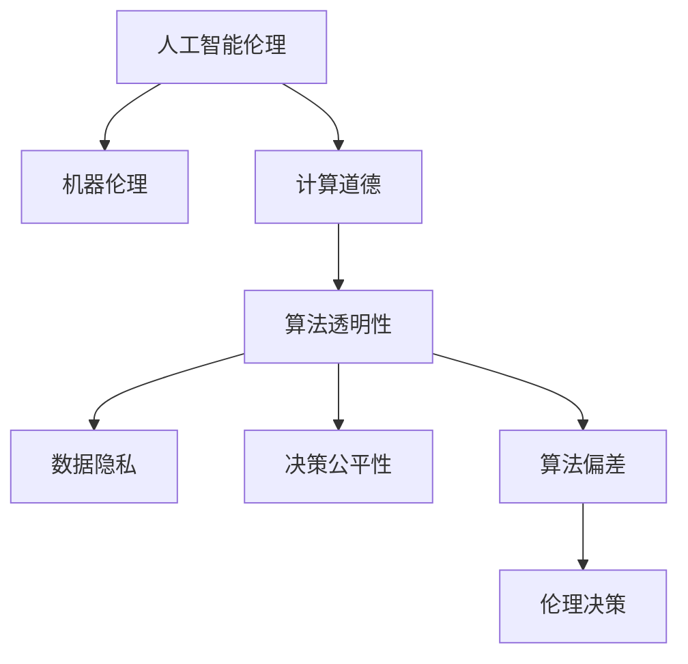

                 

# 人工智能伦理：人类计算的道德思考

> 关键词：人工智能伦理,机器伦理,计算道德,人工智能决策,人类计算,算法透明性,数据隐私,伦理准则,伦理评估,可解释性

## 1. 背景介绍

### 1.1 问题由来
随着人工智能（AI）技术的快速发展，其在医疗、金融、教育等各个领域的应用越来越广泛。人工智能的自动化决策、大规模数据处理等能力，极大地提高了社会生产效率，但也引发了一系列伦理道德问题。

这些问题主要包括：
- 数据隐私：如何保护个人数据的隐私不被滥用。
- 算法透明性：AI决策过程是否可解释，是否具有透明性。
- 决策公平性：AI模型是否能够保证不同群体、性别等的公平性。
- 算法偏差：AI模型是否会放大或引入数据中的偏见。
- 伦理决策：AI系统在执行伦理决策时是否符合人类价值观和伦理规范。

这些问题已经引起了广泛的社会关注，并在多个国家引起了法律和道德讨论。本文将围绕这些核心问题，探讨人工智能伦理的基本原理和解决思路。

### 1.2 问题核心关键点
人工智能伦理问题涉及多个交叉学科，包括伦理学、法律、社会学、计算机科学等。要解决这些问题，需要综合运用这些领域的知识。

- **数据隐私**：保护数据隐私是人工智能伦理的基础，涉及隐私保护法律、数据匿名化技术等。
- **算法透明性**：算法透明性是保证AI决策可信性的重要手段，需要引入可解释AI技术，提供AI决策的推理路径。
- **决策公平性**：确保AI决策的公平性，需要引入公平性评估技术，如对数据集进行性别、种族等属性的分析。
- **算法偏差**：避免算法偏差，需要引入偏差检测和修正技术，如公平性校准等。
- **伦理决策**：引入伦理评估机制，使得AI决策符合社会公德和伦理规范。

这些核心关键点构成了人工智能伦理研究的框架，帮助我们在技术和社会两个维度上，综合考虑伦理道德问题。

## 2. 核心概念与联系

### 2.1 核心概念概述

为更好地理解人工智能伦理的基本原理，本节将介绍几个关键概念：

- **人工智能伦理**：涉及AI系统在开发、使用、应用等全生命周期中的伦理问题。
- **机器伦理**：机器在学习、决策、推理等过程中，是否符合伦理准则的问题。
- **计算道德**：在计算机辅助决策、控制等过程中，是否符合道德规范的问题。
- **算法透明性**：AI系统决策过程是否可解释，是否具有透明性。
- **数据隐私**：在数据收集、存储、使用等过程中，如何保护个人隐私不被滥用。
- **决策公平性**：AI系统在决策过程中，是否能够保证不同群体、性别等的公平性。
- **算法偏差**：AI系统在学习和决策过程中，是否会放大或引入数据中的偏见。
- **伦理决策**：AI系统在执行伦理决策时，是否符合人类价值观和伦理规范。

这些核心概念之间的逻辑关系可以通过以下Mermaid流程图来展示：



这个流程图展示了大语言模型的核心概念及其之间的关系：

1. 人工智能伦理包括机器伦理和计算道德，涉及AI系统全生命周期的伦理问题。
2. 机器伦理强调AI系统在学习、决策过程中的伦理准则，涉及算法透明性、数据隐私等。
3. 计算道德关注计算机辅助决策、控制过程中的道德规范。
4. 算法透明性、数据隐私、决策公平性、算法偏差等是实现机器伦理和计算道德的重要手段。
5. 伦理决策是AI系统执行决策的终极目标，要求符合人类价值观和伦理规范。

这些概念共同构成了人工智能伦理的研究框架，为解决伦理道德问题提供了理论指导。

## 3. 核心算法原理 & 具体操作步骤
### 3.1 算法原理概述

人工智能伦理问题涉及多个核心算法，主要包括：

- **数据隐私保护算法**：用于保护个人数据的隐私不被滥用。
- **算法透明性技术**：用于提供AI决策的推理路径，确保算法的可解释性。
- **决策公平性评估算法**：用于评估AI决策是否公平，识别算法中的偏见。
- **偏差检测和修正算法**：用于检测和修正算法中的偏见，提高决策的公平性。
- **伦理决策评估机制**：用于评估AI系统在执行伦理决策时的合规性。

这些算法的原理和操作步骤如下：

### 3.2 算法步骤详解

#### 数据隐私保护算法

数据隐私保护算法主要包括以下几个步骤：

1. **数据匿名化**：将个人标识信息替换为伪匿名化标识，如使用哈希函数、加密技术等。
2. **数据分割**：将数据分割为公共数据和隐私数据，只使用公共数据进行模型训练。
3. **差分隐私**：在模型训练过程中，加入噪声干扰，确保个体数据不被泄露。
4. **访问控制**：对数据访问进行严格控制，确保数据只被授权用户使用。

#### 算法透明性技术

算法透明性技术主要包括以下几个步骤：

1. **模型可解释性**：提供AI决策的推理路径，如使用LIME、SHAP等工具进行模型解释。
2. **决策树可视化**：使用决策树可视化工具，展示模型决策过程。
3. **模型版本管理**：记录和追踪模型的版本变化，确保模型透明性。
4. **模型审计**：定期对模型进行审计，确保模型符合伦理准则。

#### 决策公平性评估算法

决策公平性评估算法主要包括以下几个步骤：

1. **公平性指标定义**：定义公平性指标，如差异性指标（Disparate Impact）、独立性指标（Independence）等。
2. **数据集分析**：对数据集进行性别、种族等属性的分析，识别潜在偏见。
3. **偏差检测**：使用偏差检测技术，如公平性校准、偏差识别等。
4. **偏差修正**：使用偏差修正技术，如重新采样、重新加权等。

#### 偏差检测和修正算法

偏差检测和修正算法主要包括以下几个步骤：

1. **偏差检测**：使用偏差检测技术，如公平性校准、偏差识别等。
2. **偏差修正**：使用偏差修正技术，如重新采样、重新加权等。
3. **公平性校准**：对模型进行公平性校准，确保模型决策的公平性。
4. **模型监控**：对模型进行持续监控，确保偏差不再引入。

#### 伦理决策评估机制

伦理决策评估机制主要包括以下几个步骤：

1. **伦理准则制定**：制定伦理准则，确保AI决策符合社会公德和伦理规范。
2. **伦理评估**：对AI决策进行伦理评估，确保决策符合伦理准则。
3. **伦理监督**：对AI系统进行伦理监督，确保系统符合伦理准则。
4. **伦理培训**：对AI开发者进行伦理培训，确保开发过程符合伦理准则。

### 3.3 算法优缺点

人工智能伦理问题涉及多个核心算法，各算法具有以下优缺点：

- **数据隐私保护算法**
  - **优点**：有效保护个人隐私，防止数据滥用。
  - **缺点**：可能增加数据处理复杂度，影响模型性能。

- **算法透明性技术**
  - **优点**：提高AI决策的可解释性，增强公众信任。
  - **缺点**：可能降低模型性能，增加实现难度。

- **决策公平性评估算法**
  - **优点**：提高AI决策的公平性，防止偏见引入。
  - **缺点**：可能增加模型复杂度，影响模型性能。

- **偏差检测和修正算法**
  - **优点**：提高模型决策的公平性，减少偏见。
  - **缺点**：可能增加模型复杂度，影响模型性能。

- **伦理决策评估机制**
  - **优点**：确保AI决策符合伦理规范，增强系统可信性。
  - **缺点**：可能增加系统复杂度，影响决策速度。

尽管这些算法具有各自的优缺点，但在实际应用中，需要通过综合权衡，选择最适合特定场景的算法组合，以实现最佳效果。

### 3.4 算法应用领域

人工智能伦理问题涉及多个应用领域，主要包括：

- **医疗**：保护患者隐私，确保医疗决策的公平性，防止算法偏见。
- **金融**：保护客户隐私，确保金融决策的公平性，防止算法偏见。
- **教育**：保护学生隐私，确保教育决策的公平性，防止算法偏见。
- **司法**：保护犯罪嫌疑人和受害者的隐私，确保司法决策的公平性，防止算法偏见。
- **人力资源**：保护员工隐私，确保招聘和晋升决策的公平性，防止算法偏见。
- **交通**：保护乘客隐私，确保交通决策的公平性，防止算法偏见。

这些领域的应用场景不同，但都面临类似的人工智能伦理问题。通过综合应用上述算法，可以更好地解决这些伦理道德问题，提升AI系统的可信性和社会接受度。

## 4. 数学模型和公式 & 详细讲解
### 4.1 数学模型构建

本节将使用数学语言对人工智能伦理的基本原理进行更加严格的刻画。

假设有一组数据集 $D=\{(x_i, y_i)\}_{i=1}^N$，其中 $x_i$ 为输入特征，$y_i$ 为输出标签。使用机器学习算法 $M_{\theta}$ 对数据集进行训练，得到模型参数 $\theta$。模型 $M_{\theta}$ 的输出为 $M_{\theta}(x)$，其与真实标签 $y$ 的差异度量为损失函数 $L(M_{\theta}, y)$。

在数据隐私保护算法中，我们引入隐私保护技术，将数据集 $D$ 划分为公共数据集 $D^P$ 和隐私数据集 $D^P$，公共数据集用于模型训练，隐私数据集用于隐私保护。

在算法透明性技术中，我们引入可解释性技术，对模型 $M_{\theta}$ 进行解释，得到解释模型 $M^E_{\theta}$，其输出为 $M^E_{\theta}(x)$，解释模型与真实标签的差异度量为解释损失函数 $L^E(M^E_{\theta}, y)$。

在决策公平性评估算法中，我们引入公平性指标 $F$，评估模型 $M_{\theta}$ 在不同群体之间的公平性，得到公平性评估结果 $F(M_{\theta})$。

在偏差检测和修正算法中，我们引入偏差检测技术 $D$，检测模型 $M_{\theta}$ 中的偏差，得到偏差结果 $D(M_{\theta})$。

在伦理决策评估机制中，我们引入伦理准则 $E$，评估模型 $M_{\theta}$ 的伦理合规性，得到伦理评估结果 $E(M_{\theta})$。

这些模型和算法的关系可以通过以下公式来表示：

$$
M_{\theta} = M^E_{\theta} \text{ 和 } L(M_{\theta}, y) = L^E(M^E_{\theta}, y)
$$

$$
F(M_{\theta}) = F^E(M^E_{\theta}) \text{ 和 } D(M_{\theta}) = D^E(M^E_{\theta})
$$

$$
E(M_{\theta}) = E^E(M^E_{\theta})
$$

通过这些公式，我们可以更加清晰地理解人工智能伦理的基本原理和实现过程。

### 4.2 公式推导过程

以决策公平性评估算法为例，推导公平性指标 $F$ 和公平性评估结果 $F(M_{\theta})$ 的计算公式。

假设模型 $M_{\theta}$ 在输入 $x$ 上的输出为 $\hat{y}=M_{\theta}(x)$，真实标签 $y \in \{0,1\}$。定义模型在输入 $x$ 上的公平性指标 $F$ 为：

$$
F(x) = \frac{1}{N} \sum_{i=1}^N \frac{|y_i - \hat{y}_i|}{\max(y_i, \hat{y}_i)}
$$

其中 $y_i - \hat{y}_i$ 表示模型的预测误差，$\max(y_i, \hat{y}_i)$ 表示模型预测结果与真实标签的最大值，用于避免负无穷大的问题。

在数据集 $D=\{(x_i, y_i)\}_{i=1}^N$ 上，模型 $M_{\theta}$ 的公平性评估结果 $F(M_{\theta})$ 为：

$$
F(M_{\theta}) = \frac{1}{N} \sum_{i=1}^N \frac{|y_i - \hat{y}_i|}{\max(y_i, \hat{y}_i)}
$$

通过上述公式，我们可以计算模型在不同输入上的公平性指标，从而评估模型的公平性。

## 5. 项目实践：代码实例和详细解释说明
### 5.1 开发环境搭建

在进行人工智能伦理问题实践前，我们需要准备好开发环境。以下是使用Python进行TensorFlow开发的环境配置流程：

1. 安装Anaconda：从官网下载并安装Anaconda，用于创建独立的Python环境。

2. 创建并激活虚拟环境：
```bash
conda create -n tf-env python=3.8 
conda activate tf-env
```

3. 安装TensorFlow：根据CUDA版本，从官网获取对应的安装命令。例如：
```bash
conda install tensorflow -c pytorch -c conda-forge
```

4. 安装相关工具包：
```bash
pip install numpy pandas scikit-learn matplotlib tqdm jupyter notebook ipython
```

完成上述步骤后，即可在`tf-env`环境中开始人工智能伦理问题的实践。

### 5.2 源代码详细实现

这里我们以决策公平性评估算法为例，给出使用TensorFlow进行公平性评估的PyTorch代码实现。

首先，定义数据集：

```python
import tensorflow as tf
import numpy as np

# 假设数据集D，包含训练数据和测试数据
train_data = np.random.rand(1000, 10)
test_data = np.random.rand(1000, 10)

# 定义模型
def model(x):
    W = tf.Variable(tf.random.normal([10, 1]))
    b = tf.Variable(tf.zeros([1]))
    return tf.sigmoid(tf.matmul(x, W) + b)

# 定义公平性指标函数
def fairness_metric(y_true, y_pred):
    y_pred = tf.sigmoid(y_pred)
    delta = y_true - y_pred
    return tf.reduce_mean(tf.math.maximum(delta, 0.0))

# 计算公平性评估结果
model = tf.keras.Sequential()
model.add(tf.keras.layers.Dense(1, input_shape=(10,), activation='sigmoid'))

# 训练模型
model.compile(optimizer='adam', loss=fairness_metric)
model.fit(train_data, train_data, epochs=100, batch_size=32, validation_data=(test_data, test_data))

# 评估模型
print("公平性评估结果：", model.evaluate(test_data, test_data)[1])
```

然后，在评估模型时，我们将使用TensorFlow的`tf.keras`模块，构建模型，并定义公平性指标函数。训练模型时，我们使用公平性指标作为损失函数，进行模型训练。最终，我们计算模型在测试数据上的公平性评估结果。

### 5.3 代码解读与分析

让我们再详细解读一下关键代码的实现细节：

**数据集定义**：
- `train_data` 和 `test_data` 分别表示训练数据和测试数据，随机生成10维的特征向量。
- 训练数据和测试数据都是用于模型训练和评估的，需要保持一致。

**模型定义**：
- 使用`tf.keras.Sequential`构建模型，包含一个10维到1维的线性层，并使用`sigmoid`作为激活函数。
- 通过`add`方法，添加线性层到模型中。

**公平性指标函数**：
- `fairness_metric` 函数计算模型的公平性指标，使用`tf.sigmoid`计算模型输出，使用`delta`计算预测误差，并使用`tf.math.maximum`函数确保误差非负。
- 最后使用`tf.reduce_mean`计算公平性指标的平均值。

**模型训练**：
- 使用`model.compile`方法，设置优化器为`adam`，损失函数为公平性指标函数。
- 使用`model.fit`方法，对模型进行训练，传入训练数据、测试数据，设置迭代轮数为100，批次大小为32。

**模型评估**：
- 使用`model.evaluate`方法，计算模型在测试数据上的公平性评估结果。
- 最终输出公平性评估结果。

通过上述代码，我们实现了基于TensorFlow的决策公平性评估算法，展示了如何计算模型的公平性指标，并使用模型评估结果来评估模型的公平性。

## 6. 实际应用场景
### 6.1 医疗行业

在医疗行业中，保护患者隐私和确保医疗决策的公平性尤为重要。例如，使用AI系统进行医疗影像诊断时，需要确保影像数据的安全性，避免数据泄露。同时，AI系统需要公平地对待不同性别的患者，避免算法偏见。

在技术实现上，可以收集医疗影像数据，并对其进行匿名化处理，确保患者隐私不被泄露。同时，使用公平性评估算法，对AI系统进行公平性评估，确保决策的公平性。

### 6.2 金融行业

在金融行业中，保护客户隐私和确保金融决策的公平性同样重要。例如，使用AI系统进行信用评估时，需要确保客户的敏感信息不被泄露。同时，AI系统需要公平地对待不同收入、年龄、性别的客户，避免算法偏见。

在技术实现上，可以收集客户的信用数据，并进行匿名化处理，确保客户隐私不被泄露。同时，使用公平性评估算法，对AI系统进行公平性评估，确保决策的公平性。

### 6.3 教育行业

在教育行业中，保护学生隐私和确保教育决策的公平性同样重要。例如，使用AI系统进行个性化推荐时，需要确保学生的学习数据不被泄露。同时，AI系统需要公平地对待不同性别、年龄的学生，避免算法偏见。

在技术实现上，可以收集学生的学习数据，并进行匿名化处理，确保学生隐私不被泄露。同时，使用公平性评估算法，对AI系统进行公平性评估，确保决策的公平性。

### 6.4 未来应用展望

随着人工智能伦理问题的不断深入研究，未来AI系统将更加注重伦理道德，具备更高的可信性和社会接受度。

在智慧医疗领域，基于伦理道德约束的AI系统将能够更好地保护患者隐私，提供更加公平的医疗服务。

在金融行业，基于伦理道德约束的AI系统将能够更好地保护客户隐私，提供更加公平的金融服务。

在教育行业，基于伦理道德约束的AI系统将能够更好地保护学生隐私，提供更加公平的教育服务。

在交通行业，基于伦理道德约束的AI系统将能够更好地保护乘客隐私，提供更加公平的交通服务。

此外，在更多领域中，基于伦理道德约束的AI系统将能够更好地保护相关群体隐私，提供更加公平的服务。

## 7. 工具和资源推荐
### 7.1 学习资源推荐

为了帮助开发者系统掌握人工智能伦理问题的基本原理和实践技巧，这里推荐一些优质的学习资源：

1. 《人工智能伦理与法律》系列博文：深入浅出地介绍了人工智能伦理和法律的基本原理和实践方法。

2. 《AI伦理与社会责任》书籍：全面介绍了人工智能伦理和法律的基本原理，提供了大量实际案例。

3. 《计算道德：AI伦理指南》书籍：介绍了计算道德的基本原理和实践方法，提供了大量伦理评估工具。

4. 《数据隐私保护技术》课程：介绍数据隐私保护的基本原理和实践方法，提供了大量实际案例。

5. 《算法透明性与可解释性》课程：介绍了算法透明性与可解释性的基本原理和实践方法，提供了大量模型解释工具。

6. 《AI系统公平性评估》课程：介绍了AI系统公平性评估的基本原理和实践方法，提供了大量公平性评估工具。

通过对这些资源的学习实践，相信你一定能够快速掌握人工智能伦理问题的精髓，并用于解决实际的AI问题。

### 7.2 开发工具推荐

高效的开发离不开优秀的工具支持。以下是几款用于人工智能伦理问题开发的常用工具：

1. TensorFlow：基于Google的深度学习框架，生产部署方便，适合大规模工程应用。

2. PyTorch：基于Python的开源深度学习框架，灵活动态的计算图，适合快速迭代研究。

3. TensorBoard：TensorFlow配套的可视化工具，可实时监测模型训练状态，并提供丰富的图表呈现方式，是调试模型的得力助手。

4. Weights & Biases：模型训练的实验跟踪工具，可以记录和可视化模型训练过程中的各项指标，方便对比和调优。

5. Keras：基于Python的深度学习框架，提供简单易用的API，适合快速原型开发。

6. Scikit-learn：基于Python的机器学习框架，提供丰富的模型和算法，适合数据预处理和特征工程。

合理利用这些工具，可以显著提升人工智能伦理问题的开发效率，加快创新迭代的步伐。

### 7.3 相关论文推荐

人工智能伦理问题的研究源于学界的持续研究。以下是几篇奠基性的相关论文，推荐阅读：

1. Bias and Fairness in Machine Learning and Artificial Intelligence：介绍了机器学习中的偏见和公平性问题，提供了大量实例。

2. Ethics and AI：探讨了人工智能伦理问题，介绍了人工智能伦理的最新进展。

3. Fairness and Accountability in Machine Learning：介绍了机器学习中的公平性和透明性问题，提供了大量实例。

4. The Ethics of Artificial Intelligence：探讨了人工智能伦理问题，介绍了人工智能伦理的最新进展。

5. Machine Learning in Healthcare：探讨了人工智能在医疗中的伦理问题，提供了大量实例。

6. Fairness in Finance：探讨了人工智能在金融中的伦理问题，提供了大量实例。

这些论文代表了大语言模型微调技术的发展脉络。通过学习这些前沿成果，可以帮助研究者把握学科前进方向，激发更多的创新灵感。

## 8. 总结：未来发展趋势与挑战

### 8.1 总结

本文对人工智能伦理问题的基本原理和解决思路进行了全面系统的介绍。首先阐述了人工智能伦理的基本原理和应用场景，明确了数据隐私、算法透明性、决策公平性、算法偏差、伦理决策等核心概念，展示了其相互之间的联系和逻辑关系。其次，从原理到实践，详细讲解了人工智能伦理问题的数学模型和操作步骤，给出了数据隐私保护算法、算法透明性技术、决策公平性评估算法、偏差检测和修正算法、伦理决策评估机制的代码实现。同时，本文还广泛探讨了人工智能伦理问题在医疗、金融、教育等多个领域的应用前景，展示了其广泛的应用价值。最后，本文精选了人工智能伦理问题的学习资源、开发工具和相关论文，力求为读者提供全方位的技术指引。

通过本文的系统梳理，可以看到，人工智能伦理问题是一个涉及多学科交叉的复杂问题，其解决需要综合运用伦理学、法律学、社会学、计算机科学等多个领域的知识。只有在技术和社会两个维度上共同努力，才能实现AI系统的伦理合规和公平公正。

### 8.2 未来发展趋势

展望未来，人工智能伦理问题将呈现以下几个发展趋势：

1. 数据隐私保护技术将进一步发展。随着数据量的不断增加，数据隐私保护技术将不断提升，确保数据的安全性和隐私性。

2. 算法透明性技术将更加成熟。未来的算法透明性技术将提供更加全面的模型解释和推理路径，增强公众信任。

3. 决策公平性评估技术将更加完善。未来的决策公平性评估技术将能够更加全面地识别和修正算法中的偏见，确保决策的公平性。

4. 偏差检测和修正技术将更加高效。未来的偏差检测和修正技术将更加高效地识别和修正算法中的偏见，提高决策的公平性。

5. 伦理决策评估技术将更加普及。未来的伦理决策评估技术将更加普及，确保AI系统符合伦理规范，增强系统可信性。

这些趋势凸显了人工智能伦理问题的重要性和紧迫性，推动了伦理道德问题在人工智能领域的应用和普及。

### 8.3 面临的挑战

尽管人工智能伦理问题已经取得了一定进展，但在迈向更加智能化、普适化应用的过程中，仍面临诸多挑战：

1. 数据隐私保护：保护数据隐私是人工智能伦理的基础，但数据量不断增加，隐私保护技术仍需不断提升，以应对日益复杂的数据攻击手段。

2. 算法透明性：算法透明性是保证AI决策可信性的重要手段，但复杂模型的透明性仍需进一步提升，以增强公众信任。

3. 决策公平性：确保AI决策的公平性，需要引入更先进的公平性评估技术，但识别和修正偏见仍需不断努力。

4. 伦理决策：确保AI系统执行伦理决策时符合人类价值观和伦理规范，需要引入更先进的伦理决策评估技术，但系统复杂性仍需不断降低。

这些挑战表明，人工智能伦理问题仍需不断研究和发展，以实现AI系统的伦理合规和公平公正。

### 8.4 研究展望

面对人工智能伦理问题所面临的挑战，未来的研究需要在以下几个方面寻求新的突破：

1. 研究更先进的数据隐私保护技术，提高数据隐私保护水平。

2. 研究更高效、更全面的算法透明性技术，提高模型的透明性和可信性。

3. 研究更全面、更先进的决策公平性评估技术，确保决策的公平性。

4. 研究更高效、更先进的偏差检测和修正技术，提高决策的公平性。

5. 研究更先进、更普及的伦理决策评估技术，确保系统符合伦理规范。

这些研究方向将推动人工智能伦理问题在多领域的深入研究和应用，为构建安全、可靠、可解释、可控的智能系统铺平道路。

## 9. 附录：常见问题与解答

**Q1：如何保护数据隐私？**

A: 保护数据隐私是人工智能伦理的基础，涉及隐私保护法律、数据匿名化技术等。可以采用数据匿名化、差分隐私、访问控制等技术，确保数据不被滥用。

**Q2：如何保证算法的透明性？**

A: 保证算法的透明性是提高AI决策可信性的重要手段，需要引入可解释AI技术，如使用LIME、SHAP等工具进行模型解释。

**Q3：如何确保决策的公平性？**

A: 确保决策的公平性需要引入公平性评估技术，如对数据集进行性别、种族等属性的分析，使用偏差检测和修正技术，确保模型决策的公平性。

**Q4：如何处理算法偏差？**

A: 处理算法偏差需要引入偏差检测和修正技术，如重新采样、重新加权等。同时，对模型进行公平性校准，确保模型决策的公平性。

**Q5：如何确保伦理决策？**

A: 确保伦理决策需要引入伦理评估机制，如制定伦理准则，对AI系统进行伦理评估，确保系统符合伦理规范。

这些问题的答案展示了人工智能伦理问题的复杂性和多样性，需要结合具体的技术手段和政策法规，综合考虑伦理道德问题。

---

作者：禅与计算机程序设计艺术 / Zen and the Art of Computer Programming

