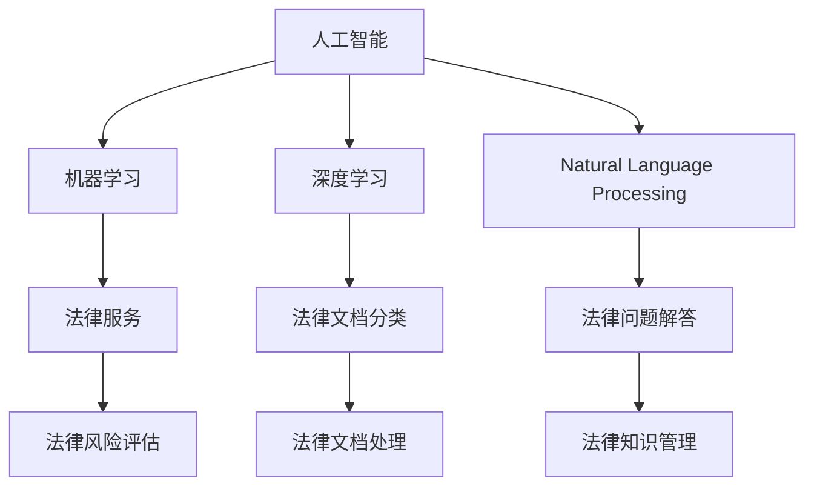

                 

# 人工智能在法律服务中的应用：提高效率与准确性

## 1. 背景介绍

随着人工智能技术的发展，其在各个行业中的应用已经逐渐普及，法律服务行业也不例外。人工智能在法律服务中的应用，不仅能够提高工作效率，还能提高工作准确性，为律师和客户提供更高效、更专业的服务。本文将对人工智能在法律服务中的应用进行全面介绍，包括其原理、操作步骤、优缺点、应用领域、数学模型、项目实践、实际应用场景、工具和资源推荐、未来发展趋势及面临的挑战等方面，希望能为读者提供全面的知识体系和深入的见解。

## 2. 核心概念与联系

### 2.1 核心概念概述

为了更好地理解人工智能在法律服务中的应用，我们首先需要明确一些核心概念。

- **人工智能（AI）**：通过计算机程序模拟人类智能，实现机器的自动化和智能化。
- **机器学习（ML）**：使计算机通过学习数据自动提升性能的一种技术。
- **深度学习（DL）**：一种特殊的机器学习技术，通过构建深层神经网络模型，实现对复杂数据的处理。
- **自然语言处理（NLP）**：让计算机能够理解、处理和生成自然语言的技术。
- **法律服务**：涉及法律咨询、法律文档处理、法律风险评估、法律知识管理等方面的服务。

这些概念相互关联，构成了人工智能在法律服务中应用的基础。

### 2.2 核心概念原理和架构的 Mermaid 流程图



这个流程图展示了人工智能在法律服务中的核心概念和其相互之间的关系。

## 3. 核心算法原理 & 具体操作步骤

### 3.1 算法原理概述

人工智能在法律服务中的应用主要基于机器学习和深度学习技术。通过训练模型，使其能够自动从大量法律案例、法律文件和法律知识中学习，从而实现对法律问题的自动分析和处理。以下是对这些算法的详细说明：

- **机器学习算法**：如决策树、支持向量机（SVM）、随机森林等。通过训练模型，使其能够自动从数据中学习规律，并根据新的输入数据进行预测或分类。
- **深度学习算法**：如卷积神经网络（CNN）、循环神经网络（RNN）、长短时记忆网络（LSTM）等。这些算法通过构建深层神经网络，能够处理更复杂的数据，实现对法律文本、法律关系等的自动分析。
- **自然语言处理算法**：如词向量表示（Word Embeddings）、序列到序列模型（Seq2Seq）、注意力机制（Attention Mechanism）等。这些算法能够处理和理解自然语言，使得计算机能够自动分析和处理法律文档和法律问题。

### 3.2 算法步骤详解

以下是基于深度学习的算法在法律服务中的具体操作步骤：

1. **数据收集**：收集法律文档、法律案例、法律关系等数据，作为训练模型的基础。
2. **数据预处理**：对收集的数据进行清洗、标注和划分，形成训练集、验证集和测试集。
3. **模型训练**：使用深度学习框架（如TensorFlow、PyTorch等）构建神经网络模型，使用训练集进行训练。
4. **模型评估**：使用验证集对训练好的模型进行评估，根据评估结果调整模型参数。
5. **模型部署**：将训练好的模型部署到实际应用中，进行法律问题的自动分析和处理。

### 3.3 算法优缺点

人工智能在法律服务中的应用有以下优点和缺点：

#### 优点：

1. **提高效率**：能够自动处理大量法律文档和案例，大幅提高工作效率。
2. **提高准确性**：通过学习大量的法律知识和案例，能够更准确地分析和处理法律问题。
3. **减少人为错误**：减少人为输入和处理错误，提高工作效率和准确性。
4. **可扩展性强**：能够根据新的法律知识和案例，自动进行模型更新和优化。

#### 缺点：

1. **数据依赖性强**：需要大量的高质量法律数据作为训练基础。
2. **复杂度较高**：构建和训练深度学习模型需要较高的技术门槛。
3. **模型解释性差**：深度学习模型的决策过程难以解释，可能影响用户的信任。
4. **法律风险**：错误分析和处理可能导致法律风险，需要严格控制和审查。

### 3.4 算法应用领域

人工智能在法律服务中的应用涵盖了多个领域，以下是其中几个主要的应用领域：

1. **法律文档分类**：如合同、协议、判决书等的自动分类。
2. **法律问题解答**：如法律问题的自动解答、法律咨询机器人等。
3. **法律风险评估**：如法律风险的自动评估、诉讼案件的胜败预测等。
4. **法律知识管理**：如法律文档的自动摘要、法律关系图的自动生成等。

## 4. 数学模型和公式 & 详细讲解 & 举例说明

### 4.1 数学模型构建

在法律服务中的应用，数学模型构建主要包括以下几个步骤：

1. **数据表示**：将法律文档和法律关系转化为计算机能够处理的数值形式，如词向量表示。
2. **模型选择**：选择合适的深度学习模型，如卷积神经网络、循环神经网络等。
3. **损失函数设计**：设计合适的损失函数，如交叉熵损失、均方误差损失等。
4. **优化算法选择**：选择合适的优化算法，如梯度下降算法、Adam算法等。

### 4.2 公式推导过程

以下是一些常用的数学公式推导过程：

- **词向量表示**：
  $$
  w = \sum_{i=1}^{n} c_i v_i
  $$
  其中，$w$ 表示词向量，$c_i$ 表示单词 $i$ 在文本中出现的次数，$v_i$ 表示单词 $i$ 的词向量表示。

- **交叉熵损失函数**：
  $$
  \mathcal{L}(\theta) = -\frac{1}{N} \sum_{i=1}^{N} \sum_{j=1}^{M} y_{ij} \log(\hat{y}_{ij})
  $$
  其中，$N$ 表示样本数量，$M$ 表示分类数量，$y_{ij}$ 表示样本 $i$ 的第 $j$ 个分类的真实标签，$\hat{y}_{ij}$ 表示模型预测的样本 $i$ 的第 $j$ 个分类的概率。

### 4.3 案例分析与讲解

以法律文档分类为例，使用卷积神经网络模型进行分类：

1. **数据准备**：准备法律文档的文本数据和对应的分类标签。
2. **数据预处理**：对文本数据进行分词、去除停用词等预处理操作。
3. **特征提取**：使用词向量表示文本数据。
4. **模型构建**：构建卷积神经网络模型，使用多个卷积层和池化层对文本数据进行特征提取。
5. **模型训练**：使用训练集对模型进行训练，使用交叉熵损失函数和Adam优化算法。
6. **模型评估**：使用验证集对训练好的模型进行评估，根据评估结果调整模型参数。
7. **模型部署**：将训练好的模型部署到实际应用中，对新的法律文档进行分类预测。

## 5. 项目实践：代码实例和详细解释说明

### 5.1 开发环境搭建

在项目实践前，需要搭建好开发环境，以下是搭建环境的详细步骤：

1. **安装Python**：
  ```bash
  sudo apt-get update
  sudo apt-get install python3-pip
  ```

2. **安装TensorFlow**：
  ```bash
  pip install tensorflow
  ```

3. **安装Keras**：
  ```bash
  pip install keras
  ```

4. **安装Flask**：
  ```bash
  pip install flask
  ```

### 5.2 源代码详细实现

以下是使用TensorFlow和Keras构建法律文档分类模型的代码实现：

```python
import tensorflow as tf
from tensorflow.keras.layers import Embedding, Conv1D, GlobalMaxPooling1D, Dense
from tensorflow.keras.models import Sequential

# 定义模型
model = Sequential()
model.add(Embedding(input_dim=10000, output_dim=128))
model.add(Conv1D(128, 7, activation='relu'))
model.add(GlobalMaxPooling1D())
model.add(Dense(10, activation='softmax'))

# 编译模型
model.compile(optimizer='adam', loss='categorical_crossentropy', metrics=['accuracy'])

# 训练模型
model.fit(train_data, train_labels, epochs=10, batch_size=32)

# 评估模型
test_loss, test_accuracy = model.evaluate(test_data, test_labels)
print('Test accuracy:', test_accuracy)
```

### 5.3 代码解读与分析

以上代码实现了一个简单的卷积神经网络模型，用于法律文档的分类。具体解释如下：

1. **模型定义**：使用Keras框架定义模型结构，包括嵌入层、卷积层、池化层和全连接层。
2. **模型编译**：使用Adam优化算法和交叉熵损失函数编译模型。
3. **模型训练**：使用训练集对模型进行训练，设置10个epoch和32个batch。
4. **模型评估**：使用测试集对模型进行评估，输出测试准确率。

## 6. 实际应用场景

### 6.1 法律服务自动化

人工智能在法律服务中的应用可以大幅提升工作效率和准确性。以下是几个具体的实际应用场景：

1. **法律咨询机器人**：使用自然语言处理技术，自动回答用户的法律咨询问题。
2. **法律文档分类**：自动对合同、协议、判决书等法律文档进行分类，提高文档管理的效率。
3. **法律知识管理**：自动从法律文件和案例中提取法律知识，建立法律知识图谱，方便律师和客户查阅。
4. **法律风险评估**：自动评估案件胜败风险，提供风险预警和建议。

### 6.2 未来应用展望

人工智能在法律服务中的应用前景广阔，未来将会有更多的应用场景涌现：

1. **智能合同审查**：自动审查合同文本，识别风险条款和问题。
2. **诉讼案件分析**：自动分析诉讼案件，生成案件摘要和胜败预测。
3. **法律培训**：使用机器学习技术，自动生成法律培训材料。
4. **法律援助**：使用自然语言处理技术，自动生成法律援助文档。

## 7. 工具和资源推荐

### 7.1 学习资源推荐

以下是一些学习人工智能在法律服务中应用的资源推荐：

1. **机器学习课程**：如斯坦福大学的机器学习课程、Coursera上的深度学习课程等。
2. **自然语言处理书籍**：如《自然语言处理综论》、《深度学习与自然语言处理》等。
3. **法律服务应用案例**：如IBM的Watson Legal、Ross Intelligence等。

### 7.2 开发工具推荐

以下是一些常用的开发工具推荐：

1. **TensorFlow**：开源深度学习框架，支持多种语言。
2. **Keras**：基于TensorFlow的高级深度学习框架，易于使用。
3. **Flask**：轻量级的Web框架，方便开发API。
4. **PyTorch**：开源深度学习框架，支持动态计算图。
5. **Jupyter Notebook**：交互式编程环境，方便开发和测试。

### 7.3 相关论文推荐

以下是一些相关论文推荐：

1. **《Legal Document Classification using Deep Learning》**：介绍使用深度学习对法律文档进行分类的研究成果。
2. **《Legal Question Answering with Deep Learning》**：介绍使用深度学习技术进行法律问题解答的研究成果。
3. **《Legal Risk Assessment using Machine Learning》**：介绍使用机器学习技术评估法律风险的研究成果。

## 8. 总结：未来发展趋势与挑战

### 8.1 研究成果总结

本文对人工智能在法律服务中的应用进行了全面介绍，主要包括机器学习和深度学习算法在法律服务中的应用，具体步骤和优缺点，以及实际应用场景和未来展望。通过这些分析，我们能够更好地理解人工智能在法律服务中的应用潜力。

### 8.2 未来发展趋势

未来人工智能在法律服务中的应用将呈现以下几个趋势：

1. **技术不断进步**：随着深度学习技术的不断发展，人工智能在法律服务中的应用将更加智能化和高效化。
2. **应用场景扩展**：随着法律服务需求的不断增加，人工智能将会在更多的法律领域得到应用。
3. **数据资源丰富**：法律数据的不断积累和丰富，将为人工智能在法律服务中的应用提供更坚实的基础。
4. **多模态融合**：未来人工智能将更多地融合自然语言处理、视觉识别、语音识别等多模态数据，提升法律服务的智能化水平。

### 8.3 面临的挑战

人工智能在法律服务中的应用仍面临一些挑战：

1. **数据隐私问题**：法律数据涉及隐私问题，如何保护数据隐私是亟待解决的问题。
2. **法律风险**：错误分析和处理可能导致法律风险，需要严格控制和审查。
3. **技术门槛高**：深度学习模型的构建和训练需要较高的技术门槛。
4. **解释性差**：深度学习模型的决策过程难以解释，可能影响用户的信任。

### 8.4 研究展望

未来的研究需要在以下几个方面进行探索：

1. **数据隐私保护**：研究如何保护法律数据的隐私，同时保证模型的有效性。
2. **模型解释性**：研究如何提高模型的解释性，增加用户的信任感。
3. **法律风险控制**：研究如何控制和降低人工智能在法律服务中的法律风险。
4. **多模态融合**：研究如何融合自然语言处理、视觉识别、语音识别等多模态数据，提升法律服务的智能化水平。

## 9. 附录：常见问题与解答

**Q1：人工智能在法律服务中的应用有哪些优点和缺点？**

A: **优点**：
- **提高效率**：能够自动处理大量法律文档和案例，大幅提高工作效率。
- **提高准确性**：通过学习大量的法律知识和案例，能够更准确地分析和处理法律问题。
- **减少人为错误**：减少人为输入和处理错误，提高工作效率和准确性。
- **可扩展性强**：能够根据新的法律知识和案例，自动进行模型更新和优化。

**Q2：构建法律文档分类模型时，如何选择模型结构和参数？**

A: 在构建法律文档分类模型时，可以采用以下步骤选择模型结构和参数：
1. **数据预处理**：对数据进行清洗、标注和划分，形成训练集、验证集和测试集。
2. **模型选择**：选择适合的深度学习模型，如卷积神经网络、循环神经网络等。
3. **超参数调优**：根据训练集和验证集的性能调整模型超参数，如学习率、批次大小、隐藏层数量等。
4. **模型评估**：使用测试集对模型进行评估，根据评估结果选择最优模型结构和参数。

**Q3：如何使用人工智能在法律服务中提高工作效率？**

A: 使用人工智能在法律服务中提高工作效率的方法如下：
1. **法律咨询机器人**：使用自然语言处理技术，自动回答用户的法律咨询问题。
2. **法律文档分类**：自动对合同、协议、判决书等法律文档进行分类，提高文档管理的效率。
3. **法律知识管理**：自动从法律文件和案例中提取法律知识，建立法律知识图谱，方便律师和客户查阅。
4. **法律风险评估**：自动评估案件胜败风险，提供风险预警和建议。

**Q4：如何构建法律文档分类模型？**

A: 构建法律文档分类模型的步骤如下：
1. **数据准备**：准备法律文档的文本数据和对应的分类标签。
2. **数据预处理**：对文本数据进行分词、去除停用词等预处理操作。
3. **特征提取**：使用词向量表示文本数据。
4. **模型构建**：构建深度学习模型，如卷积神经网络，使用多个卷积层和池化层对文本数据进行特征提取。
5. **模型训练**：使用训练集对模型进行训练，使用交叉熵损失函数和Adam优化算法。
6. **模型评估**：使用验证集对训练好的模型进行评估，根据评估结果调整模型参数。
7. **模型部署**：将训练好的模型部署到实际应用中，对新的法律文档进行分类预测。

---

作者：禅与计算机程序设计艺术 / Zen and the Art of Computer Programming

