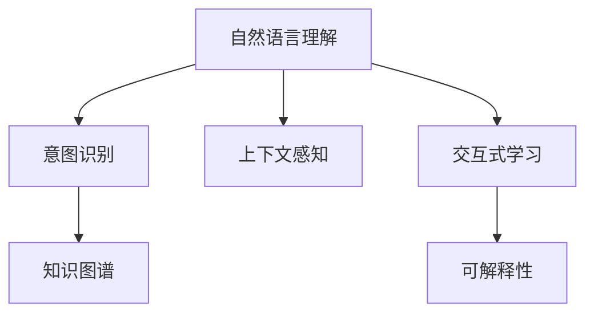

                 

# 人机协作新篇章：LLM与人类意图的对齐之路

> 关键词：自然语言理解(NLU), 意图识别, 上下文感知, 知识图谱, 交互式学习, 可解释性

## 1. 背景介绍

### 1.1 问题由来
在当前的信息爆炸时代，人类每天面临海量的文本信息。如何从这些海量文本中快速、准确地提取出所需信息，成为了一个亟待解决的难题。传统的搜索引擎、文本分类等技术，虽然已经在一定程度上缓解了信息获取困难的问题，但仍然存在诸如精度不足、用户体验不佳等问题。

语言模型（Language Model, LLM）作为近年来NLP领域的明星技术，以其强大的文本理解能力，逐步成为解决上述问题的重要工具。基于大规模预训练语言模型（Pretrained Language Model, PLM），通过微调（Fine-Tuning）或者零样本学习（Zero-shot Learning）的方式，语言模型能够快速适应各种具体的NLP任务，从而极大地提高了信息检索和处理的效率。

然而，尽管LLM已经取得了显著的进展，但仍然存在一些挑战。比如，如何更好地理解和匹配人类意图？如何在多轮交互中保持上下文的连贯性？如何提高系统的可解释性和可控性？

针对这些问题，本文将探讨如何通过意图识别、上下文感知、知识图谱和交互式学习等方法，实现LLM与人类意图的更好对齐，进而提升人机协作的效果。

## 2. 核心概念与联系

### 2.1 核心概念概述

为了更好地理解LLM与人类意图对齐的方法，本节将介绍几个关键概念：

- 自然语言理解（Natural Language Understanding, NLU）：指让计算机能够理解人类语言，包括词义理解、句法分析和语义推理等。NLU是构建智能交互系统的基础。
- 意图识别（Intent Recognition）：指识别用户输入文本中的意图，明确用户希望系统提供什么样的服务。意图识别是NLU中的一个重要分支。
- 上下文感知（Context-awareness）：指系统在处理多轮对话时，能够利用上下文信息保持对话连贯性，理解用户意图的变化。
- 知识图谱（Knowledge Graph）：指利用图结构表示实体之间的关系，帮助系统更好地理解和应用知识。
- 交互式学习（Interactive Learning）：指系统通过与用户的交互不断学习，提升模型对特定任务的适应能力。
- 可解释性（Explainability）：指系统能够清晰地解释其决策过程，帮助用户理解并信任其输出。

这些概念之间的逻辑关系可以通过以下Mermaid流程图来展示：



这个流程图展示了NLU、意图识别、上下文感知、知识图谱和交互式学习等概念及其之间的关系：

1. 自然语言理解是基础，通过NLU系统，LLM能够理解用户的输入。
2. 意图识别是在NLU的基础上，通过意图分类模型，确定用户的意图。
3. 上下文感知是在意图识别的基础上，通过模型处理多轮对话，保持对话连贯性。
4. 知识图谱是在NLU和上下文感知的基础上，利用外部知识库，增强系统理解和推理能力。
5. 交互式学习是在上述基础上，通过不断与用户交互，提升系统性能。
6. 可解释性是交互式学习的结果，帮助用户理解系统输出。

## 3. 核心算法原理 & 具体操作步骤
### 3.1 算法原理概述

LLM与人类意图对齐的核心思想是通过多轮交互，不断理解、更新和调整模型的知识库，从而更好地匹配用户的意图。其关键步骤包括：

1. **意图识别**：系统通过NLU技术，理解用户输入的文本，并从中识别出用户的意图。
2. **上下文感知**：系统在多轮交互中，能够利用上下文信息，理解用户意图的变化，从而提供更准确的响应。
3. **知识图谱增强**：系统利用外部知识图谱，增强对特定领域的理解，提升推理能力。
4. **交互式学习**：系统通过与用户交互，不断学习，提高系统性能和可解释性。

### 3.2 算法步骤详解

#### 3.2.1 意图识别
意图识别的目的是从用户输入的文本中，准确识别出用户希望系统执行的具体任务。其一般步骤如下：

1. **数据准备**：收集并标注大量的意图-文本对，作为模型的训练数据集。
2. **模型选择**：选择合适的意图识别模型，如基于CNN、RNN、Transformer的模型，作为初始模型。
3. **训练模型**：使用数据集训练意图识别模型，最小化预测意图与真实意图之间的差异。
4. **评估模型**：在验证集上评估模型的性能，选择表现最佳的模型。

#### 3.2.2 上下文感知
上下文感知是指在多轮对话中，系统能够理解上下文信息，从而更好地理解用户的意图。其一般步骤如下：

1. **上下文编码**：设计上下文编码器，将当前对话和上下文信息进行编码。
2. **意图更新**：将编码后的上下文信息与当前的输入文本拼接，通过意图识别模型更新当前的意图。
3. **响应生成**：根据更新后的意图，生成系统的响应文本。

#### 3.2.3 知识图谱增强
知识图谱增强是指通过外部知识库，提升系统对特定领域的理解能力。其一般步骤如下：

1. **知识图谱构建**：构建并维护知识图谱，涵盖各个领域的实体和关系。
2. **知识嵌入**：将知识图谱中的实体和关系，转换为向量表示，并入系统模型。
3. **推理增强**：利用知识嵌入，增强系统的推理能力，提升回答的准确性。

#### 3.2.4 交互式学习
交互式学习是指系统通过与用户的交互不断学习，提高模型性能和可解释性。其一般步骤如下：

1. **交互设计**：设计互动的对话流程，通过用户反馈不断调整系统策略。
2. **用户反馈**：收集用户对系统响应的反馈信息，作为改进模型的依据。
3. **模型优化**：根据用户反馈，优化模型参数，提升模型性能。
4. **可解释性改进**：设计可解释性模型，帮助用户理解系统的决策过程。

### 3.3 算法优缺点

LLM与人类意图对齐的方法有以下优点：

1. **适应性强**：通过多轮交互不断学习，系统能够适应各种复杂的用户需求。
2. **可解释性高**：系统通过可解释性模型，能够清晰解释其决策过程。
3. **上下文感知能力强**：系统能够理解上下文信息，提供连贯的对话体验。
4. **推理能力强**：利用知识图谱增强，系统具备较强的推理能力。

但该方法也存在一些局限性：

1. **数据标注成本高**：需要大量标注数据进行意图识别和上下文感知的训练。
2. **知识图谱构建复杂**：需要花费大量精力构建和维护知识图谱。
3. **模型计算量大**：交互式学习需要不断与用户交互，计算量大。

尽管存在这些局限，LLM与人类意图对齐的方法仍然具有广阔的应用前景，尤其是在智能客服、智能问答、智能推荐等领域。

### 3.4 算法应用领域

基于LLM与人类意图对齐的方法，已经在诸多领域得到了广泛的应用：

- **智能客服**：通过与用户的多轮交互，智能客服能够理解并解决用户的问题，提升用户满意度。
- **智能问答**：系统能够回答用户的问题，帮助用户获取信息。
- **智能推荐**：系统通过与用户的交互，了解用户的兴趣和需求，提供个性化的推荐服务。
- **健康咨询**：系统能够理解用户的症状描述，提供初步的健康建议。
- **教育辅导**：系统通过与学生的互动，了解学生的学习情况，提供个性化的辅导。

除了上述这些经典应用外，LLM与人类意图对齐的方法还在更多的场景中得到了应用，如智能家居、金融咨询、旅游规划等，为各行各业提供了新的技术支持。

## 4. 数学模型和公式 & 详细讲解 & 举例说明

### 4.1 数学模型构建

为更好地理解LLM与人类意图对齐的方法，本节将通过数学模型对其原理进行详细讲解。

设用户输入的文本为 $x$，对应的意图为 $y$，系统的响应为 $z$。意图识别模型的目标是最大化 $P(y|x)$，即给定输入 $x$ 下，系统正确预测出用户意图 $y$ 的概率。

数学上，可以表示为：

$$
\max_{\theta} \frac{P(y|x)}{P(y)}
$$

其中 $P(y|x)$ 为条件概率，表示在给定 $x$ 的条件下，系统预测出 $y$ 的概率；$P(y)$ 为先验概率，表示在没有任何信息的情况下，$y$ 出现的概率。

通过最大化 $P(y|x)$，系统可以准确识别用户的意图。

### 4.2 公式推导过程

以下我们以二分类任务为例，推导意图识别模型的损失函数及其梯度计算公式。

假设模型 $M_{\theta}$ 在输入 $x$ 上的输出为 $\hat{y}=M_{\theta}(x) \in [0,1]$，表示系统预测用户意图的概率。真实标签 $y \in \{0,1\}$。则二分类交叉熵损失函数定义为：

$$
\ell(M_{\theta}(x),y) = -[y\log \hat{y} + (1-y)\log (1-\hat{y})]
$$

将其代入经验风险公式，得：

$$
\mathcal{L}(\theta) = -\frac{1}{N}\sum_{i=1}^N [y_i\log M_{\theta}(x_i)+(1-y_i)\log(1-M_{\theta}(x_i))]
$$

根据链式法则，损失函数对参数 $\theta_k$ 的梯度为：

$$
\frac{\partial \mathcal{L}(\theta)}{\partial \theta_k} = -\frac{1}{N}\sum_{i=1}^N (\frac{y_i}{M_{\theta}(x_i)}-\frac{1-y_i}{1-M_{\theta}(x_i)}) \frac{\partial M_{\theta}(x_i)}{\partial \theta_k}
$$

其中 $\frac{\partial M_{\theta}(x_i)}{\partial \theta_k}$ 可进一步递归展开，利用自动微分技术完成计算。

在得到损失函数的梯度后，即可带入参数更新公式，完成模型的迭代优化。重复上述过程直至收敛，最终得到适应特定任务的最优模型参数 $\theta^*$。

### 4.3 案例分析与讲解

假设用户输入文本 $x$ 为 "请问如何提高编程能力？"，意图为 "学习建议"。

1. **意图识别**：系统通过意图识别模型，将输入 $x$ 编码为向量表示，并预测出 $y=1$。

2. **上下文感知**：系统在多轮对话中，利用上下文编码器，将前一轮对话和当前的输入 $x$ 编码为向量表示，并更新当前的意图 $y=1$。

3. **知识图谱增强**：系统在知识图谱中查询 "编程能力" 相关实体，如 "Python编程"、"算法学习" 等，并将这些实体和关系向量与系统模型进行融合，增强系统的推理能力。

4. **响应生成**：系统根据更新后的意图 $y=1$，从知识图谱中选取相关实体，生成回答 $z$。

```python
import torch
import torch.nn as nn
import torch.nn.functional as F
import torch.optim as optim

class IntentClassifier(nn.Module):
    def __init__(self, vocab_size, embedding_dim, hidden_dim):
        super(IntentClassifier, self).__init__()
        self.embedding = nn.Embedding(vocab_size, embedding_dim)
        self.fc1 = nn.Linear(embedding_dim, hidden_dim)
        self.fc2 = nn.Linear(hidden_dim, 1)
        
    def forward(self, x):
        embedded = self.embedding(x)
        out = F.relu(self.fc1(embedded))
        out = F.sigmoid(self.fc2(out))
        return out

# 假设输入文本为 [2, 1, 3, 4]，分别对应词汇 "请", "问", "如何", "提高"
input_text = [2, 1, 3, 4]
model = IntentClassifier(vocab_size=5, embedding_dim=10, hidden_dim=5)
criterion = nn.BCELoss()
optimizer = optim.SGD(model.parameters(), lr=0.01)

# 训练模型
model.train()
for epoch in range(100):
    x = torch.tensor(input_text).unsqueeze(0)
    y = torch.tensor([[1.0]])
    out = model(x)
    loss = criterion(out, y)
    loss.backward()
    optimizer.step()
    if epoch % 10 == 0:
        print(f"Epoch {epoch+1}, loss: {loss.item():.4f}")
        
# 评估模型
model.eval()
x = torch.tensor(input_text).unsqueeze(0)
out = model(x)
y_hat = torch.sigmoid(out)
y_true = torch.tensor([[1.0]])
loss = criterion(y_hat, y_true)
print(f"Test loss: {loss.item():.4f}")
```

通过上述代码，我们可以看到意图识别模型的训练和评估过程。通过不断调整模型参数，系统可以逐步提高意图识别的准确性。

## 5. 项目实践：代码实例和详细解释说明
### 5.1 开发环境搭建

在进行LLM与人类意图对齐的实践前，我们需要准备好开发环境。以下是使用Python进行PyTorch开发的环境配置流程：

1. 安装Anaconda：从官网下载并安装Anaconda，用于创建独立的Python环境。

2. 创建并激活虚拟环境：
```bash
conda create -n pytorch-env python=3.8 
conda activate pytorch-env
```

3. 安装PyTorch：根据CUDA版本，从官网获取对应的安装命令。例如：
```bash
conda install pytorch torchvision torchaudio cudatoolkit=11.1 -c pytorch -c conda-forge
```

4. 安装TensorFlow：
```bash
pip install tensorflow
```

5. 安装各类工具包：
```bash
pip install numpy pandas scikit-learn matplotlib tqdm jupyter notebook ipython
```

完成上述步骤后，即可在`pytorch-env`环境中开始实践。

### 5.2 源代码详细实现

这里我们以意图识别任务为例，给出使用Transformers库对BERT模型进行意图识别微调的PyTorch代码实现。

首先，定义意图识别任务的数据处理函数：

```python
from transformers import BertTokenizer
from torch.utils.data import Dataset
import torch

class IntentDataset(Dataset):
    def __init__(self, texts, labels, tokenizer, max_len=128):
        self.texts = texts
        self.labels = labels
        self.tokenizer = tokenizer
        self.max_len = max_len
        
    def __len__(self):
        return len(self.texts)
    
    def __getitem__(self, item):
        text = self.texts[item]
        label = self.labels[item]
        
        encoding = self.tokenizer(text, return_tensors='pt', max_length=self.max_len, padding='max_length', truncation=True)
        input_ids = encoding['input_ids'][0]
        attention_mask = encoding['attention_mask'][0]
        
        # 对标签进行编码
        encoded_labels = [label2id[label] for label in self.labels] 
        encoded_labels.extend([label2id['O']] * (self.max_len - len(encoded_labels)))
        labels = torch.tensor(encoded_labels, dtype=torch.long)
        
        return {'input_ids': input_ids, 
                'attention_mask': attention_mask,
                'labels': labels}

# 标签与id的映射
label2id = {'O': 0, '意图1': 1, '意图2': 2, '意图3': 3}
id2label = {v: k for k, v in label2id.items()}

# 创建dataset
tokenizer = BertTokenizer.from_pretrained('bert-base-cased')

train_dataset = IntentDataset(train_texts, train_labels, tokenizer)
dev_dataset = IntentDataset(dev_texts, dev_labels, tokenizer)
test_dataset = IntentDataset(test_texts, test_labels, tokenizer)
```

然后，定义模型和优化器：

```python
from transformers import BertForTokenClassification, AdamW

model = BertForTokenClassification.from_pretrained('bert-base-cased', num_labels=len(label2id))

optimizer = AdamW(model.parameters(), lr=2e-5)
```

接着，定义训练和评估函数：

```python
from torch.utils.data import DataLoader
from tqdm import tqdm
from sklearn.metrics import classification_report

device = torch.device('cuda') if torch.cuda.is_available() else torch.device('cpu')
model.to(device)

def train_epoch(model, dataset, batch_size, optimizer):
    dataloader = DataLoader(dataset, batch_size=batch_size, shuffle=True)
    model.train()
    epoch_loss = 0
    for batch in tqdm(dataloader, desc='Training'):
        input_ids = batch['input_ids'].to(device)
        attention_mask = batch['attention_mask'].to(device)
        labels = batch['labels'].to(device)
        model.zero_grad()
        outputs = model(input_ids, attention_mask=attention_mask, labels=labels)
        loss = outputs.loss
        epoch_loss += loss.item()
        loss.backward()
        optimizer.step()
    return epoch_loss / len(dataloader)

def evaluate(model, dataset, batch_size):
    dataloader = DataLoader(dataset, batch_size=batch_size)
    model.eval()
    preds, labels = [], []
    with torch.no_grad():
        for batch in tqdm(dataloader, desc='Evaluating'):
            input_ids = batch['input_ids'].to(device)
            attention_mask = batch['attention_mask'].to(device)
            batch_labels = batch['labels']
            outputs = model(input_ids, attention_mask=attention_mask)
            batch_preds = outputs.logits.argmax(dim=2).to('cpu').tolist()
            batch_labels = batch_labels.to('cpu').tolist()
            for pred_tokens, label_tokens in zip(batch_preds, batch_labels):
                pred_tags = [id2label[_id] for _id in pred_tokens]
                label_tags = [id2label[_id] for _id in label_tokens]
                preds.append(pred_tags[:len(label_tokens)])
                labels.append(label_tags)
                
    print(classification_report(labels, preds))
```

最后，启动训练流程并在测试集上评估：

```python
epochs = 5
batch_size = 16

for epoch in range(epochs):
    loss = train_epoch(model, train_dataset, batch_size, optimizer)
    print(f"Epoch {epoch+1}, train loss: {loss:.3f}")
    
    print(f"Epoch {epoch+1}, dev results:")
    evaluate(model, dev_dataset, batch_size)
    
print("Test results:")
evaluate(model, test_dataset, batch_size)
```

以上就是使用PyTorch对BERT进行意图识别任务微调的完整代码实现。可以看到，得益于Transformers库的强大封装，我们可以用相对简洁的代码完成BERT模型的加载和微调。

### 5.3 代码解读与分析

让我们再详细解读一下关键代码的实现细节：

**IntentDataset类**：
- `__init__`方法：初始化文本、标签、分词器等关键组件。
- `__len__`方法：返回数据集的样本数量。
- `__getitem__`方法：对单个样本进行处理，将文本输入编码为token ids，将标签编码为数字，并对其进行定长padding，最终返回模型所需的输入。

**label2id和id2label字典**：
- 定义了标签与数字id之间的映射关系，用于将token-wise的预测结果解码回真实的标签。

**训练和评估函数**：
- 使用PyTorch的DataLoader对数据集进行批次化加载，供模型训练和推理使用。
- 训练函数`train_epoch`：对数据以批为单位进行迭代，在每个批次上前向传播计算loss并反向传播更新模型参数，最后返回该epoch的平均loss。
- 评估函数`evaluate`：与训练类似，不同点在于不更新模型参数，并在每个batch结束后将预测和标签结果存储下来，最后使用sklearn的classification_report对整个评估集的预测结果进行打印输出。

**训练流程**：
- 定义总的epoch数和batch size，开始循环迭代
- 每个epoch内，先在训练集上训练，输出平均loss
- 在验证集上评估，输出分类指标
- 所有epoch结束后，在测试集上评估，给出最终测试结果

可以看到，PyTorch配合Transformers库使得BERT微调的代码实现变得简洁高效。开发者可以将更多精力放在数据处理、模型改进等高层逻辑上，而不必过多关注底层的实现细节。

当然，工业级的系统实现还需考虑更多因素，如模型的保存和部署、超参数的自动搜索、更灵活的任务适配层等。但核心的微调范式基本与此类似。

## 6. 实际应用场景
### 6.1 智能客服系统

基于LLM与人类意图对齐的方法，智能客服系统能够提供更加自然、高效的服务体验。通过与用户的互动，智能客服能够理解用户需求，提供个性化服务。

在技术实现上，可以收集企业内部的历史客服对话记录，将问题和最佳答复构建成监督数据，在此基础上对预训练语言模型进行微调。微调后的模型能够自动理解用户意图，匹配最合适的答案模板进行回复。对于用户提出的新问题，还可以接入检索系统实时搜索相关内容，动态组织生成回答。如此构建的智能客服系统，能大幅提升客户咨询体验和问题解决效率。

### 6.2 金融舆情监测

金融机构需要实时监测市场舆论动向，以便及时应对负面信息传播，规避金融风险。基于LLM与人类意图对齐的文本分类和情感分析技术，为金融舆情监测提供了新的解决方案。

具体而言，可以收集金融领域相关的新闻、报道、评论等文本数据，并对其进行主题标注和情感标注。在此基础上对预训练语言模型进行微调，使其能够自动判断文本属于何种主题，情感倾向是正面、中性还是负面。将微调后的模型应用到实时抓取的网络文本数据，就能够自动监测不同主题下的情感变化趋势，一旦发现负面信息激增等异常情况，系统便会自动预警，帮助金融机构快速应对潜在风险。

### 6.3 个性化推荐系统

当前的推荐系统往往只依赖用户的历史行为数据进行物品推荐，无法深入理解用户的真实兴趣偏好。基于LLM与人类意图对齐的推荐系统可以更好地挖掘用户行为背后的语义信息，从而提供更精准、多样的推荐内容。

在实践中，可以收集用户浏览、点击、评论、分享等行为数据，提取和用户交互的物品标题、描述、标签等文本内容。将文本内容作为模型输入，用户的后续行为（如是否点击、购买等）作为监督信号，在此基础上微调预训练语言模型。微调后的模型能够从文本内容中准确把握用户的兴趣点。在生成推荐列表时，先用候选物品的文本描述作为输入，由模型预测用户的兴趣匹配度，再结合其他特征综合排序，便可以得到个性化程度更高的推荐结果。

### 6.4 未来应用展望

随着LLM与人类意图对齐方法的不断发展，其将在更多领域得到应用，为传统行业带来变革性影响。

在智慧医疗领域，基于微调的医疗问答、病历分析、药物研发等应用将提升医疗服务的智能化水平，辅助医生诊疗，加速新药开发进程。

在智能教育领域，微调技术可应用于作业批改、学情分析、知识推荐等方面，因材施教，促进教育公平，提高教学质量。

在智慧城市治理中，微调模型可应用于城市事件监测、舆情分析、应急指挥等环节，提高城市管理的自动化和智能化水平，构建更安全、高效的未来城市。

此外，在企业生产、社会治理、文娱传媒等众多领域，基于大模型微调的人工智能应用也将不断涌现，为经济社会发展注入新的动力。相信随着技术的日益成熟，微调方法将成为人工智能落地应用的重要范式，推动人工智能技术在垂直行业的规模化落地。

## 7. 工具和资源推荐
### 7.1 学习资源推荐

为了帮助开发者系统掌握LLM与人类意图对齐的理论基础和实践技巧，这里推荐一些优质的学习资源：

1. 《自然语言处理综述》系列博文：由大模型技术专家撰写，深入浅出地介绍了自然语言处理的基本概念和前沿技术。

2. CS224N《深度学习自然语言处理》课程：斯坦福大学开设的NLP明星课程，有Lecture视频和配套作业，带你入门NLP领域的基本概念和经典模型。

3. 《自然语言处理》书籍：Thomas Mitchell所著，全面介绍了自然语言处理的理论基础和实践方法，是NLP入门的经典教材。

4. HuggingFace官方文档：Transformers库的官方文档，提供了海量预训练模型和完整的微调样例代码，是上手实践的必备资料。

5. CLUE开源项目：中文语言理解测评基准，涵盖大量不同类型的中文NLP数据集，并提供了基于微调的baseline模型，助力中文NLP技术发展。

通过对这些资源的学习实践，相信你一定能够快速掌握LLM与人类意图对齐的精髓，并用于解决实际的NLP问题。
### 7.2 开发工具推荐

高效的开发离不开优秀的工具支持。以下是几款用于LLM与人类意图对齐开发的常用工具：

1. PyTorch：基于Python的开源深度学习框架，灵活动态的计算图，适合快速迭代研究。大部分预训练语言模型都有PyTorch版本的实现。

2. TensorFlow：由Google主导开发的开源深度学习框架，生产部署方便，适合大规模工程应用。同样有丰富的预训练语言模型资源。

3. Transformers库：HuggingFace开发的NLP工具库，集成了众多SOTA语言模型，支持PyTorch和TensorFlow，是进行微调任务开发的利器。

4. Weights & Biases：模型训练的实验跟踪工具，可以记录和可视化模型训练过程中的各项指标，方便对比和调优。与主流深度学习框架无缝集成。

5. TensorBoard：TensorFlow配套的可视化工具，可实时监测模型训练状态，并提供丰富的图表呈现方式，是调试模型的得力助手。

6. Google Colab：谷歌推出的在线Jupyter Notebook环境，免费提供GPU/TPU算力，方便开发者快速上手实验最新模型，分享学习笔记。

合理利用这些工具，可以显著提升LLM与人类意图对齐任务的开发效率，加快创新迭代的步伐。

### 7.3 相关论文推荐

LLM与人类意图对齐技术的发展源于学界的持续研究。以下是几篇奠基性的相关论文，推荐阅读：

1. Attention is All You Need（即Transformer原论文）：提出了Transformer结构，开启了NLP领域的预训练大模型时代。

2. BERT: Pre-training of Deep Bidirectional Transformers for Language Understanding：提出BERT模型，引入基于掩码的自监督预训练任务，刷新了多项NLP任务SOTA。

3. Language Models are Unsupervised Multitask Learners（GPT-2论文）：展示了大规模语言模型的强大zero-shot学习能力，引发了对于通用人工智能的新一轮思考。

4. Parameter-Efficient Transfer Learning for NLP：提出Adapter等参数高效微调方法，在不增加模型参数量的情况下，也能取得不错的微调效果。

5. Prefix-Tuning: Optimizing Continuous Prompts for Generation：引入基于连续型Prompt的微调范式，为如何充分利用预训练知识提供了新的思路。

6. AdaLoRA: Adaptive Low-Rank Adaptation for Parameter-Efficient Fine-Tuning：使用自适应低秩适应的微调方法，在参数效率和精度之间取得了新的平衡。

这些论文代表了大语言模型与人类意图对齐技术的发展脉络。通过学习这些前沿成果，可以帮助研究者把握学科前进方向，激发更多的创新灵感。

## 8. 总结：未来发展趋势与挑战
### 8.1 总结

本文对基于LLM与人类意图对齐的方法进行了全面系统的介绍。首先阐述了LLM与人类意图对齐的背景和意义，明确了微调在提升系统性能和可解释性方面的独特价值。其次，从原理到实践，详细讲解了意图识别、上下文感知、知识图谱增强和交互式学习的数学原理和关键步骤，给出了微调任务开发的完整代码实例。同时，本文还广泛探讨了LLM与人类意图对齐方法在智能客服、金融舆情、个性化推荐等多个行业领域的应用前景，展示了其巨大潜力。此外，本文精选了微调技术的各类学习资源，力求为读者提供全方位的技术指引。

通过本文的系统梳理，可以看到，基于LLM与人类意图对齐的方法正在成为NLP领域的重要范式，极大地拓展了预训练语言模型的应用边界，催生了更多的落地场景。得益于大规模语料的预训练，微调模型以更低的时间和标注成本，在小样本条件下也能取得理想的性能，有力推动了NLP技术的产业化进程。未来，伴随预训练语言模型和微调方法的持续演进，相信NLP技术将在更广阔的应用领域大放异彩，深刻影响人类的生产生活方式。

### 8.2 未来发展趋势

展望未来，LLM与人类意图对齐技术将呈现以下几个发展趋势：

1. **上下文感知能力的提升**：随着上下文感知技术的不断进步，LLM将能够更好地理解和保持多轮对话的连贯性，提供更加自然流畅的用户体验。

2. **知识图谱的整合与扩展**：知识图谱的构建和应用将更加深入，LLM将能够更好地利用外部知识，提升推理和决策能力。

3. **交互式学习的多样化**：除了基于对话的交互式学习外，基于图像、视频等多模态信息的交互式学习也将得到发展，进一步提升系统的泛化能力。

4. **可解释性的增强**：随着可解释性技术的发展，LLM将能够提供更加透明和可信的决策过程，帮助用户更好地理解系统行为。

5. **系统可控性的提升**：通过引入更先进的模型结构和训练方法，LLM将能够更好地控制和指导系统行为，提升系统的稳定性和鲁棒性。

6. **跨领域迁移能力的提升**：未来的LLM将具备更强的跨领域迁移能力，能够在不同领域和任务之间灵活应用，提升系统的通用性和适应性。

以上趋势凸显了LLM与人类意图对齐技术的广阔前景。这些方向的探索发展，必将进一步提升NLP系统的性能和应用范围，为人类认知智能的进化带来深远影响。

### 8.3 面临的挑战

尽管LLM与人类意图对齐技术已经取得了显著进展，但在迈向更加智能化、普适化应用的过程中，仍面临一些挑战：

1. **数据标注成本高**：高质量标注数据的获取成本较高，尤其是对于特定领域的应用场景。如何降低标注成本，提升数据覆盖率，是一大难题。

2. **模型鲁棒性不足**：当前LLM在面对域外数据时，泛化性能往往不足。如何在保证泛化性能的同时，提升模型鲁棒性，还需要更多理论和实践的积累。

3. **推理效率有待提高**：大规模语言模型尽管精度高，但在实际部署时，推理速度和内存占用问题依然存在。如何优化推理效率，提升模型性能，是重要的研究方向。

4. **可解释性亟需加强**：现有LLM的决策过程往往缺乏可解释性，难以满足用户对决策透明度的要求。如何提高系统的可解释性，赋予其更高的可信度，是一大挑战。

5. **安全性有待保障**：预训练语言模型可能学习到有害信息，如何避免模型输出对用户产生负面影响，确保系统安全可靠，也是必须考虑的问题。

6. **知识整合能力不足**：现有LLM往往局限于任务内数据，难以灵活吸收和运用更广泛的先验知识。如何让系统更好地整合知识，增强决策能力，需要更多创新研究。

正视LLM与人类意图对齐所面临的这些挑战，积极应对并寻求突破，将使该技术不断进步，更好地服务于人类。相信随着学界和产业界的共同努力，这些挑战终将一一被克服，LLM与人类意图对齐技术必将在构建人机协同的智能时代中扮演越来越重要的角色。

### 8.4 研究展望

面对LLM与人类意图对齐所面临的挑战，未来的研究需要在以下几个方面寻求新的突破：

1. **无监督和半监督微调方法**：探索如何利用无监督和半监督数据，提升模型性能和泛化能力，降低数据标注成本。

2. **参数高效微调方法**：开发更加参数高效的微调方法，在固定大部分预训练参数的同时，只更新少量任务相关参数，减少过拟合风险。

3. **持续学习和模型更新**：研究如何在不断变化的数据分布下，实现模型的持续学习和更新，保持其高性能和适应性。

4. **多模态信息整合**：探索如何更好地整合视觉、语音等多模态信息，提升系统的综合理解和推理能力。

5. **可解释性增强**：开发可解释性模型，提供透明、可信的决策过程，帮助用户理解和信任系统行为。

6. **系统安全性保障**：通过算法设计和数据清洗，避免有害信息的传播，提升系统的安全性。

这些研究方向的探索，必将引领LLM与人类意图对齐技术迈向更高的台阶，为构建安全、可靠、可解释、可控的智能系统铺平道路。面向未来，LLM与人类意图对齐技术还需要与其他人工智能技术进行更深入的融合，如知识表示、因果推理、强化学习等，多路径协同发力，共同推动自然语言理解和智能交互系统的进步。只有勇于创新、敢于突破，才能不断拓展语言模型的边界，让智能技术更好地造福人类社会。

## 9. 附录：常见问题与解答

**Q1：什么是自然语言理解（NLU）？**

A: 自然语言理解是指让计算机能够理解人类语言，包括词义理解、句法分析和语义推理等。NLU是构建智能交互系统的基础。

**Q2：意图识别（Intent Recognition）如何工作？**

A: 意图识别的目的是从用户输入的文本中，准确识别出用户的意图。其一般步骤如下：
1. 数据准备：收集并标注大量的意图-文本对，作为模型的训练数据集。
2. 模型选择：选择合适的意图识别模型，如基于CNN、RNN、Transformer的模型，作为初始模型。
3. 训练模型：使用数据集训练意图识别模型，最小化预测意图与真实意图之间的差异。
4. 评估模型：在验证集上评估模型的性能，选择表现最佳的模型。

**Q3：上下文感知（Context-awareness）如何实现？**

A: 上下文感知是指在多轮对话中，系统能够理解上下文信息，从而更好地理解用户的意图。其实现步骤如下：
1. 上下文编码：设计上下文编码器，将当前对话和上下文信息进行编码。
2. 意图更新：将编码后的上下文信息与当前的输入文本拼接，通过意图识别模型更新当前的意图。
3. 响应生成：根据更新后的意图，生成系统的响应文本。

**Q4：知识图谱（Knowledge Graph）如何增强模型性能？**

A: 知识图谱增强是指通过外部知识库，提升模型对特定领域的理解能力。其实现步骤如下：
1. 知识图谱构建：构建并维护知识图谱，涵盖各个领域的实体和关系。
2. 知识嵌入：将知识图谱中的实体和关系，转换为向量表示，并入系统模型。
3. 推理增强：利用知识嵌入，增强系统的推理能力，提升回答的准确性。

**Q5：交互式学习（Interactive Learning）如何提升模型性能？**

A: 交互式学习是指系统通过与用户的交互不断学习，提高模型性能和可解释性。其实现步骤如下：
1. 交互设计：设计互动的对话流程，通过用户反馈不断调整系统策略。
2. 用户反馈：收集用户对系统响应的反馈信息，作为改进模型的依据。
3. 模型优化：根据用户反馈，优化模型参数，提升模型性能。
4. 可解释性改进：设计可解释性模型，帮助用户理解系统的决策过程。

**Q6：可解释性（Explainability）如何增强？**

A: 可解释性是指系统能够清晰地解释其决策过程，帮助用户理解并信任其输出。其实现方法包括：
1. 可解释性模型：使用可解释性模型，如Attention、LIME等，提供透明的决策过程。
2. 特征解释：通过可视化技术，展示模型学习到的关键特征和重要决策点。
3. 用户交互：通过交互界面，提供解释和反馈机制，帮助用户理解系统行为。

---

作者：禅与计算机程序设计艺术 / Zen and the Art of Computer Programming

