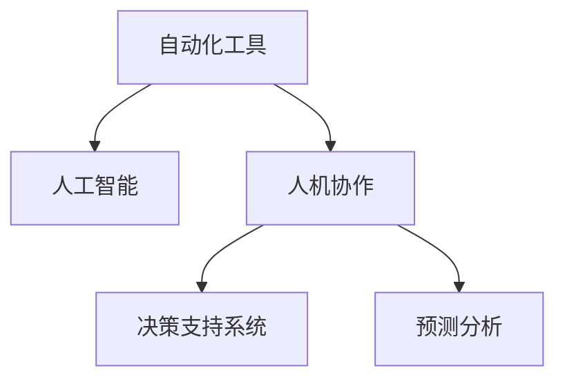

                 

# 人机协作管理：在自动化时代重新定义工作

> 关键词：人机协作, 自动化, 工作重塑, 决策支持, 生产力提升, 工作质量, 数据驱动, 预测分析

## 1. 背景介绍

### 1.1 问题由来
随着信息技术的快速发展，自动化工具的普及已经彻底改变了各行各业的工作方式。一方面，自动化工具的引入极大地提升了生产效率和劳动质量，减少了人为错误，并大幅降低了运营成本。另一方面，自动化也带来了新的挑战：
- **就业结构变化**：传统的重复性劳动逐渐被机器替代，人工需要转向更具创新性和战略性的工作，对劳动力市场的适应性和技能要求提出了更高的要求。
- **工作性质转变**：越来越多的决策性工作需要依赖自动化工具提供的数据支持和预测分析，从而重新定义了工作的性质和职责。
- **管理模式调整**：管理层需要重新审视人力资源管理策略，以适应自动化工具的应用和人力资源的重新配置。

### 1.2 问题核心关键点
自动化和人工智能的应用，正推动着工作模式和管理方式的深刻变革。关键点包括：
- **智能辅助决策**：自动化工具和人工智能系统正在成为决策过程中不可或缺的一部分，提供更准确的数据分析和预测，辅助管理层做出科学决策。
- **人机协作模型**：未来工作将更多地依赖人机协作，而不是完全自动化。人作为决策者，需要理解并整合自动化工具输出的结果，以完成更复杂、更高层次的任务。
- **工作技能重塑**：随着自动化工具的普及，工作对技能的要求也在发生变化。员工需要具备与自动化工具协作的能力，如数据分析、编程、系统运维等。
- **灵活性和适应性**：在快速变化的市场环境中，工作模式和管理策略需要保持灵活性和适应性，以应对不确定性。

### 1.3 问题研究意义
本研究旨在探讨如何在自动化时代重新定义工作模式和管理方式，为组织提供新的管理理念和实践指南。通过深入分析自动化工具在各行业中的应用，结合数据驱动的决策支持和智能辅助，本文将提出一套人机协作管理框架，以期实现更高的工作效率、工作质量和人力资源管理效率，同时保持组织对变化的适应性。

## 2. 核心概念与联系

### 2.1 核心概念概述

为更好地理解自动化时代的人机协作管理，本节将介绍几个关键概念：

- **自动化工具**：指能够替代或辅助完成重复性或规则性任务的机器程序或软件系统，如机器人流程自动化(RPA)、机器学习算法等。
- **人工智能(AI)**：利用计算机科学、认知科学等领域的知识，模拟人类智能行为的智能技术，包括机器学习、自然语言处理、计算机视觉等。
- **人机协作**：指人类和机器之间的交互合作，共同完成任务的工作模式。其中，人负责战略性、创造性工作，而机器负责执行性、重复性工作。
- **决策支持系统(DSS)**：通过集成人工智能技术和自动化工具，辅助管理层进行决策的技术系统。DSS可以提供数据分析、预测、模拟等多种功能。
- **预测分析**：利用数据挖掘和机器学习技术，对未来的趋势进行预测和分析，辅助决策。

这些概念之间的逻辑关系可以通过以下Mermaid流程图来展示：



这个流程图展示了几大概念的相互作用关系：

1. 自动化工具通过处理大量数据和重复性任务，为人工智能提供数据基础。
2. 人工智能技术提升自动化工具的智能性和自适应性。
3. 人机协作模式结合了人类的创新和机器的效率，共同完成复杂任务。
4. 决策支持系统集成人工智能和自动化工具，提供辅助决策支持。
5. 预测分析利用AI技术，对未来趋势进行预测，辅助决策制定。

## 3. 核心算法原理 & 具体操作步骤

### 3.1 算法原理概述

自动化时代的人机协作管理，主要依赖于以下几个关键算法和原理：

- **数据预处理**：自动化工具首先进行数据采集和预处理，确保数据的质量和一致性。数据预处理包括数据清洗、归一化、特征工程等步骤。
- **机器学习模型训练**：利用历史数据训练机器学习模型，学习数据中的规律和模式。常见的模型包括线性回归、决策树、神经网络等。
- **智能决策支持**：将训练好的模型集成到决策支持系统中，根据实时数据提供预测和建议，辅助管理层做出决策。
- **人机交互界面**：设计直观、易用的用户界面，确保人类能够理解并操作自动化工具和AI系统，同时让机器能够识别和响应用户输入。

### 3.2 算法步骤详解

基于上述原理，自动化时代的人机协作管理通常包括以下几个关键步骤：

**Step 1: 数据准备和预处理**
- 收集和清洗数据，去除重复、错误、异常数据。
- 进行数据归一化和标准化，确保数据的可比性和一致性。
- 根据任务需求，选择合适的特征工程方法，提取有用的特征。

**Step 2: 模型训练和验证**
- 选择合适的机器学习算法，利用历史数据训练模型。
- 使用交叉验证等方法，评估模型的性能，防止过拟合。
- 在训练集和验证集上进行模型调整和优化。

**Step 3: 决策支持系统的集成**
- 将训练好的模型集成到决策支持系统中，实现数据驱动的决策支持。
- 设计智能接口，使得人类和机器能够无缝交互。
- 设置合适的阈值和反馈机制，保证决策的准确性和及时性。

**Step 4: 运行和优化**
- 在实际业务场景中运行决策支持系统，根据实时数据生成预测和建议。
- 定期更新模型和算法，保持系统性能和准确性。
- 根据用户反馈，持续优化人机交互界面和决策支持策略。

### 3.3 算法优缺点

人机协作管理在自动化时代具有以下优点：

1. **提高效率**：自动化工具可以处理大量重复性任务，减少人为错误，提高工作效率。
2. **提升质量**：AI技术通过分析大量数据，提供准确的预测和建议，提升决策质量。
3. **灵活适应**：人机协作模式可以根据任务需求灵活调整，适应多变的业务场景。

同时，该方法也存在一定的局限性：

1. **技术依赖**：高度依赖自动化工具和AI技术，需要持续的技术支持和维护。
2. **成本高昂**：初始的设备和软件投资成本较高，且需要大量的数据和人力进行模型训练和维护。
3. **人机协调**：需要高效的人机协作模式和用户界面，以充分利用机器和人类的优势。

### 3.4 算法应用领域

人机协作管理方法在多个领域得到广泛应用，例如：

- **制造行业**：通过自动化工具和机器人流程自动化(RPA)，提升生产效率和质量，降低成本。
- **金融行业**：利用预测分析和智能决策支持系统，优化风险管理和投资决策，提高盈利能力。
- **医疗行业**：结合AI技术和大数据分析，提供个性化的治疗方案和疾病预测，提升患者满意度。
- **零售行业**：利用客户数据分析和自动化库存管理，提升销售效率和客户满意度。
- **服务行业**：通过智能客服系统和自动化工具，提升客户服务质量和响应速度。

## 4. 数学模型和公式 & 详细讲解 & 举例说明

### 4.1 数学模型构建

假设我们有一个生产流程，需要优化生产效率和成本。我们可以构建如下数学模型：

- 设生产流程中有 $n$ 个工序，每个工序需要 $t_i$ 时间，且有 $c_i$ 的成本。
- 设每天可以投入 $k$ 个工人，每个工人可以在每个工序上工作 $h$ 小时。
- 设每小时的工资率为 $w$。

我们可以定义一个优化目标函数 $F$，以最小化总成本和最大化工时：

$$
F(w, k, \{t_i\}, \{c_i\}, h) = \sum_{i=1}^n \left( \frac{t_i}{h} \times k \times c_i \right) + k \times w \times h
$$

其中，第一项表示每个工序的生产成本，第二项表示工人的工资成本。

### 4.2 公式推导过程

我们假设每个工序的生产时间为 $t_i$，需要 $k_i$ 个工人，那么每个工序的工时消耗为 $t_i \times k_i$。根据公式定义，我们可以推导出：

$$
\begin{aligned}
F(w, k, \{t_i\}, \{c_i\}, h) &= \sum_{i=1}^n \left( \frac{t_i}{h} \times k \times c_i \right) + k \times w \times h \\
&= \frac{1}{h} \sum_{i=1}^n t_i \times c_i + k \times w \times h
\end{aligned}
$$

进一步优化目标函数，我们可以引入拉格朗日乘数法，构造拉格朗日函数 $L$：

$$
L(w, k, \{\lambda_i\}, \{t_i\}, \{c_i\}, h) = \sum_{i=1}^n \lambda_i \times (t_i \times k_i - h) + \frac{1}{h} \sum_{i=1}^n t_i \times c_i + k \times w \times h
$$

其中，$\lambda_i$ 为每个工序的工时调整参数。

对拉格朗日函数求偏导数，并令其为零，求解最优解：

$$
\begin{aligned}
\frac{\partial L}{\partial w} &= k \times h = 0 \\
\frac{\partial L}{\partial k} &= \frac{1}{h} \sum_{i=1}^n t_i \times c_i + k \times w \times h = 0 \\
\frac{\partial L}{\partial h} &= -\frac{1}{h^2} \sum_{i=1}^n t_i \times c_i + k \times w = 0 \\
\end{aligned}
$$

通过求解以上方程组，我们可以得到最优的工时分配和工资率。

### 4.3 案例分析与讲解

假设某生产流程有两个工序，每个工序分别需要 2 小时和 4 小时，每个工序的成本分别为 10 元和 20 元。每天可以投入 2 个工人，每个工人可以工作 8 小时，工资率为 100 元/小时。

我们可以将问题转化为线性规划问题：

$$
\begin{aligned}
&\min_{k} \quad \left( 2 \times 10 \times \frac{2}{8} + 2 \times 20 \times \frac{4}{8} + 2 \times 100 \times 8 \right) \\
&\text{subject to} \\
&\quad 2 \times k_1 + 4 \times k_2 = 8 \\
&\quad k_1, k_2 \geq 0
\end{aligned}
$$

使用线性规划求解器，我们可以得到最优解：$k_1 = 1, k_2 = 1$。即每天分配 2 个工人，分别工作 2 小时和 4 小时，可以最小化总成本和工时消耗。

## 5. 项目实践：代码实例和详细解释说明

### 5.1 开发环境搭建

在进行项目实践前，我们需要准备好开发环境。以下是使用Python进行线性规划求解的开发环境配置流程：

1. 安装Anaconda：从官网下载并安装Anaconda，用于创建独立的Python环境。

2. 创建并激活虚拟环境：
```bash
conda create -n linprog-env python=3.8 
conda activate linprog-env
```

3. 安装PuLP和SciPy：
```bash
pip install pulp scipy
```

4. 安装各类工具包：
```bash
pip install numpy pandas scikit-learn matplotlib tqdm jupyter notebook ipython
```

完成上述步骤后，即可在`linprog-env`环境中开始项目实践。

### 5.2 源代码详细实现

这里我们以线性规划问题为例，给出使用PuLP库进行求解的Python代码实现。

首先，定义目标函数和约束条件：

```python
from pulp import LpProblem, LpVariable, LpMinimize, lpSum

# 定义变量
k1 = LpVariable('k1', lowBound=0, cat='Integer')
k2 = LpVariable('k2', lowBound=0, cat='Integer')

# 定义目标函数
cost = 2 * 10 * 2 / 8 + 2 * 20 * 4 / 8 + 2 * 100 * 8

# 定义约束条件
constraints = [
    2 * k1 + 4 * k2 == 8
]

# 创建线性规划问题
lp = LpProblem('Optimization Problem', LpMinimize)

# 添加目标函数和约束条件
lp.setObjective(cost)
lp.addConstraint(constraints[0])

# 求解问题
lp.solve()

# 输出结果
print(f"Total Cost: {cost.eval()}")
print(f"k1: {k1.value()}, k2: {k2.value()}")
```

然后，解释关键代码的实现细节：

**LpVariable**：
- 定义变量 k1 和 k2，设置下界为0，类型为整数型。

**LpMinimize**：
- 定义目标函数 cost，包含工时成本和工资成本。

**约束条件**：
- 定义约束条件 constraints，表示每天的总工时为8小时。

**LpProblem**：
- 创建线性规划问题对象 lp，并设置优化方向为最小化。

**添加目标函数和约束条件**：
- 将目标函数和约束条件添加到问题对象中。

**求解问题**：
- 使用 solve 方法求解线性规划问题。

**输出结果**：
- 输出最小化目标函数 cost 的值，以及变量 k1 和 k2 的解。

### 5.3 代码解读与分析

让我们再详细解读一下关键代码的实现细节：

**变量定义**：
- 定义两个整数型变量 k1 和 k2，分别代表两个工序的工人数。

**目标函数定义**：
- 计算总成本 cost，包含两个工序的生产成本和工资成本。

**约束条件定义**：
- 定义一个约束条件 constraints，表示两个工序的总工时为8小时。

**线性规划问题创建**：
- 创建线性规划问题对象 lp，并设置优化方向为最小化。

**目标函数和约束条件添加**：
- 将目标函数 cost 和约束条件 constraints 添加到问题对象中。

**求解和输出结果**：
- 使用 solve 方法求解线性规划问题，并输出最小化目标函数 cost 的值和变量 k1 和 k2 的解。

通过以上代码实现，我们可以看到线性规划问题的求解过程和结果输出。在实际应用中，线性规划问题可以扩展到更复杂的生产和调度场景，通过变量和约束条件的定义，可以求解最优的生产计划和资源分配。

## 6. 实际应用场景

### 6.1 智能制造

智能制造是自动化时代的重要应用场景。通过人机协作管理，可以实现生产流程的优化和自动化：

- **自动化装配线**：利用自动化工具和机器人流程自动化(RPA)，提升装配线的生产效率和质量，降低人工干预。
- **生产调度优化**：结合预测分析和机器学习，优化生产调度策略，平衡生产资源和任务需求。
- **设备运维管理**：通过预测性维护和大数据分析，提前识别设备故障，减少停机时间，提高设备利用率。

### 6.2 金融风控

金融行业的风险管理需要高度依赖数据驱动的决策支持：

- **信用评估**：利用机器学习算法和大数据分析，评估客户的信用风险，辅助贷款决策。
- **投资组合优化**：结合预测分析和智能决策支持系统，优化投资组合，提高投资收益和风险控制。
- **反欺诈检测**：通过智能分析和自动化工具，实时监控交易行为，检测和防止欺诈行为。

### 6.3 智能客服

智能客服系统通过人机协作管理，可以提升客户服务质量和响应速度：

- **自动化响应**：利用自然语言处理和机器学习，自动理解客户问题并提供解决方案。
- **多渠道整合**：将多种服务渠道（如电话、邮件、社交媒体）整合到一个系统中，提供统一的客户服务体验。
- **个性化推荐**：根据客户历史行为和偏好，推荐个性化的服务和产品。

### 6.4 未来应用展望

未来，人机协作管理将在更多领域得到应用，为组织带来变革性影响：

- **智慧医疗**：结合AI技术和大数据分析，提供个性化的医疗方案和疾病预测，提升患者满意度。
- **智能物流**：利用预测分析和自动化工具，优化物流配送路径和库存管理，提高运输效率。
- **智能教育**：通过智能评估和个性化推荐，提升教育质量和学生学习效率。
- **智能城市**：结合预测分析和自动化工具，优化城市交通、能源和环境管理，提高城市运行效率和居民生活质量。

## 7. 工具和资源推荐

### 7.1 学习资源推荐

为了帮助开发者系统掌握人机协作管理的技术基础和实践技巧，这里推荐一些优质的学习资源：

1. 《机器学习实战》系列博文：由大模型技术专家撰写，深入浅出地介绍了机器学习原理和实践技巧，涵盖线性规划、深度学习等内容。

2. Coursera《机器学习》课程：斯坦福大学开设的机器学习明星课程，有Lecture视频和配套作业，带你入门机器学习领域的基本概念和经典模型。

3. 《深度学习入门》书籍：清华大学出版社出版的深度学习入门教材，全面介绍了深度学习的基本理论和算法，适合初学者阅读。

4. Kaggle：机器学习竞赛平台，提供丰富的数据集和模型，助力数据科学领域的实践和创新。

5. Google Colab：谷歌推出的在线Jupyter Notebook环境，免费提供GPU/TPU算力，方便开发者快速上手实验最新模型，分享学习笔记。

通过对这些资源的学习实践，相信你一定能够快速掌握人机协作管理的精髓，并用于解决实际的问题。

### 7.2 开发工具推荐

高效的开发离不开优秀的工具支持。以下是几款用于人机协作管理开发的常用工具：

1. Python：开源的编程语言，适合快速迭代研究。大部分自动化工具和AI模型都有Python版本的实现。

2. R语言：擅长数据处理和统计分析，适合进行预测分析和数据可视化。

3. SQL：结构化查询语言，适合管理大规模数据存储和查询。

4. Jupyter Notebook：交互式的开发环境，方便进行数据处理和模型验证。

5. Tableau：数据可视化工具，适合将复杂的分析结果进行可视化展示。

6. Jenkins：持续集成和持续部署工具，适合自动化流水线和模型部署。

合理利用这些工具，可以显著提升人机协作管理的开发效率，加快创新迭代的步伐。

### 7.3 相关论文推荐

人机协作管理的发展源于学界的持续研究。以下是几篇奠基性的相关论文，推荐阅读：

1. "Data Mining: Concepts and Techniques"：将数据挖掘的基本理论和算法介绍给读者，涵盖数据预处理、特征工程、模型训练等内容。

2. "Machine Learning: A Probabilistic Perspective"：机器学习领域的经典教材，涵盖概率论、统计学和机器学习的基本概念和算法。

3. "Deep Learning"：深度学习领域的经典教材，由深度学习领域的权威专家撰写，涵盖深度学习的理论和实践。

4. "Artificial Intelligence: A Modern Approach"：人工智能领域的经典教材，涵盖人工智能的基本理论和应用。

5. "Human-Computer Interaction"：人机交互领域的经典教材，涵盖人机协作和用户界面设计的基本理论和实践。

这些论文代表了大模型微调技术的发展脉络。通过学习这些前沿成果，可以帮助研究者把握学科前进方向，激发更多的创新灵感。

## 8. 总结：未来发展趋势与挑战

### 8.1 总结

本文对人机协作管理在自动化时代的理论和实践进行了全面系统的介绍。首先阐述了自动化工具和人工智能的应用背景和意义，明确了人机协作模式在提高效率和提升决策质量方面的重要价值。其次，从原理到实践，详细讲解了人机协作管理的数学模型和操作步骤，给出了项目实践的完整代码实现。同时，本文还探讨了人机协作管理在多个行业领域的应用前景，展示了其广阔的前景和潜力。

通过本文的系统梳理，可以看到，人机协作管理正在成为自动化时代的重要管理范式，极大地提升了组织的生产效率和决策质量，为智能化转型提供了坚实的基础。未来，伴随自动化工具和人工智能的持续发展，人机协作管理必将进一步普及和深化，推动组织的智能化进程。

### 8.2 未来发展趋势

展望未来，人机协作管理将呈现以下几个发展趋势：

1. **智能自动化**：随着自动化工具和人工智能技术的不断进步，未来的人机协作将更加智能和自适应。
2. **全面自动化**：更多的传统工作将被自动化工具替代，人机协作的范围和深度将进一步拓展。
3. **灵活化管理**：人机协作管理将更加灵活和适应性，能够根据任务需求动态调整资源配置。
4. **可视化增强**：数据驱动的决策支持系统将更加可视化，提供更直观的决策依据。
5. **协同学习**：人机协作过程中，机器和人类将通过协同学习共同提升决策能力和效率。

### 8.3 面临的挑战

尽管人机协作管理已经取得了显著成效，但在实现全面自动化和智能化管理的过程中，仍面临诸多挑战：

1. **技术整合**：高度依赖自动化工具和AI技术，需要不断进行技术升级和整合。
2. **数据管理**：大数据和实时数据的处理和管理，需要高效的存储和分析工具。
3. **人才短缺**：需要大量具有数据分析和编程能力的人才，而目前这一领域的人才供需不平衡。
4. **系统鲁棒性**：系统需要具备高度的鲁棒性和容错能力，以应对不确定性和异常情况。
5. **隐私保护**：需要有效的数据隐私保护措施，防止数据泄露和滥用。

### 8.4 研究展望

未来，人机协作管理的研究需要在以下几个方面寻求新的突破：

1. **多模态融合**：结合视觉、语音、文本等多种模态数据，提升决策的全面性和准确性。
2. **智能运维**：结合预测分析和自动化工具，进行设备预测性维护和故障诊断，提升生产效率。
3. **个性化推荐**：利用数据挖掘和机器学习技术，提供个性化的服务和产品推荐。
4. **协作学习**：通过协同学习和知识共享，提升人机协作过程中的决策能力和效率。

这些研究方向将引领人机协作管理技术的不断进步，推动智能化管理时代的到来。未来，人机协作管理将进一步融入组织的管理体系，成为提升组织竞争力的重要工具。

## 9. 附录：常见问题与解答

**Q1：人机协作管理是否适用于所有业务场景？**

A: 人机协作管理适用于需要大量数据处理和决策支持的业务场景，例如制造业、金融、医疗、零售等行业。但对于一些创意性强、需要高度人工判断的领域，如艺术创作、法律咨询等，自动化工具和人工智能的介入需要谨慎处理。

**Q2：人机协作管理需要多少数据才能达到最佳效果？**

A: 数据量的大小直接影响人机协作管理的性能。一般来说，数据量越大，模型训练的效果越好。但数据质量和多样性也非常重要，需要保证数据的多样性和代表性，避免过拟合和数据偏差。

**Q3：如何应对数据隐私和安全问题？**

A: 在数据处理和管理过程中，需要采取严格的隐私保护措施，如数据加密、访问控制、匿名化处理等。同时，需要对数据使用进行严格监管，确保数据只用于授权范围内的业务。

**Q4：如何提升人机协作管理系统的可扩展性？**

A: 人机协作管理系统的可扩展性可以通过模块化和分层设计实现。将系统分为多个模块，每个模块独立设计和实现，可以灵活组合和扩展。此外，采用微服务架构和分布式计算技术，可以提升系统的扩展性和负载均衡能力。

**Q5：如何评估人机协作管理系统的性能？**

A: 人机协作管理系统的性能评估可以从多个维度进行，如系统的响应时间、数据处理速度、决策准确性、用户满意度等。定期进行性能测试和优化，确保系统性能的持续提升。

通过本文的系统梳理，相信你一定能够快速掌握人机协作管理的精髓，并用于解决实际的业务问题。人机协作管理作为自动化时代的重要管理理念，将继续引领组织的智能化转型，为未来的发展提供强有力的技术支撑。

