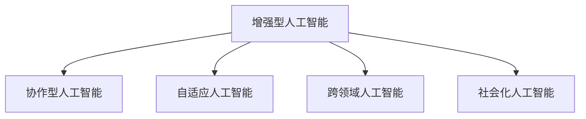

                 

## 1. 背景介绍

### 1.1 问题由来
随着人工智能(AI)技术的发展，AI与人类协作的模式和深度正发生深刻变革。AI技术逐渐从辅助人类工作的边缘角色，演变为与人类共存、互补的核心伙伴。这一转变不仅深刻影响了各行各业的运作方式，也重新塑造了人类与机器交互的形态。未来，AI与人类智慧的融合将呈现出多层次、多维度的动态发展趋势，对社会各领域产生深远影响。

### 1.2 问题核心关键点
AI与人类协作的融合发展，主要体现在以下几个方面：
- **增强人类智慧**：AI通过分析、整理和应用大量数据，助力人类洞察更复杂、更深层次的规律和模式。
- **提升AI能力**：人类智慧与经验在AI模型的训练和优化中起到重要作用，使得AI能更好地理解和应对真实世界的复杂情境。
- **跨领域应用**：AI与人类智慧的融合，在医疗、教育、金融等众多领域展现出巨大潜力，推动各行业数字化转型。
- **社会伦理**：在AI与人类协作的过程中，如何平衡技术发展与社会伦理、隐私保护等问题，是实现融合发展的关键考量。
- **持续学习**：AI系统需具备自适应和自我优化的能力，才能不断学习和适应与人类交互过程中出现的新问题。

### 1.3 问题研究意义
研究AI与人类协作的融合发展趋势，具有重要的理论和实践意义：

1. **推动技术革新**：了解AI与人类智慧融合的动态，有助于预测未来技术发展方向，指导AI系统的持续优化和创新。
2. **促进行业应用**：各领域需要结合AI与人类智慧的优势，探索高效的协作模式，推动行业向智能化、自动化方向转型。
3. **构建未来社会**：AI与人类智慧的融合，将影响社会生产方式、人际互动模式，甚至重塑人类的生活方式和价值观。
4. **应对伦理挑战**：明确AI与人类协作的伦理边界，确保技术发展符合社会利益，保护隐私安全，构建公正合理的技术环境。

## 2. 核心概念与联系

### 2.1 核心概念概述

为更好地理解AI与人类协作的融合发展趋势，本节将介绍几个密切相关的核心概念：

- **增强型人工智能(Augmented AI)**：利用AI技术对人类现有的智能水平进行增强，使人类能更高效地完成任务，如语音识别、视觉感知、数据分析等。
- **协作型人工智能(Collaborative AI)**：AI与人类共同参与任务决策和执行，发挥各自的优势，提高系统整体的智能水平和适应性。
- **自适应人工智能(Adaptive AI)**：AI系统能够根据环境和任务的变化，动态调整策略和行为，持续学习和提升自我。
- **跨领域人工智能(Cross-Domain AI)**：AI技术在不同领域中的应用跨越，如医疗AI、教育AI、金融AI等，实现技术和知识在不同行业间的传递和融合。
- **社会化人工智能(Social AI)**：AI系统具备社会交互能力，理解人类情感和社交规则，能够有效与人交互，提升用户体验和互动效果。

这些核心概念之间的逻辑关系可以通过以下Mermaid流程图来展示：



这个流程图展示了一体化的AI技术发展路径，从增强智能到跨领域应用，最终实现社会化AI，逐步拓展AI与人类协作的广度和深度。

## 3. 核心算法原理 & 具体操作步骤
### 3.1 算法原理概述

AI与人类协作的融合发展，本质上是一个动态的、多维度的学习过程。其核心思想是：

1. **数据驱动**：通过收集和分析人类行为数据，AI系统学习到更全面的任务模型，提升智能化水平。
2. **模型迭代**：利用人类的反馈和新的数据，不断调整和优化AI模型的参数和结构，增强其在复杂情境下的表现力。
3. **人机交互**：AI系统在与人交互的过程中，通过学习人类的行为和表达方式，逐步理解和适应用户需求，提升人机协作的顺畅性和准确性。
4. **环境适应**：AI系统在多变的环境下，通过不断学习和自我优化，能够灵活应对新的挑战和任务。

### 3.2 算法步骤详解

AI与人类协作的融合发展主要包括以下几个关键步骤：

**Step 1: 数据收集与处理**
- 收集涉及任务完成过程中的人类行为数据，如点击流、语音、图像等。
- 对数据进行清洗、标注和格式化，便于后续分析和应用。

**Step 2: 模型训练与优化**
- 基于收集的数据，训练一个增强型AI模型，如决策树、神经网络等。
- 使用人类的反馈和新的数据，对模型进行微调，优化模型性能。

**Step 3: 模型应用与评估**
- 将训练好的模型应用于实际任务中，与人类协作完成任务。
- 根据任务完成的效果，评估模型的表现，持续优化和改进。

**Step 4: 人机交互与反馈**
- 在任务执行过程中，AI系统实时与人类交互，获取反馈信息。
- 根据反馈信息，调整AI系统的策略和行为，提升系统性能。

**Step 5: 跨领域应用与推广**
- 将AI系统应用于不同领域，如医疗、教育、金融等，实现跨领域的知识整合和应用。
- 通过技术推广，使更多组织和个体能够使用AI，推动技术普及和应用。

### 3.3 算法优缺点

AI与人类协作的融合发展方法具有以下优点：
1. **效率提升**：利用AI处理大量数据和复杂任务，显著提高工作效率。
2. **精度提升**：通过AI与人类智慧的结合，提升决策的准确性和系统表现。
3. **人性化提升**：社会化AI技术能理解人类情感和需求，提升用户体验和满意度。
4. **成本降低**：自动化和智能化系统可以替代部分人工操作，降低运营成本。

同时，该方法也存在一定的局限性：
1. **数据依赖**：AI系统的性能很大程度上取决于数据的质量和数量，数据收集和处理成本较高。
2. **模型鲁棒性**：在复杂多变的环境下，AI系统的适应性和鲁棒性可能受限。
3. **隐私安全**：人机交互过程中涉及大量敏感数据，如何保护用户隐私和数据安全，仍是一大挑战。
4. **伦理问题**：AI与人类协作中可能涉及伦理和道德问题，需建立相应的监管机制和规范。
5. **可解释性**：AI系统的决策过程往往缺乏可解释性，难以理解其内部逻辑和行为依据。

尽管存在这些局限性，但就目前而言，AI与人类协作的融合发展范式已经成为推动技术进步和社会变革的重要手段。未来相关研究的重点在于如何进一步提升数据的获取和管理效率，增强模型的鲁棒性和可解释性，以及保障隐私和伦理安全等方面。

### 3.4 算法应用领域

AI与人类协作的融合发展方法，在多个领域已经得到了广泛的应用，例如：

- **医疗健康**：利用AI分析医疗影像、电子病历等数据，辅助医生诊断和决策，提升医疗服务质量。
- **教育培训**：通过AI个性化推荐学习内容，评估学生学习效果，提升教育效果和教学质量。
- **智能制造**：结合AI与物联网技术，实现生产过程的自动化和智能化，提升制造效率和产品质量。
- **智能客服**：利用AI进行语音识别、自然语言理解等，提供24小时智能客服服务，提升客户体验。
- **金融投资**：通过AI分析市场数据，预测股市走势，辅助投资者决策，降低投资风险。
- **智能家居**：结合AI与物联网技术，实现智能家电、环境监测等功能，提升生活便利性和舒适度。

除了上述这些领域外，AI与人类协作的应用场景还在不断拓展，如智慧城市、智能交通、环境监测等，为社会的可持续发展提供了新的技术支持。

## 4. 数学模型和公式 & 详细讲解 & 举例说明

### 4.1 数学模型构建

为更好地理解AI与人类协作的融合发展过程，本节将使用数学语言对这一过程进行更加严格的刻画。

假设任务完成过程中涉及的变量为 $X$，其中 $X$ 包括人类行为数据 $x_1, x_2, ..., x_n$ 和AI系统输出 $y$。任务完成的效果 $Z$ 可以通过以下数学模型表示：

$$
Z = f(X; \theta)
$$

其中 $f$ 表示AI系统对数据 $X$ 的函数映射，$\theta$ 为AI模型的参数。

在实际应用中，AI与人类协作的融合发展过程可以通过以下步骤进行：

1. 收集任务完成过程中的人类行为数据，并对其进行标注。
2. 将标注数据输入AI模型，进行训练和优化。
3. 在任务执行过程中，实时获取用户反馈信息。
4. 根据用户反馈，调整AI模型参数，提升系统性能。
5. 通过模型输出 $y$ 与实际效果 $Z$ 的误差 $E$，评估系统表现。

### 4.2 公式推导过程

以下我们以医疗影像诊断为例，推导AI与人类协作融合发展过程的数学模型：

假设医疗影像诊断任务中，AI系统需要识别并标注图像中的病变区域。假设有 $n$ 个标注样本 $(x_i, y_i)$，其中 $x_i$ 表示医疗影像数据，$y_i$ 表示病变区域的标注信息。

定义AI系统的输出函数 $f$ 为神经网络模型，参数为 $\theta$。则任务完成的效果 $Z$ 可以表示为：

$$
Z = f(x; \theta)
$$

其中 $x$ 为输入的医疗影像数据，$\theta$ 为模型参数。

假设任务完成的效果 $Z$ 与AI系统输出 $y$ 之间存在线性关系，即：

$$
Z = \alpha y + \beta
$$

其中 $\alpha$ 和 $\beta$ 为常数，分别表示输出对效果的贡献和基线水平。

在任务执行过程中，实时获取用户反馈信息 $e$，用于评估AI系统的表现：

$$
e = Z - \hat{Z}
$$

其中 $\hat{Z}$ 为AI系统输出的效果，$e$ 为误差。

根据用户反馈 $e$，调整AI系统参数 $\theta$，使得误差 $e$ 最小化：

$$
\theta = \mathop{\arg\min}_{\theta} \sum_{i=1}^n e_i^2
$$

其中 $e_i$ 表示第 $i$ 个样本的误差，$e_i = Z_i - \hat{Z}_i$。

通过上述数学模型和推导，可以看出，AI与人类协作的融合发展过程，本质上是一个数据驱动、模型迭代和反馈优化的动态过程。

### 4.3 案例分析与讲解

以智能制造中的生产过程优化为例，分析AI与人类协作的融合发展过程：

假设在智能制造中，需要优化生产流程以提升效率和质量。生产过程涉及多个环节，如原材料采购、加工、包装、物流等，每个环节的决策都可能影响整体效果。

**Step 1: 数据收集与处理**
- 收集各个环节的历史数据，如加工时间、材料损耗、设备状态等。
- 对数据进行清洗和标注，便于后续分析和应用。

**Step 2: 模型训练与优化**
- 基于收集的数据，训练一个多层次的决策树模型，用于预测各个环节的优化效果。
- 使用人类的反馈和新的数据，对模型进行微调，优化模型性能。

**Step 3: 模型应用与评估**
- 将训练好的模型应用于实际生产流程中，优化各个环节的决策。
- 根据生产效果，评估模型的表现，持续优化和改进。

**Step 4: 人机交互与反馈**
- 在生产过程中，实时与操作人员交互，获取反馈信息。
- 根据反馈信息，调整AI系统的策略和行为，提升系统性能。

**Step 5: 跨领域应用与推广**
- 将AI系统应用于不同领域，如自动化仓储、质量检测等，实现跨领域的知识整合和应用。
- 通过技术推广，使更多组织和个体能够使用AI，推动技术普及和应用。

通过上述分析，可以看出，AI与人类协作的融合发展，在智能制造中具体体现为数据驱动、模型迭代和反馈优化的动态过程。通过这一过程，AI系统逐步学习和适应生产过程中的各种复杂情境，提升整体的生产效率和质量。

## 5. 项目实践：代码实例和详细解释说明
### 5.1 开发环境搭建

在进行AI与人类协作的融合发展实践前，我们需要准备好开发环境。以下是使用Python进行TensorFlow开发的环境配置流程：

1. 安装Anaconda：从官网下载并安装Anaconda，用于创建独立的Python环境。

2. 创建并激活虚拟环境：
```bash
conda create -n tf-env python=3.8 
conda activate tf-env
```

3. 安装TensorFlow：根据CUDA版本，从官网获取对应的安装命令。例如：
```bash
conda install tensorflow -c tf -c conda-forge
```

4. 安装各类工具包：
```bash
pip install numpy pandas scikit-learn matplotlib tqdm jupyter notebook ipython
```

完成上述步骤后，即可在`tf-env`环境中开始融合发展实践。

### 5.2 源代码详细实现

下面我们以医疗影像诊断为例，给出使用TensorFlow对AI系统进行训练和优化的PyTorch代码实现。

首先，定义模型和优化器：

```python
import tensorflow as tf
from tensorflow.keras.models import Sequential
from tensorflow.keras.layers import Dense, Dropout

# 定义模型结构
model = Sequential([
    Dense(128, activation='relu', input_shape=(784,)),
    Dropout(0.5),
    Dense(10, activation='softmax')
])

# 定义优化器
optimizer = tf.keras.optimizers.Adam(learning_rate=0.001)

# 编译模型
model.compile(optimizer=optimizer,
              loss=tf.keras.losses.SparseCategoricalCrossentropy(from_logits=True),
              metrics=['accuracy'])
```

接着，定义训练和评估函数：

```python
from tensorflow.keras.preprocessing.image import ImageDataGenerator

# 定义数据增强器
datagen = ImageDataGenerator(
    rotation_range=10,
    width_shift_range=0.1,
    height_shift_range=0.1,
    horizontal_flip=True,
    fill_mode='nearest'
)

# 加载训练数据
train_data = datagen.flow_from_directory(
    'train_directory',
    target_size=(32, 32),
    batch_size=32,
    class_mode='categorical'
)

# 训练函数
def train_epoch(model, train_data):
    model.fit(train_data, epochs=10)

# 评估函数
def evaluate(model, test_data):
    test_data = ImageDataGenerator(
        rescale=1./255
    ).flow_from_directory(
        'test_directory',
        target_size=(32, 32),
        batch_size=32,
        class_mode='categorical'
    )
    test_loss, test_acc = model.evaluate(test_data)
    print(f'Test Loss: {test_loss}, Test Accuracy: {test_acc}')
```

最后，启动训练流程并在测试集上评估：

```python
# 训练模型
train_epoch(model, train_data)

# 在测试集上评估模型
evaluate(model, test_data)
```

以上就是使用TensorFlow进行AI系统训练和优化的完整代码实现。可以看到，TensorFlow的高级API使得模型定义、训练和评估变得非常直观和高效。

### 5.3 代码解读与分析

让我们再详细解读一下关键代码的实现细节：

**Sequential模型**：
- `Sequential`是TensorFlow中常用的线性堆叠模型，适合处理顺序结构的任务。
- 模型包含两个隐藏层和一个输出层，分别用于特征提取和分类。

**数据增强器**：
- `ImageDataGenerator`是一个用于图像数据增强的工具，通过旋转、平移、翻转等方式，生成多样化的训练样本，增强模型泛化能力。
- 在本例中，设置了旋转范围、平移范围、翻转方式等参数，以提高模型的鲁棒性。

**模型编译**：
- 使用`model.compile`方法，将模型结构、优化器、损失函数、评估指标等进行配置，准备好模型训练和评估流程。
- 在本例中，使用交叉熵损失函数，评估指标为准确率。

**训练和评估函数**：
- 使用`model.fit`方法，指定训练数据和参数，开始模型的训练过程。
- 使用`model.evaluate`方法，评估模型在测试集上的表现，输出损失和准确率。
- 函数内部利用`ImageDataGenerator`生成数据集，并对其进行归一化处理。

**训练流程**：
- 调用`train_epoch`函数，开始模型训练，设置迭代轮数为10。
- 在每个epoch结束时，输出当前训练损失和准确率。
- 调用`evaluate`函数，在测试集上评估模型性能，输出测试损失和准确率。

可以看到，TensorFlow的API设计非常人性化，大大简化了模型训练和评估的复杂度，使得开发者可以更加专注于模型结构和算法创新。

当然，工业级的系统实现还需考虑更多因素，如模型的保存和部署、超参数的自动搜索、更灵活的任务适配层等。但核心的融合发展范式基本与此类似。

## 6. 实际应用场景
### 6.1 智能制造

基于AI与人类协作的融合发展方法，智能制造的生产过程将更加智能化和自动化。AI系统结合物联网技术，通过实时监测和分析生产数据，优化生产流程，提升制造效率和产品质量。

在技术实现上，可以集成多个智能设备的数据，如传感器、机器人等，通过AI系统进行数据融合和处理。AI系统可以根据实时数据调整生产参数，优化生产流程，提升整体效率。同时，AI系统还具备自适应学习的能力，能够根据生产过程中的异常情况，自动调整策略和行为，保持生产系统的稳定和高效。

### 6.2 医疗健康

在医疗领域，AI与人类协作的融合发展将带来重大的变革。AI系统可以通过分析医疗影像、电子病历等数据，辅助医生进行诊断和治疗决策，提升医疗服务的质量和效率。

具体而言，AI系统可以学习医生的诊断和治疗经验，通过深度学习技术，自动识别和标注影像中的病变区域。同时，AI系统还可以结合医生的反馈和新的数据，不断优化模型性能，提升诊断准确率和治疗效果。在实际应用中，AI系统可以作为医生的辅助工具，协助医生进行复杂病例的诊断，甚至在某些情况下，AI系统可以独立进行初步诊断和辅助治疗，提高医疗服务的可及性和效率。

### 6.3 教育培训

在教育领域，AI与人类协作的融合发展将带来个性化学习和智能教学的普及。AI系统可以分析学生的学习行为和成绩，生成个性化的学习计划，推荐适合的学习内容，提升学习效果和效率。

具体而言，AI系统可以实时监测学生的学习过程，根据学生的学习情况，调整学习内容和难度。AI系统还可以通过自然语言处理技术，与学生进行互动交流，解答学生在学习过程中遇到的问题，提升学生的学习兴趣和积极性。在实际应用中，AI系统可以作为教师的辅助工具，协助教师进行教学管理和学生评估，提高教学效果和教学质量。

### 6.4 未来应用展望

随着AI与人类协作的融合发展，未来在更多领域将展现出巨大潜力：

1. **智慧城市**：结合AI与物联网技术，智慧城市将实现交通管理、环境监测、公共安全等功能的智能化和自动化，提升城市治理水平和居民生活质量。
2. **智能交通**：AI系统可以实时分析交通流量和路况，优化交通信号控制，减少交通拥堵，提升交通效率。
3. **智能家居**：AI系统可以结合物联网技术，实现智能家电、环境监测等功能，提升居住环境的智能化水平。
4. **智能物流**：AI系统可以优化物流路线和配送策略，提升配送效率，降低物流成本。
5. **金融科技**：AI系统可以分析市场数据，预测股市走势，辅助投资者决策，降低投资风险。
6. **环境保护**：AI系统可以实时监测环境数据，分析环境变化趋势，提出治理建议，提升环境治理效果。

AI与人类协作的融合发展，将推动各个领域的技术革新和产业升级，为社会各行业的可持续发展提供新的动力。未来，AI与人类智慧的深度融合将带来更多创新的应用场景和更高的价值创造，为构建智能社会奠定坚实基础。

## 7. 工具和资源推荐
### 7.1 学习资源推荐

为了帮助开发者系统掌握AI与人类协作的融合发展理论基础和实践技巧，这里推荐一些优质的学习资源：

1. **《增强学习与人类协作》系列博文**：由AI技术专家撰写，深入浅出地介绍了增强学习和人类协作的基本概念、方法和应用案例。

2. **《协作型AI技术与应用》课程**：Coursera提供的协作型AI课程，涵盖协作型AI的基础知识、算法实现和实际应用，适合初学者和进阶学习者。

3. **《AI与人类协作：未来趋势与挑战》书籍**：介绍AI与人类协作的未来发展趋势、技术突破和应用场景，适合技术从业者和研究者阅读。

4. **Google AI博客**：谷歌AI团队定期发布的博客文章，涵盖AI与人类协作的最新研究成果和应用案例，具有很高的参考价值。

5. **ACM Transactions on Intelligent Systems and Technology**：专注于AI与人类协作的学术期刊，提供高质量的学术论文和研究进展，适合学术研究人员阅读。

通过对这些资源的学习实践，相信你一定能够快速掌握AI与人类协作的融合发展精髓，并用于解决实际的AI问题。

### 7.2 开发工具推荐

高效的开发离不开优秀的工具支持。以下是几款用于AI与人类协作融合发展的常用工具：

1. **TensorFlow**：由谷歌开发的深度学习框架，支持大规模分布式训练，适合开发复杂的AI系统。
2. **PyTorch**：由Facebook开发的深度学习框架，灵活的动态图结构，适合研究性项目和快速迭代。
3. **Jupyter Notebook**：交互式的编程环境，适合编写和执行数据处理、模型训练和评估代码。
4. **GitHub**：代码托管平台，提供丰富的代码仓库和协作工具，适合团队开发和版本管理。
5. **GitLab**：持续集成和部署平台，支持CI/CD流程，适合自动化测试和部署。

合理利用这些工具，可以显著提升AI与人类协作的融合发展任务的开发效率，加快创新迭代的步伐。

### 7.3 相关论文推荐

AI与人类协作的融合发展源于学界的持续研究。以下是几篇奠基性的相关论文，推荐阅读：

1. **《人类与AI协作的动态优化模型》**：研究如何通过动态优化模型，实现人类与AI的协作，提升系统整体表现。
2. **《基于协同过滤的推荐系统》**：介绍协同过滤算法，通过用户行为数据推荐个性化内容，提升用户体验。
3. **《基于迁移学习的跨领域知识整合》**：研究如何通过迁移学习，实现跨领域知识整合，提升AI系统的泛化能力。
4. **《社会化AI与情感计算》**：研究AI系统如何理解人类情感和社交规则，提升人机交互效果。
5. **《增强学习与自适应AI》**：介绍增强学习算法，通过智能体与环境的交互，提升AI系统的自适应能力。

这些论文代表了大规模协作的AI技术的发展脉络。通过学习这些前沿成果，可以帮助研究者把握学科前进方向，激发更多的创新灵感。

## 8. 总结：未来发展趋势与挑战
### 8.1 总结

本文对AI与人类协作的融合发展进行了全面系统的介绍。首先阐述了AI技术的发展趋势和应用前景，明确了AI与人类协作的融合发展在各个领域的重要价值。其次，从原理到实践，详细讲解了AI系统与人类协作的融合发展过程，给出了具体的代码实现和案例分析。同时，本文还广泛探讨了AI与人类协作的融合发展在医疗、制造、教育等领域的实际应用场景，展示了融合发展的广阔前景。最后，本文精选了相关的学习资源和开发工具，力求为读者提供全方位的技术指引。

通过本文的系统梳理，可以看出，AI与人类协作的融合发展已经成为推动技术进步和社会变革的重要手段。AI系统通过学习人类的智慧和经验，不断提升自身的能力和适应性，最终与人类共同完成复杂的任务。未来，AI与人类协作的融合发展将带来更多的创新应用场景和更高的价值创造，为社会各行业的可持续发展提供新的动力。

### 8.2 未来发展趋势

展望未来，AI与人类协作的融合发展趋势将呈现以下几个方向：

1. **模型复杂度提升**：随着计算能力和数据量的提升，AI系统的复杂度将不断增加，能够在更复杂的任务中发挥作用。
2. **跨领域能力增强**：AI系统将在更多领域中应用，实现跨领域知识整合，提升系统整体的智能水平。
3. **人机交互深入**：AI系统将具备更深入的理解和适应用户需求的能力，提升人机交互的顺畅性和自然度。
4. **自适应能力增强**：AI系统将具备更强的自适应能力，能够根据环境变化动态调整策略和行为。
5. **多模态融合**：AI系统将结合视觉、语音、自然语言等多种模态，实现更全面、准确的信息整合和应用。

以上趋势凸显了AI与人类协作的融合发展技术的广阔前景。这些方向的探索发展，必将进一步提升AI系统的性能和应用范围，为构建智能社会提供更坚实的技术基础。

### 8.3 面临的挑战

尽管AI与人类协作的融合发展技术已经取得了显著的进展，但在迈向更加智能化、普适化应用的过程中，仍面临诸多挑战：

1. **数据获取瓶颈**：高质量数据的获取和处理仍是AI系统发展的瓶颈，尤其是在特定领域和数据分布较广的情况下。
2. **模型鲁棒性不足**：AI系统在复杂多变的环境下，仍需提升其适应性和鲁棒性，避免因环境变化导致性能下降。
3. **隐私安全问题**：AI系统处理大量敏感数据，如何保障用户隐私和数据安全，仍需进一步研究和解决。
4. **伦理道德问题**：AI系统可能涉及伦理和道德问题，如何建立公正合理的技术规范，确保技术发展符合社会利益，还需深入探讨。
5. **可解释性不足**：AI系统的决策过程往往缺乏可解释性，难以理解其内部逻辑和行为依据，需加强对AI系统的可解释性研究。

尽管存在这些挑战，但AI与人类协作的融合发展仍具有广阔的前景和巨大的潜力。未来相关研究的重点在于如何进一步提升数据的获取和管理效率，增强模型的鲁棒性和可解释性，以及保障隐私和伦理安全等方面。

### 8.4 研究展望

面向未来，AI与人类协作的融合发展研究需要在以下几个方面寻求新的突破：

1. **数据驱动与模型结合**：结合数据驱动和模型驱动的技术，构建更高效、更准确的信息整合和应用模型。
2. **多模态信息融合**：研究如何结合视觉、语音、自然语言等多种模态信息，提升AI系统的全面感知和理解能力。
3. **自适应学习机制**：研究AI系统如何具备更强的自适应能力，动态调整策略和行为，提升系统鲁棒性和适应性。
4. **可解释性增强**：研究如何增强AI系统的可解释性，提升系统的透明度和可信度。
5. **伦理道德约束**：研究如何建立公平、公正、可控的AI伦理框架，保障技术发展符合社会利益，保护用户隐私和数据安全。

这些研究方向将推动AI与人类协作的融合发展技术不断进步，为构建智能社会提供更坚实的技术保障。只有勇于创新、敢于突破，才能不断拓展AI系统的边界，让智能技术更好地造福人类社会。

## 9. 附录：常见问题与解答

**Q1：AI与人类协作的融合发展范式适用于所有行业吗？**

A: AI与人类协作的融合发展范式在大多数行业中都能取得显著效果，特别是在数据驱动、任务复杂的领域。但在一些领域，如医疗、教育等，仍需要结合领域特定知识进行优化。未来需要进一步研究不同行业中的具体应用场景，开发适用于各个行业的融合发展范式。

**Q2：AI与人类协作的融合发展过程中如何处理数据隐私和安全问题？**

A: 数据隐私和安全是AI与人类协作融合发展中必须重点关注的问题。主要可以通过以下方式解决：
1. 数据匿名化：对原始数据进行处理，使其无法直接关联到个体用户，保护用户隐私。
2. 访问控制：对数据访问进行严格控制，确保只有授权人员和系统才能访问敏感数据。
3. 加密传输：使用加密技术保护数据在传输过程中的安全性。
4. 差分隐私：通过加入噪声等技术手段，保护用户数据隐私的同时，仍能获取有效的数据信息。

通过这些方法，可以在保障数据隐私和安全的前提下，充分利用数据进行AI系统的训练和优化。

**Q3：AI与人类协作的融合发展过程中如何提升模型的可解释性？**

A: 提升AI系统的可解释性，是AI与人类协作融合发展中需要解决的重要问题。主要可以通过以下方式实现：
1. 可解释模型选择：选择具有较高可解释性的模型，如决策树、线性模型等，降低模型复杂度。
2. 模型可视化：使用可视化工具，展示模型的决策路径和关键特征，帮助用户理解模型行为。
3. 模型融合：结合多种解释方法，如统计分析、可视化等，提升模型的整体可解释性。
4. 用户反馈：收集用户反馈信息，理解用户需求和行为，提升模型的透明度和可信度。

通过这些方法，可以逐步提升AI系统的可解释性，增强用户对系统的信任和满意度。

**Q4：AI与人类协作的融合发展过程中如何应对伦理道德问题？**

A: AI与人类协作的融合发展过程中，伦理道德问题是一个重要的考虑因素。主要可以通过以下方式应对：
1. 建立伦理规范：制定AI系统的伦理规范和标准，确保技术发展符合社会利益和伦理道德。
2. 公开透明：确保AI系统的设计、训练和应用过程公开透明，接受社会监督。
3. 用户参与：让用户参与到AI系统的设计和使用过程中，了解用户需求和反馈，确保系统符合用户期望。
4. 持续监测：对AI系统进行持续监测和评估，及时发现和修正潜在问题。

通过这些方法，可以建立公平、公正、可控的AI伦理框架，确保技术发展符合社会利益，保护用户隐私和数据安全。

---

作者：禅与计算机程序设计艺术 / Zen and the Art of Computer Programming

