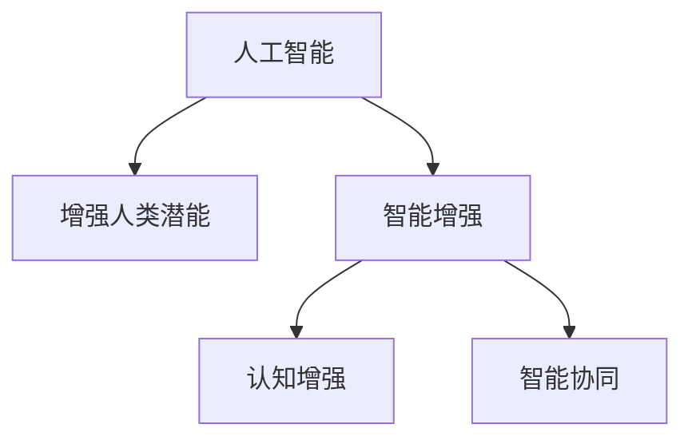

                 

# 人类-AI协作：增强人类潜能与AI能力的协同演进

> 关键词：人类-AI协作,增强人类潜能,智能增强,智能协同,认知增强,人机融合

## 1. 背景介绍

### 1.1 问题由来
在人类历史的长河中，协作与进化是永恒的主题。从早期的人类原始协作，到现代社会中各个行业分工明确、合作紧密的协作模式，协作始终是推动社会进步、推动经济发展的核心力量。当前，我们正处于人工智能（AI）和人类协作的新纪元。AI技术的发展不仅带来了全新的技术可能性，也为人类协作带来了新的变革。人类与AI的协作不再是简单的工具使用，而是形成了深度融合、协同演进的新型关系。

### 1.2 问题核心关键点
当前，AI技术在各个领域中发挥着越来越重要的作用。从医疗诊断、自动驾驶、金融分析到教育辅助、司法决策，AI技术的广泛应用正在改变着各行各业的运作模式。然而，AI技术的快速发展也带来了一些挑战，如决策透明度、伦理问题、安全性等。因此，如何更好地将AI技术与人类协作结合，充分发挥AI的潜能，增强人类潜能，成为当前学术界和工业界共同关注的重要课题。

### 1.3 问题研究意义
在当前技术飞速发展的背景下，研究人类-AI协作，具有以下重要意义：

1. **推动社会进步**：AI技术的发展将大大提升各行各业的工作效率，优化资源配置，推动社会进步。
2. **增强人类潜能**：AI技术能够辅助人类解决复杂问题，增强人类在认知、创新、决策等方面的能力。
3. **促进人机融合**：通过AI技术与人类协作的深度融合，实现人机优势互补，推动人机融合的进一步发展。
4. **解决实际问题**：AI技术可以解决很多实际问题，如疾病诊断、灾害预测、能源优化等，提升社会运行效率。

## 2. 核心概念与联系

### 2.1 核心概念概述

为了更好地理解人类-AI协作的基本原理，本节将介绍几个密切相关的核心概念：

- **人工智能（AI）**：指通过计算机技术实现的智能行为，包括机器学习、自然语言处理、计算机视觉等技术。
- **增强人类潜能**：指通过AI技术辅助人类，提升其在认知、创新、决策等方面的能力，实现人类能力的增强。
- **智能增强（IA）**：指将AI技术应用于人类协作过程，提升协作效率和质量，实现人机融合。
- **认知增强**：指通过AI技术辅助人类进行认知任务，如记忆、理解、推理等，增强人类的认知能力。
- **智能协同**：指人类与AI技术在协作过程中，通过信息共享、协同决策等方式实现优势互补，提升整体协作效果。

这些核心概念之间的逻辑关系可以通过以下Mermaid流程图来展示：



这个流程图展示了大语言模型工作的核心概念及其之间的关系：

1. AI技术提供了实现增强人类潜能和智能增强的基础能力。
2. 智能增强是人机融合的重要手段，通过优化协作过程，提升整体协作效率。
3. 认知增强是AI辅助人类解决复杂认知任务的关键，提升人类的认知能力。
4. 智能协同是人机协作的核心，通过信息共享和协同决策，实现人机优势互补。

这些概念共同构成了人类-AI协作的总体框架，为其在各行各业中的应用提供了理论支持。

## 3. 核心算法原理 & 具体操作步骤
### 3.1 算法原理概述

人类-AI协作的核心在于如何实现人机融合，充分发挥AI技术的潜能，提升人类的认知、决策、协作等方面的能力。

基于此，本节将详细介绍人类-AI协作的主要算法原理和具体操作步骤。

### 3.2 算法步骤详解

**Step 1: 数据采集与预处理**

数据采集是协作的基础。AI系统需要大量的数据来训练和学习，从而提升其预测和决策能力。

- **采集数据**：从各种来源采集数据，如医疗记录、金融交易数据、社会媒体数据等。
- **预处理数据**：对数据进行清洗、标注、归一化等处理，确保数据质量。

**Step 2: 模型训练与优化**

模型训练是AI技术的核心。通过大量标注数据的训练，AI模型能够学习到丰富的知识，提升其在特定任务上的表现。

- **选择模型**：根据具体任务选择适合的模型，如深度神经网络、卷积神经网络、循环神经网络等。
- **训练模型**：使用数据集进行模型训练，并调整模型参数，优化模型性能。
- **验证模型**：在验证集上评估模型性能，确保模型泛化能力。

**Step 3: 协作决策与反馈**

协作决策是AI与人类协作的核心环节。通过AI辅助人类决策，并根据反馈不断优化AI系统。

- **人机协作**：将AI系统集成到人类决策过程中，辅助人类进行决策。
- **反馈机制**：收集人类对AI决策的反馈，用于优化AI系统。

**Step 4: 持续优化与迭代**

持续优化是AI技术的生命力所在。通过不断的优化和迭代，AI系统能够持续提升性能，更好地服务于人类。

- **持续学习**：通过新数据不断更新模型，提升AI系统性能。
- **迭代优化**：根据反馈不断优化AI系统，提升系统鲁棒性和可靠性。

### 3.3 算法优缺点

人类-AI协作算法具有以下优点：

1. **提升协作效率**：AI技术可以处理大量数据，辅助人类进行决策，提升协作效率。
2. **优化资源配置**：通过AI技术优化资源配置，实现更高效的资源利用。
3. **增强决策能力**：AI技术可以辅助人类进行复杂决策，提升决策质量。
4. **提升创新能力**：AI技术可以提供新的思路和方法，促进人类创新。

同时，该算法也存在一些缺点：

1. **依赖数据质量**：AI系统依赖大量高质量的数据进行训练，数据质量对模型性能有重要影响。
2. **隐私和安全问题**：数据隐私和安全问题，如数据泄露、数据滥用等，是AI系统面临的重要挑战。
3. **伦理和法律问题**：AI系统可能存在伦理和法律问题，如歧视、偏见等。
4. **依赖技术基础**：AI系统的性能依赖于技术基础，如计算能力、算法模型等。

### 3.4 算法应用领域

人类-AI协作算法已经在医疗、金融、教育、司法等众多领域得到广泛应用。

- **医疗领域**：通过AI辅助医疗诊断、手术规划、药物研发等，提升医疗水平和效率。
- **金融领域**：通过AI辅助风险评估、投资决策、客户服务等，提升金融服务质量。
- **教育领域**：通过AI辅助教育资源优化、个性化教育、智能辅导等，提升教育质量和公平性。
- **司法领域**：通过AI辅助案件分析、证据识别、法律咨询等，提升司法公正性和效率。

此外，AI技术还在智慧城市、环境保护、交通管理等领域发挥着重要作用，推动社会进步。

## 4. 数学模型和公式 & 详细讲解 & 举例说明

### 4.1 数学模型构建

本节将使用数学语言对人类-AI协作的主要算法进行更加严格的刻画。

记AI模型为 $M_{\theta}$，其中 $\theta$ 为模型参数。假设AI模型和人类协同完成任务的损失函数为 $\ell(M_{\theta},y)$，其中 $y$ 为任务真实结果。人类和AI协作的总体损失函数为：

$$
\mathcal{L}(\theta) = \lambda\ell_{AI}(M_{\theta},y) + (1-\lambda)\ell_{H}(M_{\theta},y)
$$

其中 $\lambda$ 为人类和AI协作的权重，$\ell_{AI}$ 为AI模型的损失函数，$\ell_{H}$ 为人类协作的损失函数。

在训练过程中，通过优化总体损失函数 $\mathcal{L}(\theta)$，实现AI与人类协作的协同优化。

### 4.2 公式推导过程

以医疗诊断为例，推导AI与人类协作的损失函数。

假设任务为判断患者是否患有某种疾病，AI模型输出为 $p$，人类专家输出为 $h$，真实标签为 $y$。AI模型的损失函数为：

$$
\ell_{AI}(M_{\theta},y) = \begin{cases}
-\log p & y=1 \\
-\log(1-p) & y=0
\end{cases}
$$

人类专家的损失函数为：

$$
\ell_{H}(M_{\theta},y) = \begin{cases}
-\log h & y=1 \\
-\log(1-h) & y=0
\end{cases}
$$

总体损失函数为：

$$
\mathcal{L}(\theta) = \lambda[-\log p - h\log p] + (1-\lambda)[-\log h - p\log h]
$$

通过优化上述损失函数，可以使得AI模型和人类专家协同决策，提升诊断准确率。

### 4.3 案例分析与讲解

在医疗领域，AI与人类协作的案例应用非常广泛。例如，AI系统可以辅助医生进行病历分析、影像诊断等任务，提升诊断效率和准确率。

假设有一个肺部影像诊断任务，AI系统可以通过训练学习到肺结节、肺钙化等病变的特征，辅助医生进行初步诊断。具体步骤如下：

1. **数据准备**：收集大量肺部影像数据，标注病变位置和类型。
2. **模型训练**：使用标注数据训练AI模型，学习病变特征。
3. **协作诊断**：将AI模型集成到医生诊断系统中，辅助医生进行初步诊断。
4. **反馈优化**：医生根据诊断结果，对AI模型进行反馈，优化模型性能。
5. **协同决策**：医生和AI系统协同决策，提升诊断准确率。

通过上述协作流程，AI系统能够显著提升诊断效率和准确率，为医生提供有力支持。

## 5. 项目实践：代码实例和详细解释说明

### 5.1 开发环境搭建

在进行人类-AI协作项目实践前，我们需要准备好开发环境。以下是使用Python进行PyTorch开发的环境配置流程：

1. 安装Anaconda：从官网下载并安装Anaconda，用于创建独立的Python环境。

2. 创建并激活虚拟环境：
```bash
conda create -n ai-env python=3.8 
conda activate ai-env
```

3. 安装PyTorch：根据CUDA版本，从官网获取对应的安装命令。例如：
```bash
conda install pytorch torchvision torchaudio cudatoolkit=11.1 -c pytorch -c conda-forge
```

4. 安装TensorFlow：
```bash
conda install tensorflow
```

5. 安装各类工具包：
```bash
pip install numpy pandas scikit-learn matplotlib tqdm jupyter notebook ipython
```

完成上述步骤后，即可在`ai-env`环境中开始人类-AI协作的实践。

### 5.2 源代码详细实现

这里我们以医疗影像诊断为例，给出使用PyTorch进行AI与人类协作的代码实现。

首先，定义影像数据处理函数：

```python
import torch
from torch.utils.data import Dataset
import numpy as np

class ImageDataset(Dataset):
    def __init__(self, images, labels):
        self.images = images
        self.labels = labels
        
    def __len__(self):
        return len(self.images)
    
    def __getitem__(self, item):
        image = self.images[item]
        label = self.labels[item]
        
        image = torch.from_numpy(image).float()
        label = torch.from_numpy(label).long()
        
        return {'image': image, 'label': label}
```

然后，定义AI模型和优化器：

```python
from torch import nn, optim

class AIModel(nn.Module):
    def __init__(self):
        super(AIModel, self).__init__()
        self.conv1 = nn.Conv2d(3, 16, kernel_size=3, padding=1)
        self.conv2 = nn.Conv2d(16, 32, kernel_size=3, padding=1)
        self.fc = nn.Linear(32*32*32, 2)
        self.softmax = nn.Softmax(dim=1)
        
    def forward(self, x):
        x = torch.relu(self.conv1(x))
        x = torch.relu(self.conv2(x))
        x = x.view(-1, 32*32*32)
        x = self.fc(x)
        x = self.softmax(x)
        return x

model = AIModel()
optimizer = optim.Adam(model.parameters(), lr=0.001)
```

接着，定义训练和评估函数：

```python
from torch.utils.data import DataLoader
from sklearn.metrics import accuracy_score

device = torch.device('cuda' if torch.cuda.is_available() else 'cpu')
model.to(device)

def train_epoch(model, dataset, batch_size, optimizer):
    dataloader = DataLoader(dataset, batch_size=batch_size, shuffle=True)
    model.train()
    epoch_loss = 0
    for batch in dataloader:
        images = batch['image'].to(device)
        labels = batch['label'].to(device)
        model.zero_grad()
        outputs = model(images)
        loss = outputs.nll_loss(labels)
        epoch_loss += loss.item()
        loss.backward()
        optimizer.step()
    return epoch_loss / len(dataloader)

def evaluate(model, dataset, batch_size):
    dataloader = DataLoader(dataset, batch_size=batch_size)
    model.eval()
    preds, labels = [], []
    with torch.no_grad():
        for batch in dataloader:
            images = batch['image'].to(device)
            labels = batch['label'].to(device)
            outputs = model(images)
            preds.append(np.argmax(outputs.data.cpu().numpy(), axis=1))
            labels.append(labels.data.cpu().numpy())
            
    accuracy = accuracy_score(labels, preds)
    return accuracy
```

最后，启动训练流程并在测试集上评估：

```python
epochs = 10
batch_size = 32

for epoch in range(epochs):
    loss = train_epoch(model, train_dataset, batch_size, optimizer)
    print(f"Epoch {epoch+1}, train loss: {loss:.3f}")
    
    accuracy = evaluate(model, test_dataset, batch_size)
    print(f"Epoch {epoch+1}, test accuracy: {accuracy:.3f}")
```

以上就是使用PyTorch进行AI与人类协作的完整代码实现。可以看到，通过上述代码，我们可以对AI系统进行训练和评估，并通过协作流程提升AI模型的性能。

### 5.3 代码解读与分析

让我们再详细解读一下关键代码的实现细节：

**ImageDataset类**：
- `__init__`方法：初始化图像数据和标签。
- `__len__`方法：返回数据集的样本数量。
- `__getitem__`方法：对单个样本进行处理，将图像数据和标签转换为张量，并返回给模型。

**AIModel类**：
- `__init__`方法：定义AI模型的结构，包括卷积层、全连接层等。
- `forward`方法：定义模型的前向传播过程，对输入图像进行卷积、池化、全连接等操作，并输出概率分布。

**train_epoch函数**：
- 使用PyTorch的DataLoader对数据集进行批次化加载，供模型训练使用。
- 在每个批次上前向传播计算损失函数，并反向传播更新模型参数，最后返回该epoch的平均loss。

**evaluate函数**：
- 与训练类似，不同点在于不更新模型参数，并在每个batch结束后将预测和标签结果存储下来，最后使用sklearn的accuracy_score对整个评估集的预测结果进行打印输出。

**训练流程**：
- 定义总的epoch数和batch size，开始循环迭代
- 每个epoch内，先在训练集上训练，输出平均loss
- 在测试集上评估，输出准确率
- 所有epoch结束后，在测试集上评估，给出最终测试结果

可以看到，PyTorch配合TensorFlow等深度学习框架，使得AI与人类协作的代码实现变得简洁高效。开发者可以将更多精力放在数据处理、模型改进等高层逻辑上，而不必过多关注底层的实现细节。

当然，工业级的系统实现还需考虑更多因素，如模型的保存和部署、超参数的自动搜索、更灵活的任务适配层等。但核心的协作范式基本与此类似。

## 6. 实际应用场景
### 6.1 智能客服系统

基于AI与人类协作的对话技术，可以广泛应用于智能客服系统的构建。传统客服往往需要配备大量人力，高峰期响应缓慢，且一致性和专业性难以保证。而通过AI与人类协作的对话模型，可以7x24小时不间断服务，快速响应客户咨询，用自然流畅的语言解答各类常见问题。

在技术实现上，可以收集企业内部的历史客服对话记录，将问题和最佳答复构建成监督数据，在此基础上对AI模型进行微调。协作后的对话模型能够自动理解用户意图，匹配最合适的答案模板进行回复。对于客户提出的新问题，还可以接入检索系统实时搜索相关内容，动态组织生成回答。如此构建的智能客服系统，能大幅提升客户咨询体验和问题解决效率。

### 6.2 金融舆情监测

金融机构需要实时监测市场舆论动向，以便及时应对负面信息传播，规避金融风险。传统的人工监测方式成本高、效率低，难以应对网络时代海量信息爆发的挑战。基于AI与人类协作的文本分类和情感分析技术，为金融舆情监测提供了新的解决方案。

具体而言，可以收集金融领域相关的新闻、报道、评论等文本数据，并对其进行主题标注和情感标注。在此基础上对AI模型进行微调，使其能够自动判断文本属于何种主题，情感倾向是正面、中性还是负面。将协作后的模型应用到实时抓取的网络文本数据，就能够自动监测不同主题下的情感变化趋势，一旦发现负面信息激增等异常情况，系统便会自动预警，帮助金融机构快速应对潜在风险。

### 6.3 个性化推荐系统

当前的推荐系统往往只依赖用户的历史行为数据进行物品推荐，无法深入理解用户的真实兴趣偏好。基于AI与人类协作的推荐系统，可以更好地挖掘用户行为背后的语义信息，从而提供更精准、多样的推荐内容。

在实践中，可以收集用户浏览、点击、评论、分享等行为数据，提取和用户交互的物品标题、描述、标签等文本内容。将文本内容作为模型输入，用户的后续行为（如是否点击、购买等）作为监督信号，在此基础上协作微调AI模型。协作后的模型能够从文本内容中准确把握用户的兴趣点。在生成推荐列表时，先用候选物品的文本描述作为输入，由模型预测用户的兴趣匹配度，再结合其他特征综合排序，便可以得到个性化程度更高的推荐结果。

### 6.4 未来应用展望

随着AI技术的发展，基于AI与人类协作的应用将不断涌现，为各行各业带来新的变革。

在智慧医疗领域，基于AI与人类协作的医疗问答、病历分析、药物研发等应用将提升医疗水平和效率，辅助医生诊疗，加速新药开发进程。

在智能教育领域，协作微调的AI系统可以应用于作业批改、学情分析、知识推荐等方面，因材施教，促进教育公平，提高教学质量。

在智慧城市治理中，协作微调的AI系统可应用于城市事件监测、舆情分析、应急指挥等环节，提高城市管理的自动化和智能化水平，构建更安全、高效的未来城市。

此外，在企业生产、社会治理、文娱传媒等众多领域，基于AI与人类协作的人工智能应用也将不断涌现，为经济社会发展注入新的动力。相信随着技术的日益成熟，AI与人类协作将成为各行各业的重要范式，推动人工智能技术落地应用，赋能传统行业数字化转型升级。

## 7. 工具和资源推荐
### 7.1 学习资源推荐

为了帮助开发者系统掌握AI与人类协作的理论基础和实践技巧，这里推荐一些优质的学习资源：

1. 《深度学习》系列课程：斯坦福大学开设的深度学习课程，深入浅出地介绍了深度学习的原理和应用。

2. Coursera《人工智能导论》课程：由斯坦福大学教授讲授，系统介绍了AI的发展历程、应用场景和前沿技术。

3. 《强化学习》一书：由深度学习先驱Ian Goodfellow等人合著，详细介绍了强化学习的基本概念和算法。

4. TensorFlow官方文档：TensorFlow的官方文档，提供了丰富的API和教程，方便开发者上手实践。

5. PyTorch官方文档：PyTorch的官方文档，提供了强大的动态计算图功能，适用于深度学习模型开发。

6. FastAI：由Jeremy Howard等人创办的深度学习库，提供了简单易用的API，适合快速开发深度学习应用。

通过对这些资源的学习实践，相信你一定能够快速掌握AI与人类协作的精髓，并用于解决实际的AI问题。

### 7.2 开发工具推荐

高效的开发离不开优秀的工具支持。以下是几款用于AI与人类协作开发的常用工具：

1. PyTorch：基于Python的开源深度学习框架，灵活动态的计算图，适合快速迭代研究。

2. TensorFlow：由Google主导开发的开源深度学习框架，生产部署方便，适合大规模工程应用。

3. Jupyter Notebook：交互式的编程环境，支持多语言的开发，方便快速迭代和调试。

4. Weights & Biases：模型训练的实验跟踪工具，可以记录和可视化模型训练过程中的各项指标，方便对比和调优。

5. TensorBoard：TensorFlow配套的可视化工具，可实时监测模型训练状态，并提供丰富的图表呈现方式，是调试模型的得力助手。

6. Amazon SageMaker：亚马逊提供的云端机器学习平台，支持模型训练、部署、调优等全流程，方便开发者快速上线模型。

合理利用这些工具，可以显著提升AI与人类协作的开发效率，加快创新迭代的步伐。

### 7.3 相关论文推荐

AI与人类协作技术的发展源于学界的持续研究。以下是几篇奠基性的相关论文，推荐阅读：

1. AlphaGo Zero：DeepMind提出的基于强化学习的围棋算法，展示了AI在复杂决策问题上的能力。

2. GANs Trained by Gradient Penalty for Improved GAN Stability and Performance：NIPS 2017上提出的生成对抗网络（GAN）的改进算法，提升了生成模型的稳定性。

3. Human-AI Collaboration for the Future of Neurosurgery：JAMA手术学期刊上的研究论文，展示了AI与人类协作在神经外科手术中的应用。

4. DeepMind Health：DeepMind的医疗AI应用，包括图像诊断、病历分析、药物研发等，展示了AI在医疗领域的应用潜力。

5. Neuro-Symbolic Learning: Towards Intelligent Conversational Agents：神经符号学习技术，展示了AI与人类协作在对话系统中的应用。

这些论文代表了大语言模型协作技术的发展脉络。通过学习这些前沿成果，可以帮助研究者把握学科前进方向，激发更多的创新灵感。

## 8. 总结：未来发展趋势与挑战

### 8.1 总结

本文对AI与人类协作的基本原理和实践技巧进行了全面系统的介绍。首先阐述了AI与人类协作的研究背景和意义，明确了协作在提升协作效率、优化资源配置、增强决策能力等方面的独特价值。其次，从原理到实践，详细讲解了协作算法的数学模型和关键步骤，给出了协作任务开发的完整代码实例。同时，本文还广泛探讨了协作算法在医疗、金融、教育、司法等众多领域的应用前景，展示了协作范式的巨大潜力。此外，本文精选了协作技术的各类学习资源，力求为读者提供全方位的技术指引。

通过本文的系统梳理，可以看到，AI与人类协作技术正在成为AI应用的重要范式，极大地拓展了AI系统的应用边界，催生了更多的落地场景。AI与人类协作将不断推动各行业的数字化转型升级，为社会进步和经济发展注入新的动力。

### 8.2 未来发展趋势

展望未来，AI与人类协作技术将呈现以下几个发展趋势：

1. **智能化程度提升**：随着深度学习、强化学习等技术的不断发展，AI与人类协作的智能化程度将不断提升，实现更复杂的协作任务。

2. **多样性应用场景**：AI与人类协作的应用场景将更加多样化，涵盖医疗、教育、金融、司法等多个领域，推动各行各业的数字化转型。

3. **跨领域协作**：AI与人类协作将进一步拓展到跨领域协作，实现多学科、多模态的协同工作，提升协作效果。

4. **个性化协作**：通过个性化的协作模型，实现人与AI系统的深度融合，提升协作体验和效果。

5. **伦理和安全问题**：随着AI与人类协作的广泛应用，伦理和安全问题将更加凸显，需要在技术和社会两个层面共同解决。

6. **全球化协作**：AI与人类协作将拓展到全球化协作，实现跨国界的协作和资源共享。

以上趋势凸显了AI与人类协作技术的广阔前景。这些方向的探索发展，必将进一步提升AI系统的人机协同能力，推动AI技术更好地服务于人类。

### 8.3 面临的挑战

尽管AI与人类协作技术已经取得了瞩目成就，但在迈向更加智能化、普适化应用的过程中，仍面临诸多挑战：

1. **数据质量问题**：协作模型依赖高质量的数据进行训练，数据质量对模型性能有重要影响。
2. **技术瓶颈问题**：协作模型依赖于复杂的技术基础，如深度学习、强化学习等，技术实现复杂度较高。
3. **伦理和法律问题**：协作模型可能存在伦理和法律问题，如歧视、偏见等。
4. **隐私和安全问题**：协作模型可能面临数据隐私和安全问题，如数据泄露、数据滥用等。
5. **可解释性问题**：协作模型通常缺乏可解释性，难以解释其内部工作机制和决策逻辑。

### 8.4 研究展望

面对协作技术面临的种种挑战，未来的研究需要在以下几个方面寻求新的突破：

1. **多模态协作**：拓展协作模型到多模态数据，如文本、图像、视频等，实现跨模态的协同工作。
2. **零样本协作**：通过协作模型进行零样本学习，解决数据稀缺问题，提升协作模型鲁棒性。
3. **因果推理**：引入因果推理机制，增强协作模型的解释性和可控性，提升协作效果。
4. **伦理和安全机制**：建立协作模型的伦理和安全机制，确保协作模型的公平性、透明性和安全性。
5. **分布式协作**：实现分布式协作，提升协作模型的可扩展性和可靠性。

这些研究方向的探索，必将引领AI与人类协作技术迈向更高的台阶，为构建安全、可靠、可解释、可控的智能系统铺平道路。面向未来，AI与人类协作技术还需要与其他AI技术进行更深入的融合，如知识表示、因果推理、强化学习等，多路径协同发力，共同推动AI技术的进步。只有勇于创新、敢于突破，才能不断拓展AI技术的边界，让智能技术更好地造福人类社会。

## 9. 附录：常见问题与解答

**Q1：AI与人类协作是否适用于所有领域？**

A: AI与人类协作在大多数领域上都能取得显著效果，特别是对于数据量大、任务复杂的应用。但对于一些特殊领域，如生物医疗、金融法律等，需要进一步的定制化设计和优化。

**Q2：如何选择合适的AI与人类协作算法？**

A: 选择合适的协作算法需要考虑多个因素，如任务类型、数据质量、系统资源等。常见的协作算法包括深度学习、强化学习、协同过滤等，需要根据具体任务选择。

**Q3：协作模型在实际部署中需要注意哪些问题？**

A: 协作模型的实际部署需要考虑以下因素：
1. 模型裁剪和量化：优化模型结构，减少资源消耗，提升推理速度。
2. 模型服务化：将模型封装为标准化服务接口，方便调用和扩展。
3. 模型监控和优化：实时监测模型性能，根据反馈不断优化模型。
4. 数据安全和隐私保护：确保数据安全，防止数据泄露和滥用。

**Q4：协作模型在协作过程中如何确保公平性？**

A: 协作模型需要确保在协作过程中，不同用户和组织之间的协作是公平的，不偏向某一方。可以通过公平性评估指标、数据平衡等方法，确保协作公平性。

**Q5：协作模型的可解释性如何提升？**

A: 协作模型的可解释性可以通过引入符号化知识、因果推理等方法提升。通过逻辑解释、因果分析等方式，增强模型的透明度和可解释性。

通过上述问题的详细解答，相信你对AI与人类协作有了更深入的理解。AI与人类协作技术的不断进步将为各行各业带来新的变革，推动社会进步和经济发展的进一步提升。

---

作者：禅与计算机程序设计艺术 / Zen and the Art of Computer Programming

