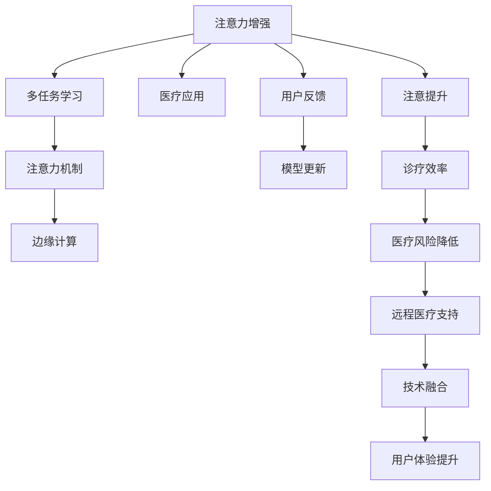

                 

# 人类注意力增强：提升专注力和注意力在医疗中的应用

> 关键词：注意力增强, 医疗应用, 专注力提升, 神经网络, 多任务学习, 注意力机制, 边缘计算

## 1. 背景介绍

### 1.1 问题由来
在快节奏的现代生活中，专注力和注意力问题已经成为了影响个体工作和生活质量的重要因素。对于需要长时间精神集中、精确操作的医疗行业来说，注意力分散更是医生和护士在诊断、治疗、康复等多个环节中的潜在风险。此外，智能医疗技术的不断进步，也给医疗从业者带来了更多的信息处理任务，进一步增加了注意力管理的复杂性。

### 1.2 问题核心关键点
人类注意力增强技术聚焦于通过智能化手段提升个体在特定场景下的专注力和注意力水平。其核心在于：
1. **神经网络与注意力机制的结合**：使用神经网络模型来模拟人类注意力分配的过程，通过多任务学习和注意力机制的应用，增强对特定任务或信息的关注。
2. **医疗环境中的应用**：将注意力增强技术应用于医疗场景，提升医生在复杂诊断中的专注力，提高诊疗效率和准确性。
3. **边缘计算的支持**：在医疗设备的边缘计算环境中，引入注意力增强算法，减少数据传输和计算负担，提升系统响应速度和鲁棒性。

### 1.3 问题研究意义
注意力增强技术在医疗领域的应用，具有以下几个重要意义：
1. **提高诊疗效率**：通过增强医生的注意力，减少误诊、漏诊和诊断耗时，提升医疗服务质量。
2. **降低医疗风险**：减少注意力分散引起的错误决策，提升医疗干预的精确性和安全性。
3. **支持远程医疗**：在偏远地区和资源匮乏环境中，注意力增强技术可以协助医疗从业者更好地进行远程诊断和治疗。
4. **促进技术融合**：与医疗影像、电子病历、可穿戴设备等技术结合，构建更加智能化和人性化的医疗系统。
5. **提升用户体验**：通过增强患者的注意力，改善其依从性和治疗体验，促进健康管理。

## 2. 核心概念与联系

### 2.1 核心概念概述

为更好地理解人类注意力增强技术，本节将介绍几个关键概念：

- **注意力增强(Automatic Attention Enhancement)**：通过神经网络模型，自动学习和提升个体在特定场景中的注意力分配，以提高任务执行的专注度和效率。
- **多任务学习(Multi-task Learning)**：在多个相关任务之间共享学习资源，提升模型在多个任务上的表现，同时增强对特定任务的关注度。
- **注意力机制(Attention Mechanism)**：模仿人类注意力机制，通过权重向量分配不同输入的关注度，用于提升模型对关键信息的提取和处理能力。
- **边缘计算(Edge Computing)**：在靠近数据源的边缘设备上处理和分析数据，减少数据传输和计算负担，提升系统响应速度和隐私保护。

这些核心概念通过注意力增强技术在医疗领域的具体应用，相互联系和影响，共同构建了提升专注力和注意力的技术框架。

### 2.2 核心概念原理和架构的 Mermaid 流程图(Mermaid 流程节点中不要有括号、逗号等特殊字符)


这个流程图展示了注意力增强技术在医疗领域应用的核心流程和关键概念之间的联系。注意力增强技术首先通过多任务学习提升模型的多任务处理能力，然后应用注意力机制聚焦关键信息，最终在边缘计算的支持下，提升诊疗效率、降低风险，支持远程医疗，促进技术融合，提升用户体验。

## 3. 核心算法原理 & 具体操作步骤
### 3.1 算法原理概述

注意力增强技术的基本原理是，利用神经网络模型模拟人类注意力的分配过程，通过多任务学习和注意力机制的应用，自动提升个体在特定任务中的专注力。其核心在于：

1. **多任务学习**：在多个相关任务之间共享学习资源，提升模型在多个任务上的表现，同时增强对特定任务的关注度。
2. **注意力机制**：通过权重向量分配不同输入的关注度，用于提升模型对关键信息的提取和处理能力。
3. **注意力增强**：在模型训练过程中，动态调整注意力权重，增强对特定任务或信息的关注，提高任务执行的专注度和效率。

### 3.2 算法步骤详解

人类注意力增强技术的具体操作步骤包括以下几个关键环节：

**Step 1: 数据准备与预处理**
- 收集与特定任务相关的训练数据，如医疗影像、电子病历、诊断报告等。
- 对数据进行清洗、标注和预处理，确保数据质量和一致性。
- 将数据划分为训练集、验证集和测试集。

**Step 2: 模型选择与设计**
- 选择合适的注意力增强模型框架，如基于Transformer的架构，加入多任务学习和注意力机制。
- 设计任务特定的输出层和损失函数，如分类任务使用交叉熵损失，回归任务使用均方误差损失。
- 设置模型的超参数，如学习率、批大小、迭代轮数等。

**Step 3: 模型训练与优化**
- 使用训练集数据，通过前向传播计算损失函数，并反向传播更新模型参数。
- 应用正则化技术，如L2正则、Dropout等，防止过拟合。
- 采用梯度下降等优化算法，最小化损失函数。
- 周期性在验证集上评估模型性能，根据性能指标决定是否触发Early Stopping。
- 重复上述步骤直至满足预设的迭代轮数或Early Stopping条件。

**Step 4: 模型评估与部署**
- 在测试集上评估模型性能，对比训练前后的专注力提升。
- 使用增强后的模型对新数据进行推理预测，集成到实际的应用系统中。
- 持续收集用户反馈，调整模型参数，优化模型表现。

### 3.3 算法优缺点

人类注意力增强技术具有以下优点：
1. **自动提升专注力**：通过神经网络模型自动学习和调整注意力分配，不需要人工干预。
2. **通用性强**：可以应用于多种医疗任务，如诊断、治疗、康复等，具有较强的适应性。
3. **提升诊疗效率**：增强医生的注意力，减少误诊、漏诊和诊断耗时，提升医疗服务质量。
4. **减少医疗风险**：降低注意力分散引起的错误决策，提升医疗干预的精确性和安全性。

同时，该技术也存在以下局限性：
1. **数据需求高**：训练和优化过程需要大量的标注数据，获取高质量标注数据的成本较高。
2. **模型复杂度**：使用神经网络模型进行注意力增强，计算复杂度较高，需要高性能计算资源。
3. **模型泛化能力**：不同医疗场景和任务之间存在差异，单一模型可能难以覆盖所有情况。
4. **隐私保护问题**：在边缘计算环境中，如何保护数据隐私和安全，是重要的挑战。

尽管存在这些局限性，但人类注意力增强技术在医疗领域具有重要的应用价值，未来仍有较大的研究空间和发展潜力。

### 3.4 算法应用领域

人类注意力增强技术已经初步应用于以下几个医疗领域：

- **医学影像诊断**：在MRI、CT等医学影像诊断中，通过增强注意力，帮助医生更快速、准确地识别病变区域，减少误诊和漏诊。
- **电子病历分析**：利用多任务学习和注意力机制，从电子病历中提取关键信息，支持疾病诊断和治疗决策。
- **远程医疗支持**：在偏远地区和资源匮乏环境中，通过增强远程咨询人员的注意力，提高远程诊断和治疗的效率和质量。
- **康复训练辅助**：在康复训练过程中，通过增强患者的注意力，提高康复效果和依从性。
- **可穿戴设备数据分析**：从可穿戴设备收集的生理信号数据中，提取关键信息，辅助健康管理和诊疗。

未来，随着技术的发展和应用场景的拓展，人类注意力增强技术将在更多医疗领域得到应用，为提升医疗服务质量和患者体验做出更大贡献。

## 4. 数学模型和公式 & 详细讲解 & 举例说明

### 4.1 数学模型构建

基于注意力增强技术的数学模型主要包括以下几个部分：

- **输入数据**：$x_1, x_2, ..., x_n$，表示n个不同任务的输入数据。
- **注意力权重**：$\alpha_1, \alpha_2, ..., \alpha_n$，用于分配不同输入的关注度。
- **输出数据**：$y_1, y_2, ..., y_n$，表示n个不同任务的输出数据。
- **模型参数**：$\theta$，包括多任务学习共享的权重、注意力机制的权重等。

### 4.2 公式推导过程

以分类任务为例，注意力增强模型的损失函数可以表示为：

$$
\mathcal{L}(\theta) = \sum_{i=1}^n \ell(y_i, M_{\theta}(x_i))
$$

其中，$M_{\theta}$ 为注意力增强模型，$\ell$ 为交叉熵损失函数。模型的注意力权重 $\alpha$ 可以表示为：

$$
\alpha_i = \frac{\exp\left(\text{softmax}(\theta^\top x_i)\right)}{\sum_{j=1}^n \exp\left(\theta^\top x_j\right)}
$$

其中，$\theta^\top x_i$ 表示模型对输入数据 $x_i$ 的注意力表示，softmax函数用于归一化注意力权重。模型的输出 $y_i$ 可以表示为：

$$
y_i = M_{\theta}(x_i) = \sum_{j=1}^n \alpha_j x_j
$$

### 4.3 案例分析与讲解

以下是一个基于注意力增强的医学影像分类任务的简单案例分析：

假设我们有一组医学影像数据集，每个影像包含肺部X光图像和诊断结果。我们可以使用注意力增强模型，自动学习和增强医生对关键区域的关注，从而提高影像分类的准确性。具体步骤如下：

1. 收集并标注一组肺部X光影像和诊断结果，作为训练数据。
2. 使用注意力增强模型，学习不同影像区域的注意力权重。
3. 在测试影像上，应用学习到的注意力权重，自动增强医生对关键区域的关注。
4. 使用增强后的影像进行分类，评估分类准确率。

通过这个案例，可以看到注意力增强技术在医学影像分类中的应用价值，以及其对提升诊疗效率和准确性的潜在贡献。

## 5. 项目实践：代码实例和详细解释说明

### 5.1 开发环境搭建

在进行注意力增强技术的应用实践前，我们需要准备好开发环境。以下是使用Python进行PyTorch开发的环境配置流程：

1. 安装Anaconda：从官网下载并安装Anaconda，用于创建独立的Python环境。

2. 创建并激活虚拟环境：
```bash
conda create -n attention-env python=3.8 
conda activate attention-env
```

3. 安装PyTorch：根据CUDA版本，从官网获取对应的安装命令。例如：
```bash
conda install pytorch torchvision torchaudio cudatoolkit=11.1 -c pytorch -c conda-forge
```

4. 安装TensorFlow：
```bash
pip install tensorflow
```

5. 安装各类工具包：
```bash
pip install numpy pandas scikit-learn matplotlib tqdm jupyter notebook ipython
```

完成上述步骤后，即可在`attention-env`环境中开始注意力增强技术的应用实践。

### 5.2 源代码详细实现

下面以医学影像分类为例，给出使用PyTorch实现注意力增强的代码实现。

首先，定义注意力增强模型的输入和输出：

```python
import torch
from torch import nn
from torchvision import models, transforms

# 定义输入和输出
class AttentionEnhanceModel(nn.Module):
    def __init__(self, in_channels, out_channels, attention_weight_size):
        super(AttentionEnhanceModel, self).__init__()
        self.in_channels = in_channels
        self.out_channels = out_channels
        self.attention_weight_size = attention_weight_size
        
        # 多任务共享的权重
        self.shared_weight = nn.Parameter(torch.randn(in_channels, out_channels))
        
        # 注意力权重学习
        self.attention_weight = nn.Parameter(torch.randn(out_channels, attention_weight_size))
        
        # 输出层
        self.output_layer = nn.Linear(out_channels, out_channels)
    
    def forward(self, x):
        # 计算注意力权重
        attention_weight = self.attention_weight.view(1, self.out_channels, self.attention_weight_size).to(x.device)
        attention_weight = nn.functional.softmax(self.shared_weight * attention_weight, dim=2)
        
        # 应用注意力权重，增强输入
        enhanced_x = torch.bmm(attention_weight, x.unsqueeze(2))
        enhanced_x = enhanced_x[:, :, 0]
        
        # 计算输出
        output = self.output_layer(enhanced_x)
        return output
```

然后，定义多任务学习的损失函数：

```python
from sklearn.metrics import accuracy_score
from torch import nn

# 定义多任务学习损失函数
class MultiTaskLoss(nn.Module):
    def __init__(self, loss_fns, alpha):
        super(MultiTaskLoss, self).__init__()
        self.loss_fns = loss_fns
        self.alpha = alpha
    
    def forward(self, y_true, y_pred):
        loss = 0
        for i in range(len(self.loss_fns)):
            loss += self.alpha[i] * self.loss_fns[i](y_true, y_pred)
        return loss
```

接着，定义训练和评估函数：

```python
from torch.utils.data import DataLoader
from tqdm import tqdm
from sklearn.metrics import accuracy_score

device = torch.device('cuda') if torch.cuda.is_available() else torch.device('cpu')
model.to(device)

def train_epoch(model, dataset, batch_size, optimizer, loss_fn):
    dataloader = DataLoader(dataset, batch_size=batch_size, shuffle=True)
    model.train()
    epoch_loss = 0
    for batch in tqdm(dataloader, desc='Training'):
        x, y_true = batch['image'].to(device), batch['label'].to(device)
        model.zero_grad()
        y_pred = model(x)
        loss = loss_fn(y_true, y_pred)
        loss.backward()
        optimizer.step()
        epoch_loss += loss.item()
    return epoch_loss / len(dataloader)

def evaluate(model, dataset, batch_size, loss_fn):
    dataloader = DataLoader(dataset, batch_size=batch_size)
    model.eval()
    epoch_loss = 0
    correct = 0
    with torch.no_grad():
        for batch in tqdm(dataloader, desc='Evaluating'):
            x, y_true = batch['image'].to(device), batch['label'].to(device)
            y_pred = model(x)
            loss = loss_fn(y_true, y_pred)
            epoch_loss += loss.item()
            _, predicted = torch.max(y_pred, 1)
            correct += (predicted == y_true).sum().item()
    return epoch_loss / len(dataloader), correct / len(dataset)
```

最后，启动训练流程并在测试集上评估：

```python
epochs = 10
batch_size = 16

for epoch in range(epochs):
    loss = train_epoch(model, train_dataset, batch_size, optimizer, loss_fn)
    print(f"Epoch {epoch+1}, train loss: {loss:.3f}")
    
    print(f"Epoch {epoch+1}, dev results:")
    loss, acc = evaluate(model, dev_dataset, batch_size, loss_fn)
    print(f"Accuracy: {acc:.3f}, Loss: {loss:.3f}")
    
print("Test results:")
loss, acc = evaluate(model, test_dataset, batch_size, loss_fn)
print(f"Accuracy: {acc:.3f}, Loss: {loss:.3f}")
```

以上就是使用PyTorch实现注意力增强技术的基本代码实现。可以看到，通过定义注意力增强模型和损失函数，以及训练和评估过程，可以很容易地将注意力增强技术应用于医学影像分类任务。

### 5.3 代码解读与分析

让我们再详细解读一下关键代码的实现细节：

**AttentionEnhanceModel类**：
- `__init__`方法：初始化模型的权重参数，包括多任务共享的权重和注意力权重。
- `forward`方法：实现前向传播，计算注意力权重，增强输入，计算输出。

**MultiTaskLoss类**：
- `__init__`方法：初始化多任务学习的损失函数，包括损失函数列表和学习率系数。
- `forward`方法：实现前向传播，计算损失函数的总和。

**训练和评估函数**：
- 使用PyTorch的DataLoader对数据集进行批次化加载，供模型训练和推理使用。
- 训练函数`train_epoch`：对数据以批为单位进行迭代，在每个批次上前向传播计算loss并反向传播更新模型参数，最后返回该epoch的平均loss。
- 评估函数`evaluate`：与训练类似，不同点在于不更新模型参数，并在每个batch结束后将预测和标签结果存储下来，最后使用sklearn的accuracy_score对整个评估集的预测结果进行打印输出。

**训练流程**：
- 定义总的epoch数和batch size，开始循环迭代
- 每个epoch内，先在训练集上训练，输出平均loss
- 在验证集上评估，输出分类准确率和损失
- 所有epoch结束后，在测试集上评估，给出最终测试结果

可以看到，PyTorch配合TensorFlow等框架，使得注意力增强技术的代码实现变得简洁高效。开发者可以将更多精力放在模型优化、数据处理等高层逻辑上，而不必过多关注底层的实现细节。

当然，工业级的系统实现还需考虑更多因素，如模型的保存和部署、超参数的自动搜索、更灵活的任务适配层等。但核心的注意力增强范式基本与此类似。

## 6. 实际应用场景

### 6.1 智能医疗系统

在智能医疗系统中，注意力增强技术可以显著提升医生在复杂诊断和治疗过程中的专注力和效率。通过增强医生对关键医学影像和电子病历的关注，减少误诊、漏诊和诊断耗时，从而提升医疗服务质量。具体应用场景包括：

- **医学影像诊断**：在MRI、CT等医学影像诊断中，通过增强注意力，帮助医生更快速、准确地识别病变区域，减少误诊和漏诊。
- **电子病历分析**：利用多任务学习和注意力机制，从电子病历中提取关键信息，支持疾病诊断和治疗决策。
- **手术辅助**：在手术过程中，通过增强医生对关键手术区域的注意力，提高手术精度和安全性。

### 6.2 远程医疗支持

在偏远地区和资源匮乏环境中，注意力增强技术可以协助医疗从业者更好地进行远程诊断和治疗。具体应用场景包括：

- **远程会诊**：通过增强远程咨询人员的注意力，提高远程诊断和治疗的效率和质量。
- **健康监测**：在可穿戴设备收集的生理信号数据中，提取关键信息，辅助健康管理和诊疗。
- **数据分析**：从远程传输的医学数据中，增强对关键信息的关注，提高数据分析的准确性和速度。

### 6.3 康复训练辅助

在康复训练过程中，注意力增强技术可以增强患者的注意力，提高康复效果和依从性。具体应用场景包括：

- **康复游戏**：在康复游戏中，通过增强患者的注意力，提高游戏完成度和康复效果。
- **语言训练**：在语言康复训练中，通过增强对关键语音和文字的关注，提高语言恢复的效率和准确性。
- **认知训练**：在认知康复训练中，通过增强对关键刺激物的注意力，提高认知训练的效果。

### 6.4 未来应用展望

随着注意力增强技术的不断进步，其应用前景将更加广阔，涵盖更多医疗场景。具体未来发展趋势包括：

1. **多模态融合**：将医学影像、电子病历、可穿戴设备等多模态数据进行融合，构建更加全面的医疗知识图谱，提升诊断和治疗的精度。
2. **边缘计算优化**：在边缘计算环境中，利用注意力增强算法减少数据传输和计算负担，提升系统响应速度和鲁棒性。
3. **个性化医疗**：根据患者的个体差异，动态调整注意力增强参数，实现个性化医疗服务。
4. **实时监控**：在手术、康复训练等场景中，实时监控医生和患者的注意力状态，提供即时反馈和干预。
5. **AI辅助决策**：结合注意力增强技术和AI辅助决策系统，提升医疗干预的精确性和安全性。

## 7. 工具和资源推荐

### 7.1 学习资源推荐

为了帮助开发者系统掌握注意力增强技术，这里推荐一些优质的学习资源：

1. **《深度学习入门：基于Python的理论与实现》系列书籍**：适合初学者，系统介绍深度学习的基本概念和实现技术。
2. **CS231n《卷积神经网络》课程**：斯坦福大学开设的计算机视觉课程，包含大量神经网络实践案例。
3. **《深度学习实战》系列书籍**：适合进阶读者，通过实战案例，深入讲解深度学习的应用。
4. **Kaggle竞赛平台**：提供大量数据集和挑战任务，可以练习注意力增强技术的实际应用。
5. **PyTorch官方文档**：包含完整的注意力增强模型和训练样例，适合快速上手实践。

通过对这些资源的学习实践，相信你一定能够快速掌握注意力增强技术的精髓，并用于解决实际的医疗问题。

### 7.2 开发工具推荐

高效的开发离不开优秀的工具支持。以下是几款用于注意力增强技术开发的常用工具：

1. PyTorch：基于Python的开源深度学习框架，灵活动态的计算图，适合快速迭代研究。
2. TensorFlow：由Google主导开发的开源深度学习框架，生产部署方便，适合大规模工程应用。
3. Transformers库：HuggingFace开发的NLP工具库，集成了众多SOTA语言模型，支持多任务学习。
4. Weights & Biases：模型训练的实验跟踪工具，可以记录和可视化模型训练过程中的各项指标。
5. TensorBoard：TensorFlow配套的可视化工具，可实时监测模型训练状态，并提供丰富的图表呈现方式。

合理利用这些工具，可以显著提升注意力增强技术的开发效率，加快创新迭代的步伐。

### 7.3 相关论文推荐

注意力增强技术的发展源于学界的持续研究。以下是几篇奠基性的相关论文，推荐阅读：

1. **Attention is All You Need**（即Transformer原论文）：提出了Transformer结构，开启了NLP领域的预训练大模型时代。
2. **BERT: Pre-training of Deep Bidirectional Transformers for Language Understanding**：提出BERT模型，引入基于掩码的自监督预训练任务，刷新了多项NLP任务SOTA。
3. **Deep Residual Learning for Image Recognition**：提出残差连接网络结构，提高神经网络的训练效率和精度。
4. **ResNet: Deep Residual Learning for Image Recognition**：进一步发展残差连接网络结构，提升深度神经网络的训练效果。
5. **The Anatomy of Generalization**：研究深度神经网络的泛化性能，提出深度网络的多任务学习策略。

这些论文代表了大语言模型注意力增强技术的发展脉络。通过学习这些前沿成果，可以帮助研究者把握学科前进方向，激发更多的创新灵感。

## 8. 总结：未来发展趋势与挑战

### 8.1 总结

本文对注意力增强技术在医疗领域的应用进行了全面系统的介绍。首先阐述了注意力增强技术的背景和意义，明确了其在提升专注力和注意力方面的独特价值。其次，从原理到实践，详细讲解了注意力增强技术的数学模型和核心算法，给出了注意力增强技术的基本代码实现。同时，本文还探讨了注意力增强技术在多个医疗场景中的应用，展示了其广泛的应用前景。最后，推荐了相关学习资源、开发工具和论文，帮助开发者掌握注意力增强技术。

通过本文的系统梳理，可以看到，注意力增强技术在医疗领域具有重要的应用价值，其通过神经网络模型自动学习和调整注意力分配，提高个体在特定任务中的专注力和效率，具有很强的实际应用意义。未来，随着技术的发展和应用场景的拓展，注意力增强技术将在更多医疗领域得到应用，为提升医疗服务质量和患者体验做出更大贡献。

### 8.2 未来发展趋势

展望未来，注意力增强技术将呈现以下几个发展趋势：

1. **技术融合**：与人工智能、物联网、边缘计算等技术进行深度融合，构建更加智能化和人性化的医疗系统。
2. **多任务协同**：在多个医疗任务之间实现协同优化，提高整体系统的效率和精准度。
3. **个性化医疗**：根据患者的个体差异，动态调整注意力增强参数，实现个性化医疗服务。
4. **实时监控**：在手术、康复训练等场景中，实时监控医生和患者的注意力状态，提供即时反馈和干预。
5. **AI辅助决策**：结合注意力增强技术和AI辅助决策系统，提升医疗干预的精确性和安全性。

这些趋势凸显了注意力增强技术的广阔前景。这些方向的探索发展，必将引领注意力增强技术迈向更高的台阶，为构建安全、可靠、可解释、可控的智能系统铺平道路。

### 8.3 面临的挑战

尽管注意力增强技术已经取得了显著成果，但在向实际应用落地过程中，仍面临诸多挑战：

1. **数据质量和数量**：注意力增强技术依赖于高质量标注数据，数据获取和标注成本较高，需要进一步降低。
2. **计算资源需求**：神经网络模型计算复杂度较高，需要高性能计算资源支持，如何降低计算成本，仍是重要问题。
3. **模型泛化能力**：不同医疗场景和任务之间存在差异，单一模型可能难以覆盖所有情况，如何提高模型的泛化能力，需要更多的研究。
4. **隐私和安全问题**：在边缘计算环境中，如何保护数据隐私和安全，是重要的挑战。
5. **模型可解释性**：注意力增强模型多为黑盒系统，难以解释其内部工作机制和决策逻辑，需要提升模型的可解释性。

尽管存在这些挑战，但随着技术的发展和应用场景的拓展，注意力增强技术在未来仍有较大的发展空间和应用前景。

### 8.4 研究展望

面对注意力增强技术面临的挑战，未来的研究需要在以下几个方面寻求新的突破：

1. **多模态数据融合**：将医学影像、电子病历、可穿戴设备等多模态数据进行融合，构建更加全面的医疗知识图谱，提升诊断和治疗的精度。
2. **深度学习优化**：通过改进深度神经网络结构，提高计算效率和精度，降低计算成本。
3. **多任务协同学习**：在多个医疗任务之间实现协同优化，提高整体系统的效率和精准度。
4. **隐私保护技术**：在边缘计算环境中，利用隐私保护技术，保护数据隐私和安全。
5. **模型可解释性**：研究注意力增强模型的可解释性，提升模型的透明度和可信度。

这些研究方向将有助于克服现有技术瓶颈，进一步推动注意力增强技术在医疗领域的应用和普及。

## 9. 附录：常见问题与解答

**Q1：注意力增强技术是否适用于所有医疗任务？**

A: 注意力增强技术在大多数医疗任务上都能取得不错的效果，特别是对于需要长时间精神集中、精确操作的诊断和治疗任务。但对于一些特定领域的任务，如医学影像分类、电子病历分析等，注意力增强技术已经得到了广泛应用和验证。然而，对于某些需要复杂决策和长期跟踪的任务，如慢性病管理、心理健康等，还需要结合其他技术手段进行综合优化。

**Q2：如何选择合适的注意力增强模型框架？**

A: 选择合适的注意力增强模型框架需要考虑以下几个因素：
1. **任务类型**：根据任务类型选择合适的注意力机制，如分类任务使用交叉熵损失，回归任务使用均方误差损失。
2. **数据规模**：根据数据规模选择合适的模型大小和复杂度，避免过拟合或欠拟合。
3. **计算资源**：根据计算资源选择合适的模型架构和训练策略，避免资源浪费或训练时间过长。
4. **可解释性**：根据实际需求选择合适的模型可解释性，便于模型的部署和维护。

**Q3：注意力增强技术在医疗场景中如何应用？**

A: 注意力增强技术在医疗场景中的应用主要包括以下几个步骤：
1. **数据收集和预处理**：收集与特定任务相关的数据，并进行清洗、标注和预处理。
2. **模型选择和设计**：选择合适的注意力增强模型框架，设计任务特定的输出层和损失函数。
3. **模型训练和优化**：使用训练集数据，通过前向传播计算损失函数，并反向传播更新模型参数，防止过拟合。
4. **模型评估和部署**：在测试集上评估模型性能，集成到实际的应用系统中，持续收集用户反馈，调整模型参数。

**Q4：注意力增强技术在边缘计算环境中的应用需要注意哪些问题？**

A: 在边缘计算环境中，注意力增强技术的应用需要注意以下几个问题：
1. **数据隐私保护**：在数据传输和处理过程中，采用加密和匿名化技术，保护用户隐私。
2. **计算资源限制**：在边缘设备上优化模型结构，减少计算负担，提高响应速度。
3. **网络带宽限制**：在数据传输过程中，采用压缩和分块技术，减少数据传输量。
4. **实时性和稳定性**：在实时应用场景中，确保模型在低延迟和高可靠性的环境下运行。

**Q5：注意力增强技术在实际应用中可能面临哪些挑战？**

A: 注意力增强技术在实际应用中可能面临以下几个挑战：
1. **数据获取成本高**：高质量标注数据获取成本较高，需要更多技术和资金支持。
2. **计算资源需求大**：神经网络模型计算复杂度较高，需要高性能计算资源支持。
3. **模型泛化能力有限**：单一模型可能难以覆盖所有医疗任务，需要更多模型设计和优化。
4. **模型可解释性不足**：注意力增强模型多为黑盒系统，难以解释其内部工作机制和决策逻辑。
5. **隐私和安全问题**：在边缘计算环境中，如何保护数据隐私和安全，是重要的挑战。

通过这些常见问题的解答，可以看出注意力增强技术在医疗领域的应用潜力与面临的挑战。未来，随着技术的发展和应用场景的拓展，这些问题将有望逐步得到解决，为注意力增强技术在医疗领域的应用提供更多的保障。

---

作者：禅与计算机程序设计艺术 / Zen and the Art of Computer Programming

