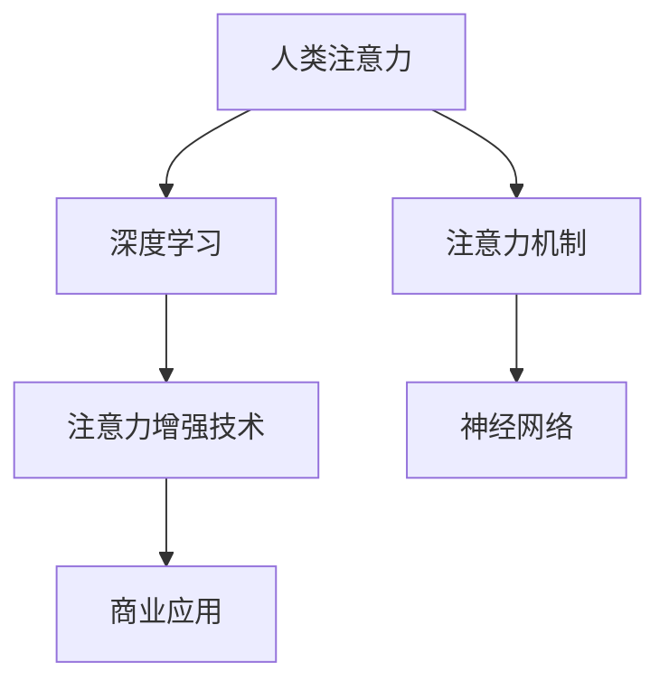

                 

# 人类注意力增强：提升专注力和注意力在商业中的应用趋势

> 关键词：人类注意力增强, 专注力提升, 商业应用, 神经网络, 深度学习, 注意力机制, 案例分析, 技术应用

## 1. 背景介绍

### 1.1 问题由来

在当今信息爆炸的时代，注意力已经成为人们决策和行动的关键。如何在海量的信息中快速聚焦并有效利用有限的注意力资源，成为了商业和技术领域共同关注的焦点。特别是在高压力、高竞争的商业环境中，提升个体的专注力和注意力，已经成为企业和个人成功的重要因素。

### 1.2 问题核心关键点

人类注意力的提升涉及到多个层次，包括生理、心理和认知等方面。从神经科学的角度来看，注意力机制被认为是一种复杂的认知过程，涉及信息的感知、编码、存储和检索等多个阶段。在商业应用中，提升专注力可以通过技术手段实现，主要包括两个方面：

1. **神经科学原理的应用**：通过神经科学原理，研究注意力机制的生理基础，开发出能够增强人类注意力的技术。
2. **深度学习与人工智能**：利用深度学习和人工智能技术，开发出能够模拟和优化注意力机制的算法，辅助人类提升专注力。

### 1.3 问题研究意义

提升人类注意力在商业中的应用，具有以下重要意义：

1. **提高工作效率**：增强专注力和注意力，可以帮助个体在有限的时间内处理更多信息，提高工作效率。
2. **优化决策质量**：提高注意力水平，可以更好地集中精力于决策过程，减少错误和遗漏。
3. **提升用户体验**：特别是在信息消费和娱乐领域，提升注意力水平可以提供更优质的用户体验。
4. **促进创新能力**：专注力和注意力提升，可以促进个体在学习和工作中产生更多创新想法和解决方案。
5. **增强竞争优势**：在快速变化的市场环境中，能够高效利用注意力的个体和组织往往更具竞争力。

## 2. 核心概念与联系

### 2.1 核心概念概述

为更好地理解人类注意力增强和提升专注力的商业应用，本节将介绍几个关键概念及其相互联系：

- **人类注意力**：人类注意力是指个体在特定时间内对某项活动或信息的集中关注程度。注意力水平影响着个体的认知和行为表现。
- **深度学习与神经网络**：深度学习是一种基于多层神经网络的机器学习方法，能够处理复杂的数据和非线性关系，广泛应用于图像、语音、文本等多种数据类型。
- **注意力机制**：注意力机制是一种机制，通过计算输入数据的权重，筛选出对当前任务最相关的信息。在深度学习中，注意力机制可以帮助模型更好地聚焦于关键部分，提高预测和推理的准确性。
- **注意力增强技术**：注意力增强技术是指利用深度学习模型模拟人类注意力机制，通过训练优化算法，提升个体的注意力水平。
- **商业应用**：注意力增强技术在商业中具有广泛的应用场景，如提升工作效率、优化决策质量、增强用户体验等。

这些核心概念之间的逻辑关系可以通过以下Mermaid流程图来展示：



这个流程图展示了几者之间的联系：

1. 人类注意力受到神经网络机制的调控。
2. 深度学习能够模拟注意力机制。
3. 注意力增强技术通过神经网络优化注意力。
4. 商业应用依赖于注意力增强技术。

## 3. 核心算法原理 & 具体操作步骤

### 3.1 算法原理概述

注意力增强技术主要是基于深度学习中的注意力机制，通过模拟人类注意力选择过程，优化信息处理过程。在商业应用中，通常包括以下几个步骤：

1. **数据收集**：收集个体的注意力数据，如眼动轨迹、脑电波等生理数据，或通过问卷调查获取主观评价数据。
2. **数据预处理**：对收集到的数据进行清洗、归一化等预处理操作。
3. **注意力模型训练**：使用深度学习模型（如循环神经网络、卷积神经网络、Transformer等）进行注意力机制的训练。
4. **注意力增强**：通过训练后的模型，对个体在特定任务上的注意力进行增强，提高其专注力和注意力水平。
5. **效果评估**：评估注意力增强技术的效果，通过各种指标（如注意力持续时间、任务完成时间等）进行量化评估。

### 3.2 算法步骤详解

注意力增强技术的实施步骤可以分为以下几个关键环节：

**Step 1: 数据收集与预处理**
- 收集个体的注意力数据，如眼动轨迹、脑电波等生理数据，或通过问卷调查获取主观评价数据。
- 对收集到的数据进行清洗、归一化等预处理操作，确保数据的质量和一致性。

**Step 2: 注意力模型设计**
- 选择合适的深度学习模型，如循环神经网络（RNN）、卷积神经网络（CNN）、Transformer等，用于模拟注意力机制。
- 设计注意力模型的输入输出结构，明确模型的任务目标（如任务完成时间、任务质量等）。
- 确定模型的超参数，如学习率、批大小、迭代轮数等，以指导模型训练。

**Step 3: 模型训练**
- 将预处理后的数据输入注意力模型，进行前向传播计算。
- 反向传播计算模型参数的梯度，根据设定的优化算法（如Adam、SGD等）更新模型参数。
- 重复上述步骤，直至模型收敛，达到预设的性能指标。

**Step 4: 注意力增强**
- 使用训练好的注意力模型，对个体在特定任务上的注意力进行增强。
- 通过调整模型的输出，改变个体在任务上的注意力分配，提高其专注力和注意力水平。
- 持续监测个体的注意力状态，根据反馈调整模型的参数，进一步优化注意力增强效果。

**Step 5: 效果评估**
- 使用各种指标（如注意力持续时间、任务完成时间等）对注意力增强的效果进行量化评估。
- 对比增强前后的注意力水平变化，评估注意力增强技术的效果。
- 根据评估结果，进一步优化模型的设计，提高注意力增强技术的性能。

### 3.3 算法优缺点

注意力增强技术具有以下优点：

1. **数据驱动**：通过收集和分析个体的注意力数据，可以更准确地评估和提升注意力水平。
2. **高效性**：利用深度学习模型进行计算，可以高效地处理大量数据，快速得到注意力增强效果。
3. **可扩展性**：适用于各种商业场景，如工作、学习、娱乐等，具有广泛的应用前景。

同时，该技术也存在一些缺点：

1. **数据隐私**：在收集和处理个体注意力数据时，需要确保数据的隐私和安全，避免数据滥用。
2. **模型复杂性**：深度学习模型的设计和训练需要较高的技术门槛，模型过于复杂可能导致难以解释。
3. **个体差异**：不同个体的注意力机制和需求各异，统一的技术方案可能无法满足所有人的需求。
4. **效果评估难度**：注意力增强效果可能受到多种因素的影响，评估难度较大。

### 3.4 算法应用领域

注意力增强技术已经在多个领域得到广泛应用，例如：

- **教育领域**：通过注意力增强技术，帮助学生提高课堂专注力和学习效果，提升教学质量。
- **工作领域**：在职场中，帮助员工提升工作效率，优化工作流程，减少错误和遗漏。
- **娱乐领域**：在影视、游戏等娱乐产品中，提升用户体验，增加用户黏性。
- **健康领域**：通过注意力训练，帮助个体改善认知功能，提升生活质量。
- **军事领域**：在决策分析、任务执行等方面，提高军队的效率和准确性。

这些领域的应用展示了注意力增强技术的广泛影响力和实际效果。未来，随着技术的发展，更多的新应用场景将被挖掘，进一步推动人类注意力增强技术的发展。

## 4. 数学模型和公式 & 详细讲解 & 举例说明

### 4.1 数学模型构建

注意力增强技术的数学模型构建，主要基于注意力机制的基本原理。常见的注意力机制包括软注意力（Soft Attention）和硬注意力（Hard Attention）两种。这里以软注意力为例，介绍数学模型的构建过程。

假设输入数据为 $x$，模型参数为 $\theta$，注意力机制的输出为 $\alpha$，则软注意力机制的数学模型可以表示为：

$$
\alpha = \text{Softmax}(a(x; \theta))
$$

其中 $a(x; \theta)$ 为注意力函数，其输出为一个向量，表示各个输入数据的注意力权重。Softmax函数将注意力权重转换为概率分布，确保权重和为1。注意力函数 $a(x; \theta)$ 可以根据具体任务进行设计，如使用点积注意力、多头注意力等。

### 4.2 公式推导过程

以点积注意力机制为例，其注意力函数的计算公式为：

$$
a(x; \theta) = \frac{e^{\text{dot}(x, \theta)}}{\sum_{i=1}^{n} e^{\text{dot}(x_i, \theta)}}
$$

其中，$\text{dot}(x, \theta)$ 表示向量 $x$ 和权重 $\theta$ 的点积。注意力函数 $a(x; \theta)$ 的计算过程包括两个步骤：

1. 计算每个输入数据的点积，得到向量 $a(x; \theta) = [a_1, a_2, ..., a_n]$。
2. 通过Softmax函数将向量 $a(x; \theta)$ 转换为概率分布 $\alpha = [\alpha_1, \alpha_2, ..., \alpha_n]$，表示各个输入数据的注意力权重。

通过训练深度学习模型，优化注意力函数的参数 $\theta$，可以使其更好地模拟人类注意力机制，提升个体在特定任务上的注意力水平。

### 4.3 案例分析与讲解

以企业员工注意力增强为例，介绍注意力增强技术的具体应用。假设企业需要对员工在处理工作任务时的注意力进行增强，其过程可以分为以下几个步骤：

**Step 1: 数据收集**
- 通过眼动追踪设备收集员工在处理任务时的眼动轨迹数据。
- 使用问卷调查收集员工对任务的主观评价，如任务难度、兴趣等。

**Step 2: 数据预处理**
- 对眼动轨迹数据进行清洗、归一化等预处理操作。
- 将主观评价数据进行编码，生成训练数据。

**Step 3: 模型训练**
- 使用Transformer模型进行注意力机制的训练。
- 设计注意力模型的输入输出结构，明确模型的任务目标，如任务完成时间、任务质量等。
- 确定模型的超参数，如学习率、批大小、迭代轮数等。

**Step 4: 注意力增强**
- 使用训练好的Transformer模型，对员工在特定任务上的注意力进行增强。
- 通过调整模型的输出，改变员工在任务上的注意力分配，提高其专注力和注意力水平。
- 持续监测员工的注意力状态，根据反馈调整模型的参数，进一步优化注意力增强效果。

**Step 5: 效果评估**
- 使用任务完成时间和任务质量等指标对注意力增强的效果进行量化评估。
- 对比增强前后的注意力水平变化，评估注意力增强技术的效果。
- 根据评估结果，进一步优化模型的设计，提高注意力增强技术的性能。

## 5. 项目实践：代码实例和详细解释说明

### 5.1 开发环境搭建

在进行注意力增强技术实践前，我们需要准备好开发环境。以下是使用Python进行TensorFlow和Keras开发的环境配置流程：

1. 安装Anaconda：从官网下载并安装Anaconda，用于创建独立的Python环境。

2. 创建并激活虚拟环境：
```bash
conda create -n attention-env python=3.8 
conda activate attention-env
```

3. 安装TensorFlow和Keras：
```bash
conda install tensorflow keras
```

4. 安装各种工具包：
```bash
pip install numpy pandas matplotlib seaborn jupyter notebook
```

完成上述步骤后，即可在`attention-env`环境中开始注意力增强技术的实践。

### 5.2 源代码详细实现

下面以员工注意力增强为例，给出使用TensorFlow和Keras进行注意力增强的PyTorch代码实现。

首先，定义注意力机制的模型：

```python
import tensorflow as tf
from tensorflow.keras.layers import Input, Dense, RepeatVector, TimeDistributed, Masking
from tensorflow.keras.models import Model

# 定义注意力模型的输入输出
input_data = Input(shape=(timesteps, input_dim))
attention_weight = Dense(attention_dim)(input_data)
attention_weight = RepeatVector(timesteps)(attention_weight)
attention_weight = TimeDistributed(Dense(1))(attention_weight)
attention_weight = tf.keras.layers.Activation('softmax')(attention_weight)
attention_weight = Masking(mask_value=0.0)(attention_weight)

# 定义注意力增强模型
output_data = Dense(output_dim, activation='softmax')(attention_weight)
model = Model(inputs=input_data, outputs=output_data)
model.summary()
```

然后，定义模型的训练过程：

```python
# 加载数据集
train_data = ...
test_data = ...

# 定义训练参数
batch_size = 64
epochs = 100
learning_rate = 0.001

# 定义优化器和损失函数
optimizer = tf.keras.optimizers.Adam(learning_rate)
loss = tf.keras.losses.MeanSquaredError()

# 训练模型
model.compile(optimizer=optimizer, loss=loss)
model.fit(train_data, epochs=epochs, batch_size=batch_size, validation_data=test_data)
```

最后，启动注意力增强模型的训练和评估：

```python
# 训练模型
model.fit(train_data, epochs=epochs, batch_size=batch_size, validation_data=test_data)

# 评估模型
test_loss = model.evaluate(test_data)
print('Test loss:', test_loss)
```

以上就是使用TensorFlow和Keras进行注意力增强的完整代码实现。可以看到，使用深度学习框架可以方便地实现注意力机制的建模和训练。

### 5.3 代码解读与分析

让我们再详细解读一下关键代码的实现细节：

**定义注意力机制的模型**：
- `input_data` 表示输入数据，其形状为 (timesteps, input_dim)，timesteps 为时间步数，input_dim 为输入维度。
- `attention_weight` 表示注意力权重，通过密集层（Dense）进行计算，输出一个长度为 timesteps 的向量。
- `attention_weight` 通过 `RepeatVector` 进行重复，得到长度为 timesteps 的向量，表示每个时间步的注意力权重。
- `attention_weight` 通过 `TimeDistributed` 进行时间维度上的分布计算，得到注意力权重。
- `attention_weight` 通过 `Activation` 进行激活函数计算，得到注意力权重。
- `attention_weight` 通过 `Masking` 进行掩码处理，确保注意力权重不小于0。
- 最终，通过密集层（Dense）计算注意力增强输出，得到 (timesteps, output_dim) 的输出。

**定义模型的训练过程**：
- `train_data` 和 `test_data` 表示训练集和测试集，需要提前加载和处理。
- `batch_size` 和 `epochs` 表示批次大小和训练轮数，根据实际情况进行设定。
- `optimizer` 和 `loss` 分别表示优化器和损失函数，使用 Adam 优化器和均方误差损失函数。
- `model.compile` 表示模型编译，指定优化器和损失函数。
- `model.fit` 表示模型训练，使用训练集进行训练，并使用测试集进行验证。

**训练和评估模型**：
- `model.fit` 表示模型训练，使用训练集进行训练，并使用测试集进行验证。
- `model.evaluate` 表示模型评估，使用测试集进行评估，并输出测试损失。

可以看到，使用深度学习框架可以方便地实现注意力机制的建模和训练。开发者可以将更多精力放在数据处理、模型改进等高层逻辑上，而不必过多关注底层的实现细节。

当然，工业级的系统实现还需考虑更多因素，如模型的保存和部署、超参数的自动搜索、更灵活的任务适配层等。但核心的注意力增强方法基本与此类似。

## 6. 实际应用场景

### 6.1 智能办公系统

在智能办公系统中，注意力增强技术可以用于提升员工的工作效率和专注力。通过监测员工在处理任务时的注意力状态，系统可以自动调整工作界面，减少干扰因素，提高员工的工作效率。例如，系统可以自动隐藏不必要的应用程序，减少桌面杂乱，帮助员工更好地集中精力于当前任务。

### 6.2 在线学习平台

在线学习平台可以通过注意力增强技术，提升学生的学习效果和专注力。通过监测学生在学习过程中的注意力状态，系统可以自动调整教学内容和难度，增加学习趣味性和互动性，提高学生的学习兴趣和专注力。例如，系统可以根据学生的注意力状态，推荐适合其当前学习水平的内容，或者调整讲解方式，增加互动性。

### 6.3 商业决策支持

在商业决策支持系统中，注意力增强技术可以帮助管理者更好地集中精力于决策过程。通过监测管理者的注意力状态，系统可以自动调整界面和内容，减少干扰因素，提高决策的准确性和效率。例如，系统可以自动屏蔽无关信息，提供关键数据和分析结果，帮助管理者更好地进行决策。

### 6.4 娱乐内容推荐

在娱乐内容推荐系统中，注意力增强技术可以帮助用户更好地享受内容。通过监测用户对不同内容的注意力状态，系统可以自动调整推荐算法，提供更符合用户兴趣的内容，提高用户满意度和体验。例如，系统可以根据用户的注意力状态，推荐更符合其当前兴趣的内容，或者调整推荐方式，增加内容的互动性。

### 6.5 医疗健康应用

在医疗健康应用中，注意力增强技术可以帮助患者更好地关注治疗过程。通过监测患者的注意力状态，系统可以自动调整治疗方案和内容，减少患者在治疗过程中的干扰和压力，提高治疗效果和满意度。例如，系统可以根据患者的注意力状态，提供更符合其当前治疗需求的内容，或者调整治疗方式，增加治疗的互动性和趣味性。

## 7. 工具和资源推荐

### 7.1 学习资源推荐

为了帮助开发者系统掌握注意力增强技术的基本原理和实践技巧，这里推荐一些优质的学习资源：

1. 《深度学习理论与实践》系列博文：由深度学习领域专家撰写，深入浅出地介绍了深度学习的基本概念和前沿技术。
2. CS231n《深度学习视觉识别》课程：斯坦福大学开设的计算机视觉经典课程，涵盖深度学习在图像识别中的应用。
3. 《神经网络与深度学习》书籍：深度学习领域的经典教材，全面介绍了神经网络的基本理论和实践方法。
4. TensorFlow官方文档：TensorFlow的官方文档，提供了丰富的示例和API文档，方便开发者快速上手。
5. Google Colab：谷歌推出的在线Jupyter Notebook环境，免费提供GPU/TPU算力，方便开发者快速实验新模型，分享学习笔记。

通过对这些资源的学习实践，相信你一定能够快速掌握注意力增强技术的基本原理和实践技巧。

### 7.2 开发工具推荐

高效的开发离不开优秀的工具支持。以下是几款用于注意力增强开发的常用工具：

1. TensorFlow：由Google主导开发的深度学习框架，生产部署方便，适合大规模工程应用。
2. Keras：Keras是一个高层次的深度学习框架，易于上手，适合快速原型设计和实验。
3. PyTorch：基于Python的开源深度学习框架，灵活度高，适合学术研究和原型开发。
4. Weights & Biases：模型训练的实验跟踪工具，可以记录和可视化模型训练过程中的各项指标，方便对比和调优。
5. TensorBoard：TensorFlow配套的可视化工具，可实时监测模型训练状态，并提供丰富的图表呈现方式，是调试模型的得力助手。

合理利用这些工具，可以显著提升注意力增强技术的开发效率，加快创新迭代的步伐。

### 7.3 相关论文推荐

注意力增强技术的研究源于学界的持续研究。以下是几篇奠基性的相关论文，推荐阅读：

1. Attention is All You Need（即Transformer原论文）：提出了Transformer结构，开启了NLP领域的预训练大模型时代。
2. Transformer-XL: Attentive Neural Machine Translation with Memory-aware Self-Attention：提出了Transformer-XL模型，增强了Transformer的长期依赖建模能力。
3. Self-Attention with Transformer-XL for Time Series Prediction：使用Transformer-XL模型进行时间序列预测，展示了注意力机制在时间序列数据中的应用。
4. Attention Mechanisms in Neural Networks: A Survey and Tutorial：综述了深度学习中注意力机制的研究进展，提供了详尽的理论和应用分析。
5. A Survey on Deep Learning-based Attention Mechanism for Recommendation Systems：综述了深度学习中注意力机制在推荐系统中的应用，提供了丰富的实际案例和算法实现。

这些论文代表了大注意力增强技术的发展脉络。通过学习这些前沿成果，可以帮助研究者把握学科前进方向，激发更多的创新灵感。

## 8. 总结：未来发展趋势与挑战

### 8.1 总结

本文对人类注意力增强和提升专注力的商业应用进行了全面系统的介绍。首先阐述了注意力增强技术的背景和意义，明确了注意力增强技术在提升效率、优化决策、增强体验等方面的独特价值。其次，从原理到实践，详细讲解了注意力增强技术的数学模型和关键步骤，给出了注意力增强技术开发的完整代码实例。同时，本文还广泛探讨了注意力增强技术在多个行业领域的应用前景，展示了注意力增强技术的广泛影响力和实际效果。此外，本文精选了注意力增强技术的各类学习资源，力求为读者提供全方位的技术指引。

通过本文的系统梳理，可以看到，注意力增强技术正在成为商业和技术领域的重要范式，极大地提升了个体在特定任务上的专注力和注意力水平。在未来的发展中，伴随技术的发展和应用场景的不断拓展，注意力增强技术必将在更多领域得到应用，为人类生产生活带来深远影响。

### 8.2 未来发展趋势

展望未来，注意力增强技术将呈现以下几个发展趋势：

1. **深度学习模型优化**：深度学习模型的不断优化，如Transformer等架构的改进，将进一步提升注意力机制的性能。
2. **跨模态注意力**：跨模态注意力机制的引入，将使注意力增强技术能够处理更多的数据类型，如文本、图像、视频等。
3. **自适应注意力**：自适应注意力机制的引入，将使注意力增强技术能够更好地适应个体的需求和环境变化。
4. **分布式计算**：分布式计算技术的应用，将使注意力增强技术能够处理更大规模的数据，提升计算效率。
5. **实时注意力增强**：实时注意力增强技术的发展，将使注意力增强技术能够实时响应个体的需求，提升用户体验。

这些趋势凸显了注意力增强技术的广阔前景。这些方向的探索发展，必将进一步提升注意力增强技术的性能和应用范围，为构建安全、可靠、可解释、可控的智能系统铺平道路。

### 8.3 面临的挑战

尽管注意力增强技术已经取得了瞩目成就，但在迈向更加智能化、普适化应用的过程中，它仍面临着诸多挑战：

1. **数据隐私**：在收集和处理个体注意力数据时，需要确保数据的隐私和安全，避免数据滥用。
2. **模型复杂性**：深度学习模型的设计和训练需要较高的技术门槛，模型过于复杂可能导致难以解释。
3. **个体差异**：不同个体的注意力机制和需求各异，统一的技术方案可能无法满足所有人的需求。
4. **效果评估难度**：注意力增强效果可能受到多种因素的影响，评估难度较大。
5. **资源消耗**：深度学习模型的训练和推理需要较高的计算资源，可能面临资源瓶颈。

### 8.4 研究展望

面对注意力增强技术面临的挑战，未来的研究需要在以下几个方面寻求新的突破：

1. **简化模型设计**：设计更加简洁、易解释的注意力增强模型，降低技术门槛。
2. **数据隐私保护**：研究数据隐私保护技术，确保数据使用的安全和合规。
3. **个性化定制**：研究个性化注意力增强技术，针对不同个体需求进行定制。
4. **跨模态融合**：研究跨模态注意力增强技术，处理更多类型的数据。
5. **资源优化**：研究资源优化技术，降低计算资源消耗，提高系统性能。

这些研究方向将推动注意力增强技术向更高效、可解释、可控的方向发展，为人类认知智能的进化带来深远影响。

## 9. 附录：常见问题与解答

**Q1：注意力增强技术是否适用于所有商业场景？**

A: 注意力增强技术在大多数商业场景中都能取得一定的效果，但对于一些特定的场景，如金融交易、医疗诊断等，需要结合具体领域知识进行改进。因此，在实际应用中，需要根据具体场景进行定制化设计。

**Q2：注意力增强技术是否会带来负面影响？**

A: 注意力增强技术在提升专注力和注意力水平的同时，也可能带来一些负面影响，如过度依赖技术、心理依赖等。因此，在使用注意力增强技术时，需要合理控制使用频率和强度，确保其应用效果和用户的心理健康。

**Q3：注意力增强技术如何应对个体差异？**

A: 个体差异是注意力增强技术面临的一个挑战。为了应对个体差异，可以通过以下几种方式：
1. 定制化设计：针对不同个体进行个性化定制，设计符合其需求和偏好的注意力增强技术。
2. 自适应机制：引入自适应机制，根据个体的反馈和需求动态调整注意力增强方案。
3. 用户反馈：收集用户反馈，不断优化和改进注意力增强技术，提高其适用性和效果。

**Q4：注意力增强技术的未来发展方向是什么？**

A: 未来，注意力增强技术的发展方向包括：
1. 深度学习模型的优化：通过模型优化，提高注意力增强技术的性能和泛化能力。
2. 跨模态注意力的研究：研究跨模态注意力增强技术，处理更多类型的数据。
3. 自适应注意力的开发：研究自适应注意力增强技术，提高系统的灵活性和适用性。
4. 分布式计算的应用：利用分布式计算技术，处理更大规模的数据，提升计算效率。
5. 实时注意力的增强：研究实时注意力增强技术，提高用户体验和系统响应速度。

通过这些研究方向，推动注意力增强技术的不断进步，为人类生产生活带来更多便利和提升。

---

作者：禅与计算机程序设计艺术 / Zen and the Art of Computer Programming

