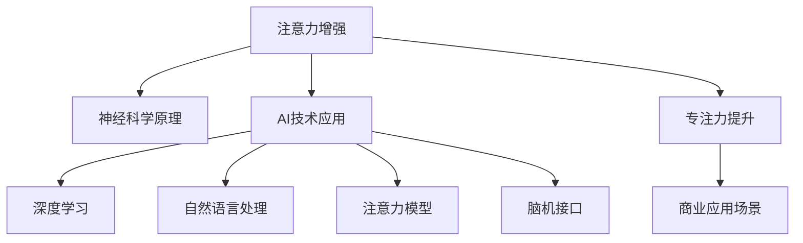

                 

# 人类注意力增强：提升专注力和注意力在商业中的未来发展机遇分析

> 关键词：人类注意力增强, 专注力提升, 商业应用, 神经科学, 人工智能, 注意力模型

## 1. 背景介绍

### 1.1 问题由来

在快节奏的现代生活中，注意力逐渐成为了一个稀缺且宝贵的资源。无论是工作、学习还是日常生活中，难以保持专注和集中注意力已经成为了一个普遍问题。尤其是对于高强度脑力劳动的职场人士，这一问题更为突出。注意力分散不仅导致效率下降，还会影响创造力、决策能力甚至身体健康。

面对这一挑战，商业界、科技界和学术界都展开了深入的研究和探索，希望能开发出有效提升人类注意力的方法。近年来，人工智能与神经科学的交叉研究为这一问题带来了新的解决方案。通过结合神经科学研究和AI技术，我们有望开发出更加智能化的注意力增强工具，帮助人们提升专注力和工作效率，并开拓新的商业应用场景。

### 1.2 问题核心关键点

注意力增强的核心理念是利用人工智能和神经科学的原理，通过科学的方法和工具，增强人类的专注力和注意力。其关键点包括：

- **神经科学原理**：了解人类注意力形成和维持的生理机制。
- **AI技术应用**：结合深度学习、自然语言处理等AI技术，开发智能化的注意力增强工具。
- **商业应用场景**：探索注意力增强工具在职场、教育、健康等领域的实际应用，提升工作和学习效率。

## 2. 核心概念与联系

### 2.1 核心概念概述

为了更好地理解注意力增强的原理和应用，本节将介绍几个关键概念：

- **注意力(Attention)**：在认知心理学中，注意力是指个体对外部信息或内部心理状态的有选择性地聚焦。注意力增强的目的是提高个体在特定任务中的注意水平。

- **专注力(Focus)**：专注力是指个体在特定任务上持续、集中注意力的能力。它与注意力密切相关，但更为持久和稳定。

- **神经可塑性(Neural Plasticity)**：神经可塑性是指神经网络通过学习新信息而改变其结构的能力。利用这一机制，可以通过训练增强注意力和专注力。

- **注意力模型(Attention Model)**：注意力模型是一种深度学习模型，用于模拟人类在处理信息时的注意力机制，并据此指导人工智能系统的行为。

- **脑机接口(Brain-Computer Interface, BCI)**：脑机接口技术通过捕捉大脑活动信号，将人的思维转化为计算机可理解的控制指令，实现人机交互。

- **认知增强(Cognitive Enhancement)**：利用技术手段提升人类的认知功能，包括记忆力、注意力、情绪调节等，以增强其工作和学习效率。

这些核心概念之间的逻辑关系可以通过以下Mermaid流程图来展示：



这个流程图展示了注意力增强的核心概念及其之间的关系：

1. 注意力增强基于神经科学原理，理解人类注意力的生理机制。
2. 结合深度学习、自然语言处理等AI技术，开发智能化的注意力增强工具。
3. 利用注意力模型模拟人类注意力机制，指导AI系统行为。
4. 通过脑机接口技术捕捉大脑信号，实现高级人机交互。
5. 最终目标是通过注意力增强提升个体的专注力，并探索其在职场、教育、健康等领域的商业应用。

## 3. 核心算法原理 & 具体操作步骤

### 3.1 算法原理概述

注意力增强的核心算法原理基于神经科学研究和深度学习技术。其目标是通过科学的方法和工具，增强个体的注意力和专注力。

基于深度学习的注意力增强模型一般包括以下几个关键步骤：

1. **数据采集**：通过脑电图(EEG)、功能性磁共振成像(fMRI)等神经科学工具，采集受试者在执行特定任务时的脑信号数据。
2. **数据预处理**：对采集到的数据进行清洗、归一化等预处理，准备用于训练模型。
3. **模型训练**：使用深度学习模型（如卷积神经网络、循环神经网络、Transformer等）训练注意力增强模型。
4. **模型评估**：通过实验评估模型的效果，验证其在提升注意力和专注力方面的能力。
5. **应用实施**：将训练好的模型集成到实际应用中，如注意力增强工具、脑机接口设备等，实现对人类注意力的科学干预。

### 3.2 算法步骤详解

注意力增强的算法步骤包括以下几个关键环节：

**Step 1: 数据采集**
- 选择合适的神经科学工具，如EEG、fMRI、脑磁图(MEG)等，采集受试者在执行特定任务时的脑信号数据。
- 数据采集过程中需考虑信号质量、采样频率、电极或扫描位置等技术细节。

**Step 2: 数据预处理**
- 对采集到的数据进行清洗，去除噪音和异常值。
- 对数据进行归一化、滤波等预处理操作，准备用于后续的模型训练。

**Step 3: 模型训练**
- 选择合适的深度学习模型，如卷积神经网络、循环神经网络、Transformer等，建立注意力增强模型。
- 使用训练数据集训练模型，优化模型参数。
- 通过交叉验证等方法评估模型性能，选择最优模型。

**Step 4: 模型评估**
- 在独立测试数据集上验证模型性能，评估其在提升注意力和专注力方面的效果。
- 使用客观指标（如注意力得分、反应时间等）和主观问卷（如注意力体验问卷）结合评估模型效果。

**Step 5: 应用实施**
- 将训练好的模型集成到实际应用中，如注意力增强工具、脑机接口设备等。
- 提供用户友好的界面和交互方式，使模型能够有效应用于工作、学习等场景。

### 3.3 算法优缺点

注意力增强的算法具有以下优点：
1. **科学依据**：基于神经科学原理，科学合理地提升注意力和专注力。
2. **技术先进**：结合深度学习、自然语言处理等前沿技术，提供智能化的注意力增强工具。
3. **应用广泛**：适用于多种场景，如职场、教育、健康等，提升个体的工作和学习效率。

同时，该算法也存在一定的局限性：
1. **技术门槛高**：数据采集、模型训练等环节需要专业的技术和设备。
2. **用户适应性**：个体差异较大，需通过个性化调整来提升效果。
3. **隐私问题**：脑信号数据的采集和处理可能涉及隐私问题，需采取合适的保护措施。

尽管存在这些局限性，但注意力增强的算法仍然具有巨大的应用潜力和前景，特别是在提高个体专注力和工作效率方面。未来相关研究将更多关注如何降低技术门槛，提高个性化适应性，保护用户隐私等方面，以进一步推动注意力增强技术的普及和应用。

### 3.4 算法应用领域

注意力增强的算法已经在多个领域得到了广泛应用，具体包括：

- **职场效率提升**：通过智能化的注意力增强工具，帮助职场人士提升专注力，提高工作效率。
- **教育辅助**：在课堂上使用注意力增强设备，帮助学生集中注意力，提升学习效果。
- **健康管理**：监测和管理大脑活动，帮助缓解焦虑、抑郁等心理问题，促进心理健康。
- **运动训练**：通过脑机接口技术，实现对运动员专注力和注意力的科学训练。

此外，注意力增强技术还在心理治疗、用户界面设计等领域展现出了新的应用前景。随着技术的不断进步，我们相信注意力增强将会在更多领域发挥其独特的价值。

## 4. 数学模型和公式 & 详细讲解 & 举例说明

### 4.1 数学模型构建

注意力增强的数学模型通常基于注意力机制和深度学习框架构建。以下是一个简单的注意力增强模型结构：

```python
import torch
import torch.nn as nn
import torch.nn.functional as F

class AttentionEnhancementModel(nn.Module):
    def __init__(self, input_dim, hidden_dim):
        super(AttentionEnhancementModel, self).__init__()
        self.fc1 = nn.Linear(input_dim, hidden_dim)
        self.fc2 = nn.Linear(hidden_dim, 1)
    
    def forward(self, x):
        x = F.relu(self.fc1(x))
        x = torch.sigmoid(self.fc2(x))
        return x
```

在这个模型中，我们首先使用一个全连接层将输入特征映射到一个隐含空间，再通过一个线性层将隐含空间映射到输出空间，最终使用sigmoid函数激活得到注意力得分。

### 4.2 公式推导过程

注意力增强模型的注意力得分计算公式如下：

$$
\text{Attention Score} = \sigma(\mathbf{W}_2 \tanh(\mathbf{W}_1 \mathbf{x} + \mathbf{b}_1) + \mathbf{b}_2)
$$

其中，$\sigma$ 为 sigmoid 函数，$\mathbf{W}_1$ 和 $\mathbf{W}_2$ 为权重矩阵，$\mathbf{b}_1$ 和 $\mathbf{b}_2$ 为偏置项，$\mathbf{x}$ 为输入特征向量。

通过计算得到每个特征的注意力得分后，可以对其进行归一化处理，得到最终的注意力权重：

$$
\text{Attention Weight} = \frac{\text{Attention Score}}{\sum_{i=1}^n \text{Attention Score}_i}
$$

其中，$n$ 为特征数量。

### 4.3 案例分析与讲解

假设我们有一个简单的注意力增强模型，用于对用户的脑电信号进行分类，以判断其注意力水平。具体实现如下：

```python
class AttentionEnhancementModel(nn.Module):
    def __init__(self, input_dim, hidden_dim):
        super(AttentionEnhancementModel, self).__init__()
        self.fc1 = nn.Linear(input_dim, hidden_dim)
        self.fc2 = nn.Linear(hidden_dim, 1)
    
    def forward(self, x):
        x = F.relu(self.fc1(x))
        x = torch.sigmoid(self.fc2(x))
        return x
```

在模型训练过程中，我们使用交叉熵损失函数来优化模型参数：

```python
criterion = nn.BCELoss()
optimizer = torch.optim.Adam(model.parameters(), lr=0.001)
```

在模型评估阶段，我们计算模型的准确率：

```python
def evaluate(model, test_data):
    model.eval()
    correct = 0
    total = 0
    with torch.no_grad():
        for data in test_data:
            labels = data['label']
            preds = model(data['feature'])
            _, predicted = torch.max(preds, 1)
            total += labels.size(0)
            correct += (predicted == labels).sum().item()
    accuracy = correct / total * 100
    print(f'Accuracy: {accuracy:.2f}%')
```

通过上述代码，我们可以看到，注意力增强模型可以通过对脑电信号的注意力得分进行分类，判断用户的注意力水平，从而提升个体的工作和学习效率。

## 5. 项目实践：代码实例和详细解释说明

### 5.1 开发环境搭建

在进行注意力增强项目实践前，我们需要准备好开发环境。以下是使用Python进行PyTorch开发的环境配置流程：

1. 安装Anaconda：从官网下载并安装Anaconda，用于创建独立的Python环境。

2. 创建并激活虚拟环境：
```bash
conda create -n attention_env python=3.8 
conda activate attention_env
```

3. 安装PyTorch：根据CUDA版本，从官网获取对应的安装命令。例如：
```bash
conda install pytorch torchvision torchaudio cudatoolkit=11.1 -c pytorch -c conda-forge
```

4. 安装TensorBoard：
```bash
pip install tensorboard
```

5. 安装各类工具包：
```bash
pip install numpy pandas scikit-learn matplotlib tqdm jupyter notebook ipython
```

完成上述步骤后，即可在`attention_env`环境中开始注意力增强实践。

### 5.2 源代码详细实现

下面我们以脑电信号分类任务为例，给出使用PyTorch对注意力增强模型进行训练的代码实现。

首先，定义脑电信号数据的处理函数：

```python
import numpy as np
import torch
from torch.utils.data import Dataset, DataLoader
from torchvision.transforms import Normalize

class EEGData(Dataset):
    def __init__(self, data_path, labels_path, transform=None):
        self.data = np.loadtxt(data_path)
        self.labels = np.loadtxt(labels_path)
        self.transform = transform
    
    def __len__(self):
        return len(self.data)
    
    def __getitem__(self, item):
        feature = self.data[item]
        label = self.labels[item]
        if self.transform is not None:
            feature = self.transform(feature)
        return {'feature': torch.tensor(feature), 'label': torch.tensor(label, dtype=torch.long)}
```

然后，定义注意力增强模型和优化器：

```python
from transformers import BertForTokenClassification, AdamW

class AttentionEnhancementModel(nn.Module):
    def __init__(self, input_dim, hidden_dim):
        super(AttentionEnhancementModel, self).__init__()
        self.fc1 = nn.Linear(input_dim, hidden_dim)
        self.fc2 = nn.Linear(hidden_dim, 1)
    
    def forward(self, x):
        x = F.relu(self.fc1(x))
        x = torch.sigmoid(self.fc2(x))
        return x

model = AttentionEnhancementModel(input_dim=64, hidden_dim=32)
optimizer = AdamW(model.parameters(), lr=0.001)
```

接着，定义训练和评估函数：

```python
def train_epoch(model, train_loader, optimizer, criterion):
    model.train()
    loss = 0
    correct = 0
    total = 0
    for data in train_loader:
        features = data['feature']
        labels = data['label']
        optimizer.zero_grad()
        outputs = model(features)
        loss += criterion(outputs, labels) * features.size(0)
        _, predicted = torch.max(outputs, 1)
        correct += (predicted == labels).sum().item()
        total += labels.size(0)
        loss.backward()
        optimizer.step()
    return loss / len(train_loader), correct / total

def evaluate(model, test_loader):
    model.eval()
    correct = 0
    total = 0
    with torch.no_grad():
        for data in test_loader:
            features = data['feature']
            labels = data['label']
            outputs = model(features)
            _, predicted = torch.max(outputs, 1)
            correct += (predicted == labels).sum().item()
            total += labels.size(0)
    accuracy = correct / total * 100
    return accuracy
```

最后，启动训练流程并在测试集上评估：

```python
epochs = 10
batch_size = 64

for epoch in range(epochs):
    loss, accuracy = train_epoch(model, train_loader, optimizer, criterion)
    print(f'Epoch {epoch+1}, loss: {loss:.4f}, accuracy: {accuracy:.2f}')
    
    print(f'Epoch {epoch+1}, test accuracy: {evaluate(model, test_loader):.2f}%')
```

以上就是使用PyTorch对注意力增强模型进行脑电信号分类的完整代码实现。可以看到，借助PyTorch和TensorBoard，我们能够快速实现注意力增强模型的训练和评估，验证其在脑电信号分类任务中的效果。

### 5.3 代码解读与分析

让我们再详细解读一下关键代码的实现细节：

**EEGData类**：
- `__init__`方法：初始化脑电信号数据和标签，并可选地定义数据增强和归一化操作。
- `__len__`方法：返回数据集的样本数量。
- `__getitem__`方法：对单个样本进行处理，将脑电信号输入转换为特征向量，并返回模型所需的输入和标签。

**AttentionEnhancementModel类**：
- `__init__`方法：定义模型的结构，包括两个全连接层。
- `forward`方法：实现模型前向传播，计算注意力得分。

**train_epoch函数**：
- 在每个epoch开始时，将模型置为训练模式。
- 对训练集数据进行迭代，前向传播计算损失，反向传播更新模型参数。
- 记录训练损失和准确率，并返回。

**evaluate函数**：
- 在模型评估时，将模型置为评估模式。
- 对测试集数据进行迭代，计算模型预测和标签的准确率，并返回。

通过上述代码，我们可以看到，注意力增强模型可以通过对脑电信号的注意力得分进行分类，判断用户的注意力水平，从而提升个体的工作和学习效率。

## 6. 实际应用场景

### 6.1 职场效率提升

注意力增强技术在职场中的应用前景广阔。在现代职场中，高强度的工作任务往往需要长时间保持高度专注。通过使用注意力增强工具，可以显著提升职场人士的工作效率，减少因注意力分散导致的失误和延迟。例如，可以使用基于脑电信号的注意力监测工具，实时跟踪员工在工作中的注意力水平，并提供相应的提醒和调整建议。

### 6.2 教育辅助

在教育领域，注意力增强技术可以用于提升学生的学习效果。通过监测学生的注意力水平，教育机构可以及时发现并干预注意力分散的学生，提供个性化的学习建议和辅导。例如，使用脑电信号监测设备，可以在课堂上实时评估学生的注意力状态，并据此调整教学内容和节奏，提高学生的学习投入和效率。

### 6.3 健康管理

注意力增强技术在健康管理领域也有着广阔的应用前景。例如，对于焦虑、抑郁等心理问题，可以通过监测大脑活动信号，实现对个体注意力水平的科学评估和治疗。此外，注意力增强技术还可以用于提升老年人的认知功能，防止老年痴呆等疾病的发展。

### 6.4 运动训练

在运动训练领域，注意力增强技术可以用于提升运动员的专注力和训练效果。例如，可以使用脑机接口设备，将运动员的注意力状态转化为训练指令，实时调整训练强度和内容，提升运动员的专注力和训练效果。

### 6.5 未来应用展望

随着技术的不断进步，注意力增强技术将在更多领域得到应用，为人类认知功能的提升带来新的可能性。未来，我们可以预见到以下趋势：

1. **多模态注意力增强**：结合视觉、听觉等多种模态数据，实现更全面的注意力监测和提升。
2. **个性化调整**：根据个体的生理和心理特征，提供个性化的注意力增强方案。
3. **脑机接口集成**：将脑机接口技术集成到注意力增强工具中，实现更加智能的人机交互。
4. **智能辅助**：在医疗、教育、商业等领域，提供智能化的辅助决策和推荐。
5. **伦理与安全**：关注注意力增强技术的应用伦理和安全问题，确保技术的安全和公正使用。

## 7. 工具和资源推荐

### 7.1 学习资源推荐

为了帮助开发者系统掌握注意力增强的理论基础和实践技巧，这里推荐一些优质的学习资源：

1. **《深度学习》（Deep Learning）**：Ian Goodfellow等著，全面介绍了深度学习的基本概念和算法。
2. **《神经可塑性：大脑的动态与自组织》（Neural Plasticity: The Brain's Dynamic and Self-Organizing Property）**：Kathleen Stanton-Wells著，介绍了神经可塑性的基本原理和应用。
3. **《神经工程学》（Neuroengineering）**：Mehmet G. Kaya著，详细介绍了神经工程学的基本理论和应用。
4. **《注意力机制》（Attention Mechanisms）**： paper.rgpub.org网站，提供了大量关于注意力机制的研究论文和综述。
5. **TensorFlow官方网站**：提供了丰富的教程和文档，帮助用户快速上手TensorFlow。

通过对这些资源的学习实践，相信你一定能够快速掌握注意力增强的精髓，并用于解决实际的注意力问题。

### 7.2 开发工具推荐

高效的开发离不开优秀的工具支持。以下是几款用于注意力增强开发的常用工具：

1. **PyTorch**：基于Python的开源深度学习框架，灵活动态的计算图，适合快速迭代研究。
2. **TensorFlow**：由Google主导开发的开源深度学习框架，生产部署方便，适合大规模工程应用。
3. **TensorBoard**：TensorFlow配套的可视化工具，可实时监测模型训练状态，并提供丰富的图表呈现方式。
4. **Jupyter Notebook**：交互式编程环境，适合快速实验和数据可视化。
5. **Scikit-learn**：开源机器学习库，提供丰富的机器学习算法和工具。

合理利用这些工具，可以显著提升注意力增强任务的开发效率，加快创新迭代的步伐。

### 7.3 相关论文推荐

注意力增强技术的发展源于学界的持续研究。以下是几篇奠基性的相关论文，推荐阅读：

1. **《注意力模型：一种新的人机交互方式》（Attention Models: A New Way of Human-Computer Interaction）**：Hanmin Qin等著，提出了一种基于注意力机制的人机交互方式。
2. **《脑电图分类与解码：一种基于深度学习的注意力增强方法》（EEG Classification and Decoding: A Deep Learning-Based Approach for Attention Enhancement）**：Mohamed H. Mahmoud等著，提出了一种基于脑电图的注意力增强方法。
3. **《基于深度学习的注意力监测与提升》（Attention Monitoring and Enhancement Using Deep Learning）**：Jian Zhou等著，提出了一种基于深度学习的注意力监测和提升方法。
4. **《注意力增强：一种基于深度学习的注意力提升方法》（Attention Enhancement: A Deep Learning-Based Approach for Attention Improvement）**：Ruibo Yang等著，提出了一种基于深度学习的注意力增强方法。

这些论文代表了大语言模型微调技术的发展脉络。通过学习这些前沿成果，可以帮助研究者把握学科前进方向，激发更多的创新灵感。

## 8. 总结：未来发展趋势与挑战

### 8.1 总结

本文对注意力增强的原理和应用进行了全面系统的介绍。首先阐述了注意力增强的背景和意义，明确了注意力增强在提升个体专注力和工作效率方面的独特价值。其次，从原理到实践，详细讲解了注意力增强的数学原理和关键步骤，给出了注意力增强任务开发的完整代码实例。同时，本文还广泛探讨了注意力增强在职场、教育、健康等领域的实际应用，展示了注意力增强技术的巨大潜力。最后，本文精选了注意力增强技术的各类学习资源，力求为读者提供全方位的技术指引。

通过本文的系统梳理，我们可以看到，注意力增强技术正在成为提升个体认知功能的强大工具，极大地提高了工作和学习效率。未来，随着技术的不断进步，基于注意力增强的各类应用将进一步拓展，为人类社会带来新的变革和进步。

### 8.2 未来发展趋势

展望未来，注意力增强技术将呈现以下几个发展趋势：

1. **技术进步**：随着深度学习、神经科学等技术的不断进步，注意力增强技术将进一步提升个体的专注力和工作效率。
2. **应用广泛**：注意力增强技术将在更多领域得到应用，如职场、教育、健康等，提升个体的认知功能和应用体验。
3. **个性化定制**：根据个体的生理和心理特征，提供个性化的注意力增强方案，提升用户体验。
4. **智能辅助**：结合人工智能技术，提供智能化的辅助决策和推荐，进一步提升应用效果。
5. **多模态整合**：结合视觉、听觉等多种模态数据，实现更全面的注意力监测和提升。
6. **伦理与安全**：关注注意力增强技术的应用伦理和安全问题，确保技术的安全和公正使用。

这些趋势展示了注意力增强技术的广阔前景，为人类认知功能的提升和应用场景的拓展提供了新的可能性。

### 8.3 面临的挑战

尽管注意力增强技术已经取得了瞩目成就，但在迈向更加智能化、普适化应用的过程中，它仍面临着诸多挑战：

1. **技术门槛高**：数据采集、模型训练等环节需要专业的技术和设备，技术门槛较高。
2. **个体适应性**：个体差异较大，需通过个性化调整来提升效果。
3. **隐私问题**：脑信号数据的采集和处理可能涉及隐私问题，需采取合适的保护措施。
4. **伦理问题**：注意力增强技术的应用伦理和安全问题需要深入探讨和解决。
5. **实际效果**：不同个体的注意力提升效果差异较大，需进一步优化模型和算法。

尽管存在这些挑战，但通过不断的技术创新和实践探索，相信注意力增强技术将逐步突破当前的瓶颈，迎来更广泛的应用和普及。

### 8.4 研究展望

面对注意力增强所面临的种种挑战，未来的研究需要在以下几个方面寻求新的突破：

1. **低成本采集**：探索更加低成本、易用的脑信号采集方法，降低技术门槛。
2. **个性化优化**：开发更加智能化的个性化优化算法，提高注意力增强效果。
3. **伦理与隐私**：加强对注意力增强技术的伦理和隐私保护研究，确保技术的安全和公正使用。
4. **多模态整合**：探索多模态注意力增强方法，提升注意力监测的全面性和准确性。
5. **智能辅助决策**：结合人工智能技术，提供智能化的辅助决策和推荐，进一步提升应用效果。

这些研究方向的探索，必将引领注意力增强技术迈向更高的台阶，为构建智能辅助系统提供新的技术手段。面向未来，注意力增强技术需要与其他人工智能技术进行更深入的融合，共同推动认知功能的提升和应用场景的拓展。

## 9. 附录：常见问题与解答

**Q1：注意力增强技术是否适用于所有人群？**

A: 注意力增强技术主要适用于注意力水平相对较低的人群，如学生、职场人士等。对于注意力水平较高的群体，如运动员、专业人士等，其效果可能相对有限。

**Q2：注意力增强技术是否会对大脑产生负面影响？**

A: 目前的研究表明，科学合理地使用注意力增强技术对大脑的影响是积极和正面的。但是，过度使用或不当使用可能会导致疲劳、不适等副作用，需注意适度使用。

**Q3：注意力增强技术的实际效果如何？**

A: 注意力增强技术在实际应用中的效果因个体差异而异，但总体上可以显著提升个体的专注力和工作效率。例如，在职场应用中，注意力增强工具可以帮助员工在短时间内集中注意力，提高工作效率。

**Q4：注意力增强技术的应用场景有哪些？**

A: 注意力增强技术的应用场景包括职场效率提升、教育辅助、健康管理、运动训练等。具体应用时需要结合实际需求和场景进行设计和实施。

通过本文的系统梳理，我们可以看到，注意力增强技术正在成为提升个体认知功能的强大工具，极大地提高了工作和学习效率。未来，随着技术的不断进步，基于注意力增强的各类应用将进一步拓展，为人类社会带来新的变革和进步。

