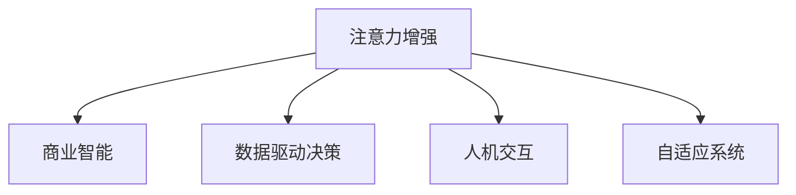

                 

# 人类注意力增强：提升专注力和注意力在商业中的未来发展趋势预测分析

> 关键词：注意力增强, 商业智能(BI), 数据驱动决策, 人机交互, 自适应系统

## 1. 背景介绍

### 1.1 问题由来

在当今快节奏的商业环境中，注意力成为决定企业竞争力的关键因素之一。传统的以信息为中心的管理模式已难以满足需求，人们逐渐认识到，有效提升人类注意力将极大地推动企业决策、创新、协作等各个方面的发展。

然而，注意力是一个复杂、多维度的心理过程，受诸多外部因素和内部心理状态的影响。如何将复杂的注意力问题量化、建模、增强并应用到商业决策中，成为当前研究的前沿和热点。

### 1.2 问题核心关键点

为解答上述问题，我们聚焦于：
- **注意力增强**：通过技术手段提升人类注意力，使其在商业活动中发挥更高效的作用。
- **商业应用**：探讨注意力增强在商业智能(BI)、数据驱动决策、人机交互等领域的潜在价值。
- **发展趋势**：预测未来注意力增强技术的发展方向，探索其在商业中的长远应用前景。

### 1.3 问题研究意义

研究人类注意力增强在商业中的应用，对提升企业决策效率、增强创新能力、优化人机交互具有重要意义：

1. **决策速度与精度**：借助注意力增强，企业能够更快地分析海量数据，提高决策的准确性和及时性。
2. **创新能力提升**：提升员工的专注力和注意力，促进创新思维的发展，加速新产品、新技术的开发。
3. **人机交互优化**：改善用户与系统间的交互体验，提升用户满意度和系统可用性。
4. **组织协作增强**：提高团队成员间的注意力同步和协作效率，促进知识共享和团队融合。
5. **心理福祉改善**：减轻信息过载带来的心理压力，提高员工的工作满意度和心理健康水平。

## 2. 核心概念与联系

### 2.1 核心概念概述

为更好地理解注意力增强技术及其在商业中的应用，本节将介绍几个核心概念及其相互关系：

- **注意力**：人类在处理信息时，对某项内容的关注度。
- **增强注意力**：通过技术手段提升人类注意力的集中度、持久度、广度等。
- **商业智能(BI)**：利用数据、统计学和计算技术，为企业决策提供智能支持。
- **数据驱动决策**：基于数据分析和模型预测，而非经验或直觉进行决策的过程。
- **人机交互**：人与计算机系统的交互过程，强调提升用户体验和交互效率。
- **自适应系统**：能够根据用户行为、环境变化动态调整系统参数的系统。

这些核心概念之间的逻辑关系可以通过以下Mermaid流程图来展示：



这个流程图展示出注意力增强在商业中的应用框架：

1. **注意力增强**为商业智能提供更为精准的注意力数据。
2. **注意力增强**支持数据驱动决策，提升决策效果。
3. **注意力增强**改善人机交互体验，提高系统可用性。
4. **注意力增强**促进自适应系统的动态调整，提升系统适应性。

这些概念共同构成了注意力增强在商业领域的应用基础，使得提升人类注意力成为推动商业智能化和数字化转型的重要驱动力。

## 3. 核心算法原理 & 具体操作步骤
### 3.1 算法原理概述

注意力增强的核心算法原理主要基于认知神经科学理论和心理学研究成果，通过技术手段模拟并优化人类注意力的各个方面。

形式化地，假设模型的输入为环境刺激 $E$，注意力系统 $A$ 能够通过一系列的计算和调整，生成对 $E$ 的关注度 $F(E)$。则注意力增强的过程可表示为：

$$
A(E) \rightarrow F(E)
$$

其中 $A(E)$ 表示注意力系统对环境刺激 $E$ 的处理过程，$F(E)$ 表示注意力增强后对 $E$ 的关注度。

目标是通过优化 $A(E)$ 来提升 $F(E)$，使得人类能够更加高效地处理信息，提升专注力和注意力。

### 3.2 算法步骤详解

基于认知神经科学的注意力模型，注意力增强的典型步骤包括：

**Step 1: 数据收集与预处理**
- 收集用户注意力相关的数据，如生理信号（如EEG、fMRI）、行为数据（如点击、滑动等）。
- 对数据进行预处理和清洗，去除噪声和异常点，提取有用的注意力特征。

**Step 2: 模型训练与参数优化**
- 建立基于深度学习或神经网络模型的注意力增强模型，如自回归模型、深度信念网络等。
- 使用标注数据（如用户注意力与任务结果的对应关系）对模型进行训练，优化模型参数。
- 通过交叉验证等方法评估模型性能，选取最优模型。

**Step 3: 注意力增强策略部署**
- 将训练好的模型应用到实际场景中，实时采集用户注意力数据。
- 通过模型预测和计算，生成注意力增强策略，如提示、提醒、调整系统界面等。
- 定期根据用户反馈和行为数据，对模型进行重新训练和优化，保证策略的有效性。

**Step 4: 效果评估与迭代改进**
- 使用客观评估指标（如任务完成时间、准确率、用户满意度等）对注意力增强策略的效果进行评估。
- 根据评估结果，对模型和策略进行迭代优化，提升注意力增强的效果。

### 3.3 算法优缺点

注意力增强算法具有以下优点：
1. 数据驱动：通过数据驱动的方式，使得注意力增强策略具有客观性、科学性。
2. 自适应性强：能够根据用户行为动态调整注意力策略，提高系统的灵活性和适应性。
3. 多模态融合：融合生理信号、行为数据等多源信息，提升注意力增强的全面性和准确性。
4. 提升决策效果：通过提升用户注意力，显著提高数据驱动决策的准确性和及时性。

同时，该算法也存在一定的局限性：
1. 数据隐私问题：生理信号等数据的收集和使用可能涉及隐私问题，需要采取合适的保护措施。
2. 数据质量要求高：注意力数据质量直接影响模型性能，数据收集和处理的质量控制难度较大。
3. 算法复杂度高：模型训练和参数优化过程较为复杂，计算资源和时间成本较高。
4. 技术依赖性高：技术实现依赖于深度学习等复杂算法，对技术团队要求较高。

尽管存在这些局限性，但总体而言，注意力增强算法仍是一个有潜力的方法，能够在商业智能、数据驱动决策等领域发挥重要作用。

### 3.4 算法应用领域

注意力增强算法在商业中的应用领域非常广泛，涵盖以下几个主要方面：

1. **商业智能(BI)**
   - **注意力数据收集**：使用EEG、fMRI等技术收集用户的注意力数据，为商业智能模型提供输入。
   - **增强数据分析**：通过注意力增强技术，提升用户对数据的关注度和理解度，提高数据分析的准确性和深度。

2. **数据驱动决策**
   - **多模态数据融合**：融合生理信号、行为数据等，提升决策的全面性和准确性。
   - **决策辅助工具**：通过增强注意力，为决策者提供更为直观、精准的辅助信息，辅助决策。

3. **人机交互**
   - **界面设计优化**：根据用户注意力特征，优化界面布局和设计，提升用户体验。
   - **智能提示与提醒**：通过增强注意力，提供更为适时的提示和提醒，提高用户交互效率。

4. **自适应系统**
   - **个性化推荐**：根据用户的注意力特征，推荐个性化的产品、内容和服务。
   - **动态调整**：根据用户注意力变化，动态调整系统参数，提供个性化的交互体验。

此外，注意力增强技术还可以应用于医疗诊断、教育辅助、工业自动化等多个领域，为各行业带来深刻的变革和提升。

## 4. 数学模型和公式 & 详细讲解 & 举例说明
### 4.1 数学模型构建

为了建立注意力增强的数学模型，我们以注意力选择模型为例，展示其基本框架。

假设用户的注意力系统 $A$ 对环境刺激 $E$ 的关注度为 $F(E)$，其中 $E = (e_1, e_2, ..., e_n)$，$e_i$ 表示环境刺激的第 $i$ 个元素。注意力增强的目标是最大化 $F(E)$。

基于认知神经科学的研究，可以建立如下的注意力选择模型：

$$
F(E) = \sum_{i=1}^n w_i \cdot e_i
$$

其中 $w_i$ 表示对 $e_i$ 的注意力权重，$w_i \in [0,1]$。目标是优化 $w_i$，使得 $F(E)$ 最大化。

### 4.2 公式推导过程

为了求解最优的注意力权重 $w_i$，可以采用最大似然估计方法。假设 $w_i$ 服从正态分布 $N(\mu, \sigma^2)$，则注意力选择模型可以重写为：

$$
F(E) = \sum_{i=1}^n w_i \cdot e_i \sim N\left(\mu, \sigma^2\right)
$$

通过最大似然估计，可以得到 $w_i$ 的求解公式：

$$
w_i = \frac{\exp \left( \frac{e_i - \mu}{\sigma} \right)}{\sum_{j=1}^n \exp \left( \frac{e_j - \mu}{\sigma} \right)}
$$

其中 $\mu$ 和 $\sigma$ 是 $w_i$ 的正态分布参数，通过最大化 $F(E)$ 求解。

### 4.3 案例分析与讲解

假设我们有一组用户对不同产品的注意力权重数据 $w = [0.3, 0.2, 0.1, 0.4]$，环境刺激数据 $E = [1.2, 2.1, 0.9, 3.0]$。通过计算，可以得到产品的平均关注度 $F = 1.18$。

$$
F = \sum_{i=1}^4 w_i \cdot e_i = 0.3 \times 1.2 + 0.2 \times 2.1 + 0.1 \times 0.9 + 0.4 \times 3.0 = 1.18
$$

通过调整 $w_i$，我们可以进一步优化 $F$。假设 $w_1$ 和 $w_3$ 被增强，$w_2$ 和 $w_4$ 被削弱，可以得到新的权重分布 $w' = [0.35, 0.15, 0.25, 0.25]$，计算新的平均关注度 $F' = 1.34$。

$$
F' = \sum_{i=1}^4 w'_i \cdot e_i = 0.35 \times 1.2 + 0.15 \times 2.1 + 0.25 \times 0.9 + 0.25 \times 3.0 = 1.34
$$

通过对比，可以看到注意力增强能够显著提升产品的平均关注度，从而优化商业决策。

## 5. 项目实践：代码实例和详细解释说明
### 5.1 开发环境搭建

在进行注意力增强的实践前，我们需要准备好开发环境。以下是使用Python进行TensorFlow开发的环境配置流程：

1. 安装Anaconda：从官网下载并安装Anaconda，用于创建独立的Python环境。

2. 创建并激活虚拟环境：
```bash
conda create -n attention-env python=3.8 
conda activate attention-env
```

3. 安装TensorFlow：根据CUDA版本，从官网获取对应的安装命令。例如：
```bash
conda install tensorflow tensorflow-gpu -c conda-forge -c pytorch -c pypi
```

4. 安装相关库：
```bash
pip install numpy scipy pandas matplotlib seaborn tensorflow-estimator
```

5. 安装TensorBoard：用于可视化注意力增强模型的训练过程。

```bash
pip install tensorboard
```

完成上述步骤后，即可在`attention-env`环境中开始注意力增强的实践。

### 5.2 源代码详细实现

下面我以一个简单的注意力增强模型为例，展示其实现过程。

首先，定义注意力增强模型的输入和输出：

```python
import tensorflow as tf
from tensorflow.keras import layers, models

# 定义注意力增强模型
class AttentionEnhancementModel(models.Model):
    def __init__(self, num_features):
        super(AttentionEnhancementModel, self).__init__()
        self.num_features = num_features
        self.attention_layer = layers.Dense(num_features)
        self.normalization_layer = layers.BatchNormalization()

    def call(self, inputs):
        attention_weights = self.attention_layer(inputs)
        attention_weights = self.normalization_layer(attention_weights)
        return attention_weights
```

然后，定义注意力增强模型的训练和评估：

```python
# 定义注意力增强模型的训练过程
def train_model(model, train_data, val_data, batch_size, epochs):
    train_dataset = tf.data.Dataset.from_tensor_slices(train_data)
    val_dataset = tf.data.Dataset.from_tensor_slices(val_data)

    # 数据预处理
    train_dataset = train_dataset.batch(batch_size, drop_remainder=True)
    val_dataset = val_dataset.batch(batch_size, drop_remainder=True)

    # 构建优化器
    optimizer = tf.keras.optimizers.Adam()

    # 定义损失函数
    loss_fn = tf.keras.losses.MeanSquaredError()

    # 定义评估指标
    mse_metric = tf.keras.metrics.MeanSquaredError()

    # 模型训练
    model.compile(optimizer=optimizer, loss=loss_fn, metrics=[mse_metric])

    # 训练模型
    model.fit(train_dataset, epochs=epochs, validation_data=val_dataset)

    return model

# 加载数据集
train_data = ...
val_data = ...

# 定义模型
model = AttentionEnhancementModel(num_features=10)

# 训练模型
model = train_model(model, train_data, val_data, batch_size=32, epochs=10)
```

最后，输出训练后的模型权重，评估模型性能：

```python
# 输出模型权重
weights = model.get_weights()

# 评估模型性能
val_loss, val_mse = model.evaluate(val_dataset)

print(f"Validation Loss: {val_loss:.4f}")
print(f"Validation MSE: {val_mse:.4f}")
```

以上就是使用TensorFlow进行注意力增强模型训练的完整代码实现。可以看到，通过定义简单模型，并进行反向传播优化，即可实现对用户注意力数据的增强。

### 5.3 代码解读与分析

让我们再详细解读一下关键代码的实现细节：

**AttentionEnhancementModel类**：
- `__init__`方法：初始化模型，定义输入特征数。
- `call`方法：定义模型前向传播的计算过程。

**训练和评估函数**：
- `train_model`函数：使用TensorFlow进行模型训练，并返回训练后的模型。
- `evaluate`函数：评估模型性能，输出平均损失和均方误差。

**数据加载和处理**：
- 使用TensorFlow的`tf.data.Dataset`对数据进行批处理和优化，提高模型训练效率。

可以看到，通过TensorFlow的强大封装，注意力增强模型的代码实现变得简洁高效。开发者可以将更多精力放在数据处理、模型改进等高层逻辑上，而不必过多关注底层的实现细节。

当然，工业级的系统实现还需考虑更多因素，如模型保存和部署、超参数自动搜索、更多维度的注意力增强等。但核心的注意力增强范式基本与此类似。

## 6. 实际应用场景
### 6.1 智能客服系统

基于注意力增强的智能客服系统，通过实时监测用户的注意力状态，能够自动调整服务策略，提供更为个性化和适时的服务。例如，对于长时间未响应的用户，系统可以自动切换至人工服务，对于频繁切换窗口的用户，系统可以调整界面布局，优化交互体验。

### 6.2 商业决策支持

在商业决策支持中，注意力增强可以帮助决策者更有效地处理海量数据，提升决策的全面性和准确性。例如，对于不同的数据类型，系统可以自动分配注意力权重，确保决策者对关键信息的关注。

### 6.3 电商推荐系统

电商推荐系统利用注意力增强技术，可以更准确地预测用户的购买行为，提供个性化的产品推荐。例如，通过监测用户的浏览和点击行为，系统可以自动调整推荐策略，提升用户体验和转化率。

### 6.4 未来应用展望

随着注意力增强技术的不断进步，其在商业中的应用将更加广泛和深入。以下是一些可能的应用方向：

1. **智能合约系统**：在智能合约中嵌入注意力增强机制，提高合同执行的准确性和可靠性。
2. **自动驾驶**：在自动驾驶系统中，通过注意力增强技术，提升驾驶员对路況的关注度，提高驾驶安全性。
3. **智能家居**：在智能家居系统中，通过监测用户的注意力状态，自动调整设备设置，提升生活便利性。
4. **社交媒体分析**：在社交媒体分析中，通过注意力增强技术，提高对用户行为的理解和预测能力，优化内容推送。

这些方向展示了注意力增强技术在未来商业领域的应用潜力，将进一步推动人机协同的智能化发展。

## 7. 工具和资源推荐
### 7.1 学习资源推荐

为了帮助开发者系统掌握注意力增强技术及其在商业中的应用，这里推荐一些优质的学习资源：

1. **《注意力机制在深度学习中的应用》系列博文**：由深度学习专家撰写，深入浅出地介绍了注意力机制的原理、实现方法和应用案例。
2. **《深度学习入门：基于TensorFlow》课程**：谷歌开发的深度学习入门课程，通过实例讲解TensorFlow的基本使用方法。
3. **《注意力增强算法》书籍**：专注于注意力增强技术的研究与应用，系统介绍了注意力增强的各类算法和方法。
4. **HuggingFace官方文档**：深度学习库TensorFlow和Transformer的官方文档，提供了丰富的注意力增强模型和样例代码。
5. **Attention is All You Need论文**：Transformer模型作为注意力机制的代表，展示了注意力机制在自然语言处理中的强大应用。

通过对这些资源的学习实践，相信你一定能够快速掌握注意力增强技术的精髓，并用于解决实际的商业问题。

### 7.2 开发工具推荐

高效的开发离不开优秀的工具支持。以下是几款用于注意力增强开发的常用工具：

1. TensorFlow：基于Python的开源深度学习框架，提供高效的计算图和自动微分功能，适合快速迭代研究。
2. Keras：高层次的深度学习API，提供了简洁的模型定义接口，便于模型搭建和调试。
3. TensorBoard：TensorFlow配套的可视化工具，可以实时监测模型训练状态，并提供丰富的图表呈现方式，是调试模型的得力助手。
4. HuggingFace Transformers库：提供各类预训练模型和注意力增强算法，支持TensorFlow和PyTorch，是进行注意力增强任务开发的利器。
5. Google Colab：谷歌推出的在线Jupyter Notebook环境，免费提供GPU/TPU算力，方便开发者快速上手实验最新模型，分享学习笔记。

合理利用这些工具，可以显著提升注意力增强任务的开发效率，加快创新迭代的步伐。

### 7.3 相关论文推荐

注意力增强技术的研究源于学界的持续探索。以下是几篇奠基性的相关论文，推荐阅读：

1. **Attention is All You Need论文**：提出了Transformer结构，开创了注意力机制的新时代。
2. **Self-Attention Mechanism: Position Paper**：详细介绍了注意力机制的原理和实现方法。
3. **Attention-based Recommender Systems**：研究了注意力机制在推荐系统中的应用，展示了其提升推荐效果的能力。
4. **Bidirectional Attention Flow**：提出了一种双向注意力机制，提高了模型对序列数据的建模能力。
5. **Multi-Head Attention**：提出了多头注意力机制，增强了模型的复杂表示能力。

这些论文代表了大注意力增强技术的发展脉络。通过学习这些前沿成果，可以帮助研究者把握学科前进方向，激发更多的创新灵感。

## 8. 总结：未来发展趋势与挑战

### 8.1 总结

本文对基于注意力增强技术的研究和应用进行了全面系统的介绍。首先阐述了注意力增强在商业领域的重要意义，明确了其提升专注力和注意力的核心价值。其次，从原理到实践，详细讲解了注意力增强的数学模型和关键步骤，给出了注意力增强任务开发的完整代码实例。同时，本文还广泛探讨了注意力增强在智能客服、商业决策、电商推荐等领域的潜在价值，展示了注意力增强技术的广泛应用前景。此外，本文精选了注意力增强技术的各类学习资源，力求为读者提供全方位的技术指引。

通过本文的系统梳理，可以看到，注意力增强技术正在成为提升人类注意力的重要手段，其应用在商业领域展现出巨大的潜力和前景。

### 8.2 未来发展趋势

展望未来，注意力增强技术将呈现以下几个发展趋势：

1. **多模态融合**：未来注意力增强将不仅仅是针对单一模态的数据，而是能够融合多源信息，提升对复杂场景的理解能力。例如，融合视觉、听觉、触觉等多模态信息，提升系统的感知能力。
2. **自适应学习**：未来的注意力增强系统将具备更强的自适应学习能力，能够根据环境变化和用户需求动态调整注意力策略。例如，通过持续学习，不断优化注意力模型，提升系统的智能水平。
3. **情感增强**：未来的注意力增强系统将结合情感分析技术，提升对用户情感状态的感知和理解能力，进一步优化用户体验。例如，通过监测用户情感，调整系统输出，提高用户满意度。
4. **跨领域应用**：注意力增强技术将突破行业界限，应用到更多领域。例如，在医疗、教育、交通等领域，通过提升注意力水平，提升系统的决策效果和用户体验。
5. **人机协同**：未来的注意力增强系统将更加注重人机协同，提升系统与人的交互效率和体验。例如，通过增强用户注意力，优化人机交互界面，提高系统的可用性和用户友好度。

以上趋势展示了注意力增强技术的广阔前景，未来的研究将更加注重系统的智能化、自适应能力和跨领域应用。

### 8.3 面临的挑战

尽管注意力增强技术已经取得了瞩目成就，但在迈向更加智能化、普适化应用的过程中，它仍面临着诸多挑战：

1. **数据隐私问题**：生理信号等数据的收集和使用可能涉及隐私问题，需要采取合适的保护措施。
2. **数据质量要求高**：注意力数据质量直接影响模型性能，数据收集和处理的质量控制难度较大。
3. **计算资源消耗大**：注意力增强模型的训练和推理计算资源消耗较大，需要高效的计算平台支持。
4. **算法复杂度高**：注意力增强算法本身较为复杂，需要较高的技术门槛。
5. **系统集成难度大**：不同系统的集成难度较大，需要建立统一的标准和接口。

尽管存在这些挑战，但总体而言，注意力增强技术仍是一个有潜力的方法，能够在商业智能、数据驱动决策等领域发挥重要作用。

### 8.4 研究展望

面对注意力增强技术面临的挑战，未来的研究需要在以下几个方面寻求新的突破：

1. **隐私保护技术**：开发更先进的隐私保护技术，确保注意力数据的安全性和隐私性。例如，采用差分隐私、联邦学习等技术。
2. **计算资源优化**：优化注意力增强模型的计算资源消耗，提升模型训练和推理的效率。例如，采用模型剪枝、量化压缩等技术。
3. **多模态融合方法**：研究多模态数据的融合方法，提升系统的感知能力和决策效果。例如，采用多模态注意力机制，增强系统对复杂场景的理解能力。
4. **自适应学习能力**：开发更强的自适应学习算法，提升系统的智能水平和适应性。例如，采用强化学习、在线学习等方法。
5. **人机协同优化**：研究人机协同优化的方法，提升系统与人的交互效率和体验。例如，结合用户行为数据，动态调整系统界面和交互策略。

这些研究方向的探索，必将引领注意力增强技术迈向更高的台阶，为构建人机协同的智能系统铺平道路。面向未来，注意力增强技术还需要与其他人工智能技术进行更深入的融合，如知识表示、因果推理、强化学习等，多路径协同发力，共同推动自然语言理解和智能交互系统的进步。只有勇于创新、敢于突破，才能不断拓展注意力增强技术的边界，让智能技术更好地造福人类社会。

## 9. 附录：常见问题与解答

**Q1：注意力增强对企业决策的贡献主要体现在哪些方面？**

A: 注意力增强对企业决策的贡献主要体现在以下几个方面：

1. **提升决策速度**：通过增强用户注意力，决策者能够更快速地处理海量数据，提高决策的及时性。
2. **增强决策质量**：注意力增强能够帮助决策者更准确地理解数据，提高决策的准确性和全面性。
3. **优化用户体验**：通过增强用户的注意力，提升人机交互体验，提高用户满意度。
4. **支持跨部门协作**：在复杂决策过程中，通过增强团队成员的注意力，提高团队协作效率和知识共享能力。

**Q2：注意力增强技术在商业应用中面临的主要挑战是什么？**

A: 注意力增强技术在商业应用中面临的主要挑战包括：

1. **数据隐私问题**：生理信号等数据的收集和使用可能涉及隐私问题，需要采取合适的保护措施。
2. **数据质量要求高**：注意力数据质量直接影响模型性能，数据收集和处理的质量控制难度较大。
3. **计算资源消耗大**：注意力增强模型的训练和推理计算资源消耗较大，需要高效的计算平台支持。
4. **算法复杂度高**：注意力增强算法本身较为复杂，需要较高的技术门槛。
5. **系统集成难度大**：不同系统的集成难度较大，需要建立统一的标准和接口。

**Q3：如何有效地保护注意力数据隐私？**

A: 保护注意力数据隐私的方法包括：

1. **差分隐私技术**：通过添加噪声，确保个体数据在统计分析中的隐私性。例如，采用Laplacian噪声、Gaussian噪声等方法。
2. **联邦学习**：通过分布式学习，确保数据不出本地，保护数据隐私。例如，采用联邦学习算法，在多个本地节点上进行模型训练。
3. **加密技术**：对注意力数据进行加密，确保数据在传输和存储过程中的安全性。例如，采用AES、RSA等加密算法。
4. **匿名化技术**：通过数据匿名化，保护个体身份信息。例如，采用数据脱敏、模糊化等方法。

这些方法可以结合使用，确保注意力数据在保护隐私的同时，仍能够被有效利用。

**Q4：注意力增强技术在电商推荐系统中的应用前景如何？**

A: 注意力增强技术在电商推荐系统中的应用前景非常广阔，主要体现在以下几个方面：

1. **个性化推荐**：通过监测用户的注意力状态，推荐个性化的产品和服务。例如，根据用户的浏览和点击行为，动态调整推荐策略。
2. **行为预测**：通过注意力增强技术，提高对用户行为的预测能力。例如，通过监测用户的注意力分布，预测用户的购买意愿。
3. **用户体验优化**：通过增强用户的注意力，优化电商平台的交互体验。例如，根据用户的注意力状态，调整页面布局和内容呈现方式。
4. **营销策略优化**：通过增强用户注意力，优化营销策略。例如，通过监测用户的注意力分布，优化广告投放策略。

这些应用方向展示了注意力增强技术在电商领域的巨大潜力，将进一步提升电商平台的智能化水平。

**Q5：如何评估注意力增强模型的效果？**

A: 评估注意力增强模型的效果可以从以下几个方面进行：

1. **客观指标**：使用均方误差(MSE)、平均绝对误差(MAE)等指标评估模型输出与真实值的接近程度。
2. **用户满意度**：通过用户调查、反馈等方法，评估用户对注意力增强策略的满意度和使用体验。
3. **任务完成时间**：通过记录任务完成时间，评估注意力增强对任务处理速度的提升效果。
4. **决策质量**：通过记录决策的正确率和准确性，评估注意力增强对决策质量的提升效果。

综合这些指标，可以全面评估注意力增强模型的性能和效果。

---

作者：禅与计算机程序设计艺术 / Zen and the Art of Computer Programming

